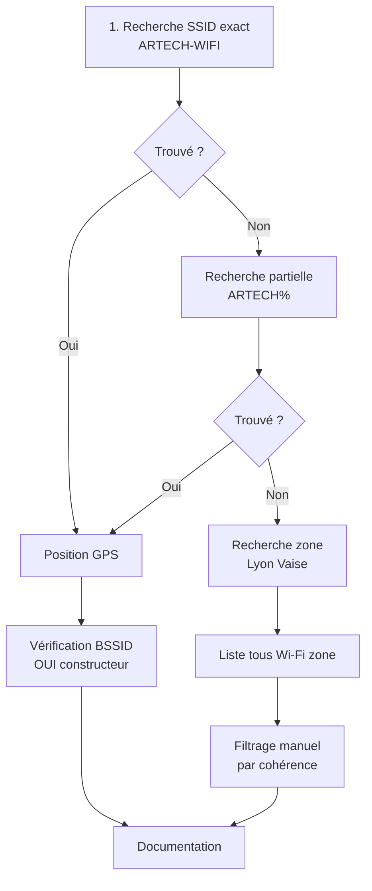

# 4.4 Recherche par BSSID Wigle.net et SSID

!!! quote "L'analogie du cadastre des ondes"

    Imaginez un cadastre géant qui répertorierait, au mètre près, chaque point Wi-Fi détecté en France depuis 20 ans. Vous saisissez un nom de réseau, et le cadastre vous indique exactement où il se trouve. Vous saisissez une coordonnée GPS, et il vous liste tous les Wi-Fi visibles depuis cette position. C'est exactement ce qu'est Wigle.net. Cette base massive, alimentée par des milliers de wardrivers volontaires depuis 2001, est le rêve d'un attaquant et le cauchemar d'un défenseur. Pour ARTECH, savoir que votre Wi-Fi y figure (ou pas) change votre niveau d'exposition.

## Métadonnées du chapitre

Ce chapitre est dédié à la reconnaissance Wi-Fi à distance via les bases publiques. Voici ses caractéristiques.

| Champ | Valeur |
|---|---|
| Durée estimée | 2 heures |
| Niveau | Pratique |
| Prérequis | 4.1, 4.2 |
| Livrables | Cartographie Wi-Fi ARTECH par BSSID/SSID |
| Auto-explication | 8 minutes |

## Objectifs pédagogiques

À l'issue de ce chapitre, vous serez capable de :

- Comprendre la différence BSSID / SSID / ESSID
- Utiliser Wigle.net pour cartographier un Wi-Fi cible
- Comprendre la précision (et imprécisions) des données
- Comparer Wigle avec d'autres bases (WifiInfoView, OpenBmap)
- Identifier les implications RGPD du wardriving en France

---

## 1. Vocabulaire Wi-Fi essentiel

Avant de manipuler ces outils, il convient de poser le vocabulaire technique avec précision.

### 1.1 Identifiants Wi-Fi

Trois identifiants principaux caractérisent un réseau Wi-Fi.

| Identifiant | Définition | Format | Variabilité |
|---|---|---|---|
| BSSID | Basic Service Set ID = adresse MAC du point d'accès | XX:XX:XX:XX:XX:XX | Unique au matériel |
| SSID | Service Set Identifier = nom diffusé du réseau | Texte 1-32 caractères | Modifiable |
| ESSID | Extended SSID = SSID dans réseau multi-AP | Texte 1-32 caractères | Modifiable |

Le **BSSID** est la signature **stable** d'un routeur, même si on change le SSID.

### 1.2 Pourquoi le BSSID est un pivot puissant

Voici les raisons pour lesquelles le BSSID est précieux en OSINT.

| Raison | Explication |
|---|---|
| Stabilité | Ne change pas (sauf MAC randomization) |
| Géolocalisation | Permet de placer un AP physiquement |
| Association | Identifie le matériel précis |
| Historicisation | Wigle conserve l'historique des positions |

### 1.3 Préfixes OUI

Les 3 premiers octets d'un BSSID sont un **OUI** (Organizationally Unique Identifier) attribué par l'IEEE. Voici quelques préfixes courants.

| OUI | Constructeur |
|---|---|
| 00:1A:11 | Cisco |
| 00:24:01 | TP-Link |
| 14:CC:20 | TP-Link |
| 04:D9:F5 | TP-Link |
| 64:70:02 | TP-Link Archer C7 |
| 28:CD:C1 | Netgear |
| C8:54:4B | Linksys |
| F8:E4:E3 | Apple |

Pour rechercher un OUI précis, voici l'outil officiel.

```bash
# Sur Linux avec ieee-data installé
ouilookup 64:70:02

# Sortie attendue
# 64:70:02 = TP-LINK TECHNOLOGIES CO.,LTD.

# Alternative en ligne
# https://standards-oui.ieee.org/oui/oui.txt
# Ou : https://www.wireshark.org/tools/oui-lookup.html
```

## 2. Wigle.net - Présentation

### 2.1 Histoire et fonctionnement

**Wigle.net** (Wireless Geographic Logging Engine) est un projet collaboratif lancé en 2001. Voici ses caractéristiques principales.

| Caractéristique | Précision |
|---|---|
| Lancement | 2001 |
| Modèle | Crowdsourcé (volontaires) |
| Volume 2026 | ~1 milliard d'observations Wi-Fi |
| Couverture | Mondiale, dense en zones urbaines |
| Données | BSSID, SSID, GPS, sécurité, dernière vue |
| Accès | Gratuit (compte requis) |
| API | Oui (gratuit limité, payant étendu) |
| Application mobile | WiGLE WiFi Wardriving (Android) |

### 2.2 Données collectées

Pour chaque point Wi-Fi observé, Wigle conserve les informations suivantes.

| Champ | Description |
|---|---|
| BSSID | Adresse MAC AP |
| SSID | Nom du réseau (peut être vide) |
| Type | WEP / WPA / WPA2 / WPA3 / Open |
| Latitude | Position GPS approximative |
| Longitude | Position GPS approximative |
| First seen | Date première observation |
| Last seen | Date dernière observation |
| QoS | Qualité signal moyenne |
| Trilat | Trilatéralisation (calcul position précise) |

### 2.3 Précision géographique

La précision dépend de plusieurs facteurs. Voici les niveaux typiques.

| Cas | Précision |
|---|---|
| AP observé une seule fois | 50-200 mètres |
| AP observé 5-10 fois | 20-50 mètres |
| AP observé 100+ fois | < 10 mètres |
| AP en milieu rural | Plus précis (peu d'interférences) |
| AP en milieu urbain dense | Moins précis (interférences) |

## 3. Inscription et premières recherches

### 3.1 Création de compte

L'inscription se fait sur `wigle.net`. Voici les étapes.

```text
PROCÉDURE D'INSCRIPTION WIGLE
==============================

1. Aller sur https://wigle.net
2. Cliquer "Login or Register"
3. Choisir "New Account"
4. Renseigner email + username + mot de passe
5. Confirmer email
6. Connexion

LIMITES COMPTE GRATUIT 2026
  - 1000 requêtes API/jour
  - Recherche web illimitée
  - Téléchargement data limité
```

### 3.2 Recherche par SSID

L'interface web propose plusieurs modes de recherche. Pour ARTECH, vous commencez par le SSID.

```text
RECHERCHE SSID
===============

URL : https://wigle.net/search

Champs :
  SSID : ARTECH-WIFI
  Match : exact ou like (avec %)
  Country : FR

Résultat attendu : un ou plusieurs APs avec ce nom
```

Si le SSID est unique (peu probable pour un nom non-générique), vous obtenez immédiatement la position. Si le SSID est commun (`Livebox-XXXX`), vous filtrez par pays et zone.

### 3.3 Recherche par BSSID

Si vous connaissez déjà le BSSID, la recherche est plus directe.

```text
RECHERCHE BSSID
================

URL : https://wigle.net/search

Champs :
  BSSID : 64:70:02:XX:XX:XX

Résultat : positions GPS, historique, SSID associés
```

Cette recherche révèle si le BSSID a changé de SSID au fil du temps (changement de mot de passe, refonte réseau).

### 3.4 Recherche géographique

Vous pouvez également partir d'une zone géographique pour lister tous les Wi-Fi visibles.

```text
RECHERCHE GÉOGRAPHIQUE
=======================

URL : https://wigle.net/map

Action :
  1. Zoomer sur la zone d'ARTECH (Lyon Vaise)
  2. Activer "Show Networks"
  3. Lister les SSID visibles dans la zone
  4. Filtrer par sécurité (WPA2 par exemple)
```

## 4. Utilisation de l'API Wigle

L'API Wigle permet d'automatiser les recherches. Voici comment la configurer et l'utiliser.

### 4.1 Récupération des credentials API

Voici la procédure pour obtenir les clés API depuis votre compte Wigle.

```text
RÉCUPÉRATION API
=================

1. Connexion sur Wigle.net
2. Aller dans Account → My Account
3. Section "API Tokens"
4. Cliquer "Show Token" pour révéler
5. Conserver Encoded for use in API

Format token :
  Authorization: Basic <token-encoded>
```

### 4.2 Recherche par SSID via API

Voici un script bash type pour interroger l'API Wigle.

```bash
#!/bin/bash
# wigle-search.sh - Recherche Wigle par SSID

# Token API encodé en base64 (récupéré sur le site)
TOKEN="VOTRE_TOKEN_ENCODE"

SSID="ARTECH-WIFI"
COUNTRY="FR"

# Requête
curl -s "https://api.wigle.net/api/v2/network/search?ssid=$SSID&country=$COUNTRY" \
    -H "Authorization: Basic $TOKEN" \
    | jq '.'
```

La réponse contient toutes les correspondances avec leurs coordonnées GPS.

### 4.3 Recherche par BSSID via API

La même API supporte la recherche par BSSID.

```bash
#!/bin/bash
# wigle-bssid.sh

TOKEN="VOTRE_TOKEN"
BSSID="64:70:02:XX:XX:XX"

curl -s "https://api.wigle.net/api/v2/network/search?netid=$BSSID" \
    -H "Authorization: Basic $TOKEN" \
    | jq '.results[] | {ssid: .ssid, lat: .trilat, lon: .trilong, lastSeen: .lastupdt}'
```

### 4.4 Limite et quotas

L'API gratuite est limitée. Voici les contraintes en 2026.

| Métrique | Limite gratuite |
|---|---|
| Requêtes par jour | 1000 |
| Requêtes par seconde | 1 |
| Téléchargement data | Limité |
| Historique complet | Premium |

## 5. Cas pratique - Cartographie WiFi ARTECH

### 5.1 Mise en situation

Vous voulez identifier le Wi-Fi `ARTECH-WIFI` du laboratoire et préparer le wardriving du chapitre 4.8. La station de votre laboratoire émet déjà ce SSID, donc Wigle pourrait l'avoir capté si vous êtes hébergé en zone fréquentée.

**Note importante** : votre SSID `ARTECH-WIFI` est privé et ne doit pas être réellement référencé sur Wigle. Pour l'exercice, utilisez un SSID test et désactivez le wardriving externe vers votre lab.

### 5.2 Workflow d'identification

Voici les étapes de votre session Wigle ARTECH.



### 5.3 Commandes pratiques

Voici les commandes successives à utiliser dans votre lab.

```bash
# Préparation
mkdir -p ~/osint/artech-2026/wifi
cd ~/osint/artech-2026/wifi

# Configuration token (sécurisé)
read -s WIGLE_TOKEN
export WIGLE_TOKEN
# Token saisi sans écho

# Étape 1 - Recherche SSID exact
curl -s "https://api.wigle.net/api/v2/network/search?ssid=ARTECH-WIFI&country=FR" \
    -H "Authorization: Basic $WIGLE_TOKEN" \
    > recherche-ssid-exact.json

# Étape 2 - Si rien, recherche LIKE
curl -s "https://api.wigle.net/api/v2/network/search?ssidlike=ARTECH%25&country=FR" \
    -H "Authorization: Basic $WIGLE_TOKEN" \
    > recherche-ssid-like.json

# Étape 3 - Recherche zone géographique (Lyon Vaise centre)
curl -s "https://api.wigle.net/api/v2/network/search?latrange1=45.766&latrange2=45.770&longrange1=4.798&longrange2=4.805" \
    -H "Authorization: Basic $WIGLE_TOKEN" \
    > recherche-zone-lyon-vaise.json

# Étape 4 - Extraction informations utiles
jq '.results[] | {ssid: .ssid, bssid: .netid, encryption: .encryption, lat: .trilat, lon: .trilong}' \
    recherche-zone-lyon-vaise.json \
    > resultats-zone.json

# Hashing
sha256sum *.json > MANIFEST.sha256
```

### 5.4 Interprétation

Une fois les résultats obtenus, vous extrayez les informations clés.

```text
INFORMATIONS À DOCUMENTER POUR ARTECH
======================================

POUR CHAQUE BSSID SUSPECT :
  - SSID : ...
  - BSSID : ...
  - OUI constructeur : ... (TP-Link, Cisco, etc.)
  - Sécurité : WPA2-PSK / WPA3 / Open
  - Dernière observation Wigle : YYYY-MM-DD
  - Position GPS : lat, long
  - Cohérence avec adresse ARTECH : oui/non

CARTOGRAPHIE FINALE :
  - 1-N AP appartenant à ARTECH (probablement)
  - Voisins Wi-Fi (autres entreprises de la zone)
  - Wi-Fi public éventuel (cafés)
```

## 6. Outils et bases alternatives

Wigle n'est pas le seul service. Voici les alternatives utiles.

### 6.1 OpenBmap

**OpenBmap** (`openbmap.org`) est l'alternative open source européenne. Couverture moindre que Wigle mais respecte mieux la RGPD.

### 6.2 Apple Geolocation API

L'API Apple permet de géolocaliser un BSSID, mais nécessite des moyens techniques avancés (rétro-ingénierie du protocole). Réservé à la recherche.

### 6.3 Google Geolocation API

Similaire à Apple, intégrée dans le service Google Geolocation. Tarif commercial.

### 6.4 Synthèse comparative

Voici la comparaison des services pour vos besoins OSINT.

| Service | Couverture | Coût | RGPD-friendly |
|---|---|---|---|
| Wigle.net | Excellente mondiale | Gratuit limité | Modéré |
| OpenBmap | Limitée Europe | Gratuit | Bon |
| Apple Geolocation | Très bonne | Réservé app dev | Variable |
| Google Geolocation | Très bonne | Payant | Variable |

## 7. Implications RGPD et légales

### 7.1 Statut juridique du BSSID

Le BSSID est-il une donnée personnelle ?

```text
DOCTRINE CNIL ET CJUE
======================

Position : OUI dans certaines circonstances.

Le BSSID associé à une géolocalisation
peut permettre d'identifier indirectement
une personne physique (le propriétaire du Wi-Fi).

Conséquence :
  - Collecte massive = traitement de données
    personnelles
  - Base légale RGPD nécessaire
  - Article 6.1.f intérêt légitime documenté

CAS WIGLE :
  Wigle est en zone juridique grise en Europe.
  Plusieurs pays européens ont demandé des
  retraits de leurs zones.
  Pour la France, l'usage défensif (audit
  son propre Wi-Fi) reste sans difficulté.
```

### 7.2 Wardriving (chapitre 4.8 dédié)

Le **wardriving** consiste à conduire avec une carte Wi-Fi en mode monitor pour cartographier les réseaux. Ce sera le sujet du chapitre 4.8. À ce stade, retenez que le wardriving en France est dans une zone grise tant qu'il reste **passif** (pas de tentative de connexion ni de capture de trafic chiffré).

### 7.3 Articles pénaux applicables

Voici les articles à connaître pour ne pas déraper.

| Article | Infraction |
|---|---|
| 226-15 | Interception de communications privées (1 an / 45k €) |
| 323-1 | Tentative d'accès à STAD (3 ans / 100k €) |
| 226-3 | Possession équipements interception (5 ans / 300k €) |

**Pour OmnyAcademy** : votre laboratoire est à vous, donc l'usage est légal.

## 8. Bonnes pratiques

Voici les bonnes pratiques à intégrer dans toute investigation Wigle.

### 8.1 Avant la recherche

Plusieurs précautions s'imposent avant de lancer la session.

| Pratique | Justification |
|---|---|
| Mandat documenté | Justification de l'intérêt légitime |
| Token API sécurisé | Pas de leak via export public |
| Périmètre géographique précis | Minimisation données collectées |
| Période courte | Pas de surveillance continue |

### 8.2 Pendant la session

Pendant la session, respectez les règles suivantes.

| Pratique | Justification |
|---|---|
| Documentation horodatée | Traçabilité forensic |
| Hashes des extracts | Intégrité |
| Filtrage minimal | Ne conserver que ce qui est utile |

### 8.3 Après la session

À l'issue, plusieurs actions sont nécessaires.

| Pratique | Délai |
|---|---|
| Anonymisation rapport | Avant livrable |
| Destruction data brute | Selon mandat (typiquement 6 mois) |
| Inventaire final | Mention dans rapport |

## 9. Auto-évaluation

Vérifiez votre maîtrise par les questions suivantes.

| # | Question | Réponse |
|---|---|---|
| 1 | Différence BSSID / SSID ? | BSSID = MAC, SSID = nom |
| 2 | Date de lancement Wigle ? | 2001 |
| 3 | OUI dans BSSID ? | 3 premiers octets, identifient le fabricant |
| 4 | Recherche par zone géographique sur Wigle ? | latrange / longrange dans API |
| 5 | Limite API gratuite ? | 1000 requêtes/jour |
| 6 | Alternative open source européenne ? | OpenBmap |
| 7 | BSSID = donnée personnelle ? | Oui, indirectement (CJUE) |
| 8 | Article pénal interception WiFi ? | 226-15 |

## 10. Synthèse

Voici les points clés à retenir.

```text
WIGLE ET BSSID OSINT

VOCABULAIRE
  BSSID = MAC AP (signature stable)
  SSID = nom diffusé (modifiable)
  OUI = 3 premiers octets BSSID = constructeur

WIGLE.NET
  Lancé 2001
  ~1 milliard observations
  Gratuit avec compte
  API limitée à 1000 req/jour

RECHERCHES POSSIBLES
  Par SSID exact ou like
  Par BSSID
  Par zone géographique (lat/long range)

DONNÉES OBTENUES
  Position GPS
  Historique observations
  Type sécurité
  SSID associés au même BSSID

CADRE LÉGAL FRANCE
  BSSID = donnée personnelle indirecte
  RGPD 6.1.f intérêt légitime
  Articles 226-15, 323-1, 226-3 à connaître

OUTILS COMPLÉMENTAIRES
  OpenBmap (Europe, open source)
  Apple Geolocation (avancé)
  Google Geolocation (commercial)

USAGE FORENSIC OMNYACADEMY
  Préparation wardriving (chapitre 4.8)
  Cartographie zone d'attaque
  Audit défensif (votre Wi-Fi exposé ?)
```

---

**Chapitre précédent** : [4.3 theHarvester et énumération emails](4-3-theharvester-emails.md)

**Chapitre suivant** : [4.5 Profilage humain LinkedIn et réseaux sociaux](4-5-profilage-linkedin.md)
