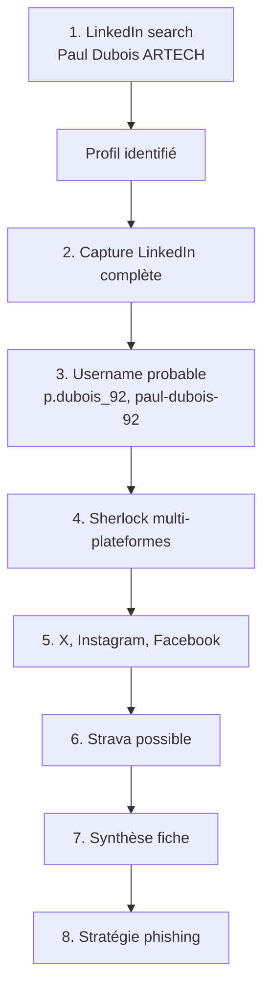

# 4.5 Profilage humain LinkedIn et réseaux sociaux

!!! quote "L'analogie du recruteur impitoyable"

    Un bon recruteur ne se contente pas du CV. Il regarde LinkedIn pour mesurer la cohérence du parcours, vérifie X pour comprendre la posture publique, parcourt Instagram pour évaluer l'équilibre vie pro/perso. En quelques minutes, il s'est forgé une image que l'entretien viendra confirmer ou infirmer. Pour préparer une attaque par phishing, le travail est exactement le même. Sauf que vous ne cherchez pas à recruter un futur collaborateur, mais à identifier la personne qui ouvrira la pièce jointe piégée. Cette personne a un nom, un visage, des habitudes, des fragilités. Plus vous la connaissez, plus le piège sera invisible.

## Métadonnées du chapitre

Ce chapitre vous prépare au phishing du module 6 par l'identification précise des cibles humaines. Voici ses caractéristiques.

| Champ | Valeur |
|---|---|
| Durée estimée | 3 heures |
| Niveau | Standard |
| Prérequis | 4.1, 4.2, 4.3 |
| Livrables | 3 fiches cibles privilégiées ARTECH |
| Auto-explication | 12 minutes |

## Objectifs pédagogiques

À l'issue de ce chapitre, vous serez capable de :

- Profiler des employés ARTECH via LinkedIn
- Identifier les cibles privilégiées d'un phishing
- Utiliser les opérateurs de recherche LinkedIn
- Croiser plusieurs réseaux sociaux pour un profil complet
- Manipuler des sock puppets dans le respect du droit
- Documenter chaque profil dans une fiche structurée

---

## 1. Pourquoi LinkedIn est central

LinkedIn occupe une place particulière en OSINT. Voici les raisons de sa centralité.

### 1.1 Spécificités LinkedIn

LinkedIn présente plusieurs caractéristiques qui en font la plateforme reine pour l'OSINT professionnel.

| Spécificité | Impact OSINT |
|---|---|
| Profils auto-déclarés | Détaillés, riches en information |
| Mention employeurs | Cartographie organisations entières |
| Postes et durées | Évolution professionnelle traçable |
| Skills et endorsements | Compétences techniques visibles |
| Formations | Diplômes et établissements |
| Posts publics | Centres d'intérêt, sujets |
| Connexions | Réseau professionnel |
| Recommandations | Cercles de confiance |

### 1.2 Densité française

La France compte environ **30 millions** de profils LinkedIn en 2026, soit **45 % de la population active**. Pour une PME comme ARTECH, vous trouverez quasi systématiquement la majorité des employés.

### 1.3 Loi RGPD et LinkedIn

Le profilage LinkedIn est légal sous certaines conditions strictes.

| Pratique | Légalité |
|---|---|
| Consultation des profils publics | Légal |
| Capture pour rapport ponctuel | Légal sous intérêt légitime |
| Constitution d'un fichier nominatif | Nécessite base légale + déclaration |
| Croisement automatisé massif | Très problématique RGPD |
| Scraping massif via outil tiers | Viole les CGU LinkedIn |

## 2. Recherche LinkedIn structurée

### 2.1 Recherche par entreprise

L'approche systématique consiste à partir de l'entreprise pour lister ses employés.

```text
RECHERCHE PAR ENTREPRISE
==========================

URL : https://www.linkedin.com/company/artech-medical
       (ou nom équivalent ARTECH)

Onglets utiles :
  - "About" : description, taille, localisation
  - "People" : liste des employés (si LinkedIn affiche)
  - "Posts" : publications corporate
  - "Jobs" : offres en cours (révèle les besoins)
  - "Insights" : grades, fonctions, croissance
```

### 2.2 Recherche People avec filtres

LinkedIn propose des filtres puissants pour la recherche de personnes.

```text
URL : https://www.linkedin.com/search/results/people/

FILTRES UTILES POUR ARTECH :

[X] Connections : 1st, 2nd, 3rd
[X] Locations : Lyon
[X] Current Companies : ARTECH
[X] Past Companies : (anciens employés, parfois utiles)
[X] Schools : (formation commune avec dirigeants)
[X] Industry : Pharmaceutiques / Médical
[X] Profile Language : Français
[X] First Name / Last Name : si recherche ciblée
```

### 2.3 Opérateurs de recherche Google sur LinkedIn

LinkedIn limite les recherches sur sa plateforme. Pour contourner les limites, vous utilisez Google avec opérateurs.

```text
GOOGLE DORKS LINKEDIN
======================

Tous les profils ARTECH visibles publiquement :
  site:linkedin.com/in/ "ARTECH"

Profils ARTECH à Lyon :
  site:linkedin.com/in/ "ARTECH" "Lyon"

Profils par fonction :
  site:linkedin.com/in/ "ARTECH" "Comptable"
  site:linkedin.com/in/ "ARTECH" "Directeur"
  site:linkedin.com/in/ "ARTECH" "DSI"
  site:linkedin.com/in/ "ARTECH" "Stagiaire"

Profils par formation :
  site:linkedin.com/in/ "ARTECH" "EM Lyon"

Page company ARTECH :
  site:linkedin.com/company/ "ARTECH"
```

## 3. Identification des cibles privilégiées

L'objectif n'est pas de profiler tous les employés mais d'identifier les **3 à 5 cibles** offrant le meilleur rapport effort/résultat pour un phishing.

### 3.1 Critères de sélection

Voici la grille de scoring à appliquer à chaque employé identifié.

| Critère | Poids | Score 1-5 |
|---|---|---|
| Accès à des données sensibles | 4 | 1-5 |
| Surface publique élevée (posts, photos) | 2 | 1-5 |
| Position d'autorité (peut autoriser virement) | 3 | 1-5 |
| Profil junior ou débutant | 3 | 1-5 |
| Activité réseaux sociaux fréquente | 2 | 1-5 |
| Mentions perso publiques | 2 | 1-5 |
| Mentions ARTECH publiques (fierté) | 2 | 1-5 |

Le score total maximum est de 90. Au-delà de 60, la cible est privilégiée.

### 3.2 Profils types et leur intérêt

Voici les profils les plus souvent ciblés en pratique sur les attaques réelles.

| Profil | Intérêt | Risque pour ARTECH |
|---|---|---|
| Stagiaire IT/admin | Accès privilégié, peu d'expérience sécu | Très élevé |
| Comptable | Validation virements, accès BDD clients | Critique |
| Assistante de direction | Accès agenda, contacts, validation | Très élevé |
| Service achats | Validation factures, signe contrats | Élevé |
| RH | Données sensibles employés (RGPD) | Élevé |
| Commercial junior | Accès CRM, peut imiter la voix dirigeants | Modéré |
| Direction | Cible "whaling" si réussite | Très élevé |

### 3.3 Cas ARTECH

Pour le scénario du laboratoire, voici les 3 cibles privilégiées identifiées.

```text
CIBLES PRIVILÉGIÉES ARTECH
============================

CIBLE 1 - Paul DUBOIS (stagiaire commerce)
  Score : 78/90
  Justification :
    - Stagiaire 6 mois (junior)
    - Posts Instagram fréquents
    - Mentionne ARTECH publiquement
    - Tag photos avec collègues identifiables
    - Profil Discord public visible
  Vecteur recommandé : phishing email avec Word piégé
                       ressemblant à instruction tutrice

CIBLE 2 - Sophie DUPONT (comptable)
  Score : 72/90
  Justification :
    - Validation factures fournisseurs (rôle)
    - Accès données comptables sensibles
    - 12 ans d'ancienneté (confiance procédures établies)
    - Profil LinkedIn standard, peu de posts
  Vecteur recommandé : phishing facture fournisseur usurpée

CIBLE 3 - Hélène LEFEBVRE (PDG)
  Score : 68/90
  Justification :
    - Whaling : bénéfice maximum si réussite
    - Conférences publiques (signature reconnaissable)
    - Authority bias chez subordonnés (ordres exécutés)
    - Forme idéale pour CEO fraud
  Vecteur recommandé : usurpation identité pour
                       envoi à comptabilité (CEO fraud)
```

## 4. Profilage approfondi LinkedIn

Une fois la cible identifiée, vous approfondissez le profilage. Voici les éléments à extraire.

### 4.1 Informations biographiques

À partir d'un profil LinkedIn, vous reconstruisez l'identité professionnelle complète.

| Élément | Localisation profil |
|---|---|
| Nom complet | En tête |
| Photo | Avatar |
| Localisation | Sous le nom |
| Titre actuel | Sous le nom |
| Résumé | Section "About" |
| Expériences | Section "Experience" |
| Formations | Section "Education" |
| Compétences | Section "Skills" |
| Recommandations | Section "Recommendations" |
| Articles publiés | Section "Activity" |
| Connexions visibles | Onglet "Connections" si autorisé |

### 4.2 Inférences sur le poste actuel

Le poste actuel et son ancienneté permettent plusieurs inférences utiles.

| Indicateur | Inférence |
|---|---|
| Poste récent (< 6 mois) | Junior, moins formé sécurité, moins établi dans procédures |
| Poste long (> 5 ans) | Senior, peut détenir mots de passe historiques |
| Promotion récente | Souvent surchargé, distrait, vulnérable |
| Reconversion | Nouveau dans le métier, peu d'expérience cybersécurité |

### 4.3 Activité publique

L'activité publique (posts, likes, commentaires) révèle beaucoup. Voici les indicateurs à examiner.

| Activité | Information |
|---|---|
| Fréquence des posts | Engagement avec LinkedIn |
| Sujets traités | Centres d'intérêt professionnels |
| Tone des posts | Communication style |
| Connexions récentes | Cercles d'influence |
| Likes publics | Préférences révélées |
| Commentaires | Personnalité |

## 5. Croisement multi-réseaux

LinkedIn donne le profil professionnel. Les autres réseaux complètent le profil **personnel**.

### 5.1 X (Twitter)

X révèle souvent une dimension différente, plus expressive et politique. Voici comment chercher.

```text
RECHERCHE X
============

URL : https://twitter.com/search

Recherches utiles :
  "Paul Dubois" "ARTECH"
  "Paul Dubois" "Lyon"
  "p_dubois_92"  (si username trouvé)

Avancé :
  from:username      (tweets depuis ce compte)
  to:username        (mentions à ce compte)
  filter:images
  since:2024-01-01
```

### 5.2 Instagram

Instagram est plus personnel. Sur les comptes publics, les indicateurs suivants sont utiles.

| Information | Apport phishing |
|---|---|
| Photos avec collègues taggés | Cercles internes |
| Photos avec lieux taggés | Habitudes géographiques |
| Photos famille | Vecteurs émotionnels |
| Voyages | Périodes d'absence |
| Hashtags | Activités, marques préférées |

### 5.3 Facebook

Facebook est moins utilisé en B2B mais reste pertinent. Voici les sources les plus utiles.

| Source | Information |
|---|---|
| Profil public | Photos profil, bannière |
| Page entreprise | Posts officiels |
| Groupes | Affinités déclarées |
| Events | Présences à conférences |

### 5.4 Strava

Strava est un cas particulier. Cette application sportive révèle énormément si elle est en mode public.

```text
INFORMATIONS RÉVÉLÉES PAR STRAVA PUBLIC
=========================================

- Domicile probable (départ/arrivée fréquent)
- Lieu de travail probable (départ/arrivée jours ouvrés)
- Habitudes horaires (matin / soir)
- Niveau forme physique
- Cercle de connaissances (followers)
- Routes habituelles
- Périodes de présence/absence

CAS RÉCENTS
  La heatmap mondiale Strava avait révélé en 2018
  des bases militaires américaines secrètes par
  les parcours de jogging des soldats.
```

### 5.5 GitHub / GitLab

Si la cible est technique, GitHub est une mine d'or.

| Information | Apport |
|---|---|
| Email des commits | Pivot vers d'autres infos |
| Repositories | Compétences techniques |
| Contributions | Réseau professionnel |
| Issues commentées | Sujets maîtrisés |
| Stars | Outils utilisés |

## 6. Sock puppets - Comptes fictifs OSINT

### 6.1 Concept

Un **sock puppet** est un compte fictif utilisé pour consulter du contenu LinkedIn / réseaux sociaux qui nécessitent une authentification.

### 6.2 Statut juridique en France

Voici la nuance juridique à connaître.

```text
SOCK PUPPETS EN FRANCE
========================

CRÉATION D'UN COMPTE FICTIF :
  Légale en soi.
  SAUF si elle viole les CGU de la plateforme.
  SAUF si elle vise à tromper pour obtenir
  des données privées (313-1 escroquerie).

USAGE FORENSIC :
  Acceptable si :
  - Pas d'usurpation d'identité réelle
  - Pas de manipulation active de la cible
  - Strictement consultation passive
  - Mandat documenté

USAGE PROBLÉMATIQUE :
  - Friend requests à la cible
  - Engagement actif (likes, commentaires)
  - Récupération de données privées par contact
```

### 6.3 Création opérationnelle

Si vous décidez de créer un sock puppet pour OmnyAcademy, voici la check-list.

| Élément | Recommandation |
|---|---|
| Email | ProtonMail dédié |
| Numéro tel | SIM dédiée (recyclée) ou service virtuel |
| Photo profil | Photo IA générée (this-person-does-not-exist.com) |
| Bio | Plausible mais sans détails vérifiables |
| Activité | "Vieillir" 2-4 semaines avant usage |
| VPN | Toujours actif |
| Navigateur | Profil isolé sans extensions |

### 6.4 Hygiène opérationnelle

Voici les règles strictes à suivre pour ne pas compromettre votre identité réelle.

```text
RÈGLES SOCK PUPPET
====================

JAMAIS :
  - Mêler vrai et faux comptes sur même appareil
  - Utiliser même IP que vrai compte
  - Réutiliser même téléphone que vrai compte
  - Liker / commenter ce qui peut alerter cible

TOUJOURS :
  - Compartiment dédié (VM ou navigateur isolé)
  - VPN actif systématiquement
  - Logs d'utilisation tenus
  - Détruire le compte en fin de mission
```

## 7. Fiche cible standardisée

Voici le format de fiche que vous produirez pour chaque cible privilégiée.

```text
FICHE CIBLE - PRÉNOM NOM - ARTECH 2026
========================================

IDENTITÉ
  Nom complet : ...
  Date de naissance : ... (si pertinent uniquement)
  Localisation : ville
  Email pro : prenom.nom@artech.fr
  Email perso : ... (si trouvé)
  Numéro tel pro : ...
  Numéro tel perso : ...

POSTE
  Titre exact : ...
  Société : ARTECH SAS
  Date de prise de poste : ...
  Ancienneté : X mois/années
  Manager direct : ...
  Subordonnés directs : N

PARCOURS PROFESSIONNEL
  Postes précédents :
    - 2020-2024 : ...
    - 2018-2020 : ...
  Formations :
    - Diplôme X, Établissement Y, année Z
    - ...

PRÉSENCE EN LIGNE
  LinkedIn : URL profil
  X / Twitter : @username (followers, posts/mois)
  Instagram : @username (public/privé, abonnés)
  Facebook : URL profil
  GitHub : URL profil (si technique)
  Strava : URL profil (si visible)

CENTRES D'INTÉRÊT
  Professionnels : ...
  Personnels : ...
  Sport : ...
  Voyages : ...

CONNEXIONS NOTABLES
  Avec collègues ARTECH : N profils visibles
  Cercles externes : ... (anciens collègues, école)

VULNÉRABILITÉS POTENTIELLES
  Phishing : score N/5 - justifications
  Social engineering : score N/5 - justifications
  Whaling : score N/5 - justifications

VECTEUR D'ATTAQUE RECOMMANDÉ
  Type : phishing / vishing / smishing / whaling
  Prétexte : (factice, type "facture fournisseur",
             "instruction supérieur", "service IT")
  Pièce jointe : (Word macro / PDF / lien malveillant)
  Tone à adopter : (formel / informel / urgent)

ARTEFACTS COLLECTÉS
  Capture LinkedIn : fichier hash SHA-256
  Capture autres réseaux : fichiers hash
  Notes journal : timestamps

VALIDITÉ
  Date capture : YYYY-MM-DD
  Date péremption (à reverifier) : YYYY-MM-DD
```

## 8. Cas pratique - Profil Paul Dubois

### 8.1 Mise en situation

Vous profilez Paul Dubois, stagiaire commerce ARTECH, identifié comme cible privilégiée n°1.

### 8.2 Démarche

Voici les étapes à mener pour la session de profilage.



### 8.3 Commandes

Voici les commandes pratiques à utiliser.

```bash
# Préparation
mkdir -p ~/osint/artech-2026/cibles/paul-dubois
cd ~/osint/artech-2026/cibles/paul-dubois

# Étape 1-2 - LinkedIn
# Capture manuelle via navigateur du profil LinkedIn
# Sauvegarde via wkhtmltopdf

wkhtmltopdf "https://www.linkedin.com/in/paul-dubois-92xxx" linkedin-paul-dubois.pdf

# Étape 3-4 - Sherlock multi-plateformes
sherlock paul.dubois92 --output sherlock-paul.txt

# Étape 5 - Vérification holehe
holehe paul.dubois92@gmail.com > holehe-paul.txt

# Étape 6 - Recherches X/Twitter
# Manuelle via browser. Capture profile

# Étape 7 - Documentation
sha256sum *.pdf *.txt > MANIFEST.sha256
```

### 8.4 Synthèse exemple

Voici ce que vous obtenez après la session.

```text
SYNTHÈSE PAUL DUBOIS - ARTECH 2026
====================================

LinkedIn :
  Profil actif, 50 connexions
  Stage 6 mois en cours
  Mentionne fierté nouveau poste
  Compétences déclarées : Excel, communication

X (Twitter) :
  @paul_dubois_92, 200 followers
  Tweets sport, jeux vidéo
  Active : 5 tweets/semaine
  Heures : soirée et week-end

Instagram :
  @paul.dubois.92, public, 800 abonnés
  Photos voyages, soirées étudiantes
  Récemment : "1er stage en entreprise !"
  Tagué avec collègues 3-4 fois

Sherlock :
  Trouvé sur : LinkedIn, X, Instagram, Steam,
  Spotify, TikTok, GitHub (peu actif)

Vulnérabilités :
  - Manque expérience cybersécurité (junior)
  - Activité personnelle visible publique
  - Tags collègues dans photos
  - Username récurrent partout (pivot facile)
  - Email perso paul.dubois92@gmail.com identifié

Vecteur d'attaque optimal :
  Phishing email se faisant passer pour
  son tuteur de stage, demandant ouverture
  rapide d'un document Word "important
  à corriger pour le rapport".
  Pièce jointe : .docm avec macro VBA
  Heure d'envoi : matin lundi (réception avant café)
```

## 9. Pièges et bonnes pratiques

### 9.1 Pièges fréquents

Voici les erreurs typiques en profilage humain.

| Piège | Évitement |
|---|---|
| Confondre homonymes | Vérifier 3 attributs concordants minimum |
| Profils périmés | Vérifier date dernière activité |
| Sock puppet exposé | VPN + navigateur isolé strict |
| Trop d'info collectée | Minimisation RGPD |
| Pas d'horodatage | Hunchly ou wkhtmltopdf systématique |

### 9.2 Bonnes pratiques

À l'inverse, voici les pratiques qui font la différence.

| Pratique | Bénéfice |
|---|---|
| Time-boxing par cible (45 min) | Concentration, pas dérive |
| Croisement minimum 3 sources | Fiabilité |
| Notes en temps réel | Pas d'oubli |
| Hash de chaque capture | Forensic |
| Destruction après mission | RGPD respecté |

## 10. Auto-évaluation

Vérifiez votre maîtrise par les questions suivantes.

| # | Question | Réponse |
|---|---|---|
| 1 | Pourquoi LinkedIn central en OSINT pro ? | Auto-déclaratif riche |
| 2 | 3 cibles privilégiées ARTECH ? | Stagiaire, comptable, PDG |
| 3 | Whaling = ? | Phishing ciblant un dirigeant |
| 4 | CEO Fraud = ? | Usurpation dirigeant pour ordre virement |
| 5 | Sock puppet légal en FR si ? | Pas usurpation, pas manipulation active |
| 6 | Outil pour profil multi-plateformes ? | Sherlock |
| 7 | Réseau révélateur sport / domicile ? | Strava |
| 8 | Time-box recommandé par cible ? | 45 minutes |

## 11. Synthèse

Voici les points clés à retenir.

```text
PROFILAGE HUMAIN OSINT

LINKEDIN
  Source de référence pro
  Recherche par entreprise puis filtres
  Google dorks pour contournement

CIBLES PRIVILÉGIÉES (3-5 max)
  Stagiaires juniors
  Comptables (validation virements)
  Assistantes direction
  Service achats / RH
  Dirigeants (whaling)

MULTI-RÉSEAUX
  LinkedIn = pro
  X = expression publique
  Instagram = perso, photos taggées
  Facebook = cercle social
  Strava = sport, géolocalisation
  GitHub = technique

SOCK PUPPETS
  Légal sous conditions strictes
  Email + num + photo IA + VPN
  Compartiment isolé total
  Détruire en fin de mission

FICHE CIBLE STANDARDISÉE
  Identité, poste, parcours
  Présence en ligne complète
  Vulnérabilités scoring
  Vecteur attaque recommandé

CADRE LÉGAL
  RGPD 6.1.f intérêt légitime
  Articles 226-18, 226-22
  Minimisation et durée limitée
```

---

**Chapitre précédent** : [4.4 Recherche par BSSID Wigle.net et SSID](4-4-wigle-bssid-ssid.md)

**Chapitre suivant** : [4.6 Hunter.io et formats d'emails entreprise](4-6-hunter-formats-emails.md)
