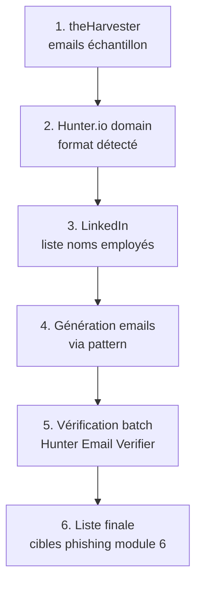

# 4.6 Hunter.io et formats d'emails entreprise

!!! quote "L'analogie de la serrure standardisée"

    Dans un immeuble, toutes les portes sont équipées de serrures du même modèle. Si vous comprenez le mécanisme d'une serrure, vous savez ouvrir les autres avec la même clé. Les emails d'entreprise fonctionnent pareillement. Une fois que vous avez compris le format d'ARTECH (par exemple `prenom.nom@artech.fr`), vous pouvez générer la liste de tous les employés sans même avoir besoin de la chercher sur le web. Hunter.io est l'outil qui révèle ce format en quelques secondes.

## Métadonnées du chapitre

Ce chapitre est court mais très opérationnel. Voici ses caractéristiques.

| Champ | Valeur |
|---|---|
| Durée estimée | 1 heure |
| Niveau | Pratique |
| Prérequis | 4.3 (theHarvester), 4.5 (LinkedIn) |
| Livrables | Liste générée des emails ARTECH probables |
| Auto-explication | 5 minutes |

## Objectifs pédagogiques

À l'issue de ce chapitre, vous serez capable de :

- Identifier le format d'emails d'une entreprise
- Utiliser Hunter.io pour cette détection
- Générer la liste complète des emails à partir d'un échantillon
- Connaître les outils alternatifs

---

## 1. Présentation de Hunter.io

**Hunter.io** est le service commercial de référence pour la recherche d'emails professionnels.

### 1.1 Caractéristiques

Voici les fonctionnalités clés à connaître.

| Fonctionnalité | Description |
|---|---|
| Domain Search | Lister les emails publics d'un domaine |
| Email Finder | Trouver l'email d'une personne précise |
| Email Verifier | Vérifier l'existence d'un email |
| Bulk Tasks | Traitement par lot |
| API | Intégration outils tiers |
| Tarif | 50 recherches/mois gratuites, payant ensuite |

### 1.2 Pourquoi c'est puissant

Hunter excelle dans deux usages très complémentaires.

| Usage | Apport |
|---|---|
| Identifier le pattern | Quelques exemples révèlent le format complet |
| Lister publics | Emails déjà visibles regroupés |

## 2. Formats d'emails courants

Avant Hunter, voici les formats les plus utilisés en entreprise française.

### 2.1 Formats fréquents

Voici la classification des formats d'emails entreprise par fréquence d'apparition.

| Format | Exemple | Fréquence FR |
|---|---|---|
| `prenom.nom@` | sophie.dupont@artech.fr | Très fréquent |
| `prenomnom@` | sophiedupont@artech.fr | Modéré |
| `p.nom@` | s.dupont@artech.fr | Fréquent |
| `pnom@` | sdupont@artech.fr | Modéré |
| `nom@` | dupont@artech.fr | Rare (sauf petites entreprises) |
| `nom.prenom@` | dupont.sophie@artech.fr | Rare |
| `prenom@` | sophie@artech.fr | Très rare (TPE) |

### 2.2 Variantes à considérer

Plusieurs ajustements peuvent compliquer la détection.

| Variante | Cas |
|---|---|
| Accents traités | sophie / sòphie |
| Tirets dans nom composé | jean-pierre.dupont / jeanpierre.dupont |
| Particules | de.la.fontaine / delafontaine |
| Homonymes | sophie.dupont1 / sophie.dupont.2 |
| Anciens employés | format différent si ancien |

## 3. Domain Search Hunter.io

### 3.1 Recherche basique

Voici comment lancer une recherche sur ARTECH.

```text
RECHERCHE DOMAIN HUNTER.IO
============================

URL : https://hunter.io/search/artech.fr

Résultats affichés :
  - Format détecté avec confiance %
  - Échantillon d'emails publics
  - Sources où ces emails ont été vus
  - Date dernière vérification

INFORMATIONS CLÉS
  Pattern detected : {first}.{last}
  Confidence : 85% (par exemple)
  Sample emails : 12 trouvés
```

### 3.2 API Hunter.io

Pour automatiser, l'API REST permet l'intégration dans vos scripts.

```bash
# Configuration clé API
HUNTER_KEY="votre_cle_api"

# Domain search
curl "https://api.hunter.io/v2/domain-search?domain=artech.fr&api_key=$HUNTER_KEY" \
    | jq '.data | {pattern: .pattern, confidence: .confidence, emails: .emails[] | {value, first_name, last_name, position}}'

# Sortie typique
# {"pattern": "{first}.{last}", "confidence": 85}
# {"value": "sophie.dupont@artech.fr", "first_name": "Sophie", "last_name": "Dupont", "position": "Comptable"}
# ...
```

### 3.3 Email Finder

Pour une personne précise dont vous avez le nom, le Email Finder construit l'adresse probable.

```bash
# Recherche d'un email à partir d'un nom
curl "https://api.hunter.io/v2/email-finder?domain=artech.fr&first_name=Paul&last_name=Dubois&api_key=$HUNTER_KEY" \
    | jq '.data | {email: .email, score: .score}'

# Sortie typique
# {"email": "paul.dubois@artech.fr", "score": 90}
```

### 3.4 Email Verifier

Pour vérifier qu'une adresse existe avant de l'utiliser, l'Email Verifier teste sans alerter la cible.

```bash
# Vérification d'un email
curl "https://api.hunter.io/v2/email-verifier?email=paul.dubois@artech.fr&api_key=$HUNTER_KEY" \
    | jq '.data | {result: .result, score: .score, regexp: .regexp, gibberish: .gibberish, disposable: .disposable, mx_records: .mx_records}'
```

Le champ `result` peut prendre les valeurs suivantes.

| Valeur | Signification |
|---|---|
| deliverable | Email valide et accepté |
| undeliverable | N'existe pas ou rejeté |
| risky | Existe mais incertain (catch-all, etc.) |
| unknown | Vérification impossible |

## 4. Génération de la liste complète

### 4.1 Méthodologie

Une fois le format ARTECH connu (`prenom.nom@artech.fr`), vous croisez avec la liste LinkedIn pour générer tous les emails.

```bash
# Liste de noms LinkedIn récupérés (du chapitre 4.5)
cat noms-linkedin-artech.txt
# Sophie Dupont
# Jean Martin
# Hélène Lefebvre
# Paul Dubois
# Marie Lambert
# ...

# Génération des emails selon le pattern détecté
while read line; do
    prenom=$(echo "$line" | awk '{print tolower($1)}' | iconv -t ASCII//TRANSLIT)
    nom=$(echo "$line" | awk '{print tolower($2)}' | iconv -t ASCII//TRANSLIT)
    echo "${prenom}.${nom}@artech.fr"
done < noms-linkedin-artech.txt > emails-generes.txt
```

### 4.2 Vérification batch

Vous validez ensuite en lot avec l'API Hunter.

```bash
#!/bin/bash
# verify-batch.sh

HUNTER_KEY="votre_cle"

while read email; do
    result=$(curl -s "https://api.hunter.io/v2/email-verifier?email=$email&api_key=$HUNTER_KEY" \
             | jq -r '.data.result')
    echo "$email : $result"
done < emails-generes.txt > verification-batch.txt
```

### 4.3 Limites de la vérification

Plusieurs cas faussent la vérification automatique.

| Cas | Effet |
|---|---|
| Catch-all email | Tous les emails passent (pas fiable) |
| Greylisting | Faux undeliverable temporaire |
| Anti-bot serveur | Vérification refusée |
| Disposable email | Adresses jetables détectées |

## 5. Outils alternatifs

### 5.1 EmailHippo

**EmailHippo** propose un service similaire avec un focus vérification.

| Caractéristique | Valeur |
|---|---|
| Tarif | Pay-per-use |
| Intégration | API REST |
| Spécialité | Vérification massive |

### 5.2 Snov.io

**Snov.io** combine recherche et vérification avec un palier gratuit relativement généreux.

### 5.3 Outils CLI

Plusieurs outils en ligne de commande peuvent aider en complément.

| Outil | Usage |
|---|---|
| email-format-finder | Détection format simple |
| FOCA | Métadonnées documents (cycle 2) |
| Maltego transforms | Plusieurs entités email |

## 6. Cas pratique - Génération ARTECH

### 6.1 Mise en situation

Vous combinez les chapitres 4.3 et 4.5 pour produire la liste exhaustive des emails ARTECH.

### 6.2 Workflow

Voici la séquence complète à suivre.



### 6.3 Sortie attendue

À l'issue, vous avez constitué la liste exhaustive.

```text
LISTE FINALE EMAILS ARTECH 2026
=================================

Format détecté : {first}.{last}@artech.fr
Confidence : 92% (Hunter.io)

EMAILS VÉRIFIÉS DELIVERABLE (15)
  helene.lefebvre@artech.fr
  sophie.dupont@artech.fr
  jean.martin@artech.fr
  paul.dubois@artech.fr
  marie.lambert@artech.fr
  ...

EMAILS GÉNÉRIQUES TROUVÉS (5)
  contact@artech.fr
  commercial@artech.fr
  support@artech.fr
  sav@artech.fr
  recrutement@artech.fr

EMAILS GÉNÉRÉS NON VÉRIFIÉS (3)
  (Nom trouvé sur LinkedIn mais pas confirmé Hunter)
  ...

EMAILS RISKY (2)
  (Possible catch-all)
  ...

TOTAL EXPLOITABLE PHISHING : 15 emails personnels
                              + 5 génériques
```

## 7. Précautions et limites

### 7.1 Détection par les filtres anti-bots

Hunter peut être détecté côté serveur ARTECH si le verifier déclenche des SMTP RCPT TO. Pour minimiser :

| Précaution | Effet |
|---|---|
| Étaler les vérifications dans le temps | Pas de pic suspect |
| Ne pas tester emails massivement | Limites Hunter |
| Combiner avec sources publiques | Validation indirecte |

### 7.2 Coût

Si vous dépassez 50 vérifications/mois, le tarif passe à 49 USD/mois minimum. Pour le labo, ce n'est pas justifié.

### 7.3 Légalité

La génération d'emails à partir d'un pattern est **légale**. C'est seulement leur utilisation pour spam, phishing hors mandat, ou autre infraction qui devient illégal.

## 8. Auto-évaluation

Vérifiez votre maîtrise par les questions suivantes.

| # | Question | Réponse |
|---|---|---|
| 1 | Format le plus fréquent en France ? | prenom.nom@ |
| 2 | URL Hunter.io domain search ? | hunter.io/search/[domaine] |
| 3 | Endpoint API domain search ? | /v2/domain-search |
| 4 | Limite gratuite mensuelle ? | 50 recherches |
| 5 | Cas faussant le verifier ? | Catch-all, greylisting |
| 6 | Outil alternatif vérification massive ? | EmailHippo |
| 7 | Comment générer liste à partir du pattern ? | Croiser avec noms LinkedIn |
| 8 | Légalité de la génération de pattern ? | Légale |

## 9. Synthèse

Voici les points clés à retenir.

```text
HUNTER.IO ET FORMATS EMAIL

OUTIL CENTRAL : Hunter.io
  Domain Search : pattern + emails publics
  Email Finder : email d'une personne
  Email Verifier : validation existence
  50 recherches gratuites/mois

FORMATS COURANTS (FR)
  prenom.nom@ : très fréquent
  prenomnom@ : modéré
  p.nom@ : fréquent
  pnom@ : modéré

WORKFLOW COMPLET ARTECH
  1. theHarvester : emails échantillon
  2. Hunter Domain : pattern
  3. LinkedIn : noms complets
  4. Génération bash via pattern
  5. Verifier en batch
  6. Liste finale exploitable

OUTILS ALTERNATIFS
  EmailHippo
  Snov.io
  Maltego transforms

LÉGALITÉ
  Génération pattern légale
  Usage forensic encadré par mandat
```

---

**Chapitre précédent** : [4.5 Profilage humain LinkedIn et réseaux sociaux](4-5-profilage-linkedin.md)

**Chapitre suivant** : [4.7 Maltego CE pour cartographie](4-7-maltego-ce.md)
