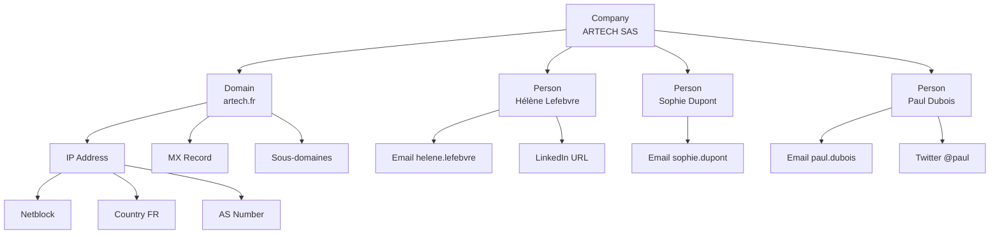

# 4.7 Maltego CE pour cartographie

!!! quote "L'analogie de la carte routière vs liste de villes"

    Pour comprendre un trajet, vous pouvez consulter une liste textuelle des villes traversées. Ou regarder une carte routière. La carte révèle instantanément ce que la liste cache : les détours, les raccourcis, les nœuds, les régions denses ou désertes. Maltego apporte cette dimension visuelle à votre OSINT. Une liste d'employés ARTECH avec leurs emails, leurs domaines, leurs réseaux sociaux est utile. Mais le graphe Maltego les organise en réseau de relations qui révèle les pivots non évidents : "tiens, trois employés ont fréquenté la même école il y a 15 ans, c'est peut-être par eux que les ordres internes circulent vraiment".

## Métadonnées du chapitre

Ce chapitre vous initie à la visualisation OSINT. Voici ses caractéristiques.

| Champ | Valeur |
|---|---|
| Durée estimée | 3 heures |
| Niveau | Pratique |
| Prérequis | 4.1 à 4.6 |
| Livrables | Graphe Maltego ARTECH complet |
| Auto-explication | 12 minutes |

## Objectifs pédagogiques

À l'issue de ce chapitre, vous serez capable de :

- Installer et configurer Maltego CE
- Comprendre les concepts d'entités et transforms
- Cartographier ARTECH visuellement
- Exporter le graphe pour rapport
- Connaître les alternatives gratuites

---

## 1. Présentation de Maltego

**Maltego** est l'outil de référence pour la visualisation OSINT depuis 2008. Développé par Paterva (devenu Maltego Technology).

### 1.1 Caractéristiques

Voici les points forts de l'outil.

| Caractéristique | Précision |
|---|---|
| Type | Application Java multiplateforme |
| Édition | CE gratuite, Pro/Enterprise payantes |
| Plateformes | Windows, Linux, macOS |
| Modèle | Graphe d'entités liées par transforms |
| Communauté | Plugins et transforms tiers |
| Export | PDF, image, XML, CSV |

### 1.2 Différence CE / Pro

Voici les limites de la version Community Edition gratuite.

| Aspect | CE (gratuit) | Pro (payant) |
|---|---|---|
| Entités max par graphe | 12 | Illimité |
| Transforms par run | 12 | Illimité |
| API requise | Compte gratuit | Compte commercial |
| Entités custom | Limité | Complet |
| Hub / iCalendar | Non | Oui |

Pour OmnyAcademy, **CE suffit** pour les exercices ARTECH.

### 1.3 Concepts fondamentaux

Maltego repose sur trois notions principales.

| Notion | Description |
|---|---|
| Entité | Objet du graphe (personne, email, domaine, IP, etc.) |
| Transform | Action transformant une entité en d'autres entités liées |
| Machine | Enchaînement automatisé de transforms |

## 2. Installation et configuration

### 2.1 Téléchargement

Maltego CE se télécharge depuis le site officiel.

```bash
# Sur Linux/Kali
# https://www.maltego.com/downloads/

# Téléchargement Maltego CE pour Linux
wget https://www.maltego.com/downloads/maltego-{version}.deb -O maltego.deb
sudo dpkg -i maltego.deb
sudo apt install -f  # résoudre dépendances

# Lancement
maltego &
```

### 2.2 Inscription compte

Au premier lancement, vous devez créer un compte Maltego gratuit.

```text
INSCRIPTION MALTEGO
====================

1. Lancer Maltego
2. Choisir "Maltego CE (Free)"
3. Créer compte avec email pro
4. Confirmer email
5. Connexion dans l'application
6. Accepter les terms
7. Sélectionner les Transform Hubs gratuits
   à activer (commencer par MaltegoCE par défaut)
```

### 2.3 Transform Hubs gratuits

Plusieurs hubs sont disponibles gratuitement. Voici les plus utiles.

| Hub | Apport |
|---|---|
| Maltego Standard | Transforms de base (Whois, DNS, etc.) |
| Have I Been Pwned | Vérification fuites |
| Shodan (limité) | Reconnaissance infrastructure |
| ThreatCrowd | Threat intelligence |
| Hunter.io | Lookup emails (clé API requise) |

## 3. Entités principales

Maltego propose plus de 50 types d'entités. Voici les plus utilisées.

### 3.1 Personnes et identités

Voici les entités liées aux humains.

| Entité | Usage |
|---|---|
| Person | Personne identifiée |
| Email Address | Adresse email |
| Phone Number | Numéro de téléphone |
| Alias | Pseudo / username |

### 3.2 Organisations

Voici les entités liées aux structures.

| Entité | Usage |
|---|---|
| Company | Société |
| Organization | Organisation non commerciale |
| Group | Groupe ou équipe |

### 3.3 Infrastructure technique

Voici les entités techniques.

| Entité | Usage |
|---|---|
| Domain | Nom de domaine |
| Website | Site web |
| URL | URL spécifique |
| IP Address | Adresse IP |
| Netblock | Plage IP |
| AS | Système autonome |
| DNS Name | Hostname |
| MX Record | Serveur email |

### 3.4 Lieux et géographie

Voici les entités géographiques.

| Entité | Usage |
|---|---|
| Location | Lieu |
| Coordinates | Coordonnées GPS |
| Country | Pays |
| City | Ville |

### 3.5 Documents et fichiers

Voici les entités liées aux documents.

| Entité | Usage |
|---|---|
| Document | Document publié |
| Image | Image |
| MD5 / SHA-1 / SHA-256 | Hash de fichier |

## 4. Transforms

Les **transforms** sont des fonctions qui transforment une entité en d'autres entités liées. Maltego CE en propose des centaines.

### 4.1 Transforms par type d'entrée

Voici les transforms les plus courants pour chaque type d'entité.

Pour une entité **Domain**, voici les transforms typiques.

| Transform | Effet |
|---|---|
| To DNS Name (interesting) | Liste sous-domaines connus |
| To IP Address (DNS) | Résolution IP |
| To MX Record | Serveurs email |
| To Whois | Informations Whois |
| To Email Address (using domain) | Emails publics du domaine |

Pour une entité **Person**, voici les transforms typiques.

| Transform | Effet |
|---|---|
| To Email Address | Emails associés |
| To Phone Number | Téléphones associés |
| To Website | Sites associés |
| To Documents | Documents mentionnant la personne |

Pour une entité **IP Address**, voici les transforms.

| Transform | Effet |
|---|---|
| To Netblock | Plage IP |
| To AS Number | Système autonome |
| To Country | Pays géolocalisation |
| To DNS Name (PTR record) | Reverse DNS |
| To Domain (using DNS Hub) | Domaines hébergés |

Pour une entité **Email Address**, voici les transforms.

| Transform | Effet |
|---|---|
| To Person | Personne associée |
| To Phone Number | Téléphone associé |
| To Pwned (HIBP) | Vérification fuites |
| To Domain | Extraction domaine |

### 4.2 Lancement d'un transform

Pour exécuter un transform, vous procédez ainsi.

```text
EXÉCUTION D'UN TRANSFORM
==========================

1. Glisser une entité depuis la palette gauche
   sur le canvas
2. Saisir la valeur (par ex. "artech.fr" pour Domain)
3. Clic droit sur l'entité
4. Choisir une catégorie de transforms
5. Sélectionner le transform désiré
6. Le résultat s'affiche en nouvelles entités
   reliées par des arêtes
```

## 5. Machines - Workflows automatisés

Une **machine** est un script enchaînant plusieurs transforms automatiquement.

### 5.1 Machines pré-installées

Maltego CE inclut plusieurs machines utiles. Voici les plus pertinentes pour ARTECH.

| Machine | Effet |
|---|---|
| Company Stalker | Recense email, social, web pour une société |
| Footprint L1 | Reconnaissance domaine basique |
| Footprint L2 | Reconnaissance étendue |
| Footprint L3 | Reconnaissance approfondie |
| Person - Email Address | Profil d'une personne via email |

### 5.2 Lancement d'une machine

Pour exécuter une machine, vous procédez ainsi.

```text
LANCEMENT MACHINE
==================

1. Sur le canvas, ajouter l'entité de départ
   (par ex. Domain "artech.fr")
2. Clic droit → Run Machine
3. Sélectionner "Footprint L1" (par exemple)
4. La machine enchaîne les transforms
5. Le graphe se construit automatiquement
6. Limite CE : s'arrête à 12 entités/run
```

## 6. Cartographie ARTECH

### 6.1 Plan du graphe

Voici la structure que vous allez construire pour ARTECH.



### 6.2 Construction étape par étape

Voici la séquence détaillée à suivre.

```text
CONSTRUCTION GRAPHE ARTECH
============================

ÉTAPE 1 - Entité Company
  - Glisser Company sur le canvas
  - Saisir "ARTECH SAS"

ÉTAPE 2 - Lien vers Domain
  - Glisser Domain
  - Saisir "artech.fr"
  - Lier manuellement à Company

ÉTAPE 3 - Transforms Domain
  Sur Domain "artech.fr" :
  - To IP Address (DNS)
  - To MX Record
  - To DNS Name (sous-domaines)

ÉTAPE 4 - Transforms IP
  Sur l'IP obtenue :
  - To Netblock
  - To AS Number
  - To Country

ÉTAPE 5 - Personnes
  Glisser Person sur canvas
  Saisir "Hélène Lefebvre"
  Lier à Company

ÉTAPE 6 - Email pour chaque personne
  - To Email Address
  - Copier emails du chapitre 4.6

ÉTAPE 7 - Vérification fuites
  Sur chaque Email :
  - To Pwned (HIBP)
  Voir lesquels apparaissent dans des fuites

ÉTAPE 8 - Sauvegarde
  Fichier → Save As → artech-graph.mtgx
```

### 6.3 Limites CE et stratégie

Avec la limite de 12 entités par run, vous structurez votre travail en plusieurs graphes thématiques.

| Graphe | Contenu |
|---|---|
| 1 - Infrastructure | Domain, IP, MX, Netblock, AS |
| 2 - Personnes clés | 3-5 employés et leurs emails |
| 3 - Présence sociale | Entités personnelles + réseaux sociaux |
| 4 - Documents | Documents publics et leurs métadonnées |

## 7. Export et restitution

### 7.1 Formats d'export

Maltego CE permet plusieurs formats d'export.

| Format | Usage |
|---|---|
| MTGX | Format natif Maltego (réimportable) |
| PDF | Pour rapport |
| PNG / JPG | Image fixe |
| CSV | Liste tabulaire des entités |
| XML | Format intermédiaire |

### 7.2 Capture pour rapport

Pour intégrer le graphe au rapport OSINT final, voici la procédure.

```text
EXPORT POUR RAPPORT
=====================

1. Organiser le graphe (drag entités si besoin)
2. Vérifier que tout est lisible (zoom)
3. Fichier → Export Graph → choose PDF
4. Sauvegarder dans le dossier OSINT
5. Hash SHA-256 du PDF pour intégrité
6. Référencer dans le rapport
```

### 7.3 Cas pratique - export ARTECH

Voici la commande pour finaliser l'export et l'intégrer à votre dossier.

```bash
# Export depuis Maltego (manuel via menu)
# → ~/osint/artech-2026/maltego/artech-graph.pdf

# Hash
cd ~/osint/artech-2026/maltego/
sha256sum artech-graph.pdf > artech-graph.sha256

# Mention dans MANIFEST global
cat artech-graph.sha256 >> ../MANIFEST.sha256
```

## 8. Alternatives à Maltego

Si Maltego ne vous convient pas, voici les alternatives gratuites.

### 8.1 SpiderFoot

**SpiderFoot** est l'alternative open source la plus complète.

| Caractéristique | Valeur |
|---|---|
| Tarif | Gratuit (CE), payant (HX cloud) |
| Type | Web app + CLI |
| Modules | 200+ |
| Visualisation | Limitée (export Maltego possible) |
| Automatisation | Excellente |

```bash
# Installation Kali (déjà incluse)
spiderfoot -l 127.0.0.1:5001

# Accéder à l'interface
firefox http://127.0.0.1:5001
```

### 8.2 Recon-ng

**Recon-ng** est un framework CLI orienté terminal.

```bash
# Lancer
recon-ng

# Charger workspace
[recon-ng] > workspaces create artech

# Modules
[recon-ng] > marketplace search

# Module exemple
[recon-ng] > modules load recon/domains-hosts/hackertarget
```

### 8.3 Comparaison

Voici la comparaison synthétique des outils de visualisation OSINT.

| Outil | Visualisation | Automatisation | Complexité |
|---|---|---|---|
| Maltego CE | Excellente | Moyenne | Moyenne |
| SpiderFoot | Faible | Excellente | Moyenne |
| Recon-ng | Aucune | Excellente | Élevée (CLI) |
| Maltego Pro | Excellente | Excellente | Coûteuse |

## 9. Auto-évaluation

Vérifiez votre maîtrise par les questions suivantes.

| # | Question | Réponse |
|---|---|---|
| 1 | Concept central Maltego ? | Entité + Transform |
| 2 | Limite CE entités par run ? | 12 |
| 3 | Format natif Maltego ? | MTGX |
| 4 | Machine pour analyse société ? | Company Stalker |
| 5 | Alternative open source à Maltego ? | SpiderFoot |
| 6 | Hub HIBP dans Maltego ? | Vérification fuites |
| 7 | Comment exporter en PDF ? | Fichier → Export Graph |
| 8 | Stratégie pour limites CE ? | Plusieurs graphes thématiques |

## 10. Synthèse

Voici les points clés à retenir.

```text
MALTEGO CE OSINT

CONCEPTS
  Entité (objet)
  Transform (fonction)
  Machine (workflow)

LIMITES CE GRATUITE
  12 entités par run
  12 transforms par run
  Compte gratuit requis

ENTITÉS CLÉS
  Person, Email, Phone
  Company, Organization
  Domain, IP, Netblock
  Document, Image

TRANSFORMS UTILES
  Domain → IP, MX, sous-domaines
  Person → Email, Phone
  Email → Pwned (HIBP)
  IP → Netblock, AS, Country

WORKFLOW ARTECH
  Graphe 1 : infrastructure
  Graphe 2 : personnes clés
  Graphe 3 : présence sociale
  Graphe 4 : documents

EXPORT
  MTGX (natif réimportable)
  PDF (rapport)
  PNG (image)
  CSV (tabulaire)

ALTERNATIVES
  SpiderFoot (automatisation)
  Recon-ng (CLI framework)
  Maltego Pro (commercial)
```

---

**Chapitre précédent** : [4.6 Hunter.io et formats d'emails entreprise](4-6-hunter-formats-emails.md)

**Chapitre suivant** : [4.8 Wardriving passif sur le terrain](4-8-wardriving-passif.md)
