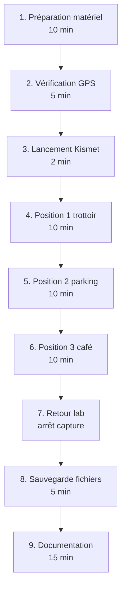

# 4.8 Wardriving passif sur le terrain

!!! quote "L'analogie du recensement de la bibliothèque municipale"

    Un agent municipal recense les bibliothèques de quartier sans entrer dans les livres. Il note l'adresse, l'enseigne, les horaires d'ouverture. Il ne lit aucun ouvrage, ne dérange aucun lecteur, ne franchit aucune porte. Cette inventaire est légal, public, transparent. Le wardriving passif obéit exactement à la même logique. Vous recensez les réseaux Wi-Fi visibles depuis la voie publique sans tenter de connexion ni d'écoute du trafic chiffré. Cette nuance entre observation et intrusion est ce qui distingue le wardriver du pirate. La franchir transforme un acte légal en délit pénal. Ce chapitre vous installe précisément cette frontière.

## Métadonnées du chapitre

Ce chapitre est le plus long du module 4 et le plus sensible juridiquement. Voici ses caractéristiques.

| Champ | Valeur |
|---|---|
| Durée estimée | 4 heures |
| Niveau | Pratique avancé |
| Prérequis | 4.4 (Wigle), Alfa AWUS036ACS configurée |
| Livrables | Cartographie GPS des Wi-Fi autour du labo ARTECH |
| Auto-explication | 15 minutes |

## Objectifs pédagogiques

À l'issue de ce chapitre, vous serez capable de :

- Définir précisément ce qu'est un wardriving passif
- Distinguer wardriving légal et illégal en France
- Configurer Kismet pour la collecte sans interception
- Capturer une cartographie GPS exploitable
- Contribuer optionnellement à Wigle.net
- Documenter la session dans le respect du droit

---

## 1. Cadre légal français du wardriving

Avant tout aspect technique, **le cadre juridique est primordial**. Une erreur de méthodologie peut transformer cet exercice en délit pénal.

### 1.1 Position juridique synthétique

Voici la position du droit français sur les différentes activités liées au Wi-Fi.

| Activité | Statut juridique |
|---|---|
| Détection passive de balises beacon | Légal (signal public) |
| Notation des SSID et BSSID | Légal |
| Géolocalisation des AP via GPS | Légal |
| Capture de paquets de management non chiffrés | Zone grise |
| Capture de données utilisateur (chiffrées) | Tendance illégale |
| Tentative de déchiffrement WPA2 sans mandat | Illégal (323-1) |
| Tentative de connexion sans autorisation | Illégal (323-1) |
| Capture handshake en vue de cracking | Illégal sans mandat (226-15) |

### 1.2 Articles pénaux applicables

Voici les articles à connaître précisément.

| Article | Infraction | Peine |
|---|---|---|
| 226-15 | Interception de communications privées | 1 an / 45 000 € |
| 323-1 | Accès / maintien frauduleux STAD | 3 ans / 100 000 € |
| 226-3 | Détention équipements interception | 5 ans / 300 000 € |
| 226-18 | Collecte déloyale données personnelles | 5 ans / 300 000 € |

### 1.3 Frontière concrète passive / active

Pour rendre la distinction opérationnelle, voici le tableau à mémoriser.

| Action | Mode passif (légal) | Mode actif (zones grises ou illégal) |
|---|---|---|
| Réception beacons | OUI | - |
| Capture probe requests | OUI (informatif) | - |
| Capture handshakes | NON | OUI (illégal sans mandat) |
| Déauthentification | NON | OUI (illégal sans mandat) |
| Capture de trafic data | NON | OUI (illégal) |
| Tentative connexion | NON | OUI (illégal) |
| Géolocalisation propre | OUI | - |

### 1.4 Lab OmnyAcademy

Pour le laboratoire ARTECH d'OmnyAcademy, vous opérez sur **votre propre matériel**, donc dans le cadre légal. Mais l'apprentissage doit se faire avec les **mêmes garde-fous** que sur le terrain réel, pour intégrer la frontière dès le départ.

## 2. Présentation de Kismet

**Kismet** est l'outil de référence open source pour le wardriving depuis 2001.

### 2.1 Caractéristiques

Voici les points forts de Kismet.

| Caractéristique | Précision |
|---|---|
| Type | Sniffer 802.11 / Bluetooth / SDR |
| Mode | Monitor / passif uniquement par défaut |
| Plateformes | Linux, macOS, OpenWrt |
| Interface | Web (port 2501 par défaut) |
| Fichiers de capture | Format .kismet (PCAP-ng compatible) |
| Intégration GPS | Native (gpsd) |
| Maintenu | Activement par Mike Kershaw |

### 2.2 Différence Kismet vs airodump-ng

Voici les différences entre Kismet et airodump-ng (vu en module 5).

| Aspect | Kismet | airodump-ng |
|---|---|---|
| Cible | Cartographie passive | Capture handshake offensive |
| Mode par défaut | Passif strict | Capture trafic complet |
| Interface | Web moderne | Terminal |
| GPS | Intégré | Via airodump-ng-oui-update |
| Format export | Kismet, PCAPng, JSON, KML | CSV, PCAP |
| Usage type | Wardriving légal | Pentest authentifié |

### 2.3 Pourquoi Kismet pour ce module

Kismet est **conçu pour l'observation passive**. Il ne capture pas activement les handshakes par défaut, ne fait pas de déauth, n'envoie aucun paquet. C'est l'outil le plus aligné avec l'approche légale.

## 3. Préparation matérielle

### 3.1 Carte WiFi compatible

Le wardriving nécessite une carte supportant le **mode monitor**. Voici les modèles recommandés.

| Modèle | Chipset | Compatibilité Linux |
|---|---|---|
| Alfa AWUS036ACS | Realtek RTL8812AU | Excellente (driver à compiler parfois) |
| Alfa AWUS036ACH | Realtek RTL8812AU | Excellente |
| Alfa AWUS036NHA | Atheros AR9271 | Native Kali |
| TP-Link TL-WN722N v1 | Atheros AR9271 | Native (v1 uniquement) |
| Panda PAU09 | Ralink RT5572 | Bonne |

Pour le module 3 du cycle 0, vous avez configuré une **Alfa AWUS036ACS**. C'est celle qui sera utilisée ici.

### 3.2 Récepteur GPS

Pour la cartographie, un récepteur GPS USB améliore la précision. Voici les options.

| Source GPS | Qualité | Coût |
|---|---|---|
| GPS USB dédié (BU-353-S4) | Excellente | 25-40 € |
| GPS smartphone via gpsd | Bonne | Gratuit (Android) |
| GPS Bluetooth | Modérée | Variable |
| Pas de GPS | Aucune géolocalisation | - |

Pour ce module, vous pouvez utiliser **gpsd** avec un GPS USB ou en partage Bluetooth depuis un smartphone Android.

### 3.3 Plateforme

Vous opérez depuis votre laptop **Kali Linux** du laboratoire. Pour des sessions sur le terrain, un Raspberry Pi 4 avec batterie est une alternative compacte.

## 4. Installation et configuration de Kismet

### 4.1 Installation sur Kali Linux

Kismet est inclus dans Kali. Voici la procédure de mise à jour.

```bash
# Mise à jour
sudo apt update
sudo apt install kismet -y

# Vérification version
kismet --version

# Ou installation depuis sources pour la version la plus récente
git clone https://github.com/kismetwireless/kismet.git
cd kismet
./configure
make -j4
sudo make install
```

### 4.2 Configuration utilisateur

Pour éviter d'utiliser sudo systématiquement, ajoutez votre utilisateur au groupe `kismet`.

```bash
# Ajout au groupe kismet
sudo usermod -aG kismet $USER

# Reconnexion nécessaire pour appliquer
# logout puis login

# Vérification
groups | grep kismet
```

### 4.3 Configuration GPS

Pour activer la géolocalisation, vous configurez gpsd.

```bash
# Installation
sudo apt install gpsd gpsd-clients -y

# Si GPS USB BU-353-S4 :
# Branchement, vérification reconnaissance
ls /dev/ttyUSB*

# Configuration gpsd
sudo systemctl stop gpsd.socket
sudo systemctl disable gpsd.socket
sudo gpsd /dev/ttyUSB0 -F /var/run/gpsd.sock

# Vérification que ça fonctionne
cgps -s
# Doit afficher des coordonnées GPS si visible du ciel
```

### 4.4 Fichier de configuration Kismet

Le fichier principal se trouve dans `/etc/kismet/kismet.conf`. Voici les paramètres à vérifier.

```bash
# Édition
sudo vi /etc/kismet/kismet.conf
```

Voici les directives principales à configurer.

```text
# Source de capture (carte Wi-Fi)
# Sera redéfini en ligne de commande, mais peut être préconfiguré
# source=wlan0:type=linuxwifi

# GPS
gps=gpsd:host=localhost,port=2947

# Logs
log_prefix=/home/zyrass/wardriving/

# Format de log
log_types=kismet,pcapng,wiglecsv

# Interface web
httpd_bind_address=127.0.0.1
httpd_port=2501

# Journal des erreurs
log_alerts=true
```

### 4.5 Compte web Kismet

Au premier lancement, Kismet demande la création d'un compte pour l'interface web.

```bash
# Lancement Kismet (sans capture pour configurer)
sudo kismet

# Le serveur web est sur http://localhost:2501
# Au premier accès, créer un compte admin
# Conserver les credentials dans KeePass labo
```

## 5. Mode monitor de la carte WiFi

Pour wardriver, votre carte Wi-Fi doit être en **mode monitor**.

### 5.1 Vérification

Voici les commandes pour vérifier le mode actuel.

```bash
# Liste des interfaces Wi-Fi
iwconfig

# Pour wlan1 (typique Alfa)
iw dev wlan1 info

# Mode actuel
iw dev wlan1 info | grep type
```

### 5.2 Passage en mode monitor

Voici la procédure standard pour passer une carte en mode monitor.

```bash
# Arrêt des processus interférents
sudo airmon-ng check kill

# Passage en mode monitor avec airmon-ng
sudo airmon-ng start wlan1

# La carte devient wlan1mon (par exemple)
iwconfig wlan1mon

# Alternative : commandes manuelles
sudo ip link set wlan1 down
sudo iw dev wlan1 set type monitor
sudo ip link set wlan1 up

# Vérification
iw dev wlan1 info | grep type
# Doit afficher : type monitor
```

### 5.3 Vérification injection (utile pour module 5)

Pour ce module-ci (passif), vous n'avez **pas besoin de tester l'injection**. C'est un sujet du module 5.

## 6. Capture wardriving

### 6.1 Lancement Kismet avec source

Voici la commande type pour lancer une session de wardriving passif.

```bash
# Lancement avec source wlan1mon (votre carte en monitor)
sudo kismet -c wlan1mon

# Le serveur web s'ouvre sur http://localhost:2501
# Connexion avec le compte créé précédemment
```

### 6.2 Interface web

L'interface web Kismet présente plusieurs panneaux d'information.

| Panneau | Information |
|---|---|
| Devices | Liste des AP et clients détectés |
| Channel | Activité par canal |
| GPS | Position actuelle et carte |
| Alerts | Anomalies détectées |
| Messages | Log temps réel |

### 6.3 Filtrage par BSSID ou SSID

Pour cibler ARTECH, vous filtrez l'affichage.

```text
FILTRES UTILES
================

Filtre par SSID
  Saisir "ARTECH-WIFI" dans la barre de recherche

Filtre par BSSID (si connu)
  Saisir "64:70:02:..." 

Filtre par chipset
  Filtrer par OUI

Filtre par sécurité
  WPA2-PSK, WPA3, Open, etc.
```

### 6.4 Channel hopping

Par défaut, Kismet fait du **channel hopping** : il scanne tous les canaux Wi-Fi rapidement. Pour observer un AP précis, vous pouvez bloquer sur son canal.

```text
CHANNEL HOPPING vs LOCK
=========================

HOPPING (par défaut)
  Avantage : couvre tous les AP
  Inconvénient : peut manquer paquets

LOCK sur canal
  Avantage : capture exhaustive d'un AP
  Inconvénient : ignore les autres AP

Pour ARTECH connu sur canal 6 par exemple :
  Dans interface web Kismet :
  Configure Source → Lock to channel 6
```

## 7. Session de wardriving terrain

### 7.1 Préparation

Avant de partir sur le terrain, voici la check-list.

```text
CHECK-LIST AVANT DÉPART
=========================

[ ] Laptop Kali chargé (au moins 80%)
[ ] Carte Alfa AWUS036ACS branchée
[ ] GPS USB connecté
[ ] gpsd actif et confirmé (cgps -s)
[ ] Kismet testé en intérieur
[ ] Mode monitor confirmé sur Alfa
[ ] Stockage suffisant (1 Go libre minimum)
[ ] Documentation prête (carnet, mandat si applicable)
[ ] Vêtements discrets (pas de "HACKER" sur t-shirt)
[ ] Pas de matériel suspect visible
```

### 7.2 Session ARTECH lab

Pour le scénario ARTECH, votre session se déroule **autour de votre laboratoire** (qui simule la PME). Vous mesurez ce qu'un attaquant verrait depuis :

| Position | Distance |
|---|---|
| Devant l'immeuble | 5-10 m |
| Trottoir d'en face | 15-20 m |
| Parking | 20-50 m |
| Café voisin | 50-100 m |

### 7.3 Déroulement type

Voici le déroulé d'une session de 1 heure.



### 7.4 Données collectées

Voici les types d'informations recueillies en 1 heure.

| Information | Quantité typique |
|---|---|
| AP détectés | 30-100 (zone urbaine FR) |
| Clients identifiés | 50-200 |
| Probe requests captés | 100-500 |
| Coordonnées GPS associées | Pour chaque AP |
| Niveau de signal moyen | Variable |

### 7.5 Identification ARTECH

Parmi les AP détectés, vous identifiez ceux d'ARTECH par leur SSID `ARTECH-WIFI` et la cohérence GPS avec le bâtiment cible.

## 8. Analyse des captures

### 8.1 Fichiers générés

À l'issue de la session, Kismet a produit plusieurs fichiers dans `/home/zyrass/wardriving/`.

| Fichier | Contenu |
|---|---|
| `*.kismet` | Format natif Kismet (analyse interface) |
| `*.pcapng` | Capture brute (Wireshark compatible) |
| `*.wiglecsv` | Pour contribution Wigle |
| `*.kismet.json` | Export JSON exploitable scripts |

### 8.2 Lecture du fichier .wiglecsv

Le format Wigle CSV est immédiatement exploitable. Voici un exemple typique.

```text
WigleWifi-1.4,appRelease=...,...
MAC,SSID,AuthMode,FirstSeen,Channel,RSSI,CurrentLatitude,CurrentLongitude,AltitudeMeters,AccuracyMeters,Type
64:70:02:XX:XX:XX,ARTECH-WIFI,[WPA2-PSK-CCMP][ESS],2026-04-30 10:23:14,6,-67,45.768234,4.801456,180,5,WIFI
F8:1A:67:YY:YY:YY,LIVEBOX-1234,[WPA2-PSK-CCMP][ESS],2026-04-30 10:23:18,11,-72,45.768156,4.801523,180,5,WIFI
```

### 8.3 Cartographie KML

Kismet peut exporter en KML pour visualisation Google Earth ou QGIS.

```bash
# Export KML depuis l'interface web Kismet
# Menu Data → Export Devices → KML

# Ouverture dans Google Earth (visualisation simple)
google-earth-pro mon-export.kml

# Ou QGIS pour analyse géospatiale poussée
qgis mon-export.kml
```

## 9. Contribution Wigle (optionnelle)

Si vous souhaitez contribuer à Wigle (recommandé pour l'écosystème), voici la procédure.

### 9.1 Application mobile WiGLE

L'application Android **WiGLE WiFi Wardriving** est l'outil officiel pour les utilisateurs grand public.

```text
INSTALLATION ET USAGE WIGLE ANDROID
======================================

1. Installation depuis F-Droid ou Play Store
2. Création compte Wigle (si pas déjà fait)
3. Permissions location et stockage
4. Démarrage capture (mode passif uniquement)
5. Conduite/marche dans la zone à cartographier
6. Arrêt capture
7. Upload vers Wigle (optionnel)

DONNÉES UPLOADÉES
  - BSSID
  - SSID
  - Type sécurité
  - Position GPS
  - Date/heure
```

### 9.2 Upload depuis Kismet

Pour uploader les captures Kismet vers Wigle, vous utilisez le format wiglecsv.

```text
UPLOAD VERS WIGLE
===================

1. Connexion sur https://wigle.net
2. Account → Upload Files
3. Choisir le fichier .wiglecsv
4. Upload

Quotas : selon classement utilisateur
Validation : 24-48h habituellement
```

### 9.3 Contribution éthique

Si vous décidez de contribuer, respectez les principes suivants.

| Principe | Application |
|---|---|
| Ne pas uploader son propre Wi-Fi | Évidence |
| Ne pas uploader Wi-Fi clients sans accord | Cas pentest |
| Anonymiser les SSID identifiants | "Maison Famille X" |
| Période de capture courte | Pas de surveillance continue |

## 10. Recommandations défensives

Une fois la cartographie ARTECH terminée, vous formulez des recommandations défensives.

### 10.1 Recommandations sur le SSID

Voici les bonnes pratiques pour un SSID résistant à l'OSINT.

| Pratique | Bénéfice |
|---|---|
| SSID non identifiant | "ARTECH-WIFI" → "Reseau-1" |
| Hidden SSID (limité) | Ne masque pas vraiment, mais filtre indexation |
| Rotation périodique | Périme les anciennes captures |
| Pas de SSID liés à des marques internes | "ProjetXY-WIFI" évité |

### 10.2 Recommandations sur le BSSID

Voici les pratiques liées au BSSID.

| Pratique | Bénéfice |
|---|---|
| MAC randomization si supporté | Change le BSSID régulièrement |
| Réduction puissance d'émission | Limite la portée à l'intérieur |
| Antennes directionnelles | Concentre le signal |
| WiFi enterprise (WPA2-EAP) | Robustesse cryptographique |

### 10.3 Mesures pratiques pour ARTECH

Voici la liste des mesures applicables au cas pédagogique.

```text
RECOMMANDATIONS DÉFENSIVES ARTECH

NIVEAU SSID
  Renommer "ARTECH-WIFI" → "Reseau-Pro-01"
  Ne pas mentionner le secteur médical

NIVEAU BSSID
  Réduire puissance émission TP-Link Archer C7
  Position centrale dans le bâtiment

NIVEAU SÉCURITÉ
  Migration WPA2-PSK → WPA3-SAE
  Ou WPA2-EAP avec serveur RADIUS

NIVEAU GOUVERNANCE
  Audit trimestriel Wigle
  Sensibilisation employés (pas d'oubli AP perso)
  Politique BYOD si nécessaire
```

## 11. Pièges et bonnes pratiques

### 11.1 Pièges fréquents

Voici les erreurs courantes en wardriving.

| Piège | Évitement |
|---|---|
| Activer involontairement la capture data | Vérifier mode monitor strict |
| Tester déauthentification "pour voir" | Strictement interdit hors mandat |
| Garder les captures indéfiniment | Calendrier RGPD strict |
| Cartographier sans GPS | Données moins exploitables |
| Wardriving en zone résidentielle | RGPD sensible (Wi-Fi maisons) |

### 11.2 Bonnes pratiques

À l'inverse, voici les pratiques à respecter.

| Pratique | Bénéfice |
|---|---|
| Mandat documenté ou audit interne | Cadrage légal |
| Sessions courtes ciblées | Minimisation |
| Suppression data brute après analyse | RGPD |
| Hash des fichiers Kismet | Forensic |
| Trajets logiques (pas de zigzag suspect) | Discrétion |

## 12. Cas pratique - Session ARTECH lab

### 12.1 Mise en situation

Vous wardrivez autour de votre laboratoire ARTECH pour évaluer ce qu'un attaquant verrait depuis l'extérieur.

### 12.2 Déroulement

Voici la session complète à mener pour le labo.

```bash
# Préparation
mkdir -p ~/osint/artech-2026/wardriving
cd ~/osint/artech-2026/wardriving

# Vérification GPS
cgps -s
# Confirmer fix (3D fix avec coordonnées valides)

# Mode monitor sur Alfa
sudo airmon-ng check kill
sudo airmon-ng start wlan1
# Note : la carte devient wlan1mon

# Lancement Kismet
sudo kismet -c wlan1mon \
    --override wardrive

# Dans un autre terminal, surveillance
ss -tlnp | grep 2501
# Confirmer port 2501 ouvert

# Ouverture interface web
firefox http://localhost:2501

# Session de capture (45-60 minutes)
# Marche autour du bâtiment du lab

# Arrêt Kismet via interface (Stop server)
# Ou Ctrl+C dans le terminal kismet

# Récupération fichiers
ls -lh /home/zyrass/wardriving/

# Hash
sha256sum *.kismet *.pcapng *.wiglecsv > MANIFEST.sha256
```

### 12.3 Synthèse

À l'issue, vous documentez les résultats.

```text
SESSION WARDRIVING ARTECH LAB - 2026-XX-XX
=============================================

DURÉE : 1h00 (10:00 - 11:00 UTC)
ANALYSTE : Zyrass
MATÉRIEL : Alfa AWUS036ACS, BU-353-S4 GPS
LOCALISATION : autour du laboratoire ARTECH

STATISTIQUES
  AP détectés    : 47
  Clients vus    : 89
  AP en WPA2-PSK : 38 (81%)
  AP en WPA3-SAE : 4 (9%)
  AP en open     : 5 (11%, probablement guests)

ARTECH IDENTIFIÉ
  SSID    : ARTECH-WIFI
  BSSID   : 64:70:02:XX:XX:XX (TP-Link Archer C7)
  Sécurité: WPA2-PSK CCMP
  Canal   : 6
  RSSI moy: -67 dBm depuis trottoir
  Position: lat 45.7682, lon 4.8014

VOISINS WIFI
  Nombreux Livebox-XXXX (résidentiel)
  Quelques entreprises voisines identifiables
  Cafés du quartier en open (potentiel rebond)

VULNÉRABILITÉS ARTECH IDENTIFIÉES
  - SSID identifiant clairement la société
  - WPA2-PSK avec PSK probablement faible
    (à confirmer module 5)
  - Signal débordant largement sur trottoir
  - Pas de WPA3 SAE
  - BSSID référencé probablement Wigle

RECOMMANDATIONS
  Renommage SSID
  Réduction puissance émission
  Migration WPA3-SAE
  PSK 20+ caractères aléatoires
```

## 13. Auto-évaluation

Vérifiez votre maîtrise par les questions suivantes.

| # | Question | Réponse |
|---|---|---|
| 1 | Différence wardriving passif et actif ? | Passif = observation, actif = injection |
| 2 | Article pénal sur interception ? | 226-15 |
| 3 | Outil de référence open source ? | Kismet |
| 4 | Auteur de Kismet ? | Mike Kershaw |
| 5 | Daemon GPS sous Linux ? | gpsd |
| 6 | Format CSV pour upload Wigle ? | .wiglecsv |
| 7 | Mode requis pour la carte WiFi ? | Monitor |
| 8 | Port web par défaut Kismet ? | 2501 |

## 14. Synthèse

Voici les points clés à retenir.

```text
WARDRIVING PASSIF

CADRE LÉGAL FRANCE
  Passif (observation) = légal
  Actif (injection) = illégal sans mandat
  Articles 226-15, 323-1, 226-3, 226-18

OUTIL DE RÉFÉRENCE
  Kismet (Mike Kershaw)
  Open source
  Mode passif strict par défaut
  Interface web port 2501

MATÉRIEL
  Carte WiFi mode monitor (Alfa AWUS036ACS)
  GPS USB (BU-353-S4 ou équivalent)
  Laptop ou Raspberry Pi 4

CONFIGURATION
  airmon-ng check kill puis start
  gpsd activé /dev/ttyUSB0
  Kismet -c wlan1mon
  Compte web créé

DONNÉES COLLECTÉES
  BSSID, SSID, sécurité
  Canal, RSSI
  Coordonnées GPS
  Probe requests clients

FORMATS EXPORT
  .kismet (natif)
  .pcapng (Wireshark)
  .wiglecsv (Wigle upload)
  .kml (Google Earth)

RECOMMANDATIONS DÉFENSIVES ARTECH
  SSID non identifiant
  Réduction puissance
  WPA3-SAE migration
  PSK 20+ caractères
  Audit Wigle trimestriel
```

---

**Chapitre précédent** : [4.7 Maltego CE pour cartographie](4-7-maltego-ce.md)

**Chapitre suivant** : [4.9 Production du rapport OSINT structuré](4-9-rapport-osint.md)
