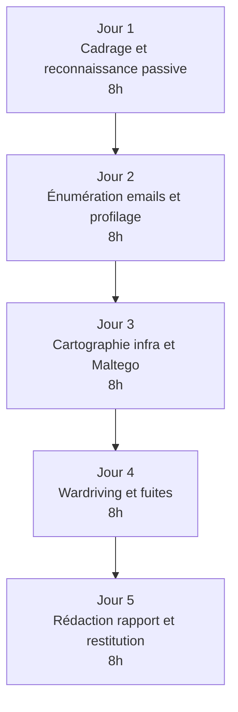

# 4.10 Cas pratique ARTECH profilage complet

!!! quote "L'analogie de l'épreuve de pratique au permis de conduire"

    L'examen théorique du code se passe assis, on coche des cases. L'examen pratique se passe au volant, dans la circulation réelle. Le second valide ce que le premier a appris. Vous venez de passer 9 chapitres à acquérir des outils et méthodologies. Ce dixième chapitre est l'épreuve pratique. Vous menez une mission OSINT ARTECH complète, de bout en bout, dans les conditions réelles. Si vous validez cet exercice, vous êtes prêt pour le module 5 et l'attaque WiFi. Sinon, c'est qu'un chapitre précédent mérite d'être repris.

## Métadonnées du chapitre

Ce chapitre clôt le module 4 par un exercice intégrateur. Voici ses caractéristiques.

| Champ | Valeur |
|---|---|
| Durée estimée | 2 heures de cadrage + 5 jours de pratique |
| Niveau | Synthèse pratique |
| Prérequis | 4.1 à 4.9 maîtrisés |
| Livrables | Rapport OSINT ARTECH complet livrable |
| Auto-explication | 15 minutes |

## Objectifs pédagogiques

À l'issue de ce chapitre, vous serez capable de :

- Conduire une mission OSINT complète de bout en bout
- Articuler tous les outils et méthodes du module
- Produire un livrable professionnel
- Identifier vos zones de fragilité méthodologique
- Préparer la suite (modules 5 et 6)

---

## 1. Cadrage de l'exercice

### 1.1 Mise en situation

Vous êtes consultant OmnyVia. ARTECH SAS, par la voix de sa PDG Hélène Lefebvre, vous mandate pour un **audit OSINT défensif**. L'objectif est de **mesurer ce qu'un attaquant peut découvrir publiquement** sur ARTECH avant une éventuelle attaque, et de formuler des recommandations.

### 1.2 Mandat fictif

Voici le mandat fictif simulé pour cet exercice.

```text
MANDAT FICTIF - À EXÉCUTER EN LAB UNIQUEMENT
==============================================

ARTECH SAS
SIRET : XXX XXX XXX 00012
Représentée par : Hélène Lefebvre, Présidente

mandate

OmnyVia (auto-entreprise Zyrass)
Référence : OmnyVia-OSINT-2026-001

Pour mener un audit OSINT défensif consistant à :
  - Recenser l'empreinte numérique d'ARTECH
  - Identifier les vulnérabilités OSINT
  - Formuler des recommandations défensives

Durée : 5 jours ouvrés
Période : du AAAA-MM-JJ au AAAA-MM-JJ
Tarif : forfait fictif (cas pédagogique)

Périmètre autorisé :
  Toutes les techniques des chapitres 4.1 à 4.9
  appliquées au laboratoire ARTECH d'OmnyAcademy

Périmètre interdit :
  Toute action sortant du laboratoire
  Toute interaction directe avec personnes réelles
  
Signataire : Hélène Lefebvre, fictive
Date : YYYY-MM-DD
```

### 1.3 Contexte ARTECH rappelé

Pour mémoire, voici les caractéristiques d'ARTECH telles que vous les avez configurées au cycle 0 module 3.

| Élément | Valeur |
|---|---|
| Raison sociale | ARTECH SAS |
| Activité | Distribution médicale |
| Localisation | Lyon Vaise |
| Effectif | 42 salariés simulés |
| SI | 3 PC + 1 serveur + Wi-Fi WPA2 |
| Wi-Fi SSID | ARTECH-WIFI |
| Wi-Fi PSK | ArtechMedical2020! (faible) |
| Profils types | PDG Hélène Lefebvre, comptable Sophie Dupont, stagiaire Paul Dubois |

## 2. Plan de la mission sur 5 jours

### 2.1 Vue d'ensemble

Voici le découpage de la mission en 5 jours ouvrés.



### 2.2 Détail jour par jour

Voici le détail des activités par journée.

| Jour | Matin (4h) | Après-midi (4h) |
|---|---|---|
| 1 | Cadrage, RGPD, plan | Pappers, BODACC, site web, Wayback |
| 2 | theHarvester, Hunter | Profilage LinkedIn 3 cibles |
| 3 | DNS et infrastructure | Maltego CE graphe complet |
| 4 | Wardriving Kismet | HIBP, IntelX consultation |
| 5 | Rédaction rapport | PDF, signature, restitution |

## 3. Jour 1 - Cadrage et reconnaissance passive

### 3.1 Matin - Cadrage et préparation (4 heures)

Voici les actions à mener le premier matin.

```bash
# 1. Création du dossier de mission
mkdir -p ~/osint/artech-2026/{cadrage,sources,captures,maltego,wardriving,fuites,rapport}
cd ~/osint/artech-2026/

# 2. Initialisation du journal
cat > journal.md << 'EOF'
# Journal OSINT ARTECH 2026

## Mission

Référence : OmnyVia-OSINT-2026-001
Mandataire : Hélène Lefebvre, ARTECH SAS
Période : du YYYY-MM-DD au YYYY-MM-DD

## Actions horodatées

EOF

# 3. Test de mise en balance RGPD
cat > cadrage/test-mise-en-balance.md << 'EOF'
# Test de mise en balance - intérêt légitime

## 1. Purpose Test (légitimité)

L'objectif est l'audit défensif d'ARTECH SAS,
mandataire. Légal et bien défini.

## 2. Necessity Test (nécessité)

Le profilage OSINT est nécessaire car aucune
autre méthode ne peut révéler ce qu'un attaquant
peut découvrir publiquement.

## 3. Balancing Test (équilibre)

Les droits des employés mentionnés sont affectés
modérément (collecte d'informations déjà publiques).
Mesures compensatoires :
  - Anonymisation rapide
  - Conservation 6 mois max
  - Pas de prise de contact directe

L'intérêt légitime de l'audit prévaut sur les
droits affectés, dans la mesure où :
  - Les données sont déjà publiques
  - La finalité est défensive
  - La conservation est limitée

Daté du YYYY-MM-DD, Zyrass.
EOF

# 4. Initialisation MANIFEST
touch captures/MANIFEST.sha256
```

### 3.2 Après-midi - Reconnaissance passive (4 heures)

Voici les commandes à enchaîner cet après-midi.

```bash
# Pappers (manuel via navigateur)
# Aller sur pappers.fr → "ARTECH SAS"
# Capture wkhtmltopdf
wkhtmltopdf "https://www.pappers.fr/entreprise/artech" \
    captures/pappers-artech.pdf

# BODACC (manuel)
# bodacc.fr → recherche entreprise
wkhtmltopdf "https://www.bodacc.fr/annonces/recherche?q=artech" \
    captures/bodacc-artech.pdf

# Site web ARTECH (votre lab simulé)
# Pour le lab, ce sera le serveur intranet du module 3
# wkhtmltopdf "http://192.168.50.10/" captures/site-artech.pdf

# Wayback Machine
# Pour ARTECH simulé : non applicable
# Procédure documentée pour cas réel

# Documentation
echo "$(date -u +%Y-%m-%dT%H:%M:%SZ) - Reconnaissance passive jour 1" \
    >> journal.md

# Hash
cd captures
sha256sum *.pdf >> MANIFEST.sha256
```

### 3.3 Livrables fin de jour 1

À l'issue du jour 1, vous devez avoir produit les éléments suivants.

| Livrable | Statut |
|---|---|
| Cadrage écrit | OK |
| Test de mise en balance RGPD | OK |
| Captures Pappers et BODACC hashées | OK |
| Journal horodaté à jour | OK |

## 4. Jour 2 - Énumération et profilage humain

### 4.1 Matin - Énumération emails (4 heures)

Voici les commandes pour cette demi-journée.

```bash
# theHarvester
cd ~/osint/artech-2026/sources/

theHarvester -d artech.fr \
    -b "bing,duckduckgo,crtsh,rapiddns,hackertarget,otx" \
    -l 500 \
    -f session-1

# Extraction emails
cat session-1.json | jq -r '.emails[]?' | sort -u > emails-bruts.txt

# Catégorisation
grep -E "^(contact|support|info|sav|admin|webmaster|root|noreply|hello)@" \
    emails-bruts.txt > emails-generiques.txt

grep -vE "^(contact|support|info|sav|admin|webmaster|root|noreply|hello)@" \
    emails-bruts.txt > emails-personnels.txt

# Hunter.io domain search
# Manuel via interface ou API
curl "https://api.hunter.io/v2/domain-search?domain=artech.fr&api_key=$HUNTER_KEY" \
    > hunter-artech.json

# Documentation
echo "$(date -u +%Y-%m-%dT%H:%M:%SZ) - Énumération emails terminée" \
    >> ../journal.md

# Hash
sha256sum *.txt *.json >> ../captures/MANIFEST.sha256
```

### 4.2 Après-midi - Profilage 3 cibles (4 heures)

Voici les commandes pour profiler les 3 cibles privilégiées.

```bash
# Préparation
cd ~/osint/artech-2026/sources/
mkdir -p cibles/{paul-dubois,sophie-dupont,helene-lefebvre}

# Pour Paul Dubois (stagiaire)
cd cibles/paul-dubois

# LinkedIn (capture manuelle)
# wkhtmltopdf URL_LinkedIn linkedin-paul.pdf

# Sherlock username
sherlock paul.dubois92 --output sherlock-paul.txt 2>/dev/null

# holehe email
holehe paul.dubois92@gmail.com --no-color 2>/dev/null > holehe-paul.txt

# Reproduire pour Sophie Dupont et Hélène Lefebvre
# avec les username probables et emails identifiés

cd ~/osint/artech-2026/

# Documentation
echo "$(date -u +%Y-%m-%dT%H:%M:%SZ) - Profilage 3 cibles terminé" \
    >> journal.md

# Hash global
find . -type f \( -name "*.pdf" -o -name "*.txt" -o -name "*.json" \) \
    -exec sha256sum {} \; >> captures/MANIFEST.sha256
```

### 4.3 Livrables fin de jour 2

À l'issue du jour 2, vous devez avoir produit les éléments suivants.

| Livrable | Statut |
|---|---|
| Liste emails ARTECH catégorisée | OK |
| Format email confirmé Hunter | OK |
| 3 fiches cibles privilégiées | OK |
| holehe + Sherlock pour chaque cible | OK |

## 5. Jour 3 - Cartographie infrastructure et Maltego

### 5.1 Matin - DNS et infrastructure (4 heures)

Voici les commandes pour cartographier l'infrastructure.

```bash
cd ~/osint/artech-2026/sources/

# WHOIS
whois artech.fr > whois-artech.txt

# DNS lookup multiples
dig artech.fr ANY > dns-any.txt
dig artech.fr MX > dns-mx.txt
dig artech.fr NS > dns-ns.txt
dig artech.fr TXT > dns-txt.txt

# Sous-domaines via crt.sh
curl -s "https://crt.sh/?q=%.artech.fr&output=json" \
    | jq -r '.[].name_value' \
    | sort -u > sous-domaines.txt

# Avec sublist3r
sublist3r -d artech.fr -o sublist3r-artech.txt

# Avec amass
amass enum -d artech.fr -o amass-artech.txt

# Wappalyzer (extension navigateur ou API)
# Documente technologies utilisées

# Documentation
echo "$(date -u +%Y-%m-%dT%H:%M:%SZ) - Cartographie infra terminée" \
    >> ../journal.md
```

### 5.2 Après-midi - Maltego (4 heures)

Voici la procédure Maltego à suivre cet après-midi.

```text
SESSION MALTEGO ARTECH
========================

1. Lancement Maltego CE
2. Nouveau graphe : artech-graphe.mtgx

3. GRAPHE 1 - Infrastructure
   - Entité Domain : artech.fr
   - Run transforms : To IP, MX, sous-domaines
   - Entité IP → To Netblock, AS, Country
   - Sauvegarder : artech-infra.mtgx

4. GRAPHE 2 - Personnes clés
   - Entité Person : Hélène Lefebvre
   - To Email Address (manuel : helene.lefebvre@artech.fr)
   - To Pwned (HIBP)
   - Répéter pour Sophie Dupont, Paul Dubois
   - Sauvegarder : artech-personnes.mtgx

5. GRAPHE 3 - Présence sociale
   - Liens vers profils LinkedIn, X, Insta
   - Sauvegarder : artech-social.mtgx

6. EXPORT
   - Pour chaque graphe : Export Graph → PDF
   - Sauvegarder dans ~/osint/artech-2026/maltego/
```

### 5.3 Livrables fin de jour 3

À l'issue du jour 3, vous devez avoir produit les éléments suivants.

| Livrable | Statut |
|---|---|
| WHOIS et DNS records | OK |
| Liste sous-domaines | OK |
| 3 graphes Maltego (infra, personnes, social) | OK |
| Export PDF des graphes | OK |

## 6. Jour 4 - Wardriving et fuites

### 6.1 Matin - Wardriving Kismet (4 heures)

Voici la session de wardriving à mener.

```bash
# Préparation
cd ~/osint/artech-2026/wardriving

# Vérifications préalables
sudo airmon-ng check kill
sudo airmon-ng start wlan1
cgps -s  # GPS confirmé

# Lancement Kismet
sudo kismet -c wlan1mon \
    --override wardrive \
    --no-ncurses

# Session de 1h en circulation autour du lab
# Surveillance via http://localhost:2501

# Arrêt après 1h
# Récupération fichiers Kismet
ls -lh /home/zyrass/wardriving/

# Hash
sha256sum *.kismet *.pcapng *.wiglecsv >> ../captures/MANIFEST.sha256
```

### 6.2 Après-midi - Fuites HIBP (4 heures)

Voici la procédure pour la consultation des fuites.

```bash
cd ~/osint/artech-2026/fuites

# HIBP Domain Audit (nécessite vérification propriété DNS)
# Pour le lab, utiliser HIBP API si disponible
HIBP_KEY="votre_cle_hibp"

# Vérification email par email
while read email; do
    echo "=== $email ==="
    curl -s -H "hibp-api-key: $HIBP_KEY" \
        -H "user-agent: OmnyVia-Forensic" \
        "https://haveibeenpwned.com/api/v3/breachedaccount/$email" \
        | jq '.[].Name' 2>/dev/null
    sleep 2  # Rate limiting
done < ../sources/emails-personnels.txt > hibp-resultats.txt

# Pwned Passwords (k-anonymity, mais sans tester de vrais mots de passe)
# Documentation théorique seulement

# Documentation
echo "$(date -u +%Y-%m-%dT%H:%M:%SZ) - Audit fuites HIBP terminé" \
    >> ../journal.md
```

### 6.3 Livrables fin de jour 4

À l'issue du jour 4, vous devez avoir produit les éléments suivants.

| Livrable | Statut |
|---|---|
| Capture Kismet wardriving | OK |
| Cartographie KML | OK |
| Audit HIBP de tous emails | OK |
| Synthèse fuites | OK |

## 7. Jour 5 - Rédaction et restitution

### 7.1 Matin - Rédaction du rapport (4 heures)

Voici la procédure de rédaction.

```bash
cd ~/osint/artech-2026/rapport

# Création du squelette markdown selon chapitre 4.9
cat > rapport.md << 'EOF'
---
title: Audit OSINT défensif - ARTECH SAS
subtitle: Référence OmnyVia-OSINT-2026-001
author: Zyrass / OmnyVia
date: 2026-XX-XX
classification: Confidentiel
---

# I. Synthèse exécutive

## Contexte
[1 paragraphe]

## Période
[dates]

## Sources utilisées
[liste]

## Faits marquants
[5-7 puces]

## Niveau d'exposition
[modéré / élevé / critique]

## Recommandations prioritaires
[5 max]

# II. Cadrage et méthodologie
[contenu chapitre 4.9 section cadrage]

# III. Résultats par catégorie

## III.1 Identité organisationnelle
## III.2 Empreinte numérique
## III.3 Empreinte humaine
## III.4 Empreinte Wi-Fi
## III.5 Fuites de données

# IV. Cartographie des relations
[graphes Maltego intégrés]

# V. Cibles privilégiées
[3 fiches]

# VI. Surface d'attaque
[synthèse vecteurs]

# VII. Recommandations défensives
[hiérarchisées]

# VIII. Annexes
A. Sources et URLs
B. Captures hashées
C. Journal des actions
D. Glossaire
E. Test mise en balance
F. Liste employés pseudonymisée
G. Graphes Maltego
H. Wardriving
EOF

# Remplir chaque section avec les éléments collectés
# au cours des 4 jours précédents

# Note : la rédaction est un travail intellectuel
# qui prend 4-6 heures pour ce type de rapport
```

### 7.2 Après-midi - Conversion et signature (4 heures)

Voici la procédure de finalisation du livrable.

```bash
cd ~/osint/artech-2026/rapport

# Conversion PDF avec pandoc
pandoc rapport.md \
    -o rapport-osint-artech-v1.0.pdf \
    --pdf-engine=xelatex \
    --template=eisvogel \
    -V titlepage \
    -V titlepage-color="003366" \
    -V titlepage-text-color="FFFFFF" \
    -V toc=true \
    -V toc-depth=3

# Signature numérique (clé pré-générée)
openssl dgst -sha256 -sign ~/.ssh/cle-osint.pem \
    -out rapport-osint-artech-v1.0.sig \
    rapport-osint-artech-v1.0.pdf

# Manifest final global
find ~/osint/artech-2026/ -type f -name "*.pdf" -o -name "*.txt" -o -name "*.kismet" -o -name "*.wiglecsv" \
    -exec sha256sum {} \; > MANIFEST-FINAL.sha256

# Archive finale
cd ~/osint
tar czf artech-2026-livrable.tar.gz artech-2026/

# Hash de l'archive
sha256sum artech-2026-livrable.tar.gz > artech-2026-livrable.sha256

# Documentation finale
echo "$(date -u +%Y-%m-%dT%H:%M:%SZ) - Rapport finalisé et signé" \
    >> artech-2026/journal.md
```

### 7.3 Livrables finaux

À l'issue de la mission, voici les livrables que vous remettez.

| Livrable | Format |
|---|---|
| Rapport principal | PDF/A signé |
| Annexes (8) | PDF + ZIP |
| Manifest des hashes | TXT signé |
| Journal complet | MD + PDF |
| Archive globale | TAR.GZ + SHA-256 |

## 8. Évaluation de votre mission

### 8.1 Grille d'auto-évaluation

Voici la grille permettant d'évaluer la qualité de votre travail.

| Critère | Poids | Score 1-5 | Commentaire |
|---|---|---|---|
| Cadrage juridique respecté | 4 | _ | Test mise en balance, RGPD |
| Méthodologie 7 étapes appliquée | 3 | _ | Toutes les étapes traversées |
| Outils utilisés correctement | 3 | _ | theHarvester, Hunter, Maltego |
| Documentation traçable | 4 | _ | Captures hashées, journal |
| Profilage 3 cibles abouti | 3 | _ | Fiches complètes |
| Cartographie Maltego visuelle | 2 | _ | Graphes lisibles |
| Wardriving conduit légalement | 4 | _ | Mode passif strict |
| Rapport structuré | 3 | _ | 9 sections complètes |
| Recommandations actionnables | 3 | _ | Délai + effort + impact |
| Signature et archivage | 2 | _ | Intégrité prouvée |

Score total maximum : 155. Au-delà de 110, vous validez le module 4.

### 8.2 Auto-questionnement

Posez-vous les questions suivantes pour identifier vos zones de fragilité.

| Question | Si non maîtrisé |
|---|---|
| Pouvez-vous expliquer la mise en balance RGPD ? | Reprendre 4.1 |
| Maîtrisez-vous theHarvester en CLI ? | Reprendre 4.3 |
| Avez-vous configuré Kismet sans aide ? | Reprendre 4.8 |
| Distinguez-vous wardriving légal/illégal ? | Reprendre 4.8 |
| Pouvez-vous générer un PDF signé ? | Reprendre 4.9 |
| Identifiez-vous une cible privilégiée à vue ? | Reprendre 4.5 |

## 9. Préparation des modules 5 et 6

À l'issue du module 4, vous avez constitué les **inputs** pour les modules suivants.

### 9.1 Pour le module 5 (Attaque Wi-Fi WPA2)

Voici ce que le module 4 vous lègue pour le module 5.

| Élément | Provenance |
|---|---|
| BSSID ARTECH-WIFI | Wardriving 4.8 |
| Position GPS du routeur | Wardriving 4.8 |
| Canal Wi-Fi (6) | Kismet 4.8 |
| Niveau de signal | Wardriving 4.8 |
| Type de sécurité (WPA2-PSK) | Reconnaissance 4.8 |
| Constructeur (TP-Link) | OUI BSSID 4.4 |

### 9.2 Pour le module 6 (Phishing)

Voici ce que le module 4 vous lègue pour le module 6.

| Élément | Provenance |
|---|---|
| Format d'emails | Hunter 4.6 |
| Liste cibles privilégiées | Profilage 4.5 |
| Profil Paul Dubois (cible 1) | Profilage 4.5 |
| Vecteurs d'attaque par cible | Profilage 4.5 |
| Sujets crédibles (centres d'intérêt) | Profilage 4.5 |
| Tonalité par cible | Profilage 4.5 |

## 10. Pièges fréquents identifiés

Plusieurs pièges typiques se révèlent lors de cet exercice complet. Voici comment les anticiper.

### 10.1 Pièges méthodologiques

Voici les pièges méthodologiques les plus courants.

| Piège | Évitement |
|---|---|
| Sauter le cadrage juridique | Imposer la mise en balance |
| Documenter "à la fin" | Hunchly ou journal continu |
| Hash après coup | Hash immédiat à chaque capture |
| Ne pas time-boxer | Sessions de 50 min strictes |
| Tomber dans le rabbit hole d'une cible | 45 min max par cible |

### 10.2 Pièges techniques

Voici les pièges techniques fréquents.

| Piège | Évitement |
|---|---|
| Confondre wlan1 et wlan1mon | Vérifier iwconfig |
| Oublier airmon-ng check kill | Procédure systématique |
| GPS pas en fix | cgps avant Kismet |
| Pandoc sans template eisvogel | Installer template avant |
| Signature OpenSSL sans clé | Générer avant la mission |

## 11. Auto-évaluation

Vérifiez votre maîtrise par les questions suivantes.

| # | Question | Réponse |
|---|---|---|
| 1 | Durée totale d'une mission OSINT type ? | 5 jours ouvrés |
| 2 | Première étape obligatoire ? | Cadrage juridique RGPD |
| 3 | Outil pour profilage username ? | Sherlock |
| 4 | Outil pour cartographie graphique ? | Maltego CE |
| 5 | Quotient cibles privilégiées ARTECH ? | 3 cibles (stage, compta, PDG) |
| 6 | Format final du livrable ? | PDF/A signé |
| 7 | Outils de wardriving passif ? | Kismet |
| 8 | Comment valider sa mission ? | Grille d'auto-évaluation 155 points |

## 12. Synthèse du module 4

Au terme du module 4, voici ce que vous avez acquis et produit.

```text
MODULE 4 - SYNTHÈSE GLOBALE

ACQUIS THÉORIQUES
  Méthodologie OSINT 7 étapes
  Cadrage RGPD intérêt légitime
  Articles 226-18, 226-15, 323-1
  Framework Bazzell

ACQUIS PRATIQUES
  Google dorks et opérateurs
  theHarvester multi-sources
  Hunter.io domain search
  Wigle.net BSSID/SSID
  Profilage LinkedIn structuré
  Maltego CE graphes
  Wardriving Kismet passif
  Rapport structuré pandoc

OUTILS MAÎTRISÉS
  theHarvester
  Hunter.io API
  Sherlock, Maigret
  holehe
  Wigle.net web et API
  Maltego CE
  Kismet
  pandoc + xelatex
  OpenSSL signature

LIVRABLES PRODUITS
  Rapport OSINT ARTECH PDF signé
  3 fiches cibles privilégiées
  Graphes Maltego (3 perspectives)
  Cartographie Wi-Fi KML
  Audit fuites HIBP
  Recommandations défensives 7 niveaux

PRÉPARATION MODULES SUIVANTS
  Module 5 : BSSID + canal + sécurité ARTECH-WIFI
  Module 6 : format emails + 3 cibles + vecteurs

CADRE LÉGAL INTÉGRÉ
  RGPD respecté (mise en balance + minimisation)
  Wardriving passif strict
  Documentation forensic continue
  Signature numérique pour intégrité
```

---

**Chapitre précédent** : [4.9 Production du rapport OSINT structuré](4-9-rapport-osint.md)

**Module suivant** : [Module 5 - Attaque Wi-Fi WPA2 simple](../module-5-attaque-wifi-wpa2/README.md)
