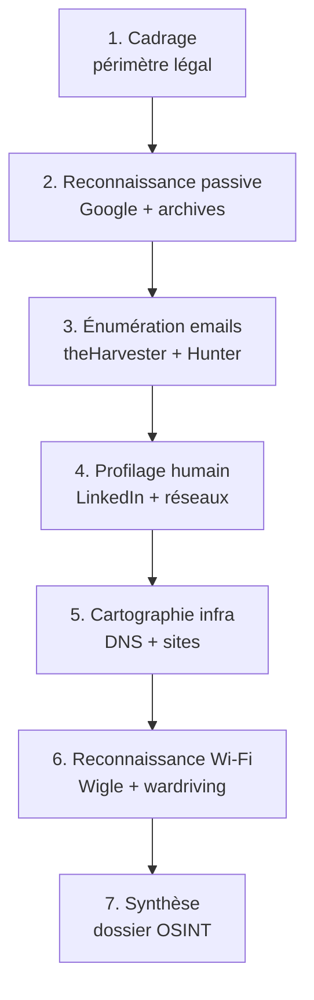

# IV - OSINT et reconnaissance

!!! quote "L'analogie du cambrioleur méthodique"

    Un cambrioleur amateur sonne au hasard et tente sa chance. Il se fait prendre dans les premiers jours. Un cambrioleur méthodique, lui, observe la maison pendant des semaines. Il note les horaires, identifie les passages, repère les caméras, cartographie les voisins. Quand il agit enfin, il sait exactement quoi faire et où aller. Cette préparation lui prend bien plus de temps que l'effraction elle-même. L'OSINT pour un attaquant suit la même logique. Plus la reconnaissance est solide, plus l'attaque est rapide et discrète. Pour vous, futur défenseur, comprendre cette préparation vous fait voir votre propre organisation à travers le regard de l'agresseur.

## Présentation du module

Premier module du cycle 1 et **premier de la phase offensive**. Vous incarnez ici l'attaquant qui prépare son opération sur ARTECH. La méthodologie acquise servira ensuite, en miroir, à votre rôle d'analyste forensic dans les modules suivants.

### Pourquoi commencer par OSINT

Trois raisons justifient cette ouverture du cycle 1 par la reconnaissance plutôt que par l'attaque directe.

| Raison | Explication |
|---|---|
| Réalisme | 100 % des attaques réelles débutent par une reconnaissance OSINT |
| Discrétion | Phase passive, sans interaction avec la cible, donc indétectable |
| Préparation | Conditionne l'efficacité de toutes les phases suivantes |

### Différence avec le module 11

Le cycle 2 contient un module **OSINT approfondi** (11). Voici les distinctions à comprendre dès maintenant pour éviter toute confusion entre les deux niveaux.

| Aspect | Module 4 (cycle 1) | Module 11 (cycle 2) |
|---|---|---|
| Niveau | Initiation pratique | Maîtrise professionnelle |
| Outils | Sherlock, theHarvester, Wigle | + Shodan, Censys, OSINT Industries |
| Profilage humain | Basique LinkedIn | Avancé (sock puppet, croisement) |
| Fuites de données | Notion HIBP | Complet IntelX, DeHashed, h8mail |
| Cryptomonnaies | Non couvert | Couvert (blockchain analysis) |
| Géolocalisation | Notions de base | EXIF, géolocalisation comportementale |

### Objectifs pédagogiques

À l'issue de ce module, vous serez capable de :

- Mener une reconnaissance OSINT structurée sur une PME
- Identifier les employés cibles privilégiés d'un phishing
- Cartographier l'infrastructure publique d'une organisation
- Cartographier les réseaux Wi-Fi visibles publiquement
- Utiliser theHarvester, Hunter.io, Maltego CE
- Produire un rapport OSINT exploitable pour la suite de l'attaque
- Respecter strictement le cadre légal français

### Prérequis stricts

Avant d'entamer ce module, certains acquis sont indispensables.

| Critère | Niveau attendu |
|---|---|
| Cycle 0 complet | Validé |
| Module 1 (juridique) | Maîtrisé, particulièrement 226-18 et RGPD |
| Module 3 (laboratoire) | Lab opérationnel à 100 % |
| Kali Linux | Fonctionnel avec outils OSINT |

### Structure du module

Voici le plan détaillé des 10 chapitres composant ce module, soit 25 heures de travail.

| # | Chapitre | Durée | Niveau |
|---|---|---|---|
| 4.1 | Méthodologie OSINT - framework et matrice | 2 h | Standard |
| 4.2 | Reconnaissance passive - Google dorks et archives | 3 h | Standard |
| 4.3 | theHarvester et énumération emails | 2 h | Pratique |
| 4.4 | Recherche par BSSID Wigle.net et SSID | 2 h | Pratique |
| 4.5 | Profilage humain LinkedIn et réseaux sociaux | 3 h | Standard |
| 4.6 | Hunter.io et formats d'emails entreprise | 1 h | Pratique |
| 4.7 | Maltego CE pour cartographie | 3 h | Pratique |
| 4.8 | Wardriving passif sur le terrain | 4 h | Pratique avancé |
| 4.9 | Production du rapport OSINT structuré | 3 h | Synthèse |
| 4.10 | Cas pratique ARTECH profilage complet | 2 h | Synthèse pratique |

**Total : 25 heures** sur 3 semaines à 8-9 h/semaine.

## Cadre légal applicable

Le module se déroule dans le cadre du laboratoire ARTECH. L'OSINT y est légal puisque conduit sur votre propre environnement. En revanche, certaines techniques pourraient devenir illégales appliquées à des cibles externes non autorisées.

Voici les articles à garder à l'esprit pour ne jamais déraper en dehors du laboratoire.

| Article | Infraction si mauvais usage |
|---|---|
| 226-18 | Collecte déloyale de données personnelles - 5 ans / 300 000 € |
| 323-1 | Tentative d'accès si OSINT actif intrusif - 3 ans / 100 000 € |
| 226-15 | Si interception de communications - 1 an / 45 000 € |
| RGPD 6.1.f | Sans intérêt légitime documenté - sanctions CNIL |

## Méthodologie générale du module

L'attaque OSINT structure votre travail en 7 étapes successives, chacune capitalisant sur la précédente.



## Ce que vous produirez

À l'issue du module, vous aurez constitué un livrable concret réutilisable.

| Livrable | Format | Usage |
|---|---|---|
| Dossier OSINT ARTECH | PDF + annexes | Base pour modules 5 et 6 |
| Cartographie Maltego | Graphe XML | Visualisation relations |
| Liste emails employés | CSV | Cibles phishing module 6 |
| Profils des 3 cibles privilégiées | Fiches Markdown | Préparation phishing |
| Cartographie Wi-Fi | Capture + screenshots | Préparation module 5 |

## Démarrage

Pour commencer, rendez-vous dans le répertoire du module et ouvrez le premier chapitre.

```bash
cd ~/Documents/omnyacademy/02-cycle-1-premier-cas/module-4-osint-reconnaissance/
cat 4-1-methodologie-osint.md
```

---

**Module précédent** : [Cycle 0 - Module 3 Configuration laboratoire](../../01-cycle-0-fondations/module-3-configuration-laboratoire/README.md)

**Module suivant** : [Module 5 - Attaque WiFi WPA2 simple](../module-5-attaque-wifi-wpa2/README.md)