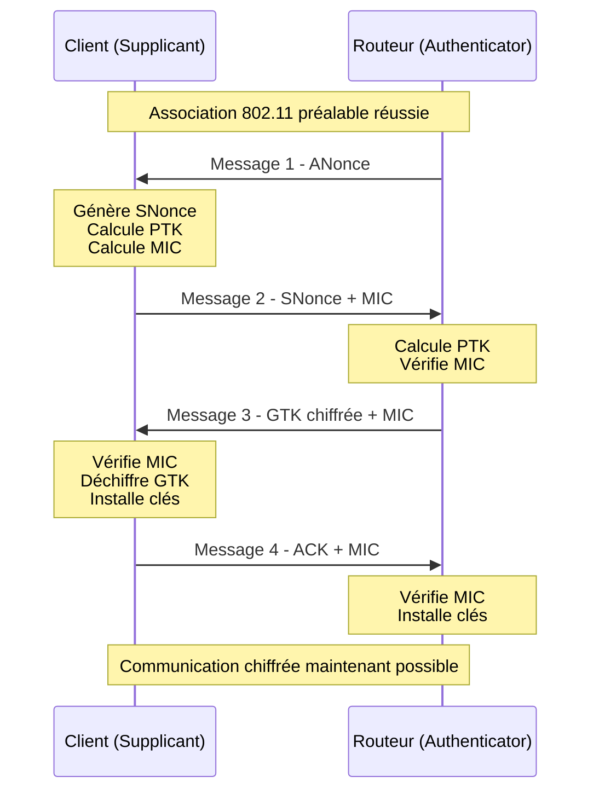
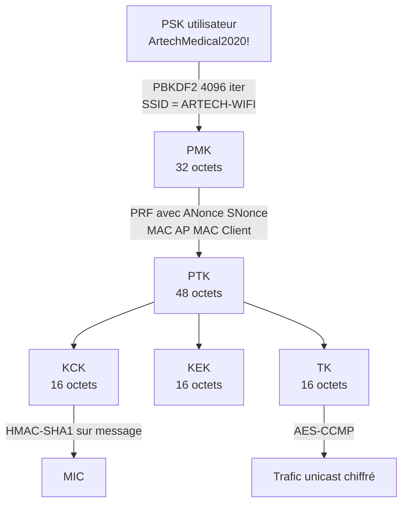

# 5.1 Théorie WPA2 - 4-way handshake et PMK/PTK

!!! quote "L'analogie du protocole d'accueil dans une ambassade"

    Dans une ambassade, deux personnes qui ne se sont jamais rencontrées doivent établir une communication confidentielle. Elles ont chacune une preuve d'identité, un secret partagé d'avance (le code de l'ambassade). Le protocole d'accueil prévoit qu'elles s'échangent quatre messages standardisés. À l'issue, elles disposent toutes deux d'une clé de session dérivée du secret partagé et de quatre nombres aléatoires uniques à cet échange. Si un espion enregistre les quatre messages, il a tout ce qu'il faut pour deviner le secret partagé hors-ligne, à condition d'être patient et bien équipé. Le 4-way handshake WPA2 est ce protocole. Le secret partagé est le mot de passe Wi-Fi. Et l'espion patient bien équipé est aujourd'hui un GPU à 1500 euros.

## Métadonnées du chapitre

Ce chapitre est entièrement théorique. Il conditionne la compréhension de tous les chapitres suivants. Voici ses caractéristiques.

| Champ | Valeur |
|---|---|
| Durée estimée | 3 heures |
| Niveau | Théorique |
| Prérequis | Module 2 cycle 0 (cryptographie de base) |
| Livrables | Schéma du 4-way handshake mémorisé |
| Auto-explication | 12 minutes |

## Objectifs pédagogiques

À l'issue de ce chapitre, vous serez capable de :

- Expliquer la dérivation PSK → PMK → PTK étape par étape
- Détailler les 4 messages du handshake et leur contenu
- Justifier pourquoi la capture passive permet le cracking offline
- Distinguer PMK, PTK, GTK et leur rôle respectif
- Comprendre la fonction PBKDF2 et son coût computationnel
- Articuler avec les attaques pratiques des chapitres suivants

---

## 1. Vocabulaire cryptographique WPA2

Avant tout détail technique, voici les termes à maîtriser parfaitement.

### 1.1 Termes essentiels

Voici la table des sigles à mémoriser.

| Sigle | Signification | Rôle |
|---|---|---|
| PSK | Pre-Shared Key | Mot de passe Wi-Fi tel que saisi |
| PMK | Pairwise Master Key | Clé maîtresse dérivée du PSK |
| PTK | Pairwise Transient Key | Clé de session par client |
| GTK | Group Temporal Key | Clé de groupe (broadcast/multicast) |
| KCK | Key Confirmation Key | Sous-clé pour MIC |
| KEK | Key Encryption Key | Sous-clé pour chiffrer GTK |
| TK | Temporal Key | Sous-clé pour chiffrer données |
| MIC | Message Integrity Code | Empreinte HMAC pour intégrité |
| ANonce | Authenticator Nonce | Aléa généré par le routeur |
| SNonce | Supplicant Nonce | Aléa généré par le client |
| EAPOL | Extensible Auth Protocol over LAN | Protocole d'échange clés |

### 1.2 Authenticator vs Supplicant

Dans la terminologie WPA2, deux rôles s'opposent. Voici leur distinction.

| Rôle | Acteur | Fonction |
|---|---|---|
| Authenticator | Routeur Wi-Fi (AP) | Vérifie l'authentification |
| Supplicant | Client Wi-Fi (laptop, phone) | Demande l'authentification |

Cette distinction est essentielle car les messages du handshake alternent entre les deux.

## 2. Genèse cryptographique - du PSK au PMK

### 2.1 Le PSK humain

Le PSK est le mot de passe que l'utilisateur saisit dans la configuration de son routeur. Pour ARTECH, c'est `ArtechMedical2020!`.

Ce PSK est **humain**, donc faible. Voici pourquoi.

| Caractéristique humaine | Conséquence cryptographique |
|---|---|
| 8-20 caractères typiques | Espace de recherche limité |
| Mots de dictionnaire | Vulnérable au dictionnary attack |
| Caractères ASCII | 26 lettres + 10 chiffres + ~10 spéciaux |
| Patterns prévisibles | Année + nom de la société, etc. |

### 2.2 Dérivation PMK via PBKDF2

Le PSK n'est **jamais** utilisé directement comme clé de chiffrement. Il est d'abord dérivé en **PMK** par la fonction PBKDF2.

Voici la formule mathématique exacte.

```text
PMK = PBKDF2(PSK, SSID, 4096, 256)

Où :
  PBKDF2 = Password-Based Key Derivation Function 2
  PSK    = mot de passe (entre 8 et 63 caractères)
  SSID   = nom du réseau (sert de salt)
  4096   = nombre d'itérations HMAC-SHA1
  256    = taille de la PMK en bits (32 octets)
```

### 2.3 Pourquoi 4096 itérations

Les 4096 itérations sont conçues pour ralentir l'attaque par dictionnaire. Voici l'effet pratique.

| Paramètre | Effet |
|---|---|
| 1 itération | 1 PSK testé = 1 hash SHA-1 |
| 4096 itérations | 1 PSK testé = 4096 hashes SHA-1 + dérivations |
| Vitesse CPU | ~1 000 hashes/sec (Intel i7 typique) |
| Vitesse GPU | ~600 000 hashes/sec (RTX 4090) |
| Vitesse cluster | 10 millions+/sec |

### 2.4 Salt = SSID

Le **SSID** sert de salt à PBKDF2. C'est crucial à comprendre.

```text
CONSÉQUENCE DU SSID COMME SALT
================================

Deux réseaux DIFFÉRENTS avec le MÊME PSK
auront des PMK DIFFÉRENTES.

Exemple :
  PSK = "Password123!"
  SSID = "Livebox" → PMK = X
  SSID = "Freebox" → PMK = Y (différent)

Conséquence positive (défense) :
  Pas de table arc-en-ciel universelle possible.

Conséquence négative (attaque) :
  Pour SSID populaires (Livebox-XXXX, FreeWifi),
  des tables pré-calculées EXISTENT.
  Voir attaque par tables PMK plus tard.
```

## 3. Le 4-way handshake en détail

### 3.1 Vue d'ensemble

Le 4-way handshake est l'échange qui se produit chaque fois qu'un client se connecte à un réseau WPA2. Voici son séquencement.



### 3.2 Message 1 - AP → Client

Voici le contenu détaillé du premier message.

```text
MESSAGE 1 - Authenticator vers Supplicant
============================================

Contenu :
  - ANonce (32 octets aléatoires généré par AP)
  - Adresse MAC AP (BSSID)
  - Replay counter (initialisé)

Pas de chiffrement à ce stade.
Pas de MIC à ce stade.

Côté CLIENT à réception :
  - Stocke ANonce
  - Génère SNonce (32 octets aléatoires)
  - Calcule PTK = PRF(PMK, "Pairwise key expansion",
                      Min(MAC_AP, MAC_Client) ||
                      Max(MAC_AP, MAC_Client) ||
                      Min(ANonce, SNonce) ||
                      Max(ANonce, SNonce))
  - Extrait KCK, KEK, TK depuis PTK
```

### 3.3 Calcul de la PTK

Le calcul de la PTK est l'étape la plus importante. Voici sa formule précise.

```text
PTK = PRF-X(PMK, "Pairwise key expansion", B)

Où B = combinaison ordonnée de :
  - MAC_AP
  - MAC_Client
  - ANonce
  - SNonce

X = 384 bits (CCMP) ou 512 bits (autres)

PTK est ensuite scindée en :
  KCK = bits 0-127 (16 octets)
  KEK = bits 128-255 (16 octets)
  TK  = bits 256-383 (16 octets pour CCMP)
```

### 3.4 Message 2 - Client → AP

Voici le contenu détaillé du deuxième message.

```text
MESSAGE 2 - Supplicant vers Authenticator
============================================

Contenu :
  - SNonce (32 octets aléatoires du client)
  - MAC adresse client
  - Replay counter
  - MIC = HMAC-SHA1(KCK, message)

Le MIC prouve que le client connaît KCK,
donc PTK, donc PMK, donc PSK.

Côté AP à réception :
  - Stocke SNonce
  - Calcule PTK (même formule, mêmes inputs)
  - Vérifie MIC avec son KCK calculé
  - Si MIC valide : PSK correct
  - Si MIC invalide : PSK incorrect → abandon
```

### 3.5 Message 3 - AP → Client

Voici le contenu détaillé du troisième message.

```text
MESSAGE 3 - Authenticator vers Supplicant
============================================

Contenu :
  - GTK chiffrée avec KEK
  - Replay counter
  - MIC = HMAC-SHA1(KCK, message)

Le GTK est la clé de groupe utilisée pour
les paquets broadcast/multicast.
Tous les clients du réseau ont la même GTK.

Côté CLIENT à réception :
  - Vérifie MIC
  - Déchiffre GTK avec KEK
  - Stocke TK (Temporal Key)
  - Stocke GTK
  - Prêt à envoyer message 4
```

### 3.6 Message 4 - Client → AP

Voici le contenu détaillé du quatrième message.

```text
MESSAGE 4 - Supplicant vers Authenticator
============================================

Contenu :
  - ACK simple
  - Replay counter
  - MIC = HMAC-SHA1(KCK, message)

Confirmation que le client a bien reçu
les clés et qu'il est prêt à communiquer.

Côté AP à réception :
  - Vérifie MIC
  - Active TK pour communication unicast
  - Active GTK pour broadcast/multicast
  - Connection établie
```

## 4. Pourquoi la capture passive permet le cracking offline

C'est le cœur de la vulnérabilité. Comprenons-le précisément.

### 4.1 Données nécessaires pour cracker

L'attaquant qui veut cracker le PSK a besoin de **5 éléments** présents dans le handshake.

| Élément | Présence dans handshake |
|---|---|
| SSID | Connu (beacon non chiffré) |
| MAC AP | Présent dans tous les messages |
| MAC Client | Présent dans tous les messages |
| ANonce | Message 1 (en clair) |
| SNonce | Message 2 (en clair) |
| MIC du message 2 | Message 2 (en clair) |

**Tous ces éléments sont en clair**. L'attaquant peut les enregistrer passivement, sans interaction.

### 4.2 Algorithme de cracking offline

Une fois le handshake capturé, voici l'algorithme exécuté hors-ligne pour chaque candidat PSK.

```text
ALGORITHME DE CRACKING OFFLINE
================================

Pour chaque PSK candidat dans le dictionnaire :

  1. Calculer PMK_candidate = PBKDF2(PSK_candidate, SSID, 4096, 256)

  2. Calculer PTK_candidate = PRF(PMK_candidate, ...)

  3. Extraire KCK_candidate de PTK_candidate

  4. Calculer MIC_candidate = HMAC-SHA1(KCK_candidate, message_2)

  5. Comparer MIC_candidate avec MIC_observed du message 2

  6. Si égaux : PSK trouvé !
     Si différents : passer au PSK suivant

Ce calcul se fait COMPLÈTEMENT HORS-LIGNE.
Ni le routeur ni le réseau ne sont sollicités.
Aucune trace forensic côté AP.
```

### 4.3 Coût computationnel

Le coût par PSK testé est **fixe**. Voici les ordres de grandeur.

| Étape | Coût en SHA-1 |
|---|---|
| PBKDF2 (4096 itérations) | 8192 (2 × 4096 pour HMAC) |
| Dérivation PTK | 4-5 |
| HMAC pour MIC | 2 |
| **Total par PSK** | **~8200 SHA-1** |

### 4.4 Vitesse de cracking 2026

Voici les vitesses typiques en 2026.

| Configuration | PSK/seconde |
|---|---|
| CPU Intel i9 (16 threads) | 8 000 |
| GPU NVIDIA RTX 3060 | 500 000 |
| GPU NVIDIA RTX 4090 | 1 800 000 |
| 8x RTX 4090 cluster | 14 400 000 |
| AWS p4d.24xlarge (8x A100) | 1 800 000 |

### 4.5 Estimation pour ARTECH

Avec un dictionnaire de 100 millions de mots de passe (typique pour le français), voici les durées d'attaque pour ARTECH.

| Configuration | Durée |
|---|---|
| CPU i9 | 3 heures |
| RTX 3060 | 3 minutes |
| RTX 4090 | 56 secondes |
| Cluster 8x | 7 secondes |

## 5. La GTK et la communication broadcast

La **GTK** est différente de la PTK. Voici sa fonction.

### 5.1 Rôle de la GTK

Voici la différence d'usage entre PTK et GTK.

| Clé | Usage | Portée |
|---|---|---|
| PTK | Communication unicast AP ↔ client | Spécifique à chaque paire |
| GTK | Communication broadcast/multicast | Partagée entre tous les clients du réseau |

### 5.2 Limitation de la GTK

La GTK partagée a une conséquence importante. Tous les clients du réseau peuvent **déchiffrer le trafic broadcast** des autres clients.

```text
CONSÉQUENCE PRATIQUE
=====================

Si vous êtes connecté au réseau ARTECH-WIFI,
vous pouvez voir TOUT le trafic broadcast :
  - ARP requests (MAC addresses, IPs)
  - DHCP traffic
  - mDNS / NBNS / LLMNR
  - Discovery protocols

C'est une mine d'information forensic.

Mais vous ne voyez PAS le trafic unicast des
autres clients (chiffré avec leur PTK propre).
```

## 6. Différences avec WPA3-SAE

WPA3 introduit le **SAE Dragonfly** qui résout les principales failles. Voici les différences clés.

### 6.1 SAE Dragonfly

Voici comment SAE diffère de PSK.

| Aspect | WPA2-PSK | WPA3-SAE |
|---|---|---|
| Échange clé | 4-way handshake | SAE puis 4-way |
| Capture pour cracking | Possible | Impossible (sauf failles spécifiques) |
| Forward secrecy | Non | Oui |
| Protection dictionnaire | Faible | Forte (résistant offline) |
| Échange ECP | Non | ECDH avec courbe |

### 6.2 Vulnérabilités WPA3 connues

WPA3 n'est pas parfait. Voici les vulnérabilités publiées.

| Vulnérabilité | Année | Impact |
|---|---|---|
| Dragonblood | 2019 | Side-channel sur courbe ECC |
| KRACK adapté | 2017 | Sur transition WPA2/WPA3 |
| FragAttacks | 2021 | Sur fragmentation |

Néanmoins, en pratique, **WPA3 reste très significativement plus sûr** que WPA2-PSK.

## 7. Cas particulier - PMKID attack (2018)

En 2018, une vulnérabilité a été publiée permettant le cracking **sans capturer le 4-way handshake complet**.

### 7.1 Principe PMKID

Voici comment l'attaque PMKID fonctionne.

```text
ATTAQUE PMKID
===============

Le PMKID est un identifiant de PMK qui apparaît
dans le premier message du handshake si l'AP
le supporte (la plupart le font).

Calcul :
  PMKID = HMAC-SHA1(PMK, "PMK Name" || MAC_AP || MAC_Client)

Si l'attaquant capture le PMKID :
  - Il peut tester chaque PSK candidat
  - Calculer PMK_candidate = PBKDF2(PSK_candidate, ...)
  - Calculer PMKID_candidate
  - Comparer avec PMKID observé

AVANTAGE :
  Pas besoin d'attendre qu'un client se reconnecte.
  Capture instantanée depuis n'importe quel
  paquet d'association.

INCONVÉNIENT :
  Pas tous les AP envoient le PMKID.
  Mises à jour firmware progressives.
```

### 7.2 Vulnérabilité résiduelle

En 2026, le PMKID reste exploitable sur de nombreux routeurs grand public, particulièrement les anciens modèles.

| Routeur | PMKID exposé |
|---|---|
| Livebox 4 | Souvent |
| TP-Link Archer C7 v2 | Oui (firmware ancien) |
| Cisco WAP551 | Non |
| UniFi récent | Non |
| Routeurs récents WPA3 | Non |

## 8. Schéma synthétique pour mémorisation

Pour mémoriser tout le processus, voici le schéma synthétique.



## 9. Implications défensives

Comprendre ces fondations permet de formuler des recommandations défensives précises.

### 9.1 Recommandations PSK

Voici les recommandations pour rendre un PSK résistant au cracking offline.

| Recommandation | Justification |
|---|---|
| Longueur 16+ caractères | Espace de recherche exponentiel |
| Caractères mixtes complets | Évite les dictionnaires usuels |
| Pas de mot du dictionnaire | Élimine les attaques rapides |
| Pas de pattern prévisible | NomSociete + année = catastrophique |
| Rotation périodique (1-2 ans) | Périmer les anciens dumps |

### 9.2 Recommandations infrastructure

Voici les mesures infrastructurelles complémentaires.

| Recommandation | Justification |
|---|---|
| Migration WPA3-SAE | Protection cracking offline |
| WPA2-Enterprise (RADIUS) | Authentification certificat |
| Désactiver PMKID si possible | Élimine l'attaque PMKID |
| Réduire portée Wi-Fi | Limite la zone de capture |
| Détection deauth (DoS Wi-Fi) | Alertes sur attaques actives |

## 10. Auto-évaluation

Vérifiez votre maîtrise par les questions suivantes.

| # | Question | Réponse |
|---|---|---|
| 1 | Combien d'itérations PBKDF2 ? | 4096 |
| 2 | Que sert de salt à PBKDF2 ? | SSID |
| 3 | Combien de messages dans le handshake ? | 4 |
| 4 | Qui génère ANonce ? | Authenticator (AP) |
| 5 | Qui génère SNonce ? | Supplicant (client) |
| 6 | Quelle clé chiffre les données unicast ? | TK (extraite de PTK) |
| 7 | Quelle clé chiffre les données broadcast ? | GTK |
| 8 | Vitesse cracking RTX 4090 typique ? | ~1.8 million PSK/sec |

## 11. Synthèse

Voici les points clés à mémoriser.

```text
THÉORIE WPA2 - ESSENTIELS

DÉRIVATION DES CLÉS
  PSK → PMK : PBKDF2(PSK, SSID, 4096 iter, 256 bits)
  PMK → PTK : PRF(PMK, ANonce, SNonce, MAC_AP, MAC_C)
  PTK → KCK | KEK | TK

4-WAY HANDSHAKE
  Msg 1 : AP envoie ANonce
  Msg 2 : Client envoie SNonce + MIC
  Msg 3 : AP envoie GTK chiffrée + MIC
  Msg 4 : Client envoie ACK + MIC

VULNÉRABILITÉ FONDAMENTALE
  Capture passive du handshake
  Cracking offline par dictionnaire
  Aucune trace côté AP

VITESSES CRACKING 2026
  CPU i9 : 8 000 PSK/sec
  RTX 4090 : 1 800 000 PSK/sec
  Cluster 8x : 14 400 000 PSK/sec

PMKID (2018)
  Vulnérabilité alternative
  Encore active sur routeurs anciens

WPA3-SAE
  Résout cracking offline
  Forward secrecy
  Recommandé pour 2026+

DÉFENSES
  PSK 16+ caractères aléatoires
  Migration WPA3
  WPA2-Enterprise si possible
  Désactiver PMKID
```

---

**Chapitre suivant** : [5.2 Mode moniteur et passage en injection](5-2-mode-monitor-injection.md)
