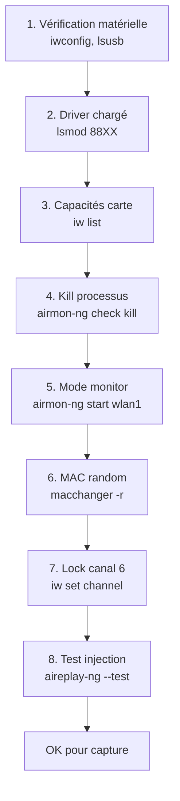

# 5.2 Mode moniteur et passage en injection

!!! quote "L'analogie du microphone d'ambiance"

    Dans une grande salle de conférence, votre oreille n'entend que les conversations qui vous sont adressées. Le bruit ambiant est filtré inconsciemment. Mais si vous installez un microphone d'ambiance, il capte **tout** ce qui passe : les chuchotements de la table 3, l'annonce du présentateur, les conversations téléphoniques en arrière-plan. Le mode moniteur d'une carte Wi-Fi joue le même rôle. Sans lui, votre carte n'écoute que ce qui vous est destiné. Avec lui, elle capture toutes les trames de l'air ambiant, y compris celles d'ARTECH. Et le mode injection vous permet en plus d'émettre des trames spécifiques, comme une déauthentification. Sans ces deux modes, l'attaque WPA2 est techniquement impossible.

## Métadonnées du chapitre

Ce chapitre est essentiellement pratique. Voici ses caractéristiques.

| Champ | Valeur |
|---|---|
| Durée estimée | 2 heures |
| Niveau | Pratique |
| Prérequis | 5.1, Alfa AWUS036ACS configurée (cycle 0 module 3.13) |
| Livrables | Carte en mode monitor + injection validée |
| Auto-explication | 6 minutes |

## Objectifs pédagogiques

À l'issue de ce chapitre, vous serez capable de :

- Activer le mode monitor sur votre carte Wi-Fi
- Vérifier la disponibilité du mode injection
- Tester l'injection avec aireplay-ng
- Diagnostiquer les problèmes courants
- Comprendre les implications kernel et drivers

---

## 1. Modes de fonctionnement d'une carte Wi-Fi

Une carte Wi-Fi peut fonctionner dans plusieurs modes. Voici les principaux à connaître.

### 1.1 Modes principaux

Voici les modes Wi-Fi standardisés.

| Mode | Fonction | Utilisable pour pentest ? |
|---|---|---|
| Managed | Client classique (par défaut) | Non |
| Master | Point d'accès | Non |
| Ad-hoc | Réseau pair à pair | Non |
| Monitor | Capture passive de toutes trames | OUI |
| Mesh | Maillage (rare) | Non |
| Repeater | Répéteur | Non |

### 1.2 Mode monitor expliqué

Le mode monitor a des caractéristiques précises. Voici le détail.

| Caractéristique | Précision |
|---|---|
| Capture toutes trames | Y compris non destinées à votre carte |
| Niveau MAC | Trames management, control, data |
| Sans association | Pas besoin d'être connecté |
| Header radiotap | Métadonnées RSSI, canal, etc. |
| Mode passif | Aucune émission par défaut |

### 1.3 Mode injection

L'injection est une **capacité supplémentaire** au mode monitor. Elle permet d'émettre des trames arbitraires.

| Capacité | Usage |
|---|---|
| Forger paquets | Tout type de trame 802.11 |
| Spoofer MAC source | Usurper identité |
| Envoyer deauth | Forcer reconnexion clients |
| Probe response forgé | Rogue AP |

## 2. Vérification matérielle

### 2.1 Identification de votre carte

Avant toute manipulation, identifions votre carte précisément.

```bash
# Liste des interfaces Wi-Fi
iwconfig

# Sortie typique
# wlan0     IEEE 802.11  ESSID:"WiFi-Maison"
#           Mode:Managed  ...
# wlan1     IEEE 802.11  ESSID:off/any
#           Mode:Managed  ...

# Identification fine de l'Alfa
lsusb | grep -i realtek
# Bus 003 Device 005: ID 0bda:8812 Realtek Semiconductor Corp. RTL8812AU 802.11a/b/g/n/ac

# Détails du chipset
sudo airmon-ng

# Sortie type
# PHY     Interface       Driver          Chipset
# phy0    wlan0           iwlwifi         Intel(R) Wireless-AC 9560
# phy1    wlan1           rtl88xxau       Realtek Semiconductor Corp. RTL8812AU
```

### 2.2 Vérification du driver

Pour l'Alfa AWUS036ACS (chipset RTL8812AU), voici le driver à utiliser.

```bash
# Vérifier que le driver est chargé
lsmod | grep 88xx

# Sortie attendue
# 88XXau                717820  0
# cfg80211              946176  3 88XXau,...

# Si rien ne sort, charger le driver
sudo modprobe 88XXau

# Si le module n'existe pas (driver pas installé) :
# Installation via aircrack-ng/rtl8812au
sudo apt install realtek-rtl88xxau-dkms

# Ou compilation manuelle
git clone https://github.com/aircrack-ng/rtl8812au.git
cd rtl8812au
sudo make dkms_install
```

### 2.3 Vérification capacités

Voici la commande pour confirmer les capacités matérielles.

```bash
# Capacités de la carte
iw list | head -50

# Sections importantes :
# - Supported interface modes :
#   * IBSS
#   * managed
#   * AP
#   * monitor       ← OBLIGATOIRE
# - Available Antennas: TX 0x3 RX 0x3
# - Supported Ciphers : ...
# - Supported tx frame types : 0x0000-0xff00
# - Supported rx frame types : 0x0000-0xff00
```

Si `monitor` n'apparaît pas dans les modes supportés, votre carte n'est **pas exploitable**. Vous devez en acquérir une compatible.

## 3. Activation du mode monitor avec airmon-ng

`airmon-ng` est l'outil de référence pour gérer le mode monitor. Il fait partie de la suite aircrack-ng.

### 3.1 Procédure standard

Voici la séquence type pour passer une carte en mode monitor.

```bash
# 1. Identifier les processus interférents
sudo airmon-ng check

# Sortie typique
# Found 5 processes that could cause trouble.
# Kill them using 'airmon-ng check kill' before putting
# the card in monitor mode, they will interfere by
# changing channels and sometimes putting the interface
# back in managed mode
#
#   PID Name
#   650 NetworkManager
#   894 wpa_supplicant
#   1023 dhclient
#   ...

# 2. Tuer les processus interférents
sudo airmon-ng check kill

# 3. Mettre wlan1 en mode monitor
sudo airmon-ng start wlan1

# Sortie typique
# PHY     Interface       Driver          Chipset
# phy1    wlan1           rtl88xxau       Realtek RTL8812AU
#                 (mac80211 monitor mode vif enabled for [phy1]wlan1
#                 on [phy1]wlan1mon)
#                 (mac80211 station mode vif disabled for [phy1]wlan1)

# 4. Vérification
iwconfig wlan1mon

# Sortie attendue
# wlan1mon  IEEE 802.11  Mode:Monitor  Frequency:2.412 GHz
#           Tx-Power=23 dBm
#           ...
```

Notez la transformation : `wlan1` est devenue `wlan1mon`. C'est cette nouvelle interface que vous utiliserez pour la capture.

### 3.2 Méthode manuelle (sans airmon-ng)

En cas de problème avec airmon-ng, voici la méthode manuelle.

```bash
# 1. Désactiver l'interface
sudo ip link set wlan1 down

# 2. Changer le mode
sudo iw dev wlan1 set type monitor

# 3. Réactiver l'interface
sudo ip link set wlan1 up

# 4. Vérification
iw dev wlan1 info | grep type
# Doit afficher : type monitor
```

### 3.3 Fixer le canal

Par défaut, votre carte est sur le canal 1. Pour la fixer sur un autre canal (par exemple le 6 d'ARTECH).

```bash
# Avec airmon-ng
sudo airmon-ng start wlan1 6

# Avec iw
sudo iw dev wlan1 set channel 6

# Vérification
iwconfig wlan1mon | grep Frequency
# Doit afficher Frequency:2.437 GHz pour canal 6
```

### 3.4 Augmenter la puissance d'émission

Pour les cartes Alfa, vous pouvez forcer une puissance d'émission supérieure (30 dBm = 1 W).

```bash
# Vérifier la région réglementaire
sudo iw reg get

# Si la puissance est limitée par la région, la changer
sudo iw reg set BO  # Bolivie autorise 30 dBm
# Note : à votre risque, ce n'est pas conforme RGA en France

# Augmenter la puissance
sudo iwconfig wlan1mon txpower 30

# Vérification
iwconfig wlan1mon | grep Tx-Power
```

**Avertissement légal** : en France, la puissance maximale autorisée pour le Wi-Fi est de **20 dBm en intérieur** sur la bande 2.4 GHz. La dépasser viole la réglementation ARCEP. Pour le lab, vous restez en intérieur, donc respectez 20 dBm.

## 4. Test d'injection

### 4.1 Test avec aireplay-ng

L'outil `aireplay-ng` permet de tester si votre carte supporte l'injection.

```bash
# Test d'injection sur votre AP cible (ARTECH-WIFI)
sudo aireplay-ng --test wlan1mon

# Sortie typique succès
# 11:24:35  Trying broadcast probe requests...
# 11:24:36  Injection is working!
# 11:24:37  Found 5 APs
# 11:24:37  Trying directed probe requests...
# 11:24:37  64:70:02:XX:XX:XX - channel: 6 - 'ARTECH-WIFI'
# 11:24:38  Ping (min/avg/max): 1.234ms/3.456ms/8.901ms Power: -67.5
# 11:24:38  29/30: 96%

# Sortie typique échec
# 11:24:35  Trying broadcast probe requests...
# 11:24:40  No Answer...
# 11:24:40  Found 0 APs
```

Le succès est indiqué par "Injection is working!" et un pourcentage élevé (>80 %).

### 4.2 Diagnostic d'échec

Si l'injection ne fonctionne pas, voici les causes possibles et solutions.

| Cause | Solution |
|---|---|
| Driver incompatible | Réinstaller rtl8812au depuis aircrack-ng |
| Mode monitor non actif | Vérifier `iw dev wlan1mon info` |
| Canal incorrect | Mettre sur le canal de l'AP cible |
| Puissance trop faible | Augmenter via iwconfig |
| Interférence WPA supplicant | airmon-ng check kill |
| Conflit autre processus | Killer manuellement processus utilisant wlan1 |

## 5. Configuration MAC randomization

Par défaut, votre carte expose sa **MAC address réelle**. Pour la discrétion, randomisez-la.

### 5.1 Avec macchanger

L'outil `macchanger` permet de modifier facilement la MAC.

```bash
# Installation si nécessaire
sudo apt install macchanger -y

# Désactiver l'interface
sudo ip link set wlan1mon down

# MAC aléatoire complète
sudo macchanger -r wlan1mon

# MAC aléatoire avec OUI valide
sudo macchanger -A wlan1mon

# MAC spécifique
sudo macchanger -m 00:11:22:33:44:55 wlan1mon

# Réactiver
sudo ip link set wlan1mon up

# Vérification
ip link show wlan1mon | grep ether
```

### 5.2 Persistance MAC

Sans persistance, le redémarrage restaure la MAC originale. Pour la randomiser au boot :

```bash
# Service systemd
sudo tee /etc/systemd/system/macchanger-wlan1.service << 'EOF'
[Unit]
Description=macchanger on wlan1
Wants=network-pre.target
Before=network-pre.target

[Service]
ExecStart=/usr/bin/macchanger -A wlan1
Type=oneshot

[Install]
WantedBy=multi-user.target
EOF

sudo systemctl enable macchanger-wlan1
```

### 5.3 Considérations légales

Le changement de MAC est **légal en France** sur votre propre matériel. Mais il devient illégal s'il sert à usurper une identité spécifique pour commettre une infraction.

## 6. Gestion des canaux

Le Wi-Fi 2.4 GHz utilise 14 canaux (1-13 en Europe, 14 au Japon). Le 5 GHz utilise des dizaines de canaux.

### 6.1 Canaux 2.4 GHz

Voici les canaux 2.4 GHz et leurs fréquences.

| Canal | Fréquence | Note |
|---|---|---|
| 1 | 2412 MHz | Couramment utilisé |
| 6 | 2437 MHz | Couramment utilisé |
| 11 | 2462 MHz | Couramment utilisé |
| 13 | 2472 MHz | Europe seulement |

Les canaux 1, 6 et 11 sont les **non-recouvrants**, donc privilégiés en pratique.

### 6.2 Channel hopping

Pour scanner tous les canaux, votre carte fait du **channel hopping**. C'est automatique avec airodump-ng.

```bash
# Channel hopping automatique avec airodump-ng
sudo airodump-ng wlan1mon

# Channel hopping limité aux canaux 1-13
sudo airodump-ng -c 1-13 wlan1mon

# Lock sur un canal spécifique
sudo airodump-ng -c 6 wlan1mon
```

### 6.3 Lock sur un canal

Pour capturer un AP spécifique (ARTECH sur canal 6), il faut **se locker** sur ce canal.

```bash
# Lock canal 6 pour Alfa AWUS036ACS
sudo iw dev wlan1mon set channel 6

# Vérification
iw dev wlan1mon info | grep channel
```

## 7. Restauration du mode normal

Une fois la session terminée, restaurez le mode managed pour redémarrer NetworkManager.

```bash
# Méthode airmon-ng
sudo airmon-ng stop wlan1mon

# Sortie typique
# PHY     Interface       Driver          Chipset
# phy1    wlan1mon        rtl88xxau       Realtek RTL8812AU
#                 (mac80211 station mode vif enabled on [phy1]wlan1)
#                 (mac80211 monitor mode vif disabled for [phy1]wlan1mon)

# Redémarrer NetworkManager
sudo systemctl start NetworkManager

# Vérifier que la carte est en mode managed
iwconfig wlan1
# Mode:Managed  ...
```

## 8. Cas pratique - Préparation Alfa pour ARTECH

Voici la procédure complète pour préparer votre Alfa avant la capture du chapitre 5.3.

### 8.1 Workflow complet

Voici les étapes à enchaîner avec leur durée typique.



### 8.2 Script de préparation

Pour automatiser, voici un script de préparation complet.

```bash
#!/bin/bash
# prepare-alfa.sh - Préparation Alfa AWUS036ACS pour pentest WiFi
# Usage : sudo ./prepare-alfa.sh [interface] [canal]

set -e

IFACE=${1:-wlan1}
CHANNEL=${2:-6}

echo "[*] Préparation $IFACE pour pentest WiFi sur canal $CHANNEL"

# 1. Vérifications
echo "[*] Vérification matériel"
if ! iwconfig $IFACE 2>&1 | grep -q "IEEE 802.11"; then
    echo "[!] $IFACE n'est pas une interface Wi-Fi valide"
    exit 1
fi

# 2. Driver
echo "[*] Vérification driver"
if ! lsmod | grep -q 88XXau; then
    echo "[*] Chargement driver"
    modprobe 88XXau || true
fi

# 3. Kill processus
echo "[*] Tuerie des processus interférents"
airmon-ng check kill

# 4. Mode monitor
echo "[*] Passage en mode monitor"
airmon-ng start $IFACE >/dev/null 2>&1 || true

# Le nouveau nom est généralement {iface}mon
IFACE_MON="${IFACE}mon"
if ! iwconfig $IFACE_MON 2>&1 | grep -q "Mode:Monitor"; then
    # Méthode manuelle si airmon-ng a échoué
    ip link set $IFACE down
    iw dev $IFACE set type monitor
    ip link set $IFACE up
    IFACE_MON=$IFACE
fi

# 5. MAC randomisation
echo "[*] Randomisation MAC"
ip link set $IFACE_MON down
macchanger -A $IFACE_MON >/dev/null
ip link set $IFACE_MON up

# 6. Canal
echo "[*] Lock sur canal $CHANNEL"
iw dev $IFACE_MON set channel $CHANNEL

# 7. Test injection
echo "[*] Test d'injection"
aireplay-ng --test $IFACE_MON 2>&1 | tail -5

echo ""
echo "[+] Préparation terminée"
echo "[+] Interface monitor : $IFACE_MON"
echo "[+] Canal : $CHANNEL"
echo "[+] MAC randomisée : $(cat /sys/class/net/$IFACE_MON/address)"
```

### 8.3 Utilisation du script

Voici comment utiliser ce script.

```bash
# Sauvegarder dans ~/scripts/
chmod +x ~/scripts/prepare-alfa.sh

# Lancement
sudo ~/scripts/prepare-alfa.sh wlan1 6

# À l'issue, votre carte est prête pour le chapitre 5.3
```

## 9. Diagnostic des problèmes courants

Voici les problèmes les plus fréquents et leurs résolutions.

### 9.1 Carte non reconnue

Voici les causes possibles.

| Symptôme | Cause | Solution |
|---|---|---|
| `iwconfig wlan1` introuvable | Carte non détectée | Vérifier `lsusb`, brancher port USB 3.0 |
| Driver pas chargé | Module manquant | Installer rtl8812au |
| Permissions | Pas root | sudo ou group netdev |

### 9.2 Mode monitor refusé

Voici les diagnostics.

```bash
# Si airmon-ng échoue
sudo iw dev wlan1 set type monitor 2>&1
# Lecture du message d'erreur précis

# Si "Operation not supported" :
# - Le driver ne supporte pas le mode monitor
# - Changer de carte ou recompiler driver

# Si "Device or resource busy" :
# - Processus utilisant la carte
# - airmon-ng check kill en force
```

### 9.3 Injection ne fonctionne pas

Voici les diagnostics.

```bash
# Vérifier que la carte est bien en monitor
iw dev wlan1mon info | grep type

# Vérifier le canal
iwconfig wlan1mon | grep Frequency

# Tester avec un AP très proche pour exclure problème de signal
# (votre propre routeur à côté de vous)

# Si toujours pas d'injection :
# - Réinstaller driver depuis sources
# - Tester avec autre carte (TL-WN722N v1 par ex.)
```

## 10. Auto-évaluation

Vérifiez votre maîtrise par les questions suivantes.

| # | Question | Réponse |
|---|---|---|
| 1 | Outil pour passer en mode monitor ? | airmon-ng start |
| 2 | Outil pour killer processus interférents ? | airmon-ng check kill |
| 3 | Comment vérifier mode monitor avec iw ? | iw dev wlan1mon info |
| 4 | Outil de randomisation MAC ? | macchanger |
| 5 | Comment tester l'injection ? | aireplay-ng --test |
| 6 | Driver pour RTL8812AU ? | rtl8812au / 88XXau |
| 7 | Limite légale puissance France 2.4 GHz ? | 20 dBm intérieur |
| 8 | Comment locker sur canal 6 ? | iw dev wlan1mon set channel 6 |

## 11. Synthèse

Voici les points clés à retenir.

```text
MODE MONITOR ET INJECTION

CARTE COMPATIBLE
  Alfa AWUS036ACS (RTL8812AU)
  Driver rtl8812au depuis aircrack-ng

PROCÉDURE STANDARD
  1. airmon-ng check kill
  2. airmon-ng start wlan1
  3. macchanger -A wlan1mon
  4. iw dev wlan1mon set channel 6
  5. aireplay-ng --test wlan1mon

VÉRIFICATIONS
  iwconfig wlan1mon : Mode:Monitor
  iw dev wlan1mon info : type monitor
  aireplay-ng --test : Injection is working

GESTION CANAUX
  2.4 GHz : 1-13 (Europe)
  Non-recouvrants : 1, 6, 11
  Lock : iw set channel
  Hopping : automatique airodump-ng

SÉCURITÉ
  Limite légale 20 dBm intérieur France
  MAC randomization recommandée
  Restaurer managed après usage

DIAGNOSTIC
  Driver : lsmod | grep 88XX
  Capacités : iw list (monitor mode)
  Processus : airmon-ng check
  Injection : aireplay-ng --test
```

---

**Chapitre précédent** : [5.1 Théorie WPA2 - 4-way handshake et PMK/PTK](5-1-theorie-wpa2-handshake.md)

**Chapitre suivant** : [5.3 airodump-ng capture passive](5-3-airodump-ng-capture.md)
