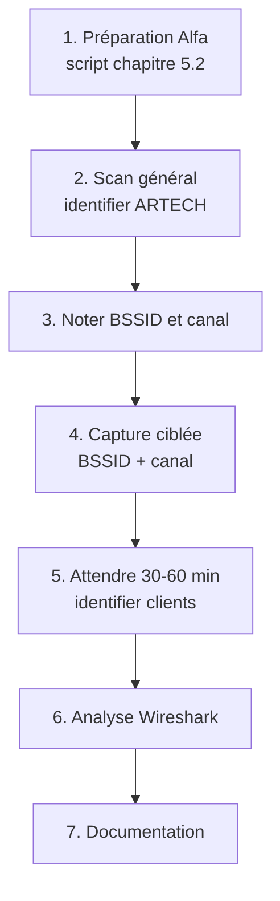

# 5.3 airodump-ng capture passive

!!! quote "L'analogie du caméraman planqué sans micro"

    Un journaliste d'investigation place une caméra cachée dans une salle de réunion. Sa caméra a une bonne image mais pas de son. Il enregistre qui entre, qui sort, qui parle à qui, qui s'éclipse pour téléphoner. Plusieurs jours d'images patiemment analysées révèlent les habitudes, les hiérarchies, les alliances. Pas un mot n'a été enregistré, mais le journaliste sait tout. C'est exactement ce que fait airodump-ng. Sans envoyer un seul paquet, il enregistre tout le trafic Wi-Fi visible : qui sont les routeurs, qui sont les clients, qui parle à qui, à quelle fréquence, avec quelle intensité de signal. Cette observation patiente est le préalable nécessaire à la capture ciblée du handshake au chapitre suivant.

## Métadonnées du chapitre

Ce chapitre vous initie à la capture proprement dite. Voici ses caractéristiques.

| Champ | Valeur |
|---|---|
| Durée estimée | 2 heures |
| Niveau | Pratique |
| Prérequis | 5.2 (carte en mode monitor) |
| Livrables | Capture pcap d'ARTECH-WIFI avec clients identifiés |
| Auto-explication | 6 minutes |

## Objectifs pédagogiques

À l'issue de ce chapitre, vous serez capable de :

- Lancer une capture airodump-ng efficace
- Identifier l'AP cible et ses clients
- Comprendre les colonnes de l'affichage
- Filtrer la capture par BSSID et canal
- Sauvegarder en formats exploitables
- Lire une capture avec Wireshark

---

## 1. Présentation d'airodump-ng

`airodump-ng` est l'outil de capture de la suite aircrack-ng. Il transforme votre carte Wi-Fi en sniffer dédié.

### 1.1 Fonctions principales

Voici les fonctions principales d'airodump-ng.

| Fonction | Description |
|---|---|
| Scan AP | Liste tous les AP visibles |
| Liste clients | Identifie les stations connectées |
| Capture trames | Sauvegarde en PCAP-NG |
| Channel hopping | Scan multi-canaux automatique |
| Filtrage | Par BSSID, ESSID, canal, encryption |
| Export multi-format | PCAP, CSV, KML, NetXML |

### 1.2 Versions et alternatives

Il existe plusieurs implémentations. Voici les principales.

| Outil | Note |
|---|---|
| airodump-ng | Référence historique aircrack-ng |
| airodump-ng-oui-update | Variante avec OUI updated |
| Kismet | Alternative complète (vu chapitre 4.8) |
| wireshark | Capture brute, analyse poussée |
| tcpdump | CLI, capture brute |

Pour ce module, vous utilisez airodump-ng comme outil principal.

## 2. Capture en mode scan général

### 2.1 Commande de base

Voici la commande la plus simple pour démarrer une capture.

```bash
# Lancement scan général
sudo airodump-ng wlan1mon

# Affichage temps réel typique
#  CH  6 ][ Elapsed: 24 s ][ 2026-04-30 14:32
#
#  BSSID              PWR  Beacons    #Data, #/s  CH   MB   ENC  CIPHER  AUTH ESSID
#  64:70:02:XX:XX:XX  -67       42        8    0   6  130   WPA2 CCMP   PSK  ARTECH-WIFI
#  F8:1A:67:YY:YY:YY  -72       38       12    1  11  130   WPA2 CCMP   PSK  Livebox-1234
#  C8:54:4B:ZZ:ZZ:ZZ  -78       15        0    0   1  130   WPA  CCMP   PSK  HotSpot-Cafe
#
#  BSSID              STATION            PWR   Rate    Lost    Frames  Probe
#  64:70:02:XX:XX:XX  AA:BB:CC:DD:EE:FF  -68    1e- 6e     0       42
#  64:70:02:XX:XX:XX  11:22:33:44:55:66  -71    6e- 1     12       89
```

### 2.2 Lecture de l'affichage

Voici la signification de chaque colonne.

| Colonne | Signification |
|---|---|
| BSSID | MAC du point d'accès |
| PWR | Puissance signal (-67 = bon, -90 = très faible) |
| Beacons | Nombre de beacons reçus |
| #Data | Trames de données (chiffrées) |
| #/s | Taux trames data par seconde |
| CH | Canal actuel |
| MB | Débit max théorique |
| ENC | WPA2 / WPA / WEP / OPN |
| CIPHER | CCMP / TKIP / WEP |
| AUTH | PSK / MGT (Enterprise) / OPN |
| ESSID | Nom du réseau |

Pour la section Stations (clients) :

| Colonne | Signification |
|---|---|
| BSSID | MAC du AP auquel le client est associé |
| STATION | MAC du client |
| PWR | Puissance signal du client |
| Rate | Débit en cours |
| Lost | Trames perdues |
| Frames | Total trames de cette station |
| Probe | Liste des SSID que le client cherche |

### 2.3 Channel hopping

Par défaut, airodump-ng change de canal automatiquement (channel hopping). Voici les canaux scannés.

```text
CHANNEL HOPPING PAR DÉFAUT
============================

2.4 GHz : 1-13 (Europe)
5 GHz   : non scanné par défaut

Pour scanner aussi le 5 GHz :
  sudo airodump-ng --band a wlan1mon
  ou
  sudo airodump-ng --band ag wlan1mon (les deux)

Pour fixer une plage :
  sudo airodump-ng --channel 1-11 wlan1mon
```

### 2.4 Identification d'ARTECH

Une fois la capture lancée, identifiez visuellement ARTECH dans la liste.

```text
IDENTIFICATION D'ARTECH-WIFI
==============================

Critères :
  - ESSID : "ARTECH-WIFI"
  - BSSID : commence par 64:70:02 (TP-Link Archer C7)
  - Sécurité : WPA2 CCMP PSK
  - Canal : généralement 6 (à confirmer)
  - PWR : -60 à -75 dBm (proche du lab)
```

Une fois identifié, notez le BSSID et le canal pour le chapitre 5.4.

## 3. Capture ciblée

Une fois l'AP cible identifié, vous filtrez la capture pour ne pas vous disperser.

### 3.1 Filtrage par BSSID

Voici la commande pour cibler ARTECH spécifiquement.

```bash
# Capture ciblée sur ARTECH
sudo airodump-ng \
    --bssid 64:70:02:XX:XX:XX \
    --channel 6 \
    -w artech-capture \
    wlan1mon

# Options :
# --bssid : filtre uniquement ce BSSID
# --channel : lock sur canal 6
# -w : préfixe des fichiers de capture (sortie)
```

### 3.2 Fichiers générés

L'option `-w` génère plusieurs fichiers. Voici leur contenu.

| Fichier | Format | Contenu |
|---|---|---|
| `artech-capture-01.cap` | PCAP-NG | Trames brutes (Wireshark, hcxtools) |
| `artech-capture-01.csv` | CSV | Liste AP et stations |
| `artech-capture-01.kismet.csv` | CSV | Format Kismet legacy |
| `artech-capture-01.kismet.netxml` | XML | Format Kismet XML |
| `artech-capture-01.log.csv` | CSV | Log événements |

### 3.3 Reprise de capture

Si vous arrêtez et reprenez, le numéro `01` s'incrémente automatiquement.

```bash
# Première session : artech-capture-01.cap
# Seconde session : artech-capture-02.cap
# Troisième session : artech-capture-03.cap
```

Pour fusionner plusieurs captures.

```bash
# Fusion avec mergecap (Wireshark)
mergecap -w artech-merged.pcap artech-capture-01.cap artech-capture-02.cap

# Vérification
capinfos artech-merged.pcap
```

## 4. Probe requests - mine d'information

Les **probe requests** sont des trames émises par les clients qui cherchent un AP. Elles révèlent beaucoup.

### 4.1 Qu'est-ce qu'une probe request

Voici ce qu'est une probe request.

```text
PROBE REQUEST
================

Quand un client Wi-Fi cherche un réseau auquel
il s'est déjà connecté, il émet une probe request
"Hey, est-ce que <SSID> est dans le coin ?"

Ces requêtes contiennent :
  - MAC du client (peut être randomisée)
  - SSID recherché
  - Capabilities (compatibilités)
  - Vendor specific elements

EN CLAIR.
TOUJOURS.
MÊME EN WPA2 OU WPA3.
```

### 4.2 Information révélée

Voici l'information opérationnelle qu'un attaquant peut extraire.

| Information | Valeur OSINT |
|---|---|
| Liste de SSID anciens | Endroits fréquentés (cafés, bureaux) |
| MAC client (si pas randomisée) | Identifie l'appareil de manière persistante |
| Pattern temporel | Habitudes (heure d'arrivée, départ) |
| Modèle de device | OUI permet identification |

### 4.3 Capture des probes

airodump-ng affiche les probe requests dans la colonne "Probe".

```text
EXEMPLE D'INFORMATION RÉVÉLÉE
================================

STATION            PWR  Probe
AA:BB:CC:DD:EE:FF  -68  Sophie-Domicile, Cafe-Lyon-Vaise, ARTECH-WIFI

Inférence :
  Cette station appartient probablement
  à un employé d'ARTECH (Sophie ?) qui
  habite à un endroit dont le SSID maison
  est "Sophie-Domicile" et fréquente
  un café à Lyon Vaise.
```

### 4.4 MAC randomization

Depuis 2020, la plupart des OS modernes randomisent la MAC dans les probe requests pour limiter le tracking.

| OS | Randomisation par défaut |
|---|---|
| iOS 14+ | Oui |
| Android 11+ | Oui |
| Windows 10+ | Optionnelle |
| macOS Big Sur+ | Optionnelle |
| Linux récent | Optionnelle (NetworkManager) |

Quand la MAC est randomisée, le tracking persistant devient impossible.

## 5. Beacons - identification de l'AP

Les **beacons** sont les trames émises par l'AP pour annoncer sa présence. Elles contiennent une mine d'informations.

### 5.1 Contenu d'un beacon

Voici ce qu'un beacon expose en clair.

| Information | Détail |
|---|---|
| BSSID | MAC AP |
| ESSID (SSID) | Sauf si "hidden" |
| Capabilities | Fonctionnalités supportées |
| Beacon interval | Intervalle (typique 100 ms) |
| Rates supported | Débits supportés |
| Channel | Canal en cours |
| Country code | Pays réglementaire |
| HT/VHT capabilities | Wi-Fi N, AC, AX |
| RSN information | WPA2/WPA3 paramètres |
| Vendor specific | Spécifiques constructeur |

### 5.2 Hidden SSID

Un AP peut être configuré avec un **hidden SSID** : le beacon ne contient pas le nom du réseau. Mais cela n'empêche pas la découverte.

```text
HIDDEN SSID NE PROTÈGE PAS
============================

Quand un client se connecte à un hidden SSID,
il envoie une PROBE REQUEST contenant le SSID.

L'attaquant capture cette probe et obtient le SSID.

Donc : hidden SSID ne sert à RIEN cybersécurité.
       Sert seulement à dépublier de l'index public.
```

## 6. Analyse offline avec Wireshark

Une fois la capture terminée, vous pouvez l'analyser dans Wireshark.

### 6.1 Ouverture de la capture

Voici comment ouvrir un fichier de capture.

```bash
# Wireshark CLI ou GUI
wireshark artech-capture-01.cap

# Ou tshark CLI
tshark -r artech-capture-01.cap
```

### 6.2 Filtres Wireshark utiles

Voici les filtres d'affichage utiles pour l'analyse Wi-Fi.

| Filtre | Usage |
|---|---|
| `wlan` | Toutes trames 802.11 |
| `wlan.fc.type == 0` | Trames de management |
| `wlan.fc.type == 1` | Trames de control |
| `wlan.fc.type == 2` | Trames de data |
| `wlan.fc.type_subtype == 0x0008` | Beacons |
| `wlan.fc.type_subtype == 0x0004` | Probe requests |
| `wlan.fc.type_subtype == 0x000c` | Deauth |
| `eapol` | Trames du 4-way handshake |

### 6.3 Identification du handshake

Pour le chapitre 5.4 (capture handshake), voici le filtre crucial.

```text
FILTRE WIRESHARK POUR HANDSHAKE
==================================

eapol

Doit afficher 4 trames pour un handshake complet :
  - Message 1 : EAPOL-Key (1) Source AP
  - Message 2 : EAPOL-Key (2) Source Client
  - Message 3 : EAPOL-Key (3) Source AP
  - Message 4 : EAPOL-Key (4) Source Client

Si seulement 2-3 messages : handshake INCOMPLET,
non utilisable pour cracking.
```

## 7. Bandes 5 GHz et Wi-Fi 6

ARTECH peut éventuellement utiliser le 5 GHz. Voici les considérations.

### 7.1 Différences 2.4 GHz et 5 GHz

Voici les différences fondamentales.

| Aspect | 2.4 GHz | 5 GHz |
|---|---|---|
| Portée | Plus longue | Plus courte |
| Pénétration murs | Meilleure | Moindre |
| Débit | Limité | Élevé |
| Interférences | Forte (Bluetooth, micro-ondes) | Faible |
| Canaux | 1-13 | Très nombreux |

### 7.2 Capture 5 GHz

Pour scanner le 5 GHz avec votre Alfa AWUS036ACS (qui supporte les deux bandes).

```bash
# Scan 5 GHz uniquement
sudo airodump-ng --band a wlan1mon

# Scan dual-band
sudo airodump-ng --band ag wlan1mon
```

### 7.3 Wi-Fi 6 et 6E

Les standards récents (Wi-Fi 6 = 802.11ax, Wi-Fi 6E = 6 GHz) introduisent de nouvelles bandes.

| Standard | Année | Bandes |
|---|---|---|
| Wi-Fi 5 (ac) | 2014 | 5 GHz |
| Wi-Fi 6 (ax) | 2019 | 2.4 + 5 GHz |
| Wi-Fi 6E | 2020 | 2.4 + 5 + 6 GHz |
| Wi-Fi 7 (be) | 2024 | 2.4 + 5 + 6 GHz |

Votre Alfa AWUS036ACS ne supporte pas le 6 GHz. Pour Wi-Fi 6E/7, il faut une carte spécifique récente.

## 8. Cas pratique - Capture ARTECH

### 8.1 Mise en situation

Vous menez une capture sur ARTECH-WIFI pour identifier les clients connectés.

### 8.2 Workflow

Voici les étapes à enchaîner.



### 8.3 Commandes complètes

Voici la séquence de commandes type.

```bash
# Préparation Alfa (script du chapitre 5.2)
sudo ~/scripts/prepare-alfa.sh wlan1 6

# Création du dossier de capture
mkdir -p ~/pentest/artech-2026/captures-wifi
cd ~/pentest/artech-2026/captures-wifi/

# Scan général pour identifier ARTECH (5 minutes)
sudo airodump-ng wlan1mon

# Note du BSSID et canal observés
# 64:70:02:XX:XX:XX, canal 6 (par exemple)

# Capture ciblée (1 heure pour avoir clients)
sudo airodump-ng \
    --bssid 64:70:02:XX:XX:XX \
    --channel 6 \
    -w artech-capture-$(date +%Y%m%d) \
    wlan1mon

# Pendant la capture, l'écran affiche les clients
# qui s'associent à l'AP

# Arrêt avec Ctrl+C une fois suffisant

# Vérification
ls -lh artech-capture-*

# Lecture statistiques
capinfos artech-capture-*-01.cap
```

### 8.4 Analyse des résultats

Voici comment exploiter ce que vous avez capturé.

```bash
# Liste unique des clients connectés
tshark -r artech-capture-*-01.cap \
    -Y "wlan.bssid == 64:70:02:XX:XX:XX" \
    -T fields -e wlan.sa \
    | sort -u

# Liste des SSID dans probes
tshark -r artech-capture-*-01.cap \
    -Y "wlan.fc.type_subtype == 0x0004" \
    -T fields -e wlan.ssid \
    | sort -u

# Hash de la capture
sha256sum artech-capture-*-01.cap > MANIFEST.sha256
```

## 9. Considérations légales

### 9.1 Capture passive et droit français

La capture passive de trames Wi-Fi est dans une **zone juridique grise**. Voici la lecture la plus fréquente.

```text
ANALYSE JURIDIQUE
===================

CAPTURE DES BEACONS ET MANAGEMENT
  Position : signaux publics, captation passive
  Avis CNIL : généralement légale
  Article 226-15 : ne s'applique pas (pas privé)

CAPTURE DES PROBES CLIENTS
  Position : zone grise
  Probes incluent SSID = pas privé
  Mais MAC associée = donnée personnelle indirecte
  Avis : RGPD applicable si stockage

CAPTURE DES TRAMES DATA CHIFFRÉES
  Position : très ambiguë
  Article 226-15 peut s'appliquer si décryptage
  Mais simple capture en clair = neutre

CAPTURE 4-WAY HANDSHAKE
  Position : ambiguë
  Tendance : illégal sans mandat (226-15)
  Sauf sur votre propre réseau (lab)
```

### 9.2 Recommandation OmnyAcademy

Pour rester strictement dans la légalité, opérez **uniquement sur votre lab**.

## 10. Auto-évaluation

Vérifiez votre maîtrise par les questions suivantes.

| # | Question | Réponse |
|---|---|---|
| 1 | Outil principal de capture ? | airodump-ng |
| 2 | Option pour filtrer un BSSID ? | --bssid |
| 3 | Option pour fixer le canal ? | --channel ou -c |
| 4 | Option pour préfixe fichier sortie ? | -w |
| 5 | Format principal de capture ? | PCAP-NG |
| 6 | Filtre Wireshark pour handshake ? | eapol |
| 7 | Que révèlent les probe requests ? | SSID anciens et patterns |
| 8 | Combien de messages handshake complet ? | 4 (EAPOL 1 à 4) |

## 11. Synthèse

Voici les points clés à retenir.

```text
AIRODUMP-NG CAPTURE PASSIVE

COMMANDES TYPES
  Scan général :
    airodump-ng wlan1mon
  
  Capture ciblée :
    airodump-ng --bssid X --channel Y -w fichier wlan1mon

OPTIONS UTILES
  --bssid     filtre par BSSID
  --channel   lock canal
  --band      bande (a, g, ag, abg)
  -w          préfixe fichiers sortie
  --essid     filtre par SSID

FICHIERS GÉNÉRÉS
  .cap        PCAP-NG (Wireshark)
  .csv        Liste AP et stations
  .kismet.csv Format Kismet
  .netxml     XML

INFORMATION RÉVÉLÉE
  Beacons : tout sur l'AP
  Probes : SSID anciens des clients
  Stations : MAC clients connectés

ANALYSE WIRESHARK
  Filtre eapol pour handshake
  Filtre wlan.fc.type pour types trames

CADRE LÉGAL
  Lab uniquement
  226-15 si interception illégale
  Capture passive peu détectable
```

---

**Chapitre précédent** : [5.2 Mode moniteur et passage en injection](5-2-mode-monitor-injection.md)

**Chapitre suivant** : [5.4 Déauthentification ciblée et capture handshake](5-4-deauth-handshake.md)
