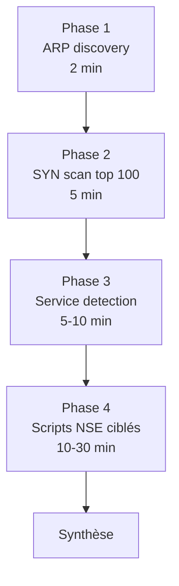

# 5.9 nmap silencieux et énumération

!!! quote "L'analogie du visiteur qui frappe doucement à toutes les portes"

    Imaginez un démarcheur qui veut savoir qui habite dans un immeuble de 30 appartements. Il a deux stratégies. La première : sonner à toutes les portes en succession rapide pendant 5 minutes. Tout le monde l'entend, le concierge note son passage, l'enregistrement vidéo le filme. La seconde : passer plusieurs fois dans la semaine en frappant doucement à une ou deux portes par visite, à des heures variées. Personne ne fait le rapprochement entre les visites espacées. nmap fonctionne pareillement. En mode défaut, il scanne 1000 ports en quelques secondes : un pentest signalé. En mode silencieux, il étale dix scans sur plusieurs heures, randomise les IPs source, fragmente les paquets. La détection par IDS devient probabiliste. Pour ARTECH dont l'IDS est probablement absent ou basique, vous pouvez vous permettre du standard. Mais apprenons les deux.

## Métadonnées du chapitre

Ce chapitre est un classique de la cybersécurité. Voici ses caractéristiques.

| Champ | Valeur |
|---|---|
| Durée estimée | 3 heures |
| Niveau | Pratique |
| Prérequis | 5.8 (connecté au LAN), Linux Network+ basique |
| Livrables | Scan ARTECH avec services et OS identifiés |
| Auto-explication | 12 minutes |

## Objectifs pédagogiques

À l'issue de ce chapitre, vous serez capable de :

- Maîtriser les types de scan nmap principaux
- Choisir le bon timing selon le contexte
- Énumérer les services exposés
- Détecter l'OS distant
- Utiliser les scripts NSE pour énumération approfondie
- Anticiper la détection IDS et l'éviter

---

## 1. Présentation de nmap

**nmap** (Network Mapper) est l'outil de scan réseau de référence depuis 1997. Maintenu par Gordon "Fyodor" Lyon.

### 1.1 Caractéristiques

Voici les caractéristiques principales de nmap.

| Caractéristique | Précision |
|---|---|
| Type | Scanner réseau CLI |
| Licence | GPL |
| Plateformes | Linux, macOS, Windows, BSD |
| Versions | nmap 7.94 stable en 2026 |
| Auteur | Fyodor (Gordon Lyon) |
| Maintenu | Activement |

### 1.2 Usage légitime vs offensif

nmap est un outil **dual-use**. Voici les usages légitimes courants.

| Usage légitime | Contexte |
|---|---|
| Audit infrastructure | Sysadmin propriétaire |
| Inventaire réseau | DSI |
| Vérification firewall | Validation règles |
| Détection rogue devices | Sécurité interne |
| Monitoring continu | NOC/SOC |

Les usages offensifs sont les mêmes mais sans autorisation.

### 1.3 Cadre légal

```text
NMAP ET DROIT FRANÇAIS
========================

Scan d'un réseau qui vous appartient : LÉGAL
Scan avec mandat écrit (pentest) : LÉGAL
Scan sans autorisation : Article 323-1
  "Accès ou maintien frauduleux dans un STAD"
  Peine : 3 ans / 100 000 €

Le simple scan SYN sans connexion réelle a été
considéré comme une "tentative d'accès" dans
plusieurs jurisprudences françaises (2010+).

Pour OmnyAcademy lab : OK car votre infra.
```

## 2. Types de scans

nmap propose de nombreux types de scan. Voici les principaux.

### 2.1 SYN scan (-sS)

Le scan SYN est le **scan furtif standard**.

```text
SYN SCAN (-sS)
================

Mécanique :
  1. Attaquant envoie SYN
  2. Serveur répond SYN/ACK (port ouvert)
                ou RST (port fermé)
                ou rien (port filtré)
  3. Attaquant envoie RST (n'ouvre pas la connexion)

Avantages :
  - Pas de connexion TCP complète
  - Rapide
  - Discret (était discret en 2000)
  
Inconvénients :
  - Détectable par IDS modernes
  - Nécessite root (raw sockets)
```

```bash
# Syntaxe
sudo nmap -sS 192.168.50.10

# Sortie typique
# Starting Nmap 7.94 ( https://nmap.org )
# Nmap scan report for 192.168.50.10
# Host is up (0.001s latency).
# Not shown: 998 closed ports
# PORT     STATE SERVICE
# 22/tcp   open  ssh
# 80/tcp   open  http
# 445/tcp  open  microsoft-ds
```

### 2.2 TCP connect scan (-sT)

Si vous n'avez pas root, le **TCP connect scan** établit une vraie connexion.

```text
TCP CONNECT SCAN (-sT)
========================

Mécanique :
  1. Attaquant fait un connect() syscall
  2. Three-way handshake complet
  3. Connexion fermée immédiatement

Avantages :
  - Pas besoin de root
  - Fonctionne via proxy/pivot

Inconvénients :
  - Très détectable
  - Logs serveur
  - Plus lent
```

```bash
# Sans root
nmap -sT 192.168.50.10
```

### 2.3 UDP scan (-sU)

Le **UDP scan** détecte les services UDP.

```text
UDP SCAN (-sU)
================

Mécanique :
  1. Attaquant envoie paquet UDP vide
  2. Si réponse ICMP "port unreachable" : fermé
  3. Si pas de réponse : ouvert ou filtré

Lent mais nécessaire pour DNS, SNMP, NTP, NetBIOS
```

```bash
# UDP scan ports communs
sudo nmap -sU --top-ports 100 192.168.50.10
```

### 2.4 Autres scans

Voici les autres types utiles.

| Type | Option | Usage |
|---|---|---|
| FIN scan | -sF | Évasion firewall stateful |
| Xmas scan | -sX | Évasion firewall (FIN+URG+PSH) |
| NULL scan | -sN | Évasion firewall |
| ACK scan | -sA | Cartographie firewall |
| Window scan | -sW | Détection ports filtered |
| IDLE scan | -sI | Scan via host zombie |
| Ping scan | -sn | Discovery hosts vivants |

## 3. Détection d'hôtes

Avant le scan complet, identifiez les hôtes vivants.

### 3.1 Ping scan

Voici la commande pour découvrir les hôtes du LAN.

```bash
# Ping scan du subnet
sudo nmap -sn 192.168.50.0/24

# Sortie typique
# Nmap scan report for 192.168.50.1
# Host is up (0.001s latency).
# MAC Address: 64:70:02:XX:XX:XX (TP-LINK)
#
# Nmap scan report for 192.168.50.10
# Host is up (0.001s latency).
# MAC Address: 08:00:27:11:22:33 (Oracle VirtualBox)
# ...
```

### 3.2 Méthodes de découverte

nmap utilise plusieurs méthodes pour le ping scan.

| Option | Méthode |
|---|---|
| -PE | ICMP echo (ping standard) |
| -PP | ICMP timestamp |
| -PM | ICMP address mask |
| -PS | TCP SYN ping |
| -PA | TCP ACK ping |
| -PU | UDP ping |
| -PR | ARP ping (LAN) |

Sur le LAN, ARP ping (`-PR`) est le plus efficace et discret.

```bash
# ARP ping uniquement (LAN)
sudo nmap -sn -PR 192.168.50.0/24
```

## 4. Scan ports avancé

### 4.1 Spécification de ports

Voici les options pour cibler des ports précis.

```bash
# Ports spécifiques
sudo nmap -sS -p 22,80,443,3389 192.168.50.10

# Plage
sudo nmap -sS -p 1-1000 192.168.50.10

# Tous ports
sudo nmap -sS -p- 192.168.50.10

# Ports les plus probables (top N)
sudo nmap -sS --top-ports 1000 192.168.50.10
```

### 4.2 Détection de service et version

L'option `-sV` identifie les services et versions.

```bash
# Service version detection
sudo nmap -sS -sV 192.168.50.10

# Sortie typique
# PORT     STATE SERVICE     VERSION
# 22/tcp   open  ssh         OpenSSH 9.2p1 Debian 2+deb12u1
# 80/tcp   open  http        Apache httpd 2.4.57 ((Debian))
# 445/tcp  open  netbios-ssn Samba smbd 4.17.12-Debian
```

L'identification de version est **précieuse** pour identifier les CVE applicables.

### 4.3 Détection OS

L'option `-O` détecte le système d'exploitation.

```bash
# OS detection
sudo nmap -sS -O 192.168.50.10

# Sortie typique
# Running: Linux 5.X
# OS CPE: cpe:/o:linux:linux_kernel:5
# OS details: Linux 5.10 - 5.15
# Network Distance: 1 hop
```

### 4.4 Combinaison standard

Voici la commande type pour un scan complet.

```bash
# Scan complet : SYN + service + OS + script default
sudo nmap -sS -sV -O -A 192.168.50.10

# -A active : -sV -O --traceroute --script=default
```

## 5. Timing et discrétion

Le **timing** de nmap est l'un des leviers principaux pour la discrétion.

### 5.1 Templates de timing

nmap propose 6 templates prédéfinis.

| Template | Vitesse | Détection IDS |
|---|---|---|
| -T0 (paranoid) | 5 min entre paquets | Indétectable |
| -T1 (sneaky) | 15 sec entre paquets | Très peu détectable |
| -T2 (polite) | 0.4 sec entre paquets | Discret |
| -T3 (normal) | Default | Standard |
| -T4 (aggressive) | Rapide | Très détectable |
| -T5 (insane) | Maximum | Évident |

```bash
# Mode paranoid pour environnement IDS strict
sudo nmap -sS -T0 192.168.50.10
# Très long mais furtif

# Mode normal pour ARTECH (peu d'IDS attendu)
sudo nmap -sS -T3 192.168.50.10

# Mode aggressive si urgence et pas d'IDS
sudo nmap -sS -T4 192.168.50.10
```

### 5.2 Paramètres de timing fins

Pour un contrôle précis :

```bash
# Délai entre paquets
sudo nmap -sS --scan-delay 5s 192.168.50.10

# Maximum parallel
sudo nmap -sS --max-parallelism 1 192.168.50.10

# Timeout
sudo nmap -sS --max-rtt-timeout 3s 192.168.50.10

# Fenêtre de scan
sudo nmap -sS --max-scan-delay 60s 192.168.50.10
```

### 5.3 Stratégie pour ARTECH

Pour ARTECH (PME sans IDS sophistiqué), voici la stratégie raisonnable.

```text
STRATÉGIE ARTECH
==================

Phase 1 : ARP scan rapide (-PR -sn)
  Discret car ARP normal sur LAN
  Identifie les hôtes vivants

Phase 2 : SYN scan ports communs (-sS --top-ports 100 -T3)
  Standard, sans aggressive
  ~30 sec par hôte

Phase 3 : Service version (-sV -p ports_ouverts)
  Cible les ports trouvés en phase 2
  Plus lent mais ciblé

Phase 4 : Scripts NSE ciblés (--script=safe)
  Énumération des services intéressants
  Évite les scripts intrusive
```

## 6. Évasion d'IDS

Si un IDS est suspecté actif, voici les techniques d'évasion.

### 6.1 Fragmentation

```bash
# Fragmenter les paquets en 8 octets
sudo nmap -sS -f 192.168.50.10

# Fragmentation MTU custom
sudo nmap -sS --mtu 24 192.168.50.10
```

### 6.2 Decoy IPs

Mêler vos paquets avec des IPs leurres.

```bash
# Decoy avec 3 IPs aléatoires
sudo nmap -sS -D RND:3 192.168.50.10

# Decoy spécifiques + ME (vous au milieu)
sudo nmap -sS -D 192.168.50.5,192.168.50.20,ME 192.168.50.10

# L'IDS verra les scans venir de plusieurs IPs
# La vôtre est noyée
```

### 6.3 IP source spoofing

```bash
# IP source spoofée (rarement utile car pas de réponse)
sudo nmap -sS -S 192.168.50.5 192.168.50.10
# Note : nmap ne reçoit pas les réponses dans ce cas
```

### 6.4 Port source

Utiliser un port source spécifique peut bypasser certains firewalls.

```bash
# Port source 53 (DNS souvent autorisé)
sudo nmap -sS --source-port 53 192.168.50.10
```

### 6.5 Combinaison évasion

```bash
# Combinaison multiple
sudo nmap -sS -f -T1 -D RND:5 \
    --source-port 53 \
    --max-rate 10 \
    192.168.50.10
```

## 7. Scripts NSE

Le **NSE** (Nmap Scripting Engine) automatise l'énumération.

### 7.1 Catégories de scripts

Les scripts NSE sont catégorisés. Voici les principales.

| Catégorie | Description |
|---|---|
| safe | Non intrusifs |
| default | Sélection par défaut (-A) |
| discovery | Découverte d'information |
| version | Identification version |
| auth | Authentification |
| brute | Brute force |
| vuln | Vulnérabilités CVE |
| exploit | Exploitation |
| intrusive | Risque service crash |
| dos | Denial of service |
| malware | Détection malware |

### 7.2 Lancement scripts

```bash
# Scripts par défaut
sudo nmap -sS --script=default 192.168.50.10

# Catégorie safe
sudo nmap -sS --script=safe 192.168.50.10

# Plusieurs catégories
sudo nmap -sS --script="default and safe" 192.168.50.10

# Script spécifique
sudo nmap -sS --script=smb-os-discovery 192.168.50.10

# Plusieurs scripts
sudo nmap -sS --script="smb-* and not brute" 192.168.50.10
```

### 7.3 Scripts utiles ARTECH

Voici les scripts les plus utiles pour le scénario ARTECH.

| Script | Cible | Information |
|---|---|---|
| smb-os-discovery | Windows/Samba | OS, hostname, domaine |
| smb-enum-shares | SMB | Partages exposés |
| smb-enum-users | SMB | Utilisateurs |
| http-title | HTTP | Titre page |
| http-headers | HTTP | Headers serveur |
| http-enum | HTTP | Énumération paths |
| ssh-hostkey | SSH | Empreinte clé |
| dns-recursion | DNS | Récursion ouverte |
| ftp-anon | FTP | Anonyme autorisé |
| snmp-info | SNMP | Communauté publique |

### 7.4 Scripts vulnérabilité

Les scripts `vuln` détectent les CVE connues.

```bash
# Tous les scripts de vulnérabilité
sudo nmap -sS --script=vuln 192.168.50.10

# Script CVE spécifique
sudo nmap -sS --script=smb-vuln-ms17-010 192.168.50.10
# Détecte EternalBlue
```

## 8. Sortie et formats

nmap propose plusieurs formats de sortie.

### 8.1 Formats standards

```bash
# Texte normal (défaut)
sudo nmap -sS 192.168.50.10

# XML (analyse outils)
sudo nmap -sS -oX scan.xml 192.168.50.10

# Greppable (anciens scripts)
sudo nmap -sS -oG scan.gnmap 192.168.50.10

# Tous formats à la fois
sudo nmap -sS -oA scan-artech 192.168.50.10
# Génère scan-artech.nmap, .gnmap, .xml
```

### 8.2 Conversion XML

Le format XML est exploitable par d'autres outils.

```bash
# Conversion HTML pour rapport
xsltproc scan-artech.xml -o scan-artech.html

# Parsing avec Python
python3 -c "
import xml.etree.ElementTree as ET
tree = ET.parse('scan-artech.xml')
for host in tree.findall('host'):
    addr = host.find('address').get('addr')
    for port in host.findall('.//port'):
        if port.find('state').get('state') == 'open':
            print(f'{addr}:{port.get(\"portid\")} - {port.find(\"service\").get(\"name\")}')
"
```

## 9. Cas pratique - Scan complet ARTECH

### 9.1 Scénario

Vous êtes connecté au LAN ARTECH. Vous voulez identifier toutes les surfaces d'attaque.

### 9.2 Workflow en 4 phases

Voici le workflow recommandé.



### 9.3 Commandes complètes

Voici la séquence à exécuter.

```bash
# Préparation
mkdir -p ~/pentest/artech-2026/scan-nmap
cd ~/pentest/artech-2026/scan-nmap/

# Phase 1 - ARP discovery
sudo nmap -sn -PR 192.168.50.0/24 -oG hosts-up.gnmap

# Extraction des IPs vivantes
grep "Up" hosts-up.gnmap | awk '{print $2}' > ips-up.txt
cat ips-up.txt

# Phase 2 - SYN scan rapide top 100
sudo nmap -sS \
    --top-ports 100 \
    -T3 \
    -iL ips-up.txt \
    -oA phase2-syn

# Phase 3 - Service detection sur ports trouvés
sudo nmap -sS -sV -O \
    -p 22,80,443,445,3389,5985 \
    -iL ips-up.txt \
    -oA phase3-services

# Phase 4 - Scripts NSE ciblés par cible

# Pour le serveur Debian (.10)
sudo nmap -sS \
    --script="smb-os-discovery,smb-enum-shares,http-headers,http-title,ssh-hostkey,ftp-anon" \
    -p 22,80,443,445 \
    192.168.50.10 \
    -oA phase4-server-debian

# Pour les Windows (.150, .151)
sudo nmap -sS \
    --script="smb-os-discovery,smb-enum-shares,smb-vuln-ms17-010" \
    -p 445,3389,5985 \
    192.168.50.150 \
    192.168.50.151 \
    -oA phase4-windows

# Pour le Mac (.170)
sudo nmap -sS \
    --script="ssh-hostkey,afp-serverinfo,smb-os-discovery" \
    -p 22,445,548 \
    192.168.50.170 \
    -oA phase4-macbook

# Pour l'imprimante (.180)
sudo nmap -sU -sS \
    --script="snmp-info,snmp-sysdescr,http-title" \
    -p 161,80,443,631,9100 \
    192.168.50.180 \
    -oA phase4-printer

# Hash forensic
sha256sum *.nmap *.xml *.gnmap > MANIFEST.sha256

# Documentation
echo "$(date -u +%Y-%m-%dT%H:%M:%SZ) - Scan complet LAN ARTECH" \
    >> ~/pentest/artech-2026/journal.md
```

### 9.4 Synthèse des résultats

À l'issue, voici le tableau type que vous pouvez compléter.

| IP | Hostname | OS | Ports ouverts | Services |
|---|---|---|---|---|
| .1 | OpenWrt | Linux 5.x | 22, 80 | SSH, LuCI |
| .10 | DEBIAN-SRV | Linux 5.10 | 22, 80, 445 | OpenSSH 9.2, Apache 2.4, Samba 4.17 |
| .150 | WIN-COMPTA-01 | Windows 11 | 135, 139, 445, 3389 | SMB, RDP |
| .151 | WIN-STAGE-01 | Windows 11 | 135, 139, 445, 3389 | SMB, RDP |
| .170 | MACBOOK-PRO | macOS 14 | 22, 548 | SSH, AFP |
| .180 | ARTECH-PRINT | Embedded Linux | 80, 161, 631, 9100 | HTTP, SNMP, IPP, RAW |

## 10. Identification des vulnérabilités

Une fois les services identifiés, croisez avec les bases de CVE.

### 10.1 Sources de CVE

Voici les sources principales.

| Source | URL | Caractéristique |
|---|---|---|
| NIST NVD | nvd.nist.gov | Officielle, complète |
| Mitre CVE | cve.mitre.org | Référence ID |
| Vulners | vulners.com | API, recherche |
| Exploit-DB | exploit-db.com | Exploits disponibles |
| Rapid7 DB | rapid7.com/db | Metasploit modules |

### 10.2 Recherche par version

Avec la version d'OpenSSH 9.2p1 sur le serveur Debian, vous cherchez.

```bash
# Recherche searchsploit
searchsploit "OpenSSH 9.2"

# Sortie typique
# Exploit Title  | Path
# (rien de critique pour 9.2p1 en 2026)

# Vérification CVE
searchsploit -m "OpenSSH 9.2"
```

### 10.3 Script vulscan

Le script `vulscan` enrichit nmap avec des bases de CVE.

```bash
# Installation vulscan
git clone https://github.com/scipag/vulscan.git
sudo cp -r vulscan /usr/share/nmap/scripts/

# Lancement
sudo nmap -sS -sV --script=vulscan/vulscan.nse 192.168.50.10
```

## 11. Considérations défensives

Pour ARTECH (la défense), voici les recommandations face à un scan nmap.

### 11.1 Détection de scans

Voici les mécanismes de détection.

| Mécanisme | Cible |
|---|---|
| Suricata avec règles SYN flood | SYN scan |
| Snort avec règles port scan | Tout scan |
| pf/iptables avec rate limiting | Limite scan rapide |
| Honeypots (canary tokens) | Alerte sur accès |

### 11.2 Réduction de surface

Pour réduire la surface scannable :

| Action | Effet |
|---|---|
| Fermer les ports inutiles | Réduit l'exposition |
| Firewall avec deny par défaut | Bloque scan ports |
| Rate limit sur connexions nouvelles | Ralentit le scan |
| Port knocking | Nécessite séquence avant ouvrir |

### 11.3 Blackholing

Pour ralentir massivement les scans :

```bash
# Drop tout TCP non établi (côté défense)
iptables -A INPUT -p tcp ! --syn -m conntrack \
    --ctstate NEW -j DROP

# Limit les SYN par IP source
iptables -A INPUT -p tcp --syn \
    -m connlimit --connlimit-above 5 \
    -j REJECT --reject-with tcp-reset
```

## 12. Auto-évaluation

Vérifiez votre maîtrise par les questions suivantes.

| # | Question | Réponse |
|---|---|---|
| 1 | Outil de référence scan réseau ? | nmap |
| 2 | Type de scan furtif standard ? | -sS (SYN scan) |
| 3 | Template timing paranoid ? | -T0 |
| 4 | Option pour détection service ? | -sV |
| 5 | Option pour détection OS ? | -O |
| 6 | Catégorie scripts non intrusifs ? | safe |
| 7 | Scripts pour SMB ? | smb-os-discovery, smb-enum-* |
| 8 | Format XML pour analyse ? | -oX |

## 13. Synthèse

Voici les points clés à retenir.

```text
NMAP SILENCIEUX ET ÉNUMÉRATION

TYPES DE SCAN
  -sS : SYN scan (furtif, root)
  -sT : connect (sans root, bruyant)
  -sU : UDP scan (lent, services UDP)
  -sn : ping scan (discovery)

TIMING
  -T0 : paranoid (5 min entre paquets)
  -T1 : sneaky (15 sec)
  -T3 : normal (default)
  -T4 : aggressive

DÉTECTION
  -sV : service version
  -O : OS detection
  -A : aggressive (sV + O + script default)

SCRIPTS NSE
  Catégories : safe, default, discovery, vuln
  Lancement : --script=name
  Multiples : --script="cat1 and cat2"

ÉVASION IDS
  -f : fragmentation
  -D RND:3 : decoy IPs
  --source-port 53 : port source
  --max-rate : limite débit

WORKFLOW ARTECH
  1. ARP discovery (-sn -PR)
  2. SYN scan top 100 (-T3)
  3. Service detection (-sV -O)
  4. Scripts NSE ciblés

FORMATS SORTIE
  -oN : normal
  -oX : XML
  -oG : greppable
  -oA : tous

LÉGAL
  Lab : OK
  Mandat pentest : OK
  Sans autorisation : article 323-1

DÉFENSE ARTECH
  Suricata règles port scan
  Firewall deny par défaut
  Rate limiting
  Réduction surface
```

---

**Chapitre précédent** : [5.8 Connexion au réseau cible et reconnaissance interne](5-8-connexion-reseau-cible.md)

**Chapitre suivant** : [5.10 Documentation de la phase d'intrusion](5-10-documentation-intrusion.md)
