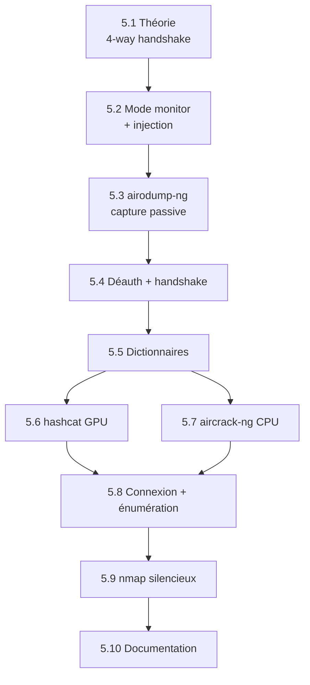

# V - Attaque WiFi WPA2 simple

!!! quote "L'analogie du serrurier face à une serrure standardisée"

    Un serrurier expérimenté ne casse pas une serrure. Il l'observe, comprend son mécanisme, identifie le modèle. Si le modèle est ancien et standardisé, il sait que des techniques publiques existent pour l'ouvrir. Il prépare ses outils, choisit le bon angle, applique la pression juste, et la porte cède. WPA2-PSK est cette serrure standardisée des années 2000 que le monde entier a installée et que peu remplacent. Sa mécanique est publique depuis 2003. Ses faiblesses sont documentées depuis 2008. Ses outils de cracking sont open source depuis 2014. Pour ARTECH dont le PSK est `ArtechMedical2020!`, la serrure cédera en quelques heures. Cette mécanique, vous allez la comprendre, la mettre en œuvre, puis la documenter pour mieux la défendre.

## Présentation du module

Deuxième module du cycle 1. Vous attaquez le Wi-Fi WPA2 d'ARTECH avec les outils de référence de la communauté. La méthodologie suit un déroulé strict : **comprendre avant d'agir**, puis **agir avant de défendre**.

### Pourquoi WPA2-PSK reste exploitable en 2026

Plusieurs facteurs maintiennent WPA2-PSK comme vecteur d'attaque viable malgré l'arrivée de WPA3.

| Facteur | Explication |
|---|---|
| Inertie du parc | 80 % des routeurs déployés sont WPA2-PSK |
| Compatibilité ascendante | Beaucoup de devices ne supportent pas WPA3 |
| PSK humains | Mots de passe choisis par humains, faibles |
| Ouverture protocolaire | Beacons, probe responses, association sont en clair |
| Capture passive du handshake | Possible sans interaction directe |
| GPU dédié | Cracking de plus en plus rapide année après année |

### Différence avec WPA3-SAE

WPA3 introduit **SAE** (Simultaneous Authentication of Equals) qui résout les principales vulnérabilités. Voici les différences clés.

| Aspect | WPA2-PSK | WPA3-SAE |
|---|---|---|
| Échange clé | 4-way handshake | SAE Dragonfly |
| Capture offline | Possible | Impossible (sans Dragonblood) |
| Forward secrecy | Non | Oui |
| Protection dictionnaire | Faible | Forte (résistant offline) |
| Adoption 2026 | ~80 % parc | ~20 % parc |

Pour ARTECH, qui est resté en WPA2-PSK, l'attaque reste possible.

### Objectifs pédagogiques

À l'issue de ce module, vous serez capable de :

- Expliquer le 4-way handshake WPA2 dans le détail cryptographique
- Mettre une carte Wi-Fi en mode monitor et injection
- Capturer un handshake avec airodump-ng
- Forcer une déauthentification ciblée pour accélérer la capture
- Construire un dictionnaire français efficace
- Cracker un PSK avec hashcat (GPU) ou aircrack-ng (CPU)
- Vous connecter au réseau cible et faire de la reconnaissance interne
- Documenter chaque étape forensiquement

### Prérequis stricts

Avant d'entamer ce module, certains acquis sont indispensables.

| Critère | Niveau attendu |
|---|---|
| Module 4 OSINT validé | BSSID et canal connus |
| Carte Alfa AWUS036ACS | Configurée (cycle 0 module 3.13) |
| Kali Linux | Fonctionnel avec aircrack-ng et hashcat |
| GPU disponible | Recommandé mais pas indispensable |
| Lab ARTECH actif | OpenWrt avec WPA2 PSK configuré |

### Structure du module

Voici le plan détaillé des 10 chapitres composant ce module, soit 30 heures de travail.

| # | Chapitre | Durée | Niveau |
|---|---|---|---|
| 5.1 | Théorie WPA2 - 4-way handshake et PMK/PTK | 3 h | Théorique |
| 5.2 | Mode moniteur et passage en injection | 2 h | Pratique |
| 5.3 | airodump-ng capture passive | 2 h | Pratique |
| 5.4 | Déauthentification ciblée et capture handshake | 3 h | Pratique |
| 5.5 | Construction de dictionnaires français | 4 h | Pratique avancé |
| 5.6 | hashcat et attaque GPU | 4 h | Pratique avancé |
| 5.7 | aircrack-ng en mode CPU | 2 h | Pratique |
| 5.8 | Connexion au réseau cible et reconnaissance interne | 3 h | Pratique |
| 5.9 | nmap silencieux et énumération | 3 h | Pratique |
| 5.10 | Documentation de la phase d'intrusion | 4 h | Synthèse |

**Total : 30 heures** sur 4 semaines à 7-8 h/semaine.

## Cadre légal STRICT

Ce module pratique des techniques **strictement encadrées juridiquement**.

### Articles applicables

Voici les articles à connaître précisément avant tout exercice.

| Article | Infraction | Peine |
|---|---|---|
| 226-15 | Interception de communications privées (capture handshake) | 1 an / 45 000 € |
| 323-1 | Accès / maintien frauduleux STAD (connexion au réseau) | 3 ans / 100 000 € |
| 226-3 | Détention équipements d'interception | 5 ans / 300 000 € |
| 323-3 | Modification frauduleuse données | 5 ans / 150 000 € |

### Légalité dans le lab OmnyAcademy

Les techniques de ce module sont **légales** uniquement dans les conditions suivantes.

| Condition | Application |
|---|---|
| Sur votre propre réseau Wi-Fi | OK (lab) |
| Sur un réseau avec mandat écrit pentest | OK |
| Sur un réseau de test public ouvert | À vérifier au cas par cas |
| Sur un réseau tiers sans autorisation | INTERDIT |

### Avertissement

```text
DANGER PÉNAL DIRECT

Cracker le Wi-Fi de votre voisin "pour tester"
n'est PAS un test. C'est une infraction pénale
relevant de l'article 323-1 dès que la connexion
est tentée, et de l'article 226-15 pour la capture
du handshake.

Les peines sont effectives : plusieurs condamnations
en France entre 2020 et 2025 pour ce motif précis.

Restez dans le LAB.
```

## Architecture pédagogique

Le module suit une progression strictement séquentielle. Chaque chapitre conditionne le suivant.



## Méthodologie attaque/défense

Pour chaque technique offensive, le module présente la **contre-mesure défensive** correspondante. Cela garantit la dimension pédagogique double.

```text
PRINCIPE PÉDAGOGIQUE
======================

Pour chaque vulnérabilité exploitée :
  1. Comprendre le mécanisme cryptographique
  2. Appliquer l'attaque sur le lab
  3. Identifier la contre-mesure
  4. Évaluer son efficacité
  5. Recommander l'implémentation pour ARTECH
```

## Liens avec les modules suivants

Le module 5 produit des inputs essentiels pour la suite du cycle 1.

| Élément | Module utilisateur |
|---|---|
| Connexion au LAN ARTECH | Module 6 (phishing depuis le LAN) |
| Reconnaissance interne | Module 6 (cible interne identifiée) |
| Documentation forensic offensive | Module 9 (corrélation côté analyste) |
| Mapping MITRE ATT&CK | Module 10 (rapport final) |

## Ce que vous produirez

À l'issue du module, vous aurez les livrables suivants.

| Livrable | Format |
|---|---|
| Capture handshake WPA2 | PCAP-NG |
| PSK ARTECH-WIFI cracké | Texte (validation) |
| Dictionnaire français personnalisé | TXT |
| Cartographie réseau interne | Markdown + Mermaid |
| Documentation forensic offensive | Markdown horodaté |

## Démarrage

Pour commencer, rendez-vous dans le répertoire du module et ouvrez le premier chapitre.

```bash
cd ~/Documents/omnyacademy/02-cycle-1-premier-cas/module-5-attaque-wifi-wpa2/
cat 5-1-theorie-wpa2-handshake.md
```

---

**Module précédent** : [Module 4 - OSINT et reconnaissance](../module-4-osint-reconnaissance/README.md)

**Module suivant** : [Module 6 - Phishing basique](../module-6-phishing-basique/README.md)
