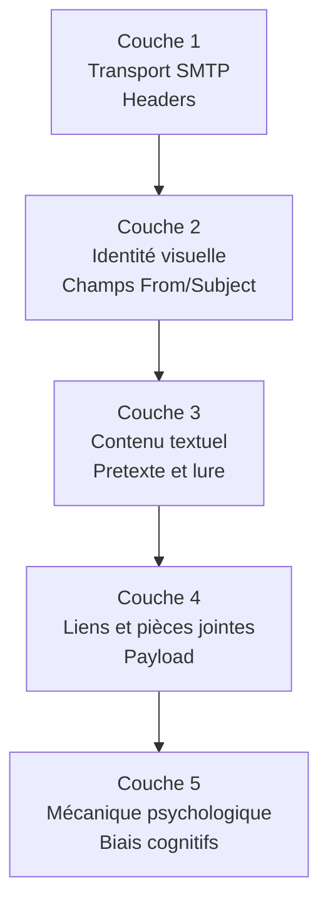

# 6.1 Anatomie d'un email de phishing - analyse défensive

!!! quote "L'analogie du douanier qui apprend à reconnaître les faux passeports"

    Un douanier expérimenté ne mémorise pas les techniques de fabrication des faux passeports. Il apprend à reconnaître les indicateurs : qualité du papier, micro-impression, hologramme, cohérence biographique, comportement du porteur. Il décompose le document et croise avec une base de référence. Si trois indicateurs concordent vers un faux, il déclenche une vérification approfondie. Ce chapitre vous forme à la même posture face aux emails de phishing. Vous n'apprendrez pas à fabriquer un faux email convaincant. Vous apprendrez à le décomposer, à reconnaître les signaux, à former vos utilisateurs et à régler vos passerelles. C'est cette capacité d'analyse défensive qui distingue un analyste senior d'un opérateur.

## Métadonnées du chapitre

Ce chapitre est l'analyse fondatrice du module 6 côté défense. Voici ses caractéristiques.

| Champ | Valeur |
|---|---|
| Durée estimée | 3 heures |
| Niveau | Théorique avec analyse pratique |
| Prérequis | Module 5 validé |
| Livrables | Analyse de 5 phishings publics et grille d'indicateurs |
| Auto-explication | 12 minutes |

## Objectifs pédagogiques

À l'issue de ce chapitre, vous serez capable de :

- Décomposer un email de phishing en couches (technique, psychologique, visuelle)
- Identifier les biais cognitifs exploités
- Lire et analyser les headers SMTP
- Reconnaître les patterns techniques (typosquatting, homographes, redirects)
- Construire une grille d'indicateurs pour l'utilisateur final
- Préparer le matériel de sensibilisation

---

## 1. Sources d'échantillons publics pour l'analyse

L'analyse défensive commence par l'étude de cas réels. Heureusement, plusieurs sources publiques fournissent des échantillons de phishing.

### 1.1 Bases de données publiques

Voici les sources principales d'échantillons légalement consultables.

| Source | URL | Caractéristique |
|---|---|---|
| PhishTank | phishtank.org | Soumissions communautaires vérifiées |
| OpenPhish | openphish.com | Feed de phishings vérifiés |
| URLhaus | urlhaus.abuse.ch | URLs malveillantes |
| MISP communities | misp-project.org | IOC partagés |
| ANSSI / CERT-FR | cert.ssi.gouv.fr | Alertes officielles France |
| SignalSpam | signal-spam.fr | Plateforme française CNIL |

### 1.2 Vos propres réceptions

Une source précieuse est votre propre boîte de réception. Pour chaque phishing reçu personnellement, conservez-le dans un dossier dédié pour analyse.

```text
ORGANISATION PHISHING REÇUS
==============================

~/phishing-corpus/
  ├── 2026-04/
  │   ├── 2026-04-15-faux-impots.eml
  │   ├── 2026-04-18-faux-amazon.eml
  │   └── ...
  ├── 2026-05/
  │   └── ...
  └── INDEX.md (catalogue)

Pour chaque phishing, conserver :
  - Email complet en .eml (Save As dans Thunderbird)
  - Capture rendu visuel
  - Headers complets
  - Notes d'analyse
```

### 1.3 Légalité de l'analyse

L'analyse de phishings reçus ou publics est **strictement légale**. Voici les bornes.

| Action | Statut |
|---|---|
| Analyser un phishing reçu personnellement | Légal |
| Étudier un phishing publié sur PhishTank | Légal |
| Reconstituer le payload pour comprendre | Légal en lab isolé |
| Naviguer vers l'URL de phishing | Risqué (sandbox impérative) |
| Republier l'échantillon brut | À encadrer (peut diffuser le malware) |

## 2. Anatomie en 5 couches

Un email de phishing s'analyse en 5 couches superposées.

### 2.1 Vue d'ensemble

Voici les couches d'analyse à parcourir systématiquement.



### 2.2 Tableau récapitulatif

Voici la grille d'analyse complète à appliquer à chaque échantillon.

| Couche | Éléments | Indicateurs |
|---|---|---|
| 1 - Transport | Received, SPF, DKIM, DMARC, IP source | Authentification, pays origine, route |
| 2 - Identité | From, Reply-To, Display Name | Cohérence, typosquatting, spoofing |
| 3 - Contenu | Sujet, corps, signature | Urgence, autorité, fautes |
| 4 - Payload | URLs, pièces jointes | Domaines, hashes, types |
| 5 - Psycho | Émotions ciblées, biais | Peur, autorité, gain, urgence |

## 3. Couche 1 - Transport SMTP

L'analyse des **headers** est la base technique de toute investigation.

### 3.1 Récupération des headers

Voici comment récupérer les headers complets selon le client.

| Client | Procédure |
|---|---|
| Gmail (web) | Ouvrir mail → 3 points → Show original |
| Outlook (web) | Ouvrir mail → ... → View → View message source |
| Thunderbird | Ouvrir mail → Other Actions → View Source |
| Apple Mail | Mail → View → Message → All Headers |
| K-9 Mail | Long press → Show Source |

### 3.2 Headers structurants

Voici les headers qu'on examine en priorité.

| Header | Information révélée |
|---|---|
| Received | Chaîne des serveurs traversés |
| Return-Path | Adresse de bounce (souvent révélatrice) |
| From | Émetteur affiché |
| Reply-To | Adresse de réponse (peut différer de From) |
| Message-ID | Identifiant unique (format de chaque MTA) |
| X-Originating-IP | IP source (parfois) |
| Authentication-Results | Verdict SPF/DKIM/DMARC |

### 3.3 Lecture d'un header type

Voici un exemple typique de phishing avec annotations.

```text
EXEMPLE DE HEADER PHISHING ANNOTÉ
=====================================

Return-Path: <bounce@suspicious-domain.tk>
            ↑ Domaine .tk suspect (Tokelau, gratuit)

Received: from suspicious-domain.tk (unknown [185.220.101.42])
        by mx.example.com (Postfix) with ESMTPS id 4F8KQX
        for <victim@artech.fr>; Mon, 30 Apr 2026 14:32:15 +0200
            ↑ IP 185.220.101.42 = Tor exit node connu

Authentication-Results: mx.example.com;
        spf=fail (sender IP is 185.220.101.42)
            smtp.mailfrom=suspicious-domain.tk;
        dkim=fail (no signature)
            ↑ Échecs SPF et DKIM = très suspect
        dmarc=fail (p=reject) header.from=banque-fr.com
            ↑ Domaine usurpé (banque-fr.com) avec DMARC reject

From: "Service Sécurité Banque" <securite@banque-fr.com>
            ↑ Domaine légitime usurpé
            ↑ Display name rassurant ajouté

Reply-To: securite-support@suspicious-domain.tk
            ↑ Reply-To DIFFÈRE du From - INDICATEUR CRITIQUE

Subject: URGENT - Vérification de votre compte sous 24h
            ↑ Urgence + autorité + délai court

Message-ID: <random@suspicious-domain.tk>
            ↑ Pas du format de la banque réelle
```

### 3.4 SPF, DKIM, DMARC - principes

Les trois protocoles d'authentification email forment le **socle anti-phishing technique**.

#### SPF - Sender Policy Framework

```text
SPF EN BREF
=============

Principe :
  Le domaine déclare dans son DNS quelles IPs
  sont autorisées à envoyer du mail en son nom.

Exemple DNS pour artech.fr :
  artech.fr. IN TXT "v=spf1 include:_spf.google.com -all"
  
  Traduction : seuls les serveurs Google peuvent
  envoyer du mail @artech.fr. Tout le reste est
  rejeté (-all hard fail).

Faiblesses :
  - Ne protège que l'enveloppe (Mail From), pas le From visible
  - Casse en cas de forwarding légitime
  - Spoofing possible si SPF mal configuré (~all soft fail)
```

#### DKIM - DomainKeys Identified Mail

```text
DKIM EN BREF
==============

Principe :
  Le serveur émetteur signe cryptographiquement
  des champs du message avec une clé privée.
  La clé publique est publiée en DNS.

Exemple :
  default._domainkey.artech.fr. IN TXT "v=DKIM1; k=rsa; p=MIGfMA..."
  
  Le récepteur vérifie la signature avec cette clé publique.

Force :
  - Survit au forwarding
  - Authenticité cryptographique
  - Intégrité du contenu signé

Faiblesse :
  - Si le serveur émetteur est compromis,
    DKIM signe quand même
```

#### DMARC - Domain-based Message Authentication

```text
DMARC EN BREF
===============

Principe :
  Politique d'alignment SPF + DKIM + From visible.
  Spécifie l'action en cas d'échec.

Exemple :
  _dmarc.artech.fr. IN TXT "v=DMARC1; p=reject; rua=mailto:dmarc@artech.fr"
  
  Politique :
    p=none    : ne rien faire (mode observation)
    p=quarantine : envoyer en spam
    p=reject  : rejeter

Force :
  - Aligne SPF/DKIM avec le From visible
  - Reporting (rua/ruf) pour visibilité

Faiblesse :
  - Peu déployé (~70 % grands comptes, ~10 % PME en 2026)
  - Configuration complexe
```

### 3.5 Outils d'analyse SPF/DKIM/DMARC

Voici les outils utiles pour vérifier la configuration d'un domaine.

```bash
# Vérification SPF
dig +short txt artech.fr | grep spf

# Vérification DKIM
dig +short txt default._domainkey.artech.fr

# Vérification DMARC
dig +short txt _dmarc.artech.fr

# Outils en ligne
# https://mxtoolbox.com/SPFLookup.aspx
# https://dmarcian.com/dmarc-inspector/
# https://dmarc-tester.com
```

### 3.6 Position d'ARTECH

Pour le scénario ARTECH lab, vous configurerez ces protocoles au chapitre 6.2. Voici l'état initial type d'une PME française.

| Protocole | Configuration ARTECH initiale | Recommandation |
|---|---|---|
| SPF | Absent ou ~all permissif | -all strict |
| DKIM | Absent | Activé avec clé 2048 bits |
| DMARC | Absent | p=quarantine puis p=reject |

## 4. Couche 2 - Identité visuelle

### 4.1 Champs d'identité

Voici les champs à scruter dans la zone visible de l'email.

| Champ | Indicateur |
|---|---|
| Display Name | Souvent rassurant, ne signifie rien techniquement |
| Adresse From | Domaine source - vérifier orthographe |
| Reply-To | Doit correspondre au From (sauf cas légitimes) |
| Avatar/photo | Souvent absente sur phishings |

### 4.2 Typosquatting et homographes

Le **typosquatting** consiste à enregistrer des domaines visuellement proches du légitime.

Voici les techniques courantes.

| Technique | Exemple |
|---|---|
| Substitution de caractère | banque-fr.com → banque-tr.com |
| Caractères doublés | amazon.fr → amaazon.fr |
| Tirets ajoutés | paypal.com → pay-pal.com |
| TLD différent | google.fr → google.eu |
| Homographes Unicode | apple.com → аpple.com (а cyrillique) |

### 4.3 Détection homographes

Pour détecter les homographes Unicode, voici la commande.

```bash
# Détection Unicode dans une URL
echo "apple.com" | hexdump -C
# Si caractères en dehors de la plage ASCII (>0x7F),
# il y a probablement substitution Unicode

# Outil dédié : punycode converter
# Permet de voir la version "vraie" du domaine
python3 -c "print('apple.com'.encode('idna'))"
```

### 4.4 Vérification rapide d'un domaine

Pour vérifier un domaine suspect, voici les vérifications express.

```bash
# Date de création (très récent = suspect)
whois suspicious-domain.com | grep -i "creation\|created"

# Si moins de 30 jours, suspect élevé

# Hébergement
whois suspicious-domain.com | grep -i "registrar"

# Nameservers et certificats
dig suspicious-domain.com NS
echo | openssl s_client -connect suspicious-domain.com:443 \
    -servername suspicious-domain.com 2>/dev/null | \
    openssl x509 -noout -subject -dates
```

## 5. Couche 3 - Contenu textuel

### 5.1 Pretextes courants

Voici les **pretextes** les plus fréquents en phishing francophone 2026.

| Pretexte | Vraisemblance | Détection |
|---|---|---|
| Banque - blocage compte | Élevée | Vérifier domaine bancaire |
| Impôts - remboursement/dette | Élevée | Service.public.fr |
| Livraison - colis bloqué | Très élevée | Tracking direct transporteur |
| Réseau social - connexion suspecte | Élevée | Compte directement |
| RH - bulletin / contrat | Croissante (2024+) | DSI |
| CEO fraud - virement urgent | Ciblée | Procédure validation |
| Microsoft 365 - réinitialisation | Élevée | URL admin réelle |
| Service interne - mot de passe expiré | Élevée | DSI |

### 5.2 Marqueurs textuels suspects

Voici les marqueurs textuels qui doivent éveiller la vigilance.

| Marqueur | Exemple |
|---|---|
| Urgence excessive | "Sous 24h", "immédiatement" |
| Menaces voilées | "compte sera supprimé" |
| Autorité usurpée | "Service Sécurité", "Direction" |
| Fautes d'orthographe | Indicateur classique mais affaibli (IA) |
| Salutation générique | "Cher Client", "Chère Madame" |
| Secret demandé | "Ne partagez pas", "Confidentiel" |
| Procédure bypass | "Cliquez ici directement" |

### 5.3 Affaiblissement par IA

En 2026, les fautes d'orthographe ne sont **plus un indicateur fiable**. Les attaquants utilisent ChatGPT et équivalents pour produire des textes parfaits en français.

```text
ÉVOLUTION 2020 vs 2026
========================

2020
  Phishing typique avec fautes : 80 %
  Détection facile par texte

2024
  Phishing IA-rédigé : 60 %
  Texte parfait, ton adapté

2026
  Phishing IA-rédigé : 90 %+
  Personnalisation par OSINT préalable
  Conversational scams (chatbot)

Conséquence pour la défense :
  Ne plus dépendre de la qualité du texte.
  Concentrer la formation sur les indicateurs
  techniques et procéduraux.
```

## 6. Couche 4 - Liens et pièces jointes

### 6.1 Analyse des URLs

L'URL d'un lien suspect ne doit **jamais être cliquée** sans analyse préalable.

#### Inspection sans clic

```bash
# Survol pour voir l'URL réelle (toujours)
# Dans Thunderbird : status bar en bas

# Extraction des URLs depuis un .eml
grep -oE 'https?://[^[:space:]"<>]+' phishing.eml | sort -u

# Dépaquetage URL raccourcie sans la suivre
curl -sIL "https://bit.ly/3xYzABC" -o /dev/null -w "%{url_effective}\n"

# Vérification VirusTotal sans cliquer
# Soumettre l'URL via vt.cli ou web
vt url scan "https://suspicious.example/path"
```

#### Décomposition d'URL malveillante

Voici un exemple d'URL piégée à décomposer.

```text
URL EXEMPLE
=============

https://login-banque-fr.suspicious-domain.tk/auth?redirect=banque-fr.com

DÉCOMPOSITION

Schéma : https (rassurant mais ne garantit rien)
Sous-domaine : login-banque-fr (rassurant via leurre)
Domaine principal : suspicious-domain.tk
TLD : .tk (Tokelau, gratuit, suspect)
Path : /auth (rassurant)
Query : redirect=banque-fr.com (renforce illusion)

CONCLUSION
  Le domaine RÉEL est suspicious-domain.tk
  Tout ce qui précède est sous-domaine arbitraire
```

### 6.2 Pièces jointes

Voici les types de pièces jointes selon leur niveau de risque.

| Extension | Niveau de risque | Vecteur typique |
|---|---|---|
| .docm, .xlsm, .pptm | Élevé | Macro VBA |
| .doc, .xls (anciens) | Élevé | Macro VBA legacy |
| .pdf | Élevé | Exploit JavaScript / lien |
| .html | Moyen | Phishing page |
| .zip, .rar | Modéré | Conteneur, scrute contenu |
| .iso, .img | Élevé | Bypass MOTW (Mark of the Web) |
| .lnk | Très élevé | Exécution commande |
| .docx, .xlsx, .pptx | Faible | Sauf objets embarqués |

### 6.3 Analyse statique sécurisée

Pour analyser une pièce jointe sans l'exécuter, voici les outils.

```bash
# Hash de la pièce jointe
sha256sum suspect-document.docm

# Recherche du hash sur VirusTotal
vt file scan suspect-document.docm

# Type réel du fichier (pas seulement extension)
file suspect-document.docm

# Pour les Office : extraction des macros sans exécution
sudo apt install python3-oletools
olevba suspect-document.docm

# Pour PDF : extraction métadonnées et JavaScript
pdfid suspect-document.pdf
pdf-parser suspect-document.pdf
```

### 6.4 Sandbox cloud

Pour une analyse comportementale sans risque, utilisez une sandbox.

| Sandbox | Caractéristique | Tarif |
|---|---|---|
| ANY.RUN | Interactive, freemium | Gratuit limité |
| Joe Sandbox | Très complète | Gratuit limité |
| Hybrid Analysis | Communauté | Gratuit |
| Cuckoo | Self-hosted | Gratuit (à déployer) |
| VirusTotal | Analyse multi-AV | Gratuit limité |

```bash
# Soumission VirusTotal via CLI
vt file analyze suspect-document.docm

# Récupération du rapport après quelques minutes
vt file report <sha256>
```

## 7. Couche 5 - Mécanique psychologique

### 7.1 Biais cognitifs exploités

Le phishing exploite des **biais cognitifs** universels. Les comprendre aide à les neutraliser.

| Biais | Mécanique | Exemple phishing |
|---|---|---|
| Autorité | Obéir à figure d'autorité | "Service Sécurité Banque" |
| Urgence | Décider vite, mal | "Sous 24h" |
| Réciprocité | Rendre service à qui en rend | "Voici votre remboursement" |
| Rareté | Saisir opportunité limitée | "Offre exceptionnelle" |
| Peur | Éviter la perte | "Compte va être bloqué" |
| Curiosité | Découvrir l'inconnu | "Photo de vous compromettante" |
| Confiance sociale | Suivre la majorité | "12 collègues ont validé" |
| Engagement | Tenir parole | "Vous aviez demandé..." |

### 7.2 Combinaisons typiques

Les phishings efficaces combinent plusieurs biais. Voici les combinaisons fréquentes.

| Combinaison | Cible type | Vecteur |
|---|---|---|
| Autorité + urgence + peur | Tout employé | Mail "DSI" |
| Réciprocité + curiosité | Commerciaux | Faux fournisseur |
| Engagement + autorité | Comptables | CEO fraud |
| Peur + rareté | Particuliers | Faux impôts |

### 7.3 Application aux cibles ARTECH

En croisant avec l'OSINT du module 4, voici les biais pertinents pour ARTECH.

| Cible | Biais principaux | Vecteur recommandé en sensibilisation |
|---|---|---|
| Sophie Dupont (compta) | Autorité (PDG) + urgence | Simulation CEO fraud |
| Paul Dubois (stagiaire) | Autorité (tutrice) + curiosité | Faux mail formation |
| Hélène Lefebvre (PDG) | Autorité externe (avocat) + secret | Faux mail légal |

## 8. Construction d'une grille d'analyse

### 8.1 Grille type pour utilisateur final

Voici une grille simple à diffuser aux employés.

```text
GRILLE DE VÉRIFICATION RAPIDE
================================

Avant de cliquer ou ouvrir une pièce jointe :

[ ] Connais-je l'expéditeur réel (pas juste le nom affiché) ?
[ ] L'adresse exacte est-elle cohérente avec l'organisation ?
[ ] Le ton crée-t-il de l'urgence excessive ?
[ ] Une autorité est-elle invoquée ?
[ ] Suis-je incité à contourner une procédure ?
[ ] Le lien (au survol) pointe-t-il vers le domaine attendu ?
[ ] La demande est-elle inattendue dans mon contexte ?

Si UN SEUL doute : NE PAS CLIQUER.
Vérifier par un canal indépendant (téléphone, en personne).
Signaler au DSI ou via le bouton anti-phishing.
```

### 8.2 Grille type pour analyste SOC

Pour un analyste, la grille est plus exhaustive.

```text
GRILLE D'ANALYSE PHISHING POUR SOC
=====================================

PHASE 1 - HEADERS
  [ ] SPF résultat (pass/fail)
  [ ] DKIM résultat
  [ ] DMARC verdict
  [ ] IP source réputation (AbuseIPDB)
  [ ] Pays origine cohérent
  [ ] Chaîne Received réaliste

PHASE 2 - IDENTITÉ
  [ ] From cohérent avec Reply-To
  [ ] Domaine pas de typosquatting
  [ ] Display name cohérent
  [ ] Pas d'homographe Unicode

PHASE 3 - CONTENU
  [ ] Pretexte plausible
  [ ] Marqueurs urgence/autorité
  [ ] Demande inhabituelle pour la cible
  [ ] Salutation générique ou personnalisée

PHASE 4 - PAYLOAD
  [ ] URLs : domaines réputation
  [ ] URLs : âge des domaines
  [ ] URLs : redirection finale
  [ ] PJ : type réel vs extension
  [ ] PJ : hash sur VirusTotal
  [ ] PJ : analyse statique (olevba, pdfid)

PHASE 5 - CONTEXTE CIBLE
  [ ] Cible identifiable depuis OSINT public
  [ ] Cohérence avec son rôle
  [ ] Procédure normale de l'organisation

VERDICT
  [ ] Faux positif (légitime)
  [ ] Phishing à confiner
  [ ] Phishing à bloquer + IOC global
  [ ] Spear phishing ciblé (escalade)
```

## 9. Cas pratique - Analyse de 3 phishings publics

### 9.1 Méthodologie

Voici la procédure pour analyser un phishing depuis PhishTank.

```bash
# Préparation
mkdir -p ~/pentest/artech-2026/phishing-analyse
cd ~/pentest/artech-2026/phishing-analyse/

# Téléchargement de l'échantillon
# Depuis PhishTank, sélectionner 3 phishings récents en français

# Pour chaque phishing :
mkdir phishing-001
cd phishing-001
# Sauvegarder l'EML
# Capturer le rendu HTML
# Documenter l'analyse selon la grille
```

### 9.2 Template d'analyse

Voici le template à compléter pour chaque échantillon.

```markdown
# Analyse phishing #001

## Métadonnées
- Source : PhishTank ID 12345
- Date soumission : YYYY-MM-DD
- Hash SHA-256 : a1b2c3...

## Couche 1 - Transport
- IP source : 185.x.x.x (pays : XX)
- SPF : fail
- DKIM : absent
- DMARC : non aligné
- Réputation IP : élevée (AbuseIPDB confidence 95%)

## Couche 2 - Identité
- From visible : "Service Banque" <support@suspicious.tk>
- Reply-To : autre@autre-domaine.tk
- Domaine : suspicious.tk (créé il y a 5 jours)
- Typosquatting : non, mais usurpation Display Name

## Couche 3 - Contenu
- Pretexte : blocage compte bancaire
- Urgence : "sous 24h"
- Marqueurs : autorité, peur, urgence
- Qualité texte : excellente (probable IA)

## Couche 4 - Payload
- URL : https://login-banque[.]suspicious[.]tk/auth
- Type PJ : aucune
- Verdict VT URL : 8/87 moteurs

## Couche 5 - Psychologie
- Biais : autorité + peur + urgence
- Cible probable : grand public

## Verdict
Phishing classique de masse, infrastructure consommable,
TTP standard. Ajouter à la liste de blocage interne.
```

### 9.3 Liens d'IOC

À l'issue, exportez les IOC pour partage avec votre équipe.

```text
IOC PHISHING #001
====================

Type     | Valeur                       | Confiance
URL      | https://login-banque[.]suspicious[.]tk/auth | Élevée
Domaine  | suspicious[.]tk              | Élevée
IP       | 185.x.x.x                    | Moyenne (peut changer)
Hash PJ  | a1b2c3... (si applicable)    | Élevée
Email    | support@suspicious[.]tk      | Élevée
Reply-To | autre@autre-domaine[.]tk     | Élevée

À ajouter dans :
  - Email gateway block list
  - Web proxy block list
  - SIEM detection rules
  - Threat Intel sharing (MISP)
```

## 10. Sensibilisation utilisateur

L'analyse défensive nourrit la sensibilisation. Voici les principes.

### 10.1 Formation par exemples

Les utilisateurs apprennent mieux par **exemples concrets** que par règles abstraites.

| Méthode | Efficacité |
|---|---|
| Exposé théorique | Faible |
| Quiz post-formation | Modérée |
| Phishing simulé avec debriefing | Élevée |
| Analyse en groupe d'un cas réel | Très élevée |
| Bouton "signaler phishing" | Renforce vigilance continue |

### 10.2 Phishing simulé éthique

Le phishing simulé est efficace mais doit être encadré. Voici les règles.

| Règle | Justification |
|---|---|
| Accord CSE et RH | Obligation sociale |
| Information préalable de l'existence du programme | RGPD, transparence |
| Ne pas piéger sur sujets sensibles (santé, deuil) | Éthique |
| Pas de sanctions individuelles | Climat de confiance |
| Statistiques anonymisées | Pas de stigmatisation |
| Formation ciblée pour les cliqueurs | Approche bienveillante |

### 10.3 Outils de phishing simulé

Voici les solutions du marché.

| Solution | Type |
|---|---|
| KnowBe4 | Commercial leader |
| Cofense PhishMe | Commercial |
| Gophish | Open source self-hosted |
| Lucy | Hybride |
| Sophos Phish Threat | Commercial |

## 11. Recommandations défensives ARTECH

À l'issue de l'analyse, voici les recommandations actionnables pour ARTECH.

### 11.1 Niveau infrastructure

Voici les actions techniques à mener.

| Recommandation | Priorité | Effort |
|---|---|---|
| Configurer SPF strict (-all) | Critique | 1 heure |
| Activer DKIM 2048 bits | Critique | 2 heures |
| Déployer DMARC p=quarantine puis reject | Critique | 2 semaines (observation) |
| Email gateway avec sandbox PJ | Élevée | 1 mois (sélection + déploiement) |
| Bouton "signaler phishing" Outlook/Thunderbird | Élevée | 1 jour |
| Firewall DNS (catégorisation domaines) | Élevée | 1 semaine |

### 11.2 Niveau utilisateur

Voici les actions humaines à mener.

| Recommandation | Priorité |
|---|---|
| Formation initiale 1h pour tous | Critique |
| Test phishing simulé trimestriel | Élevée |
| Procédure validation virement (CEO fraud) | Critique |
| Communication "mois de la cybersécurité" | Moyenne |
| Charte cybersécurité signée | Élevée |

### 11.3 Niveau gouvernance

Voici les actions de pilotage à mettre en place.

| Recommandation | Priorité |
|---|---|
| Procédure de signalement claire | Critique |
| Tableau de bord mensuel (volumes, taux clic) | Moyenne |
| Plan de réponse incident phishing | Élevée |
| Budget formation 2 % masse salariale | Moyenne |

## 12. Auto-évaluation

Vérifiez votre maîtrise par les questions suivantes.

| # | Question | Réponse |
|---|---|---|
| 1 | Combien de couches d'analyse ? | 5 |
| 2 | Sources publiques d'échantillons ? | PhishTank, OpenPhish, URLhaus |
| 3 | Trois protocoles anti-phishing ? | SPF, DKIM, DMARC |
| 4 | Header montrant la chaîne ? | Received |
| 5 | Outil pour macros Office ? | olevba |
| 6 | Biais d'urgence + autorité ? | Très fréquent en CEO fraud |
| 7 | TLD risqué cité ? | .tk (gratuit, abus fréquent) |
| 8 | Outil sandbox interactive ? | ANY.RUN |

## 13. Synthèse

Voici les points clés à retenir.

```text
ANATOMIE PHISHING - DÉFENSE

5 COUCHES D'ANALYSE
  1. Transport (headers, SPF/DKIM/DMARC)
  2. Identité visuelle (typosquatting)
  3. Contenu (pretexte, biais)
  4. Payload (URLs, PJ)
  5. Psychologie (biais cognitifs)

PROTOCOLES ANTI-PHISHING
  SPF : autorisation IPs émetteurs
  DKIM : signature cryptographique
  DMARC : politique d'alignement

OUTILS D'ANALYSE
  Headers : Thunderbird "View Source"
  Hash : sha256sum, VirusTotal
  Macros : olevba (oletools)
  PDF : pdfid, pdf-parser
  Sandbox : ANY.RUN, Joe Sandbox

SOURCES ÉCHANTILLONS
  PhishTank
  OpenPhish
  URLhaus
  CERT-FR

BIAIS COGNITIFS
  Autorité, urgence, peur
  Réciprocité, rareté
  Confiance sociale
  Engagement

RECOMMANDATIONS ARTECH
  SPF/DKIM/DMARC strict
  Gateway sandbox
  Formation utilisateurs
  Phishing simulé éthique
  Procédure CEO fraud

ÉVOLUTION 2026
  Fautes orthographe = indicateur affaibli
  IA pour rédaction phishing
  Personnalisation OSINT poussée
  Voice phishing en hausse
```

---

**Chapitre suivant** : [6.2 Infrastructure SMTP - Postfix avec SPF/DKIM/DMARC](6-2-infrastructure-smtp-postfix.md)