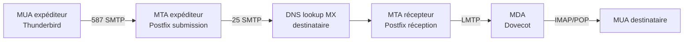
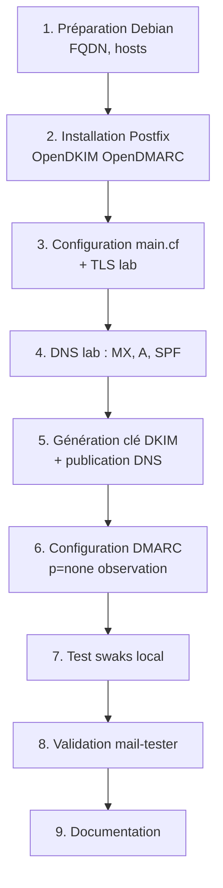

# 6.2 Infrastructure SMTP - Postfix avec SPF/DKIM/DMARC

!!! quote "L'analogie du tampon de la mairie sur l'enveloppe"

    Au village, le facteur sait qu'une lettre est officielle quand elle porte le tampon de la mairie. Sans ce tampon, n'importe qui pourrait écrire au nom du maire. La mairie a donc un seul tampon, gardé sous clé, utilisé par une seule personne. Pour un domaine email, SPF, DKIM et DMARC jouent le rôle de ce tampon, de la clé qui le garde, et de la procédure qui le contrôle. Configurer ces protocoles, c'est apposer le tampon authentique sur tous les courriers de votre domaine, et permettre à chaque facteur de vérifier que le tampon est vrai. Ce chapitre vous fait construire cette infrastructure dans votre lab, parce que vous ne saurez analyser un mail entrant qu'après avoir compris comment un mail sortant légitime est signé.

## Métadonnées du chapitre

Ce chapitre est central pour comprendre l'écosystème mail. Voici ses caractéristiques.

| Champ | Valeur |
|---|---|
| Durée estimée | 4 heures |
| Niveau | Pratique sysadmin |
| Prérequis | 6.1, Linux/Debian de base |
| Livrables | Lab Postfix opérationnel avec SPF/DKIM/DMARC validés |
| Auto-explication | 12 minutes |

## Objectifs pédagogiques

À l'issue de ce chapitre, vous serez capable de :

- Comprendre l'architecture d'un serveur SMTP
- Installer et configurer Postfix sur Debian
- Générer une clé DKIM et la publier en DNS
- Définir une politique SPF cohérente
- Mettre en place DMARC avec reporting
- Valider la configuration via mail-tester
- Analyser les logs pour détecter les anomalies

---

## 1. Architecture d'un serveur SMTP

### 1.1 Vocabulaire

Avant tout, voici les termes à maîtriser.

| Terme | Signification |
|---|---|
| MTA | Mail Transfer Agent (Postfix, Exim) |
| MUA | Mail User Agent (Thunderbird, Outlook) |
| MDA | Mail Delivery Agent (Dovecot, Maildir) |
| MX | Mail Exchanger (record DNS) |
| SMTP | Simple Mail Transfer Protocol (port 25, 465, 587) |
| Smarthost / Relais | Serveur qui relaie le mail sortant |
| Helo / Ehlo | Salutation SMTP initiale |
| Mail From | Enveloppe expéditeur (≠ From visible) |
| Rcpt To | Enveloppe destinataire |

### 1.2 Flux email type

Voici le flux d'un email classique.



### 1.3 Pourquoi maîtriser cette infrastructure

Pour un cybersecurity professional, voici pourquoi connaître Postfix est essentiel.

| Raison | Application |
|---|---|
| Analyse de logs MTA | Forensic post-incident |
| Configuration anti-phishing | SPF/DKIM/DMARC du domaine |
| Détection email spoofing | Lecture headers Received |
| Audit gateway clients | Conformité ANSSI |
| Lab de test isolé | Phishing simulé authorisé |

## 2. Installation Postfix

### 2.1 Préparation Debian

Voici la préparation système initiale.

```bash
# Mise à jour
sudo apt update
sudo apt upgrade -y

# Hostname FQDN cohérent (important pour Postfix)
sudo hostnamectl set-hostname mail.lab.local

# /etc/hosts
echo "127.0.1.1 mail.lab.local mail" | sudo tee -a /etc/hosts

# Vérification
hostname -f
# Doit retourner mail.lab.local
```

### 2.2 Installation des paquets

```bash
# Installation Postfix avec suite complète
sudo DEBIAN_FRONTEND=noninteractive apt install -y \
    postfix \
    postfix-pcre \
    opendkim \
    opendkim-tools \
    opendmarc

# Lors de l'installation Postfix demande :
#   General type of mail configuration : Internet Site
#   System mail name : mail.lab.local

# Vérifications
postfix --version
opendkim -V
opendmarc -V
```

### 2.3 Vérification fonctionnelle

```bash
# Statut services
sudo systemctl status postfix
sudo systemctl status opendkim
sudo systemctl status opendmarc

# Ports en écoute
sudo ss -tlnp | grep -E ":(25|587|465|8891|8893)"

# 25   = SMTP standard
# 587  = Submission (MUA → MTA)
# 465  = SMTPS (legacy)
# 8891 = OpenDKIM milter
# 8893 = OpenDMARC milter
```

## 3. Configuration de base Postfix

### 3.1 Fichier main.cf

Le fichier principal est `/etc/postfix/main.cf`. Voici la configuration de base sécurisée.

```bash
# Sauvegarde
sudo cp /etc/postfix/main.cf /etc/postfix/main.cf.bak

# Édition
sudo vi /etc/postfix/main.cf
```

Voici la configuration recommandée pour un lab.

```text
# /etc/postfix/main.cf

# Identité du serveur
myhostname = mail.lab.local
mydomain = lab.local
myorigin = $mydomain

# Réseaux acceptés (réseau lab uniquement)
mynetworks = 127.0.0.0/8 192.168.50.0/24

# Acceptation locale uniquement (lab fermé)
mydestination = $myhostname, localhost.$mydomain, localhost, $mydomain
inet_interfaces = all
inet_protocols = ipv4

# Restrictions anti-relais ouvert (CRITIQUE)
smtpd_relay_restrictions =
    permit_mynetworks
    permit_sasl_authenticated
    reject_unauth_destination

# Restrictions client / helo / recipient
smtpd_helo_required = yes
smtpd_helo_restrictions =
    permit_mynetworks
    reject_invalid_helo_hostname
    reject_non_fqdn_helo_hostname

smtpd_recipient_restrictions =
    permit_mynetworks
    permit_sasl_authenticated
    reject_unauth_destination
    reject_unverified_recipient

# Limites anti-abus
message_size_limit = 25600000
mailbox_size_limit = 0
recipient_delimiter = +

# TLS
smtpd_tls_cert_file = /etc/ssl/certs/mail.lab.local.crt
smtpd_tls_key_file = /etc/ssl/private/mail.lab.local.key
smtpd_tls_security_level = may
smtpd_tls_loglevel = 1
smtp_tls_security_level = may

# Milter (pour DKIM et DMARC)
milter_protocol = 6
milter_default_action = accept
smtpd_milters = inet:localhost:8891 inet:localhost:8893
non_smtpd_milters = inet:localhost:8891 inet:localhost:8893
```

### 3.2 Génération certificat TLS auto-signé pour lab

Pour le lab, un certificat auto-signé suffit.

```bash
# Génération (lab uniquement, pas en production)
sudo openssl req -x509 -newkey rsa:2048 -nodes \
    -days 365 \
    -keyout /etc/ssl/private/mail.lab.local.key \
    -out /etc/ssl/certs/mail.lab.local.crt \
    -subj "/CN=mail.lab.local"

# Permissions
sudo chmod 600 /etc/ssl/private/mail.lab.local.key
sudo chmod 644 /etc/ssl/certs/mail.lab.local.crt
```

### 3.3 Application configuration

```bash
# Vérification syntaxe
sudo postfix check

# Recharger
sudo systemctl reload postfix

# Test avec swaks
sudo apt install swaks -y

swaks --to test@lab.local --from sender@lab.local \
    --server localhost \
    --header "Subject: Test"
```

## 4. SPF - Sender Policy Framework

### 4.1 Principe rappelé

Le SPF déclare en DNS quelles IPs peuvent envoyer du mail au nom de votre domaine. Tout récepteur peut alors vérifier la cohérence.

### 4.2 Syntaxe d'un record SPF

Voici la syntaxe générale d'un record SPF.

```text
v=spf1 [mécanismes] [qualifier]all

Mécanismes :
  ip4:1.2.3.4         IP autorisée
  ip4:1.2.3.0/24      Plage autorisée
  a                   IP du record A
  mx                  IPs des MX
  include:domain.com  Inclure le SPF d'un autre domaine
  
Qualifiers (avant all) :
  +all  (= tout autorisé, inutile)
  ~all  (soft fail, à remplacer par mail spam)
  -all  (hard fail, à rejeter, RECOMMANDÉ)
  ?all  (neutral, déconseillé)
```

### 4.3 SPF pour le lab

Pour le lab, voici l'enregistrement SPF.

```text
# Pour un lab sur 192.168.50.0/24 (TXT record en DNS lab)
lab.local.   IN   TXT   "v=spf1 ip4:192.168.50.0/24 -all"
```

### 4.4 Configuration DNS lab

Pour le lab, vous devez avoir un serveur DNS interne (ou utiliser /etc/hosts pour les MX). Voici la configuration BIND simple.

```text
# /etc/bind/db.lab.local
$TTL 86400
@   IN   SOA   ns1.lab.local. admin.lab.local. (
              2026043001 ; Serial
              3600       ; Refresh
              1800       ; Retry
              604800     ; Expire
              86400 )    ; Minimum

@           IN   NS    ns1.lab.local.
@           IN   MX 10 mail.lab.local.
mail        IN   A     192.168.50.10
ns1         IN   A     192.168.50.10

; SPF
@           IN   TXT   "v=spf1 ip4:192.168.50.0/24 -all"
```

### 4.5 Validation SPF

Pour valider votre SPF, voici les outils.

```bash
# Vérification syntaxique
dig +short txt lab.local

# Validation logique
spf-tools-perl  # Si installé
# Ou outils en ligne :
# https://www.kitterman.com/spf/validate.html
# https://mxtoolbox.com/SPFLookup.aspx

# Test pour un mail spécifique
postfix-policyd-spf-perl
```

### 4.6 SPF pour ARTECH

Pour ARTECH en production réelle, voici le record recommandé.

```text
artech.fr.   IN   TXT   "v=spf1 mx include:_spf.google.com -all"

Si Google Workspace est utilisé pour le mail.
Sinon, lister les IPs ou domaines du provider.
```

## 5. DKIM - DomainKeys Identified Mail

### 5.1 Principe rappelé

DKIM signe cryptographiquement chaque email avec une clé privée. La clé publique est publiée en DNS pour que le récepteur puisse vérifier la signature.

### 5.2 Génération de la clé

Voici la procédure pour générer une paire de clés DKIM.

```bash
# Création du répertoire
sudo mkdir -p /etc/opendkim/keys/lab.local
cd /etc/opendkim/keys/lab.local

# Génération clé 2048 bits
sudo opendkim-genkey -s mail -d lab.local -b 2048

# Permissions
sudo chown -R opendkim:opendkim /etc/opendkim/keys/lab.local
sudo chmod 600 /etc/opendkim/keys/lab.local/mail.private
sudo chmod 644 /etc/opendkim/keys/lab.local/mail.txt

# Affichage du record DNS à publier
sudo cat /etc/opendkim/keys/lab.local/mail.txt
```

### 5.3 Publication clé publique en DNS

Le fichier `mail.txt` contient le record à publier. Voici un exemple type.

```text
# Contenu de mail.txt
mail._domainkey   IN   TXT  ( "v=DKIM1; h=sha256; k=rsa; "
                              "p=MIIBIjANBgkqhkiG9w0BAQEFAAOCAQ8AMIIB...."
                              "...PEpQIDAQAB" )
```

Cette ligne doit être ajoutée à votre zone DNS.

```text
# /etc/bind/db.lab.local
mail._domainkey   IN   TXT  "v=DKIM1; h=sha256; k=rsa; p=MIIBIjANBgkqhkiG9w0BAQEFAAOCAQ8AMIIB...."
```

### 5.4 Configuration OpenDKIM

Le fichier principal est `/etc/opendkim.conf`.

```bash
sudo vi /etc/opendkim.conf
```

Voici la configuration recommandée.

```text
# /etc/opendkim.conf

# Identité
Domain                  lab.local
Selector                mail
KeyFile                 /etc/opendkim/keys/lab.local/mail.private

# Modes : sign et verify
Mode                    sv

# Algorithmes signature
SignatureAlgorithm      rsa-sha256

# Headers à signer (canonicalization)
Canonicalization        relaxed/simple

# Sockets pour milter
Socket                  inet:8891@localhost
PidFile                 /var/run/opendkim/opendkim.pid
UMask                   002
UserID                  opendkim:opendkim

# Logging
Syslog                  yes
SyslogSuccess           yes
LogWhy                  yes

# Tables (multi-domaines)
KeyTable                refile:/etc/opendkim/KeyTable
SigningTable            refile:/etc/opendkim/SigningTable

# Hôtes internes (signature automatique)
InternalHosts           refile:/etc/opendkim/TrustedHosts
ExternalIgnoreList      refile:/etc/opendkim/TrustedHosts
```

### 5.5 Tables OpenDKIM

Création des tables associées.

```bash
# KeyTable
sudo tee /etc/opendkim/KeyTable << 'EOF'
mail._domainkey.lab.local lab.local:mail:/etc/opendkim/keys/lab.local/mail.private
EOF

# SigningTable
sudo tee /etc/opendkim/SigningTable << 'EOF'
*@lab.local mail._domainkey.lab.local
EOF

# TrustedHosts
sudo tee /etc/opendkim/TrustedHosts << 'EOF'
127.0.0.1
localhost
192.168.50.0/24
*.lab.local
EOF

# Permissions
sudo chown -R opendkim:opendkim /etc/opendkim/

# Redémarrage
sudo systemctl restart opendkim
sudo systemctl status opendkim
```

### 5.6 Validation DKIM

Pour valider, envoyez un mail et vérifiez les headers.

```bash
# Envoi test
swaks --to test@lab.local --from admin@lab.local \
    --server localhost \
    --header "Subject: Test DKIM" \
    --body "Test"

# Vérification headers du mail reçu
sudo tail -f /var/log/mail.log

# Doit contenir :
# OpenDKIM Filter: SSL... DKIM-Signature field added (s=mail, d=lab.local)
```

## 6. DMARC - Domain-based Message Authentication

### 6.1 Principe rappelé

DMARC aligne SPF + DKIM + From visible et déclare l'action en cas d'échec.

### 6.2 Record DMARC

Voici la syntaxe d'un record DMARC.

```text
_dmarc.lab.local   IN   TXT   "v=DMARC1; p=POLICY; rua=mailto:dmarc@lab.local; ruf=mailto:forensic@lab.local; pct=100"

Politiques (p) :
  none       : observation seule (commencer ici)
  quarantine : envoyer en spam si échec
  reject     : rejeter si échec

Reporting :
  rua : agrégé (quotidien) - obligatoire
  ruf : forensic (par message) - optionnel
```

### 6.3 Phase de déploiement progressif

DMARC se déploie progressivement pour éviter de casser les mails légitimes.

```text
DÉPLOIEMENT DMARC EN 4 PHASES
================================

Phase 1 - Observation (2 semaines)
  p=none
  pct=100
  → analyser les rapports rua

Phase 2 - Quarantine partielle (1 mois)
  p=quarantine
  pct=10
  → 10 % des mails échouants en spam

Phase 3 - Quarantine complète (1 mois)
  p=quarantine
  pct=100
  → tous les mails échouants en spam

Phase 4 - Reject (permanent)
  p=reject
  pct=100
  → tous les mails échouants rejetés
```

### 6.4 Configuration OpenDMARC

```bash
sudo vi /etc/opendmarc.conf
```

Configuration recommandée.

```text
# /etc/opendmarc.conf

AuthservID              mail.lab.local
PidFile                 /var/run/opendmarc.pid
RejectFailures          false
Syslog                  true
TrustedAuthservIDs      mail.lab.local
UserID                  opendmarc:opendmarc
Socket                  inet:8893@localhost

# Logging
SyslogFacility          mail
LogWhy                  true

# Reporting
HistoryFile             /var/spool/opendmarc/opendmarc.dat

# Politiques
SoftwareHeader          true
SPFIgnoreResults        false
SPFSelfValidate         true
```

### 6.5 Validation DMARC

```bash
# Redémarrer le service
sudo systemctl restart opendmarc
sudo systemctl status opendmarc

# Test envoi mail
swaks --to test@external.com --from admin@lab.local \
    --header "Subject: Test DMARC"

# Logs
sudo tail -f /var/log/mail.log | grep -i dmarc
```

## 7. Validation complète mail-tester

### 7.1 Service mail-tester.com

mail-tester.com fournit une note sur 10 pour la configuration de votre serveur mail.

```text
PROCÉDURE MAIL-TESTER
=======================

1. Aller sur https://www.mail-tester.com
2. Copier l'adresse fournie (test-XXXXX@mail-tester.com)
3. Envoyer un mail à cette adresse depuis votre serveur
4. Cliquer "Then check your score"
5. Lire le rapport détaillé

Critères évalués :
  - SPF (1 point)
  - DKIM (2 points)
  - DMARC (1 point)
  - Headers Received corrects (1 point)
  - Pas dans listes noires (2 points)
  - Contenu pas spammy (2 points)
  - Format bien construit (1 point)

Objectif lab : 9/10 ou 10/10
```

### 7.2 Diagnostic

Si la note est inférieure à 9, les améliorations possibles sont les suivantes.

| Note manquante | Action |
|---|---|
| SPF | Vérifier record DNS et IP mail |
| DKIM | Vérifier record DKIM publié et signature appliquée |
| DMARC | Publier _dmarc avec p=quarantine ou reject |
| Reverse DNS | Configurer PTR pour l'IP du serveur |
| Listes noires | Vérifier sur mxtoolbox.com/blacklists |

## 8. Logs et monitoring

### 8.1 Logs Postfix

Les logs Postfix sont dans `/var/log/mail.log` (ou via journalctl).

```bash
# Logs en temps réel
sudo tail -f /var/log/mail.log

# Filtrer par type
grep "status=sent" /var/log/mail.log     # Mails envoyés
grep "status=bounced" /var/log/mail.log  # Bounces
grep "status=deferred" /var/log/mail.log # Différés
grep "reject:" /var/log/mail.log         # Rejetés

# Recherche par message-id
grep "MESSAGE-ID-XYZ" /var/log/mail.log
```

### 8.2 Statistiques Postfix

```bash
# Outil pflogsumm
sudo apt install pflogsumm -y
sudo pflogsumm /var/log/mail.log

# Sortie typique
# Postfix log summaries for ...
# 142    received
# 138    delivered
# 4      rejected
# Top 10 senders, recipients, etc.
```

### 8.3 Logs OpenDKIM et OpenDMARC

```bash
# OpenDKIM
sudo grep opendkim /var/log/mail.log

# OpenDMARC
sudo grep opendmarc /var/log/mail.log

# Verdicts DMARC
sudo grep "DMARC " /var/log/mail.log
```

### 8.4 Supervision Zabbix/Prometheus

Pour une supervision continue, voici les métriques utiles.

| Métrique | Valeur seuil |
|---|---|
| Mails reçus/heure | Variable selon contexte |
| Mails rejetés/heure | Alerte si > 10 % |
| Queue Postfix | Alerte si > 100 mails |
| DKIM échec/heure | Investigation si > 5 % |
| DMARC échec/heure | Investigation si > 5 % |

## 9. Cas pratique - Lab Postfix complet

### 9.1 Scénario

Vous déployez le serveur mail du lab ARTECH avec authentification complète.

### 9.2 Workflow

Voici le déroulé pour mettre en place le tout.



### 9.3 Script de déploiement

Pour automatiser, voici un script de déploiement simplifié.

```bash
#!/bin/bash
# deploy-postfix-lab.sh - Déploiement Postfix lab avec SPF/DKIM/DMARC
# Usage : sudo ./deploy-postfix-lab.sh DOMAIN

set -e

DOMAIN=${1:-lab.local}
HOSTNAME="mail.${DOMAIN}"
SUBNET="192.168.50.0/24"

echo "[*] Déploiement Postfix pour $DOMAIN"

# Hostname
hostnamectl set-hostname "$HOSTNAME"
echo "127.0.1.1 $HOSTNAME mail" >> /etc/hosts

# Installation
DEBIAN_FRONTEND=noninteractive apt install -y \
    postfix postfix-pcre opendkim opendkim-tools opendmarc swaks

# main.cf basique (à enrichir avec template séparé)
cat > /etc/postfix/main.cf << EOF
myhostname = $HOSTNAME
mydomain = $DOMAIN
myorigin = \$mydomain
mynetworks = 127.0.0.0/8 $SUBNET
mydestination = \$myhostname, localhost.\$mydomain, localhost, \$mydomain
inet_protocols = ipv4
smtpd_relay_restrictions = permit_mynetworks reject_unauth_destination
milter_default_action = accept
smtpd_milters = inet:localhost:8891 inet:localhost:8893
non_smtpd_milters = inet:localhost:8891 inet:localhost:8893
EOF

# Génération DKIM
mkdir -p /etc/opendkim/keys/$DOMAIN
cd /etc/opendkim/keys/$DOMAIN
opendkim-genkey -s mail -d "$DOMAIN" -b 2048
chown -R opendkim:opendkim /etc/opendkim/keys/$DOMAIN

# Configuration OpenDKIM
cat > /etc/opendkim.conf << EOF
Domain $DOMAIN
Selector mail
KeyFile /etc/opendkim/keys/$DOMAIN/mail.private
Mode sv
SignatureAlgorithm rsa-sha256
Canonicalization relaxed/simple
Socket inet:8891@localhost
UserID opendkim:opendkim
Syslog yes
SyslogSuccess yes
LogWhy yes
EOF

# Configuration OpenDMARC
cat > /etc/opendmarc.conf << EOF
AuthservID $HOSTNAME
PidFile /var/run/opendmarc.pid
Syslog true
TrustedAuthservIDs $HOSTNAME
UserID opendmarc:opendmarc
Socket inet:8893@localhost
EOF

# Restart services
systemctl restart postfix opendkim opendmarc

# Affichage du record DKIM à publier
echo ""
echo "=== RECORD DKIM À PUBLIER EN DNS ==="
cat /etc/opendkim/keys/$DOMAIN/mail.txt
echo ""
echo "=== RECORD SPF SUGGÉRÉ ==="
echo "$DOMAIN. IN TXT \"v=spf1 ip4:$SUBNET -all\""
echo ""
echo "=== RECORD DMARC SUGGÉRÉ ==="
echo "_dmarc.$DOMAIN. IN TXT \"v=DMARC1; p=none; rua=mailto:dmarc@$DOMAIN\""

echo "[+] Déploiement terminé"
```

### 9.4 Test et validation

Une fois déployé, testez la configuration.

```bash
# Test envoi local
swaks --to admin@lab.local --from test@lab.local \
    --server localhost --header "Subject: Test"

# Vérification headers du mail reçu
# Doit contenir :
# Authentication-Results: mail.lab.local;
#     dkim=pass header.d=lab.local;
#     spf=pass smtp.mailfrom=lab.local;
#     dmarc=pass header.from=lab.local

# Test mail-tester (depuis l'extérieur du lab si possible)
# (Sinon, simuler avec scripts locaux)
```

## 10. Sécurité du serveur Postfix

Un serveur Postfix mal configuré devient un **open relay** exploitable.

### 10.1 Tests anti-relais

Voici les tests à effectuer pour vérifier que votre serveur n'est pas un open relay.

```bash
# Test depuis une IP externe au mynetworks
swaks --to victim@external.com --from spammer@elsewhere.com \
    --server 192.168.50.10:25

# Doit échouer avec :
# 554 5.7.1 Relay access denied

# Si succès : votre serveur est OPEN RELAY
# Conséquences :
#   - Spam massif
#   - Blocklisting permanent
#   - Responsabilité juridique
```

### 10.2 Limites anti-abus

Voici les limites essentielles à configurer.

```text
# main.cf - limites anti-abus

# Connexions concurrentes par client
smtpd_client_connection_count_limit = 10

# Mails par client par heure
smtpd_client_message_rate_limit = 100

# Recipients par message
smtpd_recipient_limit = 50

# Erreurs avant blacklist
smtpd_error_sleep_time = 5s
smtpd_soft_error_limit = 3
smtpd_hard_error_limit = 10
```

### 10.3 Listes noires

Pour rejeter les mails de domaines réputés malveillants.

```text
# main.cf
smtpd_recipient_restrictions =
    permit_mynetworks
    permit_sasl_authenticated
    reject_rbl_client zen.spamhaus.org
    reject_rbl_client bl.spamcop.net
    reject_unauth_destination
```

## 11. Auto-évaluation

Vérifiez votre maîtrise par les questions suivantes.

| # | Question | Réponse |
|---|---|---|
| 1 | Trois protocoles d'authentification email ? | SPF, DKIM, DMARC |
| 2 | Quel port pour submission ? | 587 |
| 3 | Outil pour générer clé DKIM ? | opendkim-genkey |
| 4 | Politique DMARC initiale recommandée ? | p=none (observation) |
| 5 | Outil de test note 0-10 ? | mail-tester.com |
| 6 | Fichier principal de configuration ? | /etc/postfix/main.cf |
| 7 | Comment vérifier syntaxe ? | postfix check |
| 8 | Conséquence d'un open relay ? | Blocklisting et spam massif |

## 12. Synthèse

Voici les points clés à retenir.

```text
INFRASTRUCTURE SMTP POSTFIX

ARCHITECTURE
  MTA expéditeur (Postfix submission 587)
  → DNS MX lookup
  → MTA récepteur (Postfix réception 25)
  → MDA (Dovecot)
  → MUA (Thunderbird)

INSTALLATION
  apt install postfix postfix-pcre opendkim opendmarc

CONFIGURATION
  /etc/postfix/main.cf
  /etc/opendkim.conf
  /etc/opendmarc.conf

SPF
  Record DNS TXT
  v=spf1 ip4:... -all
  Hard fail recommandé

DKIM
  opendkim-genkey -s mail -d domain -b 2048
  Publication clé publique en DNS
  Configuration milter port 8891

DMARC
  Record _dmarc.domain
  Phase observation (p=none) puis quarantine puis reject
  Reporting rua obligatoire

VALIDATION
  swaks pour tests locaux
  mail-tester.com pour score 0-10
  Logs /var/log/mail.log

SÉCURITÉ
  Pas d'open relay
  Limites anti-abus
  Listes noires (Spamhaus)
  TLS obligatoire si exposé

OBJECTIF LAB
  Score mail-tester 9/10 ou 10/10
  Compréhension complète du flux
  Préparation à analyser tout mail entrant
```

---

**Chapitre précédent** : [6.1 Anatomie d'un email de phishing - analyse défensive](6-1-anatomie-phishing.md)

**Chapitre suivant** : [6.3 Création document Word piégé avec macro VBA](6-3-document-word-macro.md) (produit avec Antigravity)