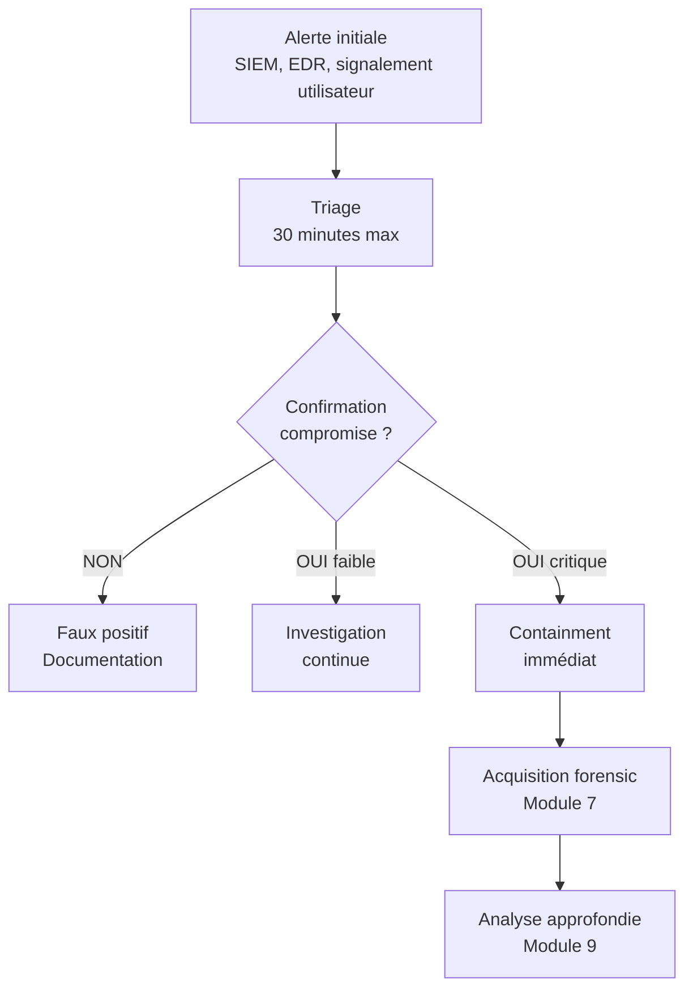

# 6.8 Énumération locale Windows - perspective triage

!!! quote "L'analogie du médecin urgentiste qui examine un patient inconscient"

    Un urgentiste qui reçoit un patient inconscient ne fait pas tous les examens possibles d'emblée. Il suit un protocole de triage rapide : voies aériennes, respiration, circulation, état de conscience, exposition. En quinze minutes, il sait si la situation est critique ou stable, où concentrer ses moyens, qui appeler. C'est le ABCDE du SAMU. Pour un poste Windows suspecté compromis, vous appliquez le même triage. Quinze minutes ne suffisent pas pour faire un dump mémoire complet et une analyse forensic exhaustive. Mais ces quinze minutes vous permettent de répondre à la question critique : la machine est-elle compromise, et de quel niveau de gravité parle-t-on. Ce chapitre est votre ABCDE Windows.

## Métadonnées du chapitre

Ce chapitre clôt le module 6 par la perspective défensive sur ce qui vient d'être fait offensivement. Voici ses caractéristiques.

| Champ | Valeur |
|---|---|
| Durée estimée | 5 heures |
| Niveau | Pratique défensive |
| Prérequis | 6.1 à 6.7 vus, Windows internals basiques |
| Livrables | Procédure de triage Windows, scripts d'inspection |
| Auto-explication | 18 minutes |

## Objectifs pédagogiques

À l'issue de ce chapitre, vous serez capable de :

- Mener un triage Windows en 30 minutes
- Identifier les indicateurs de compromission usuels
- Lire les journaux Windows pertinents
- Détecter persistence, beacon, pivots
- Décider de la conduite à tenir (containment vs investigation)
- Préparer le dossier pour module 7 (acquisition mémoire)

---

## 1. Logique du triage post-incident

### 1.1 Position du triage dans la chaîne incident

Le triage est la **première phase opérationnelle** après l'alerte. Voici la chronologie type d'un incident.



### 1.2 Différence triage vs forensic complet

Voici la distinction nette à intégrer.

| Aspect | Triage (ce chapitre) | Forensic complet (modules 7-9) |
|---|---|---|
| Durée | 30 minutes | Heures à jours |
| Niveau | Live response | Acquisition + analyse offline |
| Outils | Scripts standards | Volatility, Autopsy |
| Modification système | Minimisée | Aucune (image disque/RAM) |
| Décision | Confirmer/infirmer | Reconstruire l'incident |
| Objectif | Rapide oui/non | Comprendre toute la chaîne |

### 1.3 Méthode CASTLE pour triage Windows

Voici une méthodologie en six étapes.

| Lettre | Étape | Outil principal |
|---|---|---|
| C | Connexions réseau | netstat, Get-NetTCPConnection |
| A | Autoruns / persistence | Autoruns Sysinternals |
| S | Sessions actives | query user, logonsessions |
| T | Tâches planifiées | schtasks, Get-ScheduledTask |
| L | Logs critiques | Get-WinEvent, wevtutil |
| E | Exécutables suspects | tasklist, Get-Process |

Cette méthode est non standard mais pédagogique. Elle vous donne un cadre mnémonique.

## 2. Préparation du kit de triage

### 2.1 Outils essentiels

Voici les outils à embarquer sur une clé USB de triage.

| Outil | Source | Usage |
|---|---|---|
| Sysinternals Suite | sysinternals.com | Process Explorer, Autoruns, etc. |
| KAPE | kape.gerardparr.com | Triage automatisé |
| PowerShell 7 | github.com/PowerShell | Scripting moderne |
| Hayabusa | yamato-security/hayabusa | Sigma rules sur Event Logs |
| Velociraptor | velociraptor.app | Live forensic à grande échelle |
| GetZimmermanTools | ericzimmerman.github.io | EvtxECmd, MFTECmd, etc. |
| osquery | osquery.io | SQL sur état système |
| Wireshark portable | wireshark.org | Capture trafic ad hoc |

### 2.2 Préparation de la clé USB

Voici la structure type d'une clé USB de triage.

```text
USB-TRIAGE/
├── 01-Sysinternals/
│   ├── ProcessExplorer.exe
│   ├── Autoruns.exe
│   ├── Procmon.exe
│   ├── Tcpview.exe
│   └── ...
├── 02-PowerShell-Scripts/
│   ├── triage-quick.ps1
│   ├── collect-iocs.ps1
│   └── dump-eventlogs.ps1
├── 03-KAPE/
│   ├── kape.exe
│   ├── Targets/
│   └── Modules/
├── 04-Hayabusa/
│   └── hayabusa.exe
├── 05-Zimmerman/
│   ├── EvtxECmd.exe
│   ├── MFTECmd.exe
│   └── ...
├── 06-Network/
│   ├── Wireshark-Portable/
│   └── tcpdump-win.exe
└── README.md (procédure)
```

### 2.3 Hash de la clé USB

Avant chaque mission, hashez le contenu de la clé pour traçabilité.

```powershell
# Hash de tous les outils
Get-ChildItem -Path E:\ -Recurse -File | 
    Get-FileHash -Algorithm SHA256 | 
    Export-Csv -Path manifest.csv -NoTypeInformation
```

## 3. Étape C - Connexions réseau

### 3.1 État TCP actif

Les connexions TCP révèlent les **beacons C2** et les pivots actifs.

```powershell
# PowerShell moderne
Get-NetTCPConnection -State Established | 
    Select-Object LocalAddress,LocalPort,RemoteAddress,RemotePort,@{N='Process';E={(Get-Process -Id $_.OwningProcess -ErrorAction SilentlyContinue).Name}} | 
    Format-Table -AutoSize

# CMD legacy
netstat -anob

# Filtrer par port (-anob nécessite admin)
netstat -anob | findstr ":443"
```

### 3.2 Indicateurs suspects

Voici les patterns à reconnaître.

| Indicateur | Suspicion |
|---|---|
| Connexion vers IP rare/étrange | Élevée |
| Port 443 vers IP non corporate | Beacon HTTPS probable |
| Port 4444, 8080, 8443 | Ports C2 communs |
| Process SVCHOST avec connexion sortante non standard | Critique |
| Process inhabituel avec connexion outbound | Élevée |
| Plusieurs connexions vers la même IP | Beaconing |
| Connexion DNS sortante depuis user | DNS exfil possible |

### 3.3 Vérification réputation IP

Pour chaque IP suspecte identifiée, vérifiez la réputation.

```powershell
# Lookup whois et reverse DNS
nslookup 1.2.3.4

# Via API VirusTotal (si vt-cli installé)
vt ip 1.2.3.4

# Ou en ligne :
# https://www.abuseipdb.com/check/1.2.3.4
# https://www.virustotal.com/gui/ip-address/1.2.3.4
```

### 3.4 Capture trafic ciblé

Pour analyse approfondie, capturez le trafic 5 minutes.

```powershell
# Avec netsh (Windows natif)
netsh trace start capture=yes tracefile=C:\triage\trace.etl

# Attendre 5 minutes

netsh trace stop

# Conversion en PCAP avec etl2pcapng
# (https://github.com/microsoft/etl2pcapng)
etl2pcapng.exe trace.etl trace.pcapng
```

## 4. Étape A - Autoruns et persistence

### 4.1 Autoruns Sysinternals

**Autoruns** liste tous les points de persistence Windows.

```powershell
# Lancement Autoruns avec sortie CSV
.\Autoruns64.exe -a * -h -nobanner -accepteula -c > autoruns.csv

# Options :
#   -a *      : tous les types
#   -h        : avec hashes
#   -c        : format CSV
#   -nobanner : pas de bannière
```

### 4.2 Catégories à examiner

Autoruns couvre de nombreux points de persistence. Voici les catégories prioritaires.

| Catégorie | Localisation | Risque |
|---|---|---|
| Logon | Registre Run, RunOnce | Très élevé |
| Scheduled Tasks | Task Scheduler | Très élevé |
| Services | Services Windows | Élevé |
| Drivers | Drivers chargés | Moyen |
| Office | Plugins Office, COM | Élevé |
| Boot Execute | Boot startup | Critique |
| Image Hijacks | Debugger, IFEO | Critique |
| AppInit DLLs | DLLs chargées partout | Critique |
| WMI | WMI subscriptions | Élevé |

### 4.3 Indicateurs Autoruns suspects

Voici les patterns suspects.

| Pattern | Suspicion |
|---|---|
| Entrée Run dans HKCU\Software\... récente | Élevée |
| Tâche planifiée non Microsoft, exécution toutes les N minutes | Très élevée |
| Service avec exécutable dans %TEMP% ou %APPDATA% | Critique |
| Service avec ImagePath en chemin court (8.3) | Critique |
| AppInit DLL sans signature | Critique |
| WMI subscription consommant un événement de logon | Critique |

### 4.4 Cas pratique - persistance via Run

Voici un exemple typique à détecter.

```powershell
# Lecture du registre HKCU\Software\Microsoft\Windows\CurrentVersion\Run
Get-ItemProperty -Path "HKCU:\Software\Microsoft\Windows\CurrentVersion\Run"

# Sortie suspecte type
# OneDriveSetup : "C:\Users\Sophie\AppData\Local\Microsoft\OneDrive\OneDriveSetup.exe"
# ms-update    : "C:\Users\Sophie\AppData\Roaming\Microsoft\update.exe"
#                     ↑ SUSPECT : nom Microsoft mais en %APPDATA%

# Vérification de l'exécutable
Get-FileHash "C:\Users\Sophie\AppData\Roaming\Microsoft\update.exe" -Algorithm SHA256
# Soumettre le hash sur VirusTotal
```

### 4.5 Tâches planifiées suspectes

```powershell
# Liste des tâches planifiées non-Microsoft
Get-ScheduledTask | Where-Object {
    $_.Author -notmatch "Microsoft" -and 
    $_.State -ne "Disabled"
} | Select-Object TaskName, TaskPath, Author, @{
    N='LastRunTime';
    E={(Get-ScheduledTaskInfo $_).LastRunTime}
}, @{
    N='Action';
    E={$_.Actions.Execute}
}

# Patterns suspects :
#   - Author vide ou random
#   - Action vers %TEMP% ou %APPDATA%
#   - Trigger toutes les 5-15 minutes (beacon)
#   - LastRunTime très récent
```

## 5. Étape S - Sessions actives

### 5.1 Liste des sessions

Les sessions actives révèlent qui est connecté actuellement.

```powershell
# Sessions interactives
query user

# Sortie typique
# USERNAME              SESSIONNAME    ID  STATE   IDLE TIME   LOGON TIME
# >sophie               console        1   Active  none        2026-04-30 09:12
# admin                                2   Disc    1+02:00     2026-04-29 17:45
#                                          ↑ session admin déconnectée mais pas fermée

# Indicateur : session admin déconnectée = potentiel canal RDP fantôme
```

### 5.2 Sessions et ouvertures historiques

```powershell
# Logon sessions détaillées (Sysinternals)
.\logonsessions.exe -p

# Liste les sessions avec processus rattachés
# Permet de voir une session admin avec processus suspect
```

### 5.3 Connexions partages SMB sortantes

Les partages SMB ouverts par le poste vers d'autres machines sont suspects (lateral movement).

```powershell
# Connexions SMB sortantes
Get-SmbConnection

# Sortie typique
# ServerName  ShareName  UserName       Credential  ...
# DEBIAN-SRV  C$         ARTECH\sophie  ARTECH\sophie

# Si Sophie n'a pas légitimement besoin du C$ du serveur,
# c'est un indicateur d'utilisation post-compromission
```

### 5.4 Comptes locaux et groupes

```powershell
# Utilisateurs locaux
Get-LocalUser | Format-Table Name, Enabled, LastLogon, Description

# Membres du groupe Administrateurs
Get-LocalGroupMember -Group "Administrateurs"

# Patterns suspects :
#   - Compte créé récemment (LastLogon récent ET création récente)
#   - Compte "support", "helpdesk" non documenté
#   - Compte avec UID élevé inattendu
#   - Membre Administrateurs non documenté
```

## 6. Étape T - Tâches planifiées et services

### 6.1 Services en cours

```powershell
# Tous services Running
Get-Service | Where-Object {$_.Status -eq "Running"} | 
    Select-Object Name, DisplayName, StartType

# Services avec ImagePath suspect
Get-CimInstance -ClassName Win32_Service | 
    Where-Object {
        $_.PathName -match "AppData|Temp|Users\\Public" -or
        $_.PathName -notmatch "^[A-Z]:\\Windows|^[A-Z]:\\Program"
    } | 
    Select-Object Name, PathName, StartMode, State
```

### 6.2 Tâches planifiées

```powershell
# Toutes tâches en cours d'exécution
Get-ScheduledTask | Where-Object {$_.State -eq "Ready"} | 
    Select-Object TaskName, TaskPath, @{
        N='Trigger';E={$_.Triggers.Repetition.Interval}
    }, @{
        N='Action';E={$_.Actions.Execute}
    }
```

### 6.3 Indicateurs de beaconing

Un beacon C2 typique se manifeste par une tâche planifiée à intervalle régulier.

```text
PATTERN BEACON TYPIQUE
========================

Trigger : toutes les 5-15 minutes
Action  : exécutable dans %APPDATA% ou %TEMP%
Author  : vide ou random
Hidden  : True (cachée de l'UI standard)
```

## 7. Étape L - Logs Windows critiques

### 7.1 Logs Event Viewer importants

Voici les logs prioritaires à examiner.

| Log | Contenu | Event IDs critiques |
|---|---|---|
| Security | Authentification, audit | 4624, 4625, 4672, 4720, 4732 |
| System | Services, crash | 7034, 7035, 7036 |
| Application | Erreurs apps | Variable |
| PowerShell/Operational | Commandes PS | 4103, 4104 |
| TaskScheduler/Operational | Tâches planifiées | 200, 201 |
| WMI-Activity/Operational | WMI events | Variable |
| RemoteDesktopServices-LSM | RDP | Variable |
| Sysmon | Détaillé (si installé) | 1, 3, 7, 11, 13, 22 |

### 7.2 Event IDs critiques

Voici les event IDs à connaître.

| ID | Description | Pertinence |
|---|---|---|
| 4624 | Logon réussi | Type 3 = réseau, 10 = RDP |
| 4625 | Logon échoué | Brute force détection |
| 4672 | Privilèges spéciaux assignés | Élévation détectée |
| 4688 | Création de processus | Tracking complet (si activé) |
| 4720 | Création compte utilisateur | Backdoor user |
| 4732 | Ajout au groupe local | Privilege escalation |
| 4768 | Demande TGT Kerberos | AD compromise |
| 4769 | Demande TGS Kerberos | Lateral movement |
| 7045 | Service installé | Persistence service |
| 4103 | Module PowerShell loaded | Suspicion PS |
| 4104 | Script block PowerShell | Détection scripts (si activé) |

### 7.3 Recherche d'événements

```powershell
# Logons réussis dernières 24h
Get-WinEvent -FilterHashtable @{
    LogName='Security'
    Id=4624
    StartTime=(Get-Date).AddHours(-24)
} | Select-Object TimeCreated, @{
    N='LogonType';E={$_.Properties[8].Value}
}, @{
    N='Account';E={$_.Properties[5].Value}
}, @{
    N='Source';E={$_.Properties[18].Value}
}

# Création de processus dernières 6h (si Audit activé)
Get-WinEvent -FilterHashtable @{
    LogName='Security'
    Id=4688
    StartTime=(Get-Date).AddHours(-6)
} | Select-Object TimeCreated, @{
    N='Process';E={$_.Properties[5].Value}
}, @{
    N='Parent';E={$_.Properties[13].Value}
}, @{
    N='User';E={$_.Properties[1].Value}
}

# PowerShell dernières 6h
Get-WinEvent -FilterHashtable @{
    LogName='Microsoft-Windows-PowerShell/Operational'
    Id=4104
    StartTime=(Get-Date).AddHours(-6)
} | Format-List
```

### 7.4 Hayabusa pour analyse rapide

**Hayabusa** applique automatiquement des règles Sigma sur les event logs.

```powershell
# Lancement Hayabusa
.\hayabusa.exe csv-timeline `
    --directory C:\Windows\System32\winevt\Logs `
    --output triage-timeline.csv `
    --enable-deprecated-rules `
    --no-color

# Le rapport CSV liste tous les événements suspects
# avec sévérité, technique MITRE, recommandation

# Filtrage par sévérité
Import-Csv triage-timeline.csv | 
    Where-Object {$_.Level -eq "high" -or $_.Level -eq "critical"} | 
    Format-Table Timestamp, Level, RuleTitle
```

## 8. Étape E - Exécutables et processus

### 8.1 Liste de processus

```powershell
# Avec PowerShell
Get-Process | Select-Object Name, Id, Path, @{
    N='Hash';E={(Get-FileHash $_.Path -Algorithm SHA256 -ErrorAction SilentlyContinue).Hash}
}, @{
    N='Signed';E={(Get-AuthenticodeSignature $_.Path -ErrorAction SilentlyContinue).Status}
} | Sort-Object Name

# Tasklist legacy
tasklist /v /fi "STATUS eq RUNNING"
```

### 8.2 Processus Explorer Sysinternals

Process Explorer offre une vue arborescente avec multiples informations.

```powershell
# Lancement
.\procexp64.exe

# Colonnes utiles à activer :
#   - Image Path
#   - Command Line
#   - Verified Signer
#   - VirusTotal score (avec connexion VT)
#   - Network usage
```

### 8.3 Indicateurs processus suspects

| Indicateur | Suspicion |
|---|---|
| Processus sans signature numérique | Élevée |
| Processus dans %TEMP%, %APPDATA% | Très élevée |
| Processus svchost.exe sans parent services.exe | Critique |
| Processus enfant de Word/Excel/PowerPoint | Très élevée (macro VBA) |
| PowerShell ou cmd lancé par Office | Très élevée |
| rundll32 / regsvr32 avec arguments réseau | Critique |
| explorer.exe avec connexions réseau | Critique |

### 8.4 Pattern macro Office malveillante

Voici le pattern typique d'une macro malveillante en cours d'exécution.

```text
PARENT-CHILD INDICATIF
========================

WINWORD.EXE
└── powershell.exe (-NoP -W Hidden -Enc ...)
    └── cmd.exe /c ...
        └── stager.exe (dans %APPDATA%)

L'arbre de processus seul est un IOC de très haute confiance.
Get-Process | Where-Object Parent indique facilement.
```

```powershell
# Détection de PowerShell/cmd enfant d'Office
Get-CimInstance Win32_Process | 
    Where-Object {
        $parent = (Get-CimInstance Win32_Process | Where-Object ProcessId -eq $_.ParentProcessId)
        $parent.Name -match "WINWORD|EXCEL|POWERPNT|OUTLOOK" -and
        $_.Name -match "powershell|cmd|wscript|cscript|mshta|rundll32"
    } | 
    Select-Object Name, ProcessId, ParentProcessId, CommandLine
```

## 9. Indicateurs de compromission complémentaires

### 9.1 Modifications récentes du système

```powershell
# Fichiers modifiés dans les dernières 24h dans System32
Get-ChildItem C:\Windows\System32 -Recurse -ErrorAction SilentlyContinue | 
    Where-Object {$_.LastWriteTime -gt (Get-Date).AddHours(-24)} | 
    Select-Object FullName, LastWriteTime

# Fichiers récents dans dossiers à risque
$riskyPaths = @(
    "$env:APPDATA",
    "$env:LOCALAPPDATA\Temp",
    "C:\Users\Public",
    "C:\Windows\Temp",
    "C:\ProgramData"
)

foreach ($path in $riskyPaths) {
    Get-ChildItem $path -Recurse -ErrorAction SilentlyContinue | 
        Where-Object {
            $_.Extension -in '.exe', '.dll', '.ps1', '.bat', '.vbs', '.js', '.hta' -and
            $_.LastWriteTime -gt (Get-Date).AddDays(-7)
        } | 
        Select-Object FullName, LastWriteTime, Length
}
```

### 9.2 Hosts file modifié

```powershell
# Vérification hosts file
Get-Content C:\Windows\System32\drivers\etc\hosts

# Hash pour comparaison
Get-FileHash C:\Windows\System32\drivers\etc\hosts -Algorithm SHA256

# Doit normalement contenir :
# # Copyright (c) 1993-2009 Microsoft Corp.
# Et essentiellement des commentaires.

# Indicateur si présence de :
#   - Domaines bancaires redirigés
#   - Domaines de mise à jour AV redirigés
#   - Domaines Microsoft redirigés
```

### 9.3 Modifications DNS

```powershell
# Configuration DNS du système
Get-DnsClientServerAddress

# Comparaison avec valeurs attendues (DHCP, AD)
# Modification = potentielle attaque MITM
```

### 9.4 Proxy modifié

```powershell
# Proxy système
Get-ItemProperty -Path "HKCU:\Software\Microsoft\Windows\CurrentVersion\Internet Settings" |
    Select-Object ProxyEnable, ProxyServer

# Si ProxyEnable=1 et ProxyServer non corporate :
#   - Possible MITM
#   - Possible exfiltration via proxy malveillant
```

## 10. Script de triage automatisé

Voici un script PowerShell consolidant les vérifications principales.

### 10.1 Script complet

```powershell
<#
triage-quick.ps1 - Triage Windows post-incident
Usage : .\triage-quick.ps1 -OutputDir C:\triage\$(hostname)-$(Get-Date -Format yyyyMMdd-HHmmss)
#>

param(
    [string]$OutputDir = "C:\triage\$(hostname)-$(Get-Date -Format yyyyMMdd-HHmmss)"
)

# Création dossier sortie
New-Item -Path $OutputDir -ItemType Directory -Force | Out-Null
Set-Location $OutputDir

Write-Host "[*] Triage en cours - Sortie : $OutputDir" -ForegroundColor Cyan

# Identité système
"=== SYSTÈME ===" | Out-File system-info.txt
hostname | Out-File system-info.txt -Append
whoami | Out-File system-info.txt -Append
systeminfo | Out-File system-info.txt -Append

# C - Connexions réseau
Write-Host "[*] C - Connexions réseau" -ForegroundColor Yellow
Get-NetTCPConnection -State Established -ErrorAction SilentlyContinue | 
    Select-Object LocalAddress,LocalPort,RemoteAddress,RemotePort,@{N='Process';E={(Get-Process -Id $_.OwningProcess -ErrorAction SilentlyContinue).Name}} | 
    Export-Csv tcp-connections.csv -NoTypeInformation

# A - Autoruns persistence
Write-Host "[*] A - Persistence (Run keys)" -ForegroundColor Yellow
Get-ItemProperty -Path "HKLM:\Software\Microsoft\Windows\CurrentVersion\Run" -ErrorAction SilentlyContinue | 
    Out-File autoruns-hklm-run.txt
Get-ItemProperty -Path "HKCU:\Software\Microsoft\Windows\CurrentVersion\Run" -ErrorAction SilentlyContinue | 
    Out-File autoruns-hkcu-run.txt

Get-ScheduledTask | Where-Object {$_.Author -notmatch "Microsoft" -and $_.State -ne "Disabled"} | 
    Select-Object TaskName, TaskPath, Author, @{N='Action';E={$_.Actions.Execute}} |
    Export-Csv scheduled-tasks-non-ms.csv -NoTypeInformation

# S - Sessions
Write-Host "[*] S - Sessions actives" -ForegroundColor Yellow
query user 2>&1 | Out-File user-sessions.txt
Get-LocalUser | Format-Table -AutoSize | Out-File local-users.txt
Get-LocalGroupMember -Group "Administrateurs" -ErrorAction SilentlyContinue | 
    Out-File admin-group-members.txt

# T - Services suspects
Write-Host "[*] T - Services suspects" -ForegroundColor Yellow
Get-CimInstance -ClassName Win32_Service | 
    Where-Object {$_.PathName -match "AppData|Temp|Users\\Public"} | 
    Select-Object Name, PathName, StartMode, State |
    Export-Csv services-suspects.csv -NoTypeInformation

# L - Logs Windows (export)
Write-Host "[*] L - Export logs Windows critiques" -ForegroundColor Yellow
$logsToExport = @('Security', 'System', 'Application', 
                  'Microsoft-Windows-PowerShell/Operational',
                  'Microsoft-Windows-TaskScheduler/Operational')
foreach ($log in $logsToExport) {
    $safeName = $log -replace '[/\\]', '_'
    wevtutil epl $log "$OutputDir\evtx-$safeName.evtx" 2>&1 | Out-Null
}

# E - Processus
Write-Host "[*] E - Processus en cours" -ForegroundColor Yellow
Get-Process | Select-Object Name, Id, Path, StartTime | 
    Export-Csv processes.csv -NoTypeInformation

# Processus enfants d'Office (très indicatif)
Get-CimInstance Win32_Process | 
    Where-Object {
        $parent = Get-CimInstance Win32_Process -Filter "ProcessId=$($_.ParentProcessId)" -ErrorAction SilentlyContinue
        $parent.Name -match "WINWORD|EXCEL|POWERPNT|OUTLOOK"
    } | 
    Select-Object Name, ProcessId, ParentProcessId, CommandLine |
    Export-Csv office-children.csv -NoTypeInformation

# IOC supplémentaires
Write-Host "[*] Indicateurs supplémentaires" -ForegroundColor Yellow
Get-Content C:\Windows\System32\drivers\etc\hosts | Out-File hosts.txt
Get-DnsClientServerAddress | Out-File dns-config.txt
Get-ItemProperty -Path "HKCU:\Software\Microsoft\Windows\CurrentVersion\Internet Settings" -ErrorAction SilentlyContinue | 
    Select-Object ProxyEnable, ProxyServer | Out-File proxy.txt

# Hash final
Write-Host "[*] Calcul hashes" -ForegroundColor Yellow
Get-ChildItem -Recurse -File | Get-FileHash -Algorithm SHA256 | 
    Export-Csv MANIFEST.csv -NoTypeInformation

Write-Host "[+] Triage terminé : $OutputDir" -ForegroundColor Green
```

### 10.2 Utilisation

```powershell
# Lancement
.\triage-quick.ps1

# Ou avec dossier custom
.\triage-quick.ps1 -OutputDir D:\triage\poste-sophie-$(Get-Date -Format yyyyMMdd)
```

## 11. Décision post-triage

### 11.1 Matrice de décision

À l'issue du triage, vous décidez de la conduite à tenir.

| Situation | Décision |
|---|---|
| Aucun IOC trouvé | Faux positif documenté |
| 1 IOC modéré (ex. tâche planifiée non standard) | Investigation continue |
| 2-3 IOC concordants | Containment puis acquisition |
| Beacon C2 actif confirmé | Containment immédiat |
| Lateral movement détecté | Containment + escalade |
| Ransomware en cours | Containment immédiat + notification ANSSI |

### 11.2 Containment

Si la décision est de contenir, voici les options.

| Action | Effet |
|---|---|
| Déconnecter du réseau (câble) | Stoppe communication C2 |
| Bloquer compte utilisateur | Stoppe lateral movement |
| Isoler via firewall (EDR) | Conserve preuve sans coupure brutale |
| Garder allumé | Préserve mémoire pour acquisition |
| Documenter avant action | Captures, photos, log |

```text
RÈGLE D'OR DU CONTAINMENT
============================

PRÉSERVER LA MÉMOIRE :
  Ne jamais éteindre brutalement
  Isoler sans rebooter
  Acquisition mémoire AVANT toute autre action
  
EXCEPTION :
  Ransomware actif en cours de chiffrement
  → arrêt brutal pour stopper la propagation
  → impact forensic accepté
```

### 11.3 Notification

En entreprise, la notification suit une procédure type.

| Niveau | Notification |
|---|---|
| Détection initiale | DSI, RSSI |
| Confirmation compromise | Direction, DPO si data |
| Ransomware ou data breach | ANSSI (cybermalveillance.gouv.fr), CNIL (RGPD), assurance |
| Si APT suspectée | ANSSI directe (CERT-FR) |

## 12. Préparation au module 7

Le triage produit le **dossier d'entrée** pour l'acquisition forensic du module 7.

### 12.1 Dossier de prépration

Voici le contenu type à transmettre au module 7.

```text
DOSSIER PRÉPARATOIRE ACQUISITION
====================================

CONTEXTE
  - Hostname compromise
  - Date/heure découverte
  - Vecteur initial supposé (phishing, etc.)
  - Niveau d'urgence

ÉTAT MACHINE
  - Allumée / éteinte
  - Connectée réseau / isolée
  - User session active / verrouillée
  
IOC TRIAGE (annexes)
  - Triage CSV/JSON
  - Hash artefacts collectés
  - Captures écran horodatées

DÉCISIONS PRISES
  - Containment appliqué (oui/non, comment)
  - Compte utilisateur (verrouillé / actif)
  - Communication user (informé ou non)
  
PROCHAINES ÉTAPES
  - Acquisition mémoire (module 7)
  - Acquisition disque (module 8)
  - Analyse Volatility (module 9)
```

### 12.2 Manifest signé

Le manifest hashé du triage est transmis avec signature.

```powershell
# Création manifest signé
Get-ChildItem -Recurse -File | Get-FileHash -Algorithm SHA256 | 
    Export-Csv MANIFEST.csv -NoTypeInformation

# Signature avec gpg sur Linux après transfert
# Ou avec sigstore sur Windows
```

## 13. Auto-évaluation

Vérifiez votre maîtrise par les questions suivantes.

| # | Question | Réponse |
|---|---|---|
| 1 | Méthode mnémonique de triage ? | CASTLE |
| 2 | Outil pour persistence Windows ? | Autoruns Sysinternals |
| 3 | Event ID logon réussi ? | 4624 |
| 4 | Event ID logon échoué ? | 4625 |
| 5 | Outil règles Sigma sur EVTX ? | Hayabusa |
| 6 | IOC processus enfant d'Office ? | PowerShell, cmd, wscript, etc. |
| 7 | Règle d'or du containment ? | Préserver la mémoire |
| 8 | Quoi faire avant acquisition ? | Triage et documentation |

## 14. Synthèse du module 6

Au terme du module 6, voici ce que vous avez acquis.

```text
MODULE 6 - SYNTHÈSE GLOBALE

ACQUIS THÉORIQUES
  Anatomie d'un phishing en 5 couches
  Protocoles SPF/DKIM/DMARC
  Biais cognitifs exploités
  Méthode CASTLE de triage

ACQUIS PRATIQUES (Claude)
  Analyse défensive de phishings publics (6.1)
  Déploiement Postfix lab complet (6.2)
  Triage Windows post-incident (6.8)

ACQUIS PRATIQUES (Antigravity)
  Création document piégé (6.3)
  Encodage payload (6.4)
  Sliver C2 (6.5)
  Beacon (6.6)
  Opération phishing (6.7)

OUTILS MAÎTRISÉS (côté défense)
  olevba pour analyse macros
  Postfix, OpenDKIM, OpenDMARC
  Sysinternals Suite (Autoruns, ProcExp)
  Hayabusa pour Sigma
  PowerShell pour triage
  KAPE pour automatisation

LIVRABLES
  Analyse phishings publics
  Lab Postfix opérationnel
  Procédure triage Windows
  Scripts PowerShell
  Document piégé (Antigravity)
  C2 Sliver opérationnel (Antigravity)

PRÉPARATION MODULE 7
  Triage post-compromise réalisé
  Décision containment prise
  Dossier préparé pour acquisition mémoire
  Hash et signature des artefacts

CADRE LÉGAL
  Phishing simulé : accord CSE+RH
  Lab strict pour entrainement
  Articles 313-1, 226-15, 323-1, 226-4-1
```

## 15. Synthèse

Voici les points clés du chapitre.

```text
TRIAGE WINDOWS POST-INCIDENT

POSITION DANS LA CHAÎNE
  Alerte → TRIAGE → Investigation → Acquisition → Analyse

DURÉE
  30 minutes maximum

MÉTHODE CASTLE
  C - Connexions réseau
  A - Autoruns / persistence
  S - Sessions actives
  T - Tâches planifiées
  L - Logs Windows
  E - Exécutables / processus

OUTILS CLÉS
  Sysinternals Suite
  KAPE
  Hayabusa
  PowerShell 7
  GetZimmermanTools
  osquery

EVENT IDs CRITIQUES
  4624 logon réussi
  4625 logon échoué
  4672 privilèges spéciaux
  4720 user créé
  4732 ajout groupe
  7045 service installé

IOC PRIORITAIRES
  Processus enfant d'Office
  Persistence en %APPDATA%
  Tâches planifiées toutes les N min
  Connexions réseau inhabituelles
  Modifications hosts/DNS/proxy

DÉCISION POST-TRIAGE
  0 IOC : faux positif
  1 IOC : investigation
  2+ IOC : containment + acquisition
  Ransomware : containment immédiat

RÈGLE D'OR
  Préserver la mémoire
  Ne pas rebooter
  Documenter avant action
```

---

**Chapitre précédent** : [6.7 Envoi de l'email et capture du beacon](6-7-envoi-email-beacon.md) (produit avec Antigravity)

**Module suivant** : [Module 7 - Acquisition mémoire Windows](../module-7-acquisition-memoire-windows/README.md)