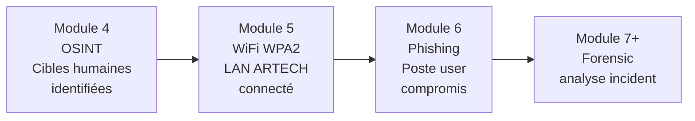
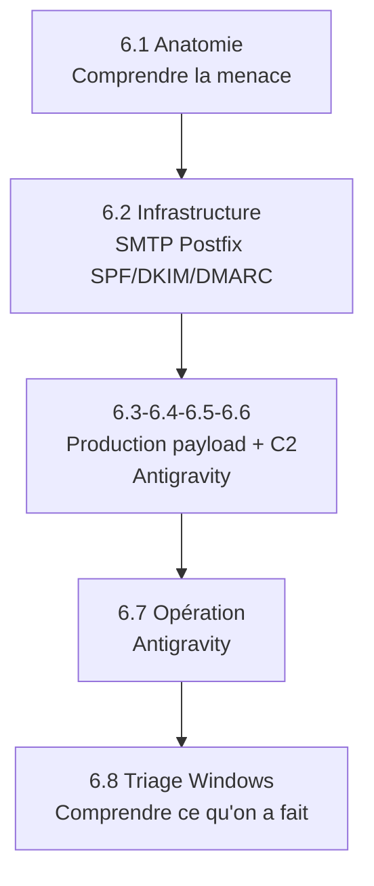

# VI - Phishing basique

!!! quote "L'analogie de la lettre piégée glissée sous la porte"

    Au Moyen Âge, un assaillant voulant prendre une cité fortifiée n'attaquait pas toujours frontalement les murailles. Il glissait parfois une lettre apparemment officielle sous la porte d'un garde clé. Cette lettre, signée d'une autorité crédible, demandait une ouverture exceptionnelle pour un convoi urgent. Si le garde y croyait, la cité tombait sans qu'aucune pierre ne soit déplacée. Le phishing reproduit exactement cette mécanique. Vous ne forcez pas le firewall, l'EDR ou l'antivirus. Vous demandez gentiment à Sophie ou Paul d'ouvrir la pièce jointe. Le 4-way handshake WPA2 du module 5 vous a donné les clés du périmètre extérieur. Le phishing du module 6 vous donne les clés des postes utilisateurs.

## Présentation du module

Troisième module du cycle 1. Vous combinez ingénierie sociale et infrastructure technique pour compromettre un poste utilisateur ARTECH depuis le LAN connecté au module 5. La méthodologie articule **compréhension du vecteur** (côté défense), **infrastructure** (admin sys), et **opération** (côté offensif).

### Pourquoi le phishing reste le vecteur n°1

Plusieurs facteurs maintiennent le phishing comme vecteur d'attaque dominant en 2026. Voici les principaux.

| Facteur | Explication |
|---|---|
| Cible humaine | Aucun patch ne corrige la psychologie |
| Coût d'attaque très faible | Quelques heures de préparation |
| Taux de succès élevé | 3-5 % en moyenne, 15-20 % ciblé |
| Vecteur multi-canal | Email, SMS, voix, QR code |
| Détection technique limitée | EDR voit le payload, pas la confiance accordée |
| Contournement périmètre | Le mail entre par la porte autorisée |

### Statistiques 2026

Voici les chiffres récents qui contextualisent l'enjeu.

| Statistique | Valeur 2025-2026 |
|---|---|
| Part des incidents commençant par phishing | ~70 % (rapport ANSSI 2025) |
| Coût moyen d'un incident phishing PME FR | 50-200 k€ |
| Temps moyen de détection phishing réussi | 18 jours |
| Taux de clic en phishing simulé non sensibilisé | 25-30 % |
| Taux de clic après formation continue | 5-8 % |

### Différence avec attaque physique

Le phishing diffère fondamentalement de l'attaque réseau classique vue au module 5.

| Aspect | Attaque réseau (module 5) | Phishing (module 6) |
|---|---|---|
| Cible | Routeur, services exposés | Humain |
| Exploitation | Faille cryptographique | Biais cognitif |
| Détection technique | Possible (IDS, log) | Très difficile sans contexte |
| Mitigation | Patch, configuration | Formation, détection comportementale |
| Persistence | Non native | Native (poste utilisateur) |

### Articulation avec le module 5

Le module 5 vous a donné l'accès au LAN ARTECH. Le module 6 part de cet accès pour cibler les utilisateurs identifiés.



### Objectifs pédagogiques

À l'issue de ce module, vous serez capable de :

- Reconnaître les composantes d'un phishing professionnel
- Configurer une infrastructure SMTP/Postfix avec SPF/DKIM/DMARC
- Construire une campagne de phishing ciblée avec payload
- Déployer un C2 (Command & Control) en lab
- Effectuer la reconnaissance locale post-compromission
- Documenter chaque étape forensiquement

### Prérequis stricts

Avant d'entamer ce module, certains acquis sont indispensables.

| Critère | Niveau attendu |
|---|---|
| Module 4 OSINT validé | 3 cibles privilégiées identifiées |
| Module 5 WiFi WPA2 validé | LAN ARTECH accessible |
| VBA / Macro Word basiques | Compréhension du modèle |
| Postfix bases | Lecture configuration mail |
| Windows internals basiques | Processus, persistence, registres |

### Structure du module

Voici le plan détaillé des 8 chapitres composant ce module, soit 25 heures de travail.

| # | Chapitre | Durée | Niveau | Producteur |
|---|---|---|---|---|
| 6.1 | Anatomie d'un email de phishing - analyse défensive | 3 h | Théorie/Analyse | Claude |
| 6.2 | Infrastructure SMTP - configuration Postfix avec SPF/DKIM/DMARC | 4 h | Pratique sysadmin | Claude |
| 6.3 | Création document Word piégé avec macro VBA | 3 h | Pratique offensive | Antigravity |
| 6.4 | Encodage du payload pour échapper aux scanners | 3 h | Pratique offensive | Antigravity |
| 6.5 | Sliver C2 installation et configuration | 3 h | Pratique offensive | Antigravity |
| 6.6 | Génération du beacon et test local | 2 h | Pratique offensive | Antigravity |
| 6.7 | Envoi de l'email et capture du beacon | 2 h | Pratique offensive | Antigravity |
| 6.8 | Énumération locale Windows - perspective triage | 5 h | Pratique défensive | Claude |

**Total : 25 heures** sur 3 semaines à 7-8 h/semaine.

### Note sur la production du module

Ce module a été produit selon une logique de **séparation des responsabilités**. Les chapitres 6.1, 6.2 et 6.8 ont été produits avec Claude en angle pédagogique défense. Les chapitres 6.3 à 6.7 ont été produits avec Antigravity selon la méthodologie offensive.

Cette séparation garantit que chaque outil opère dans le cadre où il est le plus pertinent.

## Cadre légal STRICT

Le phishing relève de plusieurs articles pénaux. Voici les références à connaître.

| Article | Infraction | Peine |
|---|---|---|
| 313-1 | Escroquerie (CEO fraud, faux fournisseur) | 5 ans / 375 000 € |
| 226-15 | Détournement de correspondances | 1 an / 45 000 € |
| 226-18 | Collecte déloyale de données personnelles | 5 ans / 300 000 € |
| 323-1 | Accès frauduleux STAD | 3 ans / 100 000 € |
| 323-3 | Modification frauduleuse données | 5 ans / 150 000 € |
| 226-4-1 | Usurpation d'identité numérique | 1 an / 15 000 € |

### Légalité dans le lab OmnyAcademy

Le phishing en lab est **légal** uniquement dans les conditions suivantes.

| Condition | Application |
|---|---|
| Cibles internes au lab (vous-même) | OK |
| Mandat écrit explicite avec liste cibles | OK |
| Sensibilisation interne (red team RH) | OK avec accord RH/CSE |
| Cible tierce sans autorisation | INTERDIT |

```text
DANGER PÉNAL TRÈS DIRECT

Envoyer un email de phishing à un tiers sans
autorisation, même "pour rire", même "pour tester
sa vigilance", est une infraction pénale relevant
de l'article 313-1 (escroquerie tentée) et 226-4-1
(usurpation d'identité).

Plusieurs condamnations en France 2020-2025.

Restez dans le LAB.
```

## Articulation pédagogique

Le module suit une progression claire.



## Ce que vous produirez

À l'issue du module, vous aurez les livrables suivants.

| Livrable | Format | Producteur |
|---|---|---|
| Analyse de 5 phishings publics | Markdown | Claude |
| Configuration Postfix avec SPF/DKIM/DMARC | Conf + doc | Claude |
| Document Word piégé | docx + macro | Antigravity |
| Payload Sliver | Binaire | Antigravity |
| Beacon test local | Confirmation C2 | Antigravity |
| Procédure triage Windows post-incident | Markdown + scripts | Claude |

## Démarrage

Pour commencer, rendez-vous dans le répertoire du module et ouvrez le premier chapitre.

```bash
cd ~/Documents/omnyacademy/02-cycle-1-premier-cas/module-6-phishing-basique/
cat 6-1-anatomie-phishing.md
```

---

**Module précédent** : [Module 5 - Attaque Wi-Fi WPA2](../module-5-attaque-wifi-wpa2/README.md)

**Module suivant** : [Module 7 - Acquisition mémoire Windows](../module-7-acquisition-memoire-windows/README.md)