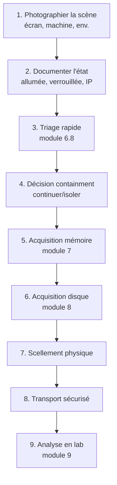

# 7.1 Théorie volatilité RFC 3227 et hiérarchie

!!! quote "L'analogie du sablier qui s'écoule"

    Imaginez un sablier dont chaque grain de sable est une information sur l'état d'un ordinateur. Tant que la machine est allumée, les grains tombent en continu. Une connexion réseau qui se ferme, un processus qui meurt, une variable d'environnement qui change, une clé de chiffrement qui est libérée. Vous arrivez avec votre appareil photo. Vous avez quelques minutes avant que le sablier ne soit vide. Photographier d'abord les grains qui sont tout en haut, ceux qui vont disparaître les premiers. Photographier ensuite ceux du milieu. Puis le sable au fond, plus stable. Si vous commencez par le bas, le haut sera vide quand vous y arriverez. Cette priorité d'acquisition par volatilité décroissante est codifiée dans la RFC 3227. Vous ne reverrez plus jamais un système comme avant cette acquisition. Faites-la dans le bon ordre.

## Métadonnées du chapitre

Ce chapitre est entièrement théorique. Il conditionne tous les chapitres suivants. Voici ses caractéristiques.

| Champ | Valeur |
|---|---|
| Durée estimée | 3 heures |
| Niveau | Théorique |
| Prérequis | Module 6.8 validé |
| Livrables | Schéma RFC 3227 mémorisé |
| Auto-explication | 12 minutes |

## Objectifs pédagogiques

À l'issue de ce chapitre, vous serez capable de :

- Citer et expliquer la RFC 3227
- Hiérarchiser les données par volatilité
- Comprendre le principe de Locard numérique
- Justifier l'ordre d'acquisition forensic
- Anticiper les contaminations involontaires
- Dialoguer avec un magistrat sur ces concepts

---

## 1. La RFC 3227

### 1.1 Présentation

La **RFC 3227** est le document fondateur du forensic numérique moderne. Voici ses caractéristiques.

| Aspect | Valeur |
|---|---|
| Titre complet | "Guidelines for Evidence Collection and Archiving" |
| Année de publication | Février 2002 |
| Auteurs | Dominique Brezinski, Tom Killalea |
| Statut | Best Current Practice (BCP 55) |
| Organisation | IETF |
| Pages | 11 |

Le document est court mais structurant. Il pose les bases de toute la pratique ultérieure.

### 1.2 Principes fondamentaux

Voici les principes posés par la RFC 3227.

| Principe | Application |
|---|---|
| Capturer une image aussi précise que possible | Forensic byte-level |
| Notes détaillées avec horodatage | Journal des actions |
| Minimiser les changements | Empreinte forensic minimale |
| Privilégier la preuve plutôt que l'analyse | Acquisition d'abord, analyse ensuite |
| Procédures vérifiables | Reproductibilité par tiers |
| Suivre les règles de preuve | Admissibilité juridique |

### 1.3 Texte clé

La RFC 3227 énonce explicitement la priorité d'acquisition.

```text
RFC 3227 SECTION 2.1
========================

"When collecting evidence you should proceed
from the volatile to the less volatile."

Traduction : "Lors de la collecte de preuves, vous
devriez procéder du volatile au moins volatile."

Ce principe est non négociable.
```

## 2. Hiérarchie de volatilité

### 2.1 Ordre standard RFC 3227

La RFC 3227 propose un ordre d'acquisition. Voici les éléments classés.

| Rang | Élément | Volatilité |
|---|---|---|
| 1 | Registres et caches CPU | Nanosecondes |
| 2 | Routing tables, ARP cache, kernel statistics | Secondes |
| 3 | Mémoire vive (RAM) | Jusqu'à arrêt machine |
| 4 | Fichiers temporaires | Variable |
| 5 | Disque dur | Persistant (si pas modifié) |
| 6 | Logs distants | Distants, dépendants tiers |
| 7 | Configuration physique, topologie | Très lente |
| 8 | Sauvegardes | Mois à années |

### 2.2 Adaptation moderne

L'ordre RFC 3227 est de 2002. Voici l'adaptation 2026.

| Rang | Élément | Outil typique |
|---|---|---|
| 1 | Cache CPU (irrécupérable en pratique) | Aucun |
| 2 | Mémoire vive complète | DumpIt, MRC, Belkasoft |
| 3 | Pagefile et swapfile | DumpIt option, FTK |
| 4 | Fichiers d'hibernation | Volatility plugin |
| 5 | Connexions réseau actives | netstat avant arrêt |
| 6 | Processus en cours | Process list avant arrêt |
| 7 | Tâches planifiées, services | Pendant triage |
| 8 | Disques (data + system) | dd, ewfacquire |
| 9 | Logs centralisés (SIEM) | API SIEM |
| 10 | Sauvegardes | Restauration ciblée |

### 2.3 Spécificités cloud / virtualisé

En 2026, beaucoup de systèmes sont **virtualisés** ou **cloud**. Voici les spécificités.

| Plateforme | Méthode acquisition |
|---|---|
| VM VMware / Hyper-V | Snapshot suspended (.vmem + .vmsn) |
| VM Proxmox / KVM | qemu-img convert + mémoire dump |
| AWS EC2 | EBS snapshot + custom memory dump (Volexity Surge) |
| Azure VM | Snapshot OS disk + memory.dmp |
| GCP Compute | Persistent disk snapshot + RAM dump |
| Container | Pas de mémoire propre (host) |
| Kubernetes pod | Idem (état stocké dans etcd) |

## 3. Principe de Locard numérique

### 3.1 Edmond Locard - principe historique

**Edmond Locard** (1877-1966), criminologue français de Lyon, formule en 1934 le principe d'échange.

```text
PRINCIPE DE LOCARD (1934)
==========================

"Tout contact laisse une trace"

Lorsqu'un individu entre en contact avec un objet
ou un autre individu, il y a transfert de matière
dans les deux sens.

Application criminelle classique :
  Empreintes, fibres textiles, ADN, cheveux

Application numérique moderne :
  Logs, registres, timestamps, processus, mémoire
```

### 3.2 Application au forensic numérique

En forensic numérique, le principe de Locard signifie que **chaque action laisse une trace**, **mais aussi** que **votre acquisition modifie le système**.

| Trace laissée par l'attaquant | Trace laissée par l'analyste |
|---|---|
| Persistance dans Run keys | Création processus DumpIt |
| Modifications systemic | Allocation mémoire pour le buffer |
| Connexions réseau | Lecture des fichiers /proc, registres |
| Timestamps modifiés | Modifications mineures de l'état |

### 3.3 Implication pour l'analyste

L'analyste doit **assumer** sa contamination et la **documenter**.

```text
DOCUMENTATION DE CONTAMINATION
=================================

L'analyse forensic n'est pas neutre.
Chaque action de l'analyste modifie le système.

Pratiques recommandées :
  1. Hash AVANT toute action
  2. Liste des outils utilisés (avec hash)
  3. Timestamp de chaque commande
  4. Documentation du PID processus analyste
  5. Quantification de la contamination

EXEMPLE
  L'utilisation de DumpIt va :
    - Allouer ~50 Mo de RAM
    - Modifier des handles système
    - Créer un fichier dans son dossier de sortie
  
  Ces modifications doivent être documentées
  dans le PV d'acquisition.
```

## 4. Empreinte forensic et minimisation

### 4.1 Notion d'empreinte forensic

L'**empreinte forensic** est la quantité de modification que votre intervention apporte au système.

| Niveau d'empreinte | Méthode |
|---|---|
| Maximale (à éviter) | Lancer Word, naviguer, ouvrir explorer |
| Élevée | Lancer programmes installeurs |
| Moyenne | Lancer outil portable depuis disque |
| Faible | Outil portable depuis USB read-only |
| Très faible | Lecture mémoire via PCIe direct |
| Nulle théorique | Aucune intervention |

### 4.2 Outils à empreinte minimale

Pour minimiser l'empreinte, voici les bonnes pratiques.

| Pratique | Bénéfice |
|---|---|
| Outils portables (pas d'installation) | Pas de modif registre, pas de service |
| USB read-only | Pas d'écriture sur la machine cible |
| Sortie sur USB séparé | Pas d'écriture sur disque interne |
| Pas de réseau pendant acquisition | Pas de download, pas d'update |
| Antivirus suspendu si compatible | Pas de scan parallèle |

### 4.3 Acquisition matérielle

Pour les cas critiques (haute sensibilité), il existe l'**acquisition matérielle** par cold boot ou DMA.

| Méthode | Description |
|---|---|
| Cold boot attack | Refroidir la RAM puis dumper après reboot |
| DMA via PCIe | Lecture directe via FireWire/Thunderbolt |
| DMA via FPGA (PCIe Leech) | Outil dédié type Inception |

Ces méthodes ne sont **pas applicables** dans la plupart des cas mais existent pour les cas extrêmes.

## 5. Standards complémentaires

### 5.1 ISO 27037 - identification et préservation

L'**ISO 27037:2012** précise les bonnes pratiques d'identification, collecte et préservation.

| Aspect | Application |
|---|---|
| Première intervention | Identification, sécurisation, documentation |
| Collecte | Suivre RFC 3227 + adaptation |
| Acquisition | Hash, double copie, scellement |
| Préservation | Chaîne de garde |
| Transport | Conditions environnementales |

### 5.2 ISO 27042 - analyse et interprétation

L'**ISO 27042:2015** complète sur l'analyse.

| Aspect | Application |
|---|---|
| Identification | Étendue de l'incident |
| Examen | Méthodes éprouvées |
| Analyse | Conclusions étayées |
| Reporting | Standards rédactionnels |

### 5.3 ENFSI guidelines

L'**ENFSI** (European Network of Forensic Science Institutes) publie des guidelines spécifiques.

| Document | Sujet |
|---|---|
| ENFSI-FIT-IT-001 | Best practice for IT |
| ENFSI-FIT-IT-002 | Forensic examination of digital evidence |
| ENFSI-FIT-IT-006 | Guidelines for evaluative reporting |

### 5.4 ANSSI - guides français

L'**ANSSI** publie plusieurs guides applicables.

| Guide | Sujet |
|---|---|
| Guide ANSSI : Réponse aux incidents | Méthodologie |
| Guide ANSSI : Acquisition forensic | Bonnes pratiques |
| Référentiel PASSI | Prestataires d'audit (qualification) |
| Cadre PRIS (Prestataires de Réponse à Incident de Sécurité) | Qualification incident |

## 6. Légal français - admissibilité de la preuve

### 6.1 Code de procédure pénale

Plusieurs articles du CPP encadrent la saisie informatique.

| Article | Contenu |
|---|---|
| Article 56 | Perquisition - règles générales |
| Article 57-1 | Saisie de données informatiques |
| Article 230-1 à 230-5 | Décryptage et expertise |
| Article 60 | Réquisition expert technique |
| Article 706-95-7 | Captation de données informatiques |

### 6.2 Critères d'admissibilité

Pour qu'une preuve numérique soit admissible, plusieurs critères doivent être réunis.

| Critère | Application |
|---|---|
| Légalité de l'acquisition | Mandat / autorisation valable |
| Authentique | Hash et chaîne de garde |
| Pertinent | Lien avec l'affaire |
| Reproductible | Méthodologie éprouvée |
| Compréhensible | Pour magistrat non technique |
| Loyal | Pas obtenue par fraude |

### 6.3 Risques de nullité

Voici les motifs fréquents de rejet d'une preuve.

| Motif | Exemple |
|---|---|
| Hash incohérent | Image modifiée entre saisie et analyse |
| Chaîne de garde rompue | Période sans signature responsable |
| Outil non éprouvé | Software auto-développé sans certification |
| Modification non documentée | Changement sans PV |
| Acquisition par méthode non standard | Process atypique non justifié |

## 7. Ordre d'acquisition pratique

Voici l'ordre concret à suivre dans une intervention type.

### 7.1 Workflow recommandé



### 7.2 Ce qu'on PERD si on ne respecte pas

Voici les conséquences pratiques d'un mauvais ordre.

| Action prématurée | Donnée perdue |
|---|---|
| Éteindre avant dump RAM | Mémoire vive complète |
| Reboot avant dump | Idem |
| Ouvrir des programmes | Modification empreinte mémoire |
| Mettre en veille | Hibernation modifie pagefile |
| Acquérir disque avant RAM | Modifications mineures du disque |

### 7.3 Ce qu'on GAGNE en respectant

À l'inverse, le respect strict procure plusieurs gains.

| Avantage | Bénéfice |
|---|---|
| Recevabilité juridique | Preuve admissible |
| Traçabilité analyste | Pas de doute |
| Reproductibilité | Magistrat peut faire vérifier |
| Forensic complet | Info volatile préservée |
| Crédibilité professionnelle | Image OmnyVia pro |

## 8. Cas d'écoles - bons et mauvais réflexes

Voici quelques scénarios pour ancrer les bons réflexes.

### 8.1 Scénario 1 - PC allumé et déverrouillé

**Situation** : PC trouvé allumé avec session ouverte, écran déverrouillé.

| Action | Bon ou mauvais |
|---|---|
| Photographier l'écran | BON - première étape |
| Faire un screenshot via PowerShell | BON si documenté |
| Ouvrir des programmes pour "voir" | MAUVAIS - empreinte |
| Verrouiller l'écran | MAUVAIS - peut chiffrer cache |
| Lancer DumpIt depuis USB | BON - acquisition mémoire |
| Débrancher le câble réseau | DÉPEND du contexte (voir 7.4) |

### 8.2 Scénario 2 - PC allumé et verrouillé

**Situation** : PC allumé mais écran verrouillé.

| Action | Bon ou mauvais |
|---|---|
| Photographier l'écran de verrouillage | BON |
| Tenter de deviner le mot de passe | MAUVAIS - logs forensic |
| Lancer DumpIt malgré verrouillage | BON si privilèges suffisants |
| Demander mot de passe à utilisateur | BON si possible |
| Reboot pour entrer en single user | MAUVAIS - perte mémoire |

### 8.3 Scénario 3 - PC éteint

**Situation** : PC trouvé éteint.

| Action | Bon ou mauvais |
|---|---|
| Allumer pour "voir" | MAUVAIS - boot modifie disque |
| Acquérir le disque sans démarrer | BON |
| Ouvrir le boîtier | BON pour identifier disques |
| Dumper la mémoire avec FireWire | OK si DMA possible |

## 9. Outils standards du marché

### 9.1 Outils d'acquisition mémoire

Voici les outils principaux. Détails dans les chapitres 7.6 à 7.9.

| Outil | Éditeur | Spécificité |
|---|---|---|
| DumpIt | Comae (Microsoft) | Simple, rapide, gratuit |
| Magnet RAM Capture | Magnet Forensics | Fiable, gratuit |
| FTK Imager Lite | Exterro | Multifonction (RAM + disque) |
| Belkasoft RAM Capturer | Belkasoft | Robuste, gratuit |
| Volexity Surge | Volexity | Cloud + on-premise, payant |
| WinPmem | Velocidex | Open source |

### 9.2 Outils de validation

Pour valider l'acquisition.

| Outil | Usage |
|---|---|
| sha256sum / certutil | Hash SHA-256 |
| openssl dgst | Hash et signature |
| volatility 3 | Test de lecture du dump |
| binwalk | Inspection binaire |

## 10. Acquisition vs analyse

### 10.1 Séparation des phases

Une règle essentielle : **séparer acquisition et analyse**.

| Phase | Sur quoi |
|---|---|
| Acquisition | Système original |
| Analyse | Copie de travail |

L'image originale est **lecture seule** une fois acquise. L'analyste travaille sur des copies.

### 10.2 Trois copies minimum

Voici les bonnes pratiques de duplication.

| Copie | Usage |
|---|---|
| Original (master) | Conservé en lieu sûr, scellé |
| Copie 1 (working) | Sur laquelle on travaille |
| Copie 2 (backup) | En cas de problème copie 1 |

Le hash garantit l'identité des trois.

## 11. Préparation du laboratoire

Pour pratiquer, votre lab doit comporter certains éléments.

### 11.1 Matériel forensic

Voici l'équipement minimum.

| Élément | Spécification |
|---|---|
| Clé USB acquisition | 64+ Go, vitesse élevée, étiquetée |
| Disque externe stockage | 1+ To, étiqueté "FORENSIC" |
| Ordinateur analyse | Isolé du réseau, désinfecté |
| Logiciels forensic | Volatility, Autopsy, FTK Imager |
| Étiquettes scellés | Auto-collantes inviolables |
| Carnet de bord papier | Journal des actions |
| Caméra | Photos de scène et scellement |

### 11.2 Protocoles d'environnement

Voici les protocoles à appliquer.

| Protocole | Application |
|---|---|
| Pas de réseau pendant acquisition | Air gap réel |
| Antivirus en exception | Pour les outils légitimes |
| Outils hashés au préalable | Vérification d'intégrité |
| Storage chiffré (LUKS) | Protection des dumps |
| Accès journalisé | Qui touche les preuves |

## 12. Cas pratique - préparation théorique ARTECH

### 12.1 Scénario

ARTECH vous appelle. Le poste de Sophie (compta) est suspecté compromis suite au triage du module 6.8.

### 12.2 Décisions préparatoires

Avant d'arriver sur place, voici les décisions à prendre.

```text
PRÉPARATION ARRIVÉE SUR SITE
================================

INFORMATION DE BASE À OBTENIR
  - Hostname et adresse IP
  - OS et version Windows
  - RAM installée (4 Go ? 16 Go ?)
  - Disque type (HDD, SSD, chiffré ?)
  - User actuellement loggé ?
  - Machine allumée / éteinte ?
  - Connexion réseau ?

KIT À EMBARQUER
  - Clé USB acquisition (64 Go vide)
  - Disque externe stockage (1 To, chiffré)
  - Laptop d'analyse
  - Carnet papier + stylo
  - Étiquettes scellés inviolables
  - Caméra ou téléphone (photos)
  - Lampe torche
  - Sachets antistatiques

PROCÉDURE DÉFINIE
  - Méthodologie écrite imprimée
  - Numéros de téléphone (DSI, RSSI)
  - Modèle de PV
  - Chaîne de garde modèle
```

### 12.3 Premier contact sur site

Voici le déroulé type une fois arrivé.

```text
ARRIVÉE SUR SITE
==================

T+0   Identification au DSI / RSSI
T+5   Présentation du mandat
T+10  Localisation du poste compromise
T+15  Photos de la scène
T+20  Description écrite de l'état
T+25  Décision containment vs acquisition
T+30  Lancement triage rapide (module 6.8)
T+60  Décision acquisition mémoire
T+65  Préparation USB acquisition
T+70  Lancement DumpIt
T+90  Validation hash
T+95  Scellement
T+120 Acquisition disque (module 8)
```

## 13. Auto-évaluation

Vérifiez votre maîtrise par les questions suivantes.

| # | Question | Réponse |
|---|---|---|
| 1 | Année de la RFC 3227 ? | 2002 |
| 2 | Auteurs RFC 3227 ? | Brezinski, Killalea |
| 3 | Principe de Locard ? | Tout contact laisse une trace |
| 4 | Norme ISO acquisition ? | ISO 27037 |
| 5 | Norme ISO analyse ? | ISO 27042 |
| 6 | Article CPP saisie données ? | 57-1 |
| 7 | Combien de copies minimum ? | 3 (original + working + backup) |
| 8 | Ordre RFC 3227 ? | Du volatile au moins volatile |

## 14. Synthèse

Voici les points clés à retenir.

```text
THÉORIE VOLATILITÉ - ESSENTIELS

RFC 3227
  Auteurs : Brezinski, Killalea, 2002
  Principe : volatile → moins volatile
  Statut : Best Current Practice (BCP 55)

HIÉRARCHIE VOLATILITÉ
  1. Caches CPU
  2. Mémoire vive
  3. Connexions réseau
  4. Processus
  5. Disque
  6. Sauvegardes

PRINCIPE DE LOCARD
  "Tout contact laisse une trace"
  Application numérique :
    Attaquant ET analyste laissent traces
  Conséquence : documenter sa contamination

EMPREINTE FORENSIC
  Minimiser les modifications
  Outils portables
  Pas d'installation
  Sortie sur USB séparé

STANDARDS
  RFC 3227 : ordre acquisition
  ISO 27037 : identification, collecte
  ISO 27042 : analyse, interprétation
  ENFSI : guidelines européennes
  ANSSI : guides français

LÉGAL FRANCE
  CPP article 57-1 : saisie données
  CPP article 60 : réquisition expert
  Critères : authentique, reproductible, légal

OUTILS PRINCIPAUX
  DumpIt (Comae)
  Magnet RAM Capture
  FTK Imager Lite
  Belkasoft RAM Capturer
  Volexity Surge

RÈGLES D'OR
  Acquisition AVANT analyse
  3 copies minimum
  Hash systématique
  Chaîne de garde
  Documentation continue
```

---

**Chapitre suivant** : [7.2 Décision allumer ou éteindre selon contexte](7-2-decision-allumer-eteindre.md)