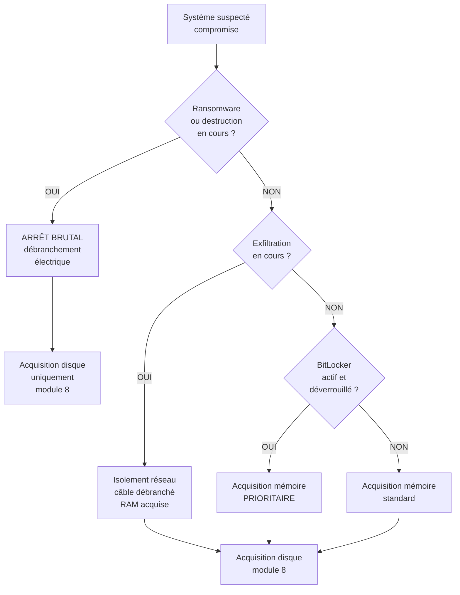

# 7.2 Décision allumer ou éteindre selon contexte

!!! quote "L'analogie du chirurgien face à l'hémorragie active"

    Un chirurgien arrive sur un patient en hémorragie. Il a deux options. Stopper l'hémorragie immédiatement avec une compression brutale, mais perdre la possibilité d'identifier précisément la lésion. Ou prendre quelques minutes pour localiser la source avec un échographe avant de comprimer, mais risquer une perte sanguine supplémentaire. Cette décision n'a pas de réponse universelle. Elle dépend du débit de l'hémorragie, de l'état général du patient, des moyens disponibles. Un poste Windows compromis pose la même question. Garder allumé pour acquérir la mémoire et comprendre l'attaque, ou éteindre pour stopper la propagation au risque de perdre les preuves volatiles. Ce chapitre est votre arbre décisionnel.

## Métadonnées du chapitre

Ce chapitre est court mais conditionne toute la suite. Voici ses caractéristiques.

| Champ | Valeur |
|---|---|
| Durée estimée | 2 heures |
| Niveau | Décisionnel |
| Prérequis | 7.1 |
| Livrables | Arbre de décision personnalisé |
| Auto-explication | 6 minutes |

## Objectifs pédagogiques

À l'issue de ce chapitre, vous serez capable de :

- Évaluer rapidement le contexte d'un incident
- Appliquer un arbre décisionnel structuré
- Justifier votre décision juridiquement
- Gérer les exceptions critiques
- Documenter votre raisonnement

---

## 1. Le dilemme fondamental

### 1.1 Deux objectifs en conflit

Voici les deux objectifs qui s'opposent.

| Objectif A - Préserver | Objectif B - Stopper |
|---|---|
| Garder allumé | Éteindre/déconnecter |
| Acquérir la mémoire complète | Empêcher propagation |
| Comprendre l'attaque entière | Limiter les dégâts |
| Forensic complet possible | Forensic partiel uniquement |
| Contagion peut continuer | Attaquant peut détecter |

Ces objectifs sont **mutuellement exclusifs** dans le temps. Vous devez choisir.

### 1.2 Variables clés

Voici les variables qui pèsent dans la décision.

| Variable | Pondération |
|---|---|
| Type d'attaque suspecté | Élevée |
| Activité attaque en cours | Critique |
| Sensibilité des données | Élevée |
| Présence du chiffrement | Élevée |
| Disponibilité kit forensic | Modérée |
| Cadre juridique (urgence vs procédure) | Modérée |

## 2. Arbre décisionnel principal

Voici l'arbre de décision recommandé pour ARTECH et la plupart des cas PME.

### 2.1 Arbre standard



### 2.2 Synthèse en tableau

Voici la même logique en tableau condensé.

| Situation | Action immédiate | Justification |
|---|---|---|
| Ransomware actif | Arrêt brutal | Stopper le chiffrement |
| Wiper / destruction | Arrêt brutal | Stopper la perte |
| Exfiltration active | Câble réseau OUT puis RAM | Stopper le canal |
| BitLocker actif débloqué | RAM AVANT TOUT | Récupérer clé |
| Compromise sans urgence | Triage puis RAM | Forensic optimal |
| Compromise avec attaque persistante | RAM puis isolement | Documenter avant agir |

## 3. Cas du ransomware actif

Le ransomware en cours est le **cas le plus critique**.

### 3.1 Reconnaissance

Voici les indicateurs d'un ransomware actif.

| Indicateur | Visible |
|---|---|
| Extension fichiers changée | OUI (ex. .locked, .crypto) |
| Note de rançon affichée | OUI (souvent en ouverture session) |
| CPU disque élevés | OUI (chiffrement intensif) |
| Disque qui se remplit en .tmp | OUI (chiffrement par paires) |
| Volume Shadow Copies effacés | Subtle (vssadmin delete) |
| Scheduled Tasks de chiffrement | OUI dans Task Scheduler |

### 3.2 Action recommandée

```text
RANSOMWARE ACTIF - ACTION
=============================

ÉTAPE 1 (T+0 secondes)
  Débrancher le câble électrique
  (Pas Power button - shutdown peut chiffrer)
  
ÉTAPE 2 (T+30 secondes)
  Photographier l'écran
  Documenter l'heure exacte
  
ÉTAPE 3 (T+5 minutes)
  Isoler la machine du réseau
  (déjà débranchée mais physiquement séparée)
  
ÉTAPE 4 (T+10 minutes)
  Acquisition disque hors-ligne
  (boot sur live USB write-blocker)
  
LE FORENSIC MÉMOIRE EST PERDU
  C'est le prix à payer pour stopper le chiffrement.
  Le forensic disque restera exploitable.

NOTIFICATION OBLIGATOIRE
  ANSSI / Cybermalveillance.gouv.fr
  CNIL si données personnelles concernées
  Assurance si couverture cyber
```

### 3.3 Exception - début du ransomware

Si vous arrivez **avant** que le chiffrement n'ait commencé (juste après initial access), vous pouvez tenter une acquisition mémoire rapide.

```text
RANSOMWARE EN PRÉPARATION (avant chiffrement)
================================================

INDICATEURS
  - Persistence créée mais pas encore actif
  - Beacon C2 visible mais pas chiffrement
  - Signes de reconnaissance interne
  - Pas de modification fichiers utilisateurs

ACTION
  - Acquisition mémoire prioritaire (5-10 min)
  - PUIS isolement réseau immédiat
  - PUIS acquisition disque

JUSTIFICATION
  La mémoire contient probablement la clé de
  chiffrement future, l'exécutable malveillant,
  les indicateurs C2 actifs.
```

## 4. Cas du wiper

Le **wiper** est un malware qui détruit les données sans chiffrer (ex. NotPetya, Shamoon).

### 4.1 Reconnaissance

| Indicateur | Visible |
|---|---|
| Disques en cours de RAW | Surveillance disque |
| MBR effacé | Erreur boot après reboot |
| Fichiers utilisateur disparus | Listing |
| Pas de note de rançon | Pas de récupération possible |
| Activité disque massive | Performance monitor |

### 4.2 Action

Identique au ransomware : **arrêt brutal immédiat**. Mais la pertinence du forensic disque est limitée car les données sont écrasées.

## 5. Cas de l'exfiltration active

L'**exfiltration** consiste pour l'attaquant à extraire des données vers son C2.

### 5.1 Reconnaissance

| Indicateur | Visible |
|---|---|
| Connexions sortantes inhabituelles | netstat/Get-NetTCPConnection |
| Volume sortant élevé | Performance monitor / pktcap |
| Compression d'archives importante | Disk activity |
| Connexions DNS multiples (DNS exfil) | Wireshark capture |
| Requêtes vers cloud personnel | Logs proxy |

### 5.2 Action recommandée

```text
EXFILTRATION ACTIVE - ACTION
=============================

ÉTAPE 1 (T+0 secondes)
  Photographier l'écran
  Documenter l'heure
  
ÉTAPE 2 (T+30 secondes)
  Débrancher le CÂBLE RÉSEAU uniquement
  (PAS éteindre - garder mémoire)
  
ÉTAPE 3 (T+1 minute)
  Vérifier qu'il n'y a pas de Wi-Fi alternatif
  Désactiver Wi-Fi physiquement si présent
  
ÉTAPE 4 (T+5 minutes)
  Acquisition mémoire complète
  (5-30 minutes selon RAM)
  
ÉTAPE 5
  Acquisition disque
```

Cette stratégie **stoppe l'exfiltration** tout en **préservant la mémoire** pour analyse.

## 6. Cas du chiffrement de disque actif

Plusieurs technologies chiffrent les disques. Voici les principales.

### 6.1 BitLocker (Windows)

**BitLocker** est le chiffrement intégré Windows.

| État | Conséquence forensic |
|---|---|
| Désactivé | Pas de souci |
| Actif et déverrouillé | Clé en mémoire - acquisition prioritaire |
| Actif et verrouillé | Clé non disponible |
| Suspendu | Disque accessible mais BL "actif" |

Le chapitre 7.3 traite spécifiquement BitLocker.

### 6.2 LUKS (Linux)

**LUKS** est le chiffrement de référence Linux. Pour les machines Linux du LAN ARTECH, voir le module 14 du cycle 2.

### 6.3 FileVault (macOS)

**FileVault** est le chiffrement Apple. Voir le module 14 bis du cycle 2 pour le MacBook ARTECH d'Hélène.

## 7. Décision dans le contexte ARTECH

Pour le scénario ARTECH du module 6.7, voici l'analyse contextuelle.

### 7.1 Cas WIN-COMPTA-01 (Sophie)

Suite au phishing simulé, voici les paramètres.

| Paramètre | Valeur |
|---|---|
| Type d'attaque | Phishing avec macro VBA |
| Stade actuel | Beacon C2 en place |
| Ransomware ? | Non (lab pédagogique) |
| Exfiltration ? | Non |
| BitLocker | Actif et déverrouillé |
| Urgence | Modérée |

### 7.2 Décision pour ARTECH

```text
DÉCISION ARTECH WIN-COMPTA-01
================================

CONTEXTE
  - Compromise via macro Word (module 6.7)
  - Beacon C2 actif (Sliver)
  - BitLocker actif et déverrouillé (clé en mémoire)
  - Pas de ransomware ni exfiltration en cours
  - Heure : 09h30 (heures ouvrables)

DÉCISION
  Acquisition mémoire EN PRIORITÉ
  Isolement réseau APRÈS

JUSTIFICATION
  1. BitLocker actif → clé en mémoire à récupérer
  2. Beacon C2 actif → mémoire contient artefacts
  3. Pas d'urgence destructive → forensic complet
  4. Lab pédagogique → conditions optimales

PROCÉDURE
  T+0  Photographier et documenter
  T+5  Triage rapide (10-15 min)
  T+20 Acquisition mémoire (DumpIt - 10 min)
  T+30 Isolement réseau
  T+35 Acquisition disque (module 8)

DURÉE TOTALE : ~2 heures
```

## 8. Justification juridique de la décision

Toute décision doit être **justifiée** dans le PV d'acquisition.

### 8.1 Format de justification

Voici le format type de la section "Décision" du PV.

```text
SECTION JUSTIFICATION DÉCISION
==================================

Date/heure d'arrivée sur site : YYYY-MM-DDTHH:MM:SSZ
Décideur : Zyrass, OmnyVia
Niveau d'autorité : Mandat ARTECH-OPS-2026-007

CONSTAT DE LA SITUATION
  [Description factuelle de l'état de la machine]

ANALYSE DES OPTIONS
  Option A - [Description]
    Avantages : [...]
    Inconvénients : [...]
  
  Option B - [Description]
    Avantages : [...]
    Inconvénients : [...]

DÉCISION RETENUE
  [Option choisie]

JUSTIFICATION
  [Argumentaire détaillé pourquoi cette option]

CONSÉQUENCES ANTICIPÉES
  [Quelles données préservées, quelles perdues]

REFERENCES MÉTHODOLOGIQUES
  RFC 3227, ISO 27037, ANSSI Guide forensic
```

### 8.2 Exemple ARTECH

Voici un exemple complet pour le cas ARTECH.

```text
SECTION JUSTIFICATION DÉCISION - ARTECH WIN-COMPTA-01
========================================================

Date/heure d'arrivée sur site : 2026-04-30T09:32:00Z
Décideur : Zyrass, OmnyVia
Niveau d'autorité : Mandat ARTECH-OPS-2026-007

CONSTAT
  Poste WIN-COMPTA-01 (192.168.50.150)
  Allumé, session Sophie ouverte, écran déverrouillé
  BitLocker actif, état : déverrouillé
  Connexion réseau active vers 185.x.x.x port 443
  Process Word.exe avec enfant powershell.exe

ANALYSE DES OPTIONS
  Option A - Arrêt brutal
    Avantages : stoppe immédiatement le beacon C2
    Inconvénients :
      - Perte clé BitLocker (chiffrement futur impossible)
      - Perte mémoire complète (plus de forensic mémoire)
      - Perte état des connexions actives
      - Empêche identification du C2
  
  Option B - Acquisition mémoire avant isolement
    Avantages :
      - Préserve clé BitLocker
      - Permet forensic mémoire complet
      - Capture les indicateurs C2 actifs
      - Conserve état exact de la compromise
    Inconvénients :
      - Délai de 5-10 minutes pendant lequel
        l'attaquant pourrait agir
      - Exposition continue à l'exfiltration

DÉCISION RETENUE
  Option B - Acquisition mémoire avant isolement

JUSTIFICATION
  1. Le BitLocker actif rend critique la récupération
     de la clé en mémoire pour analyse ultérieure.
  
  2. Le risque d'exfiltration est limité dans le lab
     ARTECH (pas de données sensibles client).
  
  3. La compréhension complète de l'attaque nécessite
     la mémoire (notamment le code beacon en mémoire seule).
  
  4. RFC 3227 prescrit acquisition du volatile en
     premier, ce qui est respecté ici.

CONSÉQUENCES ANTICIPÉES
  Préservées :
    - Mémoire complète
    - Clé BitLocker
    - Indicateurs C2 actifs
  
  Risquées (faible probabilité) :
    - Exfiltration durant les 10 minutes d'acquisition
    - Modification volontaire mémoire par attaquant

REFERENCES MÉTHODOLOGIQUES
  RFC 3227 section 2.1 (volatile first)
  ISO 27037 section 7 (acquisition)
  ANSSI Guide forensic section 4.2

Signé : Zyrass, OmnyVia
Date : 2026-04-30T09:35:00Z
```

## 9. Erreurs courantes à éviter

Voici les erreurs fréquentes en décision pre-acquisition.

### 9.1 Erreurs techniques

| Erreur | Conséquence |
|---|---|
| Verrouiller la session avant acquisition | Peut chiffrer cache utilisateur |
| Mettre en veille | Hibernation modifie pagefile |
| Reboot pour "voir" | Perte mémoire totale |
| Lancer programmes pour investiguer | Pollution mémoire |
| Connecter une clé USB compromise | Contamination secondaire |

### 9.2 Erreurs procédurales

| Erreur | Conséquence |
|---|---|
| Ne pas photographier avant action | Pas de preuve état initial |
| Décider sans documenter | Pas de justification |
| Dépasser le mandat | Risque juridique |
| Agir seul sans validation | Pas de témoin |

### 9.3 Erreurs psychologiques

| Erreur | Conséquence |
|---|---|
| Précipitation par stress | Étapes sautées |
| Sur-confiance | Procédure abrégée |
| Sous-estimation risque | Pas d'isolation |
| Sur-estimation moyens | Outils non maîtrisés |

## 10. Travailler avec le client en parallèle

Pendant la décision, vous communiquez avec le client. Voici les bonnes pratiques.

### 10.1 Information sans détourner

```text
COMMUNICATION TYPE
====================

À FAIRE
  "Je vais procéder à l'acquisition mémoire,
   cela prendra 10-15 minutes. Pendant ce temps,
   pouvez-vous lister les actions habituelles
   de cet utilisateur ?"

À ÉVITER
  "Je pense que c'est un trojan russe ! Vite,
   débranchons tout !"

PRINCIPES
  - Factuel et calme
  - Estimations réalistes de durée
  - Délégation utile au client (informations à collecter)
  - Pas de spéculation prématurée
```

### 10.2 Gestion de la pression

Le client peut faire pression pour accélérer ou pour "agir tout de suite". Tenir la ligne.

| Pression | Réponse |
|---|---|
| "Faites vite" | "Bien faire prend 30 minutes, le faire mal nous coûte 30 jours" |
| "Éteignez tout" | "Sur quelle base ? Risque-t-on un ransomware ?" |
| "Pourquoi acquérir ?" | "Sans cela, on ne saura jamais ce qui s'est passé" |
| "C'est urgent !" | "Quelle est l'urgence concrète ? Mesure-t-on bien le risque ?" |

## 11. Cas pratique - simulation décisionnelle

Voici 3 scénarios pour vous entraîner.

### 11.1 Scénario A

**Contexte** : 14h15. PC d'un commercial ARTECH. Antivirus a détecté un malware "trojan generic" il y a 2 heures et l'a mis en quarantaine. L'utilisateur vous appelle. Pas d'autre signe.

**Votre décision ?**

```text
ANALYSE
  - Pas d'urgence destructive
  - Pas d'exfiltration active visible
  - Détection AV : possible faux positif ou malware contenu

DÉCISION
  Triage approfondi avant tout (module 6.8)
  Acquisition mémoire si IOC trouvés
  Pas de containment immédiat
  
DURÉE : 1-2 heures
```

### 11.2 Scénario B

**Contexte** : 23h45. Astreinte. PC du DAF avec écran affichant "Vos fichiers ont été chiffrés. Payez 2 BTC à...". Tous les fichiers en .locked.

**Votre décision ?**

```text
ANALYSE
  - Ransomware actif probablement encore en cours
  - Risque de propagation au LAN
  - Risque de chiffrement des shares
  - Heure tardive = action rapide critique

DÉCISION
  ARRÊT BRUTAL immédiat (débranchement électrique)
  Photo écran et conditions
  Notification immédiate ANSSI / cybermalveillance
  Acquisition disque uniquement le lendemain en lab
  
DURÉE : 15 minutes containment, forensic après
```

### 11.3 Scénario C

**Contexte** : 10h30. Audit prévu. Sophie comptable a cliqué sur un mail suspect ce matin. Pas d'AV alert. PC fonctionne normalement. Tâche planifiée suspecte trouvée pendant triage initial.

**Votre décision ?**

```text
ANALYSE
  - Compromise probable suite à phishing
  - Beacon possible mais non confirmé
  - Pas d'urgence destructive
  - Conditions optimales pour forensic

DÉCISION
  Acquisition mémoire prioritaire
  Acquisition disque après
  Isolement réseau pendant acquisition
  
DURÉE : 2-3 heures forensic complet
```

## 12. Auto-évaluation

Vérifiez votre maîtrise par les questions suivantes.

| # | Question | Réponse |
|---|---|---|
| 1 | Action sur ransomware actif ? | Arrêt brutal électrique |
| 2 | Action sur exfiltration ? | Câble réseau OUT puis RAM |
| 3 | Action sur BitLocker actif débloqué ? | RAM en priorité |
| 4 | Pourquoi photographier d'abord ? | Preuve état initial |
| 5 | Quelle norme prescrit volatile first ? | RFC 3227 |
| 6 | Erreur courante "voir un peu" ? | Pollution mémoire |
| 7 | À faire si client met pression ? | Tenir ligne et expliquer |
| 8 | Section type du PV ? | Justification décision |

## 13. Synthèse

Voici les points clés à retenir.

```text
DÉCISION ALLUMER OU ÉTEINDRE

DILEMME FONDAMENTAL
  Préserver mémoire ↔ Stopper attaque

VARIABLES
  Type d'attaque
  Stade en cours
  Sensibilité données
  BitLocker / chiffrement

ARBRE DÉCISIONNEL
  Ransomware actif → ARRÊT BRUTAL
  Wiper → ARRÊT BRUTAL
  Exfiltration → CÂBLE OUT puis RAM
  BitLocker actif débloqué → RAM EN PRIORITÉ
  Compromise sans urgence → TRIAGE puis RAM
  Compromise avec C2 actif → RAM puis ISOLEMENT

JUSTIFICATION OBLIGATOIRE
  Format type de PV
  Constat / Options / Décision / Conséquences
  Références méthodologiques

ERREURS À ÉVITER
  Verrouiller la session
  Reboot pour "voir"
  Lancer programmes investigation
  Pas de photographie initiale

COMMUNICATION CLIENT
  Factuel et calme
  Estimations réalistes
  Tenir ligne procédurale
  Pas de spéculation

CAS ARTECH
  WIN-COMPTA-01 : RAM avant isolement
  Justification BitLocker actif
  Procédure complète documentée
```

---

**Chapitre précédent** : [7.1 Théorie volatilité RFC 3227 et hiérarchie](7-1-theorie-volatilite-rfc-3227.md)

**Chapitre suivant** : [7.3 Cas du chiffrement BitLocker actif](7-3-bitlocker-actif.md)