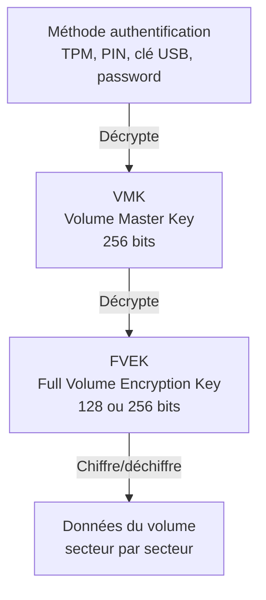
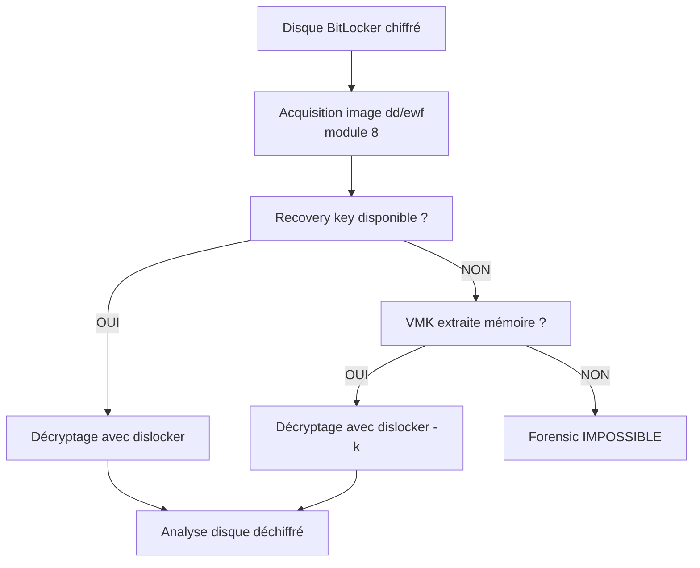

# 7.3 Cas du chiffrement BitLocker actif

!!! quote "L'analogie du coffre-fort dont le code est sur un post-it"

    Imaginez un coffre-fort de banque dont la combinaison change chaque jour. Le directeur connaît le code, mais pour faciliter les opérations courantes, il l'inscrit chaque matin sur un post-it qu'il colle sous son sous-main. Quand il quitte son bureau le soir, il jette le post-it. Si vous arrivez pendant la journée et que le directeur est absent, le post-it est encore là. Si vous arrivez après son départ, le post-it a disparu. BitLocker fonctionne exactement comme ce coffre-fort. La clé maîtresse du chiffrement est en mémoire vive tant que le système est démarré et déverrouillé. Au shutdown, elle disparaît. Acquérir la mémoire d'un poste BitLocker actif et déverrouillé est donc votre seule fenêtre pour obtenir la clé. Manquez cette fenêtre, et le disque devient un coffre-fort verrouillé sans combinaison.

## Métadonnées du chapitre

Ce chapitre traite un cas critique du forensic moderne. Voici ses caractéristiques.

| Champ | Valeur |
|---|---|
| Durée estimée | 3 heures |
| Niveau | Pratique avancé |
| Prérequis | 7.1, 7.2 |
| Livrables | Procédure BitLocker forensic et extraction VMK |
| Auto-explication | 12 minutes |

## Objectifs pédagogiques

À l'issue de ce chapitre, vous serez capable de :

- Comprendre l'architecture cryptographique de BitLocker
- Identifier les différents états de BitLocker
- Reconnaître l'urgence d'une acquisition mémoire avec BitLocker actif
- Extraire les clés depuis un dump mémoire avec Volatility
- Gérer la clé de récupération côté défense
- Formuler des recommandations défensives

---

## 1. Architecture BitLocker

### 1.1 Présentation

**BitLocker** est la solution de chiffrement de volume native de Windows depuis Vista (2007). Voici ses caractéristiques.

| Aspect | Valeur |
|---|---|
| Version intégrée | Vista, 7, 8, 10, 11 (Pro/Enterprise) |
| Algorithme par défaut | AES-XTS 128 ou 256 bits |
| Granularité | Volume entier ou utilisé seulement |
| Authentification | TPM seul, TPM + PIN, TPM + USB, USB seul |
| Récupération | Recovery key 48 chiffres |

### 1.2 Hiérarchie de clés

BitLocker utilise une hiérarchie de clés à plusieurs niveaux. Voici l'architecture.



### 1.3 Composants détaillés

Voici le détail de chaque composant.

| Composant | Rôle | Stockage |
|---|---|---|
| Méthode auth | Déverrouille la VMK | Variable (TPM, USB, mémoire utilisateur) |
| VMK | Master Key, déverrouille FVEK | Stockée chiffrée par méthode auth |
| FVEK | Clé chiffrement données | Stockée chiffrée par VMK |
| Clé de récupération | Backup pour décryptage | Imprimée/AD/file/cloud |
| Identifiant clé | UUID unique | Visible (pas secret) |

### 1.4 Stockage des clés

Voici où chaque clé est stockée selon l'état du système.

| Clé | À l'arrêt | Pendant boot | Après déverrouillage |
|---|---|---|---|
| VMK | Sur disque (chiffrée) | Décryptée | En mémoire (cleartext) |
| FVEK | Sur disque (chiffrée par VMK) | Décryptée | En mémoire (cleartext) |
| Recovery key | Externe | Externe | Externe |

**Conséquence forensic critique** : la VMK et la FVEK sont en mémoire vive en clair pendant tout le temps où le système est démarré et déverrouillé.

## 2. États de BitLocker

### 2.1 Les 5 états principaux

BitLocker peut se trouver dans plusieurs états. Voici les principaux.

| État | Description | Forensic implication |
|---|---|---|
| Désactivé | Pas de chiffrement | Acquisition standard |
| Suspendu | Chiffré mais clé en clair sur disque | Décryptage facile |
| Actif et déverrouillé | Chiffré, clés en mémoire | Acquisition mémoire critique |
| Actif et verrouillé | Chiffré, clés inaccessibles | Recovery key obligatoire |
| En cours de chiffrement | En transition | Gérer avec précaution |

### 2.2 Identification de l'état

Sur Windows, voici comment vérifier l'état BitLocker.

```powershell
# Statut général
manage-bde -status

# Sortie typique
# BitLocker Drive Encryption: Configuration Tool version 10.0.x
# Copyright (C) 2013 Microsoft Corporation. All rights reserved.
#
# Volume C: [OS]
#     [OS Volume]
#
#     Size:                 476.45 GB
#     BitLocker Version:    2.0
#     Conversion Status:    Fully Encrypted
#     Percentage Encrypted: 100.0%
#     Encryption Method:    XTS-AES 128
#     Protection Status:    Protection On
#     Lock Status:          Unlocked
#     Identification Field: None
#     Key Protectors:
#         TPM
#         Numerical Password

# Avec PowerShell
Get-BitLockerVolume -MountPoint C:
```

### 2.3 État critique pour forensic

L'état **"Protection On" + "Unlocked"** est le plus critique. Voici pourquoi.

```text
ÉTAT CRITIQUE - BITLOCKER ACTIF DÉVERROUILLÉ
================================================

CONDITIONS
  - Protection Status : Protection On
  - Lock Status : Unlocked

SIGNIFICATION
  - Le disque est entièrement chiffré
  - Le système actuel a accès aux données
  - VMK et FVEK sont EN MÉMOIRE en clair
  - À l'arrêt : VMK/FVEK perdues, disque inaccessible

URGENCE FORENSIC
  - Acquisition mémoire IMMÉDIATE
  - Pas de reboot
  - Pas de mise en veille (peut purger)
  - Pas d'attente

SI VOUS RATEZ CETTE FENÊTRE
  - Le disque devient un coffre-fort scellé
  - Recovery key obligatoire pour récupérer
  - Si recovery key indisponible : données perdues
```

## 3. Extraction des clés en mémoire

Une fois la mémoire acquise, vous pouvez extraire les clés BitLocker.

### 3.1 Volatility 3 - plugin BitLocker

**Volatility 3** dispose d'un plugin pour extraire les clés BitLocker.

```bash
# Installation Volatility 3
pip install volatility3

# Extraction des clés BitLocker depuis dump
vol -f memory.dmp windows.bitlocker.Bitlocker

# Sortie typique
# Address                Cipher        FVEK
# 0xfffff80031234567     AES-XTS-128   a1b2c3d4...
# 0xfffff80031abcdef     AES-XTS-128   e5f6g7h8...
```

### 3.2 Plugins anciens (Volatility 2)

Pour les dumps anciens, Volatility 2 reste utile.

```bash
# Volatility 2 (legacy)
volatility -f memory.dmp --profile=Win10x64_19041 bitlocker

# Sortie similaire avec FVEK extraites
```

### 3.3 Vérification des clés

Une fois extraite, vérifiez la validité de la clé.

```bash
# Préparation de la clé pour dislocker
# Dislocker permet de monter un volume BitLocker hors-ligne

# Format dislocker : -K KeyFile.bin (FVEK binaire)
echo "FVEK_HEX_STRING" | xxd -r -p > fvek.bin

# Test de montage (sur image disque)
sudo dislocker -V image.dd -k fvek.bin -- /mnt/dislocker
sudo mount -o ro /mnt/dislocker/dislocker-file /mnt/clear

# Si ça fonctionne, vous pouvez explorer le contenu
ls /mnt/clear
```

## 4. Recovery key - approche officielle

Plutôt que d'extraire la VMK depuis la mémoire (qui peut être complexe), vous pouvez obtenir la **recovery key** par voie officielle.

### 4.1 Sources de la recovery key

Voici où chercher la recovery key.

| Source | Disponibilité |
|---|---|
| Active Directory (entreprise) | Souvent (BitLocker recovery info) |
| Microsoft Account (perso) | Souvent (lié au compte MS) |
| Fichier sauvegardé | Variable (selon utilisateur) |
| Imprimée | Selon politique entreprise |
| Azure AD | Cloud entreprise |
| SCCM / MEM | Si utilisé pour gestion |

### 4.2 Récupération AD

En entreprise avec AD, voici la procédure.

```powershell
# Sur DC (avec privilèges adéquats)
# Identifier l'objet ordinateur
Get-ADComputer -Identity WIN-COMPTA-01

# Récupération des infos BitLocker
Get-ADObject -Filter {objectClass -eq 'msFVE-RecoveryInformation'} `
    -SearchBase "CN=WIN-COMPTA-01,OU=Computers,DC=artech,DC=fr" `
    -Properties msFVE-RecoveryPassword

# Sortie type
# msFVE-RecoveryPassword : 123456-654321-789012-987654-456789-987456-321987-654321
```

### 4.3 Récupération Azure AD

Pour Azure AD / Intune.

```powershell
# Connexion
Connect-AzureAD

# Recherche
Get-AzureADDevice -SearchString "WIN-COMPTA-01"

# Récupération via portail
# https://portal.azure.com → Devices → BitLocker keys
# Ou via Intune Admin Center
```

### 4.4 Utilisation de la recovery key

```powershell
# Déverrouillage avec recovery password
manage-bde -unlock C: -RecoveryPassword "123456-654321-789012-987654-456789-987456-321987-654321"

# Une fois déverrouillé, le disque est accessible
```

## 5. Cas du forensic offline

Si la machine est éteinte ET que vous avez la recovery key, vous pouvez analyser le disque hors-ligne.

### 5.1 Procédure générale



### 5.2 dislocker avec recovery password

```bash
# Installation dislocker (Linux)
sudo apt install dislocker -y

# Décryptage avec recovery password
sudo dislocker -V /dev/sdb1 \
    -p"123456-654321-789012-987654-456789-987456-321987-654321" \
    -- /mnt/dislocker

# Le fichier /mnt/dislocker/dislocker-file est le volume déchiffré

# Mount en lecture seule
sudo mount -o ro,loop /mnt/dislocker/dislocker-file /mnt/clear

# Exploration
ls /mnt/clear
```

### 5.3 dislocker avec FVEK depuis mémoire

```bash
# Si vous avez extrait la FVEK depuis Volatility
# Format : 32 octets en hex pour AES-128, 64 octets pour AES-256

# Conversion hex → binaire
echo "a1b2c3d4..." | xxd -r -p > fvek.bin

# Décryptage
sudo dislocker -V /dev/sdb1 \
    -k fvek.bin \
    -- /mnt/dislocker

# Mount
sudo mount -o ro,loop /mnt/dislocker/dislocker-file /mnt/clear
```

## 6. Pièges et erreurs courantes

### 6.1 Reboot accidentel

L'erreur la plus coûteuse : **rebooter** un système BitLocker actif sans avoir acquis la mémoire.

```text
SCÉNARIO CATASTROPHE
======================

T+0   Vous arrivez sur site
T+5   Le poste est allumé, déverrouillé
T+10  Vous décidez "on va voir d'abord ce qu'il y a"
T+15  Vous lancez Process Explorer (impact mineur)
T+20  Vous lancez Wireshark... ne s'installe pas...
T+25  "Ça ne marche pas, je vais redémarrer"
T+26  REBOOT

CONSÉQUENCE
  - VMK et FVEK perdues
  - Recovery key probablement non disponible
  - Disque devient inaccessible
  - Forensic IMPOSSIBLE

VOTRE RAPPORT
  "Le forensic n'a pas pu être réalisé en raison
   d'un redémarrage accidentel du poste avant
   acquisition mémoire."
  
  Votre crédibilité : -1000.
```

### 6.2 Verrouillage de session

**Verrouiller la session** ne vide pas la mémoire BitLocker en théorie, mais peut déclencher des effets de bord.

```text
VERROUILLAGE DE SESSION
==========================

EFFETS NORMAUX
  La VMK reste en mémoire
  La FVEK reste en mémoire

MAIS
  Certains outils tiers (EDR, AV) peuvent
  déclencher un nettoyage mémoire au lock.
  
  Windows peut purger des caches.

RECOMMANDATION
  Ne PAS verrouiller la session
  Ne PAS éteindre l'écran
  Garder le système exactement dans son état actuel
```

### 6.3 Crédentials AD non disponibles

Si la recovery key est dans AD mais que vous n'avez pas les droits AD, vous avez un problème.

```text
CRÉDENTIALS AD MANQUANTS
===========================

SOLUTIONS
  1. Demander au DSI ARTECH d'extraire la clé
  2. Coordonner avec admin domaine
  3. Utiliser un compte d'urgence (BTL-Recovery)
  4. Recovery via Azure AD si applicable

PRÉPARATION FUTURE
  Lors du mandat initial, faire inclure :
  "Le client s'engage à fournir les recovery keys
   BitLocker des postes audités sur demande."
```

## 7. Recommandations défensives BitLocker

### 7.1 Configuration recommandée

Voici les recommandations pour ARTECH.

| Paramètre | Recommandation |
|---|---|
| Algorithme | XTS-AES 256 |
| Authentification | TPM + PIN (pas TPM seul) |
| Recovery key | Stockée dans AD ET imprimée en safe |
| Volumes chiffrés | OS + tous data drives |
| Used Space Only | Pour SSD (perf), Full Disk pour HDD |
| Network unlock | Activé en entreprise |

### 7.2 GPO BitLocker

Voici les principales GPO à configurer.

```text
GPO BITLOCKER RECOMMANDÉES
==============================

Configuration ordinateur > Modèles administratifs > 
Composants Windows > Chiffrement de lecteur BitLocker

REQUIS
  Choisir comment les utilisateurs peuvent récupérer
    Activer recovery password
    Activer recovery key
    Save BitLocker recovery info to AD DS : Activé
    Configure user storage of BitLocker recovery info : Activé
    
  Refuser l'accès aux lecteurs amovibles non protégés par BitLocker
    Activé (lecture seule)

OS DRIVES
  Choisir comment les lecteurs OS protégés peuvent être récupérés
    Activé (avec stockage AD obligatoire)
  
  Require additional authentication at startup
    Activé : TPM + PIN
    Minimum PIN length : 6 caractères

AVERTISSEMENT
  Ne JAMAIS désactiver TPM + Boot integrity check
  Cela ouvrirait des attaques de DMA
```

### 7.3 Anti-cold boot et anti-DMA

Voici les protections à activer pour résister aux attaques avancées.

| Protection | Activation |
|---|---|
| Memory Integrity (Core Isolation) | Windows Security > Device Security |
| Kernel DMA Protection | UEFI BIOS + Windows |
| BitLocker pre-boot auth | TPM + PIN |
| Drive encryption pre-OS | Activé par défaut |
| Hibernation file protection | Activée par BitLocker |

### 7.4 Vérification rapide

Pour vérifier qu'une machine est correctement protégée.

```powershell
# Vérification BitLocker
Get-BitLockerVolume | Format-List

# Vérification Memory Integrity
Get-CimInstance -ClassName Win32_DeviceGuard -Namespace root\Microsoft\Windows\DeviceGuard

# Vérification Kernel DMA
msinfo32

# Onglet "Résumé système" → "Protection DMA du noyau"
```

## 8. Cas pratique - WIN-COMPTA-01

### 8.1 Scénario

Vous arrivez sur le poste WIN-COMPTA-01 (Sophie, ARTECH) suite à la compromission via phishing du module 6.

### 8.2 Vérifications préliminaires

```powershell
# Sur la machine cible (depuis cmd admin)

# 1. État BitLocker
manage-bde -status

# Sortie attendue
# Volume C:
#     Protection Status:    Protection On
#     Lock Status:          Unlocked
#     Encryption Method:    XTS-AES 128

# Confirmation : BitLocker actif, déverrouillé
# Implication : VMK + FVEK en mémoire

# 2. Note des informations
manage-bde -status > C:\triage\bitlocker-status.txt
```

### 8.3 Décision

```text
DÉCISION ARTECH WIN-COMPTA-01
================================

CONTEXTE
  BitLocker actif et déverrouillé
  Compromise active
  Pas d'urgence destructive

DÉCISION
  Acquisition mémoire EN PRIORITÉ ABSOLUE
  Délai : moins de 15 minutes après arrivée

PROCÉDURE
  T+0  Arrivée
  T+2  Vérification état BitLocker (PowerShell)
  T+5  Préparation USB DumpIt
  T+8  Lancement DumpIt
  T+15 Acquisition complète terminée
  T+17 Hash SHA-256
  T+20 Documentation

LIVRABLES
  - dump mémoire (.raw ou .dmp)
  - VMK extraite par Volatility plus tard
  - Hash et signature
```

### 8.4 Workflow consolidé

```bash
# Sur la station forensic (Linux)
# Une fois le dump récupéré

mkdir -p ~/forensic/artech-2026/win-compta-01-bitlocker
cd ~/forensic/artech-2026/win-compta-01-bitlocker

# Hash vérifié
sha256sum memory.dmp

# Extraction des clés BitLocker
vol -f memory.dmp windows.bitlocker.Bitlocker > bitlocker-keys.txt

# Sortie utile
# FVEK trouvée à 0xfffff80031234567 : a1b2c3d4...

# Préparation pour décryptage offline (à utiliser après acquisition disque module 8)
echo "a1b2c3d4..." | xxd -r -p > fvek.bin

# Sauvegarde sécurisée
gpg --symmetric --cipher-algo AES256 fvek.bin
# Génère fvek.bin.gpg chiffré avec passphrase

# Documentation
cat > rapport-bitlocker.md << 'EOF'
# Forensic BitLocker - WIN-COMPTA-01

## Contexte
- Machine : WIN-COMPTA-01
- Date : 2026-04-30
- BitLocker : actif, déverrouillé, AES-XTS-128

## Acquisition mémoire
- Outil : DumpIt
- Heure : 09h45 UTC
- Hash dump : ...
- Volume : 16 Go (RAM totale machine)

## Extraction clés
- VMK trouvée : oui
- FVEK trouvée : oui (32 octets, AES-128)
- Cipher : AES-XTS-128

## Sauvegarde
- FVEK chiffrée GPG (passphrase en KeePass)
- Recovery key obtenue de l'AD (stockée séparément)

## Suite
- Acquisition disque module 8
- Décryptage avec dislocker
- Analyse offline
EOF
```

## 9. Auto-évaluation

Vérifiez votre maîtrise par les questions suivantes.

| # | Question | Réponse |
|---|---|---|
| 1 | Que signifie VMK ? | Volume Master Key |
| 2 | Que signifie FVEK ? | Full Volume Encryption Key |
| 3 | Algorithme par défaut Windows 10/11 ? | XTS-AES |
| 4 | État critique pour forensic ? | Protection On + Unlocked |
| 5 | Plugin Volatility 3 ? | windows.bitlocker.Bitlocker |
| 6 | Outil Linux pour BitLocker ? | dislocker |
| 7 | Format recovery key ? | 48 chiffres |
| 8 | Auth recommandée ARTECH ? | TPM + PIN |

## 10. Synthèse

Voici les points clés à retenir.

```text
BITLOCKER ACTIF FORENSIC

ARCHITECTURE
  Auth → VMK → FVEK → Données
  AES-XTS-128 ou 256

ÉTATS
  Désactivé : pas de chiffrement
  Suspendu : clé cleartext sur disque
  Actif déverrouillé : VMK/FVEK en mémoire (CRITIQUE)
  Actif verrouillé : recovery key requise
  En cours : transition

URGENCE FORENSIC
  Si actif + déverrouillé :
    Acquisition mémoire IMMÉDIATE
    Pas de reboot
    Pas de verrouillage
    Pas de mise en veille

OUTILS
  Volatility 3 : windows.bitlocker.Bitlocker
  dislocker : décryptage offline
  manage-bde : gestion Windows
  Get-BitLockerVolume : PowerShell

RÉCUPÉRATION CLÉ
  Sources : AD, Azure AD, fichier, imprimée
  Recovery password 48 chiffres
  Mémoire (VMK/FVEK extraites)

WORKFLOW FORENSIC
  1. Vérifier état BitLocker
  2. Acquisition mémoire
  3. Extraction VMK/FVEK
  4. Acquisition disque
  5. Décryptage offline avec dislocker

DÉFENSES ARTECH
  TPM + PIN obligatoire
  AES-XTS-256
  Recovery dans AD
  Memory Integrity activé
  Kernel DMA Protection
```

---

**Chapitre précédent** : [7.2 Décision allumer ou éteindre selon contexte](7-2-decision-allumer-eteindre.md)

**Chapitre suivant** : [7.4 Cas du ransomware en cours d'exécution](7-4-ransomware-actif.md)