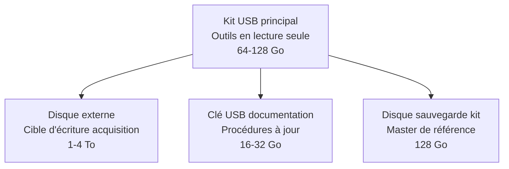
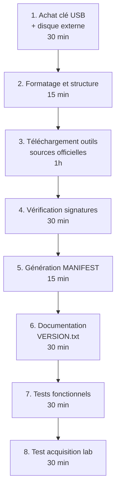

# 7.5 Préparation kit USB acquisition Windows

!!! quote "L'analogie de la trousse du médecin urgentiste"

    Un médecin urgentiste arrive sur intervention avec une trousse préparée. Il sait exactement où se trouve chaque instrument, l'a vérifié la veille, connaît sa date de péremption et son intégrité. Pendant l'intervention, ses gestes sont automatiques car ils ont été répétés en condition calme. Il ne réfléchit pas à savoir où est l'adrénaline. Si la trousse était improvisée, il perdrait des minutes critiques à chercher, à hésiter, à improviser. Le kit USB DFIR joue exactement ce rôle. Préparé en condition de calme, vérifié régulièrement, organisé selon une logique stricte, il permet à l'analyste arrivant sur scène de se concentrer sur la situation et non sur ses outils. Ce chapitre vous fait construire ce kit selon les standards professionnels.

## Métadonnées du chapitre

Ce chapitre est pratique et durable. Le kit que vous produisez vous servira pendant des années. Voici ses caractéristiques.

| Champ | Valeur |
|---|---|
| Durée estimée | 4 heures |
| Niveau | Pratique |
| Prérequis | 7.1 à 7.4 maîtrisés |
| Livrables | Kit USB DFIR complet, validé et documenté |
| Auto-explication | 12 minutes |

## Objectifs pédagogiques

À l'issue de ce chapitre, vous serez capable de :

- Choisir le matériel USB adapté aux contraintes forensiques
- Organiser la structure des outils de manière standard
- Sélectionner la suite d'outils adaptée à Windows
- Valider l'intégrité initiale du kit par hash
- Mettre en place une procédure de maintenance régulière
- Préparer la documentation associée

---

## 1. Pourquoi un kit USB dédié

Avant tout, comprenons pourquoi le kit USB est central en DFIR Windows.

### 1.1 Contraintes forensiques fondamentales

Voici les contraintes qui dictent le choix du kit USB.

| Contrainte | Implication |
|---|---|
| Aucune écriture sur le poste cible | Outils portables sans installation |
| Hash de référence stable | Outils signés et hashés en amont |
| Reproductibilité d'un incident à l'autre | Mêmes outils, mêmes versions |
| Démarrage rapide | Pas de configuration sur place |
| Lecture seule physique | Empêche contamination du kit |
| Documentation accompagnante | Procédures à portée de main |

### 1.2 Différence avec une simple clé USB

Une clé USB classique n'est **pas un kit DFIR**. Voici les différences essentielles.

| Aspect | Clé USB classique | Kit USB DFIR |
|---|---|---|
| Verrouillage écriture | Aucun | Switch hardware ou logique |
| Outils | Mélange perso/pro | Outils forensiques uniquement |
| Hashes | Aucun | SHA-256 de chaque exécutable |
| Documentation | Aucune | Procédures, formulaires, guides |
| Maintenance | Aucune | Programme régulier |
| Versionnage | Aucun | Suivi des versions outils |
| Validation | Aucune | Tests périodiques |

### 1.3 Conséquences d'un kit mal préparé

Voici ce que peut coûter un kit mal préparé sur le terrain.

| Problème | Conséquence |
|---|---|
| Outil obsolète qui crash | Acquisition perdue, doit recommencer |
| Pas de switch lecture seule | Contamination du kit en cas d'incident actif |
| Mauvaise version Windows | Incompatibilité, blocage |
| Hashes manquants | Pas de valeur forensique en justice |
| Documentation absente | Erreurs sous stress |
| Espace insuffisant | Acquisition tronquée |

## 2. Choix du matériel

### 2.1 Caractéristiques USB recommandées

Voici les caractéristiques à privilégier pour la clé USB principale.

| Caractéristique | Recommandation |
|---|---|
| Capacité | 64 à 128 Go minimum |
| Norme USB | USB 3.0 ou 3.1 minimum |
| Vitesse lecture | 100 Mo/s minimum |
| Vitesse écriture | 50 Mo/s minimum |
| Switch hardware lecture seule | Oui (modèles spécialisés) |
| Robustesse | Boîtier métal, étanche IP67 |
| Marque | Kingston, SanDisk, Samsung, Verbatim |

### 2.2 Modèles avec switch hardware

Voici quelques modèles avec switch hardware lecture seule au moment de la rédaction.

| Modèle | Capacité | Particularité |
|---|---|---|
| Kanguru FlashTrust | 8-128 Go | Switch hardware, certifié |
| Verbatim PinStripe | 16-128 Go | Switch logique |
| Apricorn Aegis Secure Key | 16-1 To | Chiffrement matériel + switch |

### 2.3 Architecture multi-supports

Pour un kit professionnel, voici l'architecture recommandée à plusieurs supports.



### 2.4 Disque externe d'écriture

Le disque externe sert de cible pour les acquisitions. Voici les recommandations.

| Caractéristique | Recommandation |
|---|---|
| Capacité | 1 To minimum, idéal 4 To |
| Type | SSD externe USB-C |
| Vitesse | 500 Mo/s minimum |
| Modèles | Samsung T7, SanDisk Extreme Pro, WD My Passport SSD |
| Préparation | Formatage exFAT ou NTFS, vide |
| Chiffrement | BitLocker To Go ou VeraCrypt |

## 3. Structure du kit USB

### 3.1 Arborescence type

Voici l'arborescence recommandée pour le kit principal.

```text
/ (racine clé USB)
│
├── README.md                        # Documentation principale
├── MANIFEST.sha256                  # Hashes de tous les fichiers
├── VERSION.txt                      # Version du kit, date
│
├── 01-Acquisition-Memoire/
│   ├── MagnetRAMCapture/
│   │   ├── MagnetRAMCapture.exe
│   │   └── README.txt
│   ├── FTK_Imager_Lite/
│   │   ├── FTK Imager.exe
│   │   └── ...
│   ├── DumpIt/
│   │   └── DumpIt.exe
│   ├── WinPmem/
│   │   ├── winpmem_mini_x64.exe
│   │   └── winpmem_mini_x86.exe
│   └── Belkasoft_RAM_Capturer/
│       └── RamCapturer64.exe
│
├── 02-Triage-Live/
│   ├── Sysinternals/
│   │   ├── autoruns64.exe
│   │   ├── procexp64.exe
│   │   ├── pslist.exe
│   │   ├── handle64.exe
│   │   ├── tcpview64.exe
│   │   ├── procmon64.exe
│   │   └── psloggedon.exe
│   ├── KAPE/
│   │   └── kape.exe
│   └── CyLR/
│       └── CyLR.exe
│
├── 03-Acquisition-Disque/
│   ├── FTK_Imager/
│   ├── dc3dd-windows/
│   └── ddrescue-windows/
│
├── 04-Hash-Verification/
│   ├── HashCheck/
│   │   └── HashCheckSetup.msi
│   └── Get-FileHash-scripts/
│       └── verify-manifest.ps1
│
├── 05-Network-Capture/
│   ├── Wireshark-portable/
│   ├── Microsoft-Network-Monitor/
│   └── tcpdump-windows/
│
├── 06-Analysis-Helpers/
│   ├── Notepad++/
│   ├── HxD/
│   ├── 7-Zip/
│   └── PEStudio/
│
├── 07-Scripts/
│   ├── triage-quick.ps1
│   ├── hash-immediate.ps1
│   ├── log-action.ps1
│   ├── system-info-collect.ps1
│   └── ransomware-triage.ps1
│
├── 08-Documentation/
│   ├── Procedures/
│   │   ├── procedure-rapide-ransomware.pdf
│   │   ├── procedure-acquisition-memoire.pdf
│   │   ├── procedure-bitlocker-actif.pdf
│   │   └── procedure-triage-live.pdf
│   ├── Formulaires/
│   │   ├── formulaire-scellement.pdf
│   │   ├── formulaire-chaine-garde.pdf
│   │   └── formulaire-journal-actions.pdf
│   └── Cheatsheets/
│       ├── cheatsheet-powershell.pdf
│       ├── cheatsheet-volatility.pdf
│       └── cheatsheet-windows-events.pdf
│
└── 09-Logs/                         # Vide initialement, write si possible
    └── README.txt                   # Note "ne pas utiliser sauf déverrouillage"
```

### 3.2 Justification de l'arborescence

Cette structure répond à plusieurs critères. Voici l'explication.

| Choix | Justification |
|---|---|
| Numérotation par phase | Ordre d'utilisation chronologique |
| Sous-dossier par outil | Isolation et versioning |
| README.txt par outil | Note d'usage rapide |
| Manifest racine | Vérification globale rapide |
| Section Documentation séparée | Accessible sans rechercher |
| Logs vide en lecture seule | Documentation pure (logs vont sur disque externe) |

### 3.3 Convention de nommage

Voici la convention pour nommer les versions.

```text
CONVENTION KIT DFIR OmnyVia
============================

Format VERSION.txt :
  Kit DFIR OmnyVia v2026.04
  Date construction : 2026-04-30
  Constructeur : Zyrass / OmnyVia
  Validations : 2026-04-30
  Prochaine maintenance : 2026-07-30

Format archives :
  kit-dfir-omnyvia-v2026.04-master.7z

Format dossiers d'incident :
  YYYY-MM-DD-incident-XXX/
```

## 4. Sélection des outils par catégorie

### 4.1 Outils acquisition mémoire

Voici la grille de sélection des outils acquisition mémoire.

| Outil | Avantages | Inconvénients | Cas d'usage |
|---|---|---|---|
| Magnet RAM Capture | Interface simple, gratuit | GUI seulement | Standard |
| FTK Imager Lite | Multi-formats, gratuit | Plus lent | Multi-acquisition |
| DumpIt (Comae) | Très rapide, format crash dump | Pas maintenu | Backup rapide |
| WinPmem | Open source, scriptable | Sans GUI | Automatisation |
| Belkasoft RAM Capturer | Léger, gratuit | Format limité | Backup léger |

Pour le kit, je recommande d'inclure **Magnet RAM Capture** comme principal et **WinPmem** comme backup scriptable.

### 4.2 Outils triage live

Voici la sélection pour le triage à chaud.

| Outil | Source | Usage |
|---|---|---|
| Autoruns | Sysinternals (Microsoft) | Persistance complète |
| Process Explorer | Sysinternals | Processus avec hiérarchie |
| Handle | Sysinternals | Handles ouverts |
| TCPView | Sysinternals | Connexions réseau live |
| KAPE | Eric Zimmerman | Triage automatisé complet |
| CyLR | AlienVault | Collection live response Windows |

KAPE est devenu un **standard de fait** en DFIR Windows depuis 2020. Voici pourquoi.

```text
KAPE (Kroll Artifact Parser and Extractor)
============================================

Auteur : Eric Zimmerman (ex-FBI)
Licence : Gratuit (avec terms specifiques)
Type : CLI ou GUI

Capacités :
  - Triage automatisé selon profils
  - Targets : ce qu'on collecte
  - Modules : comment on l'analyse
  - Multi-cibles : hosts simultanés
  - Format de sortie : multiple

Usage type :
  kape.exe --tsource C: --target BasicCollection
           --tdest E:\triage\
           --module RegistryHives
           --mdest E:\triage-parsed\
```

### 4.3 Outils acquisition disque

Voici les outils acquisition disque sous Windows.

| Outil | Type | Note |
|---|---|---|
| FTK Imager | Référence | Acquisition E01, raw, AFF |
| Magnet Acquire | Alternative | Interface moderne |
| dc3dd portable | CLI | Hash en parallèle |
| ddrescue Windows | CLI | Récupération secteurs défectueux |

FTK Imager reste la **référence absolue** pour l'acquisition disque. Il sera détaillé au module 8.

### 4.4 Scripts PowerShell utiles

Voici les scripts essentiels à inclure dans le kit.

```text
SCRIPTS DU KIT
================

triage-quick.ps1
  Triage rapide en une commande
  Sortie : CSV horodaté de processus, network, persistance

hash-immediate.ps1
  Hash SHA-256 de tous fichiers d'un répertoire
  Sortie : MANIFEST.sha256

log-action.ps1
  Journal horodaté des actions analyste
  Format : timestamp ISO 8601 + action

system-info-collect.ps1
  Collecte systeminfo, ipconfig, netstat, etc.
  Sortie : sysinfo-YYYYMMDD-HHMMSS.txt

ransomware-triage.ps1
  Recherche d'extensions et notes suspectes
  Sortie : suspect-files.csv + ransom-notes.csv
```

## 5. Construction du kit pas à pas

### 5.1 Préparation du support

Voici la procédure pour préparer la clé USB.

```powershell
# Sur une machine de référence propre (pas de production)
# 1. Formatage clé USB
# Insertion clé USB - identifier la lettre (E: ici)

# Formatage NTFS pour gros fichiers
Format-Volume -DriveLetter E -FileSystem NTFS -NewFileSystemLabel "DFIR-KIT-v2026.04"

# Vérification
Get-Volume -DriveLetter E
```

### 5.2 Création de l'arborescence

```powershell
# Création de l'arborescence depuis l'arborescence cible
$root = "E:\"
$folders = @(
    "01-Acquisition-Memoire\MagnetRAMCapture",
    "01-Acquisition-Memoire\FTK_Imager_Lite",
    "01-Acquisition-Memoire\DumpIt",
    "01-Acquisition-Memoire\WinPmem",
    "01-Acquisition-Memoire\Belkasoft_RAM_Capturer",
    "02-Triage-Live\Sysinternals",
    "02-Triage-Live\KAPE",
    "02-Triage-Live\CyLR",
    "03-Acquisition-Disque\FTK_Imager",
    "03-Acquisition-Disque\dc3dd-windows",
    "04-Hash-Verification\HashCheck",
    "04-Hash-Verification\Get-FileHash-scripts",
    "05-Network-Capture\Wireshark-portable",
    "06-Analysis-Helpers\Notepad++",
    "06-Analysis-Helpers\HxD",
    "06-Analysis-Helpers\7-Zip",
    "07-Scripts",
    "08-Documentation\Procedures",
    "08-Documentation\Formulaires",
    "08-Documentation\Cheatsheets",
    "09-Logs"
)

foreach ($folder in $folders) {
    New-Item -Path "$root$folder" -ItemType Directory -Force
}
```

### 5.3 Téléchargement des outils

Pour chaque outil, voici la source officielle de référence.

| Outil | URL officielle |
|---|---|
| Magnet RAM Capture | magnetforensics.com/free-tools |
| FTK Imager | exterro.com/ftk-imager |
| DumpIt | comae.com (archives) |
| WinPmem | github.com/Velocidex/WinPmem |
| Sysinternals Suite | docs.microsoft.com/sysinternals |
| KAPE | kroll.com/en/services/cyber-risk/.../kape |
| CyLR | github.com/orlikoski/CyLR |
| Notepad++ | notepad-plus-plus.org |
| HxD | mh-nexus.de |
| 7-Zip | 7-zip.org |

```text
RÈGLE STRICTE - SOURCES OFFICIELLES UNIQUEMENT

JAMAIS télécharger les outils DFIR depuis :
  - Sites de hosting tiers
  - Liens GitHub forks non vérifiés
  - Archives partagées par mail
  - Torrents

TOUJOURS depuis :
  - Site officiel de l'éditeur
  - GitHub officiel signé
  - Microsoft Sysinternals
  - Vérification du hash SHA-256 publié
```

### 5.4 Vérification des signatures

Pour chaque outil signé numériquement, vérifiez la signature.

```powershell
# Vérification de la signature Authenticode
$file = "E:\01-Acquisition-Memoire\MagnetRAMCapture\MagnetRAMCapture.exe"
$sig = Get-AuthenticodeSignature $file

if ($sig.Status -eq 'Valid') {
    Write-Host "[OK] Signature valide pour $file"
    Write-Host "    Signataire : $($sig.SignerCertificate.Subject)"
} else {
    Write-Host "[ALERTE] Signature INVALIDE pour $file - Status: $($sig.Status)"
}

# Pour vérifier toute l'arborescence
Get-ChildItem -Path "E:\" -Recurse -Filter "*.exe" |
    ForEach-Object {
        $sig = Get-AuthenticodeSignature $_.FullName
        [PSCustomObject]@{
            File = $_.FullName
            Status = $sig.Status
            Signer = if ($sig.SignerCertificate) { $sig.SignerCertificate.Subject } else { "Aucun" }
        }
    } | Export-Csv "E:\signatures-check.csv" -NoTypeInformation
```

### 5.5 Génération du MANIFEST initial

Le MANIFEST est la **référence d'intégrité** de votre kit.

```powershell
# Script de génération MANIFEST pour le kit
$manifestPath = "E:\MANIFEST.sha256"
$root = "E:\"

# Suppression du manifest existant
if (Test-Path $manifestPath) { Remove-Item $manifestPath }

# Hash de tous les fichiers (sauf MANIFEST lui-même et logs)
Get-ChildItem -Path $root -Recurse -File |
    Where-Object {
        $_.FullName -notmatch "MANIFEST\.sha256$" -and
        $_.FullName -notmatch "\\09-Logs\\"
    } |
    ForEach-Object {
        $hash = Get-FileHash $_.FullName -Algorithm SHA256
        $relPath = $_.FullName.Replace($root, "")
        "$($hash.Hash)  $relPath"
    } | Out-File -Encoding utf8 $manifestPath

# Vérification
Write-Host "[OK] MANIFEST généré : $manifestPath"
Write-Host "Nombre de fichiers : $((Get-Content $manifestPath).Count)"

# Hash du MANIFEST lui-même
$manifestHash = (Get-FileHash $manifestPath -Algorithm SHA256).Hash
Write-Host "Hash du MANIFEST : $manifestHash"

# Sauvegarder le hash du MANIFEST séparément (papier, KeePass, etc.)
"Hash MANIFEST.sha256 v2026.04 : $manifestHash" |
    Out-File -Encoding utf8 "E:\VERSION.txt" -Append
```

### 5.6 Documentation et VERSION.txt

Voici le contenu type du fichier VERSION.txt.

```text
Kit DFIR OmnyVia
==========================
Version : 2026.04
Date construction : 2026-04-30
Constructeur : Zyrass / OmnyVia
Identifiant unique : KIT-OMNYVIA-2026-04-001

CONTENU
-------
Acquisition mémoire :
  - Magnet RAM Capture v1.2.0
  - FTK Imager Lite v4.7.1
  - DumpIt (archive)
  - WinPmem v4.0.1 (rc2)
  - Belkasoft RAM Capturer v1.0.0

Triage live :
  - Sysinternals Suite (build 2026-03-15)
  - KAPE v1.3.0.0
  - CyLR v2.4.0

Acquisition disque :
  - FTK Imager v4.7.1
  - dc3dd portable

Documentation :
  - 4 procédures rapides
  - 3 formulaires
  - 3 cheatsheets

INTÉGRITÉ
---------
Hash MANIFEST.sha256 : a1b2c3d4e5f6...

VALIDATIONS
-----------
2026-04-30 : Construction initiale, validation Zyrass
2026-04-30 : Test acquisition lab : OK
2026-04-30 : Test triage lab : OK

PROCHAINE MAINTENANCE
---------------------
2026-07-30 (90 jours)
  - Vérification MANIFEST
  - Mise à jour outils si nécessaire
  - Test sur lab
  - Régénération si modifications
```

## 6. Validation du kit

### 6.1 Tests fonctionnels obligatoires

Avant tout usage opérationnel, le kit doit passer les tests suivants.

| Test | Critère de réussite |
|---|---|
| Boot sur machine test | Clé montée en moins de 10 secondes |
| Lancement Magnet RAM Capture | Interface affichée |
| Lancement Sysinternals procexp | Interface affichée, signature valide |
| Vérification MANIFEST | 100 % des fichiers OK |
| Test acquisition mémoire en lab | Dump produit et hashé |
| Test triage PowerShell | Scripts s'exécutent sans erreur |

### 6.2 Procédure de validation

Voici la procédure de validation à dérouler.

```powershell
# Sur une machine Windows de test (PAS de production)

# Test 1 - Montage et accès
$kitDrive = "E:"
if (Test-Path "$kitDrive\MANIFEST.sha256") {
    Write-Host "[OK] Test 1 - Kit monté et MANIFEST présent"
} else {
    Write-Host "[ECHEC] Test 1"; exit 1
}

# Test 2 - Vérification MANIFEST
Write-Host "[*] Test 2 - Vérification MANIFEST en cours..."
$errors = 0
Get-Content "$kitDrive\MANIFEST.sha256" | ForEach-Object {
    if ($_ -match '^([a-f0-9]+)\s+(.+)$') {
        $expectedHash = $matches[1]
        $relPath = $matches[2]
        $fullPath = Join-Path $kitDrive $relPath
        if (Test-Path $fullPath) {
            $actualHash = (Get-FileHash $fullPath -Algorithm SHA256).Hash.ToLower()
            if ($actualHash -ne $expectedHash) {
                Write-Host "[ECHEC] Hash divergent : $relPath"
                $errors++
            }
        } else {
            Write-Host "[ECHEC] Fichier manquant : $relPath"
            $errors++
        }
    }
}
if ($errors -eq 0) {
    Write-Host "[OK] Test 2 - MANIFEST valide"
} else {
    Write-Host "[ECHEC] Test 2 - $errors erreurs"
}

# Test 3 - Signature des outils
Write-Host "[*] Test 3 - Signatures Authenticode..."
$unsigned = Get-ChildItem "$kitDrive" -Recurse -Filter "*.exe" |
    ForEach-Object {
        $sig = Get-AuthenticodeSignature $_.FullName
        if ($sig.Status -ne 'Valid') {
            $_.FullName
        }
    }
if ($unsigned) {
    Write-Host "[INFO] Outils non signés (acceptable pour outils open source) :"
    $unsigned | ForEach-Object { Write-Host "  - $_" }
}

# Test 4 - Lancement à blanc Magnet RAM Capture
$ramCapture = "$kitDrive\01-Acquisition-Memoire\MagnetRAMCapture\MagnetRAMCapture.exe"
if (Test-Path $ramCapture) {
    Write-Host "[OK] Test 4 - Magnet RAM Capture présent"
}

# Test 5 - Scripts PowerShell
$scripts = Get-ChildItem "$kitDrive\07-Scripts\*.ps1"
foreach ($script in $scripts) {
    try {
        $null = [System.Management.Automation.PSParser]::Tokenize((Get-Content $script.FullName -Raw), [ref]$null)
        Write-Host "[OK] Script syntaxe valide : $($script.Name)"
    } catch {
        Write-Host "[ECHEC] Script syntaxe invalide : $($script.Name)"
    }
}
```

### 6.3 Test d'acquisition réelle en lab

Voici le test final à mener sur un poste de lab.

```text
TEST D'ACQUISITION COMPLET
============================

Préparation
  - Poste lab Windows 11 (cycle 0 module 3.8)
  - Disque externe formaté disponible
  - Kit USB monté en E:

Étapes
  1. Lancer Magnet RAM Capture
  2. Sortie : F:\test-acquisition\YYYYMMDD-HHMMSS-test.raw
  3. Mesurer le temps d'acquisition
  4. Vérifier le hash post-acquisition
  5. Tester l'ouverture avec Volatility (chapitre 7.6)
  6. Documenter le test dans VERSION.txt

Critères de succès
  - Acquisition complète sans erreur
  - Hash SHA-256 calculé
  - Volatility peut lire le dump
  - Durée cohérente avec la taille RAM
```

## 7. Maintenance du kit

Un kit non maintenu devient progressivement inutile. Voici la routine.

### 7.1 Maintenance trimestrielle

Voici les actions à mener tous les 3 mois.

| Action | Justification |
|---|---|
| Mise à jour Sysinternals | Microsoft pousse régulièrement |
| Mise à jour KAPE | Eric Zimmerman maintient activement |
| Vérification versions outils principaux | Vulnérabilités possibles |
| Test fonctionnel complet | Détecter corruption |
| Régénération MANIFEST | Si mises à jour |
| Mise à jour VERSION.txt | Traçabilité |

### 7.2 Maintenance annuelle

Voici les actions à mener tous les 12 mois.

| Action | Justification |
|---|---|
| Renouvellement support physique | USB usure |
| Audit complet de la suite outils | Outils obsolètes à retirer |
| Revue procédures et formulaires | Évolutions légales |
| Formation rappel | Drift méthodologique |
| Test en conditions de stress | Simulation incident |

### 7.3 Maintenance ad hoc

Voici les déclencheurs de maintenance ponctuelle.

| Déclencheur | Action |
|---|---|
| CVE sur un outil du kit | Mise à jour ou retrait immédiat |
| Nouvelle famille ransomware majeure | Adaptation procédures |
| Évolution réglementaire (CNIL) | Revue formulaires |
| Retour d'incident | Amélioration scripts |

### 7.4 Contrôle d'intégrité régulier

Entre les maintenances, voici le contrôle rapide à effectuer.

```powershell
# Script verify-kit.ps1 - Contrôle d'intégrité rapide
# Lancer mensuellement pour détecter toute altération

$kitDrive = "E:"
$manifest = "$kitDrive\MANIFEST.sha256"
$expectedManifestHash = "a1b2c3..."  # À renseigner depuis VERSION.txt

# Vérification du hash du MANIFEST
$actualManifestHash = (Get-FileHash $manifest -Algorithm SHA256).Hash.ToLower()
if ($actualManifestHash -ne $expectedManifestHash.ToLower()) {
    Write-Host "[ALERTE] MANIFEST modifié !"
    Write-Host "Attendu : $expectedManifestHash"
    Write-Host "Obtenu  : $actualManifestHash"
    Write-Host ""
    Write-Host "Le kit pourrait être compromis. Régénérer depuis le master."
    exit 1
}

Write-Host "[OK] MANIFEST intact"

# Optionnel : vérification complète du MANIFEST
$verify = Read-Host "Lancer vérification complète ? (o/n)"
if ($verify -eq 'o') {
    # Réutiliser le test 2 du paragraphe 6.2
}
```

## 8. Aspects légaux et chaîne de garde

### 8.1 Documentation accompagnante

Le kit doit inclure des **formulaires papier** pour l'usage en justice.

| Formulaire | Usage |
|---|---|
| Formulaire de scellement | À remplir lors de la mise sous scellés |
| Formulaire de chaîne de garde | Trace de chaque manipulation |
| Formulaire de journal d'actions | Horodatage des étapes |
| Formulaire de remise au commanditaire | Décharge à la livraison |

### 8.2 Format formulaire de scellement type

Voici un template de formulaire de scellement.

```text
FORMULAIRE DE SCELLEMENT
============================
Référence incident : INC-YYYY-XXX
Date : YYYY-MM-DD HH:MM (UTC)

OBJET MIS SOUS SCELLÉS
  Type : disque dur / clé USB / ordinateur
  Marque : 
  Modèle : 
  Numéro de série : 
  Capacité : 
  Hash SHA-256 (si applicable) :

CONTEXTE D'ACQUISITION
  Lieu : 
  Heure début : 
  Heure fin : 
  Acquisition par : 
  Méthode utilisée : 
  Outil utilisé (version) :

NUMÉRO DE SCELLÉ
  Numéro : 
  Type de scellé : papier / sachet inviolable / sceau métallique

SIGNATURES
  Analyste : ___________ (nom, date, signature)
  Témoin 1 : ___________ (nom, qualité, signature)
  Témoin 2 : ___________ (nom, qualité, signature)
```

### 8.3 Validité juridique

Le kit ne suffit pas à garantir la validité juridique. Voici ce qui la complète.

| Élément | Importance |
|---|---|
| Mandat ou réquisition | Préalable légal |
| Outils signés / open source vérifiable | Éviter remise en cause technique |
| MANIFEST hashé et conservé | Intégrité du kit prouvable |
| Journal horodaté ISO 8601 | Reproductibilité |
| Témoins lors de l'acquisition | Force probante |
| Conservation conforme | Chaîne de garde maintenue |

### 8.4 Cadre OmnyVia

Pour un consultant indépendant comme OmnyVia, voici le cadre recommandé.

```text
CADRE OPÉRATIONNEL OMNYVIA
=============================

AVANT INTERVENTION
  - Mandat écrit signé du commanditaire
  - Précision du périmètre exact
  - Identification responsable décisionnel client
  - Autorisation explicite collecte données personnelles

PENDANT INTERVENTION
  - Présence d'un témoin client
  - Photo du poste avant intervention
  - Journal horodaté continu
  - Hashes immédiats systématiques
  - Aucune action hors périmètre

APRÈS INTERVENTION
  - Remise des scellés au commanditaire
  - Conservation copie chiffrée 5 ans
  - Notification CNIL si applicable (72h)
  - Rapport écrit avec recommandations
```

## 9. Cas pratique - Construction du kit OmnyVia

### 9.1 Scénario

Vous construisez votre propre kit DFIR OmnyVia v2026.04 pour le lab d'apprentissage.

### 9.2 Workflow complet

Voici le déroulé en 4 heures.



### 9.3 Liste de courses

Avant de commencer, voici la liste à acheter.

| Article | Quantité | Budget approximatif |
|---|---|---|
| Clé USB 64-128 Go USB 3.1 | 2 (master + opérationnel) | 30-50 € |
| Disque externe SSD 2 To | 1 | 150-200 € |
| Boîtier de protection rigide | 1 | 20 € |
| Pochette anti-statique | 5 | 10 € |
| Cahier journal d'analyste | 1 | 15 € |
| Stylo indélébile | 2 | 5 € |
| Sachets scellés inviolables | 20 | 30 € |
| Total | - | 260-330 € |

### 9.4 Suivi de construction

Voici le checklist à cocher pendant la construction.

```text
CHECKLIST CONSTRUCTION KIT
=============================

MATÉRIEL
  [ ] Clé USB principale acquise
  [ ] Clé USB master (sauvegarde) acquise
  [ ] Disque externe SSD acquis
  [ ] Étiquetage physique de chaque support

STRUCTURE
  [ ] Formatage NTFS
  [ ] Label "DFIR-KIT-v2026.04"
  [ ] Arborescence créée
  [ ] README.md racine

OUTILS - ACQUISITION MÉMOIRE
  [ ] Magnet RAM Capture (signature OK)
  [ ] FTK Imager Lite
  [ ] DumpIt (archive)
  [ ] WinPmem (signature dev OK)
  [ ] Belkasoft RAM Capturer

OUTILS - TRIAGE
  [ ] Sysinternals Suite complète
  [ ] KAPE
  [ ] CyLR

OUTILS - DISQUE
  [ ] FTK Imager
  [ ] dc3dd

OUTILS - HELPERS
  [ ] Notepad++
  [ ] HxD
  [ ] 7-Zip

DOCUMENTATION
  [ ] 4 procédures PDF
  [ ] 3 formulaires PDF
  [ ] 3 cheatsheets PDF

SCRIPTS
  [ ] triage-quick.ps1
  [ ] hash-immediate.ps1
  [ ] log-action.ps1
  [ ] system-info-collect.ps1
  [ ] ransomware-triage.ps1

VALIDATION
  [ ] MANIFEST.sha256 généré
  [ ] VERSION.txt complété
  [ ] Tests fonctionnels OK
  [ ] Test acquisition lab OK
  [ ] Sauvegarde master créée
```

## 10. Évolution du kit dans le temps

### 10.1 Versions historiques

Voici à titre indicatif comment évolue typiquement un kit DFIR.

| Version | Évolutions typiques |
|---|---|
| v2024.01 (initial) | Outils de base, premiers scripts |
| v2024.04 (3 mois) | Ajout KAPE, scripts triage améliorés |
| v2024.07 (6 mois) | Procédures ransomware enrichies |
| v2024.10 (9 mois) | Adaptation Windows 11 24H2 |
| v2025.01 (1 an) | Refonte complète scripts |
| v2025.04 | Ajout outils macOS séparé (cycle 7 bis) |
| v2025.07 | Intégration cloud forensics |
| v2026.04 (actuel) | Optimisations performance |

### 10.2 Veille technologique

Pour maintenir un kit à jour, voici les sources de veille.

| Source | Type |
|---|---|
| ANSSI CERT-FR | Alertes France |
| CISA US | Alertes US |
| SANS DFIR Newsletter | Veille hebdomadaire |
| The DFIR Report | Cas d'incidents publics |
| Eric Zimmerman's tools blog | Updates KAPE et autres |
| 13Cubed YouTube | Tutoriels DFIR |
| For528 SANS course | Formation Windows DFIR |

### 10.3 Communauté DFIR francophone

Quelques communautés actives en français.

| Communauté | Type |
|---|---|
| ANSSI CERT-FR | Officiel |
| ECSC Eurpoean Cyber Security Challenge | Compétitions |
| Nuit du Hack / Hack-it-N | Conférences |
| DFIR FR Discord | Échanges informels |
| MISP Communities FR | IOC partagés |

## 11. Auto-évaluation

Vérifiez votre maîtrise par les questions suivantes.

| # | Question | Réponse |
|---|---|---|
| 1 | Capacité minimale recommandée du kit USB ? | 64 Go |
| 2 | Pourquoi un switch hardware lecture seule ? | Empêcher contamination |
| 3 | Outil principal acquisition mémoire au kit ? | Magnet RAM Capture |
| 4 | Outil de triage automatisé Windows ? | KAPE |
| 5 | Algorithme de hash standard ? | SHA-256 |
| 6 | Fréquence maintenance trimestrielle ? | 90 jours |
| 7 | Source officielle pour Sysinternals ? | docs.microsoft.com/sysinternals |
| 8 | Que contient le MANIFEST ? | Hash SHA-256 de tous fichiers du kit |
| 9 | Outil pour formulaires papier ? | LibreOffice + impression |
| 10 | Conservation copie kit master ? | Coffre ou armoire sécurisée |

## 12. Synthèse

Voici les points clés à retenir.

```text
KIT USB DFIR WINDOWS

MATÉRIEL
  Clé USB 64-128 Go USB 3.1+
  Switch hardware lecture seule (idéal)
  Disque externe SSD pour acquisitions
  Étiquetage et conservation rigoureuse

STRUCTURE
  9 sections numérotées
  README + MANIFEST + VERSION
  Scripts PowerShell dédiés
  Documentation complète embarquée

OUTILS PRINCIPAUX
  Acquisition mémoire :
    Magnet RAM Capture, FTK Imager, WinPmem
  Triage live :
    Sysinternals, KAPE, CyLR
  Acquisition disque :
    FTK Imager (référence)
  Helpers :
    Notepad++, HxD, 7-Zip

VALIDATION
  Sources officielles uniquement
  Vérification signatures Authenticode
  MANIFEST SHA-256 complet
  Tests fonctionnels avant usage

MAINTENANCE
  Trimestrielle : updates outils
  Annuelle : audit complet
  Ad hoc : CVE, nouveautés ransomware
  Contrôle intégrité mensuel

CHAÎNE DE GARDE
  Formulaires papier embarqués
  Témoins lors de l'acquisition
  Hashes systématiques
  Conservation 5 ans

CADRE OMNYVIA
  Mandat écrit obligatoire
  Périmètre précis
  Journal horodaté ISO 8601
  Notification CNIL si applicable

ÉVOLUTION
  Versionnage trimestriel
  Veille SANS / ANSSI / CERT
  Communauté DFIR francophone
  Adaptation Windows et nouveaux ransomwares
```

---

**Chapitre précédent** : [7.4 Cas du ransomware en cours d'exécution](7-4-ransomware-en-cours.md)

**Chapitre suivant** : [7.6 DumpIt Comae usage et limites](7-6-dumpit-comae.md)