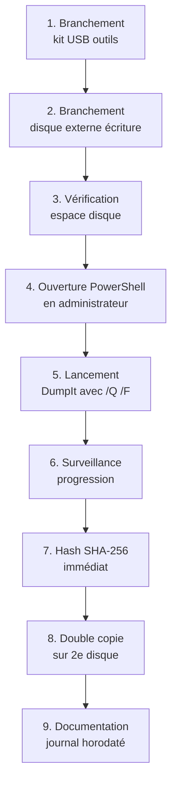

# 7.6 DumpIt Comae usage et limites

!!! quote "L'analogie de la photo Polaroid versus le smartphone"

    Un photographe de presse couvrant un événement pressé a deux outils dans son sac. Le smartphone moderne avec mode pro, balance des blancs et 200 mégapixels. Et le vieux Polaroid en bandoulière qui produit une photo en six secondes, sans réglage, sans miniature. Quand la situation est confuse et qu'on doit prouver maintenant qu'on était là, le Polaroid sort. Tirer la photo, secouer, montrer. Pas de menus, pas de configuration. DumpIt joue ce rôle face aux outils d'acquisition mémoire plus sophistiqués. Il fait une chose, simplement, rapidement, sans question. Vous double-cliquez, vous confirmez, le dump apparaît à côté. Pour un analyste qui arrive en panique sur une scène ransomware avec trois minutes pour décider, cette simplicité radicale est parfois exactement ce qu'il faut.

## Métadonnées du chapitre

Ce chapitre couvre un outil simple mais utile dans le kit DFIR. Voici ses caractéristiques.

| Champ | Valeur |
|---|---|
| Durée estimée | 2 heures |
| Niveau | Pratique |
| Prérequis | 7.5 (kit USB préparé) |
| Livrables | DumpIt intégré au kit avec test validé |
| Auto-explication | 8 minutes |

## Objectifs pédagogiques

À l'issue de ce chapitre, vous serez capable de :

- Expliquer l'historique et la position de DumpIt
- Lancer une acquisition DumpIt en moins de 30 secondes
- Comprendre le format Microsoft Crash Dump
- Identifier les limites de l'outil
- Choisir entre DumpIt et alternatives selon le contexte
- Convertir un dump pour exploitation Volatility

---

## 1. Présentation et histoire

DumpIt est l'un des outils d'acquisition mémoire les plus connus de l'écosystème DFIR. Voici son contexte.

### 1.1 Histoire de l'outil

Voici les étapes principales de l'histoire de DumpIt.

| Année | Événement |
|---|---|
| 2008 | Création par Matthieu Suiche, fondateur de MoonSols |
| 2011 | Distribution gratuite via MoonSols Windows Memory Toolkit |
| 2017 | Acquisition par Comae Technologies |
| 2020 | Acquisition de Comae par Magnet Forensics |
| 2024 | Intégration progressive dans Magnet RAM Capture |

### 1.2 Auteur Matthieu Suiche

Matthieu Suiche est une figure reconnue de la sécurité informatique francophone. Son nom apparaît dans plusieurs publications majeures de DFIR Windows.

| Contribution | Année |
|---|---|
| Win32dd / Win64dd (acquisition mémoire) | 2007 |
| Hibernation file analysis (sandman) | 2008 |
| DumpIt | 2008 |
| Volatility plugins (hiberfil) | 2010+ |
| Comae Stardust (cloud DFIR) | 2017+ |

Cette **filiation francophone** rend DumpIt particulièrement pertinent dans la culture DFIR française.

### 1.3 Position dans l'écosystème

Voici comment DumpIt se positionne par rapport aux autres outils.

| Outil | Origine | Positionnement |
|---|---|---|
| DumpIt | MoonSols/Comae | Simplicité radicale |
| Magnet RAM Capture | Magnet Forensics | Outil "moderne" recommandé |
| FTK Imager | Exterro | Suite forensic large |
| WinPmem | Velocidex | Open source scriptable |
| Belkasoft RAM Capturer | Belkasoft | Léger commercial |

DumpIt occupe une niche : **acquisition rapide sans question** pour les contextes où chaque seconde compte.

## 2. Caractéristiques techniques

### 2.1 Spécifications

Voici les spécifications techniques de DumpIt.

| Spécification | Valeur |
|---|---|
| Plateforme | Windows uniquement |
| Architectures supportées | x86 et x64 |
| Format de sortie | Microsoft Crash Dump (.dmp) ou raw (.raw) |
| Taille du binaire | ~500 Ko |
| Distribution | Exécutable unique portable |
| Privilèges requis | Administrateur |
| Interface | CLI avec confirmation interactive |
| Licence | Gratuite (vérifier conditions actuelles Magnet) |

### 2.2 Format Microsoft Crash Dump

DumpIt génère par défaut un fichier au format **Microsoft Crash Dump** qui présente plusieurs avantages.

```text
FORMAT MICROSOFT CRASH DUMP
==============================

Avantages
  - Compatible WinDbg de Microsoft
  - Reconnu par Volatility (avec profil)
  - Métadonnées système incluses (CPU, version OS)
  - Compression transparente possible
  - Format de référence pour kernel debugging

Inconvénients
  - Volume parfois supérieur au raw
  - Dépendance Microsoft pour certaines exploitations
  - Compatibilité Volatility 3 à valider par version

Extension
  .dmp pour le format crash dump
  .raw si forcé en raw classique
```

### 2.3 Métadonnées capturées

Le format crash dump capture plusieurs métadonnées utiles.

| Métadonnée | Valeur |
|---|---|
| Version du système | Windows 11 22H2 par exemple |
| Architecture CPU | x86, x64, ARM64 |
| Nombre de processeurs | Logiques et physiques |
| Adresses kernel base | Pour analyse |
| Pagefile présent | Indication |
| Crash type | Memory dump style |
| Timestamp | Heure de capture système |

## 3. Téléchargement et vérification

### 3.1 Sources officielles

Le téléchargement officiel de DumpIt a évolué avec les acquisitions. Voici les options en 2026.

| Source | Statut |
|---|---|
| comae.com (legacy) | Possiblement redirection Magnet |
| magnetforensics.com | Source actuelle |
| Mirroirs DFIR communautaires | À vérifier authenticité |
| DFIR Madness Tools | Compilation communautaire |

**Recommandation** : utiliser exclusivement la source officielle Magnet Forensics, ou valider rigoureusement les hashes des mirroirs.

### 3.2 Vérification d'intégrité

Voici la procédure pour vérifier l'intégrité après téléchargement.

```powershell
# Hash SHA-256 du binaire téléchargé
$file = "DumpIt.exe"
$actual = (Get-FileHash $file -Algorithm SHA256).Hash
Write-Host "SHA-256 : $actual"

# Comparaison avec hash officiel publié par l'éditeur
$expected = "abc123..."  # À récupérer source officielle

if ($actual -eq $expected) {
    Write-Host "[OK] Integrité validée"
} else {
    Write-Host "[REJET] Hash divergent - NE PAS UTILISER"
}

# Vérification signature numérique
Get-AuthenticodeSignature $file | Format-List
# Doit afficher Status: Valid avec un éditeur connu
```

### 3.3 Intégration au kit USB

Une fois validé, intégrez DumpIt à votre kit selon la structure du chapitre 7.5.

```text
EMPLACEMENT DANS LE KIT
=========================

E:\01-Acquisition-Memoire\DumpIt\
  DumpIt.exe         (binaire principal)
  README-DumpIt.txt  (notes locales)
  VERSION.txt        (numéro version + date intégration)
  HASH.txt           (SHA-256 du binaire)
```

### 3.4 Mise à jour MANIFEST

Après intégration, régénérez le MANIFEST.sha256 du kit.

```powershell
# Régénération MANIFEST kit complet
.\generate-manifest.ps1 -KitRoot E:\
```

## 4. Usage en ligne de commande

### 4.1 Lancement minimal

L'usage le plus simple de DumpIt est interactif.

```powershell
# Lancement direct (interface confirmation)
E:\01-Acquisition-Memoire\DumpIt\DumpIt.exe

# Sortie typique
#    DumpIt 1.x
#    Copyright (c) 2008-2024 ...
#
#    Address space size:      17179869184 bytes (16384 Mb)
#    Free space size:         536870912000 bytes (...)
#
#    * Destination = \??\C:\path\to\hostname-20260430-143215.dmp
#
#    --> Are you sure you want to continue? [y/n] y
#    + Processing... Success.
```

### 4.2 Options ligne de commande

DumpIt accepte plusieurs paramètres pour le pilotage scripté.

| Option | Effet |
|---|---|
| `/Q` | Mode silencieux (pas de confirmation) |
| `/T <type>` | Type de dump (crashdump ou raw) |
| `/F <file>` | Chemin de sortie spécifié |
| `/H` | Help |

### 4.3 Commande type pour mission

Voici la commande type à utiliser en mission DFIR.

```powershell
# Acquisition non interactive vers disque externe
$timestamp = Get-Date -Format "yyyyMMdd-HHmmss"
$hostname = $env:COMPUTERNAME
$output = "F:\acquisitions\${hostname}-${timestamp}.dmp"

# Lancement
E:\01-Acquisition-Memoire\DumpIt\DumpIt.exe `
    /Q `
    /T crashdump `
    /F $output

# Hash immédiat
$hash = (Get-FileHash $output -Algorithm SHA256).Hash
"$hash  $output" | Out-File "$output.sha256"

Write-Host "Acquisition : $output"
Write-Host "Hash SHA-256 : $hash"
```

### 4.4 Notes opérationnelles

Quelques points pratiques à connaître pour l'usage en mission.

| Point | Explication |
|---|---|
| Privilèges requis | Toujours en administrateur (UAC) |
| Antivirus | Peut être marqué comme "outil dual-use" |
| Espace disque destination | Supérieur ou égal à la RAM physique |
| Pas de sélection partielle | Capture toute la RAM physique |
| Verrouillage écran possible | Continue en arrière-plan |
| Durée typique 16 Go | 3 à 7 minutes selon vitesse écriture |

## 5. Workflow d'acquisition

### 5.1 Procédure complète

Voici le déroulé d'une acquisition DumpIt en situation réelle.



### 5.2 Script d'enrobage

Pour automatiser et journaliser, voici un script d'enrobage type.

```powershell
# acquire-with-dumpit.ps1 - Acquisition DumpIt avec journal
# Usage : .\acquire-with-dumpit.ps1 -OutputDir F:\acquisitions

param(
    [Parameter(Mandatory=$true)]
    [string]$OutputDir,
    [string]$DumpItPath = "E:\01-Acquisition-Memoire\DumpIt\DumpIt.exe"
)

# Vérification privilèges admin
$current = [Security.Principal.WindowsIdentity]::GetCurrent()
$principal = New-Object Security.Principal.WindowsPrincipal($current)
if (-not $principal.IsInRole([Security.Principal.WindowsBuiltInRole]::Administrator)) {
    Write-Host "[ERREUR] Privilèges administrateur requis"
    exit 1
}

# Préparation
$timestamp = Get-Date -Format "yyyyMMdd-HHmmss"
$hostname = $env:COMPUTERNAME
New-Item -Path $OutputDir -ItemType Directory -Force | Out-Null

$dumpFile = "$OutputDir\${hostname}-${timestamp}.dmp"
$logFile = "$OutputDir\${hostname}-${timestamp}.log"

# Vérification espace disque
$ramSize = (Get-WmiObject Win32_ComputerSystem).TotalPhysicalMemory
$freeSpace = (Get-PSDrive -Name $OutputDir.Substring(0,1)).Free

if ($freeSpace -lt ($ramSize * 1.1)) {
    Write-Host "[ERREUR] Espace insuffisant - $freeSpace octets libres pour $ramSize RAM"
    exit 2
}

# Journal de démarrage
"$(Get-Date -Format 'o') Acquisition demarrée par $env:USERNAME" | Out-File $logFile
"$(Get-Date -Format 'o') Hostname : $hostname" | Out-File $logFile -Append
"$(Get-Date -Format 'o') RAM physique : $($ramSize / 1GB) Go" | Out-File $logFile -Append
"$(Get-Date -Format 'o') Destination : $dumpFile" | Out-File $logFile -Append

# Lancement DumpIt
Write-Host "[*] Lancement DumpIt vers $dumpFile"
$start = Get-Date
& $DumpItPath /Q /T crashdump /F $dumpFile
$end = Get-Date

if (-not (Test-Path $dumpFile)) {
    "$(Get-Date -Format 'o') ECHEC acquisition" | Out-File $logFile -Append
    Write-Host "[ECHEC] Fichier non créé"
    exit 3
}

# Hash et journal
$duration = ($end - $start).TotalSeconds
$dumpSize = (Get-Item $dumpFile).Length
$hash = (Get-FileHash $dumpFile -Algorithm SHA256).Hash

"$(Get-Date -Format 'o') Acquisition terminée en $duration s" | Out-File $logFile -Append
"$(Get-Date -Format 'o') Taille fichier : $($dumpSize / 1GB) Go" | Out-File $logFile -Append
"$(Get-Date -Format 'o') Hash SHA-256 : $hash" | Out-File $logFile -Append

"$hash  $dumpFile" | Out-File "$dumpFile.sha256"

Write-Host ""
Write-Host "[+] Acquisition terminée"
Write-Host "    Fichier : $dumpFile"
Write-Host "    Taille  : $([math]::Round($dumpSize / 1GB, 2)) Go"
Write-Host "    Durée   : $([math]::Round($duration, 1)) s"
Write-Host "    SHA-256 : $hash"
Write-Host "    Journal : $logFile"
```

### 5.3 Validation post-acquisition

Voici les vérifications à faire après acquisition.

```powershell
# Vérifications post-acquisition
$dumpFile = "F:\acquisitions\hostname-20260430-143215.dmp"

# Taille cohérente avec RAM physique
$dumpSize = (Get-Item $dumpFile).Length
$ramSize = (Get-WmiObject Win32_ComputerSystem).TotalPhysicalMemory
$ratio = $dumpSize / $ramSize

Write-Host "Ratio dump/RAM : $ratio"
# Pour un crashdump : ratio typique 0.95 à 1.05
# Pour un raw : ratio 1.0 strict

# Validation que le fichier n'est pas tronqué
# Lecture des 16 derniers octets
$lastBytes = [System.IO.File]::ReadAllBytes($dumpFile) | Select-Object -Last 16
Write-Host "Derniers octets : $($lastBytes -join ' ')"

# Test ouverture dans WinDbg ou parsing
# (À faire en post-mission sur poste analyste)
```

## 6. Conversion et exploitation

### 6.1 Format crashdump et Volatility

Pour exploiter le dump avec **Volatility**, vous pouvez généralement l'utiliser directement.

```bash
# Volatility 3 sur dump DumpIt
vol -f hostname-20260430.dmp windows.pslist

# Volatility 2 (legacy) avec profil identifié
vol.py -f hostname-20260430.dmp --profile=Win10x64_19041 pslist
```

### 6.2 Conversion vers raw

Si nécessaire, conversion vers format raw classique.

```powershell
# Avec WinDbg / dbgeng pour conversion
# Méthode 1 : volatility imageinfo + conversion

# Méthode 2 : outil dédié comae bin2dmp / dmp2bin
# (Si présent dans le kit MoonSols Windows Memory Toolkit)

# Méthode 3 : utiliser un autre outil pour réacquérir en raw
# (Souvent plus simple si possible)
```

### 6.3 Identification du profil OS

Pour Volatility 2, identifier le profil exact.

```bash
# Identification automatique
vol.py -f dump.dmp imageinfo

# Sortie typique
# Suggested Profile(s) : Win10x64_19041, Win10x64_18362
# AS Layer1 : ...
# Image Type : Memory ...
# KDBG : ...
```

Pour Volatility 3, l'identification est automatique.

## 7. Comparaison avec alternatives

### 7.1 Tableau comparatif

Voici la comparaison des outils d'acquisition mémoire courants.

| Critère | DumpIt | Magnet RAM Capture | FTK Imager | WinPmem |
|---|---|---|---|---|
| Vitesse | Très rapide | Rapide | Moyenne | Rapide |
| Format | .dmp / .raw | .raw | Multiples | .raw / aff4 |
| GUI | Non (CLI) | Oui | Oui | Non |
| Scriptable | Oui | Oui | Limité | Oui (excellent) |
| Open source | Non | Non | Non | Oui |
| Taille | ~500 Ko | ~30 Mo | ~100 Mo | ~5 Mo |
| Mise à jour 2026 | Limitée | Active | Active | Active |
| Complexité | Très faible | Faible | Moyenne | Moyenne |
| Discrétion | Très bonne | Bonne | Moyenne | Très bonne |

### 7.2 Cas d'usage privilégiés DumpIt

DumpIt est particulièrement adapté dans certains contextes.

| Contexte | Justification |
|---|---|
| Mission urgence / panique | Simplicité extrême |
| Premier réflexe avant outils plus lourds | Rapidité |
| Poste contraint en taille kit | Binaire 500 Ko |
| Compatibilité ancienne | Postes Win7/8 encore présents |
| Intégration script shell | Mode /Q silencieux |
| Mémoire fragile | Acquisition rapide pour limiter changements |

### 7.3 Cas où préférer une alternative

Voici les situations où une alternative est plus indiquée.

| Situation | Outil préféré | Raison |
|---|---|---|
| Besoin reporting et logs intégrés | Magnet RAM Capture | Interface logs |
| Compatibilité Win11 24H2+ récente | Magnet RAM Capture | Maintenance active |
| Open source impératif | WinPmem | Code auditable |
| Multi-formats simultanés | FTK Imager | Suite |
| Très gros volume RAM (256 Go+) | WinPmem ou Magnet | Performance |
| Acquisition partielle | WinPmem | Sélectivité |

## 8. Limitations connues

### 8.1 Limitations techniques

DumpIt présente plusieurs limitations qu'il faut connaître.

| Limitation | Impact |
|---|---|
| Pas de sélection partielle | Toujours toute la RAM |
| Format crashdump par défaut | Conversion parfois nécessaire |
| Pas de compression intégrée | Volume identique RAM |
| Compatibilité OS récents | Peut nécessiter mise à jour binaire |
| Pas de logs structurés | Verbosité limitée |
| Maintenance ralentie | Évolution lente depuis 2020 |
| Hyper-V protégé | Memory protected non capturable |
| HVCI / Credential Guard | Limitations sur zones isolées |

### 8.2 Limitations sur Windows récents

En 2026, DumpIt peut rencontrer des difficultés sur certaines configurations Windows.

```text
LIMITATIONS WINDOWS 11 + AVANCÉS
====================================

Configurations potentiellement problématiques

  Virtualization-Based Security (VBS)
    Mémoire kernel partiellement isolée par hyperviseur
    Acquisition normale mais zones VBS peu exploitables

  Hypervisor-protected Code Integrity (HVCI)
    Pages kernel signées vérifiées
    Pas de blocage acquisition mais analyse plus complexe

  Credential Guard
    Secrets isolés dans LSAIso
    Mots de passe non extractibles en clair même après acquisition

  Memory Integrity ARM64
    Architectures ARM moins testées
    Vérifier compatibilité version

Recommandation
  Tester en lab sur la version exacte Windows
  cible avant intervention production
```

### 8.3 Limitations légales et licence

Aspects juridiques à considérer.

| Aspect | Précision |
|---|---|
| Licence d'usage | Vérifier conditions actuelles Magnet Forensics |
| Usage commercial | Généralement autorisé mais variable |
| Distribution | Limitée selon licence |
| Support | Réduit depuis acquisitions successives |

## 9. Cas pratique - Acquisition lab ARTECH

### 9.1 Scénario

Vous testez DumpIt sur une VM Windows 11 du lab ARTECH simulant un poste utilisateur.

### 9.2 Préparation lab

Voici la préparation à effectuer.

```powershell
# Sur la VM Windows 11 cible
# Création d'un répertoire de travail simulé
New-Item -Path "C:\Travail\Comptabilite" -ItemType Directory -Force
1..20 | ForEach-Object {
    "Document comptable $_" | Out-File "C:\Travail\Comptabilite\doc-$_.txt"
}

# Lancement de quelques applications pour avoir une RAM riche
notepad C:\Travail\Comptabilite\doc-1.txt
calc.exe
mspaint.exe

# Vérification mémoire active
Get-Process | Sort-Object WS -Descending | Select-Object -First 10
```

### 9.3 Acquisition

Voici la séquence d'acquisition à effectuer.

```powershell
# Branchement du kit USB sur la VM
# (Configuration USB pass-through dans VirtualBox / VMware)

# Préparation destination
$dest = "F:\acquisitions\test-vm-artech-$(Get-Date -Format 'yyyyMMdd-HHmmss')"
New-Item -Path $dest -ItemType Directory -Force | Out-Null

# Lancement DumpIt
$dumpFile = "$dest\memdump.dmp"

E:\01-Acquisition-Memoire\DumpIt\DumpIt.exe `
    /Q `
    /T crashdump `
    /F $dumpFile

# Validation
if (Test-Path $dumpFile) {
    $size = (Get-Item $dumpFile).Length / 1GB
    Write-Host "Taille dump : $size Go"
    
    $hash = (Get-FileHash $dumpFile -Algorithm SHA256).Hash
    "$hash  $dumpFile" | Out-File "$dumpFile.sha256"
    
    Write-Host "SHA-256 : $hash"
}
```

### 9.4 Post-acquisition - validation Volatility

Une fois l'acquisition terminée, validez que le dump est exploitable.

```bash
# Sur poste analyste Linux/Kali avec Volatility 3
vol -f memdump.dmp windows.info

# Sortie attendue
# Variable                Value
# Kernel Base             0x...
# DTB                     0x...
# Symbols                 file:///...
# Is64Bit                 True
# IsPAE                   False
# layer_name              0
# memory_layer            1
# KdVersionBlock          0x...
# Major/Minor             10.0
# MachineType             34404
# KeNumberProcessors      8
# SystemTime              2026-04-30 14:32:15
# NtSystemRoot            C:\Windows
# NtProductType           NtProductWinNt
# NtMajorVersion          10
# NtMinorVersion          0

# Test pslist pour confirmer
vol -f memdump.dmp windows.pslist
```

Si ces commandes fonctionnent et retournent des données cohérentes, le dump est valide et exploitable.

### 9.5 Documentation

Documentez le test dans votre journal.

```text
TEST DUMPIT - LAB ARTECH 2026-04-30
=====================================

Cible : VM Windows 11 22H2 (4 Go RAM)
Outil : DumpIt v1.x (kit DFIR 2026.04)
Destination : F:\acquisitions\test-vm-artech-20260430-143215\

Résultats :
  Durée acquisition : 47 secondes
  Taille fichier : 4.12 Go
  Format : Microsoft Crash Dump
  SHA-256 : a1b2c3...

Validation Volatility 3 :
  windows.info : OK
  windows.pslist : OK (147 processus listés)

Conclusion :
  Outil fonctionnel sur la cible.
  Intégration kit confirmée.
  À retester trimestriellement.
```

## 10. Bonnes pratiques

### 10.1 Pour la mission

Voici les bonnes pratiques opérationnelles à appliquer.

| Pratique | Justification |
|---|---|
| Tester DumpIt mensuellement en lab | Détection problème avant mission |
| Avoir une alternative au cas où | Magnet RAM Capture en backup |
| Vérifier compatibilité version Win cible | Test préalable si possible |
| Lancer en mode /Q pour scripts | Pas d'attente intervention manuelle |
| Hash immédiat post-acquisition | Forensic non négociable |
| Documenter version exacte utilisée | Reproductibilité |

### 10.2 Pour le kit

Voici les bonnes pratiques de maintenance dans le kit.

| Pratique | Fréquence |
|---|---|
| Vérification version disponible | Trimestrielle |
| Test en lab Windows à jour | Trimestrielle |
| Mise à jour si version critique | À la demande |
| Validation hash kit | Mensuelle |
| Backup version courante | Avant toute mise à jour |

## 11. Pièges fréquents

Plusieurs pièges classiques sont à anticiper avec DumpIt.

### 11.1 Pièges techniques

Voici les erreurs techniques fréquentes.

| Piège | Conséquence | Évitement |
|---|---|---|
| Lancement sans admin | Échec silencieux | Vérifier UAC actif |
| Espace destination insuffisant | Acquisition tronquée | Vérifier en amont |
| Antivirus quarantaine binaire | Outil indisponible | Whitelist préalable |
| Écriture sur disque source | Contamination | Disque externe distinct |
| Format incompatible analyse | Conversion nécessaire | Tester pipeline complet |

### 11.2 Pièges méthodologiques

Voici les erreurs méthodologiques à éviter.

| Piège | Évitement |
|---|---|
| Faire confiance sans tester | Tester chaque trimestre en lab |
| Pas de fallback | Toujours alternative dans le kit |
| Pas de hash | Hash systématique post-acquisition |
| Documentation tardive | Logger immédiatement chaque action |
| Version périmée | Suivi des versions et CHANGELOG |

## 12. Auto-évaluation

Vérifiez votre maîtrise par les questions suivantes.

| # | Question | Réponse |
|---|---|---|
| 1 | Auteur historique de DumpIt ? | Matthieu Suiche |
| 2 | Société de rattachement actuelle ? | Magnet Forensics (via Comae) |
| 3 | Format de sortie par défaut ? | Microsoft Crash Dump (.dmp) |
| 4 | Privilèges requis ? | Administrateur |
| 5 | Option mode silencieux ? | /Q |
| 6 | Option chemin de sortie ? | /F |
| 7 | Outil d'analyse Volatility compatible ? | Oui (V2 et V3) |
| 8 | Limitation principale par rapport à Magnet RAM Capture ? | Maintenance plus lente, moins de logs intégrés |
| 9 | Quand préférer DumpIt ? | Mission urgence, kit minimal, simplicité |
| 10 | Quand préférer une alternative ? | Win11 récent, besoin de logs, open source |

## 13. Synthèse

Voici les points clés à retenir.

```text
DUMPIT - SYNTHÈSE

POSITIONNEMENT
  Outil simple d'acquisition mémoire Windows
  Auteur : Matthieu Suiche (MoonSols / Comae)
  Maintenance actuelle : Magnet Forensics
  Niche : simplicité radicale en mission urgente

CARACTÉRISTIQUES
  Binaire ~500 Ko portable
  Format Microsoft Crash Dump par défaut
  Compatible Volatility 2 et 3
  Privilèges admin requis
  Pas de sélection partielle

USAGE
  DumpIt.exe                       interactif
  DumpIt.exe /Q                    silencieux
  DumpIt.exe /Q /T crashdump       format choisi
  DumpIt.exe /Q /F path\file.dmp   destination

WORKFLOW
  1. Brancher kit + disque externe
  2. Lancer en admin avec /Q /F
  3. Hash SHA-256 immédiat
  4. Double copie
  5. Documenter dans journal

LIMITATIONS
  Pas de sélection partielle
  Maintenance plus lente
  Compatibilité Win récents à valider
  Pas de logs intégrés détaillés
  HVCI / VBS partiellement supporté

CAS D'USAGE PRIVILÉGIÉS
  Mission urgence / panique
  Kit USB minimal
  Compatibilité ancienne (Win7/8)
  Scripts shell automatisés

ALTERNATIVES À PRÉFÉRER QUAND
  Win11 24H2+ : Magnet RAM Capture
  Open source : WinPmem
  Suite forensic : FTK Imager
  Sélectivité : WinPmem

POUR LE KIT DFIR
  Toujours dans le kit comme outil de secours
  Tester trimestriellement en lab
  Maintenir version + hash + alternative
  Procédure documentée plastifiée

INTÉGRATION VOLATILITY
  V3 : utilisation directe du .dmp
  V2 : profil à identifier (imageinfo)
  Conversion raw possible si besoin

POSITION OmnyAcademy
  Outil utile mais pas premier choix 2026
  Présence dans kit pour redondance
  Premier choix recommandé : Magnet RAM Capture
```

---

**Chapitre précédent** : [7.5 Préparation kit USB acquisition Windows](7-5-kit-usb-acquisition.md)

**Chapitre suivant** : [7.7 Magnet RAM Capture alternative](7-7-magnet-ram-capture.md)