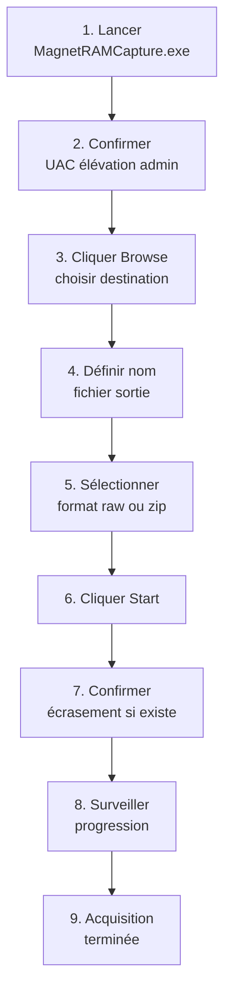
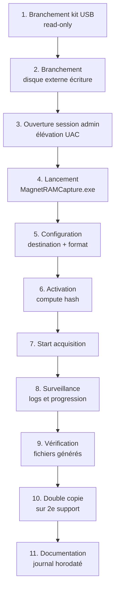

# 7.7 Magnet RAM Capture alternative

!!! quote "L'analogie de l'outil universel sur le banc d'établi"

    Un menuisier amateur achète des outils spécialisés pour chaque tâche. Une scie pour ceci, une autre pour cela, une fraiseuse, une défonceuse, une affleureuse. Sa cave déborde. Un menuisier professionnel a au contraire un nombre réduit d'outils universels, choisis pour leur polyvalence et leur fiabilité. Il connaît chacun parfaitement et obtient des résultats supérieurs avec moins de matériel. Magnet RAM Capture occupe cette place dans le kit DFIR moderne. Il ne fait pas tout, mais il fait l'acquisition mémoire mieux et plus simplement que la plupart des alternatives. Maintenance active, interface claire, logs intégrés, compatibilité testée sur les Windows récents. Si vous ne deviez avoir qu'un seul outil d'acquisition mémoire dans votre kit en 2026, ce serait celui-ci.

## Métadonnées du chapitre

Ce chapitre couvre l'outil de référence du kit DFIR 2026. Voici ses caractéristiques.

| Champ | Valeur |
|---|---|
| Durée estimée | 2 heures |
| Niveau | Pratique |
| Prérequis | 7.5 (kit USB préparé), 7.6 (DumpIt pour comparaison) |
| Livrables | Magnet RAM Capture intégré au kit, test sur VM réussi |
| Auto-explication | 8 minutes |

## Objectifs pédagogiques

À l'issue de ce chapitre, vous serez capable de :

- Présenter Magnet RAM Capture et son éditeur
- Lancer une acquisition en moins de 60 secondes
- Comprendre les options de configuration
- Lire les logs d'acquisition
- Choisir entre formats de sortie selon contexte
- Justifier le choix de cet outil comme référence
- Diagnostiquer les échecs courants

---

## 1. Présentation et contexte

Magnet RAM Capture est l'outil d'acquisition mémoire produit par **Magnet Forensics**, l'un des leaders mondiaux du DFIR commercial.

### 1.1 Magnet Forensics

Voici le contexte de l'éditeur.

| Caractéristique | Valeur |
|---|---|
| Origine | Canada |
| Année fondation | 2010 |
| Produits phares | AXIOM, AUTOMATE, RAM Capture |
| Acquisitions récentes | Comae Technologies (2020) |
| Position marché | Top 5 mondial DFIR commercial |
| Clientèle type | Forces de l'ordre, grandes entreprises, CERT |

### 1.2 Position de RAM Capture dans le portefeuille

Magnet Forensics propose plusieurs outils d'acquisition. Voici leur positionnement.

| Outil | Type | Cible |
|---|---|---|
| Magnet AXIOM | Suite complète payante | Investigations approfondies |
| Magnet AUTOMATE | Automatisation cas | Volume haut de gamme |
| Magnet RAM Capture | Acquisition mémoire | Gratuit, large diffusion |
| Magnet ACQUIRE | Acquisition disque | Gratuit (variante) |
| Magnet IEF | Heritage | Précurseur AXIOM |

Magnet RAM Capture est gratuit et largement diffusé pour positionner la marque auprès des analystes.

### 1.3 Histoire et évolutions

Voici les évolutions principales de l'outil.

| Année | Évolution |
|---|---|
| 2014 | Première version publique |
| 2017 | Refonte interface |
| 2020 | Intégration des technologies Comae (Matthieu Suiche) |
| 2022 | Support Windows 11 22H2 |
| 2024 | Compatibilité ARM64 native |
| 2025 | Format AFF4 et logs JSON |
| 2026 | Maintenance active confirmée |

## 2. Caractéristiques techniques

### 2.1 Spécifications

Voici les spécifications techniques en 2026.

| Spécification | Valeur |
|---|---|
| Plateforme | Windows uniquement |
| Architectures | x86, x64, ARM64 |
| Versions Windows supportées | 7 (limité) à 11 24H2, Server 2019/2022/2025 |
| Format sortie principal | .raw (DD-style) |
| Formats supplémentaires | .zip compressé, .bin |
| Taille de l'application | ~30 Mo |
| Distribution | Installeur ou portable selon version |
| Privilèges requis | Administrateur |
| Interface | Graphique (GUI) |
| Licence | Gratuite (enregistrement requis) |

### 2.2 Format raw (DD)

Le format raw est le format brut historique. Voici ses caractéristiques.

```text
FORMAT RAW (DD)
=================

Description
  Copie bit à bit de la mémoire physique
  Pas d'en-tête ni de métadonnées
  Ratio dump/RAM : 1.0 strict

Avantages
  Compatible avec presque tous les analyseurs
  Volatility 2 et 3 sans conversion
  Outils Linux (xxd, hexdump) directement
  Format ouvert, pas de dépendance vendeur

Inconvénients
  Volume volumineux (RAM × 1.0)
  Pas de métadonnées système intégrées
  Pas de compression intégrée
  Identification du système nécessite contexte
```

### 2.3 Format ZIP compressé

Pour les contextes où l'espace est limité, l'option ZIP est utile.

```text
FORMAT ZIP COMPRESSÉ
======================

Description
  Format raw encapsulé dans un ZIP
  Compression DEFLATE standard
  Métadonnées d'acquisition incluses

Ratio compression typique
  16 Go RAM → 4 à 8 Go .zip selon contenu
  Variation forte selon entropie

Avantages
  Espace disque économisé
  Métadonnées préservées
  Hash inclus

Inconvénients
  Décompression nécessaire avant analyse
  Volatility ne lit pas directement le ZIP
  Temps acquisition légèrement supérieur
```

### 2.4 Métadonnées intégrées

Magnet RAM Capture génère plusieurs fichiers en parallèle du dump.

| Fichier | Contenu |
|---|---|
| `<hostname>-<timestamp>.raw` | Le dump mémoire brut |
| `<hostname>-<timestamp>.log` | Journal complet d'acquisition |
| `<hostname>-<timestamp>.txt` | Résumé exécutif texte |
| `<hostname>-<timestamp>.json` | Métadonnées structurées |

## 3. Téléchargement et installation

### 3.1 Source officielle

Le téléchargement officiel se fait via le site Magnet Forensics.

```text
TÉLÉCHARGEMENT MAGNET RAM CAPTURE
====================================

URL : https://www.magnetforensics.com/resources/magnet-ram-capture/

Procédure
  1. Renseigner formulaire (email professionnel)
  2. Confirmation par email
  3. Lien de téléchargement valide 24-48h
  4. Téléchargement de l'installeur

Vérifications post-téléchargement
  - Hash SHA-256 fourni par l'éditeur
  - Signature numérique Magnet Forensics
  - Taille cohérente (~30 Mo)
```

### 3.2 Vérification d'intégrité

Voici la procédure de vérification après téléchargement.

```powershell
# Vérification SHA-256
$file = "MagnetRAMCaptureSetup.exe"
$actual = (Get-FileHash $file -Algorithm SHA256).Hash
Write-Host "SHA-256 : $actual"

# Hash attendu fourni par l'éditeur (à récupérer page de download)
$expected = "RECUPERER_DEPUIS_PAGE_OFFICIELLE"

if ($actual -eq $expected) {
    Write-Host "[OK] Hash validé"
} else {
    Write-Host "[REJET] Hash divergent"
}

# Vérification signature numérique
$sig = Get-AuthenticodeSignature $file
$sig | Format-List Status, SignerCertificate

# Doit afficher
# Status            : Valid
# SignerCertificate : ... Magnet Forensics ...
```

### 3.3 Mode portable vs installé

Magnet RAM Capture peut être utilisé selon deux modes.

| Mode | Avantage | Inconvénient |
|---|---|---|
| Installé | Intégration Windows | Modifie le système cible |
| Portable | Aucune modification cible | Préparation préalable |

**Pour DFIR, le mode portable est obligatoire**. Il existe deux approches.

```text
PRÉPARATION MODE PORTABLE
============================

Approche 1 - Installation puis copie
  1. Installer Magnet RAM Capture sur poste analyste
  2. Localiser dossier d'installation
     Typiquement C:\Program Files\Magnet RAM Capture\
  3. Copier intégralement vers kit USB
  4. Tester depuis USB sans installation

Approche 2 - Extraction de l'installeur
  1. Extraction binaires depuis l'installeur
     7-Zip permet d'extraire le contenu MSI/EXE
  2. Récupérer fichier exécutable principal
  3. Test de portabilité (DLL associées)
```

### 3.4 Intégration kit USB

Une fois validé, intégrer au kit selon la structure du chapitre 7.5.

```text
EMPLACEMENT DANS LE KIT
=========================

E:\01-Acquisition-Memoire\MagnetRAMCapture\
  MagnetRAMCapture.exe          (binaire principal)
  *.dll                          (dépendances)
  README-Magnet.txt              (notes locales)
  VERSION.txt                    (version + date intégration)
  HASH.txt                       (hashes de tous les fichiers)
```

### 3.5 Mise à jour MANIFEST kit

Après intégration, régénération du MANIFEST global.

```powershell
# Régénération MANIFEST kit complet
.\generate-manifest.ps1 -KitRoot E:\
```

## 4. Interface utilisateur

### 4.1 Vue principale

L'interface graphique de Magnet RAM Capture est volontairement simple. Voici ses zones principales.

| Zone | Contenu |
|---|---|
| Barre titre | Nom et version de l'outil |
| Champ destination | Path complet du fichier de sortie |
| Bouton Browse | Sélection emplacement |
| Choix de format | .raw / .zip selon version |
| Segment size | Pour fichiers découpés (rare) |
| Bouton Start | Lancement acquisition |
| Zone progression | Pourcentage et durée |
| Logs | Sortie temps réel |

### 4.2 Pas à pas interface

Voici la séquence d'utilisation typique de l'interface.



### 4.3 Conventions de nommage

Voici les conventions de nommage recommandées pour vos fichiers.

```text
CONVENTION DE NOMMAGE OmnyAcademy
====================================

Format
  <hostname>-<timestamp>.raw

Exemple
  WIN-COMPTA-01-20260430-143215.raw

Composants
  hostname    : nom du poste (env:COMPUTERNAME)
  timestamp   : YYYYMMDD-HHMMSS heure UTC
  extension   : .raw ou .zip selon format

Avantages
  - Tri alphanumérique cohérent
  - Identifiable sans contexte
  - Compatible filesystems Windows et Linux
  - Pas d'espaces ni caractères spéciaux
```

## 5. Configuration et options

### 5.1 Options principales

Voici les options principales accessibles dans l'interface.

| Option | Effet |
|---|---|
| Output path | Destination du fichier |
| Format | raw / zip / autre selon version |
| Segment size | Découpage en plusieurs fichiers |
| Compute hash | Hash automatique post-acquisition |
| Compression | Niveau (zip uniquement) |

### 5.2 Découpage en segments

Le découpage en segments permet de gérer les filesystems FAT32 (limite 4 Go).

```text
DÉCOUPAGE EN SEGMENTS
========================

Cas d'usage
  - Disque de destination en FAT32
  - Transfert vers stockage cloud avec limite
  - Distribution multi-supports physiques

Configuration
  Segment size : 4096 MB (FAT32)
  Segment size : 0 (pas de découpage, recommandé exFAT/NTFS)

Génération
  ramcap-001.raw
  ramcap-002.raw
  ramcap-003.raw
  ...

Reconstitution
  copy /B ramcap-*.raw memdump.raw
```

### 5.3 Hash automatique

Magnet RAM Capture peut calculer le hash automatiquement après acquisition.

```text
HASH AUTOMATIQUE
==================

Configuration
  Cocher "Compute hash" dans l'interface

Algorithmes disponibles selon version
  - MD5 (rapide, pas recommandé seul)
  - SHA-1 (rapide, pas recommandé seul)
  - SHA-256 (recommandé OmnyAcademy)
  - SHA-512 (alternative)

Génération
  Crée un fichier .hash à côté du dump
  Format : <algo>: <hash>  <fichier>
```

### 5.4 Configuration ligne de commande

Pour les contextes scriptés, Magnet RAM Capture supporte certains paramètres en ligne de commande.

```powershell
# Exemple - syntaxe variable selon version
MagnetRAMCapture.exe `
    /OutputPath "F:\acquisitions\WIN-COMPTA-01-20260430-143215.raw" `
    /Format "raw" `
    /ComputeHash "SHA256" `
    /Silent

# Note : la syntaxe exacte varie. Consulter la documentation
# de la version utilisée pour les paramètres précis.
```

## 6. Workflow d'acquisition

### 6.1 Procédure standard

Voici la procédure standard d'acquisition.



### 6.2 Fichiers générés post-acquisition

Voici l'inventaire type après acquisition.

```text
FICHIERS GÉNÉRÉS - EXEMPLE
============================

F:\acquisitions\incident-2026-001\
  WIN-COMPTA-01-20260430-143215.raw      (16 Go - dump principal)
  WIN-COMPTA-01-20260430-143215.log      (journal acquisition)
  WIN-COMPTA-01-20260430-143215.json     (métadonnées structurées)
  WIN-COMPTA-01-20260430-143215.hash     (SHA-256 généré)

Vérifications
  - Taille .raw cohérente avec RAM (= taille RAM physique)
  - Log sans erreur ni warning
  - Hash dans .hash correspond à celui calculé indépendamment
  - JSON valide (parsing OK)
```

### 6.3 Lecture du log

Le fichier log contient des informations précieuses. Voici un extrait type.

```text
EXTRAIT LOG MAGNET RAM CAPTURE
=================================

[2026-04-30 14:32:15] Magnet RAM Capture v1.20
[2026-04-30 14:32:15] Operating System: Windows 11 22H2 (Build 22621)
[2026-04-30 14:32:15] System architecture: x64
[2026-04-30 14:32:15] Total physical memory: 17179869184 bytes (16 GB)
[2026-04-30 14:32:15] Free physical memory: 8589934592 bytes (8 GB)
[2026-04-30 14:32:15] Output path: F:\acquisitions\...
[2026-04-30 14:32:15] Output format: raw
[2026-04-30 14:32:15] Hash algorithm: SHA-256
[2026-04-30 14:32:16] Acquisition started
[2026-04-30 14:35:43] Acquisition completed successfully
[2026-04-30 14:35:43] Bytes captured: 17179869184
[2026-04-30 14:35:43] Duration: 207 seconds
[2026-04-30 14:35:43] Throughput: 78.94 MB/s
[2026-04-30 14:35:50] SHA-256: a1b2c3d4...
[2026-04-30 14:35:50] Acquisition finalized
```

### 6.4 Validation post-acquisition

Voici les vérifications à effectuer après chaque acquisition.

```powershell
# Vérifications automatiques
$dumpFile = "F:\acquisitions\WIN-COMPTA-01-20260430-143215.raw"
$logFile = "$dumpFile.log"
$hashFile = "$dumpFile.hash"

# Test 1 - Existence des fichiers
if (-not (Test-Path $dumpFile)) {
    Write-Host "[ECHEC] Fichier dump absent"
    exit 1
}

# Test 2 - Taille cohérente avec RAM
$ramSize = (Get-WmiObject Win32_ComputerSystem).TotalPhysicalMemory
$dumpSize = (Get-Item $dumpFile).Length
$ratio = $dumpSize / $ramSize
Write-Host "Ratio dump/RAM : $ratio"
# Pour raw : ratio attendu strictement 1.0

# Test 3 - Hash correspond
$expected = (Get-Content $hashFile -Raw).Trim()
$actual = (Get-FileHash $dumpFile -Algorithm SHA256).Hash
if ($expected -match $actual) {
    Write-Host "[OK] Hash cohérent"
} else {
    Write-Host "[ECHEC] Hash divergent"
}

# Test 4 - Log sans erreur
$logContent = Get-Content $logFile
$errors = $logContent | Where-Object { $_ -match "ERROR|FAIL|warning" }
if ($errors) {
    Write-Host "[ATTENTION] Errors dans log :"
    $errors | ForEach-Object { Write-Host $_ }
}
```

## 7. Compatibilité Windows 2026

Magnet RAM Capture est l'outil le mieux maintenu pour les Windows récents en 2026.

### 7.1 Matrice de compatibilité

Voici la matrice de compatibilité testée.

| Version Windows | Compatibilité | Notes |
|---|---|---|
| Windows 7 SP1 | Limitée | Versions anciennes uniquement |
| Windows 8.1 | Bonne | Mais OS quasi-disparu |
| Windows 10 1809 | Excellente | LTSC fréquent |
| Windows 10 22H2 | Excellente | Support standard |
| Windows 11 22H2 | Excellente | Référence actuelle |
| Windows 11 23H2 | Excellente | |
| Windows 11 24H2 | Excellente | |
| Server 2016 | Bonne | |
| Server 2019 | Excellente | |
| Server 2022 | Excellente | |
| Server 2025 | À valider 2026 | |

### 7.2 Considérations spéciales VBS / HVCI

Sur les systèmes avec sécurité avancée, certaines limitations s'appliquent.

```text
LIMITATIONS VBS / HVCI / CREDENTIAL GUARD
============================================

Virtualization-Based Security (VBS)
  Mémoire kernel partiellement isolée par hyperviseur Hyper-V
  Magnet RAM Capture acquiert la RAM physique standard
  Zones VBS techniquement présentes mais peu exploitables sans plugins spéciaux

Hypervisor-protected Code Integrity (HVCI)
  Pas d'impact sur l'acquisition elle-même
  Impact sur l'analyse a posteriori (intégrité kernel signée)

Credential Guard
  Secrets isolés dans LSAIso
  Acquisition normale mais hashes / mots de passe inaccessibles en clair
  Conséquence pour DFIR : moins d'exploitation post-acquisition

Recommandation
  Tester en lab sur la version exacte avant intervention
  Documenter la configuration sécurité du poste cible
  Adapter l'analyse Volatility selon présence VBS
```

### 7.3 Compatibilité ARM64

Depuis 2024, support natif ARM64 (Surface Pro X, certains laptops Snapdragon).

| Aspect ARM64 | Statut |
|---|---|
| Acquisition mémoire | OK depuis v1.18+ |
| Volatility 3 ARM64 | Support croissant |
| Volatility 2 ARM64 | Très limité |
| Symboles disponibles | Augmentation graduelle |

## 8. Comparaison avec alternatives

### 8.1 Tableau comparatif détaillé

Voici la comparaison détaillée des outils principaux.

| Critère | Magnet RAM Capture | DumpIt | FTK Imager | WinPmem |
|---|---|---|---|---|
| Maintenance 2026 | Excellente | Limitée | Active | Active |
| Interface | GUI claire | CLI minimal | GUI complexe | CLI |
| Formats | raw, zip, AFF4 | crashdump | multiples | raw, AFF4 |
| Logs | Très détaillés | Minimaux | Bons | Bons |
| Open source | Non | Non | Non | Oui |
| Taille kit | ~30 Mo | ~500 Ko | ~100 Mo | ~5 Mo |
| Compatibilité Win 11 24H2 | Excellente | À valider | Bonne | Bonne |
| Hash automatique | Oui | Non | Oui | Manuel |
| Découpage segments | Oui | Non | Oui | Oui |
| Documentation | Très bonne | Réduite | Bonne | Communauté |

### 8.2 Pourquoi outil de référence en 2026

Plusieurs raisons font de Magnet RAM Capture l'outil de référence.

| Raison | Détail |
|---|---|
| Maintenance active | Mises à jour régulières par Magnet Forensics |
| Communauté large | Adoption mondiale par forces de l'ordre |
| Documentation officielle | Support documenté |
| Compatibilité Windows récents | Tests Microsoft Insider |
| Logs intégrés excellents | Forensic-grade par construction |
| Standardisation kit | Norme de fait dans les CSIRT |

### 8.3 Quand préférer une alternative

Voici les cas où préférer un autre outil.

| Situation | Outil préféré | Raison |
|---|---|---|
| Open source impératif | WinPmem | Code auditable |
| Très ancien Windows (XP) | DumpIt v1 ou Win64dd | Compatibilité legacy |
| Pas d'enregistrement possible | DumpIt si déjà obtenu | Pas de form gating |
| Suite forensic complète | FTK Imager | Multi-acquisitions |
| Très gros volume (TB) | Outil spécialisé | Performance |

## 9. Cas pratique - Acquisition lab ARTECH

### 9.1 Scénario

Vous testez Magnet RAM Capture sur la VM Windows 11 du lab ARTECH simulant un poste utilisateur.

### 9.2 Préparation

Voici la préparation à effectuer avant l'acquisition.

```powershell
# Sur la VM Windows 11 cible

# Création contexte mémoire riche pour tester
notepad C:\Users\Public\Documents\note-importante.txt
calc.exe
mspaint.exe

# Vérifier RAM physique (pour valider taille dump)
$ram = (Get-WmiObject Win32_ComputerSystem).TotalPhysicalMemory
Write-Host "RAM physique : $($ram / 1GB) Go"

# Vérifier processus actifs pour comparer post-Volatility
Get-Process | Sort-Object WS -Descending | Select-Object -First 15 |
    Format-Table -AutoSize Name, Id, WS

# Vérifier connexions réseau actives
Get-NetTCPConnection -State Established |
    Select-Object LocalAddress, RemoteAddress, RemotePort
```

### 9.3 Acquisition

Voici la procédure d'acquisition complète.

```powershell
# Branchement kit USB sur la VM (USB pass-through)
# Branchement disque externe pour destination (USB pass-through)

# Lancement Magnet RAM Capture
$magnetExe = "E:\01-Acquisition-Memoire\MagnetRAMCapture\MagnetRAMCapture.exe"
$timestamp = Get-Date -Format "yyyyMMdd-HHmmss"
$hostname = $env:COMPUTERNAME
$outputDir = "F:\acquisitions\test-magnet-$timestamp"
$dumpFile = "$outputDir\$hostname-$timestamp.raw"

New-Item -Path $outputDir -ItemType Directory -Force | Out-Null

# Lancement (interface graphique)
Start-Process $magnetExe

# Dans l'interface :
#   Output path : F:\acquisitions\test-magnet-<timestamp>\<hostname>-<timestamp>.raw
#   Format : raw
#   Compute hash : Yes (SHA-256)
#   Cliquer Start

# Surveiller la progression dans la fenêtre
# Durée typique 16 Go : 3 à 7 minutes
```

### 9.4 Validation Volatility

Une fois l'acquisition terminée, validation avec Volatility 3.

```bash
# Sur poste analyste Linux/Kali
cd ~/dfir/incident-2026-test

# Volatility 3 - informations système
vol -f WIN-COMPTA-01-20260430-143215.raw windows.info

# Sortie attendue
# Variable                Value
# Kernel Base             0x...
# DTB                     0x...
# Symbols                 file:///...
# Is64Bit                 True
# IsPAE                   False
# layer_name              0
# memory_layer            1
# KdVersionBlock          0x...
# Major/Minor             10.0
# MachineType             34404
# KeNumberProcessors      8
# SystemTime              2026-04-30 14:32:15
# NtSystemRoot            C:\Windows
# NtProductType           NtProductWinNt
# NtMajorVersion          10
# NtMinorVersion          0

# Volatility 3 - liste processus
vol -f *.raw windows.pslist

# Vérification que les processus lancés en préparation sont visibles :
#   notepad.exe
#   calc.exe
#   mspaint.exe
```

### 9.5 Documentation

Documentez le test dans votre journal de validation kit.

```text
TEST MAGNET RAM CAPTURE - LAB ARTECH 2026-04-30
==================================================

Cible : VM Windows 11 22H2 (4 Go RAM)
Outil : Magnet RAM Capture v1.20 (kit DFIR 2026.04)
Destination : F:\acquisitions\test-magnet-20260430-143215\

Résultats acquisition :
  Durée : 52 secondes
  Taille .raw : 4.00 Go (= RAM physique)
  Format : raw
  SHA-256 : a1b2c3...

Fichiers générés :
  WIN-COMPTA-01-20260430-143215.raw (4 Go)
  WIN-COMPTA-01-20260430-143215.log (4 Ko)
  WIN-COMPTA-01-20260430-143215.json (2 Ko)
  WIN-COMPTA-01-20260430-143215.hash (100 octets)

Validation Volatility 3 :
  windows.info : OK
  windows.pslist : OK (164 processus listés)
  windows.cmdline : OK
  
Processus de test confirmés :
  notepad.exe (PID 4521) - confirmé
  calc.exe (PID 4567) - confirmé
  mspaint.exe (PID 4623) - confirmé

Conclusion :
  Outil fonctionnel sur la cible.
  Performance excellente (78 Mo/s).
  Logs complets et exploitables.
  Confirmation : outil de référence du kit.
```

## 10. Bonnes pratiques

### 10.1 Pour la mission

Voici les bonnes pratiques opérationnelles.

| Pratique | Justification |
|---|---|
| Tester mensuellement en lab | Détection problème avant mission |
| Garder DumpIt en backup dans kit | Redondance critique |
| Activer Compute Hash systématiquement | Forensic non négociable |
| Vérifier compatibilité Windows cible | Test préalable si possible |
| Conserver les logs avec le dump | Traçabilité |
| Lancer d'abord, observer ensuite | Pas de configuration pendant acquisition |

### 10.2 Pour le kit

Voici les bonnes pratiques de maintenance.

| Pratique | Fréquence |
|---|---|
| Vérification version disponible | Trimestrielle |
| Test en lab Windows à jour | Mensuelle |
| Mise à jour si version critique | À la demande |
| Validation hash kit | Mensuelle |
| Backup version courante | Avant toute mise à jour |
| Documentation CHANGELOG | À chaque maj |

### 10.3 Bouton retour en cas d'échec

Si Magnet RAM Capture échoue, voici la séquence de fallback.

```text
SÉQUENCE DE FALLBACK
======================

Étape 1 - Magnet RAM Capture (premier choix)
  Si échec → étape 2

Étape 2 - DumpIt (rapide, simple)
  Si échec → étape 3

Étape 3 - WinPmem (open source robuste)
  Si échec → étape 4

Étape 4 - FTK Imager Lite (suite alternative)
  Si échec → analyse cause technique

Causes communes d'échec
  - Espace disque insuffisant
  - Antivirus quarantaine
  - HVCI strict bloque l'accès
  - Driver Windows récent incompatible
  - Mémoire physique très grande (>256 Go)
```

## 11. Pièges fréquents

Voici les erreurs courantes et leur évitement.

### 11.1 Pièges techniques

Voici les erreurs techniques fréquentes.

| Piège | Conséquence | Évitement |
|---|---|---|
| Antivirus bloque exe | Acquisition impossible | Whitelist préalable du kit |
| UAC non confirmé | Échec silencieux | Confirmer immédiatement |
| Disque destination plein | Acquisition tronquée | Vérifier espace en amont |
| Format ZIP sur Volatility 2 | Pas exploitable directement | Décompresser d'abord |
| Lancer depuis disque source | Modification preuve | Lancer depuis kit USB strictement |

### 11.2 Pièges méthodologiques

Voici les erreurs méthodologiques à éviter.

| Piège | Évitement |
|---|---|
| Pas de validation post-acquisition | Tester chaque dump avec Volatility |
| Pas de hash double-check | Hash indépendant + comparaison |
| Pas de double copie | Toujours 2 copies sur supports distincts |
| Pas de log conservé | Conserver .log avec le .raw |
| Pas de documentation | Journal horodaté immédiat |

## 12. Auto-évaluation

Vérifiez votre maîtrise par les questions suivantes.

| # | Question | Réponse |
|---|---|---|
| 1 | Éditeur de Magnet RAM Capture ? | Magnet Forensics |
| 2 | Format de sortie principal ? | .raw (DD-style) |
| 3 | Privilèges requis ? | Administrateur |
| 4 | Combien de fichiers générés ? | 4 (raw, log, json, hash) |
| 5 | Algorithme de hash recommandé ? | SHA-256 |
| 6 | Compatibilité Windows 11 24H2 ? | Excellente |
| 7 | Premier choix dans le kit ? | Oui (référence 2026) |
| 8 | Outil de fallback recommandé ? | DumpIt puis WinPmem |
| 9 | Mode nécessaire pour DFIR ? | Portable (pas installé) |
| 10 | Compatibilité ARM64 ? | Oui depuis v1.18+ |

## 13. Synthèse

Voici les points clés à retenir.

```text
MAGNET RAM CAPTURE - SYNTHÈSE

POSITIONNEMENT
  Outil de référence acquisition mémoire 2026
  Éditeur : Magnet Forensics
  Gratuit avec enregistrement
  Maintenance active confirmée
  Top kit DFIR international

CARACTÉRISTIQUES
  Format raw (DD) principal
  Format zip compressé optionnel
  Logs intégrés très complets
  Hash automatique (SHA-256 recommandé)
  Découpage en segments possible
  Compatible ARM64 depuis 2024

USAGE
  Interface graphique simple
  Browse → choisir destination
  Compute hash : oui
  Format : raw
  Start
  Surveillance progression
  Génération 4 fichiers (raw, log, json, hash)

WORKFLOW
  1. Branchement kit + disque externe
  2. Lancement en admin
  3. Configuration GUI
  4. Hash actif
  5. Start acquisition
  6. Validation post (Volatility info)
  7. Double copie
  8. Documentation

COMPATIBILITÉ 2026
  Win 7-8 : limitée
  Win 10/11 : excellente
  Server 2016-2025 : bonne à excellente
  ARM64 : OK depuis 2024
  VBS/HVCI : acquisition OK, analyse limitée

INTÉGRATION KIT DFIR
  Premier choix dans le kit
  DumpIt en backup secondaire
  WinPmem en option open source
  Test mensuel en lab
  Mise à jour trimestrielle

VALIDATION POST
  Volatility 3 : windows.info
  Volatility 3 : windows.pslist
  Hash indépendant SHA-256
  Lecture log pour cohérence

LOGS
  Format texte structuré
  Métadonnées système complètes
  Durée et débit
  Hash automatique
  Conservation OBLIGATOIRE avec dump

POSITION OmnyAcademy
  Outil de référence à privilégier
  Documentation systématique
  Test régulier en lab
  Maintenance kit prioritaire
```

---

**Chapitre précédent** : [7.6 DumpIt Comae usage et limites](7-6-dumpit-comae.md)

**Chapitre suivant** : [7.8 FTK Imager Lite portable](7-8-ftk-imager-lite.md)