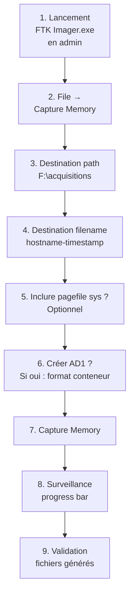

# 7.8 FTK Imager Lite portable

!!! quote "L'analogie de la radio multi-bandes du marin"

    Sur un voilier au large, le navigateur expérimenté garde toujours une radio multi-bandes capable de capter VHF, ondes courtes, météo, AIS et radio-amateurs. Ce n'est pas la meilleure radio dans aucune de ces catégories. Mais quand un fabricant cesse de fabriquer son modèle dédié, quand une bande change, quand on doit improviser un appel de détresse, cette radio universelle est là, fiable, ne nécessitant aucune connexion Internet. FTK Imager occupe la même place dans le kit DFIR. Il n'est ni le plus rapide en acquisition mémoire, ni le plus moderne en analyse, ni le plus avancé en validation. Mais il fait à peu près tout, depuis quinze ans, sur toutes les versions de Windows, dans toutes les conditions. Quand l'outil spécialisé refuse de démarrer, FTK Imager reste opérationnel. Cette polyvalence et cette fiabilité justifient sa présence dans tout kit professionnel.

## Métadonnées du chapitre

Ce chapitre couvre un outil polyvalent essentiel. Voici ses caractéristiques.

| Champ | Valeur |
|---|---|
| Durée estimée | 2 heures |
| Niveau | Pratique |
| Prérequis | 7.5 (kit USB), 7.6 et 7.7 pour comparaison |
| Livrables | FTK Imager Lite intégré au kit avec acquisition test |
| Auto-explication | 8 minutes |

## Objectifs pédagogiques

À l'issue de ce chapitre, vous serez capable de :

- Présenter FTK Imager et son histoire
- Distinguer FTK Imager Lite et FTK Imager standard
- Acquérir la mémoire vive avec FTK Imager
- Lire une image forensique existante
- Comprendre les formats E01 / EWF
- Choisir entre FTK Imager et alternatives selon contexte
- Diagnostiquer les principales causes d'échec

---

## 1. Présentation et histoire

FTK Imager fait partie de la suite **Forensic Toolkit** historique, l'un des piliers du DFIR commercial depuis 2002.

### 1.1 Histoire et évolutions

Voici les étapes principales de l'histoire de FTK Imager.

| Année | Événement |
|---|---|
| 2002 | Création de Forensic Toolkit (FTK) par AccessData |
| 2005 | Sortie de FTK Imager comme outil dédié |
| 2010 | Version Lite portable distribuée |
| 2017 | Acquisition AccessData par Sysco |
| 2020 | AccessData devient partie de Exterro |
| 2024 | Modernisation interface, support Windows 11 |
| 2026 | Maintenance active confirmée |

### 1.2 Distinctions FTK Imager versions

Plusieurs versions de FTK Imager coexistent. Voici leur distinction.

| Version | Portable | Caractéristiques |
|---|---|---|
| FTK Imager (standard) | Non | Installation requise, suite complète |
| FTK Imager Lite | Oui | Version portable depuis USB |
| FTK Imager CLI | Variable | Ligne de commande pour scripts |
| FTK | Non | Suite payante complète |

**Pour le kit DFIR**, c'est la version **FTK Imager Lite** qui est utilisée.

### 1.3 Position dans le portefeuille Exterro

Voici la place de FTK Imager dans l'offre Exterro.

| Outil | Type | Statut |
|---|---|---|
| FTK Imager | Acquisition + lecture | Gratuit |
| FTK | Suite analyse complète | Commercial |
| FTK Lab | Plateforme collaborative | Commercial |
| Quin-C | Workflow web | Commercial |
| AD eDiscovery | E-discovery | Commercial |

FTK Imager joue le rôle de **point d'entrée gratuit** dans l'écosystème.

## 2. Caractéristiques techniques

### 2.1 Spécifications

Voici les spécifications techniques de FTK Imager Lite en 2026.

| Spécification | Valeur |
|---|---|
| Plateforme | Windows uniquement |
| Architectures | x86 et x64 |
| Versions Windows supportées | 7 à 11 24H2, Server 2008 à 2025 |
| Fonctions principales | Acquisition mémoire, acquisition disque, lecture d'images |
| Formats acquisition | RAW (DD), E01, AFF, AD1 |
| Taille du dossier portable | ~100 Mo |
| Distribution | Lite : ZIP portable, Standard : installeur |
| Privilèges requis | Administrateur |
| Interface | GUI Windows native |
| Licence | Gratuite (registration) |

### 2.2 Polyvalence des usages

Ce qui distingue FTK Imager des outils dédiés est sa **polyvalence**.

| Fonction | FTK Imager | DumpIt | Magnet RAM | dc3dd |
|---|---|---|---|---|
| Acquisition mémoire | Oui | Oui | Oui | Non |
| Acquisition disque | Oui | Non | Non | Oui |
| Lecture image | Oui | Non | Non | Non |
| Conversion format | Oui | Non | Non | Limité |
| Vue arborescente | Oui | Non | Non | Non |
| Extraction fichiers | Oui | Non | Non | Non |
| Création hash | Oui | Limité | Oui | Oui |

### 2.3 Formats supportés

FTK Imager comprend les principaux formats forensiques. Voici la liste.

| Format | Lecture | Écriture | Description |
|---|---|---|---|
| RAW (DD) | Oui | Oui | Brut bit à bit |
| E01 (EWF Expert Witness) | Oui | Oui | Standard EnCase compressé |
| Ex01 | Oui | Oui | Format EWF étendu |
| AFF | Oui | Oui | Advanced Forensic Format |
| AD1 | Oui | Oui | Format AccessData natif |
| L01 | Oui | Non | EnCase logical |
| ISO/CD | Oui | Non | Images optiques |
| VMDK | Oui | Non | Disques virtuels VMware |
| VHD/VHDX | Oui | Non | Disques virtuels Microsoft |

### 2.4 Format E01 / EWF

Le format **E01** (Expert Witness Format) est le standard de fait du DFIR.

```text
FORMAT E01 / EWF
==================

Caractéristiques
  - Compression intégrée (LZ adaptive)
  - Hashes intégrés (MD5 + SHA-1)
  - Métadonnées : examiner, case number, notes
  - Découpage automatique en segments
  - Vérification d'intégrité native

Avantages
  - Compression typique 30-50% selon contenu
  - Auto-vérification de l'intégrité au montage
  - Standard reconnu par tribunaux internationaux
  - Compatibilité multi-outils (EnCase, X-Ways, FTK)

Inconvénients
  - Format propriétaire à l'origine (mais documenté)
  - Décompression nécessaire pour outils ne supportant pas
  - Volatility ne lit pas E01 directement (conversion nécessaire)
```

## 3. Téléchargement et installation

### 3.1 Source officielle

Le téléchargement officiel se fait via Exterro.

```text
TÉLÉCHARGEMENT FTK IMAGER LITE
==================================

URL : https://www.exterro.com/ftk-imager

Procédure
  1. Renseigner formulaire (email professionnel)
  2. Confirmation email avec lien
  3. Téléchargement archive ZIP
  4. Vérification hash SHA-256

Versions disponibles
  - FTK Imager (installeur Windows)
  - FTK Imager Lite (ZIP portable)
  - FTK Imager Command Line

Pour kit DFIR : FTK Imager Lite (ZIP portable)
```

### 3.2 Vérification d'intégrité

Voici la procédure de vérification après téléchargement.

```powershell
# Vérification hash SHA-256
$file = "FTKImagerLite.zip"
$actual = (Get-FileHash $file -Algorithm SHA256).Hash
Write-Host "SHA-256 : $actual"

# Comparer avec hash officiel page de download
# (À récupérer depuis le formulaire de téléchargement)
$expected = "RECUPERER_DEPUIS_PAGE_OFFICIELLE"

if ($actual -eq $expected) {
    Write-Host "[OK] Hash validé"
} else {
    Write-Host "[REJET] Hash divergent - NE PAS UTILISER"
}

# Décompression dans le kit
Expand-Archive $file -DestinationPath "FTK_Imager_Lite"

# Vérification signature des binaires
Get-ChildItem "FTK_Imager_Lite\*.exe" | ForEach-Object {
    Get-AuthenticodeSignature $_ |
        Select-Object Path, Status, SignerCertificate
}
```

### 3.3 Intégration kit USB

Une fois validé, intégration au kit selon la structure du chapitre 7.5.

```text
EMPLACEMENT DANS LE KIT
=========================

E:\01-Acquisition-Memoire\FTK_Imager_Lite\
  FTK Imager.exe              (binaire principal)
  *.dll                        (dépendances)
  *.exe                        (utilitaires associés)
  README-FTK.txt               (notes locales)
  VERSION.txt                  (version + date intégration)
  HASH.txt                     (hashes des fichiers)

E:\02-Acquisition-Disque\FTK_Imager_Lite\
  (lien symbolique ou copie identique pour double usage)
```

### 3.4 Mise à jour MANIFEST kit

Après intégration, régénération du MANIFEST du kit.

```powershell
.\generate-manifest.ps1 -KitRoot E:\
```

## 4. Interface graphique

### 4.1 Vue principale

L'interface FTK Imager présente plusieurs zones. Voici son organisation.

| Zone | Contenu |
|---|---|
| Barre de menu | File, View, Mode, Help |
| Panneau gauche - Evidence Tree | Arborescence des éléments montés |
| Panneau droit haut - File List | Fichiers du dossier sélectionné |
| Panneau droit bas - Properties | Propriétés du fichier sélectionné |
| Panneau bas - Hex Viewer | Visualisation hexadécimale |

### 4.2 Menus principaux

Voici les menus principaux et leurs fonctions clés.

| Menu | Options principales |
|---|---|
| File | Add Evidence Item, Capture Memory, Create Disk Image, Image Mounting |
| View | Refresh, Zoom hex view |
| Mode | Filter, Hash Sets |
| Help | About, Documentation |

### 4.3 Première utilisation

Au lancement, vous arrivez sur une fenêtre vide. Voici les actions de démarrage typiques.

```text
PREMIÈRES ACTIONS
===================

Pour acquisition mémoire
  File → Capture Memory...

Pour acquisition disque
  File → Create Disk Image...

Pour lecture d'image existante
  File → Add Evidence Item...

Pour montage en lecteur
  File → Image Mounting...
```

## 5. Acquisition mémoire avec FTK Imager

### 5.1 Procédure complète

Voici la procédure d'acquisition mémoire pas à pas.



### 5.2 Options Capture Memory

Voici le détail des options disponibles dans la boîte de dialogue.

| Option | Effet |
|---|---|
| Destination path | Dossier de sortie |
| Destination filename | Nom de base du fichier |
| Include pagefile | Capture aussi le pagefile.sys |
| Create AD1 file | Génère un conteneur AD1 |

### 5.3 Inclusion du pagefile

L'option **Include pagefile** est précieuse. Voici pourquoi.

```text
PAGEFILE.SYS - INTÉRÊT FORENSIQUE
====================================

Le pagefile.sys contient les pages de mémoire virtuelle
swappées sur disque par Windows quand la RAM est saturée.

Ce qu'on peut y trouver
  - Fragments de processus arrêtés depuis longtemps
  - Données ayant transité par la RAM puis swappées
  - Mots de passe en clair temporairement
  - Clés de chiffrement
  - Données déchiffrées par BitLocker

Recommandation
  Activer "Include pagefile" en plus du dump RAM
  Augmente le volume mais améliore les chances
  d'extraction d'éléments précieux

Limitation
  Sur SSD avec TRIM, le pagefile peut être moins riche
  Sur Win11 avec compression mémoire, contenu différent
```

### 5.4 Format AD1

Le format **AD1** est le format conteneur d'AccessData.

```text
FORMAT AD1
============

Description
  Conteneur propriétaire AccessData
  Inclut métadonnées et hashes
  Compression possible

Avantages
  - Métadonnées intégrées
  - Standard chez utilisateurs FTK
  - Vérifications d'intégrité automatiques

Inconvénients
  - Volatility ne lit pas AD1 directement
  - Conversion nécessaire pour analyse externe
  - Adoption limitée hors écosystème AccessData

Recommandation OmnyAcademy
  Privilégier RAW pour acquisition mémoire
  AD1 utile uniquement si workflow Exterro complet
```

### 5.5 Fichiers générés

Voici les fichiers générés selon les options choisies.

```text
FICHIERS APRÈS ACQUISITION MÉMOIRE
=====================================

Avec format raw simple
  hostname-20260430-143215.mem
  hostname-20260430-143215.mem.txt    (résumé)

Avec pagefile inclus
  + pagefile.sys

Avec format AD1
  hostname-20260430-143215.ad1
  hostname-20260430-143215.ad1.txt
```

## 6. Acquisition disque (aperçu)

L'acquisition disque sera approfondie au module 8. Voici l'aperçu pour FTK Imager.

### 6.1 Lancement

```text
ACQUISITION DISQUE FTK IMAGER
================================

Menu : File → Create Disk Image

Choix de la source
  Physical Drive : disque entier (recommandé forensic)
  Logical Drive : partition (limité)
  Image File : fichier image existant
  Contents of a folder : dossier seul
  Fernico Device : matériel spécifique

Choix du format
  Raw (dd)
  SMART : format propriétaire
  E01 : EWF compressé (recommandé)
  AFF : Advanced Forensic Format
```

### 6.2 Métadonnées E01

Pour une acquisition E01, FTK Imager demande plusieurs métadonnées.

| Métadonnée | Usage |
|---|---|
| Case Number | Référence administrative |
| Evidence Number | Numéro de scellé |
| Examiner | Nom de l'analyste |
| Description | Contexte du disque |
| Notes | Observations particulières |

Ces métadonnées sont **intégrées au fichier E01** et lisibles par tout outil compatible.

### 6.3 Compression et fragmentation

Voici les options additionnelles pour E01.

```text
OPTIONS E01 AVANCÉES
=======================

Compression
  Niveau 0 : aucune (rapide, gros volume)
  Niveau 1 : faible (équilibré)
  Niveau 9 : maximum (lent, petit volume)
  Recommandé : 6 (défaut)

Fragmentation
  Image fragment size : 0 = un seul fichier
  Sinon : taille en MB (1500 par exemple pour DVD)
  Recommandé : 0 sur exFAT/NTFS

Hash Calculation
  MD5 : oui (rapide, vérification)
  SHA-1 : oui (recommandé)
  SHA-256 : pas natif E01, mais peut être ajouté

Verify after creation
  Cocher OBLIGATOIREMENT
  Vérifie l'intégrité après écriture
```

## 7. Lecture d'images existantes

FTK Imager excelle aussi pour la **lecture** d'images forensiques.

### 7.1 Ajout d'évidence

Voici la procédure pour explorer une image.

```text
LECTURE IMAGE FORENSIQUE
============================

Menu : File → Add Evidence Item

Source
  Physical Drive
  Logical Drive
  Image File              ← le plus courant
  Contents of a folder

Source File
  Sélectionner le fichier .E01, .raw, .ad1...
  FTK Imager détecte automatiquement le format

Mounting
  L'image est ajoutée à l'Evidence Tree à gauche
  Naviguer comme dans un explorateur Windows
```

### 7.2 Navigation dans l'image

Une fois l'image montée, vous pouvez explorer son contenu.

| Action | Effet |
|---|---|
| Double-clic dossier | Naviguer dedans |
| Clic droit fichier | Menu contextuel (export, hash) |
| Sélection fichier | Affichage propriétés et hex |
| Filter | Filtrer par type/extension |
| Recursive search | Recherche profonde |

### 7.3 Extraction de fichiers

Vous pouvez extraire des fichiers depuis l'image vers votre poste analyste.

```text
EXTRACTION DE FICHIERS
=========================

Procédure
  Clic droit sur fichier ou dossier
  → Export Files...
  Choisir destination
  Extraction vers le filesystem analyste

Conservation forensique
  Hash MD5/SHA1 conservés en métadonnées
  Permissions originales préservées si possible
  Timestamps conservés (modification originale)

Cas d'usage type
  - Extraire un fichier suspect pour analyse VirusTotal
  - Récupérer logs Windows pour parsing
  - Sortir des artefacts utilisateur (NTUSER.DAT, etc.)
```

### 7.4 Vue hexadécimale

La vue hexadécimale en bas est précieuse pour l'analyse fine.

```text
USAGE VUE HEXADÉCIMALE
=========================

Cas d'usage
  - Vérification signatures de fichiers (magic bytes)
  - Lecture brute de zones sans format
  - Identification de fichiers sans extension
  - Recherche de patterns (clés crypto, URL...)

Recherche
  Edit → Find (Ctrl+F)
  Recherche en hex ou ASCII
  Très utile pour repérer URL, emails, mots de passe
```

## 8. Acquisition mémoire avec FTK Imager - cas pratique

### 8.1 Scénario

Vous testez FTK Imager Lite pour acquisition mémoire sur la VM ARTECH lab.

### 8.2 Procédure

Voici la séquence complète à suivre.

```powershell
# Préparation - lancement depuis le kit
$ftkPath = "E:\01-Acquisition-Memoire\FTK_Imager_Lite\FTK Imager.exe"
$timestamp = Get-Date -Format "yyyyMMdd-HHmmss"
$outputDir = "F:\acquisitions\test-ftk-$timestamp"

New-Item -Path $outputDir -ItemType Directory -Force | Out-Null

# Lancement (interface graphique)
Start-Process $ftkPath -Verb RunAs

# Dans l'interface :
#   1. File → Capture Memory
#   2. Destination path : F:\acquisitions\test-ftk-<timestamp>\
#   3. Destination filename : WIN-COMPTA-01-<timestamp>
#   4. Cocher "Include pagefile"
#   5. Décocher "Create AD1" (raw + pagefile suffit)
#   6. Capture Memory
#   7. Surveiller progression
```

### 8.3 Hash post-acquisition

FTK Imager ne calcule pas systématiquement le hash en sortie. Calcul manuel.

```powershell
# Hash systématique post-acquisition
Get-ChildItem "$outputDir\*.mem","$outputDir\*.sys" | ForEach-Object {
    $hash = (Get-FileHash $_.FullName -Algorithm SHA256).Hash
    "$hash  $($_.Name)"
} | Out-File "$outputDir\MANIFEST.sha256"

Write-Host "Manifest généré"
Get-Content "$outputDir\MANIFEST.sha256"
```

### 8.4 Validation Volatility

Test du dump avec Volatility 3.

```bash
# Sur poste analyste
cd ~/dfir/test-ftk

# Volatility 3 - info système
vol -f WIN-COMPTA-01-20260430-143215.mem windows.info

# Test pslist
vol -f WIN-COMPTA-01-20260430-143215.mem windows.pslist

# Si pagefile inclus, peut être référencé séparément
# selon la version Volatility
```

## 9. Comparaison avec alternatives

### 9.1 FTK Imager vs Magnet RAM Capture

Voici la comparaison directe sur l'usage acquisition mémoire.

| Critère | FTK Imager Lite | Magnet RAM Capture |
|---|---|---|
| Spécialité | Polyvalent (mem + disk + lecture) | Mémoire dédiée |
| Vitesse acquisition mémoire | Moyenne | Rapide |
| Logs intégrés | Limités (.txt) | Très détaillés |
| Hash automatique | Non (manuel) | Oui (configurable) |
| Pagefile inclus | Option intégrée | Non |
| Interface | Riche, plusieurs fonctions | Minimaliste, focus |
| Taille kit | ~100 Mo | ~30 Mo |
| Cas d'usage privilégié | Multi-tâches | Mémoire pure |

### 9.2 Quand préférer FTK Imager

Voici les situations où FTK Imager est le choix optimal.

| Situation | Justification |
|---|---|
| Acquisition mémoire + pagefile | Option native combinée |
| Lecture d'images existantes | Visualisation arborescente |
| Acquisition disque sans dc3dd | Format E01 supporté |
| Conversion entre formats | Multi-formats natifs |
| Exploration rapide d'evidence | Vue hex et arborescente |
| Workflow déjà AccessData/Exterro | Continuité écosystème |

### 9.3 Quand préférer une alternative

Voici les situations où une alternative est plus adaptée.

| Situation | Outil préféré |
|---|---|
| Acquisition mémoire urgente | DumpIt ou Magnet RAM Capture |
| Logs détaillés requis | Magnet RAM Capture |
| Open source impératif | WinPmem |
| Acquisition disque pure | dc3dd ou Guymager |
| Pas d'enregistrement possible | DumpIt |

## 10. Bonnes pratiques

### 10.1 Pour le kit

Voici les bonnes pratiques pour intégration kit.

| Pratique | Justification |
|---|---|
| Avoir FTK Imager dans /01- ET /02- | Polyvalent mémoire + disque |
| Tester chaque trimestre | Compatibilité OS |
| Mettre à jour les versions | Sécurité et compatibilité |
| Conserver une version stable | Si nouvelle pose problème |
| Hash systématique post-acquisition | Pas auto par défaut |

### 10.2 Pour la mission

Voici les bonnes pratiques opérationnelles.

| Pratique | Justification |
|---|---|
| Ne pas utiliser comme primaire mémoire | Magnet RAM Capture mieux adapté |
| Privilégier FTK pour disque + lecture | Force de l'outil |
| Documenter case number et examiner | Métadonnées E01 |
| Activer Verify after creation | E01 vérifié à la création |
| Conserver le fichier .txt résumé | Métadonnées textuelles |

### 10.3 Workflow recommandé

Voici le workflow recommandé pour FTK Imager dans le kit.

```text
WORKFLOW RECOMMANDÉ
======================

Acquisition mémoire prioritaire
  → Magnet RAM Capture (premier choix)
  → DumpIt (backup rapide)
  → FTK Imager (si besoin pagefile combiné)

Acquisition disque
  → FTK Imager Lite (premier choix)
  → dc3dd (Linux/portable Linux)
  → Guymager (Linux dédié)

Lecture images
  → FTK Imager (premier choix)
  → Autopsy (analyse approfondie)
  → X-Ways (commercial premium)

Conversion formats
  → FTK Imager (interface)
  → ewfexport (Linux CLI)
```

## 11. Pièges fréquents

Voici les erreurs courantes à anticiper.

### 11.1 Pièges techniques

Voici les erreurs techniques fréquentes.

| Piège | Conséquence | Évitement |
|---|---|---|
| Lancement sans admin | Capture mémoire échoue | Verb RunAs systématique |
| Espace destination insuffisant | Acquisition tronquée | Vérifier en amont |
| Pagefile trop volumineux | Surprise sur volume | Calcul total avant |
| Format AD1 sans contexte | Volatility incompatible | Privilégier raw |
| Antivirus marque comme outil dual-use | Outil bloqué | Whitelist préalable |

### 11.2 Pièges méthodologiques

Voici les erreurs méthodologiques à éviter.

| Piège | Évitement |
|---|---|
| Hash oublié post-acquisition | Procédure systématique manuelle |
| Métadonnées E01 vagues | Renseigner case/examiner précisément |
| Pas de vérification E01 | Verify after creation toujours |
| Confusion mode portable / installé | Toujours utiliser FTK Imager Lite |
| Pas de test régulier | Test trimestriel obligatoire |

## 12. Cas d'usage privilégiés

### 12.1 Lecture d'image E01 reçue d'un tiers

Scenario type : un partenaire vous envoie une image E01.

```text
SCÉNARIO LECTURE E01 EXTERNE
===============================

Réception
  - Image E01 + hash de référence
  - Métadonnées (case, examiner...)

Procédure FTK Imager
  1. Vérifier hash du fichier reçu
     Get-FileHash file.E01 -Algorithm SHA256
  2. Lancer FTK Imager Lite
  3. File → Add Evidence Item → Image File
  4. Sélectionner le fichier .E01
  5. Verification → Verify Image (intégrité E01 native)
  6. Navigation dans l'arborescence

Avantage
  - Pas besoin de monter l'image
  - Lecture en read-only par construction
  - Métadonnées E01 visibles
```

### 12.2 Acquisition disque externe USB suspect

Scenario type : un disque USB suspect est apporté pour analyse.

```text
SCÉNARIO ACQUISITION USB SUSPECT
==================================

Préparation
  - Write-blocker hardware obligatoire
  - Disque destination distinct

Procédure FTK Imager
  1. Brancher USB suspect via write-blocker
  2. FTK Imager → File → Create Disk Image
  3. Source : Physical Drive (sélectionner USB)
  4. Format : E01 (compressé + intégrité)
  5. Métadonnées : case, examiner, description
  6. Compression : niveau 6
  7. Verify after creation : OUI
  8. Démarrer

Durée typique
  USB 64 Go : 30-90 minutes selon débit
```

### 12.3 Conversion E01 vers raw

Scenario type : convertir une image E01 vers raw pour Volatility.

```text
SCÉNARIO CONVERSION E01 → RAW
=================================

Procédure FTK Imager
  1. File → Add Evidence Item → Image File (.E01)
  2. Image montée dans Evidence Tree
  3. Clic droit sur image → Export Disk Image
  4. Destination : raw (.dd ou .raw)
  5. Format : Raw (dd)
  6. Démarrer

Alternative Linux (plus rapide)
  ewfexport image.E01
  → génère image.E01.raw
```

## 13. Auto-évaluation

Vérifiez votre maîtrise par les questions suivantes.

| # | Question | Réponse |
|---|---|---|
| 1 | Éditeur actuel de FTK Imager ? | Exterro (anciennement AccessData) |
| 2 | Différence FTK Imager Lite vs standard ? | Lite est portable, sans installation |
| 3 | Fonctions principales (3) ? | Acquisition mémoire, acquisition disque, lecture image |
| 4 | Format compressé recommandé pour disque ? | E01 (EWF Expert Witness) |
| 5 | Format conteneur AccessData natif ? | AD1 |
| 6 | Privilèges requis ? | Administrateur |
| 7 | Hash automatique post-mémoire ? | Non, à faire manuellement |
| 8 | Pagefile inclus possible ? | Oui, option Capture Memory |
| 9 | Quand FTK est premier choix ? | Acquisition disque + lecture image |
| 10 | Lien avec Volatility ? | Format raw direct, E01 nécessite conversion |

## 14. Synthèse

Voici les points clés à retenir.

```text
FTK IMAGER LITE - SYNTHÈSE

POSITIONNEMENT
  Couteau suisse forensique depuis 2005
  Éditeur : Exterro (AccessData historique)
  Gratuit avec enregistrement
  Maintenance active confirmée 2026
  Standard de l'industrie

CARACTÉRISTIQUES
  Polyvalent : mémoire + disque + lecture
  Formats raw, E01, AD1, AFF
  Interface graphique riche
  Vue hexadécimale intégrée
  Métadonnées E01 complètes

FONCTIONS PRINCIPALES
  Capture Memory (acquisition RAM)
  Create Disk Image (acquisition disque)
  Add Evidence Item (lecture image)
  Image Mounting (montage en lettre)
  Export Files (extraction)

ACQUISITION MÉMOIRE
  File → Capture Memory
  Option Include pagefile (recommandé)
  Format raw simple (privilégier vs AD1)
  Hash manuel obligatoire post-acquisition

ACQUISITION DISQUE
  File → Create Disk Image
  Format E01 recommandé
  Métadonnées (case, examiner, description)
  Verify after creation OBLIGATOIRE
  Compression niveau 6 défaut

LECTURE IMAGES
  File → Add Evidence Item → Image File
  Lecture E01, raw, AD1, AFF, VMDK, VHD...
  Navigation arborescente
  Extraction de fichiers
  Vue hexadécimale Ctrl+F

POSITIONNEMENT KIT DFIR
  Premier choix pour : disque + lecture
  Backup pour : mémoire (Magnet RAM Capture mieux)
  Polyvalence : irremplaçable
  Toujours présent dans /01- et /02-

COMPARAISON
  vs Magnet RAM Capture : moins bon en mémoire pure
  vs DumpIt : plus complet mais plus lourd
  vs dc3dd : interface plus accessible
  vs WinPmem : non open source

BONNES PRATIQUES
  Hash systématique post-acquisition
  Métadonnées E01 précises
  Verify after creation toujours
  Test trimestriel en lab
  Conservation MANIFEST kit

INTÉGRATION VOLATILITY
  Format raw : direct
  Format E01 : conversion préalable
    ewfexport ou FTK Imager Export
  Format AD1 : non recommandé pour analyse externe

POSITION OmnyAcademy
  Outil incontournable du kit
  Premier choix pour acquisition disque
  Premier choix pour lecture d'image
  Backup acquisition mémoire
  Maintenance prioritaire
```

---

**Chapitre précédent** : [7.7 Magnet RAM Capture alternative](7-7-magnet-ram-capture.md)

**Chapitre suivant** : [7.9 Belkasoft RAM Capturer](7-9-belkasoft-ram-capturer.md)