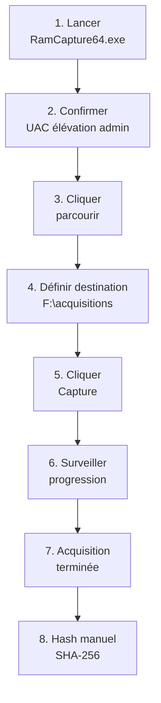
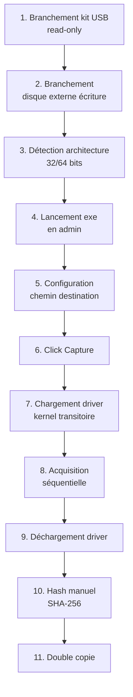

# 7.9 Belkasoft RAM Capturer

!!! quote "L'analogie de la roue de secours dans le coffre"

    Une voiture moderne dispose souvent de plusieurs équipements de secours. Une roue de secours dans le coffre, un kit de réparation crevaison sous le tapis, un compresseur dans la portière. Aucun de ces équipements n'est utilisé tous les jours. Aucun n'est aussi confortable qu'une intervention en garage. Mais quand une crevaison survient à 200 kilomètres de la civilisation, à minuit, sous la pluie, c'est cet équipement secondaire qui sauve la situation. Belkasoft RAM Capturer joue ce rôle dans le kit DFIR. Il n'est pas l'outil que l'analyste utilise au quotidien. Mais il est léger, fiable, indépendant, prêt à fonctionner quand l'outil principal refuse de démarrer. Cette redondance technique n'est pas du luxe en mission DFIR. C'est une assurance.

## Métadonnées du chapitre

Ce chapitre couvre l'outil de complément du kit. Voici ses caractéristiques.

| Champ | Valeur |
|---|---|
| Durée estimée | 2 heures |
| Niveau | Pratique |
| Prérequis | 7.5 (kit USB), 7.6, 7.7, 7.8 pour comparaisons |
| Livrables | Belkasoft RAM Capturer intégré au kit |
| Auto-explication | 7 minutes |

## Objectifs pédagogiques

À l'issue de ce chapitre, vous serez capable de :

- Présenter Belkasoft et son positionnement
- Comprendre l'architecture driver de l'outil
- Lancer une acquisition en moins d'une minute
- Identifier les avantages spécifiques (poids, simplicité)
- Justifier la place de cet outil dans le kit
- Connaître les limites par rapport aux outils principaux

---

## 1. Présentation et contexte

Belkasoft RAM Capturer est un outil **gratuit** d'acquisition mémoire produit par **Belkasoft**, éditeur connu pour sa suite Belkasoft X (forensic mobile et ordinateur).

### 1.1 Belkasoft

Voici le contexte de l'éditeur.

| Caractéristique | Valeur |
|---|---|
| Origine | Russie (fondation 2003) |
| Présence actuelle | International, équipe distribuée |
| Produit phare | Belkasoft X (suite forensic) |
| Positionnement | DFIR mobile et computer |
| Outil gratuit principal | Belkasoft RAM Capturer |
| Modèle économique | Suite payante + outils gratuits marketing |

### 1.2 Position de RAM Capturer

Belkasoft propose plusieurs outils gratuits comme porte d'entrée.

| Outil gratuit | Fonction |
|---|---|
| Belkasoft RAM Capturer | Acquisition mémoire |
| Belkasoft Live RAM Capturer | Variante avec drivers signés |
| Belkasoft Acquisition Tool (parfois) | Acquisition disque |
| Belkasoft Trial | Suite complète 30 jours |

### 1.3 Histoire et évolutions

Voici les évolutions principales de l'outil.

| Année | Événement |
|---|---|
| 2014 | Première version publique |
| 2017 | Refonte avec nouveau driver |
| 2020 | Compatibilité Windows 10 améliorée |
| 2022 | Support Windows 11 |
| 2024 | Maintenance ralentie (focus suite payante) |
| 2026 | Outil disponible mais évolution lente |

## 2. Caractéristiques techniques

### 2.1 Spécifications

Voici les spécifications techniques.

| Spécification | Valeur |
|---|---|
| Plateforme | Windows uniquement |
| Architectures | x86 et x64 |
| Versions Windows | XP à 11 (avec limitations sur récents) |
| Format de sortie | RAW (.mem ou .raw) |
| Taille du dossier | ~5 Mo |
| Distribution | ZIP portable |
| Privilèges requis | Administrateur |
| Interface | GUI minimaliste |
| Licence | Gratuite (usage commercial autorisé selon termes) |

### 2.2 Architecture driver

Belkasoft RAM Capturer utilise une **approche driver kernel** spécifique.

```text
ARCHITECTURE BELKASOFT RAM CAPTURER
======================================

Composants
  - Application user-space (interface)
  - Driver kernel signé (.sys)
  - Driver chargé dynamiquement à l'usage
  - Driver déchargé après acquisition

Avantages
  - Accès direct mémoire physique
  - Pas de pilote permanent
  - Empreinte minimale après acquisition
  - Driver signé Microsoft (selon version)

Inconvénients
  - HVCI peut bloquer le chargement
  - SecureBoot strict peut interférer
  - Driver pas mis à jour aussi vite que concurrents
  - Compatibilité Win11 24H2+ à valider

Empreinte mémoire
  Le driver lui-même occupe quelques Mo de RAM
  pendant la capture - artefact à connaître
```

### 2.3 Format de sortie

Belkasoft RAM Capturer génère un fichier raw simple.

| Caractéristique | Valeur |
|---|---|
| Extension par défaut | .mem |
| Format | RAW (DD-style) |
| Compression | Aucune |
| Métadonnées | Aucune dans le fichier |
| Hash | Calculé en option |
| Taille | Strictement = RAM physique |

### 2.4 Empreinte légère

L'avantage majeur de Belkasoft est sa **légèreté**.

```text
COMPARAISON TAILLE OUTILS
============================

DumpIt              : ~500 Ko
Belkasoft RAM Cap.  : ~5 Mo
WinPmem             : ~5 Mo
Magnet RAM Capture  : ~30 Mo
FTK Imager Lite     : ~100 Mo

Ce critère devient pertinent quand
  - Espace USB très limité
  - Distribution réseau bas débit
  - Téléchargement urgent en mission
  - Multiplication des kits
```

## 3. Téléchargement et installation

### 3.1 Source officielle

Le téléchargement officiel se fait via Belkasoft.

```text
TÉLÉCHARGEMENT BELKASOFT RAM CAPTURER
========================================

URL : https://belkasoft.com/ram-capturer

Procédure
  1. Renseigner formulaire (email professionnel)
  2. Confirmation par email
  3. Téléchargement archive ZIP
  4. Vérification hash

Considérations 2026
  - Site et entreprise opérationnels
  - Conditions d'usage à relire (géopolitique)
  - Vérifier conformité réglementaire de votre client
```

### 3.2 Vérification d'intégrité

Voici la procédure de vérification après téléchargement.

```powershell
# Vérification SHA-256
$file = "RamCapturer.zip"
$actual = (Get-FileHash $file -Algorithm SHA256).Hash
Write-Host "SHA-256 : $actual"

# Hash attendu fourni par Belkasoft
$expected = "RECUPERER_DEPUIS_PAGE_OFFICIELLE"

if ($actual -eq $expected) {
    Write-Host "[OK] Hash validé"
} else {
    Write-Host "[REJET] Hash divergent"
}

# Décompression
Expand-Archive $file -DestinationPath "Belkasoft_RAM_Capturer"

# Vérification signature des drivers et binaires
Get-ChildItem "Belkasoft_RAM_Capturer\*.exe","Belkasoft_RAM_Capturer\*.sys" |
    ForEach-Object {
        Get-AuthenticodeSignature $_ |
            Select-Object Path, Status, SignerCertificate
    }

# Le driver .sys DOIT être signé pour fonctionner sous Win10/11
```

### 3.3 Contenu de l'archive

Voici le contenu type de l'archive Belkasoft RAM Capturer.

```text
CONTENU ARCHIVE BELKASOFT
============================

Belkasoft_RAM_Capturer/
  RamCapture32.exe         (binaire 32 bits)
  RamCapture64.exe         (binaire 64 bits)
  RamCaptureDriver32.sys   (driver kernel 32 bits)
  RamCaptureDriver64.sys   (driver kernel 64 bits)
  ReadMe.txt               (documentation locale)

Notes
  - L'exécutable charge le driver correspondant à l'architecture
  - Le driver doit rester accessible à côté de l'exe
  - Pas de fichier de configuration externe
  - Pas de logs persistants
```

### 3.4 Intégration kit USB

Une fois validé, intégration au kit selon la structure du chapitre 7.5.

```text
EMPLACEMENT DANS LE KIT
=========================

E:\01-Acquisition-Memoire\Belkasoft_RAM_Capturer\
  RamCapture32.exe
  RamCapture64.exe
  RamCaptureDriver32.sys
  RamCaptureDriver64.sys
  ReadMe.txt
  VERSION.txt              (notes locales OmnyAcademy)
  HASH.txt                 (SHA-256 des binaires)
```

## 4. Interface utilisateur

### 4.1 Vue principale

L'interface de Belkasoft RAM Capturer est minimaliste.

| Zone | Contenu |
|---|---|
| Titre | Belkasoft Live RAM Capturer |
| Champ destination | Path complet du fichier de sortie |
| Bouton parcourir | Sélection emplacement |
| Bouton Capture | Lancement |
| Zone progression | Pourcentage et statut |
| Zone log | Messages temps réel |

### 4.2 Pas à pas interface

Voici la séquence d'utilisation typique.



### 4.3 Choix de l'architecture

L'archive contient deux exécutables. Voici comment choisir.

```powershell
# Détection automatique de l'architecture cible
$arch = [System.Environment]::Is64BitOperatingSystem

if ($arch) {
    $exe = "E:\01-Acquisition-Memoire\Belkasoft_RAM_Capturer\RamCapture64.exe"
    Write-Host "[*] Système 64 bits - utilisation RamCapture64.exe"
} else {
    $exe = "E:\01-Acquisition-Memoire\Belkasoft_RAM_Capturer\RamCapture32.exe"
    Write-Host "[*] Système 32 bits - utilisation RamCapture32.exe"
}

# Lancement
Start-Process $exe -Verb RunAs
```

## 5. Workflow d'acquisition

### 5.1 Procédure standard

Voici la procédure standard d'acquisition.



### 5.2 Script d'enrobage

Pour automatiser la séquence, voici un script d'enrobage.

```powershell
# acquire-belkasoft.ps1 - Acquisition Belkasoft avec journal
# Usage : .\acquire-belkasoft.ps1 -OutputDir F:\acquisitions

param(
    [Parameter(Mandatory=$true)]
    [string]$OutputDir
)

# Vérification privilèges admin
$current = [Security.Principal.WindowsIdentity]::GetCurrent()
$principal = New-Object Security.Principal.WindowsPrincipal($current)
if (-not $principal.IsInRole([Security.Principal.WindowsBuiltInRole]::Administrator)) {
    Write-Host "[ERREUR] Privilèges administrateur requis"
    exit 1
}

# Détection architecture
$is64 = [System.Environment]::Is64BitOperatingSystem
if ($is64) {
    $exe = "E:\01-Acquisition-Memoire\Belkasoft_RAM_Capturer\RamCapture64.exe"
} else {
    $exe = "E:\01-Acquisition-Memoire\Belkasoft_RAM_Capturer\RamCapture32.exe"
}

if (-not (Test-Path $exe)) {
    Write-Host "[ERREUR] Exécutable introuvable : $exe"
    exit 2
}

# Préparation destination
$timestamp = Get-Date -Format "yyyyMMdd-HHmmss"
$hostname = $env:COMPUTERNAME
New-Item -Path $OutputDir -ItemType Directory -Force | Out-Null

$dumpFile = "$OutputDir\${hostname}-${timestamp}.mem"
$logFile = "$OutputDir\${hostname}-${timestamp}.log"

# Vérification espace disque
$ramSize = (Get-WmiObject Win32_ComputerSystem).TotalPhysicalMemory
$drive = Split-Path $OutputDir -Qualifier
$freeSpace = (Get-PSDrive -Name $drive.TrimEnd(':')).Free

if ($freeSpace -lt ($ramSize * 1.1)) {
    Write-Host "[ERREUR] Espace insuffisant"
    Write-Host "    Libre : $($freeSpace / 1GB) Go"
    Write-Host "    Requis : $($ramSize * 1.1 / 1GB) Go"
    exit 3
}

# Journal démarrage
"$(Get-Date -Format 'o') Acquisition Belkasoft demarrée par $env:USERNAME" | Out-File $logFile
"$(Get-Date -Format 'o') Hostname : $hostname" | Out-File $logFile -Append
"$(Get-Date -Format 'o') Architecture : $(if ($is64) {'x64'} else {'x86'})" | Out-File $logFile -Append
"$(Get-Date -Format 'o') RAM physique : $($ramSize / 1GB) Go" | Out-File $logFile -Append
"$(Get-Date -Format 'o') Destination : $dumpFile" | Out-File $logFile -Append

# Lancement (l'utilisateur doit interagir avec la GUI)
Write-Host "[*] Lancement Belkasoft RAM Capturer"
Write-Host "[*] Configurer destination dans la GUI :"
Write-Host "    $dumpFile"
Write-Host "[*] Cliquer Capture"
Write-Host ""

Start-Process $exe -Verb RunAs -Wait

# Vérification post-acquisition
if (-not (Test-Path $dumpFile)) {
    Write-Host "[ATTENTION] Fichier $dumpFile non trouvé"
    Write-Host "Vérifier emplacement réel et adapter chemin"
    exit 4
}

# Hash et journal
$dumpSize = (Get-Item $dumpFile).Length
$hash = (Get-FileHash $dumpFile -Algorithm SHA256).Hash

"$(Get-Date -Format 'o') Acquisition terminée" | Out-File $logFile -Append
"$(Get-Date -Format 'o') Taille fichier : $($dumpSize / 1GB) Go" | Out-File $logFile -Append
"$(Get-Date -Format 'o') Hash SHA-256 : $hash" | Out-File $logFile -Append

"$hash  $dumpFile" | Out-File "$dumpFile.sha256"

Write-Host ""
Write-Host "[+] Acquisition terminée"
Write-Host "    Fichier : $dumpFile"
Write-Host "    Taille  : $([math]::Round($dumpSize / 1GB, 2)) Go"
Write-Host "    SHA-256 : $hash"
Write-Host "    Journal : $logFile"
```

### 5.3 Validation post-acquisition

Voici les vérifications à effectuer après acquisition.

```powershell
# Vérifications post-acquisition
$dumpFile = "F:\acquisitions\WIN-COMPTA-01-20260430-143215.mem"

# Test 1 - Fichier existe
if (-not (Test-Path $dumpFile)) {
    Write-Host "[ECHEC] Fichier dump absent"
    exit 1
}

# Test 2 - Taille = RAM physique exactement
$dumpSize = (Get-Item $dumpFile).Length
$ramSize = (Get-WmiObject Win32_ComputerSystem).TotalPhysicalMemory
if ($dumpSize -eq $ramSize) {
    Write-Host "[OK] Taille cohérente"
} else {
    Write-Host "[WARNING] Taille différente"
    Write-Host "    Dump : $dumpSize"
    Write-Host "    RAM  : $ramSize"
}

# Test 3 - Premiers et derniers octets non-nuls (validation contenu)
$bytes = [System.IO.File]::ReadAllBytes($dumpFile) | Select-Object -First 16
$lastBytes = [System.IO.File]::ReadAllBytes($dumpFile) | Select-Object -Last 16
Write-Host "Premiers octets : $($bytes -join ' ')"
Write-Host "Derniers octets : $($lastBytes -join ' ')"
```

## 6. Compatibilité Windows 2026

### 6.1 Matrice de compatibilité

Voici la matrice de compatibilité testée.

| Version Windows | Compatibilité | Notes |
|---|---|---|
| Windows XP | Bonne | Mais XP en fin de vie |
| Windows 7 | Excellente | Force historique de l'outil |
| Windows 8.1 | Bonne | OS quasi-disparu |
| Windows 10 22H2 | Bonne | Standard fonctionnel |
| Windows 11 22H2 | Bonne | Vérifier driver signé |
| Windows 11 23H2 | À valider | Tester en lab |
| Windows 11 24H2 | Limite | HVCI peut bloquer |
| Server 2016-2019 | Bonne | |
| Server 2022 | À valider | |
| Server 2025 | Non testé | |

### 6.2 Limitations HVCI / Secure Boot

En 2026, certaines configurations posent des défis spécifiques.

```text
LIMITATIONS HVCI / VBS
=========================

Hypervisor-protected Code Integrity (HVCI)
  Vérifie que tous les drivers kernel sont signés
  par une autorité reconnue

Belkasoft driver
  Signé Microsoft (généralement)
  Mais signature peut être révoquée ou périmée
  Si HVCI strict actif, driver peut ne pas charger

Diagnostic
  Si "Failed to load driver" :
  1. Vérifier signature driver (Get-AuthenticodeSignature)
  2. Vérifier HVCI activé
     Get-CimInstance -ClassName Win32_DeviceGuard
  3. Tester sur même OS sans HVCI

Recommandation
  Pas de premier choix sur Windows 11 récents
  Privilégier Magnet RAM Capture qui suit mieux
  Garder Belkasoft comme alternative non-HVCI
```

### 6.3 Avantage sur Windows anciens

Sur les Windows anciens (7, 8.1), Belkasoft conserve un avantage.

```text
WINDOWS ANCIENS - FORCE BELKASOFT
====================================

Cas d'usage encore présents en 2026
  - Postes industriels Windows 7 LTS
  - Machines de contrôle ICS/SCADA
  - Postes médicaux non-mis à jour
  - Anciens systèmes de production

Avantage Belkasoft
  - Driver historiquement compatible
  - Empreinte minimale sur ces OS contraints
  - Pas de dépendance .NET récent
  - Fonctionne sur RAM limitée (1-2 Go)

Pour ces contextes
  Belkasoft devient outil de premier choix
  Magnet RAM Capture peut refuser ces OS
```

## 7. Comparaison avec alternatives

### 7.1 Tableau comparatif

Voici la comparaison complète des outils du kit.

| Critère | Belkasoft | DumpIt | Magnet RAM | FTK Imager | WinPmem |
|---|---|---|---|---|---|
| Maintenance 2026 | Limitée | Limitée | Excellente | Active | Active |
| Compatibilité Win 7 | Excellente | Bonne | Limitée | Bonne | Bonne |
| Compatibilité Win 11 | Bonne | À valider | Excellente | Bonne | Bonne |
| Taille kit | 5 Mo | 0.5 Mo | 30 Mo | 100 Mo | 5 Mo |
| Logs intégrés | Limités | Minimaux | Très bons | Bons | Bons |
| Hash auto | Optionnel | Non | Oui | Non | Manuel |
| Open source | Non | Non | Non | Non | Oui |
| Driver kernel | Oui | Oui | Oui | Oui | Oui |
| Architecture ARM64 | Non | Non | Oui | Limitée | Limitée |

### 7.2 Quand préférer Belkasoft

Voici les situations où Belkasoft est le meilleur choix.

| Situation | Justification |
|---|---|
| Cible Windows 7 / 8.1 | Compatibilité historique forte |
| Espace USB très limité | 5 Mo vs 30-100 Mo concurrents |
| Backup secondaire kit | Redondance technique |
| Outil principal en échec | Alternative driver différent |
| Mission internationale | Disponibilité variable |
| Tests de portabilité | Rapide à déployer |

### 7.3 Quand préférer une alternative

Voici les situations où une alternative est plus indiquée.

| Situation | Outil préféré |
|---|---|
| Cible Windows 11 récent | Magnet RAM Capture |
| Logs détaillés requis | Magnet RAM Capture |
| ARM64 cible | Magnet RAM Capture |
| Open source impératif | WinPmem |
| Suite forensic combinée | FTK Imager Lite |
| Driver-less acquisition | Aucun (tous utilisent driver) |

## 8. Cas pratique - Acquisition lab ARTECH

### 8.1 Scénario

Vous testez Belkasoft RAM Capturer sur la VM Windows 11 ARTECH lab.

### 8.2 Préparation

Voici la préparation à effectuer.

```powershell
# Sur la VM Windows 11 cible

# Vérification HVCI status (Belkasoft sensible)
Get-CimInstance -ClassName Win32_DeviceGuard |
    Select-Object SecurityServicesConfigured, SecurityServicesRunning

# Si SecurityServicesRunning contient 2 (HVCI actif)
# Tester d'abord avec HVCI désactivé pour validation
# Réactiver après test

# Préparation contexte mémoire
notepad C:\Users\Public\Documents\test.txt
calc.exe

# Vérifier RAM physique
$ram = (Get-WmiObject Win32_ComputerSystem).TotalPhysicalMemory
Write-Host "RAM physique : $($ram / 1GB) Go"
```

### 8.3 Acquisition

Voici la séquence d'acquisition complète.

```powershell
# Branchement kit USB et disque externe (USB pass-through VM)

# Détection architecture
$arch = if ([System.Environment]::Is64BitOperatingSystem) { "x64" } else { "x86" }
Write-Host "Architecture détectée : $arch"

# Sélection exécutable
$exeName = if ($arch -eq "x64") { "RamCapture64.exe" } else { "RamCapture32.exe" }
$exePath = "E:\01-Acquisition-Memoire\Belkasoft_RAM_Capturer\$exeName"

# Préparation destination
$timestamp = Get-Date -Format "yyyyMMdd-HHmmss"
$outputDir = "F:\acquisitions\test-belkasoft-$timestamp"
New-Item -Path $outputDir -ItemType Directory -Force | Out-Null

# Lancement
Write-Host "[*] Lancement $exeName"
Start-Process $exePath -Verb RunAs

# Dans la GUI :
#   1. Path : F:\acquisitions\test-belkasoft-<timestamp>\WIN-COMPTA-01-<timestamp>.mem
#   2. Cliquer Capture
#   3. Surveiller progression
#   4. Attendre fin
```

### 8.4 Hash manuel post-acquisition

Belkasoft ne calcule pas le hash automatiquement.

```powershell
# Hash manuel après acquisition
$dumpFile = Get-ChildItem "$outputDir\*.mem" | Select-Object -First 1

if ($dumpFile) {
    $hash = (Get-FileHash $dumpFile.FullName -Algorithm SHA256).Hash
    Write-Host "SHA-256 : $hash"
    
    "$hash  $($dumpFile.Name)" | Out-File "$($dumpFile.FullName).sha256"
    
    # Information taille
    $sizeGB = $dumpFile.Length / 1GB
    Write-Host "Taille : $([math]::Round($sizeGB, 2)) Go"
}
```

### 8.5 Validation Volatility

Test du dump avec Volatility 3.

```bash
# Sur poste analyste
cd ~/dfir/test-belkasoft

# Volatility 3 - validation
vol -f WIN-COMPTA-01-20260430-143215.mem windows.info

# Test pslist
vol -f WIN-COMPTA-01-20260430-143215.mem windows.pslist

# Comparaison processus visibles avec Magnet RAM Capture
# (Doit être identique - même état mémoire si très peu de temps écoulé)
```

### 8.6 Documentation test

Documentez le test dans le journal kit.

```text
TEST BELKASOFT - LAB ARTECH 2026-04-30
==========================================

Cible : VM Windows 11 22H2 (4 Go RAM)
Outil : Belkasoft RAM Capturer
Architecture détectée : x64
Exécutable utilisé : RamCapture64.exe
Destination : F:\acquisitions\test-belkasoft-20260430-143230\

Préparation
  HVCI status : Désactivé pour test
  RAM physique : 4.00 Go

Résultats acquisition
  Durée : 38 secondes
  Taille .mem : 4.00 Go (= RAM physique)
  Format : RAW
  SHA-256 : c3d4e5f6...

Validation Volatility 3
  windows.info : OK
  windows.pslist : OK (164 processus)
  Résultats cohérents avec test Magnet RAM Capture

Conclusion
  Outil fonctionnel sur Win 11 sans HVCI strict.
  À retester avec HVCI activé.
  Confirmation backup secondaire dans le kit.
```

## 9. Bonnes pratiques

### 9.1 Pour le kit

Voici les bonnes pratiques pour intégration kit.

| Pratique | Justification |
|---|---|
| Garder en backup secondaire | Pas premier choix Windows récents |
| Tester trimestriellement | Maintenance lente nécessite validation |
| Versionner précisément | Versions Belkasoft peu différentielles |
| Conserver 2 versions | Si nouvelle version pose problème |
| Documenter compatibilité OS | Éviter mauvaises surprises mission |

### 9.2 Pour la mission

Voici les bonnes pratiques opérationnelles.

| Pratique | Justification |
|---|---|
| Vérifier HVCI sur cible | Driver peut être bloqué |
| Hash systématique manuel | Pas auto par défaut |
| Documenter version exacte | Reproductibilité |
| Conservation logs externes | Pas de logs intégrés détaillés |
| Privilégier Magnet ou DumpIt en première intention | Belkasoft = backup |

### 9.3 Cas géopolitique

Aspect à connaître pour les missions internationales.

```text
CONSIDÉRATIONS GÉOPOLITIQUES
================================

Origine
  Belkasoft entreprise d'origine russe
  Équipe internationale actuelle
  Présence légale variable selon pays

Implications
  - Certains clients restreignent outils russes
  - Conformité export/import à vérifier
  - Demander confirmation au client OIV/sensible

Recommandation OmnyAcademy
  - Vérifier politique du client avant intervention
  - Avoir alternative non-russe (Magnet, FTK, WinPmem)
  - Documenter usage dans rapport
  - Pas un blocage technique mais administratif possible
```

## 10. Pièges fréquents

### 10.1 Pièges techniques

Voici les erreurs techniques fréquentes.

| Piège | Conséquence | Évitement |
|---|---|---|
| Driver non chargé (HVCI) | Acquisition échoue | Test préalable HVCI |
| Mauvais binaire (32 vs 64) | Erreur silencieuse | Détection auto architecture |
| Driver absent du dossier | Crash de l'exe | Conservation arborescence intacte |
| Antivirus quarantaine driver | Outil inutilisable | Whitelist driver kernel |
| Espace destination | Acquisition tronquée | Vérifier en amont |

### 10.2 Pièges méthodologiques

Voici les erreurs méthodologiques à éviter.

| Piège | Évitement |
|---|---|
| Premier choix sans test | Toujours alternative principale d'abord |
| Pas de hash | Hash manuel obligatoire |
| Pas de logs | Conservation manuelle action |
| Confiance aveugle | Validation Volatility post-acquisition |
| Versions mélangées | Stockage versionné dans kit |

## 11. Cas d'usage privilégiés

### 11.1 Backup en cas d'échec

Le cas d'usage principal en 2026 est le **backup**.

```text
SCÉNARIO BACKUP TYPIQUE
===========================

Situation
  Magnet RAM Capture refuse de démarrer
  Driver corrompu, antivirus, autre

Action
  1. Tenter DumpIt (alternative légère)
  2. Si échec → Belkasoft RAM Capturer
  3. Si échec → WinPmem
  4. Si échec → FTK Imager (option pagefile)
  5. Si tout échoue → diagnostic technique

Avantage Belkasoft
  Driver différent des autres outils
  Probabilité de succès indépendante
  Empreinte légère, déploiement rapide
```

### 11.2 Cible Windows 7 / 8

Sur les systèmes anciens, Belkasoft brille.

```text
SCÉNARIO WIN 7 LEGACY
========================

Contexte
  Poste industriel ARTECH simulé
  Windows 7 SP1 LTS
  RAM 2 Go uniquement
  Pas de mises à jour récentes

Outils inadaptés
  - Magnet RAM Capture : peut refuser OS ancien
  - FTK Imager récent : exige .NET 4.x

Outils adaptés
  - Belkasoft : driver historique compatible
  - DumpIt : minimal et historique
  - WinPmem : selon version

Avec Belkasoft
  Acquisition rapide même sur 1-2 Go RAM
  Empreinte minimale sur OS contraint
  Compatible drivers Win 7
```

### 11.3 Distribution réseau urgente

Cas où la légèreté permet le déploiement rapide.

```text
SCÉNARIO DÉPLOIEMENT RÉSEAU
==============================

Situation
  Multiple postes à acquérir simultanément
  Réseau bas débit
  Distribution depuis serveur central

Avantage Belkasoft
  5 Mo seulement à transférer
  Rapide même en VPN limité
  Pas de dépendance externe

Action
  1. Hébergement archive sur partage SMB lab
  2. Script PowerShell de récupération
  3. Lancement coordonné
  4. Centralisation dumps via réseau
```

## 12. Auto-évaluation

Vérifiez votre maîtrise par les questions suivantes.

| # | Question | Réponse |
|---|---|---|
| 1 | Éditeur de Belkasoft RAM Capturer ? | Belkasoft |
| 2 | Architecture utilisée ? | Driver kernel signé chargé dynamiquement |
| 3 | Format de sortie ? | RAW (.mem) |
| 4 | Privilèges requis ? | Administrateur |
| 5 | Différence x86/x64 ? | Deux exécutables séparés à choisir |
| 6 | Hash automatique ? | Non, manuel obligatoire |
| 7 | Compatibilité Win 7 ? | Excellente |
| 8 | Compatibilité Win 11 24H2 ? | Limitée selon HVCI |
| 9 | Position dans le kit ? | Backup secondaire |
| 10 | Alternative principale recommandée ? | Magnet RAM Capture |

## 13. Synthèse

Voici les points clés à retenir.

```text
BELKASOFT RAM CAPTURER - SYNTHÈSE

POSITIONNEMENT
  Outil léger d'acquisition mémoire Windows
  Éditeur : Belkasoft (origine Russie)
  Gratuit usage commercial autorisé
  Maintenance ralentie en 2026
  Niche : backup secondaire et legacy OS

CARACTÉRISTIQUES
  Empreinte 5 Mo (kit léger)
  Driver kernel signé dynamique
  Format RAW (.mem) simple
  Pas de logs intégrés détaillés
  Pas de hash automatique
  Deux binaires (x86 et x64)

USAGE
  Détecter architecture cible
  Lancer RamCapture32 ou 64.exe en admin
  Configurer destination
  Cliquer Capture
  Hash SHA-256 MANUEL post-acquisition

WORKFLOW
  1. Branchement kit + disque externe
  2. Détection architecture
  3. Lancement bon binaire en admin
  4. GUI configuration
  5. Capture + surveillance
  6. Hash manuel
  7. Double copie
  8. Documentation manuelle

COMPATIBILITÉ 2026
  Win 7 : excellente (force)
  Win 8.1 : bonne
  Win 10 : bonne
  Win 11 22H2 : bonne
  Win 11 24H2 : limitée (HVCI)
  Server 2016-2019 : bonne
  Server 2022+ : à valider
  ARM64 : non supporté

POSITION DANS KIT DFIR
  PAS premier choix
  Backup secondaire
  Premier choix uniquement sur Win 7 / 8 legacy
  Empreinte légère utile en distribution réseau
  Driver différent = redondance technique

LIMITATIONS
  Maintenance ralentie
  Pas de support ARM64
  HVCI peut bloquer
  Pas de logs intégrés
  Hash manuel uniquement
  Considérations géopolitiques selon clients

QUAND PRÉFÉRER
  Cible Win 7/8 legacy
  Backup en cas d'échec primaire
  Distribution réseau urgent (5 Mo)
  Test rapide sans installation

QUAND ÉVITER
  Cible Win 11 récent (préférer Magnet)
  Mission ARM64 (préférer Magnet ou WinPmem)
  Client sensible sur origine outils
  Premier choix kit professionnel

POSITION OmnyAcademy
  Outil utile pour redondance
  Présence dans kit recommandée
  Test trimestriel obligatoire
  Documentation versions précise
```

---

**Chapitre précédent** : [7.8 FTK Imager Lite portable](7-8-ftk-imager-lite.md)

**Chapitre suivant** : [7.10 Hash immédiat et double copie](7-10-hash-immediat-double-copie.md)