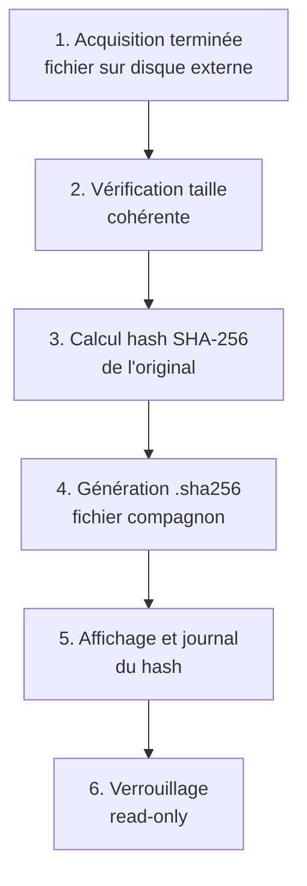
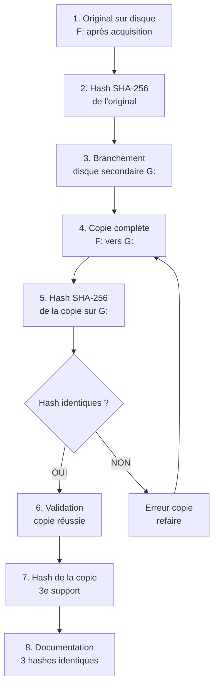

# 7.10 Hash immédiat et double copie

!!! quote "L'analogie de la photo officielle du diamant volé"

    Quand un diamant rare est confié à une compagnie d'assurance, le diamantaire l'a déjà photographié sous tous les angles, mesuré au micron, pesé au milligramme, gravé d'un numéro invisible. Cette opération est faite avant la mise en sécurité, jamais après. Si le coffre est fracturé et le diamant échangé contre un faux, la photographie d'origine permet de prouver la substitution. Sans cette photographie, aucune réclamation ne peut être validée. L'analyste forensique fait exactement la même chose avec un dump mémoire ou un disque acquis. Il calcule l'empreinte cryptographique avant même de bouger le fichier. Cette empreinte, le hash, est la photographie du diamant numérique. Elle prouve que le fichier qui arrivera au juge dans six mois est exactement celui qui a quitté la scène. Sans hash immédiat, toute la chaîne de garde s'effondre. Avec hash immédiat et double copie, l'intégrité est mathématiquement démontrable.

## Métadonnées du chapitre

Ce chapitre couvre une procédure non négociable. Voici ses caractéristiques.

| Champ | Valeur |
|---|---|
| Durée estimée | 2 heures |
| Niveau | Pratique critique |
| Prérequis | 7.5 à 7.9 (acquisition réalisée) |
| Livrables | Procédure hash + double copie automatisée |
| Auto-explication | 8 minutes |

## Objectifs pédagogiques

À l'issue de ce chapitre, vous serez capable de :

- Justifier le hash immédiat post-acquisition
- Choisir l'algorithme de hash adapté
- Calculer un hash en PowerShell de plusieurs façons
- Mettre en place la double copie sur supports distincts
- Valider la cohérence entre original et copies
- Intégrer le hash à la chaîne de garde
- Automatiser la procédure complète

---

## 1. Pourquoi le hash et la double copie

L'intégrité est la pierre angulaire de la preuve numérique. Voici pourquoi cette procédure est non négociable.

### 1.1 Enjeux juridiques

Voici les enjeux juridiques qui imposent cette procédure.

| Enjeu | Conséquence si non respecté |
|---|---|
| Recevabilité au tribunal | Preuve écartée |
| Présomption d'altération | Charge de la preuve inversée |
| Discrédit de l'expert | Toute la mission compromise |
| Dommages-intérêts | Faute professionnelle engagée |
| Article 226-13 CP (secret pro) | Manquement déontologique |

### 1.2 Enjeux techniques

Voici les enjeux techniques de la procédure.

| Enjeu | Justification |
|---|---|
| Perte de média | Disque externe peut tomber, brûler |
| Corruption silencieuse | Bit-rot, secteurs défectueux |
| Erreur humaine | Suppression ou modification accidentelle |
| Reproduction analyses | Multiple analystes sur même base |
| Conservation longue | Procès parfois plusieurs années après |

### 1.3 RFC 3227 et standards

La RFC 3227 et les standards forensiques imposent ces principes.

```text
RFC 3227 - GUIDELINES FOR EVIDENCE COLLECTION
===============================================

Section 2.3 - Evidence Preservation

  "Once the evidence is collected, you must preserve it
   exactly as it was when collected. To prove this, document
   evidence collection process via cryptographic hashing,
   chain of custody, and storage in tamper-evident containers."

Section 2.4 - Evidence Hashing

  "Use one or more cryptographic hash functions to identify
   each piece of evidence. SHA-256 or stronger is recommended
   for new evidence collection."

Section 2.5 - Multiple Copies

  "Make at least two copies of the evidence. Store them
   in separate physical locations to prevent simultaneous
   loss."
```

### 1.4 Standards et normes

Voici les standards qui exigent cette procédure.

| Standard | Domaine |
|---|---|
| ISO/IEC 27037:2012 | Identification, collecte, acquisition de preuves |
| ISO/IEC 27042:2015 | Analyse et interprétation de preuves |
| NIST SP 800-86 | Guide forensique pour intervention |
| ENISA Good Practice Guide | Investigation et incident |
| ANSSI guide DFIR | Recommandations françaises |

## 2. Algorithmes de hash cryptographique

### 2.1 Familles d'algorithmes

Voici les principales familles d'algorithmes de hash.

| Famille | Exemples | Statut |
|---|---|---|
| MD | MD5, MD4 | Cassés cryptographiquement |
| SHA-1 | SHA-1 | Cassé pour collisions |
| SHA-2 | SHA-256, SHA-384, SHA-512 | Recommandés actuels |
| SHA-3 | SHA-3 256, 512 | Standard NIST 2015, peu déployé |
| BLAKE | BLAKE2, BLAKE3 | Performance, adoption croissante |

### 2.2 Comparatif des algorithmes

Voici le comparatif détaillé des principaux algorithmes.

| Algorithme | Longueur | Vitesse | Sécurité 2026 | Recommandation |
|---|---|---|---|---|
| MD5 | 128 bits | Très rapide | Cassé | Non |
| SHA-1 | 160 bits | Rapide | Cassé collisions | Non recommandé |
| SHA-256 | 256 bits | Rapide | Robuste | OUI - standard DFIR |
| SHA-512 | 512 bits | Rapide | Très robuste | Alternative renforcée |
| SHA-3 256 | 256 bits | Modérée | Robuste | Cas spécifiques |
| BLAKE3 | 256 bits | Très rapide | Robuste | Performance critique |

### 2.3 Pourquoi pas MD5 ni SHA-1

Voici les raisons techniques d'écarter ces algorithmes.

```text
POURQUOI PAS MD5
==================

1996 : faiblesses pseudo-collisions identifiées
2004 : collision démontrée Wang et al.
2008 : faux certificat SSL via MD5 (Sotirov et al.)
2012 : Flame malware exploite MD5

Conséquence forensique
  MD5 ne prouve plus l'unicité d'un fichier
  Un attaquant peut produire deux fichiers
  différents avec même hash MD5
  Inadmissible en preuve aujourd'hui

POURQUOI PAS SHA-1
====================

2005 : faiblesses théoriques (Wang)
2017 : SHAttered - première collision réelle (Google/CWI)
  140 millions d'années CPU mais possible
2020 : attaques chosen-prefix réduites à $45k

Conséquence forensique
  Encore présent dans formats anciens (E01, certains certificats)
  À NE PLUS UTILISER pour nouvelles acquisitions
  Conserver en lecture seule pour anciens dossiers
```

### 2.4 Pourquoi SHA-256 est le standard 2026

Voici les raisons qui font de SHA-256 le standard.

| Critère | SHA-256 |
|---|---|
| Sécurité actuelle | Aucune attaque pratique connue |
| Adoption | Universelle dans tous les outils DFIR |
| Performance | Acceptable même sur 100 Go |
| Compatibilité | Tous OS, tous langages |
| Recommandations officielles | ANSSI, NIST, ISO, ENISA |
| Taille du hash | 256 bits = 64 caractères hex |

### 2.5 Quand utiliser SHA-512

Voici les cas où SHA-512 est préférable à SHA-256.

| Cas | Justification |
|---|---|
| Mission très haute sensibilité | Marge de sécurité supplémentaire |
| Conservation très longue | Robustesse face à attaques futures |
| Cible 64 bits exclusive | Performance similaire à SHA-256 |
| Standard interne client | Si client impose SHA-512 |

## 3. Procédure hash immédiat

### 3.1 Définition de "immédiat"

"Immédiat" a un sens précis en forensique.

```text
DÉFINITION FORENSIQUE DE "IMMÉDIAT"
======================================

Sens strict
  Le hash est calculé AVANT toute manipulation
  du fichier d'acquisition

Pratique acceptable
  Calcul dans la même session système
  Sans changement de support physique
  Sans déplacement de fichier
  Sans modification de propriétés

À ÉVITER
  Copie sur autre support puis hash
    → on ne hash pas l'original mais la copie
  Compression puis hash
    → on hash l'archive, pas l'acquisition
  Renommage puis hash
    → modification possible métadonnées
  Hash après plusieurs heures sans isolation
    → fenêtre de modification possible
```

### 3.2 Procédure standard

Voici la procédure standard de hash immédiat.



### 3.3 Calcul SHA-256 PowerShell - méthode native

Voici la méthode native PowerShell pour calculer un hash.

```powershell
# Méthode 1 - Get-FileHash (built-in PowerShell 5+)
$file = "F:\acquisitions\WIN-COMPTA-01-20260430-143215.raw"

# Calcul simple
$result = Get-FileHash -Path $file -Algorithm SHA256
Write-Host "SHA-256 : $($result.Hash)"

# Multiples algorithmes en une commande
$algos = @("MD5", "SHA1", "SHA256", "SHA512")
foreach ($algo in $algos) {
    $h = Get-FileHash -Path $file -Algorithm $algo
    Write-Host "$algo : $($h.Hash)"
}

# Sortie type (16 Go) :
#   MD5    : 8b1a9953c4611296a827abf8c47804d7
#   SHA1   : 356a192b7913b04c54574d18c28d46e6395428ab
#   SHA256 : a1b2c3d4e5f6...
#   SHA512 : abc123...
```

### 3.4 Génération fichier compagnon .sha256

Voici la convention OmnyAcademy pour le fichier compagnon.

```powershell
# Génération fichier compagnon au format standard
$file = "F:\acquisitions\WIN-COMPTA-01-20260430-143215.raw"
$hashFile = "$file.sha256"

# Calcul
$hash = (Get-FileHash -Path $file -Algorithm SHA256).Hash

# Format compatible sha256sum Linux
"$($hash.ToLower())  $(Split-Path $file -Leaf)" | Out-File -Encoding ascii $hashFile

# Le format est :
# <hash en minuscule>  <nom du fichier sans path>
# Exemple :
# a1b2c3d4...  WIN-COMPTA-01-20260430-143215.raw
```

### 3.5 Méthode avec affichage progressif

Pour les très gros fichiers (50+ Go), voici une méthode avec progression.

```powershell
# Méthode avec affichage progressif (très gros fichiers)
function Get-FileHashProgress {
    param(
        [Parameter(Mandatory=$true)]
        [string]$Path,
        [string]$Algorithm = "SHA256",
        [int]$BufferSize = 1MB
    )
    
    $fileInfo = Get-Item $Path
    $totalSize = $fileInfo.Length
    
    $hasher = [System.Security.Cryptography.HashAlgorithm]::Create($Algorithm)
    $stream = [System.IO.File]::OpenRead($Path)
    
    try {
        $buffer = New-Object byte[] $BufferSize
        $bytesRead = 0
        $totalRead = 0
        
        while (($bytesRead = $stream.Read($buffer, 0, $buffer.Length)) -gt 0) {
            $hasher.TransformBlock($buffer, 0, $bytesRead, $null, 0) | Out-Null
            $totalRead += $bytesRead
            
            $percent = [math]::Round(($totalRead / $totalSize) * 100, 1)
            Write-Progress -Activity "Calcul hash $Algorithm" `
                -Status "$percent % - $totalRead / $totalSize octets" `
                -PercentComplete $percent
        }
        
        $hasher.TransformFinalBlock($buffer, 0, 0) | Out-Null
        $hash = -join ($hasher.Hash | ForEach-Object { $_.ToString("x2") })
        
        Write-Progress -Activity "Calcul hash $Algorithm" -Completed
        return $hash
    }
    finally {
        $stream.Close()
        $hasher.Dispose()
    }
}

# Usage
$hash = Get-FileHashProgress -Path "F:\acquisitions\big-dump.raw" -Algorithm "SHA256"
Write-Host "Hash : $hash"
```

### 3.6 Validation cohérence avec sha256sum Linux

Pour permettre la vérification depuis Linux, le format doit être compatible.

```bash
# Côté Linux (Kali, Ubuntu, etc.)
cd /mnt/acquisitions

# Vérification du fichier .sha256 généré sous Windows
sha256sum -c WIN-COMPTA-01-20260430-143215.raw.sha256

# Sortie attendue
# WIN-COMPTA-01-20260430-143215.raw: OK

# En cas d'erreur
# WIN-COMPTA-01-20260430-143215.raw: FAILED
```

## 4. Procédure double copie

### 4.1 Principe

La double copie repose sur **trois supports physiques distincts**.

```text
PRINCIPE DE LA DOUBLE COPIE
==============================

Support 1 - Original
  Disque externe SSD principal
  Reste avec l'analyste
  Va au coffre forensique

Support 2 - Première copie
  Disque externe SSD secondaire
  Stockage géographiquement distinct
  Sauvegarde en cas de perte du 1er

Support 3 - Deuxième copie (optionnelle si critique)
  Stockage cloud chiffré ou NAS sécurisé
  Géographiquement très distinct
  Pour très haute valeur

Pourquoi pas le même disque ?
  Si le disque tombe, brûle, est volé,
  les copies sont perdues simultanément.
  Diversification physique obligatoire.
```

### 4.2 Procédure standard

Voici la procédure pas à pas.



### 4.3 Script de double copie automatisée

Voici un script PowerShell pour automatiser la double copie.

```powershell
# double-copie.ps1 - Procédure double copie avec validation
# Usage : .\double-copie.ps1 -Source F:\acq.raw -Copy1 G:\copy1\ -Copy2 H:\copy2\

param(
    [Parameter(Mandatory=$true)]
    [string]$Source,
    
    [Parameter(Mandatory=$true)]
    [string]$Copy1Dir,
    
    [string]$Copy2Dir = ""
)

# Vérifications préalables
if (-not (Test-Path $Source)) {
    Write-Host "[ERREUR] Source introuvable : $Source"
    exit 1
}

$sourceItem = Get-Item $Source
$sourceSize = $sourceItem.Length

# Création répertoires destination
New-Item -Path $Copy1Dir -ItemType Directory -Force | Out-Null
if ($Copy2Dir) {
    New-Item -Path $Copy2Dir -ItemType Directory -Force | Out-Null
}

$fileName = $sourceItem.Name
$copy1Path = Join-Path $Copy1Dir $fileName
$copy2Path = if ($Copy2Dir) { Join-Path $Copy2Dir $fileName } else { $null }

# Étape 1 - Hash de l'original
Write-Host "[1/5] Calcul hash SHA-256 de l'original..."
$startHash1 = Get-Date
$hashOriginal = (Get-FileHash $Source -Algorithm SHA256).Hash
$durationHash1 = ((Get-Date) - $startHash1).TotalSeconds

Write-Host "      Hash original : $hashOriginal"
Write-Host "      Durée : $([math]::Round($durationHash1, 1))s"

# Génération fichier compagnon original
"$($hashOriginal.ToLower())  $fileName" | Out-File -Encoding ascii "$Source.sha256"

# Étape 2 - Copie 1
Write-Host ""
Write-Host "[2/5] Copie vers Copy1 : $Copy1Dir"
$startCopy1 = Get-Date
Copy-Item $Source $copy1Path
$durationCopy1 = ((Get-Date) - $startCopy1).TotalSeconds

$throughput1 = [math]::Round(($sourceSize / $durationCopy1) / 1MB, 2)
Write-Host "      Durée : $([math]::Round($durationCopy1, 1))s ($throughput1 MB/s)"

# Étape 3 - Hash Copy1
Write-Host "[3/5] Validation hash Copy1..."
$hashCopy1 = (Get-FileHash $copy1Path -Algorithm SHA256).Hash

if ($hashCopy1 -eq $hashOriginal) {
    Write-Host "      [OK] Hash identique - copie validée"
    "$($hashCopy1.ToLower())  $fileName" | Out-File -Encoding ascii "$copy1Path.sha256"
} else {
    Write-Host "      [ERREUR] Hash divergent !"
    Write-Host "        Original : $hashOriginal"
    Write-Host "        Copy1    : $hashCopy1"
    exit 2
}

# Étape 4 - Copie 2 (optionnelle)
if ($copy2Path) {
    Write-Host ""
    Write-Host "[4/5] Copie vers Copy2 : $Copy2Dir"
    $startCopy2 = Get-Date
    Copy-Item $Source $copy2Path
    $durationCopy2 = ((Get-Date) - $startCopy2).TotalSeconds
    
    $throughput2 = [math]::Round(($sourceSize / $durationCopy2) / 1MB, 2)
    Write-Host "      Durée : $([math]::Round($durationCopy2, 1))s ($throughput2 MB/s)"
    
    Write-Host "[5/5] Validation hash Copy2..."
    $hashCopy2 = (Get-FileHash $copy2Path -Algorithm SHA256).Hash
    
    if ($hashCopy2 -eq $hashOriginal) {
        Write-Host "      [OK] Hash identique - copie validée"
        "$($hashCopy2.ToLower())  $fileName" | Out-File -Encoding ascii "$copy2Path.sha256"
    } else {
        Write-Host "      [ERREUR] Hash Copy2 divergent !"
        exit 3
    }
} else {
    Write-Host "[5/5] Copy2 non demandée (optionnelle)"
}

# Récapitulatif
Write-Host ""
Write-Host "=========================================="
Write-Host "DOUBLE COPIE TERMINÉE AVEC SUCCÈS"
Write-Host "=========================================="
Write-Host "  Hash de référence : $hashOriginal"
Write-Host "  Original          : $Source"
Write-Host "  Copy1             : $copy1Path"
if ($copy2Path) {
    Write-Host "  Copy2             : $copy2Path"
}
Write-Host "  Total durée       : $([math]::Round(((Get-Date) - $startHash1).TotalSeconds, 1))s"
Write-Host "=========================================="
```

### 4.4 Méthode avec robocopy

Pour les très gros volumes, robocopy est performant.

```powershell
# robocopy avec validation post-copie
$source = "F:\acquisitions\incident-2026-001\"
$dest = "G:\acquisitions-copy\incident-2026-001\"

# Robocopy avec retry
robocopy $source $dest /MIR /R:3 /W:5 /NP /LOG:robocopy.log

# Validation - hash chaque fichier source vs copie
Get-ChildItem $source -File | ForEach-Object {
    $srcHash = (Get-FileHash $_.FullName -Algorithm SHA256).Hash
    $destFile = Join-Path $dest $_.Name
    
    if (Test-Path $destFile) {
        $dstHash = (Get-FileHash $destFile -Algorithm SHA256).Hash
        if ($srcHash -eq $dstHash) {
            Write-Host "[OK] $($_.Name)"
        } else {
            Write-Host "[ECHEC] $($_.Name) - hash divergent"
        }
    } else {
        Write-Host "[ABSENT] $($_.Name) non copié"
    }
}
```

## 5. Validation post-acquisition

### 5.1 Tests d'intégrité systématiques

Voici la check-list de validation à exécuter.

| Test | Méthode | Tolérance |
|---|---|---|
| Taille = RAM physique | Get-Item .Length | Strict pour raw |
| Hash original calculé | Get-FileHash | Référence |
| Hash Copy1 = original | Comparaison | Strict identique |
| Hash Copy2 = original | Comparaison | Strict identique |
| Fichier .sha256 généré | Test-Path | Présent |
| Premiers/derniers octets | Lecture binaire | Non nuls |
| Volatility windows.info | vol -f | Données cohérentes |

### 5.2 Script de validation complet

Voici le script de validation complet à exécuter post-double copie.

```powershell
# validate-acquisition.ps1 - Validation complète
# Usage : .\validate-acquisition.ps1 -Original F:\... -Copy1 G:\... -Copy2 H:\...

param(
    [Parameter(Mandatory=$true)]
    [string]$Original,
    [Parameter(Mandatory=$true)]
    [string]$Copy1,
    [string]$Copy2 = ""
)

Write-Host "=========================================="
Write-Host "VALIDATION ACQUISITION ET COPIES"
Write-Host "=========================================="

$results = @()

# Test 1 - Existence des fichiers
$paths = @($Original, $Copy1)
if ($Copy2) { $paths += $Copy2 }

foreach ($p in $paths) {
    if (Test-Path $p) {
        $results += [PSCustomObject]@{
            Test = "Existence $p"
            Result = "OK"
            Detail = "Fichier présent"
        }
    } else {
        $results += [PSCustomObject]@{
            Test = "Existence $p"
            Result = "ECHEC"
            Detail = "Fichier absent"
        }
    }
}

# Test 2 - Tailles cohérentes
$sizes = @{}
foreach ($p in $paths) {
    if (Test-Path $p) {
        $sizes[$p] = (Get-Item $p).Length
    }
}

if ($sizes.Count -gt 1) {
    $sizeRef = $sizes[$Original]
    foreach ($p in $sizes.Keys) {
        if ($sizes[$p] -eq $sizeRef) {
            $results += [PSCustomObject]@{
                Test = "Taille $p"
                Result = "OK"
                Detail = "$($sizes[$p]) octets"
            }
        } else {
            $results += [PSCustomObject]@{
                Test = "Taille $p"
                Result = "ECHEC"
                Detail = "$($sizes[$p]) vs $sizeRef"
            }
        }
    }
}

# Test 3 - Hashes
$hashes = @{}
foreach ($p in $paths) {
    if (Test-Path $p) {
        Write-Host "Calcul hash $p ..."
        $hashes[$p] = (Get-FileHash $p -Algorithm SHA256).Hash
    }
}

if ($hashes.Count -gt 1) {
    $hashRef = $hashes[$Original]
    $results += [PSCustomObject]@{
        Test = "Hash référence"
        Result = "INFO"
        Detail = $hashRef
    }
    
    foreach ($p in $hashes.Keys) {
        if ($p -ne $Original) {
            if ($hashes[$p] -eq $hashRef) {
                $results += [PSCustomObject]@{
                    Test = "Hash $p"
                    Result = "OK"
                    Detail = "Identique référence"
                }
            } else {
                $results += [PSCustomObject]@{
                    Test = "Hash $p"
                    Result = "ECHEC"
                    Detail = "Divergent : $($hashes[$p])"
                }
            }
        }
    }
}

# Affichage résultats
Write-Host ""
Write-Host "=========================================="
$results | Format-Table -AutoSize
Write-Host "=========================================="

# Résumé
$nbOK = ($results | Where-Object { $_.Result -eq "OK" }).Count
$nbEchec = ($results | Where-Object { $_.Result -eq "ECHEC" }).Count

if ($nbEchec -eq 0) {
    Write-Host "[VALIDATION REUSSIE] Tous les tests OK ($nbOK)"
    Write-Host ""
    Write-Host "L'acquisition et ses copies sont valides."
    Write-Host "Procédure de scellement peut commencer."
} else {
    Write-Host "[VALIDATION ECHOUEE] $nbEchec test(s) en échec"
    Write-Host ""
    Write-Host "ACTION REQUISE :"
    Write-Host "  - Refaire la copie en échec"
    Write-Host "  - Si problème persiste, escalader"
    Write-Host "  - Documenter dans journal incident"
    exit 1
}
```

## 6. Documentation et journal

### 6.1 Format du journal

Voici le format type du journal post-acquisition.

```text
JOURNAL ACQUISITION ET COPIE
================================

Référence incident  : INC-2026-001
Référence scellé    : SCL-2026-001-A
Analyste            : Zyrass / OmnyVia
Date début          : 2026-04-30T14:32:15Z (UTC)
Date fin            : 2026-04-30T14:48:30Z (UTC)

ACQUISITION
  Outil               : Magnet RAM Capture v1.20
  Cible               : WIN-COMPTA-01 (Win 11 22H2)
  Fichier             : WIN-COMPTA-01-20260430-143215.raw
  Taille              : 17 179 869 184 octets (16 Go)
  Format              : RAW
  Durée acquisition   : 207 secondes
  Débit moyen         : 78.94 MB/s
  
HASHES
  Algorithme          : SHA-256
  Hash original       : a1b2c3d4e5f6...
  
COPIES
  Original (support 1) : F:\acquisitions\... (Samsung T7 SSD)
  Copy1 (support 2)    : G:\acquisitions-copy\... (WD My Passport)
  Copy2 (support 3)    : H:\nas-secure\... (NAS local équipe)
  
  Hash Copy1          : a1b2c3d4e5f6... (IDENTIQUE)
  Hash Copy2          : a1b2c3d4e5f6... (IDENTIQUE)
  
VALIDATION
  Volatility 3 windows.info : OK
  Volatility 3 windows.pslist : OK (164 processus)
  
SUITE
  Mise sous scellé du support 1
  Stockage support 2 en coffre équipe
  Stockage support 3 sur NAS sécurisé
  
SIGNATURES
  Analyste : ___________
  Témoin   : ___________
```

### 6.2 Intégration au formulaire de scellement

Le hash et les copies sont des éléments du formulaire de scellement.

```text
FORMULAIRE DE SCELLEMENT - EXTRAIT HASH
==========================================

ÉLÉMENT MIS SOUS SCELLÉ
  Type : disque externe SSD
  Marque : Samsung
  Modèle : T7
  N° série : S5VYNN0R702345A
  Capacité : 1 To
  Filesystem : exFAT

CONTENU NUMÉRIQUE DU SUPPORT
  Fichier 1 : WIN-COMPTA-01-20260430-143215.raw
    Taille : 17 179 869 184 octets
    Format : RAW
    Hash SHA-256 :
    a1b2c3d4e5f6789012345678901234567890abcdef...
    
  Fichier 2 : WIN-COMPTA-01-20260430-143215.log
    Taille : 4 096 octets
    Hash SHA-256 :
    9876543210fedcba0987654321...

  Fichier 3 : WIN-COMPTA-01-20260430-143215.json
    Taille : 2 048 octets
    Hash SHA-256 :
    abcdef0123456789...

COPIES
  Copy1 stockée : coffre équipe forensic
    Hash : IDENTIQUE
  Copy2 stockée : NAS sécurisé chiffré
    Hash : IDENTIQUE
```

### 6.3 Conservation des hashes

Les hashes doivent être **conservés indépendamment** des supports.

```text
CONSERVATION DES HASHES
==========================

Stockage des hashes (au moins 3 emplacements)

Emplacement 1 - Avec le support
  Fichier .sha256 à côté du dump
  Sur le même support physique

Emplacement 2 - Carnet papier analyste
  Hash retranscrit à la main ou imprimé
  Signature de l'analyste à côté
  Date de l'opération

Emplacement 3 - Système de gestion incident
  Base de données interne CSIRT
  Cryptographiquement signé si possible
  Sauvegardé indépendamment

Pourquoi cette redondance ?
  Si le support est compromis, les hashes
  hors-support permettent de prouver l'altération.
  Sans hashes externes, l'altération est indétectable.
```

## 7. Cas pratique complet

### 7.1 Scénario

Vous venez de terminer une acquisition mémoire avec Magnet RAM Capture sur la VM ARTECH lab. Vous appliquez la procédure complète.

### 7.2 Configuration

Voici la configuration matérielle de l'exercice.

```text
CONFIGURATION EXERCICE
=========================

Cible
  VM Windows 11 22H2 (4 Go RAM)
  Hostname : WIN-COMPTA-01

Supports d'écriture
  F: Samsung T7 SSD 1 To (original)
  G: WD My Passport 1 To (copy1)
  H: NAS local équipe (copy2 simulé)

Fichier acquis
  F:\acquisitions\test\WIN-COMPTA-01-20260430-143215.raw
  Taille : 4 Go
```

### 7.3 Exécution

Voici l'exécution pas à pas.

```powershell
# Étape 1 - Hash immédiat de l'original
$original = "F:\acquisitions\test\WIN-COMPTA-01-20260430-143215.raw"

Write-Host "[1] Calcul hash original..."
$hashOriginal = (Get-FileHash $original -Algorithm SHA256).Hash
Write-Host "    SHA-256 : $hashOriginal"

# Génération .sha256
"$($hashOriginal.ToLower())  $(Split-Path $original -Leaf)" |
    Out-File -Encoding ascii "$original.sha256"

# Étape 2 - Double copie automatisée
Write-Host ""
Write-Host "[2] Lancement double copie..."

.\double-copie.ps1 `
    -Source $original `
    -Copy1Dir "G:\acquisitions-copy\test\" `
    -Copy2Dir "H:\nas-secure\test\"

# Étape 3 - Validation complète
Write-Host ""
Write-Host "[3] Validation finale..."

.\validate-acquisition.ps1 `
    -Original $original `
    -Copy1 "G:\acquisitions-copy\test\WIN-COMPTA-01-20260430-143215.raw" `
    -Copy2 "H:\nas-secure\test\WIN-COMPTA-01-20260430-143215.raw"

# Étape 4 - Documentation
Write-Host ""
Write-Host "[4] Génération journal..."

$journal = @"
JOURNAL DOUBLE COPIE - $(Get-Date -Format 'o')

Original : $original
Hash : $hashOriginal

Copy1 : G:\acquisitions-copy\test\
Copy2 : H:\nas-secure\test\

Validation : tous hashes identiques
Statut : OK
"@

$journal | Out-File "F:\acquisitions\test\journal-double-copie.txt"
Write-Host "Journal écrit"
```

### 7.4 Résultat attendu

Voici le résultat attendu en sortie console.

```text
SORTIE CONSOLE ATTENDUE
=========================

[1] Calcul hash original...
    SHA-256 : a1b2c3d4e5f6789...

[2] Lancement double copie...
[1/5] Calcul hash SHA-256 de l'original...
      Hash original : a1b2c3d4e5f6789...
      Durée : 12.3s

[2/5] Copie vers Copy1 : G:\acquisitions-copy\test\
      Durée : 24.7s (165.8 MB/s)
[3/5] Validation hash Copy1...
      [OK] Hash identique - copie validée

[4/5] Copie vers Copy2 : H:\nas-secure\test\
      Durée : 38.2s (107.3 MB/s)
[5/5] Validation hash Copy2...
      [OK] Hash identique - copie validée

==========================================
DOUBLE COPIE TERMINÉE AVEC SUCCÈS
==========================================

[3] Validation finale...
==========================================
VALIDATION ACQUISITION ET COPIES
==========================================
[Tableau résultats]
==========================================
[VALIDATION REUSSIE] Tous les tests OK (7)

[4] Génération journal...
Journal écrit
```

## 8. Pièges fréquents

Plusieurs pièges classiques sont à anticiper.

### 8.1 Pièges techniques

Voici les erreurs techniques fréquentes.

| Piège | Conséquence | Évitement |
|---|---|---|
| Hash après déplacement | Hash de la copie pas l'original | Hash AVANT toute manipulation |
| MD5 utilisé seul | Preuve cassable | SHA-256 minimum |
| Copie sur même disque | Pas vraiment redondant | Supports physiques distincts |
| Hash non vérifié post-copie | Corruption silencieuse | Vérification systématique |
| Format hash incompatible | Pas vérifiable Linux | Format sha256sum standard |

### 8.2 Pièges méthodologiques

Voici les erreurs méthodologiques à éviter.

| Piège | Évitement |
|---|---|
| Hash oral non documenté | Toujours par écrit |
| Hashes mélangés dossiers | Convention nommage stricte |
| Pas de copie hors-site | NAS / cloud chiffré |
| Conservation hashes fragile | Trois emplacements minimum |
| Pas de signature analyste | Signature obligatoire |

## 9. Auto-évaluation

Vérifiez votre maîtrise par les questions suivantes.

| # | Question | Réponse |
|---|---|---|
| 1 | Algorithme de hash recommandé 2026 ? | SHA-256 |
| 2 | Pourquoi pas MD5 ? | Cassé pour collisions depuis 2004 |
| 3 | Pourquoi pas SHA-1 ? | Collisions réelles depuis 2017 |
| 4 | Combien de copies minimum ? | Original + 1 copie (2 supports) |
| 5 | Format fichier compagnon ? | .sha256 compatible sha256sum |
| 6 | Quand calculer le hash ? | Immédiatement après acquisition |
| 7 | Combien d'emplacements pour hashes ? | Trois minimum |
| 8 | Validation copie ? | Hash copie = hash original |
| 9 | Outil PowerShell natif ? | Get-FileHash |
| 10 | Standard de référence ? | RFC 3227, ISO 27037 |

## 10. Synthèse

Voici les points clés à retenir.

```text
HASH IMMÉDIAT ET DOUBLE COPIE - SYNTHÈSE

PRINCIPE FONDAMENTAL
  Hash AVANT toute manipulation
  SHA-256 standard 2026
  Trois supports physiques distincts
  Conservation hashes hors support

ALGORITHMES
  MD5 : cassé, refus
  SHA-1 : cassé, à éviter
  SHA-256 : recommandé OmnyAcademy
  SHA-512 : alternative renforcée
  BLAKE3 : cas performance critique

PROCÉDURE
  1. Acquisition terminée
  2. Vérification taille
  3. Hash SHA-256 IMMÉDIAT
  4. Génération .sha256 compagnon
  5. Branchement disque secondaire
  6. Copie complète
  7. Hash de la copie
  8. Validation hashes identiques
  9. Documentation journal
  10. Scellement formel

OUTILS POWERSHELL
  Get-FileHash (built-in)
  Algorithm SHA256
  Format compagnon sha256sum
  Scripts double-copie + validate

DOUBLE COPIE
  Support 1 : original (analyste)
  Support 2 : copie (coffre équipe)
  Support 3 : copie (NAS / cloud chiffré)
  Géographiquement distincts
  Validation hash systématique

DOCUMENTATION
  Journal horodaté
  Trois emplacements pour hashes
  Carnet papier signé
  Base données CSIRT
  Formulaire scellement

VALIDATION SYSTÉMATIQUE
  Existence fichiers
  Tailles cohérentes
  Hashes identiques
  Volatility valide
  Format compagnon correct

STANDARDS
  RFC 3227 (sections 2.3 à 2.5)
  ISO 27037
  NIST SP 800-86
  ANSSI guide DFIR

NON NÉGOCIABLE
  Hash immédiat post-acquisition
  Trois supports physiques
  Format compatible sha256sum
  Conservation hors support
  Documentation horodatée

POSITION OmnyAcademy
  Procédure obligatoire toute mission
  Scripts automatisés dans le kit
  Tests trimestriels
  Formation continue obligatoire
```

---

**Chapitre précédent** : [7.9 Belkasoft RAM Capturer](7-9-belkasoft-ram-capturer.md)

**Chapitre suivant** : [7.11 Procédure scellement et chaîne de garde](7-11-scellement-chaine-garde.md)