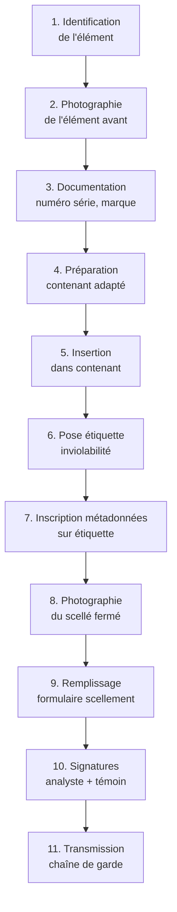
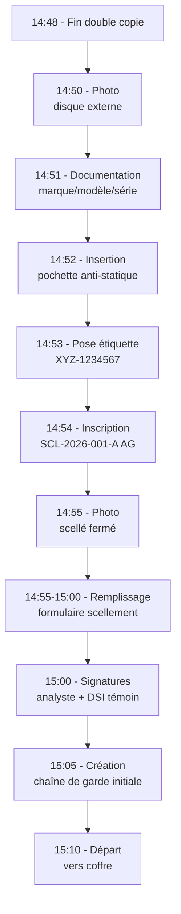

# 7.11 Procédure scellement et chaîne de garde

!!! quote "L'analogie du sceau de cire du notaire"

    Au Moyen Âge, un acte juridique était scellé à la cire chaude par le notaire ou le seigneur. Le sceau imprimait une marque unique reconnaissable : armoiries familiales, blason, monogramme. Si le pli était brisé, tout le monde pouvait constater que le document avait été ouvert. Si le sceau était imité, la différence avec l'original était immédiatement visible. Cette pratique vieille de mille ans avait une fonction unique : prouver qu'un objet n'avait pas été manipulé entre son scellement et son ouverture officielle. La forensique numérique reproduit exactement cette mécanique avec des moyens modernes. Le sceau de cire est devenu une étiquette inviolable holographique. Le hash cryptographique remplace la signature manuscrite. La chaîne de garde retrace chaque main qui a touché le scellé. Mais la fonction reste identique : démontrer mathématiquement que la preuve présentée au juge est exactement celle prélevée sur les lieux.

## Métadonnées du chapitre

Ce chapitre est au cœur de la dimension juridique du DFIR. Voici ses caractéristiques.

| Champ | Valeur |
|---|---|
| Durée estimée | 3 heures |
| Niveau | Pratique critique juridique |
| Prérequis | 7.10 (hash et copies réalisés) |
| Livrables | Scellement complet et formulaire chaîne de garde |
| Auto-explication | 12 minutes |

## Objectifs pédagogiques

À l'issue de ce chapitre, vous serez capable de :

- Définir scellement et chaîne de garde
- Citer le cadre juridique français applicable
- Lister le matériel de scellement nécessaire
- Effectuer un scellement conforme
- Remplir un formulaire de chaîne de garde
- Identifier les manipulations autorisées et interdites
- Diagnostiquer une rupture de chaîne de garde

---

## 1. Définitions

### 1.1 Scellement

Voici la définition technique du scellement.

```text
SCELLEMENT
============

Définition
  Opération consistant à conditionner un élément
  de preuve dans un contenant inviolable, identifié
  de manière unique, daté et signé.

Objectifs
  - Prouver l'absence de manipulation
  - Identifier l'élément de manière unique
  - Documenter la prise en charge
  - Préparer la transmission
  - Sécuriser le stockage

Composantes
  - Contenant physique sécurisé
  - Étiquette d'inviolabilité unique
  - Identifiant numéroté
  - Métadonnées (qui, quoi, quand, où)
  - Signatures (analyste + témoin)
```

### 1.2 Chaîne de garde

Voici la définition de la chaîne de garde.

```text
CHAÎNE DE GARDE (CHAIN OF CUSTODY)
======================================

Définition
  Documentation continue retraçant chaque transmission,
  manipulation et stockage d'un élément de preuve depuis
  sa collecte jusqu'à sa présentation au tribunal.

Composantes
  Pour chaque transmission ou manipulation :
    - Date et heure (UTC)
    - Identité de l'expéditeur
    - Identité du destinataire
    - Action effectuée
    - Vérification d'intégrité (hash si numérique)
    - Signatures des deux parties

Principe
  Aucun trou temporel autorisé.
  Tout moment où le scellé n'est pas explicitement
  sous responsabilité documentée est une rupture
  de chaîne et fragilise la preuve.
```

### 1.3 Différence avec acquisition

Voici la distinction entre acquisition et scellement.

| Phase | Scope | Objet |
|---|---|---|
| Acquisition | Collecte technique | Création de l'image forensique |
| Hash | Validation | Empreinte cryptographique |
| Double copie | Redondance | Sauvegardes |
| Scellement | Conditionnement | Mise sous scellé physique |
| Chaîne de garde | Traçabilité | Documentation continue |

## 2. Cadre juridique français

### 2.1 Code de procédure pénale

Voici les articles pertinents du Code de procédure pénale.

| Article | Domaine |
|---|---|
| Article 56 | Saisies pendant flagrance |
| Article 56-1 | Cabinets d'avocats spécifique |
| Article 56-2 | Locaux médecins, magistrats |
| Article 76 | Perquisitions sans flagrance |
| Article 81 | Pouvoirs du juge d'instruction |
| Article 92 | Saisies pendant instruction |
| Article 97 | Mise sous scellé pendant instruction |
| Article 230-1 à 230-5 | Expertise numérique encadrée |
| Article 706-94 | Saisies en matière de criminalité organisée |

### 2.2 Article 97 - Détaillé

L'article 97 du CPP est central pour la mise sous scellé.

```text
ARTICLE 97 CPP - EXTRAIT
==========================

"Lorsqu'il y a lieu, en cours d'information, de rechercher
des documents et sous réserve des nécessités de l'information
et du respect, le cas échéant, de l'obligation stipulée par
l'alinéa 3 de l'article 96, le juge d'instruction ou
l'officier de police judiciaire commis par lui a seul le
droit d'en prendre connaissance avant de procéder à la saisie.

Tous objets et documents placés sous main de justice sont
immédiatement inventoriés et placés sous scellés."

Implications pour analyste DFIR
  - Si mission ordonnée par juge d'instruction
  - Vous opérez sous mandat précis
  - Le scellement est OBLIGATOIRE et IMMÉDIAT
  - L'inventaire doit accompagner le scellé
  - Toute rupture peut entraîner nullité de la procédure
```

### 2.3 Code civil et preuve électronique

Voici les articles du code civil concernant la preuve électronique.

| Article | Disposition |
|---|---|
| Article 1366 | Écrit électronique = écrit papier (équivalence) |
| Article 1367 | Signature électronique reconnue |
| Article 1368 | Signature électronique qualifiée |
| Article 1369 | Convention sur preuve électronique |
| Article 1379 | Copie fiable = original |

L'article 1366 est fondamental : la preuve électronique a la **même valeur** que la preuve papier, à condition que son intégrité soit garantie. C'est précisément ce que la chaîne de garde permet.

### 2.4 RGPD et données personnelles

Le RGPD impose des obligations spécifiques sur la manipulation de données personnelles dans le cadre forensique.

| Article RGPD | Obligation |
|---|---|
| Article 5 | Minimisation des données |
| Article 6 | Base légale (intérêt légitime, obligation légale) |
| Article 32 | Sécurité du traitement |
| Article 33 | Notification CNIL en cas de violation |
| Article 35 | Analyse d'impact si traitement risqué |

### 2.5 Articles 226-1 et 226-13 du Code pénal

Les articles 226-1 (vie privée) et 226-13 (secret professionnel) imposent des limites.

```text
ARTICLE 226-13 CP - SECRET PROFESSIONNEL
============================================

"La révélation d'une information à caractère secret
par une personne qui en est dépositaire soit par état
ou par profession, soit en raison d'une fonction ou
d'une mission temporaire, est punie d'un an
d'emprisonnement et de 15 000 € d'amende."

Application analyste DFIR
  - Tout ce qui est trouvé dans une acquisition
    EST couvert par le secret professionnel
  - Pas de divulgation hors cadre légal
  - Conservation sécurisée obligatoire
  - Restitution ou destruction post-mission selon mandat
```

## 3. Standards internationaux

### 3.1 ISO/IEC 27037:2012

Voici les exigences principales d'ISO 27037 sur la chaîne de garde.

| Section | Contenu |
|---|---|
| Section 5.4.1 | Identification unique des éléments |
| Section 5.4.2 | Conservation de l'intégrité |
| Section 5.4.3 | Documentation continue |
| Section 6.2 | Procédures de scellement |
| Section 6.3 | Manipulation des médias |
| Annexe A | Modèles de formulaires |

### 3.2 NIST SP 800-86

Le NIST SP 800-86 (Guide to Integrating Forensic Techniques) impose plusieurs principes.

```text
NIST SP 800-86 - PRINCIPES CLÉS
=================================

Principe 1 - Documentation systématique
  Chaque action documentée immédiatement
  Pas d'enregistrement a posteriori

Principe 2 - Multiple personnes
  Témoin présent lors d'opérations critiques
  Double signature recommandée

Principe 3 - Traçabilité physique et numérique
  Localisation à tout moment
  Hashes vérifiés à chaque transmission

Principe 4 - Préservation contre altération
  Stockage sécurisé entre transmissions
  Accès limité et tracé

Principe 5 - Reproductibilité
  Procédure permettant à un autre analyste
  de reproduire l'analyse depuis le scellé
```

### 3.3 ENFSI (réseau européen)

L'ENFSI (European Network of Forensic Science Institutes) propose des guides spécifiques.

| Document ENFSI | Domaine |
|---|---|
| Best Practice Manual for Digital Forensics | Procédure complète |
| QCC-CFT-001 | Compétences forensiques |
| Standards for Validation | Validation des méthodes |

### 3.4 ASTM E2916

L'ASTM E2916 (Standard Terminology for Digital and Multimedia Evidence Examination) standardise le vocabulaire international.

## 4. Matériel de scellement

### 4.1 Matériel de base

Voici le matériel de base nécessaire pour le scellement.

| Matériel | Fonction |
|---|---|
| Pochettes anti-statiques | Protection contre décharges |
| Pochettes Faraday | Isolation électromagnétique |
| Étiquettes d'inviolabilité numérotées | Détection ouverture |
| Sceaux thermosoudés ou plombs | Fermeture infalsifiable |
| Marqueurs permanents | Inscription métadonnées |
| Stylo bille indélébile | Signatures |
| Étiquettes papier collantes | Étiquetage primaire |
| Sacs cartonnés rigides | Transport |
| Container scellable (boîte) | Stockage long terme |

### 4.2 Étiquettes d'inviolabilité

Voici les caractéristiques des étiquettes d'inviolabilité forensiques.

```text
ÉTIQUETTES INVIOLABILITÉ FORENSIQUES
========================================

Caractéristiques requises
  - Numéro unique séquentiel pré-imprimé
  - Patron de "VOID" apparaissant si décollée
  - Adhésif fort non-réutilisable
  - Résistance à humidité et chaleur
  - Encre indélébile pour annotations

Marques courantes
  Tamper-Evident Labels (différents fabricants)
  ECC Forensic Bags
  Arrowhead Forensics
  Sirchie

Information à inscrire
  - N° de scellé
  - Référence incident / dossier
  - Date / heure UTC
  - Initiales analyste
  - Hash SHA-256 abrégé (16 premiers caractères)

Pose
  Sur la fermeture du contenant
  Recouvrant la jointure
  Si décollement → "VOID" visible
```

### 4.3 Pochettes Faraday

Les pochettes Faraday isolent un appareil de toutes ondes.

```text
POCHETTES FARADAY - USAGE FORENSIQUE
=======================================

Objectif
  Empêcher communications sans fil
  - Wi-Fi
  - Bluetooth
  - Cellulaire (3G/4G/5G)
  - GPS
  - NFC

Cas d'usage
  - Smartphone saisi (avant acquisition)
  - Tablette compromise
  - Objet connecté avec C2
  - Dongle Bluetooth de keylogger

Spécifications
  Atténuation > 80 dB recommandé
  Multi-fréquences
  Fermeture sécurisée

Marques
  Mission Darkness
  EDEC Black Hole
  Faraday Defense
  Ramsey Electronics

Important
  La batterie continue à se décharger.
  Pour conservation longue, brancher hors pochette
  ou prévoir alimentation de secours.
```

### 4.4 Containers de stockage

Pour le stockage long terme, plusieurs options existent.

| Container | Usage |
|---|---|
| Coffre-fort forensique | Stockage local CSIRT |
| Salle sécurisée à accès contrôlé | Stockage entreprise |
| Local commissariat (police) | Stockage judiciaire |
| Greffe tribunal | Stockage très long terme |
| Coffre bancaire | Très haute valeur |

### 4.5 Kit de scellement portable

Voici le kit de scellement à embarquer en mission.

```text
KIT DE SCELLEMENT PORTABLE
=============================

Contenu type pour un analyste
  /Pochettes
    20x pochettes anti-statiques A5
    10x pochettes anti-statiques A4
    5x pochettes Faraday (différentes tailles)
    
  /Étiquettes
    1 rouleau étiquettes inviolables (100 unités)
    2 carnets étiquettes papier
    
  /Fixation
    1 rouleau scotch large transparent
    Sceaux plombs (10)
    Cordelettes (3 m)
    
  /Marquage
    3 marqueurs permanents noirs
    2 stylos bille indélébiles
    Cachet ou tampon avec coordonnées
    
  /Documentation
    20 formulaires de scellement vierges
    20 formulaires chaîne de garde vierges
    Carnet horodatage personnel
    
  /Container
    Mallette rigide pour transport
    Boîte plastique étanche
```

## 5. Procédure de scellement physique

### 5.1 Vue d'ensemble

Voici la procédure complète de scellement.



### 5.2 Étape 1 - Identification

Voici les informations à collecter sur l'élément.

| Information | Source |
|---|---|
| Type d'élément | Disque externe, carte SD, etc. |
| Marque | Étiquette fabricant |
| Modèle | Étiquette fabricant |
| N° série | Étiquette fabricant |
| Capacité | Étiquette fabricant ou OS |
| État physique | Observation visuelle |
| Indices particuliers | Rayures, autocollants, etc. |

### 5.3 Étape 2 - Photographie pré-scellement

La photographie est obligatoire en chaque scellement.

```text
PHOTOGRAPHIES PRÉ-SCELLEMENT
================================

Photos à prendre
  - Vue générale élément
  - Étiquette numéro série lisible
  - Toutes faces de l'élément
  - Connecteurs et états physiques
  - Échelle de référence (règle ou euro)

Métadonnées image
  - Horodatage automatique appareil
  - GPS si compatible
  - Référence dossier en cadre

Stockage
  - Carte SD dédiée à l'incident
  - Hash SHA-256 de chaque photo
  - Archivage avec le scellé numérique
```

### 5.4 Étape 3 - Choix du contenant

Le contenant doit être adapté au type d'élément.

| Type d'élément | Contenant recommandé |
|---|---|
| Disque dur 3.5" | Pochette anti-statique grande |
| Disque dur 2.5" / SSD | Pochette anti-statique moyenne |
| Clé USB | Pochette anti-statique petite |
| Carte SD / microSD | Mini-pochette + boîte rigide |
| Smartphone allumé | Pochette Faraday + boîte |
| Smartphone éteint | Pochette anti-statique |
| Ordinateur portable | Sac cartonné + pochette intérieur |

### 5.5 Étape 4 - Pose de l'étiquette

L'étiquette d'inviolabilité doit être posée correctement.

```text
POSE DE L'ÉTIQUETTE INVIOLABILITÉ
====================================

Position
  Sur la jointure de fermeture du contenant
  Recouvrant le passage entre les deux faces
  Si plusieurs ouvertures : étiquette par ouverture

Procédure
  1. Choisir étiquette numérotée
  2. Noter le numéro dans le formulaire
  3. Décoller protection
  4. Appliquer fermement sur la jointure
  5. Lisser pour adhésion complète
  6. Laisser sécher 30 secondes

Inscription sur l'étiquette
  - Numéro de scellé interne (SCL-2026-001)
  - Date / heure UTC
  - Initiales analyste
  - Premiers caractères hash si applicable

NE PAS FAIRE
  - Réutiliser une étiquette
  - Recoller après décollement partiel
  - Plier l'étiquette en deux
  - Remettre une étiquette à côté
```

### 5.6 Étape 5 - Photographie post-scellement

Une seconde photographie documente l'état scellé.

```text
PHOTOGRAPHIES POST-SCELLEMENT
=================================

Photos à prendre
  - Vue générale du scellé fermé
  - Numéro d'étiquette lisible
  - Inscriptions de l'étiquette
  - Cohérence avec photos pré-scellement

Objectif
  Permettre de prouver l'état initial du scellé
  En cas de litige, comparer avec état actuel
```

## 6. Formulaire de scellement

### 6.1 Modèle complet

Voici le modèle complet de formulaire de scellement.

```text
FORMULAIRE DE SCELLEMENT - OmnyVia
=====================================

REFERENCES
  Référence interne     : SCL-2026-001
  Référence incident    : INC-2026-001
  Mandat / réquisition  : ___________________
  Magistrat saisissant  : ___________________

DATE ET LIEU
  Date                  : 2026-04-30
  Heure début scellement: 14:50:30 UTC
  Heure fin scellement  : 14:55:00 UTC
  Lieu                  : ARTECH SAS, 27 rue X, 69009 Lyon
  Locaux précis         : Bureau comptabilité, étage 2

PERSONNES PRÉSENTES
  Analyste (auteur)
    Nom            : Alain Guillon
    Société        : OmnyVia
    Fonction       : Consultant DFIR
    Identité vérif.: CNI n° XXXXXXX
    Signature      : _____________

  Témoin 1
    Nom            : ___________________
    Fonction       : ___________________
    Identité vérif.: ___________________
    Signature      : _____________

  Témoin 2 (si présent)
    Nom            : ___________________
    Fonction       : ___________________
    Identité vérif.: ___________________
    Signature      : _____________

ELEMENT MIS SOUS SCELLE
  Type              : Disque externe SSD
  Marque            : Samsung
  Modèle            : T7 Touch
  Numéro de série   : S5VYNN0R702345A
  Capacité          : 1 To
  Filesystem        : exFAT
  État physique     : Neuf, sans dommage apparent
  Particularités    : Aucune
  
NUMERO ETIQUETTE INVIOLABILITE
  Étiquette principale : XYZ-1234567
  Position             : Jointure fermeture
  Inscriptions         : SCL-2026-001 / 2026-04-30 / AG

CONTENU NUMERIQUE
  Fichier 1
    Nom     : WIN-COMPTA-01-20260430-143215.raw
    Taille  : 17 179 869 184 octets
    Hash SHA-256 :
      a1b2c3d4e5f6789012345678901234567890abcdef
      0123456789abcdef0123456789abcdef0123456789

  Fichier 2
    Nom     : WIN-COMPTA-01-20260430-143215.log
    Taille  : 4 096 octets
    Hash SHA-256 :
      9876543210fedcba0987654321098765432109876
      54321098765432109876543210987654321098765

  Fichier 3
    Nom     : WIN-COMPTA-01-20260430-143215.json
    Taille  : 2 048 octets
    Hash SHA-256 : ...

CONTEXTE
  Description de l'opération :
    Acquisition mémoire d'un poste compromis par
    ransomware suspecté. Procédure conforme au
    chapitre 7.4 et 7.5 d'OmnyAcademy. Hash
    vérifié immédiatement post-acquisition.
    Double copie réalisée sur supports distincts.

  Outil utilisé : Magnet RAM Capture v1.20

PHOTOGRAPHIES
  Pré-scellement   : 5 photos (refs PHOTO-001 à 005)
  Post-scellement  : 3 photos (refs PHOTO-006 à 008)
  Hash SHA-256 de l'archive photos :
    0123456789abcdef...

OBSERVATIONS PARTICULIERES
  ____________________________________________
  ____________________________________________

DESTINATION
  Stockage initial : Coffre forensic OmnyVia
  Adresse          : ___________________
  Responsable      : Alain Guillon
  Conservation prévue : 5 ans minimum

DOCUMENTS ANNEXES
  [ ] Formulaire chaîne de garde initial
  [ ] Photographies (CD/USB séparé)
  [ ] Journal d'acquisition technique
  [ ] Hash de référence (carnet papier)

DATE ET SIGNATURE
  Date complète : ____________________
  
  Analyste : ____________  Témoin 1 : ____________

  Témoin 2 : ____________
```

### 6.2 Numérotation des scellés

La numérotation doit être unique et traçable.

```text
CONVENTION DE NUMÉROTATION OmnyVia
=====================================

Format
  SCL-<année>-<numéro>-<lettre>

  SCL    : préfixe scellé
  année  : 4 chiffres (2026)
  numéro : 3 chiffres séquentiel par an (001, 002, ...)
  lettre : A, B, C... si plusieurs scellés pour même incident

Exemples
  SCL-2026-001-A : Premier scellé incident 1
  SCL-2026-001-B : Deuxième scellé incident 1
  SCL-2026-002-A : Premier scellé incident 2

Registre
  Excel ou base de données avec numérotation séquentielle
  Pas de numéros sautés (signal d'alarme)
  Audit trimestriel cohérence

Lien avec incident
  Le n° d'incident référence l'investigation globale
  Le n° de scellé référence un objet précis
  Un incident peut avoir plusieurs scellés
```

## 7. Document de chaîne de garde

### 7.1 Modèle complet

Voici le modèle de document de chaîne de garde à maintenir.

```text
CHAÎNE DE GARDE - SCELLE SCL-2026-001-A
==========================================

Référence scellé    : SCL-2026-001-A
Référence incident  : INC-2026-001
Description scellé  : Disque externe SSD Samsung T7
                      contenant acquisition mémoire
                      WIN-COMPTA-01

HISTORIQUE DES TRANSMISSIONS
================================

Entrée 1 - Création du scellé
  Date / heure UTC : 2026-04-30T14:55:00Z
  Lieu             : ARTECH SAS Lyon Vaise
  Action           : Mise sous scellé initiale
  Auteur           : Alain Guillon (OmnyVia)
  Témoin           : Sophie Dupont (DSI ARTECH)
  Hash SHA-256 vérifié post-scellement :
    a1b2c3d4e5f6789...
  Signatures       : __________ / __________

Entrée 2 - Transport vers stockage
  Date / heure UTC : 2026-04-30T16:30:00Z
  Lieu départ      : ARTECH SAS Lyon Vaise
  Lieu arrivée     : Coffre OmnyVia
  Mode transport   : Véhicule personnel sécurisé
  Durée            : 1h05
  Conducteur       : Alain Guillon
  Étiquette        : Intacte (vérifiée à arrivée)
  Photo arrivée    : PHOTO-009
  Signature        : __________

Entrée 3 - Mise au coffre
  Date / heure UTC : 2026-04-30T17:35:00Z
  Lieu             : Coffre OmnyVia
  Action           : Stockage longue durée
  Responsable      : Alain Guillon
  Témoin           : Aucun (pas requis stockage interne)
  Conditions       : Température ambiante, sec
  Signature        : __________

Entrée 4 - Extraction pour analyse
  Date / heure UTC : 2026-05-02T09:15:00Z
  Lieu             : Laboratoire OmnyVia
  Action           : Extraction pour analyse Volatility
  Auteur           : Alain Guillon
  Étiquette        : Intacte (vérifiée à extraction)
  Hash SHA-256 vérifié sur copie analyse :
    a1b2c3d4e5f6789... (IDENTIQUE)
  Témoin           : __________
  Signature        : __________

Entrée 5 - Re-mise au coffre
  Date / heure UTC : 2026-05-02T16:30:00Z
  Lieu             : Coffre OmnyVia
  Action           : Re-stockage post-analyse
  Auteur           : Alain Guillon
  Étiquette        : Intacte
  Signature        : __________

Entrée 6 - Transmission à magistrat
  Date / heure UTC : 2026-06-15T10:00:00Z
  Lieu             : Tribunal Lyon
  Action           : Remise officielle
  Expéditeur       : Alain Guillon (OmnyVia)
  Destinataire     : M. le Juge X
  Document remis   : Récépissé contre-signé
  Étiquette        : Intacte
  Hash SHA-256 vérifié à remise :
    a1b2c3d4e5f6789... (IDENTIQUE)
  Signature expéd. : __________
  Signature dest.  : __________

[continuation potentielle ad infinitum]
```

### 7.2 Règles strictes

Voici les règles strictes de la chaîne de garde.

| Règle | Conséquence si non respectée |
|---|---|
| Continuité temporelle stricte | Rupture de chaîne |
| Signature à chaque transmission | Preuve fragilisée |
| Vérification étiquette à chaque ouverture | Suspicion d'altération |
| Vérification hash à chaque ouverture | Intégrité non garantie |
| Documentation immédiate | Reconstruction impossible |
| Pas de transmission sans formulaire | Étape niée juridiquement |
| Conservation séparée du formulaire et scellé | Si perte du scellé, traçabilité subsiste |

### 7.3 Fréquence de vérification

Voici les moments où l'étiquette et le hash doivent être vérifiés.

```text
MOMENTS DE VÉRIFICATION
==========================

Vérification étiquette physique
  - À chaque transmission
  - À chaque sortie du stockage
  - À chaque arrivée dans nouveau lieu
  - Audit annuel systématique

Vérification hash cryptographique
  Même fréquence que étiquette physique
  Sur la copie de travail (pas l'original)
  
Si divergence détectée
  - STOP immédiat
  - Documenter heure exacte de la détection
  - Photographier le scellé en l'état
  - Notifier hiérarchie et magistrat
  - Procédure d'investigation interne
  - Probable dégradation valeur preuve
```

## 8. Manipulations autorisées et interdites

### 8.1 Tableau récapitulatif

Voici la matrice des manipulations.

| Manipulation | Autorisée ? | Conditions |
|---|---|---|
| Vérification visuelle étiquette | Oui | À chaque transmission |
| Photographie du scellé fermé | Oui | Documentation |
| Pesée du contenant | Oui | Optionnel |
| Mesure dimensions | Oui | Optionnel |
| Ouverture du scellé | Oui | Documentée + témoin |
| Lecture du contenu numérique | Oui | Sur copie de travail |
| Modification du contenu | NON | Jamais sur original |
| Connexion à un réseau | Variable | Selon cas |
| Test live de l'OS | Variable | Sur copie boot uniquement |
| Décollement partiel étiquette | NON | Considéré ouverture |

### 8.2 Procédure d'ouverture documentée

Voici la procédure pour ouvrir un scellé légalement.

```text
OUVERTURE LÉGALE D'UN SCELLÉ
================================

Conditions
  - Justification écrite de l'ouverture
  - Présence d'un témoin
  - Photographie pré-ouverture
  - Documentation horodatée

Procédure
  1. Vérification étiquette intacte
  2. Photo de l'étiquette intacte
  3. Décollement complet de l'étiquette
  4. Conservation de l'étiquette décollée comme preuve
  5. Photo de l'élément à l'ouverture
  6. Action prévue (lecture, copie, etc.)
  7. Re-scellement avec NOUVELLE étiquette
  8. Documentation complète chaîne de garde
  9. Signatures expéditeur + témoin

Important
  L'étiquette d'origine reste dans le dossier.
  Une nouvelle étiquette est posée pour le re-scellement.
  Le formulaire chaîne de garde mentionne :
    - Numéro étiquette d'origine (vérifiée intacte)
    - Numéro nouvelle étiquette
    - Raison d'ouverture
    - Action effectuée
```

### 8.3 Manipulations sur copies vs original

La règle d'or : **le scellé original est intouchable**.

| Élément | Travail autorisé |
|---|---|
| Original (sous scellé) | Stockage uniquement |
| Copy1 (coffre équipe) | Stockage uniquement |
| Copy2 (NAS) | Stockage uniquement |
| Copie de travail | Toutes manipulations |

```text
RÈGLE D'OR
============

Toute manipulation forensique se fait sur une
COPIE DE TRAVAIL, jamais sur l'original.

L'original sous scellé reste intouché.
Les copies de référence (Copy1, Copy2) sont des
backups, pas des objets de travail.

Une copie de travail est créée à chaque mission
d'analyse, validée par hash, puis détruite ou
archivée à la fin.

Cette discipline garantit que l'original peut
toujours être présenté en l'état initial.
```

## 9. Cas pratique

### 9.1 Scénario

Vous finalisez l'incident ARTECH du chapitre 7.4 (ransomware en cours). Acquisition réalisée, hashes calculés, double copie validée. Il reste à sceller.

### 9.2 Préparation matérielle

```text
MATÉRIEL POUR LE SCELLEMENT
==============================

Sur place
  Disque externe SSD original (Samsung T7) - F:
  Smartphone analyste pour photos
  
Kit scellement portable
  Pochettes anti-statiques A4
  Étiquettes inviolables (XYZ-1234567 disponible)
  Marqueurs permanents
  Formulaire scellement vierge
  Formulaire chaîne de garde vierge
  
Carnet horodatage personnel
```

### 9.3 Exécution

Voici l'enchainement complet.



### 9.4 Documentation finale

Tous les documents générés sont consolidés.

```text
DOSSIER COMPLET - INC-2026-001
==================================

Documents physiques
  - Formulaire scellement signé (1 copie)
  - Formulaire chaîne de garde (à enrichir)
  - Carnet horodatage analyste
  - Étiquette ancienne si re-scellement

Données numériques
  - Original sous scellé physique
  - Copy1 sur disque secondaire
  - Copy2 sur NAS sécurisé
  - Photos pré et post scellement
  - Logs d'acquisition complets
  - Hashes documentés trois emplacements

Traçabilité
  - Référence incident : INC-2026-001
  - Référence scellé : SCL-2026-001-A
  - Hash SHA-256 référence : a1b2c3d4...
  - Témoin scellement : Sophie Dupont (DSI ARTECH)

Étapes suivantes
  - Stockage immédiat coffre OmnyVia
  - Analyse Volatility sur copie de travail (J+2)
  - Rédaction rapport (chapitre 10)
  - Conservation 5 ans minimum
```

## 10. Pièges fréquents

### 10.1 Pièges juridiques

Voici les pièges juridiques fréquents.

| Piège | Conséquence | Évitement |
|---|---|---|
| Pas de témoin | Preuve contestable | Témoin à chaque scellement |
| Documentation a posteriori | Reconstruction suspecte | Documentation immédiate |
| Étiquette mal posée | Possibilité contournement | Pose stricte sur jointure |
| Témoin non identifié | Témoignage non opposable | Identité vérifiée avec papiers |
| Mandat dépassé | Acte illégal | Vérification mandat avant action |

### 10.2 Pièges techniques

Voici les pièges techniques fréquents.

| Piège | Conséquence | Évitement |
|---|---|---|
| Manipulation original | Altération preuve | Travail sur copies uniquement |
| Hashes non vérifiés à transmission | Intégrité douteuse | Vérification systématique |
| Photos sans date | Datation impossible | EXIF + caméra cohérente |
| Pochette inadaptée | Dommage physique | Choix selon type d'élément |
| Stockage non climatisé | Dégradation médias | Conditions contrôlées |

### 10.3 Pièges organisationnels

Voici les pièges organisationnels fréquents.

| Piège | Évitement |
|---|---|
| Numérotation incohérente | Registre unique séquentiel |
| Plusieurs scellés sans distinction | A, B, C explicites |
| Coffre partagé non contrôlé | Accès tracé et limité |
| Pas de revue annuelle | Audit organisé chaque année |
| Documents séparés du scellé sans backup | Triple stockage info |

## 11. Auto-évaluation

Vérifiez votre maîtrise par les questions suivantes.

| # | Question | Réponse |
|---|---|---|
| 1 | Article CPP central pour mise sous scellé ? | Article 97 |
| 2 | Standard ISO de référence ? | ISO/IEC 27037:2012 |
| 3 | Article code civil sur preuve électronique ? | Article 1366 |
| 4 | Combien de témoins minimum recommandés ? | 1 (idéalement 2) |
| 5 | Format d'identifiant scellé OmnyVia ? | SCL-AAAA-NNN-X |
| 6 | Pochette pour smartphone allumé ? | Faraday |
| 7 | Travail sur original autorisé ? | Non, jamais |
| 8 | Quand vérifier hash et étiquette ? | À chaque transmission |
| 9 | Conservation minimum recommandée ? | 5 ans |
| 10 | Si étiquette décollée trouvée ? | Stop, photographier, escalader |

## 12. Synthèse

Voici les points clés à retenir.

```text
SCELLEMENT ET CHAÎNE DE GARDE - SYNTHÈSE

CADRE JURIDIQUE
  CPP article 97 (mise sous scellé)
  CPP article 230-1+ (expertise numérique)
  Code civil article 1366 (équivalence preuve)
  Code pénal article 226-13 (secret pro)
  RGPD article 32+ (sécurité traitement)

STANDARDS
  ISO/IEC 27037:2012
  NIST SP 800-86
  RFC 3227 sections 2.3-2.5
  ENFSI Best Practice Manual
  ANSSI guide DFIR

MATÉRIEL
  Pochettes anti-statiques
  Pochettes Faraday (sans-fil)
  Étiquettes inviolables numérotées
  Marqueurs permanents
  Formulaires papier
  Container sécurisé stockage

PROCÉDURE SCELLEMENT
  1. Identification élément
  2. Photo pré-scellement
  3. Documentation détaillée
  4. Insertion contenant
  5. Pose étiquette inviolable
  6. Inscription métadonnées
  7. Photo post-scellement
  8. Formulaire signé
  9. Chaîne de garde initiale
  10. Stockage sécurisé

CHAÎNE DE GARDE
  Documentation continue
  Chaque transmission tracée
  Vérification étiquette + hash
  Signatures à chaque étape
  Pas de trou temporel
  Conservation document séparé

NUMÉROTATION
  SCL-AAAA-NNN-X
  Registre séquentiel unique
  Pas de numéro sauté
  Audit annuel cohérence

MANIPULATIONS
  Original : intouchable
  Copies de référence : stockage
  Copie de travail : toutes manipulations
  Re-scellement avec nouvelle étiquette

PHOTOGRAPHIES
  Pré-scellement : 4-5 photos
  Post-scellement : 2-3 photos
  À chaque transmission : 1 photo
  EXIF préservé
  Hash de l'archive photos

VÉRIFICATIONS À CHAQUE TRANSMISSION
  Étiquette intacte
  Hash cohérent
  Documentation complète
  Signatures authentiques

CONSERVATION
  5 ans minimum recommandé
  10+ ans pour affaires complexes
  Conditions contrôlées (température, humidité)
  Accès tracé et limité

ROUPTURE DE CHAÎNE
  Stop immédiat
  Photographie en l'état
  Notification hiérarchie
  Notification magistrat si applicable
  Investigation interne

POSITION OmnyAcademy
  Procédure obligatoire toute mission DFIR
  Formulaires standards à jour
  Kit scellement portable préparé
  Formation continue obligatoire
  Audit annuel registres
```

---

**Chapitre précédent** : [7.10 Hash immédiat et double copie](7-10-hash-immediat-double-copie.md)

**Chapitre suivant** : [7.12 Documentation acquisition cas réel](7-12-documentation-cas-reel.md)