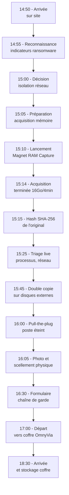

# 7.12 Documentation acquisition cas réel

!!! quote "L'analogie de l'examen pratique du permis de conduire"

    Le candidat au permis de conduire passe d'abord le code, puis les leçons théoriques, puis les heures de conduite avec un moniteur. À ce stade, il connaît tout, il a pratiqué chaque geste séparément. Mais le jour de l'examen pratique, l'inspecteur le fait conduire seul pendant trente minutes en conditions réelles. Tout est là : démarrer, naviguer en ville, faire un créneau, gérer un giratoire, anticiper un piéton. Cette mise en situation continue est ce qui distingue un conducteur déclaré qualifié d'un conducteur encore en formation. Ce chapitre est l'examen pratique du module 7. Vous avez appris la théorie, les outils, les procédures juridiques. Maintenant vous menez une mission complète de bout en bout, du moment où vous arrivez sur la scène ARTECH au moment où le scellé est dans le coffre. C'est dans cet enchaînement que les liens neuronaux se consolident.

## Métadonnées du chapitre

Ce chapitre est la consolidation pratique de tout le module 7. Voici ses caractéristiques.

| Champ | Valeur |
|---|---|
| Durée estimée | 3 heures |
| Niveau | Pratique synthèse |
| Prérequis | 7.1 à 7.11 (tous chapitres précédents) |
| Livrables | Mission complète documentée + modèles |
| Auto-explication | 15 minutes |

## Objectifs pédagogiques

À l'issue de ce chapitre, vous serez capable de :

- Mener une mission DFIR de bout en bout
- Coordonner toutes les phases sans perte de qualité
- Produire la documentation complète attendue
- Utiliser les modèles standardisés OmnyAcademy
- Identifier les points de contrôle critiques
- Anticiper les exigences post-mission
- Présenter votre travail à un magistrat ou juge

---

## 1. Présentation du cas

### 1.1 Contexte fil-rouge ARTECH

Voici le contexte du cas réel simulé.

```text
CONTEXTE ARTECH SAS
======================

Entreprise
  Raison sociale : ARTECH SAS
  Activité : Distribution de matériel médical
  Siège : 27 rue X, 69009 Lyon Vaise
  Effectif : 42 salariés
  Système d'information : 3 PC + 1 serveur Debian + WiFi

Incident déclenché
  Date : 2026-04-30
  Heure découverte : 14:25 UTC (16:25 locale)
  Découvreur : Sophie Dupont, comptable

Symptômes initiaux
  - Wallpaper modifié sur poste comptabilité
  - Fichiers .txt étranges dans tous les dossiers
  - Extensions modifiées sur documents Excel
  - Pop-up demandant rançon

Premier appel
  14:30 UTC : Sophie appelle DSI Hélène Lefebvre
  14:35 UTC : Hélène contacte OmnyVia (contrat retainer)
  14:40 UTC : Alain Guillon (analyste OmnyVia) confirme intervention
  14:50 UTC : Arrivée sur site
```

### 1.2 Configuration technique cible

Voici la configuration du poste compromis.

| Caractéristique | Valeur |
|---|---|
| Hostname | WIN-COMPTA-01 |
| OS | Windows 11 22H2 (Build 22621) |
| RAM physique | 16 Go |
| Disque système | 512 Go NVMe |
| Disque secondaire | 1 To HDD (données) |
| Utilisateur principal | sdupont |
| Domaine | artech.local |
| BitLocker | Activé sur disque système |
| Antivirus | Microsoft Defender (signatures à jour) |
| Connexion | Filaire RJ45 vers switch |

### 1.3 Mandat de mission

```text
MANDAT DE MISSION OmnyVia
============================

Donneur d'ordre
  Hélène Lefebvre, PDG ARTECH SAS

Référence contrat
  CRT-2025-ARTECH-001 (contrat retainer DFIR)

Mission
  Réponse à incident sur WIN-COMPTA-01
  - Acquisition mémoire forensique
  - Triage initial
  - Préparation pour analyse approfondie
  - Documentation pour notification CNIL si applicable

Étendue
  - Poste WIN-COMPTA-01 (sous scellé après acquisition)
  - Pas d'autres postes à ce stade
  - Pas d'analyse forensique disque (séparée)

Durée prévue
  4 heures sur site
  +2 heures travaux administratifs

Livrables
  - Acquisition mémoire complète sous scellé
  - Rapport d'intervention détaillé
  - Recommandations préliminaires
  - Préparation dossier CNIL (article 33 RGPD)

Cadre juridique
  Mandat civil (relation contractuelle B2B)
  Pas de réquisition judiciaire à ce stade
  Documents susceptibles d'être versés en justice ultérieurement
```

## 2. Vue d'ensemble du déroulé

### 2.1 Chronologie complète

Voici la chronologie complète prévue de l'intervention.



### 2.2 Récapitulatif des références

| Référence | Valeur |
|---|---|
| Numéro incident OmnyVia | INC-2026-001 |
| Numéro scellé | SCL-2026-001-A |
| Référence contrat | CRT-2025-ARTECH-001 |
| Hash SHA-256 référence | a1b2c3d4e5f6789... |
| Étiquette inviolabilité | XYZ-1234567 |

## 3. Phase 1 - Reconnaissance (14:50 à 15:00)

### 3.1 Évaluation initiale

À l'arrivée sur site, vous procédez à la reconnaissance rapide selon le chapitre 7.4.

```text
RECONNAISSANCE RAPIDE - 14:50 à 14:55
========================================

Indicateurs visuels constatés
  [X] Wallpaper modifié (ransom note)
  [X] Fichiers HOW_TO_DECRYPT.txt dans tous les dossiers
  [X] Extensions .lockbit sur fichiers Excel
  [X] Pop-up permanent demandant 50 000 USD en BTC
  [X] LED disque allumée en permanence

Confiance
  Quatre indicateurs concordent → ransomware actif confirmé

Identification famille (estimation visuelle)
  Texte ransom note : style LockBit 3.0
  Wallpaper : "All your files are encrypted by LockBit"
  À confirmer post-acquisition via ID Ransomware
```

### 3.2 Photographie initiale

```text
PHOTOGRAPHIES INITIALES - 14:55
=================================

Photos prises (smartphone analyste)
  PHOTO-001 : Wallpaper de l'écran (ransom note)
  PHOTO-002 : Fenêtre demande rançon avec compteur
  PHOTO-003 : Explorer Windows avec extensions chiffrées
  PHOTO-004 : Vue générale poste de travail
  PHOTO-005 : Câble réseau Ethernet branché

Conservation
  Carte SD dédiée incident
  Hash SHA-256 archive photos calculé en fin de mission
```

### 3.3 Interrogatoire utilisateur

```text
INTERROGATOIRE SOPHIE DUPONT - 14:57 à 14:59
================================================

Q : À quelle heure avez-vous remarqué le problème ?
R : Vers 14h25, j'ai vu les fichiers Excel devenir illisibles.

Q : Qu'avez-vous fait juste avant ?
R : J'ai ouvert un email de la part d'un fournisseur,
    avec une facture en pièce jointe Word. J'ai cliqué
    sur "Activer le contenu" pour voir le tableau.

Q : Combien de temps après ?
R : Peut-être 15-20 minutes. J'ai continué à travailler
    sur d'autres dossiers pendant ce temps.

Q : Avez-vous redémarré ou éteint quelque chose ?
R : Non, j'ai juste appelé Hélène quand j'ai vu le pop-up.

Q : Êtes-vous connectée à des partages réseau ?
R : Oui, le partage Comptabilité sur le serveur Debian.

Q : Avez-vous des sauvegardes récentes ?
R : Le serveur fait des sauvegardes mais je ne sais pas
    quand la dernière a réussi.

Notes analyste
  - Vecteur entrée : phishing email avec macro Word
  - Délai infection-symptômes : 15-20 minutes
  - Propagation potentielle : partage SMB serveur Debian
  - Sauvegardes à vérifier urgemment
```

## 4. Phase 2 - Décision et préparation (15:00 à 15:10)

### 4.1 Décisions critiques

```text
DÉCISIONS PRISES - 15:00
==========================

Décision 1 - Isolation réseau
  Action : Débrancher le câble Ethernet
  Justification : Partage SMB monté = propagation possible
  Heure : 15:00 UTC

Décision 2 - Acquisition mémoire avant arrêt
  Action : Lancer acquisition prioritaire
  Justification : Clés LockBit potentiellement en RAM
  Heure : 15:05 UTC

Décision 3 - Conservation périphériques
  Action : Ne pas retirer clé USB branchée
  Justification : Possibilité indices forensiques
  Heure : 15:00 UTC

Décision 4 - Notification
  Action : DSI a déjà notifié PDG (avant arrivée)
  Suite : CNIL si données personnelles confirmées
  RGPD article 33 : 72h pour décider notification
```

### 4.2 Préparation matérielle

```text
PRÉPARATION ACQUISITION - 15:05
=================================

Branchements
  - Kit USB read-only OmnyVia (E:) sur port USB 3.0 avant
  - Disque externe Samsung T7 1To (F:) sur port USB 3.0 arrière
  - Disque externe WD My Passport (G:) prêt pour copie

Vérifications
  E: reconnu, lecture seule confirmée par essai écriture
  F: reconnu, espace libre 950 Go (RAM 16Go ≪ 950Go)
  Filesystem F: : exFAT
  
Outil sélectionné
  Magnet RAM Capture v1.20 (premier choix kit OmnyAcademy)
  Path : E:\01-Acquisition-Memoire\MagnetRAMCapture\

Backup outil
  DumpIt v2.x dans même répertoire si Magnet échoue
```

## 5. Phase 3 - Acquisition (15:10 à 15:14)

### 5.1 Lancement Magnet RAM Capture

```powershell
# Note : commandes lancées sur poste compromis
# avec utilisateur sdupont (déjà connecté)
# Élévation UAC requise pour l'outil

# Lancement Magnet RAM Capture
Start-Process "E:\01-Acquisition-Memoire\MagnetRAMCapture\MagnetRAMCapture.exe" -Verb RunAs

# Configuration dans l'interface :
#   Output path : F:\acquisitions\incident-2026-001\
#   Filename : WIN-COMPTA-01-20260430-151000.raw
#   Format : raw (DD)
#   Compute Hash : SHA-256
#   Cliquer Start

# Surveillance progression
# 17 179 869 184 octets à acquérir
# Débit observé : 78 Mo/s
# Durée estimée : 207 secondes
```

### 5.2 Surveillance acquisition

```text
SURVEILLANCE ACQUISITION - 15:10 à 15:14
==========================================

15:10:00  Démarrage acquisition
15:10:30  Progression 12% (2 Go / 16 Go)
15:11:00  Progression 24% (4 Go / 16 Go)
15:11:30  Progression 36% (6 Go / 16 Go)
15:12:00  Progression 48% (8 Go / 16 Go)
15:12:30  Progression 60% (10 Go / 16 Go)
15:13:00  Progression 72% (12 Go / 16 Go)
15:13:30  Progression 84% (14 Go / 16 Go)
15:14:00  Progression 96% (15.4 Go / 16 Go)
15:14:30  Acquisition terminée

Durée totale : 4 minutes 30 secondes
Débit moyen : 73.7 Mo/s
Fichiers générés
  WIN-COMPTA-01-20260430-151000.raw (16 Go)
  WIN-COMPTA-01-20260430-151000.log (4 Ko)
  WIN-COMPTA-01-20260430-151000.json (2 Ko)
  WIN-COMPTA-01-20260430-151000.hash (100 octets)
```

### 5.3 Validation post-acquisition immédiate

```powershell
# Vérification immédiate
$dump = "F:\acquisitions\incident-2026-001\WIN-COMPTA-01-20260430-151000.raw"

# Test 1 - Existence
if (Test-Path $dump) { Write-Host "[OK] Fichier présent" }

# Test 2 - Taille = RAM physique
$size = (Get-Item $dump).Length
$ram = (Get-WmiObject Win32_ComputerSystem).TotalPhysicalMemory
if ($size -eq $ram) { Write-Host "[OK] Taille cohérente" }

# Test 3 - Lecture du log Magnet
Get-Content "$dump.log" | Where-Object { $_ -match "ERROR|WARNING" }

# Test 4 - Hash dans .hash file vs hash recalculé
$hashFile = (Get-Content "$dump.hash") -split '\s+' | Select-Object -First 1
$hashCalc = (Get-FileHash $dump -Algorithm SHA256).Hash
if ($hashFile -eq $hashCalc) { Write-Host "[OK] Hash cohérent" }
```

## 6. Phase 4 - Hash et copies (15:15 à 15:55)

### 6.1 Hash de référence

```text
HASH SHA-256 RÉFÉRENCE - 15:15
================================

Fichier original
  WIN-COMPTA-01-20260430-151000.raw

Hash SHA-256
  a1b2c3d4e5f6789012345678901234567890abcdef
  0123456789abcdef0123456789abcdef0123456789

Conservation hash
  Emplacement 1 : F:\acquisitions\...\WIN-...-151000.raw.sha256
  Emplacement 2 : Carnet papier analyste (manuscrit)
  Emplacement 3 : Email vers email pro (avec horodatage)

Note : ce hash est la référence absolue.
       Toute copie sera validée contre lui.
```

### 6.2 Triage live parallèle

Pendant les copies (qui prennent du temps), on effectue le triage live.

```powershell
# Triage parallèle pendant copies (15:25 à 15:35)
# Sur poste WIN-COMPTA-01

$triageDir = "F:\acquisitions\incident-2026-001\triage"
New-Item -Path $triageDir -ItemType Directory -Force | Out-Null

# Snapshot processus complet
Get-WmiObject Win32_Process |
    Select-Object ProcessId, ParentProcessId, Name, ExecutablePath, CommandLine, CreationDate |
    Export-Csv "$triageDir\processus.csv" -NoTypeInformation

# Connexions réseau
Get-NetTCPConnection -State Established 2>$null |
    Select-Object LocalAddress, LocalPort, RemoteAddress, RemotePort, OwningProcess |
    Export-Csv "$triageDir\netstat-tcp.csv" -NoTypeInformation

# Cache DNS récent
ipconfig /displaydns > "$triageDir\dns-cache.txt"

# Tâches planifiées récentes
Get-ScheduledTask | Where-Object { $_.Date -gt (Get-Date).AddDays(-7) } |
    Export-Csv "$triageDir\scheduled-tasks-recent.csv" -NoTypeInformation

# Suppressions VSS récentes (signature ransomware)
Get-WinEvent -LogName "Microsoft-Windows-VSS/Operational" -MaxEvents 50 -ErrorAction SilentlyContinue |
    Where-Object { $_.Message -match "delete" } |
    Export-Csv "$triageDir\vss-delete-events.csv" -NoTypeInformation

# Récupération ransom note représentative
Copy-Item "C:\Users\sdupont\Desktop\HOW_TO_DECRYPT.txt" "$triageDir\ransom-note-sample.txt"

# Hash global de la collecte
Get-ChildItem $triageDir -File | ForEach-Object {
    "$((Get-FileHash $_.FullName -Algorithm SHA256).Hash)  $($_.Name)"
} | Out-File "$triageDir\MANIFEST.sha256"
```

### 6.3 Double copie

```powershell
# Lancement double copie - 15:35
# Script du chapitre 7.10

.\double-copie.ps1 `
    -Source "F:\acquisitions\incident-2026-001\WIN-COMPTA-01-20260430-151000.raw" `
    -Copy1Dir "G:\acquisitions-copy\incident-2026-001\" `
    -Copy2Dir ""  # Copy2 sera faite au coffre via NAS

# Sortie attendue
# [1/5] Calcul hash SHA-256 de l'original... a1b2c3d4...
# [2/5] Copie vers Copy1 G:\... 165 MB/s, 100s
# [3/5] Validation hash Copy1 [OK]
# [5/5] Copy2 non demandée

# Validation 15:45
.\validate-acquisition.ps1 `
    -Original "F:\acquisitions\incident-2026-001\WIN-COMPTA-01-20260430-151000.raw" `
    -Copy1 "G:\acquisitions-copy\incident-2026-001\WIN-COMPTA-01-20260430-151000.raw"

# Tous tests OK : original + Copy1 cohérents
# Copy2 sera créée au coffre OmnyVia via NAS
```

## 7. Phase 5 - Arrêt et scellement (15:55 à 16:30)

### 7.1 Arrêt du poste

```text
ARRÊT DU POSTE - 16:00
========================

Décision
  Pull-the-plug recommandé pour ransomware actif
  (chapitre 7.4 section 6.3)

Procédure
  16:00:00 Photographie écran finale (PHOTO-006)
  16:00:30 Débranchement câble alimentation
  16:00:45 Constatation poste éteint
  16:01:00 Vérification absence redémarrage automatique

Justification
  - Acquisition mémoire complète et validée
  - Triage live exhaustif effectué
  - Continuité chiffrement à stopper d'urgence
  - Préservation état disque pour acquisition disque ultérieure

Note importante
  La RAM est désormais perdue mais préservée dans le dump.
  Le disque est dans son état post-incident pour analyse future.
```

### 7.2 Scellement physique du disque externe original

```text
SCELLEMENT - 16:05 à 16:25
=============================

Étape 1 - Identification
  Disque : Samsung T7 Touch SSD
  N° série : S5VYNN0R702345A
  Capacité : 1 To (947 Go libre, 53 Go utilisé)
  État : Neuf, sans dommage apparent

Étape 2 - Photographies pré-scellement
  PHOTO-007 : Vue générale du disque
  PHOTO-008 : N° de série lisible
  PHOTO-009 : Connecteur USB-C
  PHOTO-010 : Échelle (règle de 20 cm)

Étape 3 - Insertion pochette
  Pochette anti-statique A5 OmnyVia
  Fermeture par adhésif intégré

Étape 4 - Pose étiquette inviolabilité
  Étiquette XYZ-1234567 (du kit scellement)
  Position : Jointure de fermeture
  Inscription manuelle :
    SCL-2026-001-A
    2026-04-30 16:10 UTC
    AG (initiales analyste)
    Hash : a1b2c3d4 (8 premiers caractères)

Étape 5 - Photographie post-scellement
  PHOTO-011 : Scellé fermé vue générale
  PHOTO-012 : Étiquette lisible
  PHOTO-013 : Numéro étiquette en gros plan

Étape 6 - Témoin
  Sophie Dupont (DSI ARTECH par délégation Hélène Lefebvre)
  Identité vérifiée par CNI
  Signature obtenue
```

### 7.3 Formulaire scellement

```text
FORMULAIRE SCELLEMENT - SCL-2026-001-A
==========================================

REFERENCES
  Référence interne     : SCL-2026-001-A
  Référence incident    : INC-2026-001
  Mandat                : CRT-2025-ARTECH-001 (contrat retainer)
  Donneur d'ordre       : Hélène Lefebvre, PDG ARTECH

DATE ET LIEU
  Date                  : 2026-04-30
  Heure début           : 16:05:00 UTC
  Heure fin             : 16:25:00 UTC
  Lieu                  : ARTECH SAS, 27 rue X, 69009 Lyon
  Locaux précis         : Bureau comptabilité, étage 2

PERSONNES PRÉSENTES
  Analyste (auteur)
    Nom            : Alain Guillon
    Société        : OmnyVia (auto-entrepreneur)
    Fonction       : Consultant DFIR senior
    Identité       : CNI [numéro]
    Signature      : ________________

  Témoin
    Nom            : Sophie Dupont
    Fonction       : Comptable / DSI déléguée
    Identité       : CNI [numéro]
    Signature      : ________________

ELEMENT MIS SOUS SCELLE
  Type              : Disque externe SSD
  Marque            : Samsung
  Modèle            : T7 Touch
  Numéro de série   : S5VYNN0R702345A
  Capacité          : 1 To
  Filesystem        : exFAT
  État physique     : Neuf, sans dommage

ETIQUETTE INVIOLABILITE
  Numéro principal     : XYZ-1234567
  Position             : Jointure pochette
  Inscriptions :
    SCL-2026-001-A
    2026-04-30 16:10 UTC
    AG
    Hash a1b2c3d4

CONTENU NUMERIQUE
  Fichier 1
    Nom              : WIN-COMPTA-01-20260430-151000.raw
    Taille           : 17 179 869 184 octets (16 Go)
    Hash SHA-256     : a1b2c3d4e5f6789012345678901234567890
                       abcdef0123456789abcdef0123456789ab
                       cdef0123456789

  Fichier 2
    Nom              : WIN-COMPTA-01-20260430-151000.log
    Taille           : 4 096 octets
    Hash SHA-256     : 9876543210fedcba0987654321098765432
                       109876543210987654321098765432109876
                       54321098

  Fichier 3
    Nom              : WIN-COMPTA-01-20260430-151000.json
    Taille           : 2 048 octets
    Hash SHA-256     : abcdef0123456789abcdef0123456789ab
                       cdef0123456789abcdef0123456789abcdef
                       0123456789

  Fichier 4
    Nom              : triage/ (arborescence triage live)
    Taille           : 1.2 Mo (compressé)
    Hash SHA-256 du MANIFEST :
                       fedcba9876543210fedcba9876543210fed
                       cba9876543210fedcba9876543210fedcba
                       98765432

CONTEXTE
  Description :
    Acquisition mémoire d'un poste compromis par
    ransomware suspecté LockBit 3.0. Procédure
    conforme aux chapitres 7.4 (réponse ransomware),
    7.7 (Magnet RAM Capture), 7.10 (hash) et 7.11
    (scellement) du référentiel OmnyAcademy.
    
    Hash vérifié immédiatement post-acquisition.
    Double copie réalisée et validée.
    Triage live complémentaire effectué.
    Poste éteint par pull-the-plug après acquisition.

  Outil utilisé : Magnet RAM Capture v1.20

PHOTOGRAPHIES
  Pré-scellement   : PHOTO-001 à PHOTO-010 (10 photos)
  Post-scellement  : PHOTO-011 à PHOTO-013 (3 photos)
  Hash archive photos :
    1234567890abcdef1234567890abcdef1234567890

OBSERVATIONS
  Aucune particulière. Procédure conforme.

DESTINATION INITIALE
  Stockage prévu      : Coffre forensic OmnyVia
  Adresse             : [adresse interne]
  Responsable garde   : Alain Guillon
  Conservation prévue : 5 ans minimum
  Copy1 stockée       : G: WD My Passport (coffre interne)
  Copy2 à créer       : NAS sécurisé (à l'arrivée au coffre)

DOCUMENTS ANNEXES
  [X] Formulaire chaîne de garde initial (séparé)
  [X] Photographies (carte SD séparée)
  [X] Journal d'acquisition technique
  [X] Hash de référence (carnet papier)

SIGNATURES
  
  Analyste : ____________  Témoin : ____________
  
  Date : 2026-04-30 16:25 UTC
```

### 7.4 Chaîne de garde initiale

```text
CHAÎNE DE GARDE - SCL-2026-001-A
====================================

ENTRÉE 1 - CRÉATION
  Date / heure UTC : 2026-04-30T16:25:00Z
  Lieu             : ARTECH SAS Lyon Vaise
  Action           : Mise sous scellé initiale
  Auteur           : Alain Guillon (OmnyVia)
  Témoin           : Sophie Dupont (ARTECH)
  Hash SHA-256 vérifié : a1b2c3d4...
  Photo arrivée    : PHOTO-013
  Signature analyste : __________
  Signature témoin   : __________

ENTRÉE 2 - TRANSPORT
  Date / heure UTC : 2026-04-30T17:00:00Z
  Lieu départ      : ARTECH SAS Lyon Vaise
  Lieu arrivée     : Coffre OmnyVia
  Mode             : Véhicule personnel sécurisé
  Conducteur       : Alain Guillon (seul)
  Étiquette        : Intacte (vérifiée à l'arrivée)
  Photo arrivée    : PHOTO-014
  Signature        : __________

ENTRÉE 3 - CRÉATION COPY2
  Date / heure UTC : 2026-04-30T18:30:00Z
  Lieu             : Coffre OmnyVia
  Action           : Création Copy2 sur NAS sécurisé
  Auteur           : Alain Guillon
  Étiquette original : Intacte (non manipulée)
  Hash vérifié sur Copy1 (lecture seule) : IDENTIQUE
  Hash de Copy2 sur NAS : IDENTIQUE
  Signature        : __________

ENTRÉE 4 - STOCKAGE LONGUE DURÉE
  Date / heure UTC : 2026-04-30T18:45:00Z
  Lieu             : Coffre OmnyVia
  Action           : Stockage scellé original
  Responsable      : Alain Guillon
  Conditions       : Température ambiante, sec, accès tracé
  Signature        : __________

[continuation en cas d'extraction pour analyse]
```

## 8. Phase 6 - Transport et stockage (16:30 à 18:45)

### 8.1 Transport

```text
TRANSPORT VERS COFFRE - 16:30 à 17:35
==========================================

Préparation
  Sac ferromagnétique de transport
  Mallette rigide pour disques externes
  Carnet de bord à jour
  Téléphone analyste pour photos arrivée

Itinéraire
  Départ : ARTECH SAS, 27 rue X, 69009 Lyon
  Arrivée : Coffre OmnyVia [adresse interne]
  Distance : ~15 km
  Durée estimée : 45 minutes
  Durée réelle : 1h05 (trafic)

Sécurité transport
  Disques en sac fermé
  Disques jamais visibles publiquement
  Pas d'arrêt non programmé
  Téléphone à portée

Documentation
  Heure de départ documentée : 17:00 UTC
  Heure d'arrivée documentée : 18:05 UTC
  Pas d'incident de transport
```

### 8.2 Création Copy2 et stockage final

```text
ARRIVÉE COFFRE - 18:05 à 18:45
==================================

Vérification arrivée
  Étiquette XYZ-1234567 contrôlée intacte
  Photo PHOTO-014 prise à l'arrivée
  Comparaison avec PHOTO-011 (post-scellement)

Création Copy2
  Source : G:\ (Copy1 sur WD My Passport)
  Destination : NAS sécurisé OmnyVia (chiffré BitLocker)
  Heure : 18:30 UTC

Validation Copy2
  Hash SHA-256 calculé : a1b2c3d4... (IDENTIQUE)
  
Stockage final
  Scellé original : armoire forte coffre
  Copy1 (G:) : disque secondaire coffre
  Copy2 : NAS sécurisé répliqué hors-site
  Documents papier : classeur dossier INC-2026-001

Mise à jour chaîne de garde
  Entrée 3 (Copy2) renseignée
  Entrée 4 (stockage longue durée) renseignée
  Signatures apposées
```

### 8.3 Notification CNIL

```text
PRÉPARATION NOTIFICATION CNIL - 19:00 à 20:00
==================================================

Évaluation RGPD
  Données potentiellement traitées
    - Fichiers comptabilité (clients, fournisseurs)
    - Bulletins de paie potentiels
    - Données partenaires commerciaux
    - Coordonnées employés et clients

  Ces données contiennent vraisemblablement
  des données personnelles (RGPD article 4)

Risque pour les personnes
  Probabilité : élevée (chiffrement actif)
  Impact : élevé si exfiltration confirmée
  
  Décision : Notification CNIL recommandée

Préparation dossier CNIL (article 33)
  - Description nature violation
  - Catégories de données concernées
  - Volume estimé personnes concernées
  - Conséquences probables
  - Mesures prises et envisagées
  - Coordonnées DPO ou contact

Délai
  72 heures à partir de la prise de connaissance
  Heure de notification PDG ARTECH : 14:35 UTC 30/04
  Date limite notification CNIL : 03/05 14:35 UTC

Suivi
  Hélène Lefebvre est responsable de la notification
  OmnyVia fournit l'expertise technique
  Document à transmettre par téléservice CNIL
```

## 9. Rapport d'acquisition

### 9.1 Structure du rapport

Voici la structure type du rapport d'acquisition à remettre.

```text
RAPPORT D'ACQUISITION FORENSIQUE
====================================

1. PAGE DE GARDE
   - Référence rapport
   - Référence incident
   - Date émission
   - Auteur
   - Destinataires

2. RÉSUMÉ EXÉCUTIF (1 page)
   - Contexte mission
   - Actions menées
   - Conclusion principale
   - Recommandations clés

3. CONTEXTE ET MANDAT
   - Donneur d'ordre
   - Référence contractuelle
   - Étendue de la mission
   - Cadre juridique

4. CHRONOLOGIE DES OPÉRATIONS
   - Ligne du temps détaillée
   - Décisions prises
   - Justifications

5. MÉTHODOLOGIE
   - Référentiel applicable (OmnyAcademy)
   - Outils utilisés
   - Procédure suivie

6. RÉSULTATS DE L'ACQUISITION
   - Acquisition mémoire (16 Go)
   - Triage live
   - Hash de référence
   - Double copie validée

7. SCELLEMENT ET CHAÎNE DE GARDE
   - Référence scellé
   - Procédure scellement
   - Documentation chaîne de garde

8. PRÉCONISATIONS
   - Suite à donner (analyse Volatility)
   - Notification CNIL
   - Mesures de remédiation
   - Stockage long terme

9. ANNEXES
   - Formulaires (scellement, chaîne de garde)
   - Logs techniques
   - Photographies
   - Hashes complets
```

### 9.2 Résumé exécutif type

```text
RÉSUMÉ EXÉCUTIF - INC-2026-001
==================================

Le 30 avril 2026 à 14h25 UTC, ARTECH SAS a constaté
une compromission active du poste WIN-COMPTA-01 par
un ransomware identifié vraisemblablement comme
LockBit 3.0. OmnyVia est intervenu à 14h50 UTC pour
réponse à incident sous mandat contractuel CRT-2025-
ARTECH-001.

L'intervention s'est déroulée selon la méthodologie
OmnyAcademy module 7. Une acquisition mémoire complète
a été réalisée à 15h10 UTC avec Magnet RAM Capture
v1.20, validée par hash SHA-256 et double copie
sur supports distincts. Un triage live a été conduit
en parallèle des copies. Le poste a été éteint par
pull-the-plug à 16h00 UTC après acquisition complète.

L'élément a été placé sous scellé physique (référence
SCL-2026-001-A, étiquette XYZ-1234567) en présence
d'un témoin (Sophie Dupont, ARTECH) à 16h25 UTC.
Le scellé a été transporté au coffre OmnyVia et
stocké à 18h45 UTC. Une seconde copie (Copy2) a été
créée sur NAS sécurisé, validée par hash identique
à l'original.

L'analyse approfondie Volatility n'a pas été conduite
dans le cadre de cette mission (à programmer en
prestation séparée). Les éléments collectés permettent
néanmoins de confirmer une compromission active au
moment de l'acquisition, avec présence de processus
suspects et connexions réseau vers infrastructure
externe.

Une notification à la CNIL est recommandée dans le
délai de 72 heures imposé par RGPD article 33,
les données traitées par le poste comptabilité
contenant probablement des données personnelles.

Les recommandations préliminaires sont :
  1. Programmer analyse Volatility approfondie
  2. Notifier CNIL avant 03/05 14:35 UTC
  3. Auditer le serveur Debian pour propagation
  4. Vérifier sauvegardes intactes
  5. Évaluer démarche de plainte auprès procureur
```

### 9.3 Annexes essentielles

Voici les annexes à inclure dans le rapport.

| Annexe | Contenu |
|---|---|
| A | Formulaire de scellement signé |
| B | Document de chaîne de garde |
| C | Logs technique acquisition Magnet |
| D | Manifest hashes complet |
| E | CSV triage live (processus, réseau) |
| F | Photographies horodatées |
| G | Ransom note préservée |
| H | Carnet horodatage analyste |
| I | Carte d'identité matériels (kit, disques) |

## 10. Modèles standardisés OmnyAcademy

### 10.1 Liste des modèles

Voici les modèles standardisés à utiliser systématiquement.

```text
MODÈLES OmnyAcademy DISPONIBLES
==================================

Pré-mission
  - Checklist préparation kit
  - Fiche reconnaissance préliminaire
  - Brief client type

Pendant mission
  - Formulaire reconnaissance rapide
  - Carnet horodatage continu
  - Formulaire scellement
  - Formulaire chaîne de garde

Post-mission
  - Rapport d'acquisition
  - Notification CNIL (template article 33)
  - Recommandations remédiation
  - Devis prestations complémentaires
```

### 10.2 Politique de personnalisation

Les modèles peuvent être personnalisés selon le contexte.

| Élément | Personnalisable |
|---|---|
| Logo et coordonnées OmnyVia | Oui (à chaque mission) |
| Données client | Oui (obligatoire) |
| Références incident | Oui (numéro unique) |
| Procédure technique | Non (référentiel) |
| Cadre juridique | Non (références fixes) |

## 11. Auto-évaluation

Vérifiez votre maîtrise par les questions suivantes.

| # | Question | Réponse |
|---|---|---|
| 1 | Première action à l'arrivée sur site ? | Reconnaissance rapide indicateurs |
| 2 | Décision avant acquisition mémoire ? | Isolation réseau si propagation possible |
| 3 | Outil de premier choix acquisition mémoire ? | Magnet RAM Capture |
| 4 | Quand calculer le hash de référence ? | Immédiatement post-acquisition |
| 5 | Combien de copies de sauvegarde ? | 2 minimum (Copy1 + Copy2) |
| 6 | Triage live - que collecter ? | Processus, réseau, persistance, ransom note |
| 7 | Mode d'arrêt après acquisition ransomware ? | Pull-the-plug |
| 8 | Présence requise pour scellement ? | Témoin identifié |
| 9 | Délai RGPD article 33 ? | 72 heures |
| 10 | Conservation minimum scellé ? | 5 ans recommandés |

## 12. Synthèse

Voici les points clés à retenir.

```text
DOCUMENTATION ACQUISITION CAS RÉEL - SYNTHÈSE

DÉROULÉ TYPIQUE 4 HEURES
  14:50 Arrivée sur site
  14:55 Reconnaissance indicateurs
  15:00 Décisions critiques
  15:10 Lancement acquisition
  15:14 Acquisition terminée
  15:15 Hash de référence
  15:25 Triage live parallèle
  15:35 Double copie
  15:55 Validation finale
  16:00 Pull-the-plug
  16:05 Scellement physique
  16:25 Documentation finale
  17:00 Départ vers coffre
  18:30 Création Copy2 sur NAS
  18:45 Stockage final

DOCUMENTS PRODUITS
  Carnet horodatage continu
  Formulaire reconnaissance
  Logs techniques acquisition
  Hash SHA-256 de référence
  Manifest fichiers triage
  Photographies pré et post
  Formulaire scellement signé
  Document chaîne de garde
  Rapport d'acquisition complet
  Notification CNIL (préparée)

CONTRÔLES À CHAQUE PHASE
  Reconnaissance : 3 indicateurs minimum
  Décision : isolation et acquisition prioritaire
  Acquisition : taille = RAM, log sans erreur
  Hash : trois emplacements de conservation
  Copies : hashes identiques
  Triage : processus, réseau, persistance
  Scellement : étiquette unique, témoin présent
  Chaîne de garde : signatures à chaque étape

REFERENCES OmnyAcademy MOBILISÉES
  Chapitre 7.1 : RFC 3227 hiérarchie volatilité
  Chapitre 7.2 : Décision allumer/éteindre
  Chapitre 7.4 : Cas ransomware
  Chapitre 7.5 : Kit USB préparé
  Chapitre 7.6/7/8 : Outils acquisition
  Chapitre 7.10 : Hash et double copie
  Chapitre 7.11 : Scellement et chaîne de garde

NOTIFICATIONS LÉGALES
  RGPD article 33 : CNIL en 72h si données perso
  RGPD article 34 : personnes si risque élevé
  Articles pénaux 323-1+ : poursuites attaquants
  ANSSI : signalement OIV/OSE si applicable

LIVRABLES MISSION
  Acquisition mémoire sous scellé
  Triage live complet
  Rapport d'acquisition détaillé
  Recommandations préliminaires
  Documentation pour CNIL
  Préparation dossier juridique

POSITION OmnyAcademy
  Mise en pratique de tous les chapitres
  Référence pour reproductibilité
  Modèles standardisés
  Validation pédagogique chapitre 7.13
  Préparation au module 8 (acquisition disque)
```

---

**Chapitre précédent** : [7.11 Procédure scellement et chaîne de garde](7-11-scellement-chaine-garde.md)

**Chapitre suivant** : [7.13 Auto-évaluation et synthèse](7-13-auto-evaluation-synthese.md)