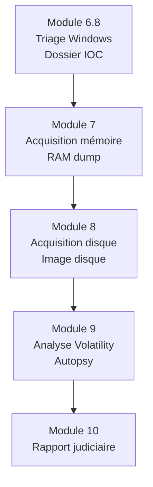

# VII - Acquisition mémoire Windows

!!! quote "L'analogie de la photographie d'une scène de crime"

    Quand un médecin légiste arrive sur une scène de crime, son premier geste n'est pas l'autopsie. C'est la photographie. Avant que quoi que ce soit ne soit déplacé, modifié, contaminé, l'état exact des lieux est figé sur des clichés numérotés, datés, signés. Sans ces photographies, l'enquête démarre amputée. Le suspect peut contester chaque conclusion : "rien ne prouve que ce détail était bien là à ce moment". Pour un poste Windows compromis, la mémoire vive est cette scène de crime. Tant qu'elle n'est pas figée, elle se modifie à chaque seconde. Processus qui meurent, clés qui disparaissent, traces qui s'effacent. L'acquisition mémoire est la photographie médico-légale du système. Ce module vous forme à la prendre dans les règles de l'art.

## Présentation du module

Premier module forensic du cycle 1. Vous apprenez à figer l'état mémoire d'un poste Windows compromis dans les conditions juridiquement opposables. La méthodologie suit le standard **RFC 3227** complété par les bonnes pratiques de l'**ANSSI** et de l'**ENFSI**.

### Pourquoi la mémoire est centrale

La mémoire vive contient des informations qu'on ne trouve **nulle part ailleurs** sur la machine. Voici les éléments concernés.

| Information | Présence sur disque | Présence en mémoire |
|---|---|---|
| Processus en cours d'exécution | Non | Oui |
| Connexions réseau actives | Non | Oui |
| Mots de passe en clair (login récent) | Très rare | Souvent |
| Clés de chiffrement (BitLocker, etc.) | Chiffrées | En clair |
| Code malveillant en mémoire seule (fileless) | Non | Oui |
| Variables d'environnement runtime | Non | Oui |
| Handles système | Non | Oui |
| Buffers de communication | Non | Oui |
| Registres en mémoire (HKEY_*) | Partielle | Complète et active |

### Volatilité - définition

La **volatilité** d'une donnée caractérise sa durée de vie. Voici la hiérarchie standard.

| Niveau | Donnée | Durée de vie |
|---|---|---|
| 1 | Registres CPU, cache | Nanosecondes |
| 2 | Mémoire vive (RAM) | Secondes à arrêt machine |
| 3 | État réseau (connexions) | Secondes à minutes |
| 4 | Processus en cours | Jusqu'à terminaison |
| 5 | Disque dur (volatile partiel) | Jusqu'à modification |
| 6 | Sauvegardes | Mois à années |

La règle RFC 3227 : **acquérir du plus volatile au moins volatile**.

### Articulation avec les modules précédents

Le module 7 reçoit le **dossier d'entrée** produit par le triage du module 6.8.



### Cadre juridique en France

En France, plusieurs textes encadrent le forensic numérique.

| Référence | Domaine |
|---|---|
| Code de procédure pénale art. 60 | Réquisition expert |
| Code de procédure pénale art. 230-1 à 230-5 | Saisie données informatiques |
| LCEN 2004-575 | Loi pour la confiance dans l'économie numérique |
| RGPD art. 5, 6 | Bases légales et minimisation |
| ISO 27037 | Identification et préservation de preuves numériques |
| ISO 27042 | Analyse et interprétation de preuves numériques |
| ANSSI Guide forensic | Bonnes pratiques |
| ENFSI Guidelines for Best Practice | Standard européen |

### Position des analystes forensic

Pour réaliser une acquisition opposable juridiquement, l'analyste doit avoir un statut. Voici les options en France.

| Statut | Cadre |
|---|---|
| Expert judiciaire (CA / Cassation) | Requis pour expertise judiciaire |
| Officier de police judiciaire | Avec autorité légale |
| Prestataire mandaté par victime | Sous mandat écrit (cas pentest/incident) |
| Auditeur interne entreprise | Pour usage interne (CDI/sanction) |
| Étudiant en lab | Pédagogique uniquement |

Pour OmnyAcademy, vous opérez en **prestataire mandaté** simulé sur le lab ARTECH.

### Objectifs pédagogiques

À l'issue de ce module, vous serez capable de :

- Comprendre la théorie de la volatilité et son application
- Décider de la conduite à tenir avant acquisition
- Maîtriser 4 outils d'acquisition (DumpIt, Magnet RAM Capture, FTK Imager, Belkasoft)
- Hasher et préserver les preuves
- Documenter la chaîne de garde forensiquement
- Préparer un dossier opposable juridiquement

### Prérequis stricts

Avant d'entamer ce module, certains acquis sont indispensables.

| Critère | Niveau attendu |
|---|---|
| Module 6.8 triage Windows validé | Décision containment prise |
| Windows internals basiques | Processus, registres, services |
| Stockage USB sécurisé disponible | Clé 64+ Go non utilisée pour autre chose |
| Système non compromis pour outils | Vérification anti-falsification |
| Compréhension hash et signature | SHA-256, GPG |

### Structure du module

Voici le plan détaillé des 13 chapitres composant ce module, soit 35 heures de travail.

| # | Chapitre | Durée | Niveau |
|---|---|---|---|
| 7.1 | Théorie volatilité RFC 3227 et hiérarchie | 3 h | Théorique |
| 7.2 | Décision allumer ou éteindre selon contexte | 2 h | Décisionnel |
| 7.3 | Cas du chiffrement BitLocker actif | 3 h | Pratique |
| 7.4 | Cas du ransomware en cours d'exécution | 3 h | Décisionnel |
| 7.5 | Préparation kit USB acquisition Windows | 3 h | Pratique |
| 7.6 | DumpIt Comae usage et limites | 2 h | Pratique |
| 7.7 | Magnet RAM Capture alternative | 2 h | Pratique |
| 7.8 | FTK Imager Lite portable | 2 h | Pratique |
| 7.9 | Belkasoft RAM Capturer | 2 h | Pratique |
| 7.10 | Hash immédiat et double copie | 3 h | Pratique critique |
| 7.11 | Procédure scellement et chaîne de garde | 4 h | Procédural |
| 7.12 | Documentation acquisition cas réel | 3 h | Synthèse |
| 7.13 | Auto-évaluation et synthèse | 3 h | Validation |

**Total : 35 heures** sur 5 semaines à 7-8 h/semaine.

## Ce que vous produirez

À l'issue du module, vous aurez les livrables suivants.

| Livrable | Format |
|---|---|
| Image mémoire Windows (RAM dump) | .raw, .mem, .bin |
| Hash SHA-256 du dump signé | TXT + signature GPG |
| Procès-verbal d'acquisition | PDF signé |
| Chaîne de garde documentée | Markdown |
| Photographies de scellement | JPG horodatés |
| Manifest des outils utilisés | CSV avec hashes |

## Démarrage

Pour commencer, rendez-vous dans le répertoire du module et ouvrez le premier chapitre.

```bash
cd ~/Documents/omnyacademy/02-cycle-1-premier-cas/module-7-acquisition-memoire-windows/
cat 7-1-theorie-volatilite-rfc-3227.md
```

---

**Module précédent** : [Module 6 - Phishing basique](../module-6-phishing-basique/README.md)

**Module suivant** : [Module 7 bis - Acquisition mémoire macOS](../module-7bis-acquisition-memoire-macos/README.md)