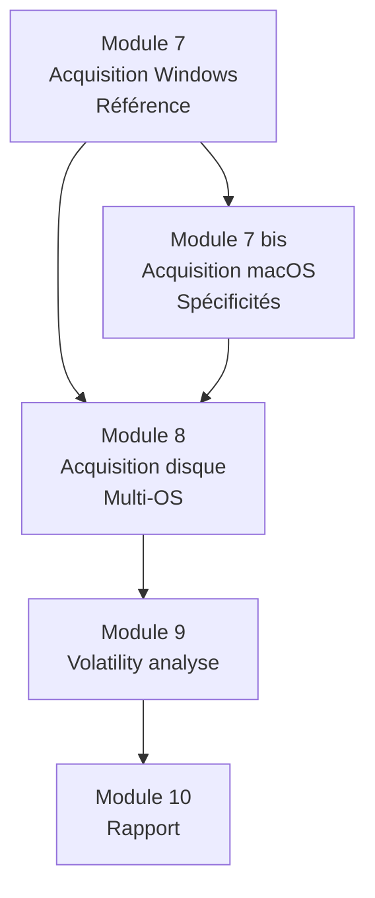

# Module 7 bis - Acquisition mémoire macOS

!!! quote "L'analogie du coffre-fort de banque suisse"

    Pendant des décennies, accéder au contenu d'un coffre de banque suisse exigeait une procédure étrange. Le banquier ne voyait jamais le contenu. Le client n'avait jamais accès au coffre seul. Une chambre forte sans fenêtre, une double clé, un protocole strict, des témoins formellement identifiés. Ce qui apparaît comme une lourdeur excessive est en réalité ce qui rend la confidentialité crédible. Aucune négligence interne ne peut compromettre les actifs déposés. macOS sur Apple Silicon a adopté une philosophie comparable. La puce T2 puis Apple Silicon ont enfermé les processus dans des enclaves cryptographiques. SIP empêche même l'utilisateur root de modifier le système. Le Secure Enclave isole les clés de chiffrement même du noyau. Cette forteresse rend macOS extraordinairement résistant aux attaques. Mais elle complique aussi sévèrement la forensique. Ce module adapte les principes du module 7 à cette réalité. Vous y apprendrez non seulement les outils mais aussi les limites infranchissables et comment les contourner légalement.

## Présentation du module

Module **bis** complétant le module 7 par les spécificités macOS. Architecturalement très différent de Windows, le forensic macOS impose des outils et des procédures spécifiques. Ce module est essentiel pour tout analyste DFIR opérant sur des environnements mixtes.

### Particularités macOS pour le forensic

macOS impose des contraintes que Windows n'a pas. Voici les principales différences.

| Caractéristique | Windows 11 | macOS 14+ Apple Silicon |
|---|---|---|
| Acquisition mémoire | Standard avec drivers | Très contrainte (SIP, kext) |
| Privilèges requis | Administrateur | Root + acceptation système |
| Architecture dominante | x64 | ARM64 (M1/M2/M3/M4) |
| Chiffrement disque | BitLocker (optionnel) | FileVault (souvent activé) |
| Puce sécurité | TPM 2.0 (logiciel ou matériel) | T2 ou Apple Silicon (matériel) |
| Isolation kernel | HVCI (optionnel) | KEXT signés Apple seulement |
| Logs système | Journaux séparés (.evtx) | Journal unifié (log show) |
| Outils ouverts | Très nombreux | Restreints |
| Volatility 3 support | Excellent | Limité (ARM64 progressif) |
| Communauté outils | Vaste | Plus restreinte |

### Évolution récente

L'arrivée d'Apple Silicon (M1 en 2020) a fondamentalement changé le forensic Mac. Voici la chronologie.

| Année | Évolution |
|---|---|
| 2018 | Puce T2 introduite (MacBook Pro 2018+) |
| 2020 | Apple Silicon M1, transition Intel → ARM |
| 2021 | M1 Pro / Max, puce unifiée mémoire/CPU |
| 2022 | M2 et FileVault2 obligatoire de fait |
| 2023 | M3 et SIP renforcé |
| 2024 | macOS 14 (Sonoma), kexts dépréciés |
| 2026 | macOS 15 (référence), DriverKit dominant |

### Pourquoi un module dédié

L'acquisition mémoire macOS n'est **pas** une simple traduction du module 7. Voici les raisons d'un module spécifique.

```text
RAISONS D'UN MODULE DÉDIÉ
=============================

Limitations matérielles
  - Apple Silicon utilise mémoire unifiée (UMA)
  - Pas de séparation RAM physique / GPU classique
  - Architecture ARM64 spécifique
  - Boot Recovery très différent

Limitations logicielles
  - SIP empêche injection kernel
  - Kexts signés Apple seulement
  - DriverKit (espace utilisateur) remplace kexts
  - APIs forensiques restreintes

Outils différents
  - OSXPmem ancien (intérêt historique)
  - AVML Microsoft (Linux + macOS)
  - Volexity Surge (commercial premium)
  - mac_apt pour triage

Procédure adaptée
  - Acquisition mémoire souvent partielle
  - Acquisition disque privilégiée
  - Logs unifiés acquisition cruciale
  - Target Disk Mode / DFU spécifiques
```

### Position dans l'écosystème OmnyAcademy

Voici comment le module 7 bis s'articule.



### Cadre juridique inchangé

Le cadre juridique français ne distingue pas selon le système d'exploitation. Les références juridiques du module 7 (CPP article 97, code civil 1366, RGPD article 33) s'appliquent identiquement.

| Référence | Applicabilité |
|---|---|
| RFC 3227 | Identique |
| ISO/IEC 27037:2012 | Identique |
| NIST SP 800-86 | Identique |
| CPP article 97 | Identique |
| Code civil article 1366 | Identique |
| RGPD article 33 | Identique (72h) |

Ce qui change est **technique**, pas juridique.

### Position des outils 2026

Voici la position des outils principaux pour macOS en 2026.

| Outil | Positionnement | Coût |
|---|---|---|
| Volexity Surge Collect | Référence commerciale | Commercial |
| AVML (Microsoft) | Open source moderne | Gratuit |
| OSXPmem | Historique, peu maintenu | Gratuit |
| BlackBag MacQuisition | Suite forensic | Commercial |
| Recon ITR (SUMURI) | Suite forensic | Commercial |
| mac_apt | Triage post-acquisition | Gratuit |
| log show / unified logs | Logs système | Built-in |

### Objectifs pédagogiques

À l'issue de ce module, vous serez capable de :

- Comprendre l'architecture macOS Apple Silicon et ses contraintes
- Expliquer SIP, T2, Secure Enclave et leur impact forensique
- Choisir l'outil d'acquisition adapté au contexte
- Effectuer une acquisition mémoire dans les limites possibles
- Acquérir les logs unifiés en complément
- Utiliser Target Disk Mode et DFU pour acquisition à froid
- Documenter selon les standards du module 7
- Diagnostiquer les échecs spécifiques macOS

### Prérequis stricts

Avant d'entamer ce module, certains acquis sont indispensables.

| Critère | Niveau attendu |
|---|---|
| Module 7 Windows complet | Indispensable |
| Disposer d'un Mac de test | Apple Silicon ou Intel récent |
| macOS Recovery accessible | Connaître le déclenchement |
| Compte administrateur disponible | Installation outils |
| Acceptation modification système | SIP désactivable en lab |
| Privilèges root maîtrisés | sudo, terminal |

### Structure du module

Voici le plan détaillé des 10 chapitres composant ce module, soit 25 heures de travail.

| # | Chapitre | Durée | Niveau |
|---|---|---|---|
| 7 bis.1 | Introduction macOS DFIR et différences avec Windows | 2 h | Théorique |
| 7 bis.2 | Architecture Apple Silicon et T2 / Secure Enclave | 3 h | Théorique |
| 7 bis.3 | SIP et limitations forensiques | 2 h | Théorique |
| 7 bis.4 | Volexity Surge Collect | 3 h | Pratique |
| 7 bis.5 | AVML Microsoft et OSXPmem | 3 h | Pratique |
| 7 bis.6 | macOS Memory Reader et alternatives | 2 h | Pratique |
| 7 bis.7 | log show et journaux unifiés | 3 h | Pratique |
| 7 bis.8 | mac_apt pour triage automatisé | 2 h | Pratique |
| 7 bis.9 | Target Disk Mode et DFU pour acquisition à froid | 3 h | Pratique |
| 7 bis.10 | Cas pratique macOS et synthèse | 2 h | Synthèse |

**Total : 25 heures** sur 4 semaines à 6-7 h/semaine.

## Ce que vous produirez

À l'issue du module, vous aurez les livrables suivants.

| Livrable | Format |
|---|---|
| Image mémoire macOS (RAM dump) | .raw, .lime |
| Hash SHA-256 du dump signé | TXT + signature GPG |
| Logs unifiés exportés | logarchive |
| Procès-verbal d'acquisition | PDF signé |
| Chaîne de garde documentée | Markdown |
| Photographies de scellement | JPG horodatés |
| Rapport adapté macOS | PDF |

## Limites importantes à connaître

L'acquisition mémoire macOS sur Apple Silicon présente des limites structurelles à comprendre dès le départ.

```text
LIMITES STRUCTURELLES MACOS APPLE SILICON
=============================================

Limite 1 - Mémoire unifiée (UMA)
  La mémoire est partagée entre CPU, GPU et autres
  composants. L'acquisition complète peut être moins
  cohérente qu'sur architecture séparée Intel.

Limite 2 - SIP actif par défaut
  Empêche l'injection de drivers kernel non signés Apple.
  Tous les outils d'acquisition mémoire moderne nécessitent
  soit SIP désactivé, soit un mécanisme dérogatoire.

Limite 3 - Pas de DriverKit pour acquisition mémoire
  Apple n'a pas créé d'API DriverKit dédiée à l'acquisition
  forensique. Les outils doivent contourner par des moyens
  alternatifs (snapshots VM, debugger, boot recovery).

Limite 4 - Secure Enclave inaccessible
  Les clés de chiffrement et certains secrets sont stockés
  dans le Secure Enclave. Aucune acquisition mémoire ne peut
  les extraire. Inaccessible même par l'OS.

Limite 5 - Apple Silicon ARM64
  Volatility 3 a un support ARM64 limité en 2026.
  Plugins Windows non applicables.
  Symboles kernel macOS doivent être à jour.

Conséquence pédagogique
  Pour Apple Silicon, l'acquisition mémoire est devenue
  l'EXCEPTION et non la règle. La méthodologie privilégie :
    1. Logs unifiés (log show) - acquisition fiable
    2. Acquisition disque - avec support APFS / FileVault
    3. Snapshots APFS récents
    4. Time Machine si présent
    5. Acquisition mémoire UNIQUEMENT si SIP désactivable
```

## Démarrage

Pour commencer, rendez-vous dans le répertoire du module et ouvrez le premier chapitre.

```bash
cd ~/Documents/omnyacademy/02-cycle-1-premier-cas/module-7bis-acquisition-memoire-macos/
cat 7bis-1-introduction-macos-dfir.md
```

---

**Module précédent** : [Module 7 - Acquisition mémoire Windows](../module-7-acquisition-memoire-windows/README.md)

**Module suivant** : [Module 8 - Acquisition disque](../module-8-acquisition-disque/README.md)