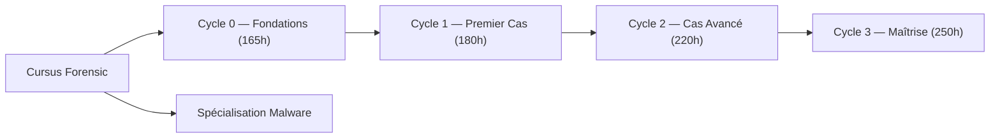

# Forensic Physique Multi-Plateformes

!!! quote "L'analogie de l'apprenti charpentier"
    _Un apprenti charpentier ne devient pas maître en lisant les traités de menuiserie. Il le devient en taillant cent fois la même pièce. Ce parcours suit la même logique : vous n'allez pas seulement comprendre l'investigation numérique, vous allez la pratiquer sur du matériel réel jusqu'à l'excellence._

## Objectif

Ce parcours de 850 heures est un carnet d'apprentissage structuré pour transformer de solides bases en cybersécurité en une **maîtrise opérationnelle du forensic**. L'apprentissage s'effectue exclusivement sur du matériel physique (Windows, Linux, macOS ARM) pour appréhender les vraies contraintes — TPM, Secure Enclave, Write-Blockers — qu'aucune machine virtuelle ne peut simuler fidèlement.

!!! note "Comment aborder ce parcours"
    Le parcours est rigoureusement séquentiel. Le **Cycle 0 est non négociable** : toute tentative de le contourner produira un technicien bancal. La Spécialisation Malware peut être abordée en parallèle du Cycle 1 pour une mise en pratique rapide.

 

---

## Architecture du Parcours

_Le Cycle 0 est le prérequis universel. La Spécialisation Malware est un fil rouge pratique activable dès le Cycle 1._

 

---

## Les Cycles d'Apprentissage

- ### :lucide-wrench: 00. Meta-Outillages
    ---
    L'établi de l'analyste. Organisation, carnet de doutes, suivi de progression, inventaire matériel et perspectives de carrière (salaires 2026).

    [Consulter les outillages](./00-meta-outillages/index.md)

- ### :lucide-book-open-check: Cycle 0 — Fondations
    ---
    **Le socle (165h).** Législation française (LPM, NIS2, RGPD), prérequis techniques pointus (APFS, NTFS, registres Windows) et configuration du laboratoire physique.

    [Poser les fondations](./01-cycle-0-fondations/index.md)

- ### :lucide-shield-alert: Cycle 1 — Premier Cas Pratique
    ---
    **Première kill-chain complète (180h).** Attaque Wi-Fi WPA2, phishing, acquisition mémoire et disque, analyse Volatility et rédaction du rapport final.

    [Voir le programme](./02-cycle-1-premier-cas/index.md)

- ### :lucide-network: Cycle 2 — Cas Avancé
    ---
    **Scénario complexe (220h).** Pivoting Active Directory, persistance (WMI, rootkits), contournement BitLocker/LUKS et notifications de violation CNIL.

    [Voir le programme](./03-cycle-2-avance/index.md)

- ### :lucide-award: Cycle 3 — Maîtrise
    ---
    **Autonomie totale (250h).** Développement d'outils Swift pour macOS, analyse de ransomwares en direct, chiffrage de prestations et 5 cas indépendants.

    [Voir le programme](./04-cycle-3-maitrise/index.md)

- ### :lucide-bug: Spécialisation — Menace Malware
    ---
    **Fil rouge pratique.** Étude de cas complète sur un Trojan Reverse Shell : de l'ingénierie sociale à la détection YARA et la réponse à incident.

    [Analyser la menace](./05-menace-malware/index.md)

 

---

## Ce que ce parcours vous apporte concrètement

| Compétence | Ce cursus | Équivalent formation classique |
| --- | --- | --- |
| Acquisition mémoire | Sur RAM physique réelle | Sur VM (traces artificielles) |
| Contournement TPM/BitLocker | Sur vrai composant soudé | Simulé ou absent |
| Forensic macOS Apple Silicon | Sur M1/M2 réel avec Secure Enclave | Rare, souvent théorique |
| Chaîne de garde légale | Modèles NDA, mandats réels | Absente ou superficielle |
| Analyse Malware YARA | Trojan fonctionnel analysé en live | Captures figées |
| Rapport recevable en justice | Méthode complète, jurisprudences | Non couvert |

 

---

## Règle d'Or de la Validation

!!! info "Méthode d'auto-évaluation"
    Aucun module n'est validé par une simple lecture. Vous devez produire :

    1. **Une manipulation réelle** sur votre laboratoire matériel.
    2. **Une auto-explication** (vocale ou écrite, méthode Feynman) de 10 à 15 minutes pour verbaliser le concept sans filet.
    3. **Une synthèse écrite** d'une page pour ancrer la connaissance.

 

---

## Conclusion

!!! quote "Notre recommandation"
    Commencez par le Cycle 0, intégralement. Le temps investi dans la législation et les prérequis techniques n'est pas du temps perdu — c'est le capital qui rend chaque heure de pratique rentable. Un enquêteur qui connaît les articles 323 et les contraintes RGPD peut signer des rapports recevables devant un tribunal. Un technicien qui les ignore ne peut pas.

**Point d'entrée : [Cycle 0 — Fondations](./01-cycle-0-fondations/index.md)**

 