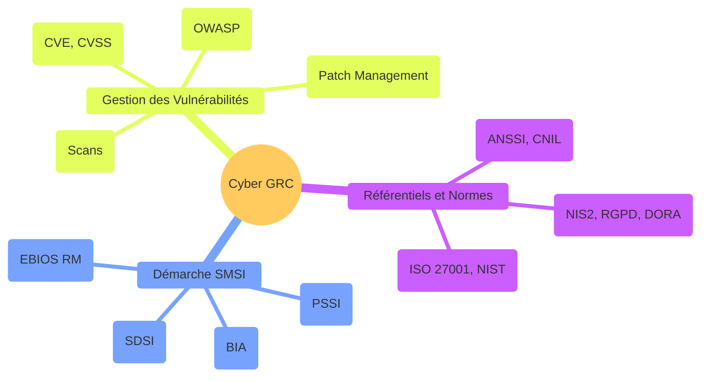

# Cyber : GRC

## Introduction

**La Gouvernance, Risk & Compliance (GRC)** représente l'**approche stratégique et organisationnelle** de la cybersécurité. Elle dépasse la dimension purement technique pour embrasser la conformité réglementaire, la gestion des risques, la documentation structurante et le pilotage managérial de la sécurité de l'information.

> Dans un contexte européen de plus en plus régulé (**RGPD**, **NIS2**, **DORA**), les organisations doivent démontrer leur conformité, structurer leur gouvernance et anticiper les risques cyber. La GRC fournit le **cadre méthodologique** pour y parvenir de manière cohérente et auditable.

!!! info "Pourquoi la GRC est cruciale ?"
    - **Conformité légale** : Respecter les obligations RGPD, NIS2, DORA sous peine de sanctions
    - **Gestion des risques** : Identifier, évaluer et traiter les risques cyber de manière structurée
    - **Gouvernance documentaire** : Produire les livrables attendus (PSSI, SDSI, BIA)
    - **Pilotage stratégique** : Aligner la cybersécurité sur les objectifs business
    - **Auditabilité** : Démontrer la conformité aux autorités et certificateurs

## Architecture de l'écosystème GRC

_Ce schéma illustre la complémentarité des trois piliers : les **Référentiels** fixent le cadre, le **SMSI** structure l'organisation, et la **Gestion des Vulnérabilités** assure le maintien opérationnel du niveau de sécurité._

## Les trois piliers de la GRC

-   :lucide-library:{ .lg .middle } **Référentiels & Normes**

    ---

    Le socle réglementaire et normatif qui encadre la cybersécurité en France et en Europe : **autorités françaises**, **réglementations européennes**, **référentiels sectoriels** et **normes ISO**.

    [:lucide-book-open-check: Découvrir les référentiels et normes](./refs-normes/)

-   :lucide-folder-tree:{ .lg .middle } **Démarche SMSI**

    ---

    Méthodologies et documents structurants pour mettre en place un **Système de Management de la Sécurité de l'Information** conforme ISO 27001 : **analyse de risques**, **BIA**, **SDSI**, **PSSI**.

    [:lucide-book-open-check: Découvrir la démarche SMSI](./smsi/)

-   :lucide-bug-off:{ .lg .middle } **Gestion des Vulnérabilités**

    ---

    Processus de veille, d'évaluation et de priorisation des vulnérabilités dans une démarche de conformité et de gouvernance des risques : **CVE & CVSS**, **OWASP Top 10**, **Patch Management**, **Politique de Scan**.

    [:lucide-book-open-check: Découvrir la gestion des vulnérabilités](./vuln/)

## Public cible

!!! info "À qui s'adresse cette section ?"
    - **RSSI (Responsables de la Sécurité des Systèmes d'Information)**
    - **DPO (Data Protection Officers)**
    - **Responsables Conformité & Risk Managers**
    - **Auditeurs internes et externes**
    - **Dirigeants souhaitant comprendre les enjeux GRC**
    - **Consultants en cybersécurité et conformité**

## Rôle dans l'écosystème

La GRC constitue **le cadre de pilotage stratégique** qui transforme la cybersécurité en levier de confiance, de conformité et de résilience organisationnelle. Elle permet de démontrer la maturité cyber aux clients, partenaires, autorités et investisseurs, tout en structurant une approche cohérente de la gestion des risques.

> Les sections suivantes vous fourniront les clés pour comprendre, mettre en œuvre et auditer un dispositif GRC complet et conforme aux exigences actuelles.

 