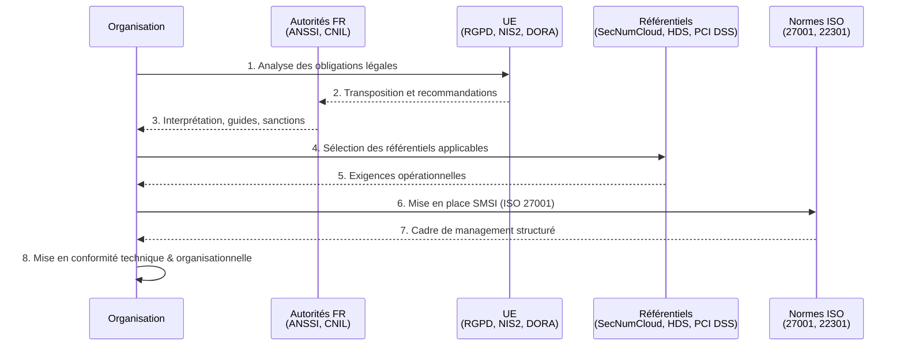

# Référentiels & Normes

## Vue d'ensemble

Cette section réunit les **grands piliers** qui encadrent la cybersécurité, la conformité et la gouvernance des systèmes d'information en France et en Europe.

L'ensemble forme un **écosystème cohérent** composé :

* d'**autorités nationales** qui définissent, recommandent ou contrôlent,
* de **réglementations européennes** qui imposent des obligations,
* de **référentiels et certifications** qui traduisent ces exigences en pratiques opérationnelles,
* de **normes ISO** qui fournissent des cadres internationaux de management.

> Chaque élément présenté ici dispose d'une **page dédiée détaillée** dans les sous-sections correspondantes.

## Les quatre piliers de l'écosystème

-   :lucide-building:{ .lg .middle } **Autorités françaises**

    ---

    Les autorités françaises agissent comme **piliers institutionnels** : elles **précisent**, **interprètent**, **accompagnent** et, dans certains cas, **contrôlent** la mise en œuvre des obligations en cybersécurité et en protection des données.

    **Acteurs clés** : ANSSI, CNIL, CLUSIF

    [:lucide-book-open-check: Découvrir les autorités françaises](./autorites/)

-   :lucide-landmark:{ .lg .middle } **Réglementations européennes**

    ---

    Les textes européens définissent les **obligations légales** à respecter. Ils sont transposés ou interprétés en France via les autorités nationales et conditionnent l'ensemble de l'écosystème de conformité.

    **Textes majeurs** : RGPD, NIS2, DORA, DSA, DMA, AI Act, Data Act, CRA, DGA

    [:lucide-book-open-check: Découvrir les réglementations européennes](./reglementations/)

-   :lucide-badge-check:{ .lg .middle } **Référentiels & Certifications**

    ---

    Ces référentiels transforment les obligations légales en **contrôles opérationnels**, auditables et mesurables. Ils servent de base aux certifications, évaluations ou qualifications.

    **Référentiels clés** : SecNumCloud, HDS, PCI DSS, NIST CSF

    [:lucide-book-open-check: Découvrir les référentiels et certifications](./referentiels/)

-   :lucide-stamp:{ .lg .middle } **Normes ISO**

    ---

    Les normes ISO fournissent des **cadres internationaux de management** applicables à la sécurité de l'information, la continuité d'activité et la gestion des services IT.

    **Normes majeures** : ISO 27001, ISO 27002, ISO 31000, ISO 22301, ISO 20000

    [:lucide-book-open-check: Découvrir les normes ISO](./isos/)

## Rôle dans l'écosystème

Ces quatre piliers constituent **le socle réglementaire et normatif** de la cybersécurité en France et en Europe. Ils orientent la compréhension des obligations légales et influencent directement les pratiques de conformité des organisations.

## Parcours de conformité dynamique

_Ce parcours illustre de manière simplifiée la manière dont une organisation française engage sa démarche de conformité. **Avant toute action technique**, elle doit **identifier** ses obligations légales, **comprendre** leur interprétation par les autorités nationales, puis **sélectionner** les référentiels et normes les plus adaptés pour traduire ces exigences en contrôles concrets._

## Tableau de synthèse des interactions

| Couche | Acteurs | Rôle | Impact |
|--------|---------|------|--------|
| **Autorités FR** | ANSSI, CNIL, CLUSIF | Orientation, interprétation, contrôle | Guides nationaux, sanctions |
| **Réglementations UE** | RGPD, NIS2, DORA, DSA, AI Act | Obligations légales | Sanctions jusqu'à 4% CA ou 10M€ |
| **Référentiels** | SecNumCloud, HDS, PCI DSS, NIST | Contrôles opérationnels | Certification/qualification |
| **Normes ISO** | ISO 27001, 27002, 22301 | Cadres de management | Certification internationale |

> Les pages suivantes détaillent les missions, le périmètre et l'impact de chaque pilier sur la conformité des organisations françaises.

 