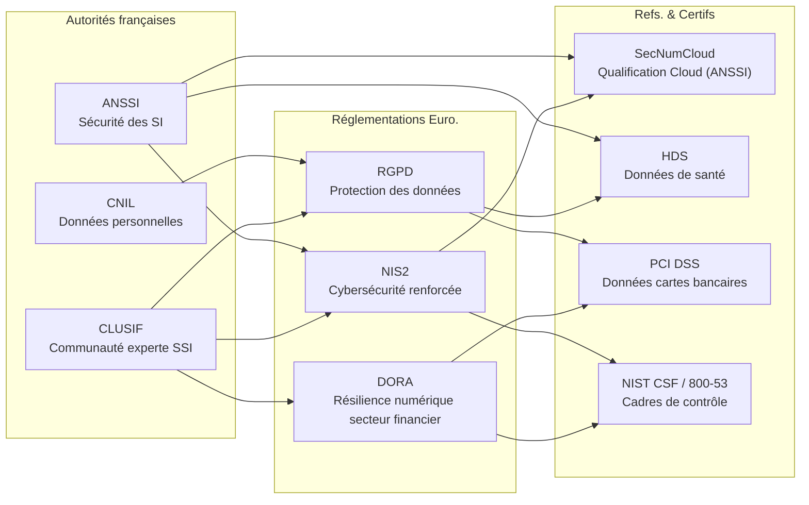
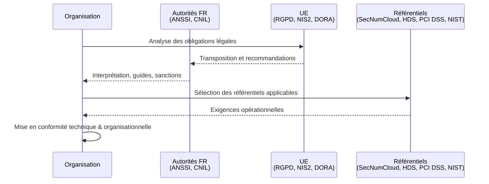

# Référentiels & Normes

## Vue d’ensemble

Cette section réunit les **grands piliers** qui encadrent la cybersécurité, la conformité et la gouvernance des systèmes d’information en France et en Europe.  
L’ensemble forme un **écosystème cohérent** composé :

* d’**autorités nationales** qui définissent, recommandent ou contrôlent,
* de **réglementations européennes** qui imposent des obligations,
* de **référentiels et certifications** qui traduisent ces exigences en pratiques opérationnelles.

Chaque élément présenté ici dispose d’une **page dédiée détaillée** dans les sous-sections correspondantes.

!!! info "Comment lire cette carte"
    Le paysage de la cybersécurité se structure en trois couches :
    
    1. **Les autorités françaises**  
        _publient des guides, recommandations et orientations officielles._

    2. **Les réglementations européennes**  
        _définissent les obligations légales transverses._

    3. **Les référentiels et certifications**  
        _fournissent des exigences vérifiables, utilisées pour auditer, qualifier ou sécuriser les systèmes._

## Schéma global de la vue d'ensemble

## Présentation des sous-sections

-   ### :lucide-building:{ .lg .middle } — Autorité Française

    ---

    Les autorités françaises agissent comme **piliers institutionnels** : elles **précisent**, **interprètent**, **accompagnent** et, dans certains cas, **contrôlent** la mise en œuvre des obligations en cybersécurité et en protection des données.

    [:lucide-book-open-check: Voir la fiche sur les autorités françaises](./autorites)

-   ### :lucide-landmark:{ .lg .middle } — Réglementations européennes

    ---

    Les textes européens définissent les **obligations légales** à respecter. Ils sont transposés ou interprétés en France via les autorités nationales.

    [:lucide-book-open-check: Voir la fiche sur les Réglementations Européennes](./reglementations)

-   ### :lucide-badge-check:{ .lg .middle } — Référentiels & Certifications

    ---

    Ces référentiels transforment les obligations légales en **contrôles opérationnels**, auditables et mesurables. Ils servent de base aux certifications, évaluations ou qualifications.

    [:lucide-book-open-check: Voir la fiche sur les Référentiels et Certifications](./referentiels)

## Parcours de conformité (vision dynamique)

_Ce parcours illustre de manière simplifiée la manière dont une organisation française engage sa démarche de conformité. Avant toute action technique, elle doit identifier ses obligations légales, comprendre leur interprétation par les autorités nationales, puis sélectionner les référentiels les plus adaptés pour traduire ces exigences en contrôles concrets. La trajectoire représentée ci-dessous montre cette dynamique : de l’analyse réglementaire à la mise en œuvre opérationnelle des mesures de sécurité._

---

## Conclusion

!!! quote "Portail d’introduction"
    Cette page explique où se situe chaque élément, comment il s’articule avec les autres, et **pourquoi* il est essentiel dans le paysage européen de la cybersécurité.
    
    > Les pages dédiées apportent ensuite le **niveau d’expertise détaillé**.

 