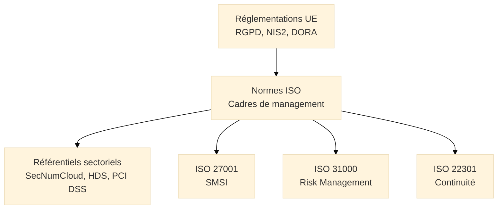

# Normes ISO

## Introduction

**Les normes ISO** fournissent des **cadres internationaux de management** applicables à la sécurité de l'information, la continuité d'activité, la gestion des services IT et la qualité. Elles constituent la **quatrième couche** de l'écosystème de conformité, offrant des standards reconnus mondialement pour structurer et certifier les systèmes de management.

> Les normes ISO complètent les réglementations européennes et les référentiels sectoriels en fournissant des **méthodologies éprouvées** et des **certifications internationalement reconnues**.

!!! info "Pourquoi les normes ISO sont essentielles ?"
    - Elles **structurent** l'approche du management de la sécurité (SMSI)
    - Elles **facilitent** la reconnaissance internationale des certifications
    - Elles **s'articulent** naturellement avec les réglementations (RGPD, NIS2, DORA)
    - Elles **permettent** de démontrer la maturité organisationnelle aux auditeurs et partenaires

## Les dix normes majeures

!!! warning "Certifications disponibles"
    Seules **5 normes** sont certifiables : ISO 27001, 27018, 22301, 20000, 9001 et 14001.  
    Les autres (27002, 27005, 27017, 31000) sont des **guides méthodologiques** non certifiables.

### Sécurité de l'information

!!! note "Cette section présente les normes liées à la Sécurité de l'information"

-   :lucide-shield:{ .lg .middle } **ISO 27001** — _Système de Management de la Sécurité de l'Information_

    ---
    Norme de référence pour la **certification** de la sécurité de l'information (SMSI).

    **Certification** : Oui | **Durée** : 3 ans

    [:lucide-book-open-check: Voir la fiche complète sur ISO 27001](./iso-27001/)

-   :lucide-book-check:{ .lg .middle } **ISO 27002** — _Code de bonnes pratiques sécurité_

    ---
    Catalogue de **93 mesures de sécurité** organisées en 4 thèmes et 14 domaines.

    **Type** : Guide ( ❌ non certifiable)

    [:lucide-book-open-check: Voir la fiche complète sur ISO 27002](./iso-27002/)

-   :lucide-triangle-alert:{ .lg .middle } **ISO 27005** — _Gestion des risques SI_

    ---
    Méthodologie internationale pour la gestion des risques, complémentaire d'EBIOS RM.

    **Type** : Méthodologie ( ❌ non certifiable)

    [:lucide-book-open-check: Voir la fiche complète sur ISO 27005](./iso-27005/)

-   :lucide-cloud:{ .lg .middle } **ISO 27017** — _Sécurité du Cloud Computing_

    ---
    Contrôles spécifiques Cloud adaptés aux environnements IaaS, PaaS et SaaS.

    **Type** : Guide ( ❌ non certifiable)

    [:lucide-book-open-check: Voir la fiche complète sur ISO 27017](./iso-27017/)

-   :lucide-user-check:{ .lg .middle } **ISO 27018** — _Protection données personnelles Cloud_

    ---
    Contrôles pour fournisseurs Cloud agissant comme sous-traitants RGPD.

    **Type** : Certifiable | **Articulation** : RGPD

    [:lucide-book-open-check: Voir la fiche complète sur ISO 27018](./iso-27018/)

### Gestion des risques

!!! note "Cette section présente la norme sur le management de la gestion des risques"

-   :lucide-gauge:{ .lg .middle } **ISO 31000** — _Management du risque_

    ---
    Cadre générique de gestion des risques, référence internationale transverse.

    **Type** : Lignes directrices ( ❌ non certifiable)

    [:lucide-book-open-check: Voir la fiche complète sur ISO 31000](./iso-31000/)

### Continuité d'activité

!!! note "Cette section présente la norme sur la continuité d'activité"

-   :lucide-shield-alert:{ .lg .middle } **ISO 22301** — _Continuité d'Activité (SMCA)_

    ---
    Système de management incluant PCA (Plan de Continuité) et PRA (Plan de Reprise).

    **Certification** : Oui | **Durée** : 3 ans

    [:lucide-book-open-check: Voir la fiche complète sur ISO 22301](./iso-22301/)

### Gestion des services IT et qualité

!!! note "Cette section présente les trois normes liés à la gestion des services IT, au management de la Qualité et au management Environnemental"

-   :lucide-settings:{ .lg .middle } **ISO 20000** — _Gestion des services IT (ITSM)_

    ---
    Système de management des services IT aligné avec ITIL.

    **Certification** : Oui | **Durée** : 3 ans

    [:lucide-book-open-check: Voir la fiche complète sur ISO 20000](./iso-20000/)

-   :lucide-check-circle:{ .lg .middle } **ISO 9001** — _Management de la Qualité_

    ---
    Système de management qualité (SMQ) transverse à tous secteurs.

    **Certification** : Oui | **Durée** : 3 ans

    [:lucide-book-open-check: Voir la fiche complète sur ISO 9001](./iso-9001/)

-   :lucide-leaf:{ .lg .middle } **ISO 14001** — _Management Environnemental_

    ---
    Système de management environnemental (SME), démarches RSE et Green IT.

    **Certification** : Oui | **Durée** : 3 ans

    [:lucide-book-open-check: Voir la fiche complète sur ISO 14001](./iso-14001/)

## Position dans l'écosystème de conformité

Les normes ISO constituent la **quatrième couche méthodologique** qui traduit les obligations réglementaires en systèmes de management certifiables.

_Les normes ISO forment le socle méthodologique qui transforme les obligations légales en systèmes de management auditables et certifiables._

## Synthèse comparative

| Famille | Normes | Certifiable | Articulation majeure |
|---------|--------|-------------|----------------------|
| **Sécurité SI** | ISO 27001, 27002, 27005 | 27001 uniquement | RGPD, NIS2, DORA |
| **Cloud** | ISO 27017, 27018 | 27018 uniquement | RGPD, SecNumCloud |
| **Risques** | ISO 31000 | Non | Transverse (EBIOS RM, MEHARI) |
| **Continuité** | ISO 22301 | Oui | NIS2, DORA |
| **IT & Qualité** | ISO 20000, 9001, 14001 | Oui | ITIL, RSE |

!!! tip "Comment choisir ?"
    - [x] **Certification sécurité** → ISO 27001
    - [x] **Méthodologie risques** → ISO 31000 + ISO 27005
    - [x] **Continuité d'activité** → ISO 22301
    - [x] **Cloud RGPD-compliant** → ISO 27018
    - [x] **Gestion services IT** → ISO 20000

> Les fiches suivantes détaillent les exigences, processus de certification et liens réglementaires pour chaque norme ISO.

 