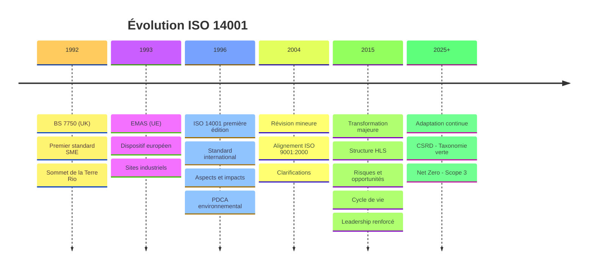
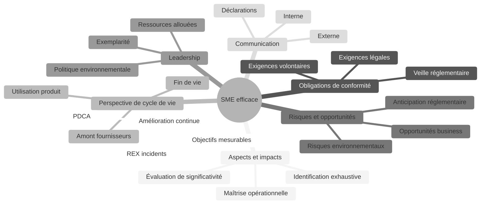
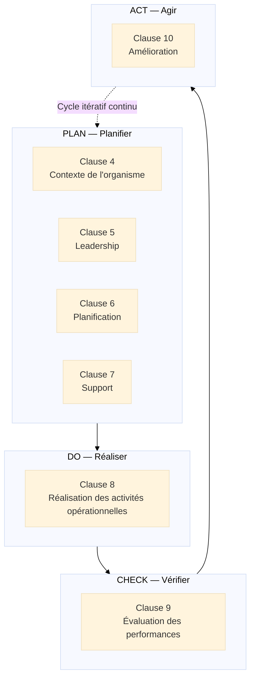
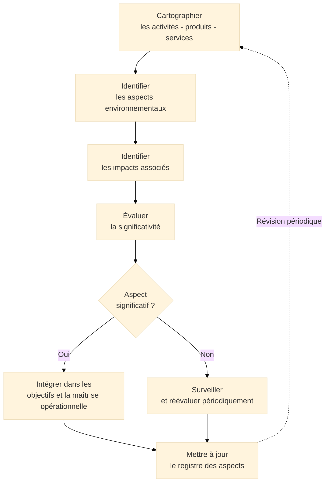
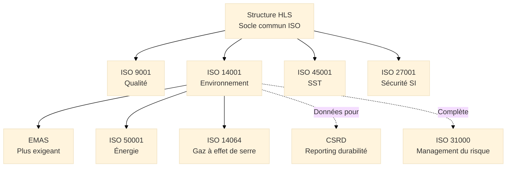
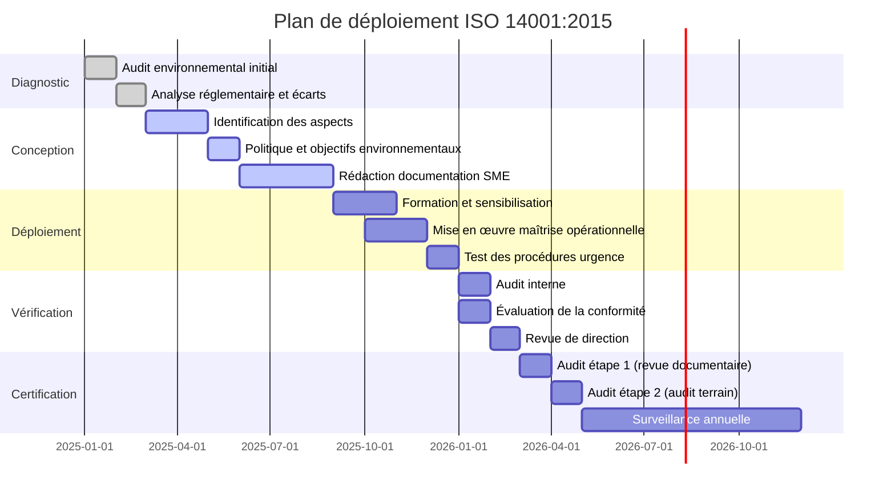

# ISO 14001 — Système de Management Environnemental

<div
  class="omny-meta"
  data-level="🟡 Intermédiaire & 🔴 Avancé"
  data-version="1.0"
  data-time="35-40 minutes">
</div>

## Introduction au Management Environnemental

!!! quote "Analogie pédagogique"
    _Imaginez un **opérateur de centres de données** qui exploite 12 sites en Europe, consommant collectivement 500 GWh d'électricité par an et des millions de litres d'eau pour le refroidissement des serveurs. Sans système structuré, chaque site gère ses consommations à sa façon : certains mesurent leur PUE[^1], d'autres non ; certains trient les déchets électroniques, d'autres les mélangent au tout-venant ; certains respectent les seuils de rejet thermique des eaux de refroidissement, d'autres les ignorent. L'ensemble de ces activités interagit avec l'environnement, mais personne n'en a une vision consolidée. **ISO 14001 fonctionne exactement comme le système de supervision centralisé** que cet opérateur décide enfin de mettre en place : identifier systématiquement toutes les interactions avec l'environnement, évaluer lesquelles sont significatives, fixer des objectifs de réduction mesurables, surveiller les résultats, et améliorer en continu — site par site, processus par processus, jusqu'à ce que la performance environnementale devienne aussi pilotée que la performance technique._

**ISO 14001** constitue le **standard international de management environnemental** le plus déployé au monde, avec plus de 300 000 organisations certifiées dans 171 pays. Publié en 1996, puis profondément révisé en 2015, il définit les **exigences** qu'un système de management environnemental[^2] (SME) doit satisfaire pour qu'une organisation puisse identifier, maîtriser et réduire ses impacts sur l'environnement de manière systématique et vérifiable.

À la différence d'ISO 31000 (lignes directrices non certifiables), et à l'instar d'ISO 9001, **ISO 14001 est une norme d'exigences certifiable** : la conformité peut être vérifiée et attestée par un organisme de certification tiers indépendant. Les deux normes partagent la même Structure HLS[^3] depuis 2015, ce qui facilite leur intégration au sein d'un Système de Management Intégré (SMI).

!!! info "Pourquoi ISO 14001 est essentiel ?"
    ISO 14001 fournit le **cadre méthodologique** qui transforme l'engagement environnemental d'une déclaration d'intention en un **système gérable, mesurable et auditable**. Dans un contexte réglementaire européen en forte accélération (CSRD, taxonomie verte, directive Ecodesign), maîtriser ISO 14001, c'est anticiper les exigences plutôt que les subir.

<br>

---

## Pour repartir des bases

Si vous abordez ISO 14001 pour la première fois, trois points fondamentaux à intégrer avant d'aller plus loin.

### 1. Une norme certifiable

Comme ISO 9001, **ISO 14001 est une norme d'exigences** dont la conformité peut être attestée par un organisme de certification[^4] accrédité. Le certificat est valable 3 ans, avec deux audits de surveillance annuels.

> La certification ISO 14001 n'atteste pas que l'organisation n'a aucun impact sur l'environnement. Elle atteste que l'organisation **gère ses impacts de manière systématique** et s'engage dans une amélioration continue mesurable.

La certification peut être motivée par :

- **Des exigences contractuelles** : donneurs d'ordre, appels d'offres publics
- **Des exigences réglementaires** : secteurs soumis à autorisation environnementale
- **Des engagements volontaires** : stratégie RSE[^5], communication vers les parties prenantes
- **Des avantages économiques** : réduction des consommations d'énergie, d'eau, de matières

### 2. La distinction fondamentale : aspect vs impact

Le concept central d'ISO 14001 repose sur une distinction rigoureuse que toute personne travaillant avec la norme doit maîtriser :

**Aspect environnemental[^6] :**  
_Un élément des activités, produits ou services d'un organisme qui interagit ou peut interagir avec l'environnement._  
→ Exemple : la combustion de fioul dans une chaudière industrielle

**Impact environnemental[^7] :**  
_Une modification de l'environnement, négative ou bénéfique, résultant totalement ou partiellement des aspects environnementaux._  
→ Exemple : les émissions de CO₂ et de NOₓ résultant de la combustion

!!! note "Relation cause à effet"
    Un aspect environnemental **cause** un impact environnemental. ISO 14001 exige d'identifier les aspects, pas les impacts directement. L'organisation agit sur ses aspects pour réduire les impacts. Cette distinction est systématiquement vérifiée en audit.

La norme distingue également :

- **Aspects significatifs** : ceux dont les impacts associés sont jugés majeurs selon les critères définis par l'organisation (fréquence, gravité, portée géographique, réversibilité...)
- **Aspects non significatifs** : ceux dont les impacts sont mineurs ou négligeables au regard des mêmes critères

### 3. Un cadre universel aux déclinaisons sectorielles

ISO 14001 s'applique à **toute organisation**, quel que soit son secteur ou sa taille. Les aspects environnementaux varient selon les activités, mais la méthode reste identique :

- **Industrie** → (ex : rejets aqueux, émissions atmosphériques, déchets industriels)
- **Tertiaire** → (ex : consommation d'énergie, déchets de bureau, mobilité des collaborateurs)
- **Bâtiment et travaux publics** → (ex : bruit de chantier, poussières, sols pollués)
- **Agriculture** → (ex : pesticides, nitrates, consommation d'eau)
- **Numérique** → (ex : consommation électrique, refroidissement, déchets électroniques)

!!! note "ISO 14001 et l'EMAS"
    **EMAS**[^8] (*Eco-Management and Audit Scheme*) est le dispositif européen de management environnemental, plus exigeant qu'ISO 14001. Il intègre les exigences d'ISO 14001 et y ajoute la publication obligatoire d'une **déclaration environnementale** publique et vérifiée. EMAS est reconnu comme le standard de référence pour les organisations souhaitant aller au-delà de la certification ISO 14001.

<br>

---

## Historique et évolutions

### Pourquoi ISO 14001 a été créée ?

Avant 1996, le management environnemental était **fragmenté et réactif** :

- Les organisations géraient l'environnement sous la contrainte réglementaire uniquement
- Le Royaume-Uni avait développé **BS 7750** (1992), premier standard de management environnemental
- L'Union Européenne avait lancé **EMAS** en 1993, mais avec une portée limitée aux sites industriels
- Aucun standard international commun n'existait

!!! note "Besoin identifié"
    Créer un **standard international** permettant à toute organisation de structurer sa démarche environnementale, de la rendre auditable et de la reconnaître mutuellement à l'échelle mondiale, au-delà des exigences réglementaires locales.

### Les trois versions majeures

=== "ISO 14001:1996 — Fondation"

    **Contexte :**  
    _Première norme internationale de management environnemental, issue des travaux du Sommet de la Terre de Rio (1992) et de l'expérience britannique BS 7750._

    **Innovations majeures :**

    - [x] Premier standard international de SME certifiable
    - [x] Introduction du concept d'**aspects et impacts environnementaux**
    - [x] Approche **PDCA**[^9] appliquée au management environnemental
    - [x] Engagement d'**amélioration continue** et de **conformité réglementaire**

    > **Limite principale :** Approche très documentaire, déconnectée de la stratégie globale, peu d'intégration avec les autres systèmes de management.

=== "ISO 14001:2004 — Clarification"

    **Contexte :**  
    _Révision mineure visant à aligner la terminologie avec ISO 9001:2000 et clarifier certaines exigences._

    **Évolutions clés :**

    - [x] Alignement du vocabulaire avec **ISO 9001:2000**
    - [x] Précisions sur la **compétence, la formation et la sensibilisation**
    - [x] Renforcement des exigences sur la **maîtrise opérationnelle**
    - [x] Clarification sur les **communications externes**

    > **Critique persistante :** La norme reste silencieuse sur le contexte organisationnel, les parties intéressées et la gestion des risques, inadaptée aux réalités des années 2010.

=== "ISO 14001:2015 — Transformation"

    **Contexte :**  
    _Refonte majeure intégrant la Structure HLS[^3], les retours de 20 années d'application et les nouvelles réalités environnementales (changement climatique, économie circulaire)._

    **Innovations majeures :**

    - [x] **Structure HLS** : alignement avec ISO 9001:2015, ISO 45001, ISO 27001
    - [x] **Contexte de l'organisme** : analyse des enjeux internes/externes, parties intéressées
    - [x] **Pensée fondée sur les risques** : risques ET opportunités environnementaux
    - [x] **Perspective de cycle de vie**[^10] : prise en compte des impacts en amont et en aval
    - [x] **Leadership renforcé** : responsabilité directe du top management
    - [x] **Communication externe** : décision proactive sur ce que l'organisation communique

    > **Rupture majeure :** L'environnement n'est plus géré uniquement pour respecter des lois, mais comme un **levier de création de valeur et de gestion des risques stratégiques**.

### Timeline de l'évolution ISO 14001


_La révision 2015 marque le passage d'un outil de **conformité réglementaire** à un **levier stratégique de performance environnementale**. La prochaine évolution sera portée par la pression réglementaire européenne (CSRD, taxonomie verte) et les engagements Net Zero._

<br>

---

## Les 7 concepts fondateurs

ISO 14001:2015 repose sur **7 concepts fondateurs** qui structurent la philosophie et les exigences de la norme. Ils ne sont pas présentés comme des "principes numérotés" dans le texte officiel, mais ils constituent le socle conceptuel de tout SME efficace.

!!! note "Des concepts, pas des étapes"
    Ces 7 concepts ne constituent pas un processus séquentiel. Ils définissent les **caractéristiques fondamentales** que doit posséder un SME robuste. Certains sont propres à ISO 14001 (aspects/impacts, cycle de vie), d'autres sont partagés avec ISO 9001 (leadership, amélioration continue).

### Vue d'ensemble


_Les 7 concepts forment un **écosystème cohérent** centré sur les aspects et impacts environnementaux. Le cycle de vie élargit le périmètre au-delà des murs de l'organisation. Les obligations de conformité ancrent le SME dans la réalité réglementaire._

### Les 7 concepts expliqués

!!! note "Ci-dessous les 4 premiers concepts"

=== "1️⃣ Aspects et impacts environnementaux"

    **Le cœur opérationnel d'ISO 14001 : identifier ce que l'organisation fait à l'environnement.**

    L'organisation doit identifier **toutes les interactions** entre ses activités et l'environnement :

    - **Émissions atmosphériques** :  
      _CO₂, NOₓ, COV[^11], poussières issues de la combustion ou des procédés._

    - **Rejets dans l'eau** :  
      _Eaux usées, eaux de refroidissement, lixiviats[^12] de décharges._

    - **Contamination des sols** :  
      _Fuites de cuves, déversements accidentels, dépôts de déchets._

    - **Consommation de ressources** :  
      _Énergie, eau, matières premières, ressources naturelles._

    - **Déchets** :  
      _Dangereux, non dangereux, déchets électroniques, emballages._

    - **Nuisances** :  
      _Bruit, vibrations, odeurs, lumière, chaleur._

    L'évaluation de la **significativité** des aspects est réalisée selon des critères définis par l'organisation (fréquence, gravité, portée, réversibilité, sensibilité du milieu). Seuls les aspects significatifs font l'objet d'objectifs de réduction et d'une maîtrise opérationnelle renforcée.

=== "2️⃣ Obligations de conformité"

    **L'organisation doit identifier, accéder et respecter toutes ses obligations environnementales.**

    Les obligations de conformité comprennent deux catégories :

    - **Exigences légales et réglementaires** :  
      _Lois, décrets, arrêtés préfectoraux, autorisations d'exploitation, normes de rejet, seuils d'émissions._

    - **Autres obligations** :  
      _Engagements volontaires (chartes, codes de bonne pratique), exigences contractuelles de clients, engagements pris envers des associations, normes sectorielles._

    L'organisation doit maintenir une **veille réglementaire active** pour détecter les nouvelles obligations avant leur entrée en vigueur.

    !!! warning "Point d'audit systématique"
        Les auditeurs vérifient que l'organisation dispose d'un **registre des obligations de conformité** à jour et qu'elle évalue périodiquement si elle les respecte. Un écart réglementaire non identifié est un constat d'audit majeur.

=== "3️⃣ Perspective de cycle de vie"

    **ISO 14001:2015 élargit le périmètre de responsabilité environnementale au-delà des murs de l'organisation.**

    La perspective de cycle de vie[^10] implique de considérer les impacts environnementaux :

    - **En amont** :  
      _Extraction des matières premières, fabrication des composants, transport des approvisionnements._

    - **Pendant l'utilisation** :  
      _Consommation d'énergie du produit chez le client, entretien, consommables._

    - **En fin de vie** :  
      _Démantèlement, recyclage, valorisation, mise en décharge._

    > Cette exigence ne demande pas à l'organisation de réaliser une ACV[^13] complète pour chaque produit. Elle lui demande d'**exercer une influence** sur ses fournisseurs et clients pour réduire les impacts en dehors de son périmètre direct de contrôle.

=== "4️⃣ Pensée fondée sur les risques et opportunités"

    **ISO 14001:2015 introduit explicitement les risques ET les opportunités environnementaux.**

    - **Risques environnementaux** :  
      _Ce que l'environnement peut subir du fait des activités de l'organisation (pollution accidentelle, dépassement de seuils réglementaires)._

    - **Risques pour l'organisation** :  
      _Ce que l'environnement peut faire subir à l'organisation (inondations, sécheresses, pénuries de ressources naturelles)._

    - **Opportunités** :  
      _Réduction des coûts (énergie, eau, matières), nouveaux marchés (économie verte), avantages concurrentiels (éco-conception), anticipation réglementaire._

    > Le changement climatique illustre parfaitement cette double dimension : l'organisation impacte le climat (risque pour l'environnement) et le climat impacte l'organisation (risque physique pour le business).

!!! note "Ci-dessous les 3 derniers concepts"

=== "5️⃣ Leadership et engagement"

    **La direction est directement responsable de l'efficacité du SME, pas uniquement le responsable environnement.**

    - **Politique environnementale[^14]** :  
      _Document formel signé par la direction, exprimant les engagements environnementaux de l'organisation : conformité, amélioration continue, prévention de la pollution._

    - **Ressources allouées** :  
      _Budget, compétences, temps — la direction démontre son engagement par les moyens accordés, pas uniquement par les déclarations._

    - **Intégration stratégique** :  
      _Le management environnemental est intégré à la stratégie d'entreprise, pas traité comme une contrainte réglementaire isolée._

    - **Exemplarité** :  
      _Les comportements de la direction en matière environnementale influencent directement la culture de l'ensemble de l'organisation._

=== "6️⃣ Communication environnementale"

    **ISO 14001:2015 exige une décision explicite sur ce que l'organisation communique, à qui, et comment.**

    La communication environnementale est structurée en deux flux :

    - **Communication interne** :  
      _Sensibilisation du personnel aux aspects significatifs, aux obligations de conformité, aux objectifs environnementaux, aux procédures d'urgence._

    - **Communication externe** :  
      _L'organisation doit décider si elle communique ou non vers l'extérieur sur ses performances environnementales. Si elle décide de communiquer, cette communication doit être **fiable, cohérente et non trompeuse**._

    !!! tip "Greenwashing et ISO 14001"
        La norme ne protège pas automatiquement contre le greenwashing. Elle exige que toute communication externe sur l'environnement soit **cohérente avec les informations générées par le SME**. Un organisme certifié qui exagère ses performances environnementales dans sa communication commerciale contredit directement l'esprit de la clause 7.4.

=== "7️⃣ Amélioration continue"

    **Le SME doit s'améliorer en permanence, pas uniquement lors des périodes d'audit.**

    L'amélioration continue en ISO 14001 se manifeste à trois niveaux :

    - **Performance environnementale** :  
      _Réduction mesurable des impacts significatifs : tonnes de CO₂ évitées, m³ d'eau économisés, kg de déchets réduits._

    - **Efficacité du SME** :  
      _Amélioration des processus d'identification des aspects, de surveillance des indicateurs, de réponse aux urgences._

    - **Aptitude à atteindre les résultats attendus** :  
      _Capacité croissante de l'organisation à définir et tenir ses objectifs environnementaux._

    > L'amélioration continue ne signifie pas que chaque indicateur doit progresser chaque année sans exception. Elle signifie que l'organisation a un **système actif d'identification des opportunités d'amélioration** et qu'elle en démontre la mise en œuvre.

<br>

---

## La structure HLS et les clauses opérationnelles

ISO 14001:2015 adopte la **Structure HLS**[^3] commune à toutes les normes ISO de management. Les 7 clauses opérationnelles (4 à 10) sont structurées selon le cycle PDCA[^9].

### Le cycle PDCA appliqué aux clauses


_La structure est identique à ISO 9001:2015. C'est précisément l'intérêt de la Structure HLS[^3] : une organisation déjà certifiée ISO 9001 reconnaît immédiatement l'architecture et peut intégrer le SME dans son système de management existant._

### Détail des clauses

??? abstract "Clause 4 — Contexte de l'organisme"

    **Comprendre l'environnement dans lequel évolue l'organisation avant de construire le SME.**

    **4.1 — Compréhension de l'organisme et de son contexte :**  
    _Identifier les enjeux internes et externes pertinents pour le SME. Enjeux environnementaux : conditions climatiques locales, sensibilité des milieux récepteurs, ressources naturelles disponibles, réglementation applicable._

    **4.2 — Compréhension des besoins et attentes des parties intéressées :**  
    _Identifier les parties intéressées pertinentes (riverains, régulateurs, clients, ONG, collectivités) et leurs exigences applicables au SME._

    **4.3 — Détermination du domaine d'application du SME :**  
    _Définir les limites géographiques, organisationnelles et temporelles du SME. Justifier toute exclusion._

    **4.4 — SME :**  
    _Établir, mettre en œuvre, tenir à jour et améliorer continuellement le SME, incluant les processus nécessaires et leurs interactions._

    | Livrable attendu | Description |
    |------------------|-------------|
    | Analyse du contexte | Enjeux internes/externes, PESTEL environnemental |
    | Registre des parties intéressées | PI pertinentes et leurs exigences applicables |
    | Domaine d'application | Périmètre certifiable documenté et justifié |

??? abstract "Clause 5 — Leadership"

    **La direction assume personnellement la responsabilité environnementale de l'organisation.**

    **5.1 — Leadership et engagement :**  
    _La direction démontre son leadership par des actes vérifiables : intégration des exigences environnementales dans les processus métiers, allocation de ressources, protection du SME lors des pressions commerciales ou financières._

    **5.2 — Politique environnementale :**  
    _Établir, mettre en œuvre et maintenir une politique environnementale[^14] qui inclut explicitement trois engagements obligatoires : **prévention de la pollution**, **satisfaction des obligations de conformité**, **amélioration continue**._

    **5.3 — Rôles, responsabilités et autorités :**  
    _Attribuer et communiquer clairement les responsabilités au sein du SME, à tous les niveaux concernés._

    !!! tip "Contenu obligatoire de la politique environnementale"
        La politique doit être **documentée, communiquée en interne et disponible pour les parties intéressées externes**. Elle doit contenir les trois engagements cités en 5.2. Un auditeur qui ne peut pas vérifier ces trois engagements soulève un écart.

??? abstract "Clause 6 — Planification"

    **Identifier les aspects environnementaux significatifs et planifier les actions pour les maîtriser.**

    **6.1.1 — Généralités :**  
    _Considérer les enjeux du contexte, les exigences des parties intéressées, le périmètre du SME pour identifier les risques et opportunités à traiter._

    **6.1.2 — Aspects environnementaux :**  
    _Identifier les aspects environnementaux[^6] associés aux activités, produits et services. Évaluer leur significativité. Tenir à jour des informations documentées sur les aspects et sur les aspects significatifs._

    **6.1.3 — Obligations de conformité :**  
    _Déterminer les obligations de conformité applicables, évaluer comment elles s'appliquent aux aspects environnementaux, intégrer cette analyse dans la planification du SME._

    **6.1.4 — Planification des actions :**  
    _Planifier des actions pour traiter les aspects significatifs, les obligations de conformité, les risques et opportunités identifiés._

    **6.2 — Objectifs environnementaux et planification :**  
    _Établir des objectifs environnementaux mesurables, cohérents avec la politique, aux fonctions et niveaux pertinents._

    | Caractéristique d'un objectif environnemental valide | Exemple concret |
    |------------------------------------------------------|-----------------|
    | Mesurable et quantifié | Réduire les émissions de CO₂ de 15% |
    | Période de référence définie | Par rapport à l'année 2024 |
    | Assigné à un responsable | Directeur technique |
    | Assorti d'une échéance | 31 décembre 2026 |
    | Cohérent avec un aspect significatif | Consommation énergétique des installations |

??? abstract "Clause 7 — Support"

    **Fournir les ressources humaines, matérielles et informationnelles nécessaires au SME.**

    **7.1 — Ressources :**  
    _Déterminer et fournir les ressources nécessaires à l'établissement, la mise en œuvre, la tenue à jour et l'amélioration continue du SME._

    **7.2 — Compétences :**  
    _Identifier les compétences environnementales requises pour les personnes affectant les performances environnementales. Vérifier leur acquisition. Conserver les preuves documentées._

    **7.3 — Sensibilisation :**  
    _Tout le personnel concerné doit être sensibilisé à la politique environnementale, aux aspects significatifs, à sa contribution personnelle au SME, aux conséquences des écarts._

    **7.4 — Communication :**  
    _Définir les communications internes et externes pertinentes pour le SME : qui communique quoi, à qui, quand, par quel canal._

    **7.5 — Informations documentées :**  
    _Créer, mettre à jour et maîtriser les informations documentées requises par la norme et celles jugées nécessaires par l'organisation._

    !!! note "Les informations documentées obligatoires"
        ISO 14001:2015 exige explicitement des informations documentées pour : le domaine d'application, la politique environnementale, les aspects environnementaux et significatifs, les obligations de conformité, les objectifs environnementaux, et les preuves de surveillance, mesure et audit. La forme reste libre.

??? abstract "Clause 8 — Réalisation des activités opérationnelles"

    **Maîtriser les processus qui ont une influence sur les aspects environnementaux significatifs.**

    **8.1 — Planification et maîtrise opérationnelles :**  
    _Mettre en place des critères opérationnels pour les processus associés aux aspects significatifs. Maîtriser les processus externalisés influençant les performances environnementales._

    La maîtrise opérationnelle peut prendre plusieurs formes :

    - Instructions de travail et procédures documentées
    - Contrôles automatisés ou systèmes de régulation
    - Sélection de matériaux, équipements ou prestataires
    - Contrôles à la réception et à la livraison

    **8.2 — Préparation et réponse aux situations d'urgence :**  
    _Identifier les situations d'urgence potentielles (déversement accidentel, incendie, rupture de canalisation, inondation), planifier la réponse, tester les procédures, améliorer après chaque exercice ou incident réel._

    !!! warning "Exercices d'urgence obligatoires"
        ISO 14001:2015 exige que les procédures d'urgence soient **testées périodiquement**, pas uniquement documentées. Un auditeur demande systématiquement la preuve des exercices réalisés et des améliorations apportées suite à ces exercices.

??? abstract "Clause 9 — Évaluation des performances"

    **Mesurer, analyser et évaluer les performances environnementales du SME.**

    **9.1.1 — Surveillance, mesure, analyse et évaluation :**  
    _Déterminer quoi surveiller et mesurer (indicateurs environnementaux), avec quelle méthode, à quelle fréquence, quand analyser et évaluer les résultats._

    **9.1.2 — Évaluation de la conformité :**  
    _Évaluer périodiquement si les obligations de conformité sont respectées. Conserver les preuves de cette évaluation. Agir en cas d'écart détecté._

    **9.2 — Audit interne :**  
    _Réaliser des audits internes à intervalles planifiés pour vérifier que le SME est conforme aux exigences de la norme et aux exigences propres de l'organisation._

    **9.3 — Revue de direction :**  
    _La direction revoit le SME à intervalles planifiés pour assurer sa pertinence, son adéquation et son efficacité continues._

    | Entrées obligatoires de la revue de direction | Exemples |
    |-----------------------------------------------|----------|
    | État des actions issues des revues précédentes | Taux de réalisation des actions décidées |
    | Évolutions du contexte et des parties intéressées | Nouvelles réglementations, attentes clients |
    | Évolution des aspects significatifs | Nouveaux procédés, nouvelles activités |
    | Résultats de l'évaluation de conformité | Écarts identifiés, actions correctives |
    | Résultats des audits internes | Constats, tendances |
    | Performance environnementale et objectifs | Atteinte ou non des objectifs fixés |
    | Adéquation des ressources | Suffisance des moyens alloués |

??? abstract "Clause 10 — Amélioration"

    **Identifier les opportunités d'amélioration et mettre en œuvre les actions nécessaires.**

    **10.1 — Généralités :**  
    _Déterminer les opportunités d'amélioration et mettre en œuvre les actions nécessaires pour atteindre les résultats attendus du SME._

    **10.2 — Non-conformité et action corrective :**  
    _Face à une non-conformité (dépassement d'un seuil de rejet, incident non traité, procédure non respectée) : réagir, analyser les causes, mettre en œuvre une action corrective, vérifier son efficacité._

    **10.3 — Amélioration continue :**  
    _Améliorer en permanence la pertinence, l'adéquation et l'efficacité du SME pour renforcer la performance environnementale._

    **Processus de traitement d'une non-conformité environnementale :**

    ```mermaid
    ---
    config:
      theme: "base"
    ---
    flowchart LR
        NC["Non-conformité\nenvironnementale"] --> CT["Contenir\nl'impact immédiat"]
        CT --> AN["Analyser\nles causes racines"]
        AN --> AC["Action\ncorrective"]
        AC --> VE["Vérification\nde l'efficacité"]
        VE --> EF{"Efficace ?"}
        EF -->|Oui| DOC["Documentation\net clôture"]
        EF -->|Non| AN
        DOC --> PAR["Partage\ndes leçons apprises"]
    ```
    _Le traitement d'une non-conformité environnementale ajoute une étape critique absente de l'ISO 9001 : **contenir l'impact immédiat** sur le milieu récepteur avant même d'analyser les causes. La rapidité de réaction conditionne l'ampleur de l'impact._

<br>

---

## Identification et évaluation des aspects environnementaux

L'**identification et l'évaluation des aspects environnementaux** est le processus le plus spécifique à ISO 14001. Il n'a pas d'équivalent direct dans ISO 9001 et constitue la première compétence à maîtriser pour tout responsable SME.

### Processus d'identification


_L'identification des aspects n'est pas un exercice ponctuel. Elle doit être **révisée lors de tout changement significatif** (nouveau procédé, nouveau site, nouveau fournisseur, nouvelle réglementation)._

### Critères de significativité

La norme n'impose pas de méthode de notation. L'organisation définit ses propres critères, qu'elle documente et applique de manière cohérente. Les critères les plus courants :

| Critère | Description | Exemple de pondération |
|---------|-------------|------------------------|
| **Fréquence** | À quelle fréquence l'aspect se produit-il ? | Rare (1) → Permanente (5) |
| **Gravité** | Quelle est la sévérité de l'impact ? | Négligeable (1) → Catastrophique (5) |
| **Portée** | Quelle est l'étendue géographique de l'impact ? | Locale (1) → Internationale (5) |
| **Réversibilité** | L'impact peut-il être réparé ? | Totalement réversible (1) → Irréversible (5) |
| **Sensibilité du milieu** | Le milieu récepteur est-il vulnérable ? | Milieu robuste (1) → Zone protégée (5) |
| **Obligation légale** | Existe-t-il une réglementation spécifique ? | Non réglementé (1) → Seuil légal critique (5) |

> La significativité est déterminée par le **produit ou la somme des scores** selon la méthode choisie. Le seuil de significativité est défini par l'organisation et documenté. Il doit être appliqué de manière cohérente et défendable en audit.

<br>

---

## Articulation avec d'autres normes et frameworks

ISO 14001 s'inscrit dans un **écosystème normatif et réglementaire dense**, particulièrement en Europe où la pression sur la performance environnementale s'intensifie.

### Comparaison avec les standards majeurs

| Standard / Framework | Périmètre | Relation avec ISO 14001 | Certifiable |
|----------------------|-----------|------------------------|-------------|
| **EMAS** | SME + déclaration publique (UE) | Plus exigeant qu'ISO 14001, l'intègre | Oui (enregistrement) |
| **ISO 9001:2015** | Qualité | Structure HLS commune, intégrable | Oui |
| **ISO 45001:2018** | Santé et sécurité | Structure HLS commune, intégrable | Oui |
| **ISO 50001:2018** | Management de l'énergie | Complémentaire, traite l'aspect "énergie" | Oui |
| **ISO 26000:2010** | Responsabilité sociétale | Lignes directrices, couvre l'environnement | Non |
| **GHG Protocol** | Comptabilité carbone (Scope 1,2,3) | Méthodologie de quantification des émissions | Non |
| **ISO 14064** | Gaz à effet de serre | Complémentaire, quantification et vérification GES | Oui (vérification) |
| **CSRD / ESRS** | Reporting durabilité (UE) | Réglementaire, s'appuie sur un SME ISO 14001 | Obligatoire (grandes entreprises) |

### Positionnement d'ISO 14001 dans l'écosystème


_ISO 14001 est à la fois un **standard autonome certifiable** et un **composant d'un dispositif plus large** : il alimente le reporting CSRD, complète ISO 50001 sur l'énergie, et s'intègre dans un SMI avec ISO 9001 et ISO 45001._

!!! info "ISO 14001 et la CSRD"
    La directive européenne CSRD[^15] impose aux grandes entreprises un reporting de durabilité selon les normes ESRS. Un SME ISO 14001 opérationnel fournit une large partie des **données environnementales mesurées et vérifiables** requises par la CSRD. Les organisations certifiées ISO 14001 avant l'entrée en vigueur de la CSRD sont significativement mieux positionnées pour répondre à ces nouvelles obligations.

<br>

---

## Bénéfices de l'approche ISO 14001

### Pour les organisations

<div class="grid cards" markdown>

-   :lucide-check-circle:{ .lg .middle } **Maîtrise des risques environnementaux**

    ---
    Identification proactive des aspects significatifs et des obligations de conformité, réduisant l'exposition aux sanctions réglementaires et aux incidents.

-   :lucide-trending-up:{ .lg .middle } **Réduction des coûts opérationnels**

    ---
    La maîtrise des consommations d'énergie, d'eau et de matières premières génère des économies directes et mesurables sur les charges opérationnelles.

-   :lucide-shield-check:{ .lg .middle } **Crédibilité réglementaire et commerciale**

    ---
    La certification ISO 14001 est un signal de confiance reconnu par les régulateurs, les donneurs d'ordre et les investisseurs ESG dans un contexte de due diligence croissante.

-   :lucide-refresh-cw:{ .lg .middle } **Anticipation réglementaire**

    ---
    Un SME structuré permet d'identifier les nouvelles obligations réglementaires avant leur entrée en vigueur et d'adapter les processus sans rupture opérationnelle.

</div>

<div class="grid cards" markdown>

-   :lucide-handshake:{ .lg .middle } **Alignement avec les attentes ESG**

    ---
    Les investisseurs institutionnels et les fonds ESG intègrent la performance environnementale dans leurs critères. ISO 14001 fournit des données mesurées et auditées.

-   :lucide-award:{ .lg .middle } **Préparation à la CSRD**

    ---
    Le SME génère les données environnementales structurées (émissions, consommations, déchets) nécessaires au reporting CSRD, réduisant la charge de conformité.

</div>

### Pour les responsables environnement

<div class="grid cards" markdown>

-   :lucide-message-circle:{ .lg .middle } **Langage commun**

    ---
    Terminologie standardisée reconnue par les régulateurs, les auditeurs et les parties prenantes dans toutes les industries et tous les pays.

-   :lucide-check-square:{ .lg .middle } **Cadre méthodologique structurant**

    ---
    Processus d'identification et d'évaluation des aspects qui structure une démarche souvent perçue comme complexe en étapes claires et auditables.

-   :lucide-network:{ .lg .middle } **Légitimité interne**

    ---
    La certification impose l'engagement de la direction (clause 5.1), ce qui légitime les exigences environnementales auprès de toutes les fonctions opérationnelles.

-   :lucide-bar-chart-2:{ .lg .middle } **Pilotage par les indicateurs**

    ---
    Obligation de définir des indicateurs de performance environnementale (IPE) et de les suivre, transformant l'environnement en une fonction pilotée par les données.

</div>

<br>

---

## Mise en œuvre pratique

### Étapes clés de déploiement


_Ce plan type couvre 12 à 18 mois. La phase d'identification des aspects environnementaux est souvent sous-estimée en termes de charge : elle nécessite une cartographie exhaustive de toutes les activités, y compris les activités annexes, les situations normales, anormales et d'urgence._

### Écueils à éviter

!!! warning "Pièges courants"

    **Identification des aspects trop restrictive :**  
    _Limiter l'identification aux activités de production principale en oubliant les activités de maintenance, de nettoyage, de livraison, d'entretien des espaces verts ou de gestion des déchets. Un auditeur expérimenté explore systématiquement les marges de l'activité principale._

    **Significativité sans critères documentés :**  
    _Déclarer des aspects "non significatifs" sans avoir défini et documenté les critères d'évaluation. En l'absence de méthode formalisée, la significativité est subjectivée et non auditable._

    **Veille réglementaire inexistante ou obsolète :**  
    _Ne pas maintenir un registre des obligations de conformité à jour. La réglementation environnementale évolue fréquemment (décrets, arrêtés préfectoraux, seuils). Un écart réglementaire non identifié est systématiquement relevé comme constat majeur._

    **Objectifs sans données de base :**  
    _Fixer un objectif de réduction de 20% sans avoir établi une valeur de référence mesurée. Sans baseline, l'objectif est invérifiable et l'auditeur ne peut pas en contrôler l'atteinte._

    **SME limité au responsable environnement :**  
    _Un SME géré par une seule personne sans implication des responsables opérationnels crée une dépendance critique. La maîtrise opérationnelle repose sur les personnes qui exécutent les processus, pas sur celle qui gère le système._

### Facteurs clés de succès

- [x] **Engagement visible** de la direction (politique environnementale publiée et défendue)
- [x] **Identification exhaustive** des aspects, y compris les situations anormales et d'urgence
- [x] **Critères de significativité documentés** et appliqués de manière cohérente
- [x] **Veille réglementaire active** avec registre des obligations tenu à jour
- [x] **Indicateurs environnementaux** définis et mesurés avant de fixer les objectifs
- [x] **Formation terrain** des opérationnels en contact avec les aspects significatifs
- [x] **Exercices d'urgence** réalisés, tracés et utilisés pour améliorer les procédures

<br>

---

## Perspectives et évolutions

### ISO 14001 face aux enjeux émergents

**Changement climatique et Net Zero :**  
_Les engagements Net Zero[^16] des organisations exigent une quantification des émissions en Scope 1, 2 et 3[^17]. Un SME ISO 14001 fournit le cadre organisationnel pour gérer ces émissions, mais la mesure précise nécessite une méthodologie complémentaire comme le GHG Protocol ou ISO 14064._

**Biodiversité :**  
_La COP15 de Montréal (2022) et le cadre Kunming-Montréal ont mis la biodiversité au même niveau d'urgence que le climat. ISO TC 207 travaille sur des orientations pour intégrer les impacts sur la biodiversité dans les SME. Le référentiel TNFD[^18] émerge comme standard complémentaire._

**Économie circulaire :**  
_La perspective de cycle de vie d'ISO 14001 s'aligne naturellement avec les principes de l'économie circulaire. La réglementation européenne (règlement Ecodesign for Sustainable Products) impose des exigences de durabilité et de réparabilité qui trouveront leur traduction opérationnelle dans les SME._

**Intelligence Artificielle et optimisation environnementale :**  
_Les outils d'IA appliqués à l'optimisation énergétique, à la détection d'anomalies de consommation ou à la prédiction des incidents environnementaux modifient les modes de surveillance et de maîtrise opérationnelle. Le SME devra intégrer ces outils comme processus à surveiller._

### Convergence réglementaire européenne

- **CSRD** :  
  _La directive européenne sur le reporting de durabilité impose aux entreprises concernées de publier des données environnementales vérifiées. Un SME ISO 14001 fournit la structure de collecte, de mesure et de documentation nécessaire. Sans SME, le reporting CSRD repose sur des données non structurées et difficilement auditables._

- **Taxonomie verte européenne** :  
  _Elle définit les activités économiques pouvant être qualifiées de durables. Une organisation dont le SME démontre qu'elle ne cause pas de préjudice significatif à l'environnement est mieux positionnée pour satisfaire aux critères de la taxonomie._

- **Directive sur le devoir de vigilance (CS3D)** :  
  _Elle impose aux grandes entreprises d'identifier et de prévenir les impacts environnementaux négatifs dans leurs chaînes de valeur. La perspective de cycle de vie d'ISO 14001 (clause 8.1) est directement pertinente pour répondre à ces nouvelles obligations._

<br>

---

## Conclusion

!!! quote "L'environnement n'est pas une contrainte réglementaire. C'est un risque à gérer et une valeur à protéger."
    ISO 14001:2015 incarne un changement de paradigme fondamental : l'environnement cesse d'être une exigence légale à minimiser pour devenir un **enjeu stratégique à piloter**. Les organisations qui traitent ISO 14001 comme un outil de conformité pure passent à côté de l'essentiel : la réduction des consommations génère des économies, l'anticipation réglementaire évite des sanctions, la transparence environnementale attire les investisseurs ESG et les donneurs d'ordre responsables.

    Les 7 concepts fondateurs d'ISO 14001 — aspects et impacts, obligations de conformité, cycle de vie, risques et opportunités, leadership, communication et amélioration continue — forment un **système de gestion cohérent** qui transforme la complexité environnementale en processus maîtrisables et mesurables. La perspective de cycle de vie élargit le regard au-delà des murs de l'organisation. La pensée fondée sur les risques l'ancre dans une logique de gouvernance stratégique.

    Dans le contexte réglementaire européen actuel — CSRD, taxonomie verte, directive CS3D, règlement Ecodesign — ISO 14001 n'est plus seulement un avantage compétitif. Pour les organisations concernées par ces réglementations, un SME structuré devient la **condition de base** d'un reporting environnemental crédible, vérifiable et défendable.

    > La prochaine étape logique est d'explorer comment ISO 14001 s'intègre avec **ISO 45001** (santé et sécurité au travail) et **ISO 50001** (management de l'énergie) pour construire un Système de Management Intégré couvrant les trois piliers environnementaux et sociaux de la performance durable.

<br>

---

## Ressources complémentaires

### Documents officiels ISO

- **ISO 14001:2015** — Systèmes de management environnemental : Exigences et lignes directrices pour son utilisation
- **ISO 14004:2016** — Systèmes de management environnemental : Lignes directrices générales pour la mise en œuvre
- **ISO 14005:2019** — Systèmes de management environnemental : Lignes directrices pour une approche par phases

### Standards associés

- **ISO 50001:2018** : Systèmes de management de l'énergie
- **ISO 14064-1:2018** : Gaz à effet de serre — Quantification et rapport des émissions
- **ISO 14064-3:2019** : Gaz à effet de serre — Spécifications pour la vérification
- **ISO 14044:2006** : Management environnemental — Analyse du cycle de vie

### Standards intégrables (Structure HLS)

- **ISO 9001:2015** : Systèmes de management de la qualité
- **ISO 45001:2018** : Systèmes de management de la santé et de la sécurité au travail
- **ISO 27001:2022** : Systèmes de management de la sécurité de l'information

### Réglementations européennes clés

- **CSRD** : Corporate Sustainability Reporting Directive (2022/2464)
- **Taxonomie verte européenne** : Règlement (UE) 2020/852
- **CS3D** : Corporate Sustainability Due Diligence Directive

### Organismes de référence

- **AFNOR** : Association Française de Normalisation
- **COFRAC** : Comité Français d'Accréditation
- **ADEME** : Agence de la transition écologique (France)
- **ISO TC 207** : Comité technique responsable d'ISO 14001
- **EMAS** : ec.europa.eu/environment/emas


[^1]: Le **PUE** (*Power Usage Effectiveness*) est l'indicateur de référence de l'efficacité énergétique d'un centre de données. Il mesure le rapport entre l'énergie totale consommée par le site et l'énergie effectivement utilisée par les équipements informatiques. Un PUE de 1,0 est l'idéal théorique ; la moyenne du secteur se situe autour de 1,5 à 1,6.
[^2]: Le **SME** (*Système de Management Environnemental*) est l'ensemble des processus, procédures, ressources et responsabilités qu'une organisation met en place pour identifier, maîtriser et améliorer ses interactions avec l'environnement de manière systématique, vérifiable et continue.
[^3]: La **Structure HLS** (*High Level Structure*) est un cadre commun imposé par l'ISO à toutes ses normes de systèmes de management depuis 2012. Elle définit une structure identique en 10 clauses, un vocabulaire commun et des exigences génériques partagées, permettant d'intégrer facilement ISO 14001, ISO 9001, ISO 45001 et ISO 27001 dans un système de management intégré unique.
[^4]: Un **organisme de certification** est une entité tierce indépendante et accréditée (par le COFRAC en France) habilitée à auditer une organisation et à délivrer un certificat attestant de sa conformité à une norme. En France, les principaux organismes sont Bureau Veritas, SGS, Intertek, AFNOR Certification et Lloyd's Register.
[^5]: La **RSE** (*Responsabilité Sociétale des Entreprises*) désigne l'intégration volontaire par les entreprises des préoccupations sociales et environnementales dans leurs activités commerciales et leurs relations avec leurs parties prenantes, au-delà des obligations légales.
[^6]: Un **aspect environnemental** est un élément des activités, produits ou services d'un organisme qui interagit ou peut interagir avec l'environnement. Par exemple : la consommation de carburant d'une flotte de véhicules est un aspect environnemental.
[^7]: Un **impact environnemental** est une modification de l'environnement, négative ou bénéfique, résultant totalement ou partiellement des aspects environnementaux d'une organisation. Par exemple : les émissions de CO₂ résultant de la consommation de carburant constituent un impact environnemental.
[^8]: **EMAS** (*Eco-Management and Audit Scheme*) est le dispositif européen de management et d'audit environnemental. Plus exigeant qu'ISO 14001, il intègre ses exigences et y ajoute la publication obligatoire d'une déclaration environnementale publique, vérifiée par un vérificateur accrédité, comportant des données de performance environnementale quantifiées.
[^9]: Le **cycle PDCA** (*Plan-Do-Check-Act*, ou *Planifier-Réaliser-Vérifier-Agir*) est un modèle itératif de gestion et d'amélioration continue popularisé par W. Edwards Deming. Il structure toute démarche d'amélioration en quatre phases successives et répétées, formant une boucle sans fin d'optimisation.
[^10]: La **perspective de cycle de vie** consiste à prendre en compte les impacts environnementaux d'un produit ou service à chacune des étapes de son existence : extraction des matières premières, fabrication, transport, utilisation, fin de vie et recyclage. Elle élargit la responsabilité environnementale de l'organisation au-delà de son périmètre opérationnel direct.
[^11]: Les **COV** (*Composés Organiques Volatils*) sont des substances chimiques qui s'évaporent facilement à température ambiante et contribuent à la formation de l'ozone troposphérique et aux polluants atmosphériques secondaires. Ils sont réglementés dans de nombreux secteurs industriels.
[^12]: Les **lixiviats** sont des liquides produits par la percolation de l'eau à travers des déchets stockés (décharges, tas de déchets). Chargés en polluants dissous, ils constituent un risque majeur de contamination des eaux souterraines s'ils ne sont pas collectés et traités.
[^13]: L'**ACV** (*Analyse du Cycle de Vie*) est une méthode normalisée (ISO 14040/14044) qui quantifie les impacts environnementaux d'un produit, service ou système tout au long de son cycle de vie. Elle est plus exhaustive et complexe que la simple perspective de cycle de vie requise par ISO 14001.
[^14]: La **politique environnementale** est un document formel signé par la direction exprimant les engagements de l'organisation en matière de management environnemental. ISO 14001:2015 impose qu'elle contienne explicitement trois engagements : prévention de la pollution, satisfaction des obligations de conformité, et amélioration continue de la performance environnementale.
[^15]: La **CSRD** (*Corporate Sustainability Reporting Directive*, 2022/2464) est la directive européenne qui impose aux grandes entreprises et aux entreprises cotées de publier un rapport de durabilité standardisé, vérifié par un tiers, selon les normes ESRS (*European Sustainability Reporting Standards*). Elle remplace et élargit considérablement la précédente directive NFRD.
[^16]: Le terme **Net Zero** désigne l'objectif d'atteindre un équilibre entre les émissions de gaz à effet de serre produites et celles absorbées ou compensées, de sorte que le bilan net soit nul. La Science Based Targets initiative (SBTi) a défini un standard international pour valider les trajectoires Net Zero des entreprises.
[^17]: Les **Scope 1, 2 et 3** sont les trois périmètres de comptabilisation des émissions de gaz à effet de serre selon le GHG Protocol. Scope 1 : émissions directes de l'organisation. Scope 2 : émissions indirectes liées à l'énergie achetée. Scope 3 : toutes les autres émissions indirectes dans la chaîne de valeur (fournisseurs en amont, utilisation des produits en aval, déplacements des collaborateurs).
[^18]: Le **TNFD** (*Taskforce on Nature-related Financial Disclosures*) est un cadre de référence international, publié en 2023, qui guide les organisations dans l'identification, l'évaluation et la communication de leurs dépendances et impacts sur la nature et la biodiversité. Il est conçu pour compléter le TCFD (*Task Force on Climate-related Financial Disclosures*) sur les enjeux climatiques.