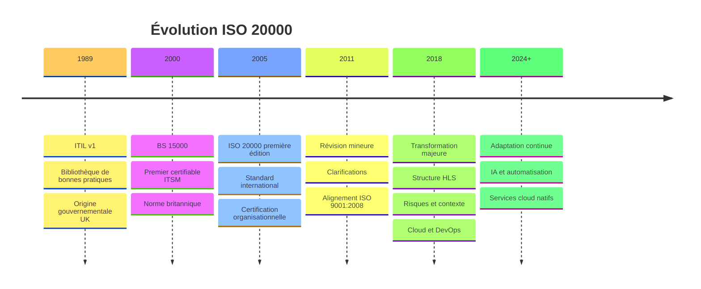
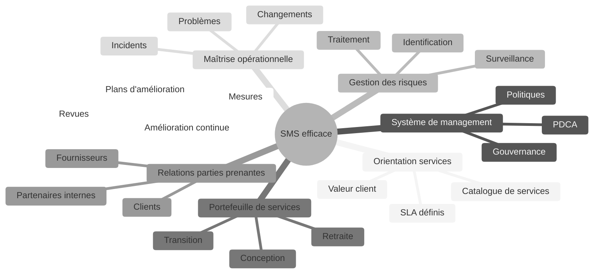
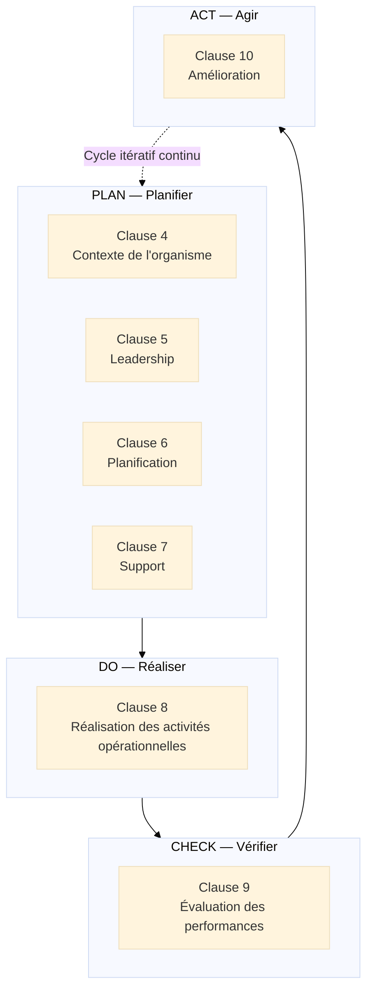
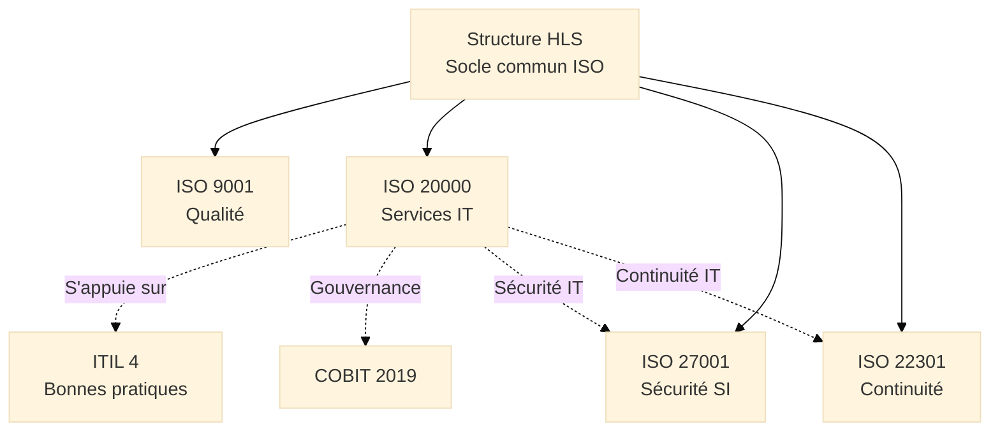
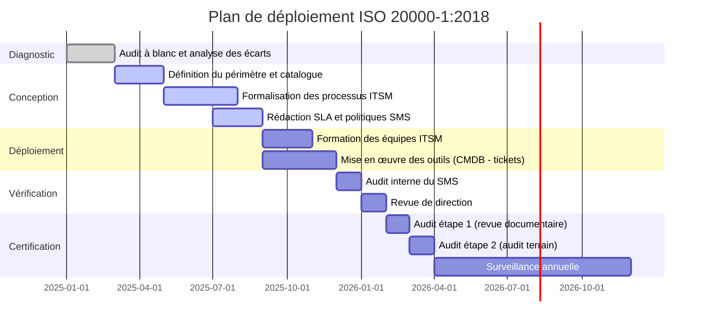

# ISO 20000 — Système de Management des Services

<div
  class="omny-meta"
  data-level="🟡 Intermédiaire & 🔴 Avancé"
  data-version="1.0"
  data-time="35-40 minutes">
</div>

## Introduction au Management des Services IT

!!! quote "Analogie pédagogique"
    _Imaginez un **opérateur de télécommunications** qui dessert 10 millions de clients avec des services voix, Internet et télévision. Chaque appel téléphonique est un service livré en temps réel. Chaque coupure Internet est un incident qui déclenche une chaîne de traitement. Chaque mise à jour du réseau est un changement qui doit être planifié pour ne pas dégrader l'expérience client. Chaque nouveau forfait commercialisé est un service conçu, testé, puis déployé selon un processus de mise en production. Sans cadre structuré, ces milliers d'opérations quotidiennes deviennent incontrôlables : les incidents se répètent sans être analysés, les changements créent des régressions, les niveaux de service promis aux clients ne sont pas tenus. **ISO 20000 fonctionne exactement comme le système d'exploitation de cet opérateur** : il structure l'ensemble du cycle de vie des services — de leur conception à leur amélioration — en garantissant que chaque engagement pris envers le client repose sur un processus maîtrisé, mesuré et continuellement optimisé._

**ISO/IEC 20000** constitue le **standard international de management des services informatiques** (ITSM[^1]). Sa première partie — **ISO/IEC 20000-1:2018** — définit les exigences d'un système de management des services[^2] (SMS) certifiable. Initialement publié en 2005, il a été profondément refondu en 2011 puis en 2018 pour adopter la Structure HLS[^3] commune à toutes les normes ISO de management.

À la différence d'ITIL[^4] (référentiel de bonnes pratiques non certifiable), **ISO 20000-1 est une norme d'exigences** : elle définit ce que l'organisation **doit** démontrer, pas comment elle doit s'organiser. Une organisation peut s'appuyer sur ITIL, COBIT, VeriSM ou tout autre cadre pour satisfaire les exigences d'ISO 20000-1.

!!! info "Pourquoi ISO 20000 est essentiel ?"
    ISO 20000 fournit le **cadre de gouvernance** qui transforme la gestion des services IT d'une activité réactive — "éteindre les incendies" — en un **système prévisible, mesurable et contractuellement défendable**. C'est le seul standard international certifiable dédié au management des services IT.

<br>

---

## Pour repartir des bases

### 1. Une norme certifiable, structurée en parties

ISO/IEC 20000 est une famille de normes. Seule la **partie 1** est certifiable :

- **ISO/IEC 20000-1:2018** : Exigences du SMS — c'est la référence de certification
- **ISO/IEC 20000-2:2019** : Guide d'application — lignes directrices (non certifiable)
- **ISO/IEC 20000-3:2019** : Guide sur le périmètre et l'applicabilité
- **ISO/IEC 20000-10:2018** : Concepts et vocabulaire

> La certification ISO 20000-1 est délivrée par un organisme de certification[^5] accrédité. Elle atteste que le SMS de l'organisation satisfait aux exigences de la norme pour un périmètre de services défini.

### 2. La définition centrale : qu'est-ce qu'un service ?

ISO 20000 définit un **service** comme un moyen de créer de la valeur pour les clients en facilitant les résultats qu'ils souhaitent atteindre sans avoir à gérer des coûts et des risques spécifiques.

Cette définition implique trois dimensions inséparables :

1. **La valeur** :  
   _Un service n'est pas un livrable technique. C'est une valeur perçue par le client — une messagerie électronique qui fonctionne, un ERP accessible 24h/24, une sauvegarde des données garantie._

2. **Le niveau de service convenu** :  
   _La qualité du service est définie contractuellement dans des accords de niveau de service[^6] (ANS/SLA). Ce qui n'est pas mesuré ne peut pas être amélioré._

3. **La responsabilité partagée** :  
   _Le fournisseur de services assume les risques opérationnels. Le client se concentre sur son métier. Cette répartition claire est le fondement de la relation de service._

### 3. Un cadre indépendant des outils et des référentiels

ISO 20000-1 n'impose ni ITIL, ni COBIT, ni aucun autre référentiel. Elle impose des **résultats vérifiables** :

- Les incidents sont gérés selon un processus défini
- Les changements sont évalués et autorisés avant déploiement
- Les niveaux de service sont mesurés et communiqués aux clients
- Les fournisseurs sont sélectionnés et surveillés

!!! note "ISO 20000 et ITIL"
    ITIL 4 et ISO 20000-1:2018 sont **complémentaires, pas concurrents**. ITIL décrit comment organiser un fournisseur de services (pratiques, SVS[^7], chaîne de valeur). ISO 20000-1 définit ce que le fournisseur doit démontrer pour être certifié. Une organisation alignée sur ITIL 4 dispose d'une base solide pour obtenir la certification ISO 20000-1.

<br>

---

## Historique et évolutions

### Pourquoi ISO 20000 a été créée ?

Avant 2005, le management des services IT manquait d'un **standard international de référence certifiable** :

- ITIL existait depuis les années 1980 mais n'était pas certifiable au niveau organisationnel
- BS 15000 (norme britannique, 2000) était le seul référentiel certifiable mais à portée limitée
- Les contrats de services IT manquaient d'un langage commun pour définir les niveaux de qualité attendus

!!! note "Besoin identifié"
    Créer un **standard international certifiable** permettant à tout fournisseur de services IT de démontrer formellement sa capacité à gérer des services conformément à des exigences convenues avec ses clients.

### Les versions majeures

=== "BS 15000:2000 — Précurseur"

    **Contexte :**  
    _Norme britannique de management des services IT, première du genre à être certifiable._

    **Innovations :**

    - [x] Premier référentiel certifiable pour l'ITSM
    - [x] Alignement sur les pratiques ITIL de l'époque
    - [x] Focus sur 13 processus ITSM structurés

    > **Limite principale :** Portée nationale, peu de reconnaissance internationale, documentation lourde.

=== "ISO/IEC 20000-1:2005 — Fondation"

    **Contexte :**  
    _Conversion de BS 15000 en standard international ISO, première norme ISO certifiable dédiée à l'ITSM._

    **Innovations majeures :**

    - [x] Reconnaissance internationale de la certification
    - [x] Structure en deux parties (exigences + guide)
    - [x] Définition des processus ITSM fondamentaux
    - [x] Exigence de planification et d'amélioration continue

    > **Adoption limitée :** La structure documentaire reste lourde, la norme peu connue hors des grandes DSI et des outsourceurs.

=== "ISO/IEC 20000-1:2011 — Clarification"

    **Contexte :**  
    _Révision visant à clarifier les exigences et à mieux refléter la réalité des organisations fournissant des services IT._

    **Évolutions clés :**

    - [x] Clarification du périmètre et de l'applicabilité
    - [x] Meilleure cohérence avec **ISO 9001:2008**
    - [x] Précisions sur la gestion des fournisseurs et des sous-traitants
    - [x] Introduction de la notion de **catalogue de services**[^8]

=== "ISO/IEC 20000-1:2018 — Transformation"

    **Contexte :**  
    _Refonte majeure adoptant la Structure HLS[^3] et s'alignant sur les évolutions d'ITIL 4 et du cloud computing._

    **Innovations majeures :**

    - [x] **Structure HLS** : alignement avec ISO 9001:2015, ISO 27001:2013, ISO 22301
    - [x] **Pensée fondée sur les risques** intégrée au SMS
    - [x] **Contexte de l'organisme** et parties intéressées
    - [x] Réduction de la surcharge documentaire
    - [x] Meilleure prise en compte du **cloud** et de l'externalisation multi-niveaux
    - [x] Alignement avec **ITIL 4**

    > **Modernisation** : La norme s'adapte aux réalités du DevOps, de l'agilité et des services cloud, sans les imposer comme méthode.

### Timeline de l'évolution ISO 20000


_La révision 2018 marque l'intégration d'ISO 20000 dans l'écosystème normatif HLS, facilitant son intégration avec ISO 27001 dans les SMS-SI des organisations IT._

<br>

---

## Les 7 concepts fondateurs

ISO 20000-1:2018 repose sur **7 concepts fondateurs** qui structurent la philosophie du management des services. Ils sont présents dans l'ensemble du texte normatif et de ses annexes informatives.

!!! note "Des concepts, pas des étapes"
    Ces 7 concepts ne sont pas des étapes séquentielles. Ils définissent les **qualités fondamentales** que doit posséder un SMS efficace et mature.

### Vue d'ensemble


_Les 7 concepts forment un **système orienté valeur** : chaque concept contribue à garantir que les services délivrés correspondent aux engagements contractuels et s'améliorent dans le temps._

### Les 7 concepts expliqués

!!! note "Ci-dessous les 4 premiers concepts"

=== "1️⃣ Orientation services"

    **Toute l'organisation est structurée autour de la création de valeur pour le client via des services définis.**

    L'orientation services implique de ne jamais perdre de vue que l'activité IT existe pour servir des besoins métiers :

    - **Catalogue de services**[^8] :  
      _Référentiel des services disponibles, leurs caractéristiques, leurs niveaux de service et leurs conditions d'utilisation._

    - **Accords de niveau de service (ANS/SLA)**[^6] :  
      _Engagements mesurables sur la disponibilité, la performance, les délais de rétablissement (MTTR[^9]) et de résolution._

    - **Expérience client** :  
      _La qualité perçue du service ne se réduit pas aux indicateurs techniques. Elle inclut la communication, la réactivité et la transparence._

    > Un service IT sans SLA défini est un service sans responsabilité. ISO 20000-1 exige que **tout service du catalogue** soit associé à des engagements de niveau de service formalisés et mesurés.

=== "2️⃣ Système de management des services (SMS)"

    **Le SMS est le cadre organisationnel qui structure l'ensemble de la gestion des services.**

    Le SMS comprend :

    - **La politique de gestion des services** :  
      _Engagements de la direction sur la qualité des services, l'amélioration continue et la conformité._

    - **Les objectifs de service** :  
      _Cibles mesurables alignées sur les engagements contractuels et les attentes des parties intéressées._

    - **Les processus définis** :  
      _Activités formalisées pour gérer les incidents, les changements, les configurations, les capacités, la disponibilité._

    - **La gouvernance** :  
      _Rôles, responsabilités et autorités clairement définis pour chaque processus._

=== "3️⃣ Gestion des risques"

    **Les risques liés aux services sont identifiés, évalués et traités de manière proactive.**

    La gestion des risques en ISO 20000 couvre deux périmètres :

    - **Risques pour la continuité des services** :  
      _Indisponibilité d'infrastructure, défaillance de fournisseur, obsolescence technologique, cyber-incident._

    - **Risques pour la conformité au SMS** :  
      _Non-respect des processus, manque de compétences, défaillance de la gouvernance._

    La gestion des risques est intégrée à la planification du SMS (clause 6.1) et à la gestion de la continuité des services (processus dédié).

=== "4️⃣ Portefeuille de services"

    **Chaque service suit un cycle de vie géré : conception, transition, production, amélioration, retraite.**

    Le portefeuille de services[^10] couvre l'intégralité du cycle de vie :

    - **Services en cours de conception** :  
      _Nouveaux services dont les exigences sont définies mais pas encore déployés._

    - **Services en production** :  
      _Services actifs, délivrés aux clients, couverts par des SLA et des processus opérationnels._

    - **Services en retraite** :  
      _Services dont le retrait est planifié ou en cours, avec gestion de la migration des utilisateurs._

    > Gérer un portefeuille de services, c'est éviter la **dette de services** : des services obsolètes maintenus en production faute de plan de retraite structuré, qui consomment des ressources sans créer de valeur.

!!! note "Ci-dessous les 3 derniers concepts"

=== "5️⃣ Relations avec les parties prenantes"

    **La qualité des services dépend de la qualité des relations avec les clients, les fournisseurs et les équipes internes.**

    ISO 20000-1 distingue trois types de relations :

    - **Relations client** :  
      _Compréhension des besoins métiers, revues de service régulières, gestion des réclamations, satisfaction client mesurée._

    - **Relations fournisseurs** :  
      _Sélection, contractualisation (contrats sous-jacents[^11]), surveillance des performances, gestion des escalades._

    - **Relations internes** :  
      _Accords de niveau opérationnel (OLA[^12]) entre équipes internes qui contribuent à la délivrance des services._

    > La chaîne de délivrance d'un service implique souvent de multiples fournisseurs. ISO 20000-1 exige que l'organisation maîtrise l'ensemble de cette chaîne, y compris les fournisseurs de ses fournisseurs lorsqu'ils impactent les services délivrés.

=== "6️⃣ Maîtrise opérationnelle des processus"

    **Les processus ITSM sont formalisés, exécutés, mesurés et améliorés.**

    ISO 20000-1 exige la maîtrise opérationnelle des processus suivants :

    - **Gestion des incidents**[^13] : Rétablissement du service dans les délais convenus (SLA)
    - **Gestion des problèmes**[^14] : Élimination des causes racines des incidents récurrents
    - **Gestion des changements**[^15] : Évaluation et autorisation des modifications avant déploiement
    - **Gestion des mises en production**[^16] : Déploiement contrôlé des changements en production
    - **Gestion des configurations**[^17] : Inventaire et état des éléments de configuration (CI)
    - **Gestion des niveaux de service** : Mesure et reporting des SLA
    - **Gestion de la disponibilité** : Atteinte des engagements de disponibilité contractualisés
    - **Gestion de la capacité** : Anticipation des besoins en ressources pour tenir les niveaux de service
    - **Gestion de la continuité des services IT** : Plans de reprise des services critiques

=== "7️⃣ Amélioration continue"

    **Le SMS s'améliore en permanence sur la base des mesures, des audits et des retours d'expérience.**

    L'amélioration continue en ISO 20000 prend plusieurs formes :

    - **Plan d'amélioration des services (PAS)** :  
      _Document formel listant les actions d'amélioration identifiées, priorisées et planifiées._

    - **Revues de service** :  
      _Revues périodiques avec les clients pour évaluer la performance, identifier les insatisfactions et planifier les améliorations._

    - **Analyse des tendances** :  
      _Évolution des volumes d'incidents, des délais de résolution, des violations de SLA — pas uniquement les snapshots ponctuels._

    - **REX post-incident majeur** :  
      _Analyse structurée après chaque incident majeur pour identifier les causes et prévenir la récurrence._

<br>

---

## La structure HLS et les clauses opérationnelles

ISO 20000-1:2018 adopte la **Structure HLS**[^3] en 10 clauses. Les clauses opérationnelles (4 à 10) suivent le cycle PDCA[^18].

### Le cycle PDCA appliqué aux clauses


_La clause 8 est la plus dense d'ISO 20000-1. Elle regroupe l'ensemble des processus ITSM opérationnels : planification et transition des services, conception, production, gestion des relations, fournisseurs, incidents, problèmes, changements, mises en production, configurations, disponibilité, capacité et continuité._

### Détail des clauses

??? abstract "Clause 4 — Contexte de l'organisme"

    **Définir le périmètre du SMS et comprendre l'environnement dans lequel les services sont fournis.**

    **4.1 — Compréhension de l'organisme et de son contexte :**  
    _Identifier les enjeux internes et externes qui influencent le SMS : maturité IT, attentes clients, contraintes réglementaires, évolutions technologiques (cloud, IA, DevOps)._

    **4.2 — Compréhension des parties intéressées :**  
    _Clients des services, propriétaires métiers, régulateurs, fournisseurs, équipes internes._

    **4.3 — Périmètre du SMS :**  
    _Définir précisément quels services, quels sites, quels clients et quelles équipes sont couverts par la certification. Le périmètre est critique : un auditeur ne peut pas certifier ce qui est hors périmètre._

    **4.4 — SMS :**  
    _Établir, mettre en œuvre, maintenir et améliorer continuellement le SMS._

    | Livrable attendu | Description |
    |------------------|-------------|
    | Analyse du contexte | Enjeux internes/externes, forces et contraintes |
    | Registre des parties intéressées | Clients, régulateurs, fournisseurs et leurs exigences |
    | Périmètre documenté | Services couverts, exclusions justifiées |

??? abstract "Clause 5 — Leadership"

    **La direction s'engage personnellement sur la qualité des services IT.**

    **5.1 — Leadership et engagement :**  
    _La direction démontre son engagement par des actes concrets : allocation de ressources, participation aux revues de service, défense du SMS lors de pressions budgétaires._

    **5.2 — Politique de gestion des services :**  
    _Établir une politique documentée exprimant les engagements en matière de qualité, de conformité et d'amélioration des services._

    **5.3 — Rôles, responsabilités et autorités :**  
    _Désigner explicitement les responsables de processus (propriétaires de processus), les gestionnaires de services, et les personnes autorisées à approuver les changements._

    !!! tip "Propriétaire de processus vs exécutant"
        ISO 20000-1 attend une distinction claire entre le **propriétaire de processus** (responsable de la définition, de la mesure et de l'amélioration du processus) et l'**exécutant** (qui applique le processus au quotidien). Cette distinction est vérifiée en audit.

??? abstract "Clause 6 — Planification"

    **Planifier le SMS en intégrant les risques, les objectifs et les changements.**

    **6.1 — Actions face aux risques et opportunités :**  
    _Identifier les risques qui pourraient empêcher le SMS d'atteindre ses objectifs ou dégrader la qualité des services._

    **6.2 — Objectifs de gestion des services et planification :**  
    _Définir des objectifs mesurables pour les services et le SMS. Exemples : taux de résolution d'incidents dans les SLA ≥ 95%, disponibilité du service critique ≥ 99,5%, satisfaction client ≥ 4/5._

    **6.3 — Planification et maîtrise des changements du SMS :**  
    _Toute modification du SMS (nouveau processus, nouveau périmètre, nouvelle équipe) doit être planifiée et maîtrisée._

??? abstract "Clause 7 — Support"

    **Fournir les ressources nécessaires au SMS.**

    **7.1 — Ressources :**  
    _Personnel, infrastructure, outils ITSM (CMDB, ticketing, monitoring), connaissances organisationnelles._

    **7.2 — Compétences :**  
    _Définir les compétences requises pour chaque rôle ITSM. Vérifier leur acquisition. Conserver les preuves : certifications ITIL, formations, habilitations._

    **7.3 — Sensibilisation :**  
    _Tout le personnel concerné comprend la politique de services, ses objectifs, sa contribution et les conséquences du non-respect des processus._

    **7.4 — Communication :**  
    _Communication interne (entre équipes ITSM) et externe (vers les clients sur les niveaux de service, les incidents majeurs, les changements planifiés)._

    **7.5 — Informations documentées :**  
    _Maîtriser les documents du SMS : politique, procédures de processus, catalogue de services, SLA, registre des configurations, enregistrements des incidents._

??? abstract "Clause 8 — Réalisation des activités opérationnelles"

    **Gérer opérationnellement l'ensemble du cycle de vie des services.**

    ISO 20000-1 structure la clause 8 en sept domaines distincts :

    **8.1 — Planification et maîtrise opérationnelles**

    **8.2 — Portefeuille de services :**  
    _Gérer le cycle de vie complet des services : conception, mise en catalogue, production, retraite._

    **8.3 — Contrôle des parties tierces :**  
    _Sélectionner, contractualiser et surveiller les fournisseurs et sous-traitants contribuant aux services._

    **8.4 — Gestion de la demande et des niveaux de service :**  
    _Recueillir et formaliser les exigences clients, négocier les SLA, mesurer et reporter les performances._

    **8.5 — Conception et transition des services :**  
    _Concevoir les nouveaux services en intégrant les exigences de disponibilité, capacité, sécurité et continuité dès la conception. Gérer la transition vers la production._

    **8.6 — Résolution et rétablissement :**  
    _Gestion des incidents[^13] et des problèmes[^14]. Rétablissement du service dans les délais SLA. Élimination des causes racines._

    **8.7 — Contrôle des services :**  
    _Gestion des changements[^15], des mises en production[^16] et des configurations[^17]. Disponibilité et capacité. Sécurité de l'information. Continuité des services IT._

    ```mermaid
    ---
    config:
      theme: "base"
    ---
    flowchart LR
        INC["Incident\ndéclaré"] --> TRI["Triage\net priorisation"]
        TRI --> RES["Résolution\n(équipe N1 - N2 - N3)"]
        RES --> SLA{"Dans\nles SLA ?"}
        SLA -->|Oui| CLO["Clôture\net satisfaction"]
        SLA -->|Non| ESC["Escalade\net communication client"]
        ESC --> RES
        CLO --> PB{"Incident\nrécurrent ?"}
        PB -->|Oui| PRB["Ouverture\nProblème"]
        PB -->|Non| FIN["Archivage\net reporting"]
        PRB --> ACR["Analyse cause racine\net RFC"]
        ACR --> FIN
    ```
    _Le processus de gestion des incidents est le plus visible pour les clients. La distinction entre **incident** (rétablissement du service) et **problème** (élimination de la cause) est fondamentale et systématiquement vérifiée en audit._

??? abstract "Clause 9 — Évaluation des performances"

    **Mesurer, analyser et évaluer les performances du SMS et des services.**

    **9.1 — Surveillance, mesure, analyse et évaluation :**  
    _Définir les indicateurs de service (disponibilité, MTTR[^9], MTBF[^19], taux de résolution SLA) et les indicateurs du SMS (taux de changements en échec, volume d'incidents majeurs)._

    **9.2 — Audit interne :**  
    _Réaliser des audits internes du SMS à intervalles planifiés pour vérifier la conformité aux exigences et l'efficacité réelle des processus._

    **9.3 — Revue de direction :**  
    _Revue périodique du SMS par la direction incluant les performances des services, les violations de SLA, les risques identifiés et les décisions d'amélioration._

    | Indicateurs clés à surveiller | Cible type |
    |-------------------------------|------------|
    | Disponibilité services critiques | ≥ 99,5% |
    | Taux résolution incidents dans SLA | ≥ 95% |
    | Taux de changements en échec | ≤ 5% |
    | Satisfaction client | ≥ 4/5 |
    | Délai moyen de rétablissement (MTTR) | Défini par SLA |

??? abstract "Clause 10 — Amélioration"

    **Améliorer continuellement le SMS et les services délivrés.**

    **10.1 — Non-conformité et action corrective :**  
    _Face à une non-conformité (violation de SLA non traitée, processus non suivi, audit négatif) : analyser, corriger, vérifier l'efficacité._

    **10.2 — Amélioration continue :**  
    _Maintenir un plan d'amélioration des services (PAS) documenté, avec des actions priorisées, assignées et suivies._

<br>

---

## Articulation avec d'autres normes et frameworks

### Comparaison avec les standards et référentiels majeurs

| Standard / Référentiel | Périmètre | Relation avec ISO 20000 | Certifiable |
|------------------------|-----------|------------------------|-------------|
| **ISO 9001:2015** | Qualité | Structure HLS commune, intégrable | Oui |
| **ISO 27001:2022** | Sécurité SI | Structure HLS commune, souvent combiné | Oui |
| **ISO 22301:2019** | Continuité d'activité | Complémentaire (continuité des services IT) | Oui |
| **ITIL 4** | Bonnes pratiques ITSM | Référentiel complémentaire non certifiable | Non |
| **COBIT 2019** | Gouvernance IT | Complémentaire, niveau gouvernance supérieur | Non |
| **VeriSM** | Service management agile | Compatible ISO 20000, approche plus flexible | Non |

### Positionnement d'ISO 20000


_ISO 20000 est le **pilier central de la gouvernance des services IT**. Il s'appuie sur les référentiels de bonnes pratiques (ITIL, COBIT) pour son contenu opérationnel et s'intègre avec ISO 27001 et ISO 22301 pour couvrir la sécurité et la résilience._

<br>

---

## Bénéfices de l'approche ISO 20000

### Pour les organisations

<div class="grid cards" markdown>

-   :lucide-check-circle:{ .lg .middle } **Qualité de service mesurable et défendable**

    ---
    Les SLA formalisés et mesurés permettent de démontrer contractuellement le niveau de service délivré aux clients internes et externes.

-   :lucide-trending-up:{ .lg .middle } **Réduction des interruptions de service**

    ---
    La gestion structurée des problèmes élimine les causes racines des incidents récurrents, réduisant le volume total d'incidents dans le temps.

-   :lucide-shield-check:{ .lg .middle } **Crédibilité auprès des clients et donneurs d'ordre**

    ---
    La certification ISO 20000-1 est un signal de maturité ITSM reconnu internationalement, exigé dans de nombreux appels d'offres de services IT managés.

-   :lucide-refresh-cw:{ .lg .middle } **Maîtrise des changements**

    ---
    Le processus de gestion des changements réduit le taux de changements en échec et les incidents post-déploiement, sources majeures d'interruptions.

</div>

<div class="grid cards" markdown>

-   :lucide-handshake:{ .lg .middle } **Accès aux marchés IT managés**

    ---
    De nombreux contrats de services IT managés (infogérance, cloud, outsourcing) exigent la certification ISO 20000-1 comme prérequis de qualification.

-   :lucide-award:{ .lg .middle } **Intégration naturelle avec ISO 27001**

    ---
    Les processus de gestion des incidents de sécurité, des changements et des configurations se recoupent directement avec les exigences de l'Annexe A d'ISO 27001.

</div>

<br>

---

## Mise en œuvre pratique

### Étapes clés de déploiement



### Écueils à éviter

!!! warning "Pièges courants"

    **Périmètre trop large pour une première certification :**  
    _Vouloir certifier l'ensemble de la DSI dès le premier cycle. Un périmètre ciblé (un service ou une ligne de services) permet de valider la démarche avant d'étendre._

    **CMDB inexistante ou obsolète :**  
    _La gestion des configurations est le socle de tous les autres processus. Une CMDB[^17] non maintenue rend impossible la gestion efficace des incidents, des changements et de la disponibilité._

    **SLA définis sans baseline de mesure :**  
    _Fixer des engagements de disponibilité ou de délai sans avoir mesuré les performances actuelles. Un SLA inatteignable génère des violations structurelles._

    **Confusion incident vs problème :**  
    _Traiter tous les incidents comme des problèmes génère une surcharge. Ne jamais ouvrir de problème conduit à la récurrence. La distinction doit être formalisée et appliquée._

    **SMS déconnecté des enjeux métiers :**  
    _Piloter les services sur des indicateurs purement techniques (CPU, réseau) sans les relier aux impacts métiers (processus inaccessible, perte de chiffre d'affaires)._

### Facteurs clés de succès

- [x] **Périmètre ciblé** pour la première certification, étendu progressivement
- [x] **CMDB maintenue** comme source de vérité des éléments de configuration
- [x] **SLA négociés** sur la base de mesures historiques réelles
- [x] **Propriétaires de processus** désignés avec autorité réelle
- [x] **Revues de service client** régulières, pas uniquement lors des crises
- [x] **Plan d'amélioration des services** maintenu et suivi activement

<br>

---

## Conclusion

!!! quote "Un service IT sans processus est une promesse sans garantie."
    ISO 20000-1:2018 incarne une réalité que tout professionnel IT finit par expérimenter : la qualité des services IT ne repose pas sur la compétence individuelle des techniciens, mais sur la **robustesse des processus** qui structurent leur travail collectif. Un expert peut rétablir un service en urgence. Un processus garantit que ce service ne tombe pas au même endroit deux fois.

    La certification ISO 20000-1 n'est pas une fin en soi. C'est la démonstration formelle que les processus ITSM sont définis, appliqués, mesurés et améliorés — pas uniquement documentés pour l'auditeur. Les organisations qui en tirent le meilleur ont compris que les SLA sont des engagements stratégiques, que la CMDB est un actif critique, et que la gestion des problèmes est le meilleur investissement pour réduire la dette d'incidents.

    > La prochaine étape logique est d'explorer comment ISO 20000-1 s'intègre avec **ISO 27001** (sécurité de l'information) et **ISO 22301** (continuité d'activité) pour construire un dispositif complet de gouvernance des services IT sécurisés et résilients.

<br>

---

## Ressources complémentaires

### Documents officiels ISO

- **ISO/IEC 20000-1:2018** — Management des services : Exigences du SMS
- **ISO/IEC 20000-2:2019** — Management des services : Guide d'application
- **ISO/IEC 20000-10:2018** — Management des services : Concepts et vocabulaire

### Référentiels complémentaires

- **ITIL 4** : IT Infrastructure Library (AXELOS)
- **COBIT 2019** : Control Objectives for Information and Related Technologies (ISACA)
- **VeriSM** : Value-Driven, Evolving, Responsive, Integrated Service Management

### Organismes de référence

- **AFNOR** : Association Française de Normalisation
- **itSMF** : IT Service Management Forum (France et international)
- **ISACA** : Information Systems Audit and Control Association


[^1]: L'**ITSM** (*IT Service Management*, ou gestion des services informatiques) désigne l'ensemble des activités, politiques et processus qu'une organisation utilise pour concevoir, délivrer, gérer et améliorer les services IT qu'elle fournit à ses clients internes ou externes.
[^2]: Le **SMS** (*Service Management System*, ou Système de Management des Services) est l'ensemble des politiques, objectifs, processus, procédures, ressources et responsabilités qu'une organisation met en place pour gérer et améliorer la qualité de ses services IT de manière systématique et continue.
[^3]: La **Structure HLS** (*High Level Structure*) est un cadre commun imposé par l'ISO à toutes ses normes de systèmes de management depuis 2012. Elle définit une structure identique en 10 clauses permettant l'intégration de plusieurs normes (ISO 20000, ISO 27001, ISO 9001, ISO 22301) dans un système de management unifié.
[^4]: **ITIL** (*IT Infrastructure Library*) est un référentiel de bonnes pratiques pour le management des services IT, maintenu par AXELOS. Aujourd'hui à sa version 4, ITIL n'est pas une norme certifiable au niveau organisationnel (seules les personnes peuvent être certifiées ITIL), mais constitue le référentiel de bonnes pratiques le plus répandu dans le secteur IT.
[^5]: Un **organisme de certification** est une entité tierce indépendante et accréditée (par le COFRAC en France) habilitée à auditer et certifier la conformité d'une organisation à ISO 20000-1. En France : Bureau Veritas, BSI, SGS, LRQA.
[^6]: Un **SLA** (*Service Level Agreement*, ou Accord de Niveau de Service/ANS) est un contrat ou engagement formel définissant les niveaux de qualité attendus pour un service IT (disponibilité, délais de rétablissement, performance). La mesure du respect des SLA est une exigence centrale d'ISO 20000-1.
[^7]: Le **SVS** (*Service Value System*) est le modèle central d'ITIL 4. Il décrit comment tous les composants et activités d'une organisation concourent à créer de la valeur à travers des services IT. Il comprend la chaîne de valeur des services, les pratiques, les principes directeurs, la gouvernance et l'amélioration continue.
[^8]: Un **catalogue de services** est un document ou un référentiel qui répertorie tous les services IT disponibles pour les utilisateurs, avec leurs caractéristiques (description, niveau de service, point de contact, conditions d'utilisation). C'est le point d'entrée unique pour les utilisateurs souhaitant accéder aux services IT.
[^9]: Le **MTTR** (*Mean Time To Restore*, ou temps moyen de rétablissement) mesure le temps moyen nécessaire pour rétablir un service après une interruption. C'est l'un des indicateurs clés de la gestion des incidents. Il est à distinguer du **MTBF** (*Mean Time Between Failures*, temps moyen entre deux pannes) qui mesure la fiabilité.
[^10]: Le **portefeuille de services** est l'ensemble complet des services gérés par une organisation IT : services en cours de conception, services en production, et services retirés. Il permet une vision globale du cycle de vie de tous les services et guide les décisions d'investissement et de priorisation.
[^11]: Les **contrats sous-jacents** (*Underpinning Contracts*) sont les contrats conclus entre le fournisseur de services et ses propres fournisseurs ou sous-traitants pour soutenir la délivrance des services aux clients finaux. Ils doivent être alignés sur les SLA conclus avec les clients.
[^12]: Un **OLA** (*Operational Level Agreement*, ou Accord de Niveau Opérationnel) est un accord interne entre deux équipes au sein d'une même organisation définissant leurs engagements mutuels pour supporter la délivrance des services. Par exemple : l'accord entre l'équipe réseau et l'équipe support sur les délais de résolution des incidents réseau.
[^13]: Un **incident** est une interruption non planifiée d'un service IT ou une réduction de la qualité d'un service IT. L'objectif de la gestion des incidents est de **rétablir le service** dans les délais définis par les SLA, pas nécessairement d'en éliminer la cause.
[^14]: Un **problème** est la cause (inconnue ou identifiée) d'un ou plusieurs incidents. La gestion des problèmes vise à **éliminer les causes racines** des incidents pour prévenir leur récurrence, contrairement à la gestion des incidents qui se contente du rétablissement.
[^15]: Un **changement** est l'ajout, la modification ou le retrait de tout ce qui pourrait affecter les services IT. La gestion des changements vise à maximiser les changements réussis en évaluant les risques, en obtenant les autorisations appropriées et en planifiant les déploiements.
[^16]: Une **mise en production** (*release*) est le déploiement en environnement de production d'un ou plusieurs changements autorisés. La gestion des mises en production garantit que les déploiements sont planifiés, testés et réversibles.
[^17]: La **CMDB** (*Configuration Management Database*, ou base de données de gestion des configurations) est le référentiel central qui stocke les informations sur les éléments de configuration (CI : serveurs, applications, réseaux, services) et leurs relations. C'est la source de vérité de l'infrastructure IT et le fondement de tous les processus ITSM.
[^18]: Le **cycle PDCA** (*Plan-Do-Check-Act*) est un modèle itératif d'amélioration continue structurant les 7 clauses opérationnelles d'ISO 20000-1, comme dans toutes les normes HLS.
[^19]: Le **MTBF** (*Mean Time Between Failures*, ou temps moyen entre deux pannes) mesure la fiabilité moyenne d'un service ou composant en calculant le temps moyen séparant deux incidents successifs. Un MTBF élevé indique une bonne fiabilité. Il est complémentaire du MTTR pour évaluer la disponibilité globale.

<br>

---

## Conclusion

!!! quote "Ce qu'il faut retenir"
    Les normes et référentiels ne sont pas des contraintes administratives, mais des cadres structurants. Ils garantissent que la cybersécurité s'aligne sur les objectifs métiers de l'organisation et offre une assurance raisonnable face aux risques.

> [Retour à l'index de la gouvernance →](../../index.md)
