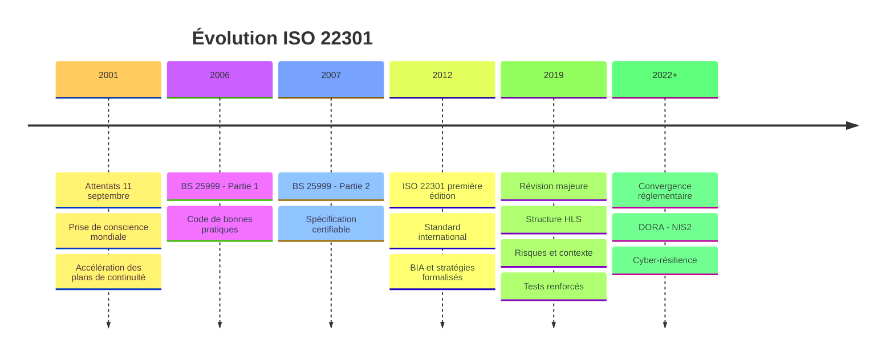
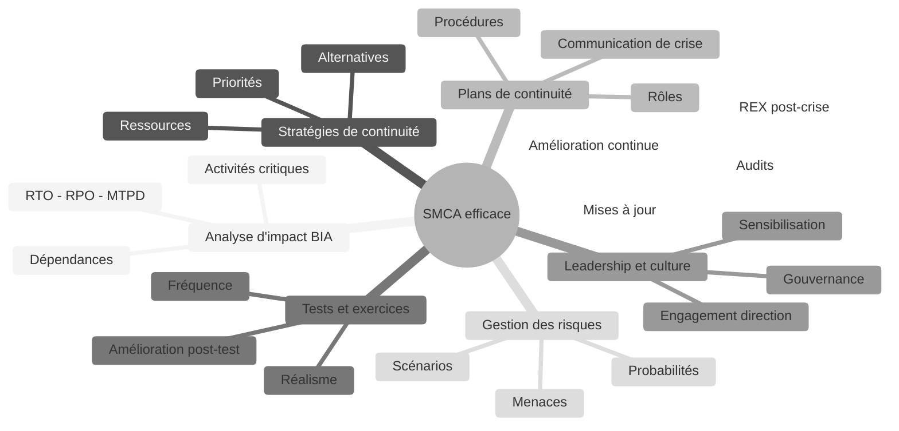
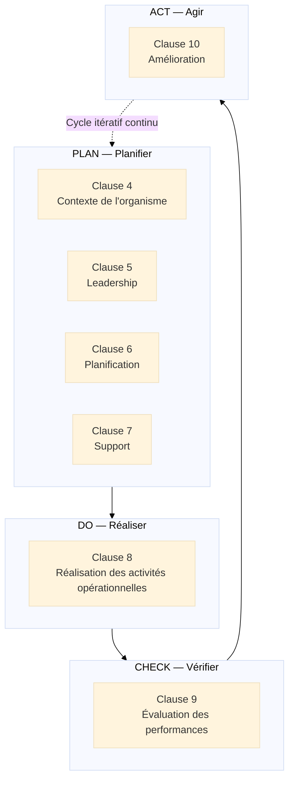
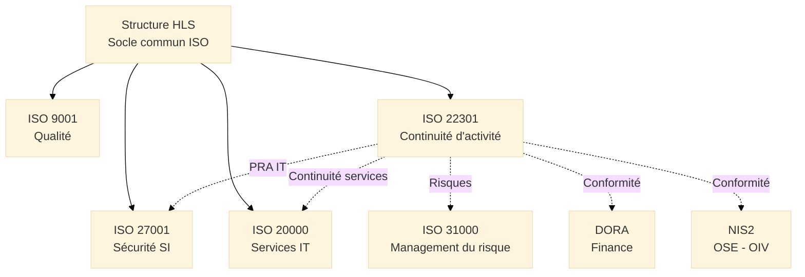
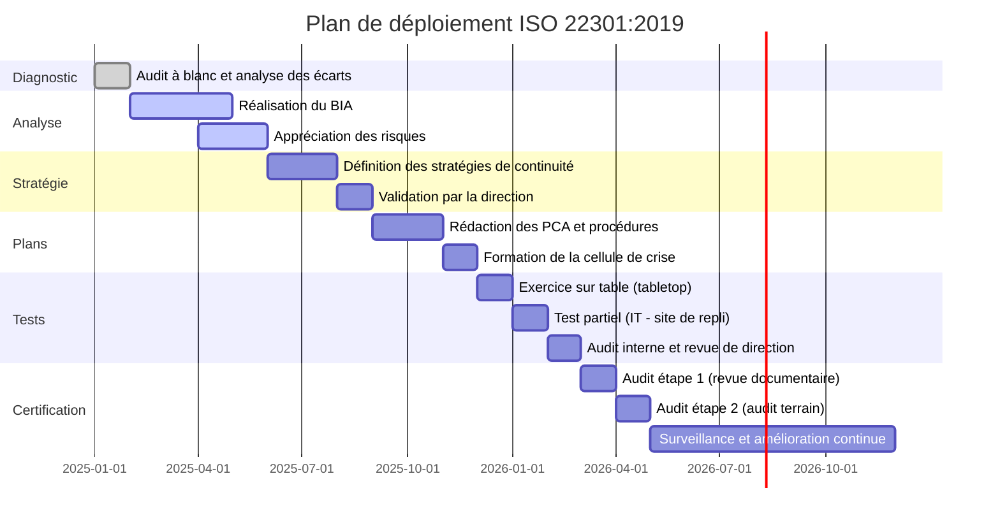

# ISO 22301 — Système de Management de la Continuité d'Activité

<div
  class="omny-meta"
  data-level="🟡 Intermédiaire & 🔴 Avancé"
  data-version="1.0"
  data-time="35-40 minutes">
</div>

## Introduction à la Continuité d'Activité

!!! quote "Analogie pédagogique"
    _Imaginez le **centre de contrôle de la centrale nucléaire de Civaux**. Ce site ne fonctionne pas en espérant qu'aucun incident ne surviendra. Il a été conçu en partant du principe que des incidents **se produiront**. Pour chaque scénario envisageable — tremblement de terre, inondation, incendie en salle de contrôle, panne d'alimentation, défaillance humaine, cyberattaque — il existe un plan écrit, des équipes formées, des ressources pré-positionnées, des exercices réalisés régulièrement. Le bâtiment lui-même est conçu pour maintenir les fonctions critiques même en cas de dégradation sévère. **ISO 22301 fonctionne exactement ainsi** : ce n'est pas un plan de secours rangé dans un tiroir. C'est un **système de management complet** qui garantit que l'organisation a identifié ses activités critiques, déterminé leur seuil de tolérance à l'interruption, construit des stratégies de continuité réalistes, et s'est assurée par des tests réguliers qu'elle peut effectivement les activer quand une crise survient — pas seulement qu'elle le croit._

**ISO 22301** constitue le **standard international de management de la continuité d'activité** (SMCA[^1]). Publié en 2012 et révisé en 2019, il définit les **exigences** qu'un système de management de la continuité d'activité doit satisfaire pour qu'une organisation puisse préparer, répondre et se rétablir face aux perturbations pouvant affecter ses activités.

La continuité d'activité ne se limite pas aux catastrophes naturelles ou aux cyberattaques spectaculaires. Elle couvre toute perturbation significative : panne d'infrastructure critique, défaillance d'un fournisseur stratégique, épidémie affectant les effectifs, incendie dans un site de production, coupure d'électricité prolongée.

!!! info "Pourquoi ISO 22301 est essentiel ?"
    ISO 22301 fournit le **cadre qui distingue une organisation résiliente** d'une organisation qui découvre ses failles lors d'une crise réelle. La différence entre les deux n'est pas la chance. C'est la préparation. Et la préparation ne s'improvise pas sous pression.

<br>

---

## Pour repartir des bases

### 1. Une norme certifiable orientée résultats

**ISO 22301 est une norme d'exigences certifiable**. Un organisme de certification[^2] accrédité audite l'organisation et délivre un certificat valable 3 ans (avec audits de surveillance annuels) attestant que le SMCA satisfait aux exigences de la norme.

La certification est particulièrement exigée dans :

- **Secteur financier** : exigences DORA[^3], Banque de France
- **Secteur de la santé** : continuité des systèmes critiques (SI hospitalier)
- **Opérateurs d'importance vitale (OIV)** : obligation réglementaire nationale
- **Opérateurs de services essentiels (OSE)** : directive NIS2

> ISO 22301 ne garantit pas qu'une organisation ne subira jamais d'interruption. Elle garantit que l'organisation **sait comment y répondre** et qu'elle a les moyens de le faire.

### 2. La distinction fondamentale : continuité vs reprise

Deux concepts essentiels à maîtriser dès le départ :

**Continuité d'activité :**  
_Capacité à maintenir les fonctions critiques à un niveau minimal acceptable **pendant** une perturbation, sans interruption totale._  
→ Exemple : basculer immédiatement sur un site de secours lors d'une panne du site principal

**Reprise d'activité :**  
_Processus de retour au fonctionnement normal **après** une perturbation. La reprise succède à la continuité._  
→ Exemple : rapatrier les opérations sur le site principal après remise en état

| Concept | Temporalité | Objectif |
|---------|-------------|----------|
| **Prévention** | Avant la crise | Réduire la probabilité et l'impact potentiel |
| **Continuité** | Pendant la crise | Maintenir les activités critiques au niveau minimum |
| **Reprise** | Après la crise | Retrouver le niveau de fonctionnement normal |

### 3. Les indicateurs fondamentaux

Quatre indicateurs structurent toute démarche de continuité d'activité :

**RTO** (*Recovery Time Objective*, ou Délai Maximum de Reprise[^4]) :  
_Durée maximale acceptable d'interruption d'une activité avant que les impacts ne deviennent inacceptables._

**RPO** (*Recovery Point Objective*, ou Perte de Données Maximale Admissible[^5]) :  
_Quantité maximale de données qu'une organisation accepte de perdre en cas de sinistre, exprimée en durée._

**MTPD** (*Maximum Tolerable Period of Disruption*[^6]) :  
_Durée au-delà de laquelle les impacts d'une interruption menacent la survie même de l'organisation._

**MBCO** (*Minimum Business Continuity Objective*[^7]) :  
_Niveau minimal d'activité que l'organisation doit maintenir pendant une interruption pour rester viable._

> Ces quatre indicateurs sont déterminés par l'**Analyse d'Impact sur l'Activité** (BIA[^8]) et constituent le fondement de toute stratégie de continuité. Ils ne peuvent pas être fixés arbitrairement : ils résultent d'une analyse rigoureuse des impacts métiers.

<br>

---

## Historique et évolutions

### Pourquoi ISO 22301 a été créée ?

Avant 2012, le management de la continuité d'activité était **fragmenté et national** :

- Le Royaume-Uni avait développé **BS 25999** (2006-2007), premier standard de SMCA certifiable
- Les États-Unis appliquaient **NFPA 1600** et les recommandations FEMA
- En France, les OIV suivaient les Plans de Continuité d'Activité définis par l'ANSSI
- Aucun standard international harmonisé n'existait

!!! note "Besoin identifié"
    Les crises majeures de la décennie 2000 — attentats du 11 septembre, tsunami en Asie (2004), ouragan Katrina (2005), pandémie H1N1 (2009) — ont révélé l'absence d'un cadre international commun pour la préparation organisationnelle aux perturbations majeures.

### Les versions majeures

=== "BS 25999:2006-2007 — Précurseur"

    **Contexte :**  
    _Norme britannique en deux parties : code de bonnes pratiques (2006) et spécification certifiable (2007)._

    **Innovations majeures :**

    - [x] Premier standard de SMCA certifiable au monde
    - [x] Introduction du **BIA** comme processus central
    - [x] Définition des concepts RTO, RPO, MTPD
    - [x] Cycle PDCA appliqué à la continuité

    > **Limite :** Portée nationale, adoption limitée hors du Royaume-Uni.

=== "ISO 22301:2012 — Fondation"

    **Contexte :**  
    _Première norme internationale certifiable de SMCA, convertie de BS 25999 avec des apports de 90 pays participants._

    **Innovations majeures :**

    - [x] Standard international reconnu mondialement
    - [x] Cadre applicable à toute organisation, tout secteur, toute taille
    - [x] Structure compatible avec ISO 9001 et ISO 27001 (de l'époque)
    - [x] Définition formalisée du BIA[^8], des stratégies et des plans de continuité

    > **Impact :** Adoption rapide dans les secteurs réglementés (finance, santé, énergie) et chez les OIV.

=== "ISO 22301:2019 — Modernisation"

    **Contexte :**  
    _Révision majeure adoptant la Structure HLS[^9] et intégrant les leçons de 7 années d'application mondiale._

    **Innovations majeures :**

    - [x] **Structure HLS** : alignement avec ISO 9001:2015, ISO 27001:2013, ISO 20000-1:2018
    - [x] **Pensée fondée sur les risques** intégrée au SMCA
    - [x] **Contexte de l'organisme** et parties intéressées
    - [x] Exigences renforcées sur les **tests et exercices** (fréquence, réalisme, amélioration post-exercice)
    - [x] Meilleure intégration avec **DORA**, **NIS2** et les réglementations sectorielles

    > **Clarification** : La révision 2019 distingue plus nettement les **procédures** (comment faire) des **plans** (qui fait quoi, quand, avec quels moyens) — une distinction fréquemment source de confusion dans la version 2012.

### Timeline de l'évolution ISO 22301


_Les crises majeures ont systématiquement accéléré l'adoption des standards de continuité. La pandémie COVID-19 a révélé les lacunes des SMCA non testés et insuffisamment documentés._

<br>

---

## Les 7 concepts fondateurs

ISO 22301:2019 repose sur **7 concepts fondateurs** qui structurent la philosophie et les exigences du management de la continuité d'activité.

!!! note "Des concepts, pas des étapes"
    Ces 7 concepts définissent les **qualités fondamentales** que doit posséder un SMCA robuste. Le BIA est le concept le plus spécifique à ISO 22301 — il n'a pas d'équivalent direct dans ISO 9001 ou ISO 14001.

### Vue d'ensemble


_Le **BIA** est le pilier central : sans analyse d'impact rigoureuse, aucune des autres composantes du SMCA ne peut être correctement dimensionnée._

### Les 7 concepts expliqués

!!! note "Ci-dessous les 4 premiers concepts"

=== "1️⃣ Analyse d'Impact sur l'Activité (BIA)"

    **Le BIA est le processus qui fonde l'ensemble de la démarche de continuité d'activité.**

    Le BIA[^8] identifie et quantifie les impacts d'une interruption sur les activités de l'organisation :

    - **Identification des activités critiques** :  
      _Quelles activités, si elles s'arrêtent, mettent en danger la survie de l'organisation, sa conformité légale ou la sécurité des personnes ?_

    - **Analyse des dépendances** :  
      _Quelles ressources (personnel, systèmes IT, locaux, fournisseurs, données) sont nécessaires à chaque activité critique ?_

    - **Quantification des impacts** :  
      _Financiers (perte de chiffre d'affaires, pénalités), opérationnels (incapacité à traiter les commandes), réglementaires (non-conformité), réputationnels._

    - **Détermination des seuils de tolérance** :  
      _RTO[^4], RPO[^5], MTPD[^6] pour chaque activité critique. Ce sont les paramètres qui dimensionnent les stratégies de continuité._

    > Le BIA n'est pas une enquête de satisfaction. C'est une **analyse quantitative** des impacts dans le temps. La question n'est pas "est-ce grave si cette activité s'arrête ?" mais "au bout de combien d'heures l'impact devient-il inacceptable, et quel est sa valeur en euros ?"

=== "2️⃣ Stratégies de continuité"

    **Les stratégies définissent comment l'organisation maintiendra ses activités critiques en deçà de leur RTO.**

    ISO 22301 n'impose pas de stratégies spécifiques. L'organisation choisit les siennes en fonction du RTO, du coût et du niveau de risque acceptable. Les options les plus courantes :

    - **Site de repli** :  
      _Site secondaire (propre ou externalisé) capable d'accueillir les activités critiques. Chaud (prêt immédiatement), tiède (opérationnel en quelques heures), froid (infrastructure disponible mais à déployer)._

    - **Travail à distance** :  
      _Basculement sur le télétravail pour les activités dématérialisables. Exige une infrastructure VPN, des accès sécurisés et des équipements suffisants._

    - **Traitement manuel** :  
      _Remplacement temporaire des systèmes IT par des procédures manuelles documentées. Viable pour certaines durées limitées._

    - **Redondance des ressources** :  
      _Double alimentation électrique, générateurs, doublement des liaisons réseau, replication des données en temps réel._

    - **Externalisation de secours** :  
      _Contrat avec un tiers pour reprendre des activités spécifiques en cas de sinistre._

=== "3️⃣ Plans de continuité d'activité (PCA)"

    **Les plans traduisent les stratégies en actions concrètes, assignées, séquencées et testées.**

    Un PCA[^10] efficace contient :

    - **Conditions de déclenchement** :  
      _Quels critères déclenchent l'activation du plan ? Qui prend la décision ?_

    - **Organigramme de crise** :  
      _Qui fait quoi, avec quelle autorité, dans quel ordre._

    - **Procédures pas à pas** :  
      _Instructions opérationnelles pour chaque activité critique sur le site de repli ou en mode dégradé._

    - **Listes de contacts** :  
      _Internes (cellule de crise, équipes opérationnelles) et externes (fournisseurs, régulateurs, médias, assureurs)._

    - **Ressources pré-identifiées** :  
      _Locaux, équipements, accès IT, données de référence nécessaires à l'activation._

    !!! tip "Un plan non testé est un plan non fiable"
        La rédaction d'un PCA est la phase la moins difficile. La difficulté réelle est de **le tester régulièrement** et de **le mettre à jour** après chaque test, chaque changement organisationnel et chaque incident réel.

=== "4️⃣ Tests et exercices"

    **ISO 22301:2019 renforce significativement les exigences sur les tests : ils doivent être planifiés, réalistes, et leurs résultats doivent déclencher des améliorations.**

    ISO 22301 distingue plusieurs niveaux de tests :

    - **Revue documentaire** :  
      _Vérification de la complétude et de la cohérence des plans. Nécessaire mais insuffisante._

    - **Test de communication** :  
      _Vérification que les listes de contacts sont exactes et que les canaux de communication fonctionnent._

    - **Exercice sur table** (*Tabletop Exercise*) :  
      _Simulation d'un scénario de crise en salle de réunion. Les participants jouent leurs rôles sans activer réellement les procédures._

    - **Test partiel** :  
      _Activation réelle d'une partie du plan : basculement IT sur le site de repli, test du générateur, connexion VPN des équipes à distance._

    - **Exercice grandeur nature** (*Full-Scale Exercise*) :  
      _Simulation complète d'un scénario en conditions réelles. Le plus efficace, le plus coûteux, le plus révélateur._

    > Un auditeur ISO 22301 demande systématiquement : les **preuves** des tests réalisés, les **résultats documentés** (ce qui a fonctionné et ce qui n'a pas fonctionné), et les **actions d'amélioration** mises en place suite aux tests.

!!! note "Ci-dessous les 3 derniers concepts"

=== "5️⃣ Leadership et culture de résilience"

    **La résilience organisationnelle ne peut pas être portée par un seul responsable PCA.**

    - **Engagement de la direction** :  
      _La direction alloue les ressources nécessaires (budget, temps, personnel), valide les priorités identifiées par le BIA, et participe aux exercices de crise._

    - **Politique de continuité** :  
      _Document formel exprimant les engagements de l'organisation en matière de continuité d'activité, de RTO cibles, et d'amélioration continue du SMCA._

    - **Culture de résilience** :  
      _Chaque collaborateur comprend le rôle qu'il joue dans la continuité d'activité — pas uniquement les membres de la cellule de crise._

    - **Gouvernance de crise** :  
      _Structure décisionnelle clairement définie pour les situations d'urgence : qui prend les décisions, avec quelle autorité, selon quel protocole d'escalade._

=== "6️⃣ Gestion des risques et des menaces"

    **Le SMCA intègre une analyse des risques et des scénarios de menaces pour dimensionner les stratégies de continuité.**

    ISO 22301 n'impose pas de méthode de gestion des risques spécifique. Elle exige que l'organisation :

    - **Identifie les menaces** pertinentes pour ses activités :  
      _Cyber (ransomware, DDoS), naturelles (inondation, tempête), techniques (panne électrique, défaillance datacenter), humaines (grève, perte de compétences clés), réglementaires._

    - **Évalue leur impact potentiel** :  
      _En croisant la probabilité d'occurrence et la gravité des impacts identifiés par le BIA._

    - **Priorise les stratégies de continuité** :  
      _En concentrant les investissements sur les scénarios les plus probables et les plus impactants pour les activités critiques._

    > La gestion des risques dans ISO 22301 est complémentaire d'ISO 31000 (risques généraux) et d'ISO 27005 (risques SI). Les trois peuvent coexister dans un cadre de gestion des risques intégré.

=== "7️⃣ Amélioration continue"

    **Le SMCA s'améliore à chaque test, chaque incident, chaque changement organisationnel.**

    L'amélioration continue en ISO 22301 est alimentée par :

    - **REX post-exercice** :  
      _Analyse formalisée de ce qui a fonctionné, de ce qui a échoué, des délais réellement observés vs les RTO cibles._

    - **REX post-incident réel** :  
      _Chaque crise réelle, même mineure, génère des apprentissages que le SMCA doit intégrer._

    - **Revue périodique des plans** :  
      _Mise à jour systématique après chaque changement organisationnel majeur : déménagement, restructuration, nouveau système IT, nouveau fournisseur critique._

    - **Audit interne** :  
      _Vérification périodique de la conformité du SMCA aux exigences d'ISO 22301 et de son efficacité réelle._

<br>

---

## La structure HLS et les clauses opérationnelles

ISO 22301:2019 adopte la **Structure HLS**[^9] en 10 clauses, structurées selon le cycle PDCA[^11].

### Le cycle PDCA appliqué aux clauses


_La clause 8 d'ISO 22301 est structurellement différente de celle d'ISO 9001 ou ISO 20000. Elle couvre spécifiquement le BIA, les stratégies, les plans et les procédures de continuité — le cœur opérationnel de la norme._

### Détail des clauses

??? abstract "Clause 4 — Contexte de l'organisme"

    **Comprendre le contexte dans lequel l'organisation doit maintenir ses activités.**

    **4.1 — Compréhension de l'organisme et de son contexte :**  
    _Identifier les enjeux internes et externes pertinents pour le SMCA. Enjeux internes : dépendances IT, compétences critiques, ressources rares. Enjeux externes : menaces géopolitiques, risques climatiques, instabilité des fournisseurs._

    **4.2 — Compréhension des parties intéressées :**  
    _Clients (attentes de continuité de service), actionnaires (protection des actifs), régulateurs (conformité), employés (sécurité), fournisseurs (interdépendances)._

    **4.3 — Périmètre du SMCA :**  
    _Définir quelles activités, quels sites, quels processus et quelles parties de l'organisation sont couverts par le SMCA._

    **4.4 — SMCA :**  
    _Établir, mettre en œuvre, maintenir et améliorer continuellement le SMCA._

??? abstract "Clause 5 — Leadership"

    **La direction assume la responsabilité de la résilience de l'organisation.**

    **5.1 — Leadership et engagement :**  
    _La direction démontre son engagement : participation aux exercices, validation des priorités du BIA, allocation du budget de continuité, communication sur l'importance du SMCA._

    **5.2 — Politique de continuité d'activité :**  
    _Établir une politique documentée incluant les objectifs de continuité, les engagements de conformité aux exigences légales et réglementaires, et le cadre pour fixer les objectifs du SMCA._

    **5.3 — Rôles, responsabilités et autorités :**  
    _Désigner un responsable du SMCA, constituer une cellule de crise[^12] avec des rôles et autorités clairement définis, et s'assurer que chaque plan désigne des responsables nominatifs avec des suppléants._

??? abstract "Clause 6 — Planification"

    **Planifier le SMCA en intégrant les risques et les objectifs de continuité.**

    **6.1 — Actions face aux risques et opportunités :**  
    _Identifier les risques qui pourraient empêcher le SMCA de satisfaire à ses exigences ou compromettre l'atteinte des objectifs de continuité._

    **6.2 — Objectifs de continuité d'activité et planification :**  
    _Établir des objectifs mesurables : RTO cibles par activité critique, MTPD validés par la direction, niveau de service minimum en mode dégradé (MBCO[^7])._

    | Objectif de continuité | Méthode de détermination | Exemple |
    |------------------------|--------------------------|---------|
    | RTO | BIA → seuils d'impact | Système de facturation : RTO = 4h |
    | RPO | BIA → tolérance à la perte de données | Base de données clients : RPO = 1h |
    | MTPD | BIA → impact sur la survie | Direction générale : MTPD = 30 jours |
    | MBCO | Analyse des activités minimales | 30% de la capacité normale |

??? abstract "Clause 7 — Support"

    **Fournir les ressources humaines, documentaires et matérielles nécessaires au SMCA.**

    **7.1 — Ressources :**  
    _Personnel formé, infrastructure de secours, outils de communication de crise, ressources financières pour l'activation._

    **7.2 — Compétences :**  
    _Former les membres de la cellule de crise[^12], les responsables de processus et les équipes opérationnelles aux procédures de continuité._

    **7.3 — Sensibilisation :**  
    _Tout le personnel concerné comprend la politique de continuité, son rôle en cas d'activation, et les procédures d'urgence applicables à son poste._

    **7.4 — Communication :**  
    _Définir les procédures de communication interne (information du personnel pendant une crise) et externe (clients, médias, régulateurs, autorités)._

    **7.5 — Informations documentées :**  
    _Créer, maintenir et maîtriser les informations documentées du SMCA : politique, BIA, stratégies, plans, procédures, enregistrements des tests._

    !!! warning "Accessibilité des plans en cas de crise"
        Les plans de continuité doivent être **accessibles même lorsque les systèmes IT principaux sont indisponibles**. Des copies physiques ou des hébergements hors site (cloud séparé, site de repli) sont indispensables. Un plan stocké uniquement sur le serveur de fichiers principal est inutile si ce serveur est la cause du sinistre.

??? abstract "Clause 8 — Réalisation des activités opérationnelles"

    **La clause 8 est le cœur opérationnel d'ISO 22301 : BIA, stratégies, plans et procédures.**

    **8.1 — Planification et maîtrise opérationnelles**

    **8.2 — Analyse d'impact sur l'activité et appréciation des risques :**  
    _Réaliser le BIA[^8] pour identifier les activités critiques, leurs dépendances, leurs seuils de tolérance (RTO, RPO, MTPD, MBCO). Réaliser l'appréciation des risques pour identifier les menaces et scénarios à traiter._

    **8.3 — Stratégies et solutions de continuité d'activité :**  
    _Identifier et sélectionner les stratégies qui permettent d'atteindre les RTO des activités critiques. Valider que les ressources nécessaires à leur activation sont disponibles._

    **8.4 — Plans et procédures de continuité d'activité :**

    La clause 8.4 exige quatre types de documents :

    - **Procédures de réponse aux incidents** :  
      _Comment détecter, escalader et gérer un incident pouvant déclencher le SMCA._

    - **Plans de continuité d'activité** :  
      _Comment maintenir les activités critiques pendant la perturbation._

    - **Plans de reprise d'activité** :  
      _Comment retourner au fonctionnement normal après la perturbation._

    - **Communication de crise** :  
      _Qui communique quoi, à qui, quand et sur quel canal pendant et après la crise._

    **8.5 — Programmes d'exercices :**  
    _Planifier, réaliser, documenter et améliorer les exercices de continuité à intervalles réguliers._

    ```mermaid
    ---
    config:
      theme: "base"
    ---
    flowchart LR
        DET["Détection\nde l'incident"] --> EVA["Évaluation\nde l'impact"]
        EVA --> DEC{"Activation\ndu PCA ?"}
        DEC -->|Non| GES["Gestion normale\nde l'incident"]
        DEC -->|Oui| ACT["Activation\nde la cellule de crise"]
        ACT --> COM["Communication\nd'urgence"]
        ACT --> CON["Mise en oeuvre\ndes stratégies"]
        CON --> OPE["Fonctionnement\nen mode dégradé"]
        OPE --> REP["Reprise progressive\nniveau normal"]
        REP --> REX["REX post-crise\net amélioration"]
    ```
    _Ce flux illustre le cycle complet de gestion d'une crise selon ISO 22301. La décision d'activation du PCA est une décision critique qui doit être prise rapidement sur la base de critères pré-définis, pas improvisée sous pression._

??? abstract "Clause 9 — Évaluation des performances"

    **Mesurer l'efficacité du SMCA et des plans de continuité.**

    **9.1 — Surveillance, mesure, analyse et évaluation :**  
    _Mesurer la performance du SMCA : conformité aux RTO lors des tests, délais d'activation de la cellule de crise, taux de mise à jour des plans, résultats des exercices._

    **9.2 — Audit interne :**  
    _Réaliser des audits internes du SMCA à intervalles planifiés pour vérifier la conformité aux exigences d'ISO 22301 et l'efficacité réelle des plans._

    **9.3 — Revue de direction :**  
    _La direction revoit le SMCA en intégrant les résultats des exercices, des audits, les incidents survenus, les changements de contexte et les nouvelles menaces._

    | Indicateurs de performance du SMCA | Mesure |
    |------------------------------------|--------|
    | RTO atteint lors des tests | % d'activités critiques dans leur RTO |
    | Fréquence des exercices | Nombre d'exercices réalisés vs planifiés |
    | Taux de mise à jour des plans | % de plans révisés après chaque changement majeur |
    | Délai d'activation cellule de crise | Temps entre détection et activation effective |
    | Actions post-exercice réalisées | % d'actions clôturées dans les délais |

??? abstract "Clause 10 — Amélioration"

    **Améliorer continuellement le SMCA sur la base des tests, des incidents et des audits.**

    **10.1 — Non-conformité et action corrective :**  
    _Face à une non-conformité (plan non testé, RTO non atteint en exercice, procédure obsolète) : analyser la cause, mettre en œuvre une action corrective, vérifier son efficacité._

    **10.2 — Amélioration continue :**  
    _Améliorer en permanence la pertinence, l'adéquation et l'efficacité du SMCA — sans attendre qu'une crise réelle révèle les lacunes._

<br>

---

## Articulation avec d'autres normes et réglementations

### Comparaison avec les standards majeurs

| Standard / Réglementation | Périmètre | Relation avec ISO 22301 | Certifiable |
|---------------------------|-----------|------------------------|-------------|
| **ISO 9001:2015** | Qualité | Structure HLS commune, intégrable | Oui |
| **ISO 27001:2022** | Sécurité SI | Complémentaire (PRA IT, cyber-résilience) | Oui |
| **ISO 20000-1:2018** | Services IT | Complémentaire (continuité des services IT) | Oui |
| **ISO 31000:2018** | Management du risque | Cadre de gestion des risques applicable au SMCA | Non |
| **DORA** | Résilience opérationnelle (finance UE) | Exige un SMCA, ISO 22301 facilite la conformité | Réglementaire |
| **NIS2** | Sécurité des réseaux et SI (UE) | Exige des plans de continuité pour les OSE | Réglementaire |
| **NFPA 1600** | Continuité d'activité (USA) | Standard américain parallèle | Non |

### Positionnement d'ISO 22301


_ISO 22301 est le **pilier de la résilience organisationnelle**. Son articulation avec ISO 27001 est particulièrement critique : les incidents de sécurité (ransomware, DDoS) sont devenus la première cause d'activation des plans de continuité._

!!! info "ISO 22301 et DORA"
    Le règlement européen **DORA** (*Digital Operational Resilience Act*), applicable depuis janvier 2025 aux entités financières, exige un cadre de résilience opérationnelle numérique incluant des plans de continuité d'activité IT, des tests réguliers et un reporting aux régulateurs. Un SMCA certifié ISO 22301 fournit une base solide et documentée pour répondre à ces exigences.

<br>

---

## Bénéfices de l'approche ISO 22301

### Pour les organisations

<div class="grid cards" markdown>

-   :lucide-check-circle:{ .lg .middle } **Réduction de l'impact des crises**

    ---
    Les organisations avec un SMCA opérationnel reprennent leurs activités critiques significativement plus vite que celles sans plan structuré. La différence se mesure en heures vs jours, parfois en survie vs faillite.

-   :lucide-trending-up:{ .lg .middle } **Conformité réglementaire facilitée**

    ---
    DORA, NIS2, HDS, réglementation des OIV — tous exigent des plans de continuité. ISO 22301 fournit le cadre structuré qui satisfait ces exigences et les rend auditables.

-   :lucide-shield-check:{ .lg .middle } **Confiance des clients et partenaires**

    ---
    La certification ISO 22301 est une preuve contractuellement opposable de la maturité du dispositif de continuité, de plus en plus exigée dans les contrats de services critiques.

-   :lucide-refresh-cw:{ .lg .middle } **Connaissance approfondie de l'organisation**

    ---
    Le BIA révèle systématiquement des dépendances critiques et des risques ignorés — y compris dans des organisations matures. C'est un audit organisationnel déguisé.

</div>

<div class="grid cards" markdown>

-   :lucide-handshake:{ .lg .middle } **Avantage concurrentiel sur les appels d'offres**

    ---
    Dans les secteurs finance, santé, défense et infrastructures critiques, la certification ISO 22301 est un prérequis ou un critère différenciant dans les appels d'offres.

-   :lucide-award:{ .lg .middle } **Réduction des primes d'assurance**

    ---
    Certains assureurs accordent des réductions de primes cyber et risques d'entreprise aux organisations certifiées ISO 22301, la certification réduisant objectivement l'exposition au risque.

</div>

<br>

---

## Mise en œuvre pratique

### Étapes clés de déploiement


_La phase BIA est systématiquement sous-estimée. Une organisation de taille moyenne (200-500 personnes) nécessite 2 à 4 mois de travail pour un BIA exhaustif et validé par les métiers._

### Écueils à éviter

!!! warning "Pièges courants"

    **BIA réalisé uniquement par la DSI :**  
    _Un BIA mené par les équipes IT sans implication des directions métiers produit une vision technique déconnectée des réalités business. Les RTO sont fixés par les métiers, pas par l'IT._

    **RTO définis sans analyse des impacts :**  
    _Fixer des RTO par intuition ("4 heures pour tout") sans les étayer par une analyse des impacts financiers, réglementaires et opérationnels génère des strategies soit insuffisantes, soit démesurément coûteuses._

    **Plans rédigés mais jamais testés :**  
    _Un plan non testé est un plan non fiable. L'écart entre un plan théorique et la réalité d'une crise est systématiquement révélateur lors du premier exercice sérieux._

    **Plans non mis à jour après les changements :**  
    _Chaque déménagement, restructuration, migration IT, changement de fournisseur critique ou refonte d'un processus métier doit déclencher une révision des plans concernés._

    **Cellule de crise avec des suppléants non formés :**  
    _Si le responsable du SMCA est absent lors d'une crise réelle, ses suppléants doivent être aussi compétents que lui. La formation et les exercices doivent inclure les suppléants nominalement._

### Facteurs clés de succès

- [x] **Engagement direct de la direction** dans la validation du BIA et des stratégies
- [x] **BIA co-construit** avec les directions métiers (pas uniquement IT)
- [x] **RTO réalistes** fondés sur des analyses d'impact quantifiées
- [x] **Plans accessibles** hors des systèmes IT principaux
- [x] **Programme d'exercices annuel** avec différents types de tests
- [x] **REX systématiques** après chaque test et chaque incident réel
- [x] **Mise à jour des plans** déclenchée par tout changement organisationnel majeur

<br>

---

## Perspectives et évolutions

### ISO 22301 face aux enjeux émergents

**Cyber-résilience :**  
_Les ransomwares et les attaques par déni de service sont devenus la première cause d'activation des PCA. L'articulation entre ISO 22301 et ISO 27001 devient critique : les plans de continuité doivent intégrer des scénarios de compromission totale du SI, y compris des sauvegardes hors ligne et des procédures de reconstruction._

**Résilience des chaînes d'approvisionnement :**  
_Les crises de la décennie 2020 ont révélé que les dépendances fournisseurs constituent un vecteur de risque majeur. Le BIA doit intégrer l'analyse des fournisseurs critiques et des scénarios de défaillance multi-fournisseurs simultanés._

**Intelligence artificielle :**  
_Les systèmes d'IA critiques (IA de décision, automatisation de processus) doivent être intégrés dans le BIA comme ressources à part entière. Leur indisponibilité ou leur comportement dégradé peut affecter des activités critiques de manière non anticipée._

**Changement climatique :**  
_Les événements climatiques extrêmes (inondations, canicules, tempêtes) deviennent des scénarios à probabilité croissante. Le BIA et les stratégies de continuité doivent intégrer des scénarios climatiques réalistes pour les sites exposés._

### Convergence réglementaire européenne

- **DORA** :  
  _Exige des tests de résilience opérationnelle avancés (TLPT[^13]) pour les entités financières importantes, des plans de continuité ICT documentés et des exercices réguliers. ISO 22301 structure la démarche._

- **NIS2** :  
  _Impose aux OSE et OIV des mesures de gestion de la continuité d'activité et des plans de réponse aux incidents. Un SMCA ISO 22301 satisfait directement ces exigences._

- **Directive CER** (*Critical Entities Resilience*) :  
  _Directive européenne sur la résilience des entités critiques (infrastructures, énergie, transport, finance). Elle exige des plans de continuité et des évaluations de risques régulières._

<br>

---

## Conclusion

!!! quote "Une organisation résiliente ne subit pas les crises. Elle les a déjà traversées sur table."
    ISO 22301:2019 incarne une conviction que seules les organisations qui ont connu une crise majeure comprennent vraiment : **la résilience ne s'improvise pas**. La question n'est pas de savoir si une perturbation majeure surviendra, mais quand elle surviendra, et si l'organisation sera capable d'y répondre efficacement ou si elle découvrira ses lacunes sous pression, au pire moment possible.

    Le BIA est le processus le plus transformateur de la norme. En forçant l'organisation à répondre à des questions précises — quelles activités sont réellement critiques ? à partir de quand leur arrêt menace-t-il la survie ? quelles sont leurs vraies dépendances ? — il révèle une réalité organisationnelle que les schémas d'organisation officiels masquent souvent. C'est un audit de la réalité opérationnelle, pas une formalité documentaire.

    Dans le contexte réglementaire européen actuel — DORA pour la finance, NIS2 pour les secteurs essentiels, directive CER pour les infrastructures critiques — la continuité d'activité n'est plus un choix stratégique optionnel. C'est une **obligation légale pour un nombre croissant d'organisations**. ISO 22301 fournit le cadre qui structure cette obligation en un système gérable, auditable et continuellement amélioré.

    > La prochaine étape logique est d'explorer comment ISO 22301 s'articule avec **ISO 27001** (sécurité de l'information) pour construire une résilience cyber-organisationnelle complète, couvrant à la fois la prévention des incidents de sécurité et la continuité d'activité lors de leur occurrence inévitable.

<br>

---

## Ressources complémentaires

### Documents officiels ISO

- **ISO 22301:2019** — Sécurité et résilience : SMCA — Exigences
- **ISO 22313:2020** — Sécurité et résilience : SMCA — Guide d'application
- **ISO 22316:2017** — Sécurité et résilience : Résilience organisationnelle
- **ISO 22318:2021** — Sécurité et résilience : Continuité de la chaîne d'approvisionnement

### Standards associés

- **ISO 31000:2018** : Management du risque
- **ISO 27001:2022** : Sécurité de l'information (PRA IT)
- **ISO 20000-1:2018** : Management des services IT

### Réglementations clés

- **DORA** : Règlement (UE) 2022/2554 — Résilience opérationnelle numérique
- **NIS2** : Directive (UE) 2022/2555 — Sécurité des réseaux et systèmes d'information
- **Directive CER** : Directive (UE) 2022/2557 — Résilience des entités critiques

### Organismes de référence

- **ANSSI** : Agence Nationale de la Sécurité des Systèmes d'Information — guides PCA
- **BCI** : Business Continuity Institute (UK) — référentiel GPG
- **AFNOR** : Association Française de Normalisation
- **SGDSN** : Secrétariat Général de la Défense et de la Sécurité Nationale (France)


[^1]: Le **SMCA** (*Système de Management de la Continuité d'Activité*) est l'ensemble des politiques, procédures, ressources et responsabilités qu'une organisation met en place pour préparer, répondre et se rétablir face aux perturbations pouvant affecter ses activités critiques.
[^2]: Un **organisme de certification** est une entité tierce indépendante et accréditée (par le COFRAC en France) habilitée à auditer et certifier la conformité d'une organisation à ISO 22301:2019.
[^3]: **DORA** (*Digital Operational Resilience Act*, Règlement UE 2022/2554) est le règlement européen sur la résilience opérationnelle numérique du secteur financier, applicable depuis janvier 2025. Il impose des exigences strictes en matière de gestion des risques ICT, de continuité d'activité, de tests de résilience et de signalement des incidents.
[^4]: Le **RTO** (*Recovery Time Objective*, ou Délai Maximum de Reprise) est la durée maximale d'interruption acceptable pour une activité donnée avant que les impacts ne deviennent inacceptables pour l'organisation. Il est déterminé par le BIA et constitue le paramètre dimensionnant de la stratégie de continuité.
[^5]: Le **RPO** (*Recovery Point Objective*, ou Perte de Données Maximale Admissible) est la quantité maximale de données qu'une organisation accepte de perdre en cas de sinistre, exprimée en durée. Un RPO de 1 heure signifie que les sauvegardes doivent être réalisées au moins toutes les heures pour une activité donnée.
[^6]: Le **MTPD** (*Maximum Tolerable Period of Disruption*) est la durée maximale au-delà de laquelle les impacts d'une interruption d'activité menacent la survie même de l'organisation (insolvabilité, perte de licence, dommages irréparables). Le MTPD est toujours supérieur au RTO — la différence représente la marge de manœuvre disponible.
[^7]: Le **MBCO** (*Minimum Business Continuity Objective*) est le niveau minimal d'activité que l'organisation doit maintenir pendant une interruption pour rester viable : honorer ses obligations contractuelles minimales, respecter ses obligations légales, et préserver sa capacité à redémarrer normalement.
[^8]: Le **BIA** (*Business Impact Analysis*, ou Analyse d'Impact sur l'Activité) est le processus qui identifie les activités critiques de l'organisation, analyse les impacts de leur interruption dans le temps (financiers, réglementaires, opérationnels, réputationnels) et détermine les seuils de tolérance (RTO, RPO, MTPD, MBCO). C'est le fondement de toute stratégie de continuité d'activité.
[^9]: La **Structure HLS** (*High Level Structure*) est le cadre commun de 10 clauses imposé par l'ISO à toutes ses normes de systèmes de management depuis 2012, facilitant l'intégration de plusieurs normes dans un système de management unifié.
[^10]: Un **PCA** (*Plan de Continuité d'Activité*) est un document opérationnel qui définit les procédures, les ressources, les rôles et les responsabilités nécessaires pour maintenir les activités critiques pendant une perturbation. Il se distingue du PRI (*Plan de Reprise Informatique*) qui se concentre sur la reprise des systèmes IT, et du plan de communication de crise qui gère les communications internes et externes.
[^11]: Le **cycle PDCA** (*Plan-Do-Check-Act*) est le modèle itératif d'amélioration continue qui structure les 7 clauses opérationnelles d'ISO 22301, comme dans toutes les normes HLS.
[^12]: La **cellule de crise** est l'équipe désignée pour gérer une crise activant le PCA. Elle comprend généralement des représentants de la direction, des fonctions opérationnelles critiques, de la communication, des RH et de l'IT. Chaque membre a un rôle défini, une autorité déléguée et un suppléant formé.
[^13]: Les **TLPT** (*Threat-Led Penetration Testing*) sont des tests de pénétration avancés basés sur des scénarios de menaces réelles, exigés par DORA pour les entités financières importantes. Ils testent la résilience de l'organisation face à des attaques cyber sophistiquées en conditions proches du réel.