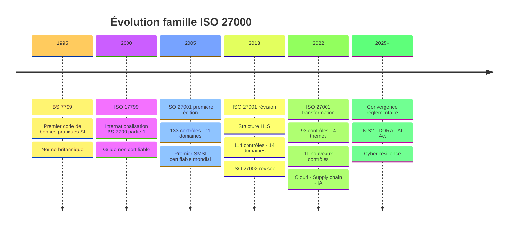
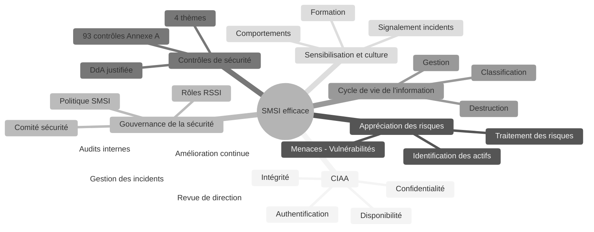
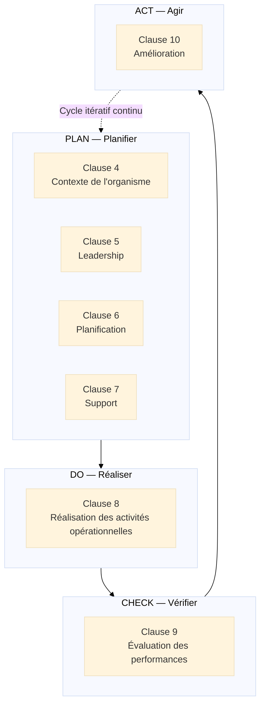
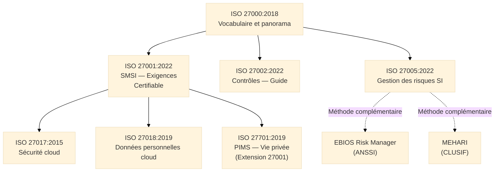
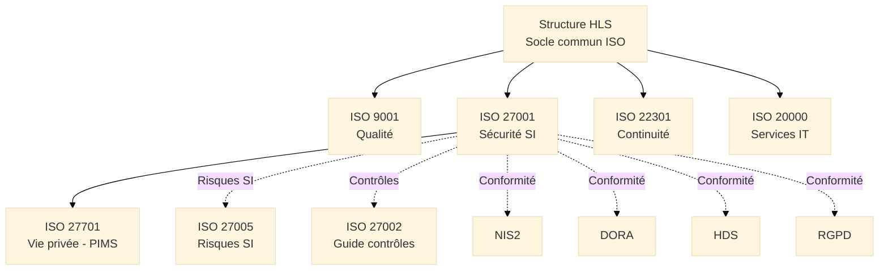
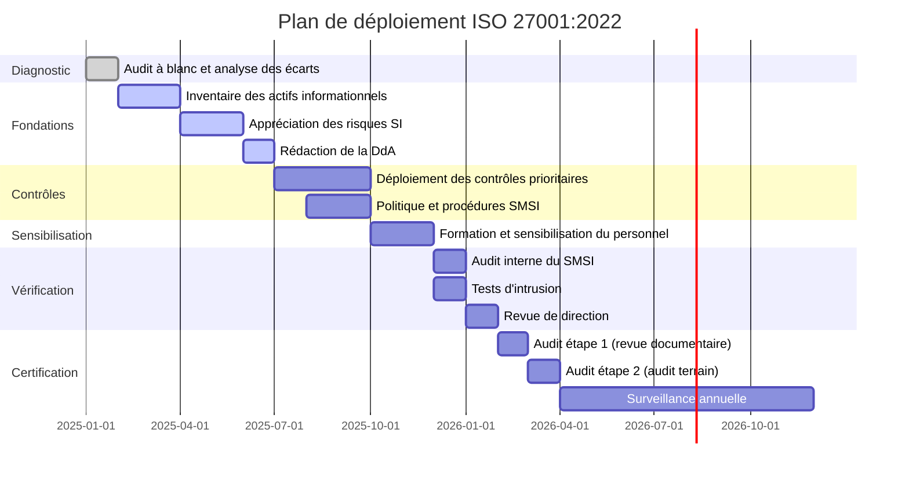

# ISO 27000 — Famille des Normes de Sécurité de l'Information

<div
  class="omny-meta"
  data-level="🟡 Intermédiaire & 🔴 Avancé"
  data-version="1.0"
  data-time="40-45 minutes">
</div>

## Introduction à la Sécurité de l'Information

!!! quote "Analogie pédagogique"
    _Imaginez le **département informatique de la Banque de France**. Ses actifs les plus précieux ne sont pas physiques : ce sont des données — données de paiements, données de politique monétaire, données de supervision bancaire. Ces données doivent être **confidentielles** (seules les personnes habilitées y accèdent), **intègres** (personne ne peut les altérer sans autorisation), **authentiques** (leur origine est vérifiable) et **disponibles** (accessibles quand les utilisateurs légitimes en ont besoin). Pour protéger ces actifs, la banque ne se contente pas d'un firewall et d'un antivirus. Elle déploie un **système complet** : politique de sécurité, classification des actifs, contrôle des accès physiques et logiques, chiffrement, audit des accès, formation du personnel, gestion des incidents, plan de continuité, audits réguliers. **ISO 27001 fonctionne exactement comme le cadre directeur de ce système** : il ne prescrit pas d'outil ou de technologie, mais il garantit que la démarche de sécurité est systématique, fondée sur les risques réels, mesurée, et continuellement améliorée — indépendamment des personnes en place ou des technologies en usage._

La **famille ISO 27000** constitue l'**écosystème normatif international de référence pour la sécurité de l'information**. Son noyau certifiable — **ISO/IEC 27001:2022** — définit les exigences d'un Système de Management de la Sécurité de l'Information[^1] (SMSI). Publié pour la première fois en 2005 (issu de BS 7799), il a connu deux révisions majeures (2013, 2022) pour rester aligné sur les évolutions des menaces et des technologies.

ISO 27000 est à la fois un standard de gouvernance et un cadre opérationnel. Il ne protège pas les systèmes d'information à la place des équipes sécurité : il garantit que l'organisation a mis en place un **processus rigoureux** pour identifier ses risques, sélectionner des contrôles adaptés, les déployer, les mesurer et les améliorer.

!!! info "Pourquoi la famille ISO 27000 est essentielle ?"
    ISO 27001 est le **seul standard international certifiable de management de la sécurité de l'information**. Avec plus de 70 000 organisations certifiées dans le monde, il constitue le référentiel de confiance reconnu par les régulateurs (RGPD, NIS2, DORA, HDS, PCI DSS), les clients et les partenaires pour démontrer la maturité d'un programme de sécurité de l'information.

<br>

---

## Pour repartir des bases

### 1. La famille ISO 27000 : un écosystème, pas un standard unique

ISO 27000 désigne une **famille de normes**, pas un standard unique. La confusion fréquente entre les numéros mérite une clarification immédiate :

| Norme | Contenu | Certifiable |
|-------|---------|-------------|
| **ISO 27000:2018** | Vocabulaire et panorama de la famille | Non |
| **ISO 27001:2022** | Exigences du SMSI — norme de certification | **Oui** |
| **ISO 27002:2022** | Guide de mise en œuvre des contrôles | Non |
| **ISO 27005:2022** | Gestion des risques SI | Non |
| **ISO 27017:2015** | Sécurité cloud (contrôles spécifiques) | Non |
| **ISO 27018:2019** | Protection des données personnelles dans le cloud | Non |
| **ISO 27701:2019** | Système de management de la vie privée (PIMS) | Oui (extension 27001) |

> Quand une organisation dit "nous sommes certifiés ISO 27000", elle est certifiée **ISO 27001**. ISO 27000 est le vocabulaire commun de la famille — elle ne se certifie pas.

### 2. La triade fondamentale : CIAA / CIA

Le fondement conceptuel de toute démarche de sécurité de l'information repose sur quatre propriétés :

**Confidentialité (C) :**  
_L'information n'est accessible qu'aux personnes, entités ou processus autorisés._  
→ Menaces : exfiltration de données, accès non autorisé, interception

**Intégrité (I) :**  
_L'exactitude et la complétude de l'information sont préservées. Elle ne peut être altérée que par des personnes autorisées._  
→ Menaces : altération de données, injection SQL, falsification de logs

**Authentification (A) :**  
_L'identité d'une entité (personne, système, message) peut être vérifiée et prouvée._  
→ Menaces : usurpation d'identité, phishing, man-in-the-middle

**Disponibilité (A) :**  
_L'information et les systèmes associés sont accessibles et utilisables à la demande par les entités autorisées._  
→ Menaces : DDoS, ransomware, pannes, suppressions accidentelles

!!! note "CIA vs CIAA"
    En anglais, le modèle de référence est la **triade CIA** (*Confidentiality, Integrity, Availability*). En France, l'**ANSSI** utilise le modèle **CIAA** qui ajoute explicitement l'**Authentification** comme propriété distincte de la confidentialité. ISO 27001 s'appuie sur la triade CIA dans sa terminologie officielle, mais intègre les mécanismes d'authentification dans ses contrôles de sécurité (Annexe A).

### 3. Un cadre fondé sur les risques, pas sur des listes de contrôles

ISO 27001 n'impose pas de liste de contrôles de sécurité à appliquer uniformément. Il impose un **processus d'appréciation des risques** qui détermine quels contrôles sont nécessaires pour chaque organisation, compte tenu de ses actifs, de ses menaces et de son contexte :

1. Identifier les actifs informationnels et leurs propriétaires
2. Identifier les menaces et vulnérabilités applicables
3. Évaluer les risques (probabilité × impact)
4. Sélectionner les contrôles appropriés parmi les 93 contrôles de l'Annexe A
5. Justifier les exclusions dans la **Déclaration d'Applicabilité**[^2] (DdA/SoA)

> Deux organisations dans le même secteur peuvent avoir des SMSI très différents parce que leurs actifs, leurs menaces et leur tolérance au risque diffèrent. **C'est une force, pas une faiblesse** : ISO 27001 garantit la rigueur du processus, pas l'uniformité des solutions.

<br>

---

## Historique et évolutions

### Origines de la famille ISO 27000

Avant ISO 27001, la sécurité de l'information manquait d'un cadre international certifiable :

- Le Royaume-Uni avait développé **BS 7799** (1995) : premier code de bonnes pratiques SI
- BS 7799-2 (1998) : première spécification certifiable de SMSI
- Ces standards restaient nationaux, peu reconnus hors du Royaume-Uni

!!! note "Besoin identifié"
    Créer un **standard international certifiable** permettant à toute organisation de démontrer sa maturité en sécurité de l'information à ses clients, régulateurs et partenaires, avec une terminologie et une méthodologie communes.

### Les versions majeures d'ISO 27001

=== "ISO/IEC 27001:2005 — Fondation"

    **Contexte :**  
    _Conversion de BS 7799-2 en standard international, première norme certifiable mondiale de SMSI._

    **Innovations majeures :**

    - [x] Premier SMSI certifiable reconnu internationalement
    - [x] **133 contrôles** organisés en 11 domaines (Annexe A)
    - [x] Approche par les risques : le SMSI doit être adapté au contexte
    - [x] Cycle PDCA[^3] appliqué à la sécurité de l'information

    > **Limite principale :** Structure non alignée avec les autres normes ISO de management, surcharge documentaire, terminologie complexe.

=== "ISO/IEC 27001:2013 — Modernisation"

    **Contexte :**  
    _Refonte majeure alignée sur la Structure HLS[^4] naissante, réduction des contrôles, focus sur la gestion des risques._

    **Innovations majeures :**

    - [x] **Structure HLS** (avant-garde : ISO 27001 est parmi les premières normes à l'adopter)
    - [x] **114 contrôles** en 14 domaines (Annexe A) — réduction et rationalisation
    - [x] Appréciation des risques plus flexible (pas de méthode imposée)
    - [x] Suppression du cycle PDCA explicite (intégré dans la structure HLS)
    - [x] Meilleure intégration avec **ISO 9001:2015**

=== "ISO/IEC 27001:2022 — Transformation"

    **Contexte :**  
    _Révision majeure intégrant les nouvelles menaces (cloud, supply chain, télétravail, IA) et modernisant l'Annexe A._

    **Innovations majeures :**

    - [x] **93 contrôles** en **4 thèmes** (vs 114 en 14 domaines) — nouvelle taxonomie
    - [x] **11 nouveaux contrôles** couvrant cloud security, threat intelligence, ICT supply chain, masquage de données, DLP, monitoring web
    - [x] **Attributs** sur les contrôles (type, propriétés, concepts cybersécurité, capacités opérationnelles, domaines de sécurité)
    - [x] Alignement avec **NIST CSF**, **CIS Controls** et les référentiels sectoriels
    - [x] Meilleure prise en compte du **télétravail**, de la **supply chain** et du **cloud**

    > **Impact :** Les organisations certifiées ISO 27001:2013 ont jusqu'à octobre 2025 pour migrer vers la version 2022.

### Timeline de l'évolution de la famille ISO 27000


_La révision 2022 marque le passage d'une organisation des contrôles par **domaines techniques** à une organisation par **thèmes fonctionnels**, facilitant leur attribution et leur pilotage._

<br>

---

## Les 7 concepts fondateurs

ISO 27001:2022 repose sur **7 concepts fondateurs** qui structurent la philosophie du management de la sécurité de l'information.

!!! note "Des concepts, pas des étapes"
    Ces 7 concepts définissent les **caractéristiques fondamentales** d'un SMSI robuste. Certains sont partagés avec ISO 9001 ou ISO 14001 (amélioration continue, leadership), d'autres sont propres à la sécurité de l'information (CIAA, contrôles de l'Annexe A, DdA).

### Vue d'ensemble


_La **CIAA** est la boussole : chaque contrôle de sécurité sert au moins une des quatre propriétés. La **DdA** est le document pivot qui relie l'appréciation des risques aux contrôles sélectionnés et aux exclusions justifiées._

### Les 7 concepts expliqués

!!! note "Ci-dessous les 4 premiers concepts"

=== "1️⃣ CIAA — Les quatre propriétés de la sécurité"

    **Toute mesure de sécurité protège au moins l'une des quatre propriétés fondamentales de l'information.**

    Chaque propriété est menacée par des vecteurs d'attaque spécifiques :

    | Propriété | Menaces principales | Contrôles types |
    |-----------|---------------------|-----------------|
    | **Confidentialité** | Exfiltration, insider threat, interception | Chiffrement, contrôle d'accès, DLP |
    | **Intégrité** | Altération, injection, falsification | Signatures numériques, journalisation, hashing |
    | **Authentification** | Usurpation, phishing, MitM | MFA, PKI, protocoles d'authentification forte |
    | **Disponibilité** | DDoS, ransomware, pannes | Redondance, PRA, sauvegardes, filtrage |

    > En pratique, un incident de sécurité affecte souvent plusieurs propriétés simultanément. Un ransomware compromet la disponibilité (chiffrement des données), l'intégrité (les données sont corrompues) et parfois la confidentialité (exfiltration avant chiffrement — double extorsion).

=== "2️⃣ Appréciation et traitement des risques SI"

    **Le SMSI est dimensionné sur les risques réels de l'organisation, pas sur une liste de contrôles générique.**

    Le processus d'appréciation des risques comprend :

    - **Identification des actifs informationnels** :  
      _Données clients, propriété intellectuelle, systèmes critiques, codes source, contrats, données RH._

    - **Identification des menaces et vulnérabilités** :  
      _Menaces : cyberattaques, erreurs humaines, catastrophes naturelles, défaillances techniques. Vulnérabilités : logiciels non patchés, mots de passe faibles, absence de chiffrement, accès non révoqués._

    - **Évaluation des risques** :  
      _Probabilité × Impact = Niveau de risque. La méthode est libre (ISO 27005, EBIOS RM[^5], MEHARI[^6]...) mais doit être documentée et reproductible._

    - **Traitement des risques** :  
      _Réduire (contrôles de sécurité), transférer (assurance cyber), accepter (risque résiduel sous le seuil d'acceptation), éviter (renoncer à l'activité)._

    > L'appréciation des risques doit être **renouvelée périodiquement** et lors de tout changement significatif : nouveau système, nouvel actif, nouvelle menace, réorganisation.

=== "3️⃣ Gouvernance de la sécurité de l'information"

    **ISO 27001 exige une structure de gouvernance claire, pas uniquement des mesures techniques.**

    La gouvernance du SMSI comprend :

    - **Politique de sécurité de l'information** :  
      _Document signé par la direction exprimant les engagements, les objectifs et le cadre de la sécurité de l'information._

    - **Rôle du RSSI**[^7] :  
      _Responsable de la conception, de la mise en œuvre et de l'amélioration du SMSI. ISO 27001 n'impose pas le titre, mais exige que les rôles et responsabilités soient formellement attribués._

    - **Comité de sécurité** :  
      _Instance de gouvernance réunissant la direction, le RSSI et les directions métiers pour les décisions stratégiques de sécurité._

    - **Propriétaires d'actifs** :  
      _Chaque actif informationnel doit avoir un propriétaire responsable de sa classification, de sa protection et de son cycle de vie._

=== "4️⃣ Contrôles de sécurité et Annexe A"

    **L'Annexe A d'ISO 27001:2022 liste 93 contrôles de sécurité organisés en 4 thèmes.**

    Les 4 thèmes de l'Annexe A (ISO 27001:2022) :

    === "Organisationnels (37 contrôles)"

        _Politiques, gestion des actifs, classification, gestion des accès, relations fournisseurs, gestion des incidents, conformité, continuité._

        Exemples de nouveaux contrôles 2022 :
        - Intelligence sur les menaces (*Threat Intelligence*)
        - Sécurité de la chaîne d'approvisionnement ICT
        - Continuité des services cloud
        - Sécurité de l'information pour l'utilisation des services cloud

    === "Personnes (8 contrôles)"

        _Conditions d'embauche, sensibilisation, formation, responsabilités, télétravail._

        Exemples :
        - Responsabilités en matière de sécurité de l'information
        - Sensibilisation, formation et éducation
        - Processus disciplinaire
        - Télétravail

    === "Physiques (14 contrôles)"

        _Périmètres de sécurité, contrôle d'accès physique, protection des équipements, sécurité du câblage._

        Exemples :
        - Périmètres de sécurité physique
        - Bureaux clairs et écrans vides (*Clear desk, clear screen*)
        - Sécurité physique des équipements hors site

    === "Technologiques (34 contrôles)"

        _Contrôle des accès logiques, cryptographie, sécurité des systèmes, réseaux, développement sécurisé._

        Exemples de nouveaux contrôles 2022 :
        - Masquage de données (*Data masking*)
        - Prévention des fuites de données (*DLP*)
        - Surveillance des activités web et de messagerie
        - Gestion de la configuration
        - Suppression sécurisée de l'information

!!! note "Ci-dessous les 3 derniers concepts"

=== "5️⃣ Déclaration d'Applicabilité (DdA)"

    **La DdA est le document pivot du SMSI : elle justifie quels contrôles sont appliqués, pourquoi, et quels contrôles sont exclus.**

    La DdA[^2] (*Statement of Applicability / SoA*) est un document obligatoire d'ISO 27001. Pour chacun des 93 contrôles de l'Annexe A, elle indique :

    - **Inclus ou exclu** : le contrôle est-il applicable à l'organisation ?
    - **Justification de l'inclusion** : résultat de l'appréciation des risques, exigence légale, exigence contractuelle, bonne pratique
    - **Statut de mise en œuvre** : planifié, en cours, mis en œuvre
    - **Justification de l'exclusion** : pourquoi ce contrôle n'est pas applicable (avec démonstration que son exclusion ne compromet pas la sécurité)

    > La DdA est **le document le plus demandé par les auditeurs de certification**. Elle prouve le lien entre l'appréciation des risques et les contrôles sélectionnés. Une DdA sans justifications rigoureuses est un constat d'écart immédiat.

=== "6️⃣ Cycle de vie de l'information"

    **La sécurité de l'information couvre toutes les étapes du cycle de vie des données : création, traitement, stockage, transmission, archivage et destruction.**

    - **Classification de l'information**[^8] :  
      _Classer chaque information selon sa sensibilité (Public, Interne, Confidentiel, Secret) et appliquer les mesures de protection correspondantes._

    - **Gestion des actifs informationnels** :  
      _Inventaire des actifs, désignation des propriétaires, étiquetage, gestion des supports._

    - **Transfert de l'information** :  
      _Protéger l'information lors de son transfert (chiffrement en transit, règles pour les e-mails, les supports amovibles, les accès distants)._

    - **Destruction sécurisée** :  
      _Supprimer ou détruire l'information de manière irréversible en fin de vie (dégaussage, destruction physique, suppression cryptographique)._

=== "7️⃣ Sensibilisation et culture de sécurité"

    **Les contrôles techniques ne suffisent pas. La sécurité de l'information dépend des comportements humains.**

    ISO 27001 exige :

    - **Sensibilisation** :  
      _Tout le personnel concerné comprend la politique de sécurité, les menaces courantes (phishing, ingénierie sociale, mots de passe faibles), ses responsabilités._

    - **Formation spécialisée** :  
      _Les personnes avec des responsabilités de sécurité spécifiques (RSSI, administrateurs, développeurs) reçoivent une formation adaptée à leurs rôles._

    - **Culture de signalement** :  
      _Les incidents, failles et comportements suspects sont signalés sans crainte. Un incident signalé rapidement a un impact bien moindre qu'un incident découvert tard._

    !!! warning "L'humain : premier vecteur d'attaque"
        Le vecteur d'attaque le plus efficace reste l'ingénierie sociale et le phishing. 90% des cyberattaques réussies commencent par une erreur humaine. Les contrôles techniques de l'Annexe A ne peuvent pas compenser une culture de sécurité inexistante.

<br>

---

## La structure HLS et les clauses opérationnelles

ISO 27001:2022 adopte la **Structure HLS**[^4] en 10 clauses. Les clauses 4 à 10 sont les clauses opérationnelles du SMSI.

### Le cycle PDCA appliqué aux clauses


_La clause 8 d'ISO 27001 est plus concise que celle d'ISO 9001 ou ISO 20000 dans le texte normatif, mais elle est la plus dense en pratique : elle englobe l'appréciation des risques, le traitement des risques et la DdA — trois processus qui représentent l'essentiel du travail de mise en œuvre._

### Détail des clauses

??? abstract "Clause 4 — Contexte de l'organisme"

    **Comprendre le contexte dans lequel le SMSI doit protéger l'information.**

    **4.1 — Compréhension de l'organisme et de son contexte :**  
    _Identifier les enjeux internes et externes pertinents pour le SMSI : maturité IT, culture de sécurité, contraintes réglementaires (RGPD, HDS, PCI DSS, NIS2), menaces sectorielles, incidents passés._

    **4.2 — Compréhension des parties intéressées :**  
    _Clients (protection de leurs données), régulateurs (conformité), partenaires (sécurité des échanges), actionnaires (protection des actifs), collaborateurs (confidentialité des données RH)._

    **4.3 — Périmètre du SMSI :**  
    _Définir précisément quels systèmes, quelles données, quels sites et quelles entités sont couverts par la certification. Le périmètre doit être justifié et cohérent : exclure arbitrairement des systèmes interconnectés crée des angles morts._

    **4.4 — SMSI :**  
    _Établir, mettre en œuvre, maintenir et améliorer continuellement le SMSI._

??? abstract "Clause 5 — Leadership"

    **La direction est responsable de la sécurité de l'information, pas uniquement le RSSI.**

    **5.1 — Leadership et engagement :**  
    _La direction alloue le budget sécurité, valide la politique, participe aux revues de direction, et traite la sécurité de l'information comme un risque d'entreprise — pas uniquement un risque technique._

    **5.2 — Politique de sécurité de l'information :**  
    _Établir une politique documentée, signée par la direction, incluant les objectifs de sécurité, les exigences de conformité et l'engagement d'amélioration continue._

    **5.3 — Rôles, responsabilités et autorités :**  
    _Désigner formellement le RSSI[^7] (ou équivalent), les propriétaires d'actifs, les responsables de processus sécurité, avec des autorités et des responsabilités clairement définies._

    !!! tip "La sécurité comme risque d'entreprise"
        Les organisations les plus matures traitent la sécurité de l'information dans les mêmes comités qui traitent les risques financiers, légaux et opérationnels. C'est une posture que les auditeurs ISO 27001 expérimentés savent identifier dès les premiers entretiens.

??? abstract "Clause 6 — Planification"

    **Planifier le SMSI en fondant les décisions sur une appréciation rigoureuse des risques.**

    **6.1.1 — Généralités :**  
    _Identifier les risques et opportunités qui pourraient affecter la capacité du SMSI à atteindre ses objectifs._

    **6.1.2 — Appréciation des risques de sécurité :**  
    _Définir et appliquer un processus d'appréciation des risques SI : identification, analyse, évaluation. Conserver les résultats sous forme d'informations documentées._

    **6.1.3 — Traitement des risques de sécurité :**  
    _Sélectionner les options de traitement appropriées pour chaque risque. Déterminer les contrôles de l'Annexe A nécessaires. Produire la DdA[^2]. Produire le plan de traitement des risques._

    **6.2 — Objectifs de sécurité de l'information :**  
    _Établir des objectifs mesurables cohérents avec la politique de sécurité._

    ```mermaid
    ---
    config:
      theme: "base"
    ---
    flowchart LR
        ACT["Inventaire\ndes actifs"] --> MEN["Identification\ndes menaces - vulnérabilités"]
        MEN --> EVA["Évaluation\ndes risques"]
        EVA --> TRT{"Traitement\ndu risque"}
        TRT -->|Réduire| CTR["Sélection\ncontrôles Annexe A"]
        TRT -->|Transférer| ASS["Assurance\ncyber"]
        TRT -->|Accepter| DOC["Acceptation\ndocumentée"]
        TRT -->|Éviter| REN["Abandon\nde l'activité"]
        CTR --> DDA["Déclaration\nd'Applicabilité (DdA)"]
        DDA --> PTR["Plan de traitement\ndes risques"]
    ```
    _Ce flux illustre le processus central d'ISO 27001. La DdA est le livrable qui relie l'appréciation des risques aux contrôles déployés. Elle est examinée en détail lors de chaque audit de certification._

??? abstract "Clause 7 — Support"

    **Fournir les ressources humaines, techniques et documentaires nécessaires au SMSI.**

    **7.1 — Ressources :**  
    _Budget sécurité, personnel qualifié, outils (SIEM[^9], EDR[^10], PAM[^11], scanner de vulnérabilités), connaissances organisationnelles en sécurité._

    **7.2 — Compétences :**  
    _Identifier les compétences requises pour chaque rôle du SMSI. Vérifier leur acquisition. Conserver les preuves : certifications (CISSP, CISM, CEH, ISO 27001 Lead Implementer/Auditor), formations, expériences._

    **7.3 — Sensibilisation :**  
    _Tout le personnel comprend la politique de sécurité, les menaces courantes et ses obligations en matière de sécurité de l'information._

    **7.4 — Communication :**  
    _Définir les communications internes (remontée d'incidents, alertes de sécurité) et externes (communication avec les autorités de contrôle en cas d'incident, notification RGPD)._

    **7.5 — Informations documentées :**  
    _Créer, maintenir et maîtriser les informations documentées du SMSI : politique, résultats de l'appréciation des risques, DdA, plan de traitement des risques, procédures._

??? abstract "Clause 8 — Réalisation des activités opérationnelles"

    **Mettre en œuvre et opérer le SMSI au quotidien.**

    **8.1 — Planification et maîtrise opérationnelles :**  
    _Mettre en œuvre les processus nécessaires au SMSI et maîtriser les changements qui pourraient affecter la sécurité._

    **8.2 — Appréciation des risques de sécurité de l'information :**  
    _Réaliser l'appréciation des risques à intervalles planifiés et lors de changements significatifs. Conserver les résultats._

    **8.3 — Traitement des risques de sécurité de l'information :**  
    _Mettre en œuvre le plan de traitement des risques. Conserver les résultats du traitement._

    > Les contrôles de l'Annexe A sont déployés dans le cadre de la clause 8. ISO 27001 ne prescrit pas comment les déployer techniquement — ISO 27002 fournit les lignes directrices de mise en œuvre pour chaque contrôle.

??? abstract "Clause 9 — Évaluation des performances"

    **Mesurer, analyser et évaluer les performances du SMSI.**

    **9.1 — Surveillance, mesure, analyse et évaluation :**  
    _Définir les métriques de sécurité : nombre d'incidents, délai de détection, délai de réponse, taux de conformité aux politiques, résultats des tests de vulnérabilités, couverture des sauvegardes._

    **9.2 — Audit interne :**  
    _Réaliser des audits internes du SMSI à intervalles planifiés. Les auditeurs internes doivent être indépendants des activités auditées._

    **9.3 — Revue de direction :**  
    _La direction revoit le SMSI en intégrant les résultats d'audits, les incidents de sécurité, les retours des parties intéressées, les nouvelles menaces et les résultats de l'appréciation des risques._

    | Métriques de sécurité importantes | Description |
    |------------------------------------|-------------|
    | MTTD (*Mean Time to Detect*) | Délai moyen entre occurrence et détection d'un incident |
    | MTTR (*Mean Time to Respond*) | Délai moyen entre détection et confinement de l'incident |
    | Taux de patch | % de systèmes patchés dans les délais définis par politique |
    | Couverture MFA | % de comptes soumis à authentification multi-facteur |
    | Taux de phishing simulé | % d'employés cliquant sur des liens de phishing simulés |

??? abstract "Clause 10 — Amélioration"

    **Améliorer continuellement le SMSI sur la base des incidents, des audits et des nouvelles menaces.**

    **10.1 — Non-conformité et action corrective :**  
    _Face à une non-conformité (contrôle non appliqué, politique non respectée, incident non traité) : analyser la cause, corriger, vérifier l'efficacité._

    **10.2 — Amélioration continue :**  
    _Améliorer en permanence la pertinence, l'adéquation et l'efficacité du SMSI. Les incidents de sécurité, les résultats des tests d'intrusion[^12] et les nouvelles menaces sont les principales sources d'amélioration._

<br>

---

## La famille ISO 27000 en détail

### Les normes complémentaires


_ISO 27001 est le **socle certifiable**. ISO 27002 fournit les lignes directrices de mise en œuvre des contrôles. ISO 27005 guide l'appréciation des risques. ISO 27701 étend le SMSI à la protection de la vie privée (RGPD)._

### Articulation avec les réglementations

| Réglementation | Domaine | Articulation avec ISO 27001 |
|----------------|---------|----------------------------|
| **RGPD** | Protection des données personnelles | ISO 27001 couvre la sécurité des données ; ISO 27701 étend au RGPD |
| **NIS2** | Sécurité des OSE et OIV | ISO 27001 satisfait directement les mesures techniques NIS2 |
| **DORA** | Résilience opérationnelle numérique (finance) | ISO 27001 + ISO 22301 couvrent les exigences ICT de DORA |
| **HDS** | Hébergement de données de santé (France) | ISO 27001 est un prérequis de la certification HDS |
| **PCI DSS** | Sécurité des données de paiement | Compatible ISO 27001, contrôles partiellement alignés |
| **SecNumCloud** | Cloud souverain (ANSSI) | ISO 27001 requis, niveau d'exigence supérieur |

### Positionnement d'ISO 27001 dans l'écosystème



<br>

---

## Bénéfices de l'approche ISO 27001

### Pour les organisations

<div class="grid cards" markdown>

-   :lucide-check-circle:{ .lg .middle } **Réduction de l'exposition aux cyberrisques**

    ---
    Le processus d'appréciation des risques identifie les vulnérabilités avant qu'elles soient exploitées. Les contrôles déployés réduisent la surface d'attaque de manière systématique.

-   :lucide-trending-up:{ .lg .middle } **Conformité réglementaire multi-cadres**

    ---
    Un SMSI ISO 27001 opérationnel fournit la base documentaire et les preuves nécessaires pour RGPD, NIS2, DORA, HDS et PCI DSS — réduisant les coûts de conformité multi-réglementaire.

-   :lucide-shield-check:{ .lg .middle } **Signal de confiance commercial**

    ---
    La certification ISO 27001 est devenue un prérequis dans de nombreux appels d'offres, particulièrement dans les secteurs finance, santé, défense et services numériques.

-   :lucide-refresh-cw:{ .lg .middle } **Réponse structurée aux incidents**

    ---
    Les procédures de gestion des incidents définies dans le SMSI garantissent une réponse coordonnée, documentée et réglementairement conforme lors d'un incident de sécurité.

</div>

<div class="grid cards" markdown>

-   :lucide-handshake:{ .lg .middle } **Réduction des primes d'assurance cyber**

    ---
    Les assureurs intègrent systématiquement la certification ISO 27001 dans leurs questionnaires de souscription. Elle permet d'accéder à des couvertures supérieures à des primes réduites.

-   :lucide-award:{ .lg .middle } **Visibilité sur le patrimoine informationnel**

    ---
    L'inventaire des actifs informationnels exigé par la norme révèle systématiquement des données critiques non protégées et des accès non maîtrisés ignorés avant la démarche.

</div>

<br>

---

## Mise en œuvre pratique

### Étapes clés de déploiement



### Écueils à éviter

!!! warning "Pièges courants"

    **SMSI réduit à un exercice documentaire :**  
    _Produire des politiques et des procédures sans déployer les contrôles techniques correspondants. Les auditeurs passent systématiquement des documents aux preuves d'implémentation réelle : logs, configurations, captures d'écran, enregistrements._

    **DdA déconnectée de l'appréciation des risques :**  
    _Inclure des contrôles par défaut sans les relier à des risques identifiés, ou exclure des contrôles sans justification. La DdA doit être le reflet fidèle des décisions prises lors du traitement des risques._

    **Périmètre incohérent :**  
    _Exclure des systèmes interconnectés avec le périmètre certifié crée des angles morts. Si un système non certifié peut accéder aux données du périmètre, il est dans le périmètre._

    **Sensibilisation annuelle et unique :**  
    _Une session de sensibilisation par an ne crée pas une culture de sécurité. La sensibilisation doit être continue, variée (phishing simulé, rappels ciblés, e-learning) et mesurée._

    **Gestion des incidents sans log centralisé :**  
    _Sans SIEM[^9] ou centralisation des logs, la détection des incidents est aléatoire et la reconstitution post-incident impossible. C'est une lacune critique fréquemment relevée en audit._

### Facteurs clés de succès

- [x] **Périmètre cohérent** et justifié, incluant tous les systèmes interconnectés
- [x] **Inventaire des actifs exhaustif** avant toute appréciation des risques
- [x] **Appréciation des risques rigoureuse** avec une méthode documentée et reproductible
- [x] **DdA justifiée** pour chaque contrôle inclus et exclu
- [x] **Programme de sensibilisation continu**, pas uniquement annuel
- [x] **Tests d'intrusion** réguliers pour valider l'efficacité des contrôles techniques
- [x] **Gestion des incidents formalisée** avec des preuves traçables et des délais respectés

<br>

---

## Perspectives et évolutions

### ISO 27001 face aux enjeux émergents

**Intelligence Artificielle :**  
_Les systèmes d'IA introduisent de nouveaux risques pour la sécurité de l'information : hallucinations exposant des données sensibles, empoisonnement des données d'entraînement, extraction de données via prompt injection, biais dans les décisions de sécurité automatisée. L'ISO TC 27 travaille sur des orientations spécifiques, en cohérence avec l'AI Act européen._

**Sécurité de la chaîne d'approvisionnement :**  
_Les attaques via les fournisseurs (SolarWinds, XZ Utils, Codecov) ont révélé la fragilité des chaînes d'approvisionnement logicielles. ISO 27001:2022 a introduit un contrôle spécifique (A.5.19-5.23) sur la gestion de la sécurité des fournisseurs ICT. Les organisations doivent étendre leur SMSI aux tiers critiques._

**Chiffrement post-quantique :**  
_L'émergence de l'informatique quantique menace les algorithmes de chiffrement asymétriques actuels (RSA, ECC). Le NIST a standardisé les premiers algorithmes post-quantiques en 2024. Les SMSI doivent anticiper cette migration cryptographique dans leur gestion des risques._

**Convergence IT/OT :**  
_La convergence des systèmes informatiques (IT) et des systèmes opérationnels (OT — automates industriels, SCADA) crée de nouveaux vecteurs d'attaque. ISO 27001 s'étend progressivement aux environnements OT, en cohérence avec IEC 62443._

### Convergence réglementaire européenne

- **NIS2** :  
  _La directive exige des mesures de sécurité pour les OSE et les entités importantes dans 18 secteurs. Un SMSI ISO 27001 satisfait directement les mesures techniques et organisationnelles exigées par l'article 21 de NIS2._

- **DORA** :  
  _ISO 27001 couvre les exigences ICT de DORA pour les entités financières. La combinaison ISO 27001 + ISO 22301 répond à l'ensemble des exigences de résilience opérationnelle numérique._

- **AI Act** :  
  _Les exigences de sécurité pour les systèmes d'IA à haut risque s'articulent naturellement avec un SMSI ISO 27001 mature, notamment pour la journalisation, la traçabilité et la gestion des incidents._

- **Cyber Resilience Act (CRA)** :  
  _Le règlement européen sur la résilience cyber des produits numériques impose des exigences de sécurité dès la conception et tout au long du cycle de vie. ISO 27001 complété par des pratiques de développement sécurisé (SDLC[^13]) répond à ces exigences._

<br>

---

## Conclusion

!!! quote "La sécurité de l'information n'est pas un état à atteindre. C'est un processus à maintenir."
    ISO 27001:2022 incarne une vérité que tout professionnel de la sécurité connaît : aucun système n'est définitivement sécurisé. Les menaces évoluent, les technologies changent, les organisations se transforment. La certification ISO 27001 n'atteste pas qu'une organisation est invulnérable — elle atteste que l'organisation a mis en place un **processus rigoureux, structuré et continuellement amélioré** pour gérer ses risques de sécurité de l'information.

    La Déclaration d'Applicabilité est le document qui résume le mieux l'esprit de la norme : chaque contrôle de sécurité y est présent ou absent pour une raison documentée, reliée à un risque identifié. Cette transparence est à la fois une contrainte (justifier ses choix) et une force (démontrer que les décisions sont fondées, pas arbitraires).

    Dans le contexte réglementaire européen actuel — NIS2 pour les secteurs essentiels, DORA pour la finance, HDS pour la santé, AI Act pour les systèmes d'IA — ISO 27001 n'est plus seulement un avantage compétitif. C'est le **dénominateur commun** des exigences de sécurité de l'information imposées par ces réglementations. Une organisation certifiée ISO 27001 dispose d'une base documentaire et opérationnelle qui facilite simultanément la conformité à plusieurs cadres réglementaires.

    > La prochaine étape naturelle est d'explorer comment ISO 27001 s'articule avec **EBIOS Risk Manager** (méthode de gestion des risques SI de l'ANSSI) et **ISO 27701** (extension au management de la vie privée) pour construire un dispositif complet de protection de l'information conforme aux exigences RGPD.

<br>

---

## Ressources complémentaires

### Documents officiels ISO — Famille 27000

- **ISO/IEC 27000:2018** — Aperçu et vocabulaire
- **ISO/IEC 27001:2022** — Exigences du SMSI (certification)
- **ISO/IEC 27002:2022** — Contrôles de sécurité — Guide de mise en œuvre
- **ISO/IEC 27005:2022** — Gestion des risques liés à la sécurité de l'information
- **ISO/IEC 27017:2015** — Contrôles de sécurité pour les services cloud
- **ISO/IEC 27018:2019** — Protection des données personnelles dans le cloud
- **ISO/IEC 27701:2019** — Système de management de la vie privée

### Méthodes complémentaires

- **EBIOS Risk Manager** : Méthode ANSSI d'appréciation des risques SI (France)
- **MEHARI** : Méthode CLUSIF de gestion des risques SI (France)
- **NIST CSF 2.0** : Cybersecurity Framework (USA)

### Réglementations clés

- **NIS2** : Directive (UE) 2022/2555
- **DORA** : Règlement (UE) 2022/2554
- **RGPD** : Règlement (UE) 2016/679
- **AI Act** : Règlement (UE) 2024/1689

### Certifications professionnelles associées

- **ISO 27001 Lead Implementer** : PECB, BSI
- **ISO 27001 Lead Auditor** : PECB, BSI
- **CISSP** : (ISC)²
- **CISM** : ISACA
- **CEH** : EC-Council

### Organismes de référence

- **ANSSI** : Agence Nationale de la Sécurité des Systèmes d'Information
- **CLUSIF** : Club de la Sécurité de l'Information Français
- **AFNOR** : Association Française de Normalisation
- **ENISA** : Agence de l'Union Européenne pour la Cybersécurité


[^1]: Le **SMSI** (*Système de Management de la Sécurité de l'Information*) est l'ensemble des politiques, processus, procédures, ressources et activités qu'une organisation met en place pour protéger ses actifs informationnels contre les risques de sécurité, de manière systématique, mesurable et continuellement améliorée.
[^2]: La **DdA** (*Déclaration d'Applicabilité*, ou *SoA — Statement of Applicability* en anglais) est un document obligatoire d'ISO 27001 qui liste les 93 contrôles de l'Annexe A, indique pour chacun s'il est inclus ou exclu du SMSI, et justifie cette décision (risques identifiés, exigences légales, bonnes pratiques). C'est le document de référence qui relie l'appréciation des risques aux contrôles déployés.
[^3]: Le **cycle PDCA** (*Plan-Do-Check-Act*) est le modèle itératif d'amélioration continue structurant les systèmes de management. Dans ISO 27001:2013, il était explicitement mentionné. Dans la version 2022, il est intégré à la Structure HLS sans être nommé explicitement.
[^4]: La **Structure HLS** (*High Level Structure*) est le cadre commun de 10 clauses imposé par l'ISO à toutes ses normes de systèmes de management depuis 2012, facilitant l'intégration de plusieurs normes (ISO 27001, ISO 9001, ISO 22301, ISO 20000) dans un système de management unifié.
[^5]: **EBIOS Risk Manager** (*Expression des Besoins et Identification des Objectifs de Sécurité*) est la méthode française de gestion des risques SI publiée et maintenue par l'ANSSI. Elle est basée sur l'analyse de scénarios de risques et est reconnue comme méthode de référence en France et par de nombreuses administrations européennes.
[^6]: **MEHARI** (*Méthode Harmonisée d'Analyse des Risques*) est la méthode de gestion des risques SI développée par le CLUSIF. Elle fournit une base de connaissances des risques et des contrôles, et est utilisée notamment dans le secteur bancaire et les grandes entreprises françaises.
[^7]: Le **RSSI** (*Responsable de la Sécurité des Systèmes d'Information*, ou *CISO — Chief Information Security Officer* en anglais) est le responsable de la définition, de la mise en œuvre et de la supervision de la politique de sécurité de l'information d'une organisation. Son positionnement hiérarchique (rattachement à la DSI vs rattachement direct à la direction générale) a un impact direct sur son indépendance et son efficacité.
[^8]: La **classification de l'information** est le processus qui consiste à attribuer à chaque information un niveau de sensibilité (ex : Public, Interne, Confidentiel, Secret) et à définir les règles de protection correspondantes : contrôles d'accès, chiffrement, restrictions de diffusion, conditions de destruction. C'est un prérequis indispensable à toute politique de sécurité efficace.
[^9]: Un **SIEM** (*Security Information and Event Management*) est un outil qui collecte, agrège et analyse en temps réel les journaux d'événements (*logs*) de l'ensemble des systèmes d'information pour détecter les incidents de sécurité, les anomalies comportementales et les tentatives d'intrusion. Exemples : Splunk, IBM QRadar, Microsoft Sentinel, Elastic SIEM.
[^10]: Un **EDR** (*Endpoint Detection and Response*) est un outil de sécurité qui surveille en permanence les endpoints (postes de travail, serveurs, appareils mobiles) pour détecter les comportements malveillants, les indicateurs de compromission et permettre une réponse rapide aux incidents. Exemples : CrowdStrike Falcon, SentinelOne, Microsoft Defender for Endpoint.
[^11]: Un **PAM** (*Privileged Access Management*) est une solution de gestion des accès à privilèges qui contrôle, surveille et audite les accès des comptes administrateurs et des comptes à hauts privilèges aux systèmes critiques. Il est considéré comme un contrôle de sécurité prioritaire pour prévenir les mouvements latéraux lors d'une compromission.
[^12]: Un **test d'intrusion** (*penetration test* ou *pentest*) est une évaluation de sécurité consistant à simuler des attaques réelles contre les systèmes d'information d'une organisation, avec son autorisation, pour identifier les vulnérabilités exploitables avant qu'un attaquant réel ne le fasse. Il se distingue d'un scan de vulnérabilités automatisé par sa dimension humaine et sa profondeur d'analyse.
[^13]: Le **SDLC sécurisé** (*Secure Software Development Lifecycle*) désigne l'intégration des pratiques de sécurité à chaque étape du cycle de développement logiciel : analyse des exigences de sécurité, conception sécurisée, revue de code, tests de sécurité (SAST, DAST), déploiement sécurisé et surveillance post-déploiement. Il est au cœur des exigences du Cyber Resilience Act.

<br>

---

## Conclusion

!!! quote "Ce qu'il faut retenir"
    Les normes et référentiels ne sont pas des contraintes administratives, mais des cadres structurants. Ils garantissent que la cybersécurité s'aligne sur les objectifs métiers de l'organisation et offre une assurance raisonnable face aux risques.

> [Retour à l'index de la gouvernance →](../../index.md)
