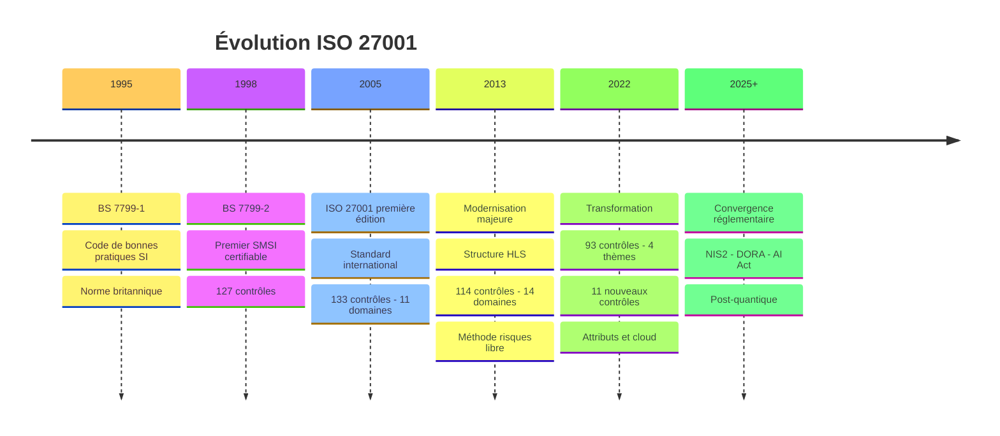
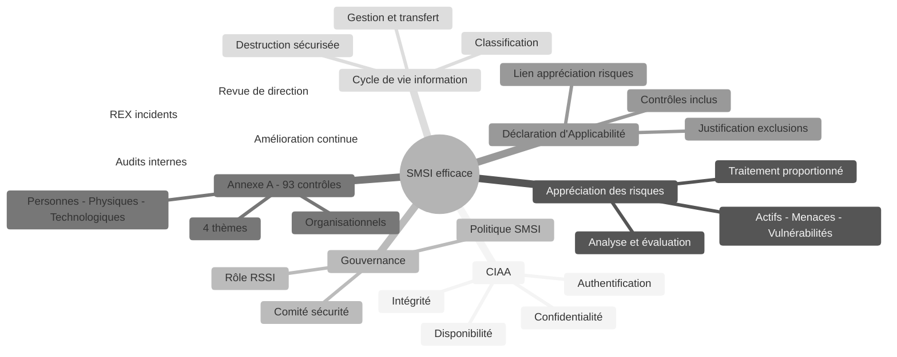
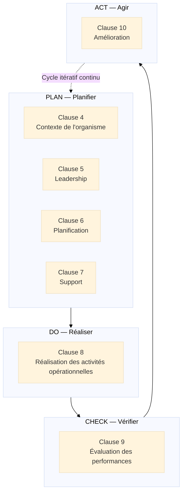
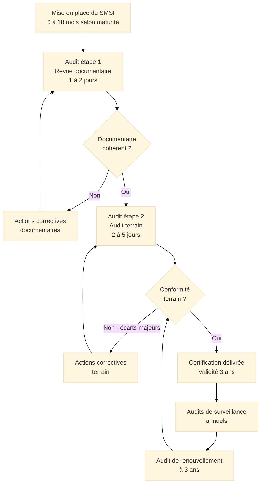
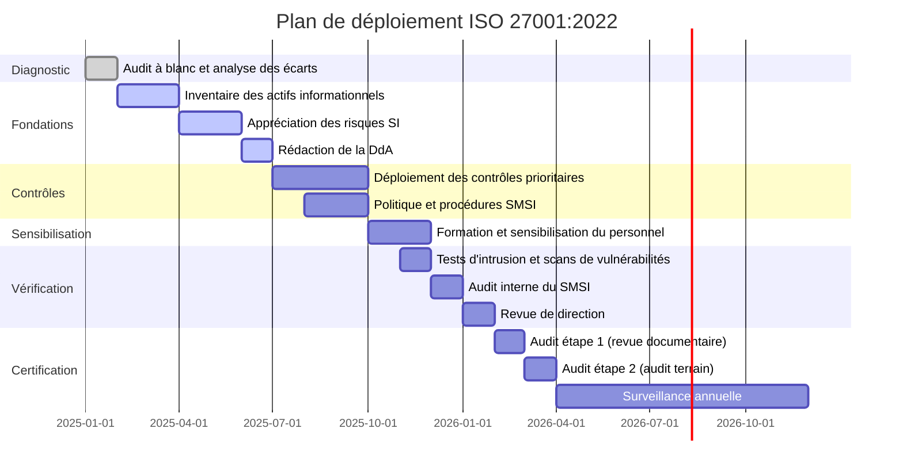

# ISO/IEC 27001:2022 — Système de Management de la Sécurité de l'Information

<div
  class="omny-meta"
  data-level="🟡 Intermédiaire & 🔴 Avancé"
  data-version="1.0"
  data-time="40-45 minutes">
</div>

## Introduction à la Sécurité de l'Information

!!! quote "Analogie pédagogique"
    _Imaginez un **Groupement Hospitalier de Territoire** qui regroupe 8 établissements de santé et 12 000 collaborateurs. Son système d'information gère des données parmi les plus sensibles qui existent : dossiers médicaux, antécédents psychiatriques, résultats d'examens génétiques, prescriptions, comptes rendus opératoires. Ces données sont accessibles depuis 400 postes de travail, 150 tablettes médicales, des équipements biomédicaux connectés et les cabinets de 800 médecins libéraux partenaires. Une seule question se pose : comment garantir que seules les personnes habilitées accèdent aux bonnes données, au bon moment, sans altération, dans un environnement aussi distribué et complexe ? La réponse ne peut pas être "un bon antivirus et un firewall". Elle doit être **systémique**. **ISO 27001 est ce système** : il impose de cartographier les actifs informationnels, d'identifier les risques, de sélectionner des mesures proportionnées, de former le personnel, de surveiller les accès, de gérer les incidents, de tester les plans de reprise — et de faire auditer l'ensemble par un tiers indépendant pour le prouver à quiconque en a besoin._

**ISO/IEC 27001** est le **standard international certifiable de référence pour la sécurité de l'information**. Publié en 2005, révisé en 2013 puis en 2022, il définit les exigences qu'un Système de Management de la Sécurité de l'Information[^1] (SMSI) doit satisfaire pour qu'une organisation puisse démontrer sa capacité à protéger ses actifs informationnels de manière systématique, mesurable et continuellement améliorée.

Avec plus de 70 000 organisations certifiées dans le monde, ISO 27001 est reconnu par les régulateurs (RGPD, NIS2, DORA, HDS), les clients grands comptes et les partenaires comme la preuve de référence de la maturité d'un programme de sécurité de l'information.

!!! info "Pourquoi ISO 27001 est essentiel ?"
    ISO 27001 est le **seul cadre certifiable** qui permet de démontrer formellement la maturité d'un SMSI à des tiers (clients, régulateurs, partenaires). La certification couvre directement les exigences techniques de NIS2 (article 21), constitue un prérequis de la certification HDS en France, et répond aux attentes de conformité de DORA pour les entités financières.

<br>

---

## Pour repartir des bases

### 1. Une norme d'exigences, pas de recommandations

ISO 27001 est une **norme d'exigences certifiable**. Chaque clause utilise le terme normatif "doit" (*shall* en anglais) — pas "devrait" ou "peut". L'organisation n'a pas de marge d'interprétation sur l'existence des exigences, uniquement sur leur mise en œuvre adaptée à son contexte.

La certification est délivrée par un **organisme de certification accrédité**[^2] (COFRAC en France) :

- **Audit étape 1** : revue documentaire du SMSI
- **Audit étape 2** : vérification de l'implémentation terrain
- **Certificat valide 3 ans** avec deux audits de surveillance annuels
- **Audit de renouvellement** à l'issue des 3 ans

### 2. Le SMSI : un système, pas une liste de contrôles

ISO 27001 n'impose pas de déployer 93 contrôles de sécurité mécaniquement. Il impose un **processus d'appréciation des risques** qui détermine, pour chaque organisation, quels contrôles sont nécessaires compte tenu de ses actifs, de ses menaces et de son appétit au risque :

1. Identifier les **actifs informationnels** et leur valeur
2. Identifier les **menaces** et **vulnérabilités** applicables
3. **Évaluer les risques** (probabilité × impact)
4. **Sélectionner les contrôles** appropriés parmi l'Annexe A
5. Justifier les **exclusions** dans la Déclaration d'Applicabilité[^3] (DdA)

> Deux organisations du même secteur peuvent avoir des SMSI très différents — parce que leurs actifs, leurs menaces et leur tolérance au risque diffèrent. **C'est une force** : ISO 27001 garantit la rigueur du processus, pas l'uniformité des solutions.

### 3. La triade CIAA / CIA

Le fondement conceptuel de tout SMSI repose sur quatre propriétés fondamentales de l'information :

| Propriété | Définition | Menaces principales |
|-----------|------------|---------------------|
| **Confidentialité (C)** | Accès réservé aux entités autorisées | Exfiltration, insider threat, interception |
| **Intégrité (I)** | Exactitude et complétude préservées | Altération, injection, falsification de logs |
| **Authentification (A)** | Identité vérifiable et prouvable | Usurpation, phishing, man-in-the-middle |
| **Disponibilité (A)** | Accessibilité à la demande des entités autorisées | DDoS, ransomware, pannes, suppressions |

!!! note "CIA vs CIAA"
    En anglais, le modèle de référence est la **triade CIA** (*Confidentiality, Integrity, Availability*). En France, l'**ANSSI** formalise le modèle **CIAA** qui distingue explicitement l'**Authentification** comme propriété indépendante. ISO 27001 s'appuie sur la terminologie CIA dans son texte officiel, mais intègre les mécanismes d'authentification dans ses contrôles de l'Annexe A (8.5, 5.15, 5.16, 5.17).

<br>

---

## Historique et évolutions

### Pourquoi ISO 27001 a été créée ?

Avant 2005, la sécurité de l'information manquait d'un cadre international certifiable :

- Le Royaume-Uni avait développé **BS 7799** (1995) : premier code de bonnes pratiques SI
- **BS 7799-2** (1998) : première spécification certifiable de SMSI, adoption limitée hors UK
- Des frameworks non certifiables coexistaient (COBIT, SSE-CMM, OCTAVE) sans référentiel commun

!!! note "Besoin identifié"
    Créer un **standard international certifiable** permettant à toute organisation de démontrer sa maturité en sécurité de l'information avec une terminologie, une méthode et des exigences reconnues par tous les acteurs économiques et régulateurs.

### Les quatre versions majeures

=== "BS 7799-2:1998 — Précurseur"

    **Contexte :**  
    _Première spécification certifiable de SMSI, issue des travaux britanniques sur BS 7799._

    **Innovations majeures :**

    - [x] Premier SMSI certifiable au monde
    - [x] Introduction du cycle PDCA[^4] appliqué à la sécurité
    - [x] 127 contrôles organisés en 10 domaines

    > **Limite :** Portée nationale, adoption internationale faible, reconnaissance limitée hors du Royaume-Uni.

=== "ISO/IEC 27001:2005 — Fondation"

    **Contexte :**  
    _Conversion de BS 7799-2 en standard international, sous pilotage ISO/IEC JTC1._

    **Innovations majeures :**

    - [x] Premier SMSI certifiable reconnu internationalement
    - [x] **133 contrôles** organisés en **11 domaines** (Annexe A)
    - [x] Appréciation des risques formalisée (méthode libre mais documentée)
    - [x] Cycle PDCA explicitement intégré à la structure

    > **Limite principale :** Structure non alignée avec les autres normes ISO de management, surcharge documentaire, absence de lien avec les systèmes de management existants (ISO 9001, ISO 14001).

=== "ISO/IEC 27001:2013 — Modernisation"

    **Contexte :**  
    _Refonte majeure adoptant la Structure HLS[^5], rationalisation des contrôles, libéralisation de la méthode de gestion des risques._

    **Innovations majeures :**

    - [x] **Structure HLS** : ISO 27001 parmi les premières normes à l'adopter
    - [x] **114 contrôles** en **14 domaines** (Annexe A) — rationalisation significative
    - [x] Méthode d'appréciation des risques entièrement libre (suppression de l'approche actifs/menaces/vulnérabilités imposée)
    - [x] Suppression du cycle PDCA explicite (intégré à la structure HLS)
    - [x] Meilleure intégration avec **ISO 9001:2008** et **ISO 14001:2004**

    > **Impact mondial :** Adoption massive. ISO 27001:2013 devient le standard de référence pour les SMSI dans le monde entier.

=== "ISO/IEC 27001:2022 — Transformation"

    **Contexte :**  
    _Révision majeure intégrant les nouvelles réalités du cloud, du télétravail, des supply chains numériques et des menaces cyber évoluées._

    **Innovations majeures :**

    - [x] **93 contrôles** organisés en **4 thèmes** (Annexe A complètement restructurée)
    - [x] **11 nouveaux contrôles** : threat intelligence, sécurité cloud, DLP, masquage de données, surveillance web, codage sécurisé, ICT supply chain
    - [x] **Système d'attributs** sur chaque contrôle (type, propriétés CIAA, concepts NIST, capacités opérationnelles)
    - [x] Meilleure couverture du **télétravail**, de la **supply chain ICT** et des **services cloud**
    - [x] Alignement renforcé avec **NIST CSF**, **CIS Controls** et les référentiels sectoriels

    !!! warning "Transition 2013 → 2022"
        Les organisations certifiées ISO 27001:2013 avaient jusqu'au **31 octobre 2025** pour migrer vers la version 2022. Au-delà de cette date, les certificats 2013 ne sont plus reconnus. La migration nécessite principalement de mettre à jour la DdA, l'Annexe A et les contrôles associés aux 11 nouveaux contrôles.

### Timeline de l'évolution ISO 27001


_La révision 2022 marque le passage d'une organisation des contrôles par **domaines techniques** à une organisation par **thèmes fonctionnels**, facilitant leur attribution aux responsables et leur pilotage dans la DdA._

<br>

---

## Les 7 concepts fondateurs

ISO 27001:2022 repose sur **7 concepts fondateurs** qui structurent la philosophie du management de la sécurité de l'information.

!!! note "Des concepts, pas des étapes séquentielles"
    Ces 7 concepts définissent les qualités fondamentales d'un SMSI robuste. Certains sont partagés avec ISO 9001 (leadership, amélioration continue), d'autres sont propres à la sécurité de l'information (CIAA, Annexe A, DdA).

### Vue d'ensemble


_La **DdA** est le pivot central : elle relie la liste des risques identifiés aux contrôles sélectionnés et justifie chaque exclusion. C'est le document le plus scruté lors d'un audit de certification._

### Les 7 concepts expliqués

!!! note "Ci-dessous les 4 premiers concepts"

=== "1️⃣ CIAA — Les quatre propriétés fondamentales"

    **Tout incident de sécurité porte atteinte à au moins une des quatre propriétés de l'information.**

    En pratique, un ransomware compromet simultanément :

    - La **disponibilité** : les fichiers chiffrés sont inaccessibles
    - L'**intégrité** : les données sont altérées de manière non autorisée
    - La **confidentialité** : exfiltration préalable avant chiffrement (double extorsion)

    Chaque contrôle de l'Annexe A est associé à une ou plusieurs propriétés CIAA via le **système d'attributs** introduit en 2022.

    | Propriété | Contrôles phares (Annexe A 2022) |
    |-----------|----------------------------------|
    | Confidentialité | 8.24 Cryptographie, 5.15 Contrôle d'accès, 8.11 Masquage de données |
    | Intégrité | 8.15 Journalisation, 8.20 Sécurité réseau, 8.9 Gestion de configuration |
    | Authentification | 8.5 Authentification sécurisée, 5.16 Gestion des identités, 5.17 Authentification |
    | Disponibilité | 8.6 Redondance, 5.29 Continuité SI, 8.13 Sauvegarde |

=== "2️⃣ Appréciation et traitement des risques SI"

    **Le SMSI est dimensionné sur les risques réels de l'organisation, déterminés par un processus formel et documenté.**

    ISO 27001 n'impose pas de méthode d'appréciation des risques. Il exige que la méthode choisie soit :

    - **Documentée** : critères de risque, méthode d'évaluation, seuil d'acceptation
    - **Reproductible** : appliquée de manière cohérente sur l'ensemble du périmètre
    - **Mise à jour** : lors de tout changement significatif et au minimum annuellement

    Les méthodes compatibles ISO 27001 incluent : **ISO 27005**, **EBIOS Risk Manager** (ANSSI), **MEHARI** (CLUSIF), méthodes propriétaires documentées.

    Les quatre options de traitement des risques :

    - **Modifier** : déployer des contrôles pour réduire le risque sous le seuil d'acceptation
    - **Accepter** : documenter et faire approuver par la direction le risque résiduel
    - **Éviter** : renoncer à l'activité qui génère le risque
    - **Transférer** : assurance cyber, externalisation, contrats de responsabilité

=== "3️⃣ Gouvernance de la sécurité"

    **ISO 27001 exige une structure de gouvernance claire : la sécurité est une responsabilité d'entreprise, pas uniquement technique.**

    - **Politique de sécurité**[^6] :  
      _Document signé par la direction, fixant les orientations, les objectifs et les engagements en matière de sécurité de l'information._

    - **Rôle du RSSI**[^7] :  
      _Responsable de la conception, de la mise en œuvre et de l'amélioration du SMSI. ISO 27001 n'impose pas ce titre mais exige que les rôles soient formellement attribués et communiqués._

    - **Propriétaires d'actifs** :  
      _Chaque actif informationnel a un propriétaire responsable de sa classification, sa protection et son cycle de vie._

    - **Comité de sécurité** :  
      _Instance de gouvernance réunissant direction, RSSI et directions métiers pour les décisions stratégiques de sécurité._

=== "4️⃣ Annexe A — Les 93 contrôles"

    **L'Annexe A liste les contrôles de sécurité que l'organisation peut sélectionner pour traiter ses risques.**

    La version 2022 restructure l'Annexe A en **4 thèmes** :

    | Thème | Contrôles | Portée |
    |-------|-----------|--------|
    | **Organisationnels** | 5.1 → 5.37 (37 contrôles) | Politiques, gouvernance, actifs, accès, fournisseurs, incidents, conformité |
    | **Personnes** | 6.1 → 6.8 (8 contrôles) | RH, sensibilisation, formation, télétravail |
    | **Physiques** | 7.1 → 7.14 (14 contrôles) | Périmètres, accès physique, équipements, supports |
    | **Technologiques** | 8.1 → 8.34 (34 contrôles) | Endpoints, réseau, chiffrement, développement, surveillance |

    Les **11 nouveaux contrôles** de la version 2022 :

    - **5.7** Renseignement sur les menaces (*Threat Intelligence*)
    - **5.23** Sécurité de l'information pour les services cloud
    - **5.30** Préparation des TIC pour la continuité d'activité
    - **7.4** Surveillance de la sécurité physique
    - **8.9** Gestion de la configuration
    - **8.10** Suppression de l'information
    - **8.11** Masquage des données
    - **8.12** Prévention des fuites de données (DLP)
    - **8.16** Activités de surveillance
    - **8.22** Filtrage web
    - **8.28** Codage sécurisé

!!! note "Ci-dessous les 3 derniers concepts"

=== "5️⃣ Déclaration d'Applicabilité (DdA)"

    **La DdA est le document pivot qui matérialise le lien entre les risques identifiés et les contrôles sélectionnés.**

    La DdA[^3] est un document obligatoire d'ISO 27001. Pour chacun des 93 contrôles de l'Annexe A, elle indique :

    - **Statut** : inclus ou exclu
    - **Justification de l'inclusion** : résultat de l'appréciation des risques, exigence légale, exigence contractuelle, bonne pratique volontaire
    - **Statut de mise en œuvre** : planifié, en cours, mis en œuvre
    - **Justification de l'exclusion** : démonstration que l'exclusion ne compromet pas la sécurité

    !!! warning "Point d'audit critique"
        Un auditeur de certification examine systématiquement la DdA en détail. Les exclusions sans justification rigoureuse constituent des constats d'écart immédiats. La DdA doit être un document vivant : mise à jour à chaque révision de l'appréciation des risques.

=== "6️⃣ Cycle de vie de l'information"

    **La sécurité de l'information couvre chaque étape : création, traitement, stockage, transfert, archivage, destruction.**

    - **Classification de l'information**[^8] :  
      _Attribuer un niveau de sensibilité (Public, Interne, Confidentiel, Secret) et les règles de protection associées._

    - **Gestion des actifs** :  
      _Inventaire complet, désignation des propriétaires, étiquetage, gestion des supports._

    - **Transfert sécurisé** :  
      _Chiffrement en transit, règles pour les e-mails, supports amovibles, accès distants._

    - **Destruction sécurisée** :  
      _Suppression irréversible en fin de vie : dégaussage, destruction physique, suppression cryptographique._

=== "7️⃣ Amélioration continue"

    **Le SMSI s'améliore à chaque audit, chaque incident, chaque changement technologique ou organisationnel.**

    Les sources principales d'amélioration :

    - **Gestion des incidents** :  
      _Chaque incident de sécurité, même mineur, génère un REX[^9] qui alimente le processus d'amélioration._

    - **Audits internes** :  
      _Vérification périodique de la conformité du SMSI aux exigences ISO 27001 et à ses propres politiques._

    - **Tests d'intrusion**[^10] :  
      _Validation de l'efficacité des contrôles techniques par des attaquants éthiques._

    - **Veille sur les menaces** :  
      _Intégration des nouvelles menaces et vulnérabilités dans l'appréciation des risques._

<br>

---

## La structure HLS et les clauses opérationnelles

ISO 27001:2022 adopte la **Structure HLS**[^5] en 10 clauses. Les clauses 4 à 10 sont les clauses opérationnelles du SMSI, structurées selon le cycle PDCA[^4].

### Le cycle PDCA appliqué aux clauses


_La clause 8 est volontairement courte dans le texte normatif — elle se limite à exiger l'exécution des processus planifiés. C'est l'appréciation des risques (clause 6.1.2) et le déploiement des contrôles de l'Annexe A qui constituent l'essentiel du travail d'implémentation._

### Détail des clauses

??? abstract "Clause 4 — Contexte de l'organisme"

    **Comprendre l'environnement dans lequel le SMSI doit protéger l'information.**

    **4.1 — Compréhension de l'organisme et de son contexte :**  
    _Identifier les enjeux internes et externes pertinents pour le SMSI : maturité IT, culture sécurité, contraintes réglementaires (RGPD, HDS, NIS2, DORA), menaces sectorielles, incidents passés, dépendances technologiques._

    **4.2 — Compréhension des parties intéressées :**  
    _Clients (protection de leurs données), régulateurs (conformité), partenaires (sécurité des échanges), actionnaires (protection des actifs), collaborateurs (confidentialité données RH)._

    **4.3 — Périmètre du SMSI :**  
    _Définir précisément quels systèmes, quelles données, quels sites et quelles entités sont couverts par la certification. Un périmètre incohérent — excluant des systèmes interconnectés — crée des angles morts critiques._

    **4.4 — SMSI :**  
    _Établir, mettre en œuvre, maintenir et améliorer continuellement le SMSI._

    | Livrable attendu | Description |
    |------------------|-------------|
    | Analyse du contexte | Enjeux internes/externes, cartographie réglementaire |
    | Registre des parties intéressées | PI pertinentes et leurs exigences de sécurité |
    | Périmètre documenté | Systèmes couverts, exclusions justifiées |

??? abstract "Clause 5 — Leadership"

    **La direction est responsable de la sécurité de l'information — pas uniquement le RSSI.**

    **5.1 — Leadership et engagement :**  
    _La direction alloue le budget sécurité, valide la politique, participe aux revues de direction, et traite la sécurité de l'information comme un risque d'entreprise — pas uniquement un risque technique._

    **5.2 — Politique de sécurité de l'information :**  
    _Établir une politique documentée, signée par la direction, incluant : les objectifs de sécurité, les exigences de conformité, l'engagement d'amélioration continue._

    **5.3 — Rôles, responsabilités et autorités :**  
    _Désigner formellement le RSSI[^7], les propriétaires d'actifs, les responsables de processus sécurité, avec des autorités et des responsabilités clairement définies et communiquées._

    !!! tip "La sécurité au niveau du conseil d'administration"
        Les organisations les plus matures traitent les risques cyber dans les mêmes instances qui traitent les risques financiers et légaux. Un RSSI qui rapporte directement au DG ou au CA dispose d'une autorité significativement supérieure à un RSSI rattaché à la DSI.

??? abstract "Clause 6 — Planification"

    **Fonder les décisions de sécurité sur une appréciation rigoureuse des risques.**

    **6.1.1 — Généralités :**  
    _Identifier les risques et opportunités qui pourraient affecter la capacité du SMSI à atteindre ses objectifs._

    **6.1.2 — Appréciation des risques de sécurité :**

    L'organisation doit définir et appliquer un processus d'appréciation des risques SI produisant des résultats cohérents, valides et comparables. Ce processus doit :

    - Établir des **critères d'acceptation des risques**
    - Identifier les **risques** associés à la perte de CIAA des actifs informationnels
    - **Analyser** les risques (probabilité, impact)
    - **Évaluer** les risques par rapport aux critères d'acceptation
    - Prioriser les risques pour leur traitement

    **6.1.3 — Traitement des risques de sécurité :**  
    _Sélectionner les options de traitement et les contrôles de l'Annexe A. Produire la DdA[^3]. Produire le plan de traitement des risques._

    **6.2 — Objectifs de sécurité de l'information :**  
    _Établir des objectifs mesurables, assignés, avec des échéances définies._

    ```mermaid
    ---
    config:
      theme: "base"
    ---
    flowchart LR
        INV["Inventaire\ndes actifs"] --> ID["Identification\nmenaces - vulnérabilités"]
        ID --> ANA["Analyse des risques\nprobabilité x impact"]
        ANA --> EVA["Évaluation\nvs seuil d'acceptation"]
        EVA --> TRT{"Traitement\ndu risque"}
        TRT -->|Modifier| CTR["Sélection\ncontrôles Annexe A"]
        TRT -->|Transférer| ASS["Assurance\ncyber"]
        TRT -->|Accepter| ACC["Acceptation\ndocumentée"]
        TRT -->|Éviter| EVI["Abandon\nde l'activité"]
        CTR --> DDA["DdA\nDéclaration d'Applicabilité"]
        DDA --> PTR["Plan de traitement\ndes risques"]
    ```
    _Ce processus est le cœur du SMSI. La DdA matérialise le lien entre chaque risque identifié et les contrôles sélectionnés pour le traiter. Elle est examinée en détail lors de chaque audit de certification._

??? abstract "Clause 7 — Support"

    **Fournir les ressources humaines, techniques et documentaires nécessaires au SMSI.**

    **7.1 — Ressources :**  
    _Budget sécurité, personnel qualifié, outils (SIEM[^11], EDR[^12], PAM[^13], scanners de vulnérabilités, plateformes GRC), connaissances organisationnelles._

    **7.2 — Compétences :**  
    _Identifier les compétences requises pour chaque rôle du SMSI. Vérifier leur acquisition. Preuves : certifications (CISSP, CISM, CEH, ISO 27001 Lead Implementer/Auditor), formations, habilitations._

    **7.3 — Sensibilisation :**  
    _Tout le personnel comprend la politique de sécurité, les menaces courantes (phishing, ingénierie sociale, mots de passe faibles) et ses obligations._

    **7.4 — Communication :**  
    _Remontée d'incidents, alertes sécurité internes ; notification RGPD aux autorités, communication avec les régulateurs en cas d'incident._

    **7.5 — Informations documentées :**  
    _Politique, résultats de l'appréciation des risques, DdA, plan de traitement des risques, procédures opérationnelles de sécurité._

??? abstract "Clause 8 — Réalisation des activités opérationnelles"

    **Mettre en œuvre et opérer le SMSI au quotidien.**

    **8.1 — Planification et maîtrise opérationnelles :**  
    _Mettre en œuvre les processus nécessaires au SMSI. Maîtriser les changements qui pourraient affecter la sécurité de l'information._

    **8.2 — Appréciation des risques :**  
    _Réaliser ou réviser l'appréciation des risques à intervalles planifiés et lors de changements significatifs. Conserver les résultats._

    **8.3 — Traitement des risques :**  
    _Mettre en œuvre le plan de traitement des risques. Conserver les résultats du traitement._

    > ISO 27001 exige que les contrôles soient **effectivement déployés**, pas uniquement documentés dans la DdA. Un auditeur demande systématiquement des preuves d'implémentation : logs, configurations, captures d'écran, enregistrements, tests.

??? abstract "Clause 9 — Évaluation des performances"

    **Mesurer, analyser et évaluer les performances du SMSI.**

    **9.1 — Surveillance, mesure, analyse et évaluation :**  
    _Définir les métriques de sécurité, les fréquences de mesure et les responsables d'analyse._

    **9.2 — Audit interne :**  
    _Réaliser des audits internes du SMSI à intervalles planifiés. Les auditeurs internes doivent être indépendants des activités auditées._

    **9.3 — Revue de direction :**  
    _La direction revoit le SMSI en intégrant les résultats d'audits, les incidents de sécurité, les retours des parties intéressées, les nouvelles menaces._

    | Métriques de sécurité clés | Description |
    |----------------------------|-------------|
    | MTTD (*Mean Time to Detect*) | Délai moyen entre occurrence et détection d'un incident |
    | MTTR (*Mean Time to Respond*) | Délai moyen entre détection et confinement |
    | Taux de patch critique | % de systèmes patchés dans les délais politiques |
    | Couverture MFA | % de comptes soumis à authentification multi-facteur |
    | Taux de clic phishing simulé | % d'employés piégés lors de campagnes de phishing simulé |

??? abstract "Clause 10 — Amélioration"

    **Améliorer continuellement le SMSI sur la base des incidents, des audits et des nouvelles menaces.**

    **10.1 — Non-conformité et action corrective :**  
    _Face à une non-conformité (contrôle non appliqué, politique non respectée, incident non traité selon procédure) : analyser la cause racine, corriger, vérifier l'efficacité._

    **10.2 — Amélioration continue :**  
    _Améliorer en permanence la pertinence, l'adéquation et l'efficacité du SMSI._

<br>

---

## Le processus de certification

### Phases d'un audit de certification


_La durée entre l'audit étape 1 et l'étape 2 est généralement de 3 à 6 mois, laissant le temps à l'organisation de corriger les écarts documentaires identifiés lors de la revue documentaire._

### Critères de qualification des écarts

| Type d'écart | Définition | Impact sur la certification |
|--------------|-----------|----------------------------|
| **Écart majeur** | Non-conformité à une exigence de la norme ou défaillance systémique | Certification non délivrée tant que non corrigé |
| **Écart mineur** | Non-conformité partielle ou ponctuelle | Certification délivrée avec plan d'action vérifié à la prochaine surveillance |
| **Observation** | Amélioration recommandée, pas d'exigence non satisfaite | Aucun impact sur la certification |

<br>

---

## Articulation avec d'autres normes et réglementations

### Comparaison avec les standards et réglementations majeurs

| Standard / Réglementation | Domaine | Relation avec ISO 27001 | Certifiable |
|---------------------------|---------|------------------------|-------------|
| **ISO 27002:2022** | Contrôles SI — Guide | Norme compagnon : détaille l'implémentation de l'Annexe A | Non |
| **ISO 27005:2022** | Risques SI | Guide d'appréciation des risques supportant la clause 6.1.2 | Non |
| **ISO 27701:2019** | Vie privée (PIMS) | Extension certifiable d'ISO 27001 pour la conformité RGPD | Oui (extension) |
| **ISO 22301:2019** | Continuité d'activité | Complémentaire — PRA IT et cyber-résilience | Oui |
| **ISO 20000-1:2018** | Services IT | Structure HLS commune — processus partagés | Oui |
| **RGPD** | Protection données personnelles | ISO 27001 couvre la sécurité des données personnelles (article 32) | Réglementaire |
| **NIS2** | Sécurité OSE/OIV | ISO 27001 satisfait les mesures techniques NIS2 (article 21) | Réglementaire |
| **DORA** | Résilience numérique finance | ISO 27001 + ISO 22301 couvrent les exigences ICT de DORA | Réglementaire |
| **HDS** | Hébergement données santé | ISO 27001 est un prérequis de la certification HDS | Réglementaire |
| **PCI DSS** | Sécurité données paiement | Contrôles partiellement alignés — non substituable | Réglementaire |

<br>

---

## Bénéfices de l'approche ISO 27001

### Pour les organisations

<div class="grid cards" markdown>

-   :lucide-check-circle:{ .lg .middle } **Réduction de l'exposition aux cyberrisques**

    ---
    Le processus d'appréciation des risques identifie les vulnérabilités avant leur exploitation. Les contrôles déployés réduisent la surface d'attaque de manière systématique et documentée.

-   :lucide-trending-up:{ .lg .middle } **Conformité réglementaire multi-cadres**

    ---
    Un SMSI ISO 27001 opérationnel fournit la base documentaire et les preuves nécessaires pour RGPD, NIS2, DORA et HDS — réduisant significativement les coûts de conformité multi-réglementaire.

-   :lucide-shield-check:{ .lg .middle } **Signal de confiance commercial**

    ---
    Prérequis dans de nombreux appels d'offres grands comptes, administrations, secteurs finance et santé. La certification est une preuve opposable de maturité sécurité.

-   :lucide-refresh-cw:{ .lg .middle } **Réponse structurée aux incidents**

    ---
    Les procédures de gestion des incidents définies dans le SMSI garantissent une réponse coordonnée, documentée et réglementairement conforme (notification RGPD dans les 72h, reporting NIS2).

</div>

<div class="grid cards" markdown>

-   :lucide-handshake:{ .lg .middle } **Réduction des primes d'assurance cyber**

    ---
    Les assureurs cyber intègrent systématiquement la certification ISO 27001 dans leurs questionnaires de souscription. Elle permet d'accéder à des couvertures supérieures à des conditions améliorées.

-   :lucide-award:{ .lg .middle } **Visibilité sur le patrimoine informationnel**

    ---
    L'inventaire des actifs révèle systématiquement des données critiques non protégées et des accès non maîtrisés ignorés avant la démarche. C'est un audit organisationnel déguisé.

</div>

<br>

---

## Mise en œuvre pratique

### Étapes clés de déploiement



### Écueils à éviter

!!! warning "Pièges courants"

    **SMSI réduit à un exercice documentaire :**  
    _Produire des politiques et procédures sans déployer les contrôles techniques correspondants. Les auditeurs vérifient systématiquement les preuves d'implémentation réelle : logs, configurations, enregistrements._

    **DdA déconnectée de l'appréciation des risques :**  
    _Inclure des contrôles par défaut sans les relier à des risques identifiés, ou exclure des contrôles sans justification documentée. La DdA doit être le reflet fidèle des décisions de traitement des risques._

    **Périmètre incohérent :**  
    _Exclure des systèmes interconnectés au périmètre certifié. Si un système hors périmètre peut accéder aux données du périmètre, il est dans le périmètre._

    **Sensibilisation annuelle unique :**  
    _Une session par an ne construit pas une culture sécurité. La sensibilisation doit être continue, variée (phishing simulé, e-learning, rappels ciblés) et mesurée._

    **Gestion des incidents sans traçabilité :**  
    _Sans centralisation des logs (SIEM[^11]) et procédures documentées, la détection est aléatoire et la reconstitution post-incident impossible._

### Facteurs clés de succès

- [x] **Périmètre cohérent** incluant tous les systèmes interconnectés
- [x] **Inventaire des actifs exhaustif** avant toute appréciation des risques
- [x] **DdA rigoureuse** : justification documentée pour chaque contrôle inclus et exclu
- [x] **Programme de sensibilisation continu**, varié et mesuré
- [x] **Tests d'intrusion réguliers** pour valider les contrôles techniques
- [x] **Gestion des incidents formalisée** avec traçabilité et délais respectés
- [x] **Revues de direction substantielles** intégrant les incidents et les nouvelles menaces

<br>

---

## Perspectives et évolutions

### ISO 27001 face aux enjeux émergents

**Intelligence Artificielle :**  
_Les systèmes d'IA introduisent de nouveaux risques pour la CIAA : prompt injection exposant des données confidentielles, empoisonnement des données d'entraînement, hallucinations révélant des informations sensibles. L'ISO TC 27 travaille sur des orientations spécifiques en cohérence avec l'AI Act européen._

**Chiffrement post-quantique :**  
_L'informatique quantique menace les algorithmes asymétriques actuels (RSA, ECC). Le NIST a standardisé les premiers algorithmes post-quantiques (ML-KEM, ML-DSA) en 2024. Les SMSI doivent intégrer la migration cryptographique dans leur appréciation des risques._

**Sécurité de la supply chain ICT :**  
_Les attaques via les fournisseurs logiciels (SolarWinds, XZ Utils) sont devenues un vecteur d'attaque majeur. Le contrôle 5.19-5.23 (fournisseurs et cloud) d'ISO 27001:2022 répond directement à cet enjeu._

**Convergence réglementaire :**

- **NIS2** : Directive (UE) 2022/2555 — les mesures de l'article 21 s'alignent directement sur les contrôles ISO 27001
- **DORA** : Règlement (UE) 2022/2554 — ISO 27001 + ISO 22301 couvrent les exigences ICT
- **AI Act** : Règlement (UE) 2024/1689 — les exigences de sécurité pour les systèmes IA à haut risque s'intègrent dans un SMSI ISO 27001

<br>

---

## Conclusion

!!! quote "La sécurité de l'information n'est pas un état à atteindre. C'est un processus à maintenir."
    ISO 27001:2022 incarne une vérité que tout professionnel de la sécurité finit par expérimenter : aucun système n'est définitivement sécurisé. La certification n'atteste pas qu'une organisation est invulnérable. Elle atteste que l'organisation a mis en place un **processus rigoureux, structuré et continuellement amélioré** pour gérer ses risques — et qu'un tiers indépendant l'a vérifié.

    La Déclaration d'Applicabilité résume le mieux l'esprit de la norme : chaque contrôle de sécurité est présent ou absent pour une raison documentée, reliée à un risque identifié. Cette transparence est une contrainte et une force simultanément. Les organisations qui en tirent le meilleur ne traitent pas ISO 27001 comme un certificat à décrocher, mais comme le **système nerveux de leur gouvernance sécurité**.

    > La prochaine étape logique est d'approfondir les deux normes compagnons indispensables : **ISO 27002** pour comprendre comment implémenter chacun des 93 contrôles, et **ISO 27005** pour maîtriser le processus d'appréciation des risques qui est le cœur opérationnel du SMSI.

<br>

---

## Ressources complémentaires

### Documents officiels ISO — Famille 27000

- **ISO/IEC 27001:2022** — Exigences du SMSI (certification)
- **ISO/IEC 27002:2022** — Contrôles de sécurité — Guide de mise en œuvre
- **ISO/IEC 27005:2022** — Gestion des risques liés à la sécurité de l'information
- **ISO/IEC 27000:2018** — Aperçu et vocabulaire de la famille

### Extensions et normes associées

- **ISO/IEC 27701:2019** — Système de management de la vie privée (PIMS/RGPD)
- **ISO/IEC 27017:2015** — Sécurité cloud
- **ISO/IEC 27018:2019** — Données personnelles dans le cloud
- **ISO 22301:2019** — Continuité d'activité

### Méthodes d'appréciation des risques

- **EBIOS Risk Manager** — ANSSI (France)
- **MEHARI** — CLUSIF (France)

### Certifications professionnelles

- **ISO 27001 Lead Implementer** — PECB, BSI
- **ISO 27001 Lead Auditor** — PECB, BSI
- **CISSP** — (ISC)²
- **CISM** — ISACA

### Organismes de référence

- **ANSSI** : cyber.gouv.fr
- **ENISA** : enisa.europa.eu
- **AFNOR** : afnor.org


[^1]: Le **SMSI** (*Système de Management de la Sécurité de l'Information*) est l'ensemble des politiques, processus, procédures, ressources et activités qu'une organisation met en place pour protéger ses actifs informationnels contre les risques de sécurité, de manière systématique, mesurable et continuellement améliorée.
[^2]: Un **organisme de certification accrédité** est une entité tierce indépendante, accréditée par le COFRAC en France (ou un organisme d'accréditation national équivalent), habilitée à auditer et certifier la conformité d'un SMSI à ISO 27001. En France : Bureau Veritas, BSI, SGS, LRQA, Intertek.
[^3]: La **DdA** (*Déclaration d'Applicabilité*, ou *SoA — Statement of Applicability*) est un document obligatoire d'ISO 27001 listant les 93 contrôles de l'Annexe A, indiquant pour chacun s'il est inclus ou exclu, et justifiant cette décision sur la base de l'appréciation des risques, des exigences légales ou des bonnes pratiques.
[^4]: Le **cycle PDCA** (*Plan-Do-Check-Act*, ou *Planifier-Réaliser-Vérifier-Agir*) est le modèle itératif d'amélioration continue structurant les systèmes de management. Dans ISO 27001:2022 (via la Structure HLS), il est intégré à l'architecture des 10 clauses sans être nommé explicitement.
[^5]: La **Structure HLS** (*High Level Structure*) est le cadre commun de 10 clauses imposé par l'ISO à toutes ses normes de systèmes de management depuis 2012, facilitant l'intégration de plusieurs normes (ISO 27001, ISO 9001, ISO 22301, ISO 20000) dans un système de management unifié.
[^6]: La **politique de sécurité de l'information** est un document formel signé par la direction exprimant les engagements de l'organisation en matière de protection des actifs informationnels. Elle doit inclure les objectifs de sécurité, les exigences de conformité, les responsabilités et un engagement d'amélioration continue.
[^7]: Le **RSSI** (*Responsable de la Sécurité des Systèmes d'Information*, ou *CISO — Chief Information Security Officer*) est le responsable de la définition, de la mise en œuvre et de la supervision du SMSI. Son positionnement hiérarchique — rattachement à la DSI vs rattachement direct à la direction générale — a un impact direct sur son indépendance et son efficacité opérationnelle.
[^8]: La **classification de l'information** est le processus qui consiste à attribuer à chaque information un niveau de sensibilité (Public, Interne, Confidentiel, Secret ou équivalent) et à définir les règles de protection correspondantes : contrôles d'accès, chiffrement, restrictions de diffusion, conditions de destruction en fin de vie.
[^9]: Le **REX** (*Retour d'Expérience*) est un processus structuré qui consiste à analyser un incident après coup, identifier ses causes profondes, en tirer des enseignements et mettre à jour les pratiques, procédures ou contrôles pour éviter qu'il ne se reproduise.
[^10]: Un **test d'intrusion** (*penetration test* ou *pentest*) est une évaluation de sécurité consistant à simuler des attaques réelles contre les systèmes d'information d'une organisation, avec son autorisation explicite, pour identifier les vulnérabilités exploitables avant qu'un attaquant réel ne le fasse. Il se distingue d'un scan de vulnérabilités automatisé par sa dimension humaine et sa profondeur d'analyse.
[^11]: Un **SIEM** (*Security Information and Event Management*) est un outil qui collecte, agrège et analyse en temps réel les journaux d'événements de l'ensemble des systèmes pour détecter les incidents, anomalies comportementales et tentatives d'intrusion. Exemples : Splunk, IBM QRadar, Microsoft Sentinel, Elastic SIEM.
[^12]: Un **EDR** (*Endpoint Detection and Response*) surveille en permanence les endpoints pour détecter les comportements malveillants et permettre une réponse rapide. Exemples : CrowdStrike Falcon, SentinelOne, Microsoft Defender for Endpoint.
[^13]: Un **PAM** (*Privileged Access Management*) contrôle, surveille et audite les accès des comptes à hauts privilèges aux systèmes critiques, prévenant les mouvements latéraux lors d'une compromission.

<br>

---

## Conclusion

!!! quote "Ce qu'il faut retenir"
    Les normes et référentiels ne sont pas des contraintes administratives, mais des cadres structurants. Ils garantissent que la cybersécurité s'aligne sur les objectifs métiers de l'organisation et offre une assurance raisonnable face aux risques.

> [Retour à l'index de la gouvernance →](../../index.md)
