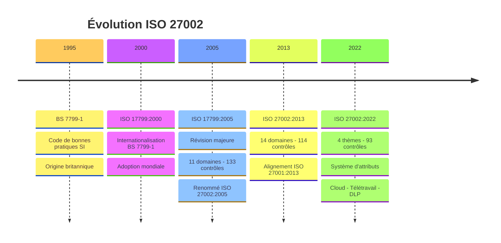
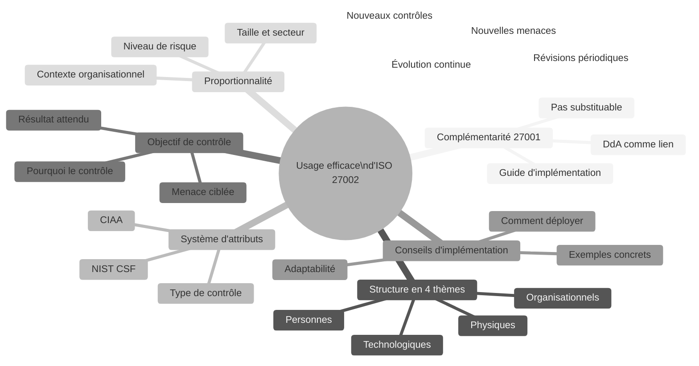
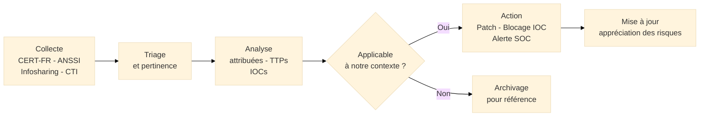
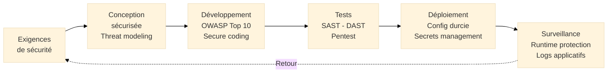
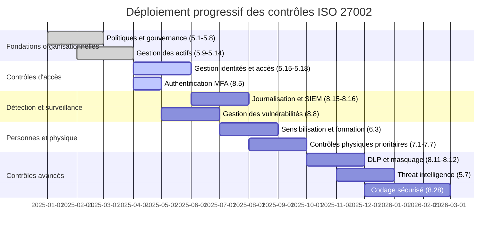

# ISO/IEC 27002:2022 — Mesures de Sécurité de l'Information

## Introduction aux Mesures de Sécurité

!!! quote "Analogie pédagogique"
    _Imaginez un **maître d'ouvrage** qui commande la construction d'un immeuble sécurisé. Le **cahier des charges** (ISO 27001) lui dit ce que le bâtiment doit garantir : résistance aux intrusions, contrôle des accès, protection contre l'incendie, redondance des systèmes électriques. Mais le cahier des charges ne lui dit pas **comment** construire les murs, quelle épaisseur d'acier utiliser pour les portes blindées, ni comment câbler les détecteurs d'incendie. Ce "comment" appartient aux **Documents Techniques Unifiés** et aux guides de construction — c'est le rôle d'ISO 27002. Si vous respectez uniquement le cahier des charges sans les guides techniques, vous construisez quelque chose qui satisfait les exigences formelles mais dont la solidité réelle est incertaine. Si vous utilisez les guides sans cahier des charges, vous construisez sans direction ni obligations auditables. **ISO 27002 sans ISO 27001, c'est un guide sans projet. ISO 27001 sans ISO 27002, c'est un projet sans guide.**_

**ISO/IEC 27002** est le **guide international de référence pour la mise en œuvre des mesures de sécurité de l'information**. Il détaille les **93 contrôles de l'Annexe A d'ISO 27001:2022** en fournissant pour chacun : l'objectif de sécurité visé, les conseils de mise en œuvre, les informations complémentaires et le système d'attributs permettant de les filtrer et de les prioriser.

ISO 27002 n'est **pas une norme certifiable**. C'est un référentiel de bonnes pratiques qui accompagne ISO 27001 en transformant des exigences abstraites ("gérer les accès aux systèmes") en orientations concrètes ("voici comment définir une politique de contrôle d'accès, quels critères de révocation appliquer, quels outils utiliser").

!!! info "Pourquoi ISO 27002 est essentiel ?"
    ISO 27001 exige de déployer des contrôles de sécurité mais n'explique pas comment les implémenter. ISO 27002 comble ce gap. Pour un RSSI, c'est le **manuel technique du SMSI** : la référence à consulter pour chaque question de mise en œuvre, reconnue internationalement, alignée sur les référentiels NIST CSF, CIS Controls et MITRE ATT&CK.

 

---

## Pour repartir des bases

### 1. Un guide, pas une norme d'exigences

ISO 27002 utilise des formulations conseillantes ("devrait", "il est recommandé") — pas les formulations normatives d'ISO 27001 ("doit"). L'organisation choisit librement comment implémenter chaque contrôle, en adaptant les conseils à son contexte, sa taille, ses contraintes techniques et financières.

> L'auditeur de certification ISO 27001 vérifie que les contrôles sélectionnés dans la DdA[^1] sont effectivement déployés. Il ne vérifie pas qu'ils sont déployés exactement comme le suggère ISO 27002 — il vérifie qu'ils atteignent l'objectif de sécurité visé.

### 2. La restructuration 2022 : de 14 domaines à 4 thèmes

La révision 2022 a profondément transformé la structure d'ISO 27002 :

| Version | Organisation | Nombre de contrôles |
|---------|-------------|---------------------|
| **ISO 27002:2005** | 11 domaines | 133 contrôles |
| **ISO 27002:2013** | 14 domaines | 114 contrôles |
| **ISO 27002:2022** | 4 thèmes | 93 contrôles |

La réduction du nombre de contrôles ne traduit pas un allègement des exigences, mais une **rationalisation** : certains contrôles ont été fusionnés, d'autres reformulés pour mieux couvrir les réalités actuelles (cloud, télétravail, supply chain numérique).

### 3. Le système d'attributs : une innovation de 2022

Chaque contrôle est désormais associé à **5 types d'attributs** permettant de le filtrer, de l'aligner sur d'autres référentiels et de l'attribuer à un responsable :

| Attribut | Valeurs | Utilité |
|----------|---------|---------|
| **Type de contrôle** | Préventif / Détectif / Correctif | Identifier la finalité du contrôle |
| **Propriétés SI (CIAA)** | Confidentialité / Intégrité / Disponibilité | Aligner sur les objectifs de sécurité |
| **Concepts cybersécurité** | Identifier / Protéger / Détecter / Répondre / Récupérer | Alignement NIST CSF |
| **Capacités opérationnelles** | Gouvernance / Actifs / Protection / etc. | Attribution aux équipes responsables |
| **Domaines de sécurité** | Gouvernance / Protection / Défense / Résilience | Vision stratégique |

 

---

## Historique et évolutions

### Origines d'ISO 27002

La genèse d'ISO 27002 suit celle d'ISO 27001, issue des travaux britanniques sur BS 7799 :

- **BS 7799-1** (1995) : premier code de bonnes pratiques pour la sécurité de l'information
- **ISO/IEC 17799:2000** : internationalisation de BS 7799-1, non certifiable
- **ISO/IEC 17799:2005** : révision majeure, 11 domaines, 133 contrôles
- **ISO/IEC 27002:2005** : renommage (ISO 17799 → ISO 27002), contenu identique

!!! note "Relation historique 27001/27002"
    À l'origine, BS 7799-1 (code de pratiques, futur ISO 27002) et BS 7799-2 (spécification certifiable, futur ISO 27001) étaient deux parties d'un même standard. La scission en deux normes distinctes reflète la distinction fondamentale : l'une certifie les organisations, l'autre les guide dans l'implémentation.

### Les versions majeures

=== "ISO 27002:2005 — Fondation"

    **Contexte :**  
    _Issu de BS 7799-1 et ISO 17799, premier guide de contrôles de sécurité reconnu internationalement._

    **Structure :**

    - [x] **11 domaines** : politique de sécurité, sécurité RH, sécurité physique, contrôle d'accès, cryptographie, etc.
    - [x] **133 contrôles** répartis en objectifs de contrôle
    - [x] Format : objectif de contrôle + contrôle + guide d'implémentation

    > **Limite :** Structure en silos, difficile à attribuer à des équipes transverses, pas d'alignement avec les référentiels cybersécurité émergents (NIST, CIS).

=== "ISO 27002:2013 — Rationalisation"

    **Contexte :**  
    _Révision alignée avec ISO 27001:2013 et la Structure HLS._

    **Évolutions :**

    - [x] **14 domaines** restructurés
    - [x] **114 contrôles** — réduction et fusion de contrôles redondants
    - [x] Meilleure cohérence avec **ISO 27001:2013**
    - [x] Intégration de nouveaux sujets : cryptographie, relations fournisseurs

    > **Limite :** Absence de couverture du cloud, du télétravail et des supply chains numériques — devenus des enjeux critiques dans les années 2015-2020.

=== "ISO 27002:2022 — Transformation"

    **Contexte :**  
    _Refonte structurelle majeure répondant aux réalités du cloud, du télétravail généralisé et de l'hyper-connexion des supply chains._

    **Innovations majeures :**

    - [x] **4 thèmes** fonctionnels remplacent les 14 domaines techniques
    - [x] **93 contrôles** — fusion de redondances, 11 nouveaux contrôles
    - [x] **Système d'attributs** inédit sur chaque contrôle
    - [x] Alignement explicite avec **NIST CSF** (Identifier/Protéger/Détecter/Répondre/Récupérer)
    - [x] Couverture de : threat intelligence, sécurité cloud, DLP, masquage de données, surveillance web, codage sécurisé, supply chain ICT

### Timeline ISO 27002

_La révision 2022 marque le passage d'une organisation par **domaines techniques** (réseaux, cryptographie, RH) à une organisation par **thèmes fonctionnels** (organisationnels, personnes, physiques, technologiques), facilitant l'attribution des contrôles aux équipes responsables._

 

---

## Les 7 principes directeurs d'ISO 27002

ISO 27002 ne formule pas de "principes" numérotés dans son texte. Ces **7 principes directeurs** sont extraits de sa philosophie d'usage et de ses sections introductives.

!!! note "Des principes d'usage, pas des exigences"
    Ces principes décrivent comment lire et utiliser ISO 27002 efficacement. Ils ne constituent pas un processus séquentiel.

### Vue d'ensemble

### Les 7 principes expliqués

!!! note "Ci-dessous les 4 premiers principes"

=== "1️⃣ Complémentarité avec ISO 27001"

    **ISO 27002 n'existe pas indépendamment d'ISO 27001 : il en est le guide opérationnel.**

    La relation entre les deux normes est formelle :

    - ISO 27001 (Annexe A) **liste** les 93 contrôles avec une phrase descriptive
    - ISO 27002 **détaille** chaque contrôle avec objectif, conseils d'implémentation et informations complémentaires
    - La **DdA**[^1] d'ISO 27001 référence les contrôles d'ISO 27002 en justifiant leur inclusion ou exclusion

    > Un auditeur ISO 27001 utilise ISO 27002 comme référentiel de bonnes pratiques pour évaluer la qualité de l'implémentation des contrôles — même si ISO 27002 n'est pas une exigence certifiable en elle-même.

=== "2️⃣ Structure en 4 thèmes fonctionnels"

    **Les 4 thèmes organisent les contrôles selon leur nature, facilitant l'attribution et le pilotage.**

    - **Thème 5 — Organisationnels** (37 contrôles) :  
      _Politiques, gouvernance, gestion des actifs, contrôle d'accès, renseignement sur les menaces, relations fournisseurs, gestion des incidents, conformité légale._

    - **Thème 6 — Personnes** (8 contrôles) :  
      _Sélection du personnel, conditions d'embauche, responsabilités, sensibilisation, formation, processus disciplinaire, gestion des départs, télétravail._

    - **Thème 7 — Physiques** (14 contrôles) :  
      _Périmètres de sécurité, contrôle d'accès physique, protection des bureaux, équipements, supports, politique bureau propre._

    - **Thème 8 — Technologiques** (34 contrôles) :  
      _Endpoints, identités, accès privilégiés, code sécurisé, chiffrement, réseau, journalisation, surveillance, sauvegardes, développement sécurisé._

=== "3️⃣ Système d'attributs"

    **Chaque contrôle est annoté de 5 types d'attributs permettant de le filtrer, le prioriser et l'aligner.**

    Le système d'attributs est la principale innovation structurelle de la version 2022. Il permet de construire des vues filtrées des contrôles selon différents angles :

    - **Vue par type** : quels contrôles sont préventifs vs détectifs vs correctifs ?
    - **Vue CIAA** : quels contrôles protègent la confidentialité ? l'intégrité ?
    - **Vue NIST CSF** : quels contrôles couvrent la détection ? la réponse ?
    - **Vue capacité** : quels contrôles relèvent de la gouvernance ? de la gestion des actifs ?

    > En pratique, le système d'attributs permet de construire un **mapping personnalisé** d'ISO 27002 vers d'autres référentiels (NIST CSF 2.0, CIS Controls v8, MITRE ATT&CK) ou vers les exigences réglementaires (NIS2, DORA).

=== "4️⃣ Objectif de chaque contrôle"

    **Chaque contrôle est introduit par un objectif clair qui justifie son existence.**

    L'objectif répond à la question : **pourquoi ce contrôle existe-t-il ?** Il précise :

    - La menace ou le risque que le contrôle vise à traiter
    - La propriété CIAA[^2] qu'il protège en priorité
    - Le résultat attendu si le contrôle est correctement implémenté

    > Comprendre l'objectif d'un contrôle est essentiel pour l'adapter correctement à son contexte. Un contrôle implémenté sans comprendre son objectif peut être techniquement conforme mais inefficace.

!!! note "Ci-dessous les 3 derniers principes"

=== "5️⃣ Conseils d'implémentation"

    **ISO 27002 fournit des orientations pratiques sur comment implémenter chaque contrôle.**

    Pour chaque contrôle, ISO 27002 fournit :

    - **Conseils d'implémentation** : orientations sur les mesures, les processus et les configurations à mettre en place
    - **Informations complémentaires** : contexte, exemples, références à d'autres normes ou réglementations
    - **Exemples de mise en œuvre** : illustrations concrètes pour les contrôles complexes

    Ces conseils utilisent le conditionnel ("devrait", "il est recommandé") — pas le normatif ("doit"). L'organisation les adapte à son contexte, sa taille et ses contraintes.

=== "6️⃣ Proportionnalité"

    **ISO 27002 n'est pas un référentiel à appliquer uniformément : il se dimensionne selon le contexte.**

    Une PME de 50 personnes et une banque systémique appliquent les mêmes 93 contrôles d'ISO 27001, mais avec des niveaux d'implémentation radicalement différents :

    - **Contrôle 8.5 — Authentification sécurisée** :  
      _PME : MFA sur les accès distants. Banque : MFA partout, PAM[^3] pour les comptes privilégiés, authentification adaptative basée sur le risque._

    - **Contrôle 8.15 — Journalisation** :  
      _PME : logs applicatifs conservés 90 jours. Banque : SIEM[^4] centralisé, corrélation en temps réel, rétention 1 an minimum, SOC 24/7._

    > La proportionnalité est une force d'ISO 27002. Elle permet à toute organisation, quelle que soit sa taille, d'utiliser le même référentiel de contrôles en adaptant l'intensité de leur mise en œuvre.

=== "7️⃣ Évolution continue"

    **ISO 27002 évolue avec le paysage des menaces. La version 2022 ne sera pas la dernière.**

    Les 11 nouveaux contrôles de 2022 répondent à des besoins identifiés dans les années précédentes :

    - Le **threat intelligence** (5.7) répond à la professionnalisation des groupes d'attaquants
    - Le **DLP** (8.12) répond à l'explosion des fuites de données par exfiltration
    - Le **codage sécurisé** (8.28) répond à la multiplication des vulnérabilités applicatives
    - La **sécurité cloud** (5.23) répond à la généralisation des architectures cloud-first

    Les futures révisions intégreront probablement : sécurité des systèmes d'IA, chiffrement post-quantique, résilience des supply chains open source, sécurité des environnements OT/IoT.

 

---

## Les 93 contrôles en détail

### Thème 5 — Contrôles organisationnels (37 contrôles)

??? abstract "Politiques et gouvernance (5.1 → 5.8)"

    | Contrôle | Titre | Objectif | Nouveauté 2022 |
    |----------|-------|----------|----------------|
    | **5.1** | Politiques de sécurité | Définir et approuver les orientations de sécurité | Non |
    | **5.2** | Rôles et responsabilités | Attribuer les responsabilités de sécurité | Non |
    | **5.3** | Séparation des tâches | Prévenir les conflits d'intérêt et fraudes | Non |
    | **5.4** | Responsabilités managériales | Exiger des managers qu'ils respectent la politique SI | Non |
    | **5.5** | Contacts avec les autorités | Maintenir des relations avec régulateurs et forces de l'ordre | Non |
    | **5.6** | Contacts avec groupes spécialisés | Participer aux communautés de sécurité (CERT, ISAC) | Non |
    | **5.7** | Renseignement sur les menaces | Collecter et analyser des threat intelligence exploitables | **Nouveau** |
    | **5.8** | Sécurité dans la gestion de projets | Intégrer la sécurité dans les projets dès la conception | Non |

??? abstract "Gestion des actifs et des accès (5.9 → 5.18)"

    | Contrôle | Titre | Objectif | Nouveauté 2022 |
    |----------|-------|----------|----------------|
    | **5.9** | Inventaire des actifs | Identifier et documenter tous les actifs SI | Non |
    | **5.10** | Utilisation acceptable des actifs | Définir les règles d'utilisation des actifs | Non |
    | **5.11** | Restitution des actifs | Récupérer les actifs lors des départs | Non |
    | **5.12** | Classification de l'information | Classer selon la sensibilité | Non |
    | **5.13** | Étiquetage de l'information | Appliquer les étiquettes de classification | Non |
    | **5.14** | Transfert de l'information | Protéger l'information lors des transferts | Non |
    | **5.15** | Contrôle d'accès | Définir et gérer les droits d'accès | Non |
    | **5.16** | Gestion des identités | Gérer le cycle de vie des identités numériques | Non |
    | **5.17** | Informations d'authentification | Gérer les secrets d'authentification (mots de passe, clés) | Non |
    | **5.18** | Droits d'accès | Provisionner/révoquer selon le principe du moindre privilège | Non |

??? abstract "Fournisseurs, incidents et conformité (5.19 → 5.37)"

    Contrôles majeurs de ce groupe :

    | Contrôle | Titre | Objectif | Nouveauté 2022 |
    |----------|-------|----------|----------------|
    | **5.19** | Sécurité dans les relations fournisseurs | Gérer les risques liés aux tiers | Non |
    | **5.23** | Sécurité pour les services cloud | Gérer la sécurité des services cloud utilisés | **Nouveau** |
    | **5.24** | Planification de la gestion des incidents | Planifier la réponse aux incidents SI | Non |
    | **5.28** | Collecte de preuves | Collecter et préserver les preuves lors d'incidents | Non |
    | **5.29** | Continuité SI pendant la perturbation | Maintenir la sécurité pendant les crises | Non |
    | **5.30** | Préparation TIC pour la continuité | Garantir la disponibilité des TIC en cas de crise | **Nouveau** |
    | **5.35** | Revue indépendante de la sécurité | Auditer le SMSI par un tiers indépendant | Non |
    | **5.36** | Conformité aux politiques | Vérifier la conformité aux politiques de sécurité | Non |
    | **5.37** | Procédures d'exploitation documentées | Documenter les procédures opérationnelles de sécurité | Non |

### Thème 6 — Contrôles pour les personnes (8 contrôles)

??? abstract "Cycle de vie du personnel"

    | Contrôle | Titre | Objectif | Nouveauté 2022 |
    |----------|-------|----------|----------------|
    | **6.1** | Sélection | Vérifier les antécédents avant embauche | Non |
    | **6.2** | Conditions d'emploi | Inclure les responsabilités SI dans les contrats | Non |
    | **6.3** | Sensibilisation, formation, éducation | Former tout le personnel aux menaces et bonnes pratiques | Non |
    | **6.4** | Processus disciplinaire | Sanctionner les violations de la politique de sécurité | Non |
    | **6.5** | Responsabilités après fin de contrat | Maintenir les obligations de sécurité après départ | Non |
    | **6.6** | Accords de confidentialité | Formaliser les engagements de non-divulgation | Non |
    | **6.7** | Télétravail | Protéger l'information lors du travail à distance | Non |
    | **6.8** | Signalement des événements de sécurité | Encourager le signalement d'incidents et anomalies | Non |

    !!! tip "Contrôle 6.3 — Sensibilisation et formation"
        C'est le contrôle le plus fréquemment défaillant en audit. La sensibilisation annuelle obligatoire est nécessaire mais insuffisante. Une approche efficace combine : e-learning modulaire, campagnes de phishing simulé, rappels ciblés après incidents, sensibilisation adaptée aux profils à risque (direction, administrateurs IT, équipes financières).

### Thème 7 — Contrôles physiques (14 contrôles)

??? abstract "Sécurité physique"

    | Contrôle | Titre | Objectif | Nouveauté 2022 |
    |----------|-------|----------|----------------|
    | **7.1** | Périmètres de sécurité physique | Définir et protéger les zones sécurisées | Non |
    | **7.2** | Entrée physique | Contrôler et journaliser les accès physiques | Non |
    | **7.3** | Sécurisation des bureaux | Protéger les espaces de travail contre les intrusions | Non |
    | **7.4** | Surveillance de la sécurité physique | Détecter les accès physiques non autorisés | **Nouveau** |
    | **7.5** | Protection contre les menaces physiques | Se prémunir contre les catastrophes et menaces physiques | Non |
    | **7.6** | Travailler dans les zones sécurisées | Définir des règles pour les zones à haute sécurité | Non |
    | **7.7** | Bureau propre et écran vide | Protéger les informations visibles sur les postes de travail | Non |
    | **7.9** | Sécurité des actifs hors site | Protéger les équipements utilisés hors des locaux | Non |
    | **7.10** | Supports de stockage | Gérer le cycle de vie des supports amovibles | Non |
    | **7.14** | Élimination sécurisée des équipements | Détruire les données avant cession des équipements | Non |

### Thème 8 — Contrôles technologiques (34 contrôles)

??? abstract "Endpoints, identités et accès (8.1 → 8.7)"

    | Contrôle | Titre | Objectif | Nouveauté 2022 |
    |----------|-------|----------|----------------|
    | **8.1** | Endpoints utilisateurs | Protéger les postes de travail et appareils mobiles | Non |
    | **8.2** | Droits d'accès privilégiés | Contrôler et limiter les accès administrateurs | Non |
    | **8.3** | Restriction d'accès à l'information | Appliquer le principe du besoin d'en connaître | Non |
    | **8.4** | Accès au code source | Contrôler l'accès aux sources et aux dépôts | Non |
    | **8.5** | Authentification sécurisée | Implémenter MFA, politiques de mots de passe robustes | Non |
    | **8.6** | Gestion de la capacité | Surveiller et planifier les ressources système | Non |
    | **8.7** | Protection contre les malwares | Déployer et maintenir les protections antivirales et EDR | Non |

??? abstract "Sauvegarde, journalisation et surveillance (8.13 → 8.16)"

    | Contrôle | Titre | Objectif | Nouveauté 2022 |
    |----------|-------|----------|----------------|
    | **8.13** | Sauvegarde | Protéger les données par des sauvegardes régulières et testées | Non |
    | **8.15** | Journalisation | Enregistrer les événements de sécurité ; protéger les logs | Non |
    | **8.16** | Activités de surveillance | Détecter les anomalies et comportements suspects (SIEM) | **Nouveau** |
    | **8.17** | Synchronisation des horloges | Assurer la cohérence temporelle des logs pour l'investigation | Non |

??? abstract "Contrôles technologiques clés 2022 (8.8 → 8.12, 8.22, 8.24, 8.28)"

    | Contrôle | Titre | Objectif | Nouveauté 2022 |
    |----------|-------|----------|----------------|
    | **8.8** | Gestion des vulnérabilités | Scanner, patcher, vérifier dans des délais définis | Non |
    | **8.9** | Gestion de la configuration | Définir et maintenir des configurations sécurisées | **Nouveau** |
    | **8.10** | Suppression de l'information | Supprimer les données de manière sécurisée et irréversible | **Nouveau** |
    | **8.11** | Masquage des données | Pseudonymiser/anonymiser selon le besoin d'en connaître | **Nouveau** |
    | **8.12** | Prévention des fuites de données | Contrôler les sorties de données (DLP[^5]) | **Nouveau** |
    | **8.22** | Filtrage web | Contrôler et filtrer les accès Internet | **Nouveau** |
    | **8.24** | Utilisation de la cryptographie | Définir les algorithmes approuvés, gérer les clés | Non |
    | **8.28** | Codage sécurisé | Appliquer des pratiques de développement sécurisé (OWASP[^6], SAST[^7]/DAST[^8]) | **Nouveau** |

 

---

## Implémentation des contrôles clés

### Contrôle 5.7 — Renseignement sur les menaces

Ce contrôle — nouveau en 2022 — exige que l'organisation collecte, analyse et intègre des informations sur les menaces cyber dans ses processus de sécurité.

_La threat intelligence ne se limite pas à des flux d'IOC automatisés. Elle inclut les rapports sectoriels (ISAC[^9]), les bulletins CERT-FR/ANSSI, les analyses de groupes d'attaquants (APT[^10]) et les informations issues des partenaires._

### Contrôle 8.8 — Gestion des vulnérabilités techniques

L'un des contrôles les plus critiques et les plus fréquemment défaillants. Une implémentation efficace couvre :

| Étape | Description | Délais typiques |
|-------|-------------|-----------------|
| **Découverte** | Scan de vulnérabilités automatisé sur tous les actifs | Hebdomadaire minimum |
| **Priorisation** | CVSS[^11] + contexte d'exposition + exploitabilité réelle | Dans les 48h après découverte |
| **Correction critique** | Patch ou mitigation des CVE critiques (CVSS ≥ 9.0) | Sous 72h |
| **Correction haute** | Patch des CVE de gravité haute (CVSS ≥ 7.0) | Sous 30 jours |
| **Correction moyenne** | Patch des CVE de gravité moyenne | Sous 90 jours |
| **Vérification** | Re-scan post-patch pour confirmer la correction | Systématique |

### Contrôle 8.28 — Codage sécurisé

Ce contrôle — nouveau en 2022 — intègre la sécurité dans le cycle de développement logiciel (SDLC[^12]) :

_Le principe "Shift Left Security" consiste à intégrer la sécurité le plus tôt possible dans le SDLC — les vulnérabilités corrigées en phase de conception coûtent 100 fois moins cher que celles corrigées en production._

 

---

## Articulation avec d'autres référentiels

### Mapping ISO 27002 / NIST CSF 2.0

Le système d'attributs d'ISO 27002:2022 intègre nativement un alignement sur les 5 fonctions du NIST CSF :

| Fonction NIST CSF | Contrôles ISO 27002 associés (exemples) |
|-------------------|-----------------------------------------|
| **Identifier** | 5.9 (inventaire), 5.12 (classification), 5.19 (fournisseurs) |
| **Protéger** | 8.5 (authentification), 8.24 (cryptographie), 7.1 (physique) |
| **Détecter** | 8.15 (logs), 8.16 (surveillance), 5.7 (threat intelligence) |
| **Répondre** | 5.24 (gestion incidents), 5.26 (réponse incidents), 5.28 (preuves) |
| **Récupérer** | 8.13 (sauvegardes), 5.29 (continuité SI), 5.30 (TIC continuité) |

### Comparaison avec les référentiels majeurs

| Référentiel | Type | Relation avec ISO 27002 | Certifiable |
|------------|------|------------------------|-------------|
| **ISO 27001:2022** (Annexe A) | Norme d'exigences | ISO 27002 détaille l'Annexe A | Oui |
| **NIST CSF 2.0** | Framework | Mapping d'attributs intégré | Non |
| **CIS Controls v8** | Référentiel | Compatible, granularité technique supérieure | Non |
| **MITRE ATT&CK** | Base de connaissances | Complémentaire pour la détection et la réponse | Non |
| **SOC 2** | Audit de sécurité (USA) | Contrôles partiellement alignés | Oui (rapport) |

 

---

## Bénéfices de l'approche ISO 27002

### Pour les organisations

-   :lucide-check-circle:{ .lg .middle } **Guide d'implémentation reconnu internationalement**

    ---
    ISO 27002 est la référence mondiale pour la mise en œuvre des contrôles de sécurité. Ses conseils sont reconnus par les auditeurs, les régulateurs et les clients dans toutes les industries.

-   :lucide-trending-up:{ .lg .middle } **Alignement multi-référentiels**

    ---
    Le système d'attributs 2022 facilite le mapping vers NIST CSF, CIS Controls, MITRE ATT&CK et les exigences réglementaires (NIS2, DORA), réduisant les efforts de conformité multi-cadres.

-   :lucide-shield-check:{ .lg .middle } **Consistance des implémentations**

    ---
    Un référentiel commun garantit que les contrôles sont implémentés selon les mêmes principes à travers toutes les entités et tous les sites d'une organisation.

-   :lucide-refresh-cw:{ .lg .middle } **Base pour les revues périodiques**

    ---
    ISO 27002 fournit les critères de qualité pour évaluer si un contrôle existant est toujours adapté aux menaces actuelles, facilitant les revues annuelles du SMSI.

### Pour les équipes sécurité

-   :lucide-message-circle:{ .lg .middle } **Langage commun avec les auditeurs**

    ---
    Référencer ISO 27002 dans les procédures et configurations démontre que les choix d'implémentation sont fondés sur des bonnes pratiques reconnues, pas sur des décisions arbitraires.

-   :lucide-bar-chart-2:{ .lg .middle } **Guide de priorisation**

    ---
    Le système d'attributs permet de prioriser les contrôles par type (préventif en priorité), par propriété CIAA (selon les actifs les plus critiques) ou par capacité opérationnelle.

 

---

## Mise en œuvre pratique

### Déploiement progressif des contrôles par thème

_Un déploiement progressif par thème et par priorité de risque est plus efficace qu'un déploiement en masse. Les contrôles fondamentaux (accès, journalisation, mises à jour) doivent être opérationnels avant les contrôles avancés (threat intelligence, DLP)._

### Écueils à éviter

!!! warning "Pièges courants"

    **Implémenter tous les contrôles sans priorisation :**  
    _Tenter de déployer les 93 contrôles simultanément sans les relier à une appréciation des risques génère une dispersion des efforts. Commencer par les contrôles couvrant les risques les plus critiques identifiés dans la DdA._

    **Confondre documentation et implémentation :**  
    _Rédiger une procédure de gestion des vulnérabilités ne signifie pas que les vulnérabilités sont gérées. Les contrôles doivent être opérationnels, pas uniquement documentés._

    **Ignorer les conseils d'implémentation :**  
    _Les conseils d'ISO 27002 condensent des années d'expérience de praticiens. Les ignorer au profit d'une implémentation "intuitive" génère fréquemment des angles morts._

    **Ne pas adapter à son contexte :**  
    _Appliquer les conseils d'ISO 27002 sans les adapter à la taille, au secteur et aux contraintes de l'organisation produit des contrôles sur-dimensionnés ou sous-dimensionnés._

 

---

## Conclusion

!!! quote "ISO 27002 : la bibliothèque technique du RSSI."
    ISO 27002 est plus qu'un guide — c'est le **référentiel de légitimité technique** du management de la sécurité de l'information. Quand une question se pose sur la façon d'implémenter un contrôle (comment gérer les comptes partagés ? quels logs conserver et combien de temps ? comment sécuriser un fournisseur cloud critique ?), ISO 27002 fournit une réponse structurée, reconnue internationalement et défendable face à tout auditeur.

    La révision 2022 a considérablement amélioré son utilisabilité : 4 thèmes fonctionnels plus intuitifs que 14 domaines techniques, un système d'attributs permettant le mapping vers d'autres référentiels, et 11 nouveaux contrôles couvrant les réalités du cloud, du télétravail et des menaces actuelles.

    ISO 27002 ne se lit pas de A à Z. Il s'utilise **comme un référentiel** : on y consulte le contrôle dont on a besoin, on s'approprie les conseils d'implémentation, on les adapte à son contexte, et on documente les choix effectués dans la DdA d'ISO 27001. C'est cet aller-retour permanent entre la norme d'exigences et le guide d'implémentation qui construit un SMSI solide.

    > La prochaine étape logique est d'approfondir **ISO 27005** — le guide d'appréciation des risques — pour comprendre comment identifier et prioriser les risques qui déterminent quels contrôles ISO 27002 déployer en priorité.

 

---

## Ressources complémentaires

### Documents officiels ISO

- **ISO/IEC 27002:2022** — Mesures de sécurité de l'information
- **ISO/IEC 27001:2022** — Exigences du SMSI (certification)
- **ISO/IEC 27005:2022** — Gestion des risques SI

### Référentiels complémentaires

- **NIST CSF 2.0** : Cybersecurity Framework (framework.nist.gov)
- **CIS Controls v8** : Center for Internet Security (cisecurity.org)
- **MITRE ATT&CK** : Base de connaissances des tactiques d'attaquants (attack.mitre.org)
- **OWASP Top 10** : Principales vulnérabilités applicatives (owasp.org)

### Organismes de référence

- **ANSSI** : cyber.gouv.fr — guides et recommandations techniques
- **CLUSIF** : clusif.fr — MEHARI et publications sectorielles
- **ENISA** : enisa.europa.eu — publications cybersécurité européennes

[^1]: La **DdA** (*Déclaration d'Applicabilité*, ou *Statement of Applicability*) est un document obligatoire d'ISO 27001 listant les 93 contrôles de l'Annexe A et justifiant pour chacun son inclusion ou son exclusion du SMSI. Elle est le lien formel entre l'appréciation des risques et les contrôles déployés.
[^2]: La **CIAA** (*Confidentialité, Intégrité, Authentification, Disponibilité*) désigne les quatre propriétés fondamentales de la sécurité de l'information selon le modèle de l'ANSSI. La terminologie anglaise ISO utilise la **triade CIA** (*Confidentiality, Integrity, Availability*), l'authentification étant couverte par les contrôles d'accès.
[^3]: Un **PAM** (*Privileged Access Management*) est une solution qui contrôle, surveille et audite les accès des comptes à hauts privilèges (administrateurs, comptes de service) aux systèmes critiques, réduisant le risque de mouvements latéraux lors d'une compromission.
[^4]: Un **SIEM** (*Security Information and Event Management*) est un outil qui collecte, agrège et analyse en temps réel les journaux d'événements de l'ensemble des systèmes pour détecter les incidents de sécurité, les anomalies et les tentatives d'intrusion.
[^5]: Un **DLP** (*Data Loss Prevention*, ou Prévention des Fuites de Données) est un ensemble de technologies et de procédures qui détectent et empêchent le transfert non autorisé de données sensibles vers l'extérieur de l'organisation — via e-mail, supports amovibles, cloud, impression ou capture d'écran.
[^6]: L'**OWASP** (*Open Web Application Security Project*) est une fondation à but non lucratif qui publie des ressources gratuites sur la sécurité des applications web. Son document phare, l'**OWASP Top 10**, liste les 10 catégories de vulnérabilités applicatives les plus critiques et fait référence mondiale pour le développement sécurisé.
[^7]: Le **SAST** (*Static Application Security Testing*, ou Test de Sécurité des Applications Statique) est une méthode d'analyse de la sécurité d'une application en examinant son code source, son bytecode ou ses binaires sans l'exécuter. Il détecte les vulnérabilités dès la phase de développement.
[^8]: Le **DAST** (*Dynamic Application Security Testing*, ou Test de Sécurité des Applications Dynamique) est une méthode d'analyse de la sécurité d'une application en l'exécutant et en simulant des attaques réelles contre elle. Contrairement au SAST, il ne nécessite pas l'accès au code source.
[^9]: Un **ISAC** (*Information Sharing and Analysis Center*) est une organisation sectorielle qui facilite le partage d'informations sur les cybermenaces entre ses membres (entreprises d'un même secteur). Il existe des ISAC pour la finance (FS-ISAC), l'énergie, la santé, les transports, etc.
[^10]: Un **APT** (*Advanced Persistent Threat*, ou Menace Persistante Avancée) désigne un acteur malveillant (généralement étatique ou financé par un État) qui conduit des cyberattaques sophistiquées, ciblées et de longue durée contre des organisations spécifiques, avec des objectifs d'espionnage, de sabotage ou de vol de propriété intellectuelle.
[^11]: Le **CVSS** (*Common Vulnerability Scoring System*) est un système standardisé de notation des vulnérabilités de sécurité sur une échelle de 0 à 10, en fonction de leur gravité intrinsèque et de leur exploitabilité. Un score CVSS ≥ 9.0 correspond à une vulnérabilité critique nécessitant un traitement urgent.
[^12]: Le **SDLC** (*Software Development Lifecycle*, ou Cycle de vie du Développement Logiciel) désigne l'ensemble des étapes structurées du développement d'un logiciel : analyse des besoins, conception, développement, test, déploiement et maintenance. Un "SDLC sécurisé" intègre des pratiques de sécurité à chaque étape.