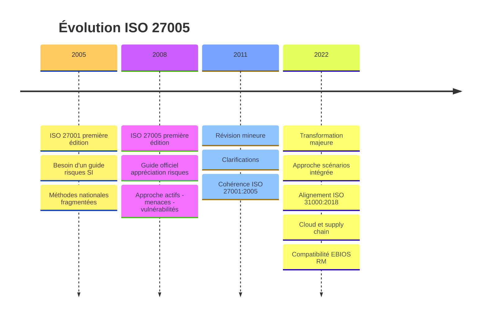
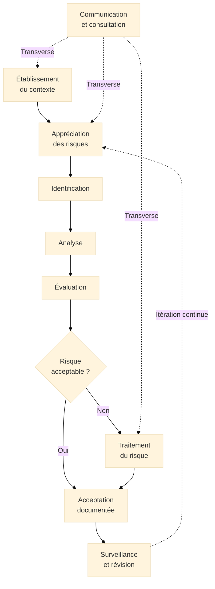
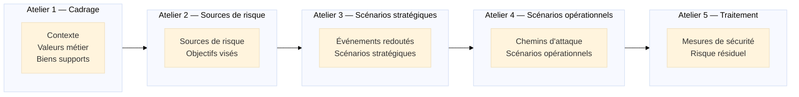
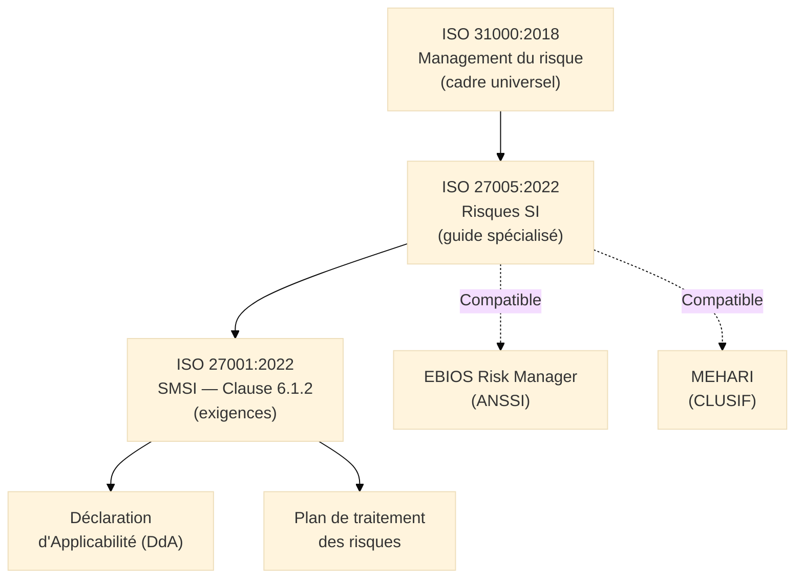
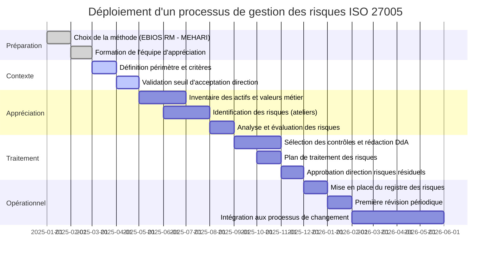

# ISO/IEC 27005:2022 — Gestion des Risques de Sécurité de l'Information

<div
  class="omny-meta"
  data-level="🟡 Intermédiaire & 🔴 Avancé"
  data-version="1.0"
  data-time="40-45 minutes">
</div>

## Introduction à la Gestion des Risques SI

!!! quote "Analogie pédagogique"
    _Imaginez un **actuaire dans une compagnie d'assurance**. Son travail n'est pas de dire "il y a un risque d'inondation" — n'importe qui peut l'affirmer. Son travail est de **quantifier** ce risque : quelle est la probabilité qu'une inondation survienne dans cette zone géographique au cours des 10 prochaines années ? Si elle survient, quel est le coût médian des dommages ? Quel est le coût du centile 99 ? Sur la base de ces calculs, il fixe les primes, définit les franchises et décide des exclusions. Sans cette rigueur analytique, l'assurance ne peut pas fonctionner — les primes seraient fixées au jugé, les sinistres non couverts. **ISO 27005 apporte cette même rigueur actuarielle à la sécurité de l'information**. Il ne dit pas "vous avez un risque de cyberattaque" — il structure le processus pour identifier précisément quels actifs sont exposés, à quelles menaces, avec quelle probabilité d'exploitation, et pour quel impact, afin de prendre des décisions de traitement proportionnées et défendables._

**ISO/IEC 27005** est le **guide international de gestion des risques de sécurité de l'information**. Publié en 2008, révisé en 2011 puis profondément refondu en 2022, il fournit les **lignes directrices pour le processus d'appréciation et de traitement des risques SI** en support des exigences de la clause 6.1.2 d'ISO 27001.

Contrairement à ISO 27001 (norme d'exigences certifiable), **ISO 27005 est un guide non certifiable** : il n'impose pas de méthode spécifique mais décrit les activités, les entrées, les sorties et les bonnes pratiques d'un processus de gestion des risques rigoureux. La méthode concrète — EBIOS Risk Manager, MEHARI ou toute autre — est laissée au choix de l'organisation.

!!! info "Pourquoi ISO 27005 est essentiel ?"
    ISO 27001 exige une appréciation des risques (clause 6.1.2) mais n'explique pas comment la réaliser. ISO 27005 comble ce gap en décrivant le processus complet. C'est la lecture indispensable pour tout RSSI qui doit construire et défendre un processus d'appréciation des risques rigoureux face à un auditeur de certification.

<br>

---

## Pour repartir des bases

### 1. Un guide, pas une norme certifiable

ISO 27005 utilise des formulations conseillantes ("devrait", "il est recommandé") — pas les formulations normatives d'ISO 27001 ("doit"). L'organisation n'est pas auditée sur sa conformité à ISO 27005 mais sur la qualité du processus de gestion des risques qu'elle a construit, quelle que soit la méthode utilisée.

> Ce qui est audité : l'existence d'un processus d'appréciation des risques documenté, reproductible et mis à jour. Ce n'est pas ISO 27005 qui est audité, c'est la clause 6.1.2 d'ISO 27001.

### 2. La révision majeure de 2022

ISO 27005:2022 marque une rupture avec les versions précédentes sur deux points fondamentaux :

**Abandon de l'approche actifs-menaces-vulnérabilités imposée :**  
_Les versions 2008 et 2011 décrivaient une méthode prescriptive en 3 étapes (inventaire des actifs, identification des menaces, identification des vulnérabilités). La version 2022 adopte une approche basée sur les **scénarios de risques**, plus proche de la réalité des menaces actuelles et compatible avec EBIOS Risk Manager._

**Alignement sur ISO 31000:2018 :**  
_La version 2022 aligne son cadre processuel sur ISO 31000 (management du risque générique) tout en conservant la spécificité du domaine de la sécurité de l'information._

### 3. Deux approches d'appréciation des risques

ISO 27005:2022 reconnaît et décrit deux approches complémentaires :

| Approche | Description | Avantages | Limites |
|----------|-------------|-----------|---------|
| **Basée sur les événements** | Identifier des événements redoutés et leurs causes possibles | Intuitive, orientée impacts métiers | Moins exhaustive sur les vecteurs d'attaque |
| **Basée sur les actifs** | Partir des actifs, identifier menaces et vulnérabilités associées | Exhaustive, traçable | Longue, risque de silotage |

> Ces deux approches ne sont pas mutuellement exclusives. EBIOS Risk Manager[^1] combine les deux : elle commence par les événements redoutés (approche événement) puis analyse les chemins d'attaque (approche actifs/vulnérabilités).

<br>

---

## Historique et évolutions

### Pourquoi ISO 27005 a été créée ?

Avant 2008, il n'existait pas de guide international standardisé pour l'appréciation des risques SI en support d'ISO 27001 :

- Les organisations utilisaient des méthodes propriétaires non reconnues
- Les méthodes nationales (EBIOS, MEHARI) n'étaient pas harmonisées
- Les auditeurs ISO 27001 manquaient d'un référentiel commun pour évaluer la qualité des appréciations

### Les trois versions majeures

=== "ISO/IEC 27005:2008 — Fondation"

    **Contexte :**  
    _Première version du guide, alignée sur ISO 27001:2005._

    **Innovations majeures :**

    - [x] Premier guide international de gestion des risques SI
    - [x] Processus structuré en 7 étapes : contexte, identification, analyse, évaluation, traitement, acceptation, communication
    - [x] Approche **actifs-menaces-vulnérabilités** formalisée
    - [x] Annexes sur les méthodes qualitatives et quantitatives

    > **Limite :** Approche très prescriptive sur la méthode (actifs/menaces/vulnérabilités), peu adaptée aux environnements cloud et aux attaques complexes multi-vecteurs.

=== "ISO/IEC 27005:2011 — Clarification"

    **Contexte :**  
    _Révision mineure visant à clarifier certaines sections et améliorer la cohérence avec ISO 27001:2005._

    **Évolutions clés :**

    - [x] Clarifications rédactionnelles
    - [x] Meilleure cohérence avec **ISO 27001:2005**
    - [x] Précisions sur la communication et la consultation

    > **Limite persistante :** Toujours centrée sur l'approche actifs/menaces/vulnérabilités, de plus en plus inadaptée à la sophistication des attaques.

=== "ISO/IEC 27005:2022 — Transformation"

    **Contexte :**  
    _Refonte majeure alignée sur ISO 27001:2022 et ISO 31000:2018, intégrant les nouvelles réalités des menaces cyber._

    **Innovations majeures :**

    - [x] **Approche par scénarios** intégrée comme alternative valide à l'approche actifs/menaces/vulnérabilités
    - [x] **Alignement sur ISO 31000:2018** : cadre processuel harmonisé
    - [x] **Meilleure compatibilité** avec EBIOS Risk Manager et les méthodes scénarios
    - [x] **Abandon de l'annexe prescriptive** sur la méthode — flexibilité accrue
    - [x] Intégration explicite des **risques liés à la supply chain** et au **cloud**

### Timeline ISO 27005


_La révision 2022 marque le passage d'une méthode prescriptive **actifs/menaces/vulnérabilités** à une approche flexible intégrant les **scénarios de risques** — une évolution qui rapproche ISO 27005 des pratiques actuelles de gestion des risques cyber._

<br>

---

## Les 7 composantes du processus

ISO 27005:2022 structure la gestion des risques SI en **7 composantes** articulées en un processus itératif et continu.

!!! note "Un processus, pas une liste de cases à cocher"
    Ces 7 composantes ne sont pas des étapes séquentielles à réaliser une fois par an. La communication et la consultation sont transverses à toutes les autres. La surveillance et la révision alimentent en permanence le cycle.

### Vue d'ensemble du processus


_Le processus est **itératif** : la surveillance alimente en permanence de nouveaux cycles d'appréciation. Un incident de sécurité, un changement d'infrastructure ou une nouvelle menace identifiée déclenchent une révision ciblée._

### Les 7 composantes expliquées

!!! note "Ci-dessous les 4 premières composantes"

=== "1️⃣ Établissement du contexte"

    **Définir le cadre dans lequel l'appréciation des risques sera réalisée.**

    L'établissement du contexte définit les paramètres qui guideront toutes les décisions ultérieures :

    - **Périmètre de l'appréciation** :  
      _Quels systèmes, quels processus, quels sites, quelles données sont concernés ? Le périmètre doit être cohérent avec le périmètre du SMSI._

    - **Critères d'appréciation des risques** :  
      _Comment évaluer la probabilité ? Comment évaluer l'impact (financier, réglementaire, réputationnel, opérationnel) ? Quelles échelles utiliser ?_

    - **Seuil d'acceptation des risques** :  
      _Au-delà de quel niveau de risque l'organisation juge-t-elle le risque inacceptable ? Ce seuil est approuvé par la direction._

    - **Appétit au risque**[^2] :  
      _Quel niveau de risque résiduel l'organisation est-elle prête à assumer après traitement ?_

    | Élément à définir | Exemples |
    |-------------------|----------|
    | Échelle de probabilité | Très faible / Faible / Moyen / Élevé / Très élevé |
    | Échelle d'impact | Négligeable / Modéré / Significatif / Majeur / Critique |
    | Seuil d'acceptation | Risques ≤ "Modéré" acceptables sans plan de traitement |
    | Méthode d'appréciation | Qualitative / Quantitative / Hybride |

=== "2️⃣ Identification des risques"

    **Identifier ce qui peut menacer la sécurité de l'information dans le périmètre défini.**

    L'identification repose selon l'approche choisie sur :

    **Approche basée sur les actifs :**

    - **Actifs primaires** :  
      _Informations (données clients, propriété intellectuelle, données médicales) et processus métiers critiques (facturation, production, soins)._

    - **Actifs de support** :  
      _Serveurs, postes de travail, réseaux, logiciels, locaux, personnel, fournisseurs._

    - **Menaces** associées à chaque actif :  
      _Intentionnelles (cyberattaque, espionnage, fraude interne), accidentelles (erreur humaine, panne), environnementales (incendie, inondation)._

    - **Vulnérabilités** exploitables :  
      _Techniques (CVE non patchées, configuration faible, absence de MFA), organisationnelles (procédure absente, accès non révoqués), physiques._

    **Approche basée sur les scénarios :**

    - Identifier des **événements redoutés** : "Exfiltration des données clients", "Chiffrement par ransomware du système de facturation", "Indisponibilité du SI pendant 72h"
    - Pour chaque événement redouté, identifier les **sources de risque** : groupes cybercriminels, employés malveillants, erreurs humaines
    - Construire des **scénarios d'attaque** : chemin emprunté par la source de risque pour provoquer l'événement redouté

    > Un risque mal identifié est un risque non traité. L'identification doit être **exhaustive** sur le périmètre défini — c'est la phase qui génère le plus de valeur dans un processus d'appréciation bien conduit.

=== "3️⃣ Analyse des risques"

    **Estimer la probabilité et l'impact de chaque risque identifié.**

    ISO 27005:2022 reconnaît trois méthodes d'analyse :

    **Analyse qualitative :**

    Évaluation sur des échelles descriptives — la méthode la plus répandue pour les SMSI.

    Exemple de matrice qualitative (5×5) :

    | | Impact Faible | Impact Modéré | Impact Élevé | Impact Critique |
    |--|---------------|---------------|--------------|-----------------|
    | **Prob. Très faible** | Négligeable | Faible | Modéré | Élevé |
    | **Prob. Faible** | Faible | Modéré | Élevé | Critique |
    | **Prob. Moyenne** | Modéré | Élevé | Critique | Critique |
    | **Prob. Élevée** | Élevé | Critique | Critique | Critique |
    | **Prob. Très élevée** | Critique | Critique | Critique | Critique |

    **Analyse quantitative :**

    Évaluation en valeurs numériques — utilisée pour les risques à fort enjeu financier.

    - **ALE** (*Annual Loss Expectancy*[^3]) = fréquence annuelle × perte par incident
    - **SLE** (*Single Loss Expectancy*[^4]) = valeur de l'actif × facteur d'exposition
    - **ARO** (*Annualized Rate of Occurrence*[^5]) = fréquence d'occurrence annuelle estimée

    **Analyse semi-quantitative :**

    Combinaison des deux approches — échelles qualitatives converties en scores numériques pour permettre des comparaisons et des agrégations.

=== "4️⃣ Évaluation des risques"

    **Comparer les risques analysés aux critères d'acceptation définis dans le contexte.**

    L'évaluation produit une **liste priorisée des risques** sur la base de leur niveau calculé :

    - Risques **au-dessus du seuil d'acceptation** → doivent être traités
    - Risques **sous le seuil d'acceptation** → peuvent être acceptés (avec documentation)
    - Risques **proches du seuil** → décision à soumettre à la direction

    L'évaluation est aussi l'étape où l'organisation décide de l'**ordre de traitement** : les risques critiques sont traités en priorité, les risques élevés ensuite, selon les ressources disponibles.

    !!! tip "L'importance du registre des risques"
        Tous les risques identifiés, analysés et évalués doivent être documentés dans un **registre des risques**[^6]. Ce registre est un document vivant, révisé régulièrement, qui constitue la mémoire organisationnelle du processus d'appréciation des risques. C'est le premier document demandé par un auditeur ISO 27001.

!!! note "Ci-dessous les 3 dernières composantes"

=== "5️⃣ Traitement des risques"

    **Sélectionner et mettre en œuvre les options de traitement pour chaque risque inacceptable.**

    ISO 27005 définit quatre options de traitement :

    - **Modifier (Réduire)** :  
      _Déployer des contrôles de sécurité (Annexe A d'ISO 27001) pour réduire la probabilité d'occurrence et/ou l'impact. C'est l'option la plus fréquente._

    - **Transférer (Partager)** :  
      _Partager le risque avec un tiers : assurance cyber, contrat de responsabilité avec un fournisseur, externalisation._

    - **Éviter** :  
      _Renoncer à l'activité qui génère le risque si son niveau est inacceptable et si aucun traitement ne permet de le ramener sous le seuil d'acceptation._

    - **Accepter** :  
      _Décision consciente et approuvée par la direction de ne pas traiter un risque dont le niveau est jugé acceptable ou dont le coût de traitement est disproportionné._

    Pour chaque risque traité, l'organisation doit :

    1. Sélectionner les contrôles appropriés (référencés dans la DdA[^7])
    2. Documenter le **risque résiduel**[^8] attendu après traitement
    3. Faire **approuver le risque résiduel** par la direction
    4. Intégrer les contrôles dans le **plan de traitement des risques**

    ```mermaid
    ---
    config:
      theme: "base"
    ---
    flowchart LR
        RSK["Risque\nidentifié"] --> OPT{"Option de\ntraitement"}
        OPT -->|Modifier| CTR["Contrôles\nAnnexe A"]
        OPT -->|Transférer| TRF["Assurance\ncyber - Contrat"]
        OPT -->|Éviter| EVI["Arrêt\nde l'activité"]
        OPT -->|Accepter| ACC["Acceptation\ndocumentée"]
        CTR --> RES["Risque résiduel\nà évaluer"]
        TRF --> RES
        RES --> VAL{"Résiduel\nacceptable ?"}
        VAL -->|Oui| APR["Approbation\ndirection"]
        VAL -->|Non| OPT
    ```
    _Le risque résiduel est le niveau de risque qui subsiste après application des contrôles. Si le risque résiduel reste supérieur au seuil d'acceptation, un traitement complémentaire est nécessaire ou l'organisation doit formellement accepter ce risque résiduel avec approbation de la direction._

=== "6️⃣ Communication et consultation"

    **Composante transverse : assurer le partage d'informations sur les risques à toutes les étapes.**

    La communication et la consultation sont présentes à chaque étape du processus :

    - **En phase de contexte** :  
      _Partager avec la direction les critères d'acceptation et l'appétit au risque. Valider le périmètre avec les responsables métiers._

    - **En phase d'identification** :  
      _Consulter les opérationnels pour identifier les risques invisibles depuis le niveau stratégique. Impliquer les propriétaires d'actifs._

    - **En phase de traitement** :  
      _Communiquer les risques aux responsables des contrôles à déployer. Informer la direction des risques résiduels à approuver._

    - **En phase de surveillance** :  
      _Reporter régulièrement sur l'évolution des risques. Alerter en cas de dépassement du seuil d'acceptation._

    !!! tip "Reporting risques à la direction"
        La direction doit recevoir une **vue synthétique des risques** (top 10 risks, cartographie) — pas le registre des risques complet. Elle valide les seuils d'acceptation, approuve les risques résiduels majeurs, et alloue les ressources pour le traitement.

=== "7️⃣ Surveillance et révision"

    **Surveiller l'évolution des risques et réviser l'appréciation en fonction des changements.**

    La surveillance et la révision couvrent :

    - **Surveillance des risques connus** :  
      _Vérifier que les risques identifiés n'ont pas évolué (nouvelles vulnérabilités, changement d'exposition, nouveaux incidents)._

    - **Détection de nouveaux risques** :  
      _Identifier les risques émergents : nouvelles menaces (CVE critiques, nouveaux groupes d'attaquants), nouvelles vulnérabilités organisationnelles._

    - **Révision déclenchée par des événements** :  
      _Tout changement significatif déclenche une révision ciblée : nouveau système, nouvelle réglementation, incident de sécurité, changement de fournisseur critique._

    - **Révision périodique** :  
      _Au minimum annuellement, l'appréciation des risques est revue dans son ensemble pour s'assurer qu'elle reste à jour et reflète la réalité du périmètre._

    | Déclencheur | Type de révision | Urgence |
    |-------------|------------------|---------|
    | CVE critique exploitée publiquement | Ciblée sur les actifs concernés | Immédiate |
    | Nouveau système mis en production | Ciblée sur le nouveau périmètre | Avant mise en prod |
    | Incident de sécurité majeur | Ciblée sur le vecteur d'attaque | Sous 30 jours |
    | Nouvelle réglementation | Ciblée sur les exigences | Avant mise en conformité |
    | Révision annuelle du SMSI | Complète | Annuelle |

<br>

---

## Méthodes d'appréciation des risques

### Méthodes qualitatives

La méthode qualitative est la plus répandue dans les SMSI. Elle utilise des **échelles descriptives** pour évaluer probabilité et impact.

**Avantages :**
- Rapide à mettre en œuvre
- Accessible aux non-spécialistes
- Permet l'implication des métiers

**Limites :**
- Résultats difficiles à agréger et comparer
- Subjectivité dans l'attribution des niveaux
- Ne permet pas de calculer un ROI[^9] des contrôles

### Méthodes quantitatives

Les méthodes quantitatives expriment les risques en **valeurs monétaires**. Elles sont utilisées pour les risques à fort enjeu financier ou pour justifier des investissements de sécurité importants.

**Formules fondamentales :**

- **ALE** = **ARO** × **SLE**  
  _Perte annuelle attendue = fréquence annuelle × perte par occurrence_

- **SLE** = Valeur de l'actif × Facteur d'exposition  
  _Perte par occurrence = valeur de l'actif × pourcentage d'exposition estimé_

**Exemple :**  
_Un serveur d'ERP valorisé à 500 000 € (données + coût de reconstruction) avec un facteur d'exposition de 40% en cas d'incident majeur : SLE = 200 000 €. Si la fréquence estimée est de 0,2 par an (une fois tous les 5 ans) : ALE = 40 000 €/an._

> Un contrôle de sécurité est **économiquement justifié** si son coût annuel (ROSI[^10]) est inférieur à la réduction d'ALE qu'il génère.

**Limites :**
- Données statistiques difficiles à obtenir pour les cyberrisques
- Estimations souvent subjectives malgré l'apparence de précision
- Peut créer une fausse impression de précision

### Méthodes semi-quantitatives

La méthode semi-quantitative combine les deux approches :

1. Utiliser des **échelles qualitatives** pour évaluer probabilité et impact
2. Attribuer des **scores numériques** à chaque niveau de l'échelle
3. **Multiplier** ou **agréger** les scores pour obtenir une note de risque
4. Classer les risques par score décroissant

**Avantage :** Permet de trier et d'agréger les risques tout en restant accessible. C'est l'approche la plus courante dans les grandes organisations.

<br>

---

## Relation avec les méthodes françaises

ISO 27005 est **compatible** avec les principales méthodes d'appréciation des risques SI utilisées en France.

### EBIOS Risk Manager (ANSSI)

**EBIOS Risk Manager** (EBIOS RM)[^1] est la méthode de gestion des risques SI publiée et maintenue par l'ANSSI. Elle est pleinement alignée avec ISO 27005:2022 et constitue l'implémentation de référence en France.


_EBIOS RM structure la gestion des risques en 5 ateliers collaboratifs. Sa principale innovation est l'**approche par scénarios** : elle part des sources de risque réelles (groupes d'attaquants, employés malveillants, concurrents) pour construire des chemins d'attaque réalistes jusqu'aux événements redoutés par l'organisation._

**Correspondance EBIOS RM / ISO 27005 :**

| EBIOS RM | ISO 27005:2022 |
|----------|----------------|
| Atelier 1 — Cadrage et socle de sécurité | Établissement du contexte |
| Atelier 2 — Sources de risque | Identification des risques (sources) |
| Atelier 3 — Scénarios stratégiques | Identification des risques (événements) |
| Atelier 4 — Scénarios opérationnels | Analyse des risques |
| Atelier 5 — Traitement | Traitement des risques |

### MEHARI (CLUSIF)

**MEHARI** (*Méthode Harmonisée d'Analyse des Risques*)[^11] est la méthode développée par le CLUSIF. Elle est particulièrement adaptée aux revues périodiques des risques dans les grandes organisations disposant d'un référentiel de risques établi.

| Caractéristique | EBIOS RM | MEHARI | ISO 27005 pur |
|-----------------|----------|--------|---------------|
| Approche | Scénarios d'attaque | Questionnaires + base de risques | Flexible |
| Orientation | Cyber-attaques réalistes | Revue exhaustive des risques | Cadre général |
| Recommandé par | ANSSI | CLUSIF | ISO |
| Compatibilité NIS2 | Explicite | Oui | Oui |
| Courbe d'apprentissage | Modérée | Élevée | Variable |

<br>

---

## Articulation avec d'autres normes

### Positionnement d'ISO 27005


_ISO 31000 fournit le cadre universel de management du risque. ISO 27005 le spécialise pour la sécurité de l'information. ISO 27001 exige son application via la clause 6.1.2. Les méthodes françaises (EBIOS RM, MEHARI) en sont des implémentations concrètes._

### Comparaison avec les standards de gestion des risques

| Standard | Domaine | Relation avec ISO 27005 | Certifiable |
|----------|---------|------------------------|-------------|
| **ISO 31000:2018** | Management du risque générique | Cadre parent — ISO 27005 en est une déclinaison | Non |
| **ISO 27001:2022** | SMSI — Exigences | ISO 27005 guide la réalisation de la clause 6.1.2 | Oui |
| **EBIOS Risk Manager** | Risques cyber France | Méthode d'implémentation compatible ISO 27005 | Non |
| **MEHARI** | Risques SI France | Méthode d'implémentation compatible ISO 27005 | Non |
| **FAIR** | Risques cyber quantitatifs | Méthode quantitative compatible ISO 27005 | Non |
| **OCTAVE** | Risques SI (USA) | Méthode d'implémentation alternative | Non |

<br>

---

## Bénéfices de l'approche ISO 27005

### Pour les organisations

<div class="grid cards" markdown>

-   :lucide-check-circle:{ .lg .middle } **Appréciation des risques défendable en audit**

    ---
    Un processus documenté, structuré selon ISO 27005 résiste à l'examen des auditeurs de certification ISO 27001. Il démontre que les contrôles sélectionnés sont proportionnés aux risques identifiés.

-   :lucide-trending-up:{ .lg .middle } **Allocation optimale des ressources sécurité**

    ---
    Connaître précisément les risques permet de concentrer les investissements sur les contrôles qui réduisent les risques les plus critiques — pas sur ceux qui sont les plus visibles ou les plus "à la mode".

-   :lucide-shield-check:{ .lg .middle } **Base pour les décisions de direction**

    ---
    Un risque quantifié (financièrement ou par niveau) peut être présenté à la direction pour une décision éclairée d'acceptation ou de traitement. Un risque vague ne peut pas être géré.

-   :lucide-refresh-cw:{ .lg .middle } **Processus vivant, pas exercice annuel**

    ---
    Un registre des risques maintenu en continu et révisé à chaque changement significatif offre une vision en temps réel de l'exposition réelle de l'organisation.

</div>

### Pour les RSSI

<div class="grid cards" markdown>

-   :lucide-message-circle:{ .lg .middle } **Légitimité des demandes de budget**

    ---
    "Nous avons un risque de ransomware" est moins convaincant que "le risque de ransomware génère une exposition annuelle de X€ ; ce contrôle réduit ce risque de 60% pour un coût de Y€/an". ISO 27005 donne les outils pour ce discours.

-   :lucide-bar-chart-2:{ .lg .middle } **Traçabilité des décisions de sécurité**

    ---
    Le registre des risques documente pourquoi chaque décision de sécurité a été prise. En cas d'incident, l'organisation peut démontrer qu'elle avait identifié, évalué et traité les risques selon un processus rigoureux.

</div>

<br>

---

## Mise en œuvre pratique

### Étapes clés de déploiement



### Écueils à éviter

!!! warning "Pièges courants"

    **Appréciation des risques réalisée uniquement par l'équipe IT :**  
    _Une appréciation sans implication des directions métiers produit une vision purement technique déconnectée des enjeux business. Les impacts métiers d'un incident SI sont mieux estimés par les responsables métiers que par les équipes IT._

    **Critères d'acceptation définis après l'appréciation :**  
    _Définir les seuils d'acceptation après avoir calculé les niveaux de risque revient à ajuster les critères pour que les risques semblent acceptables. Les critères doivent être définis avant l'appréciation._

    **Registre des risques traité comme un document statique :**  
    _Un registre mis à jour uniquement avant l'audit annuel ne reflète pas la réalité. Les changements technologiques, organisationnels et les nouvelles menaces doivent déclencher des révisions ciblées._

    **Confondre vulnérabilité et risque :**  
    _Une vulnérabilité (CVE critique non patchée) n'est pas un risque. C'est un facteur de risque. Le risque naît de la combinaison de la vulnérabilité, d'une menace capable de l'exploiter, et d'un actif exposé._

    **Risques résiduels non approuvés par la direction :**  
    _La direction doit formellement approuver les risques résiduels après traitement. Sans cette approbation, la responsabilité du RSSI n'est pas protégée en cas d'incident._

### Facteurs clés de succès

- [x] **Critères d'acceptation définis** avant toute appréciation, validés par la direction
- [x] **Ateliers d'identification** impliquant les propriétaires d'actifs et responsables métiers
- [x] **Méthode choisie** (EBIOS RM ou autre) maîtrisée par l'équipe qui conduit l'appréciation
- [x] **Registre des risques** maintenu, versionné et accessible aux parties prenantes autorisées
- [x] **Révisions déclenchées** systématiquement par les changements significatifs
- [x] **Approbation formelle** de la direction sur les risques résiduels majeurs

<br>

---

## Perspectives et évolutions

### ISO 27005 face aux enjeux émergents

**Risques liés à l'Intelligence Artificielle :**  
_Les systèmes d'IA introduisent de nouvelles menaces à intégrer dans l'appréciation des risques : empoisonnement des données d'entraînement, prompt injection exposant des données confidentielles, biais algorithmiques dans les systèmes de détection d'anomalies. Les actifs "modèles d'IA" et "données d'entraînement" doivent être intégrés aux inventaires._

**Risques de la supply chain logicielle :**  
_Les attaques via les dépendances open source (Log4Shell, XZ Utils) ou les logiciels éditeurs (SolarWinds) imposent d'intégrer les actifs logiciels tiers dans l'appréciation des risques, avec une analyse spécifique des risques de compromission via la chaîne d'approvisionnement._

**Risques quantiques :**  
_L'émergence de l'informatique quantique menace les algorithmes de chiffrement asymétriques actuels. Les organisations détenant des données à longue durée de vie (secrets d'État, données de santé, propriété intellectuelle) doivent anticiper le risque "Harvest Now, Decrypt Later" (HNDL[^12]) dans leur appréciation des risques._

**Évolution vers les méthodes scénarios :**  
_ISO 27005:2022 a intégré l'approche scénarios en alternative à l'approche actifs/menaces/vulnérabilités. Cette tendance devrait se renforcer : les approches scénarios (EBIOS RM, MITRE ATT&CK-based) sont mieux adaptées aux attaques sophistiquées multi-vecteurs que les approches par inventaire d'actifs._

<br>

---

## Conclusion

!!! quote "Un risque non quantifié est un risque non géré."
    ISO 27005:2022 incarne une vérité que tout praticien de la sécurité de l'information finit par apprendre : il est impossible de tout protéger de la même façon. Les ressources sont limitées, les menaces sont multiples, et chaque contrôle de sécurité a un coût. La gestion des risques est l'art de **concentrer les efforts sur ce qui compte vraiment**, fondé sur une analyse rigoureuse plutôt que sur l'intuition ou la peur.

    Le processus décrit par ISO 27005 n'est pas bureaucratique : c'est le minimum de rigueur nécessaire pour qu'une décision de sécurité soit défendable. Quand un incident survient — et il surviendra — l'organisation qui dispose d'un registre des risques à jour, d'une DdA justifiée et de risques résiduels approuvés par la direction est dans une position fondamentalement différente de celle qui ne peut pas expliquer pourquoi elle a déployé certains contrôles plutôt que d'autres.

    La révision 2022 rapproche ISO 27005 des réalités actuelles en intégrant l'approche scénarios, compatible avec EBIOS Risk Manager. Pour les organisations françaises soumises à NIS2, DORA ou HDS, combiner ISO 27005 comme cadre et EBIOS RM comme méthode d'implémentation est la trajectoire la plus cohérente et la mieux reconnue par les régulateurs et les organismes de certification.

    > La prochaine étape logique est d'explorer **EBIOS Risk Manager** en détail — la méthode française recommandée par l'ANSSI qui implémente concrètement le processus décrit par ISO 27005 en 5 ateliers structurés.

<br>

---

## Ressources complémentaires

### Documents officiels ISO

- **ISO/IEC 27005:2022** — Gestion des risques liés à la sécurité de l'information
- **ISO/IEC 27001:2022** — Exigences du SMSI (certification)
- **ISO 31000:2018** — Management du risque — Lignes directrices

### Méthodes d'implémentation

- **EBIOS Risk Manager** — ANSSI : cyber.gouv.fr/la-methode-ebios-risk-manager
- **MEHARI** — CLUSIF : clusif.fr/nos-productions/mehari
- **FAIR** : fairinstitute.org (méthode quantitative)
- **OCTAVE Allegro** : sei.cmu.edu (Carnegie Mellon)

### Références complémentaires

- **MITRE ATT&CK** : attack.mitre.org (base de connaissances des techniques d'attaque)
- **CERT-FR** : cert.ssi.gouv.fr (alertes et bulletins de sécurité ANSSI)
- **ENISA Threat Landscape** : enisa.europa.eu (panorama annuel des menaces EU)


[^1]: **EBIOS Risk Manager** (*Expression des Besoins et Identification des Objectifs de Sécurité*) est la méthode de gestion des risques SI publiée et maintenue par l'ANSSI (Agence Nationale de la Sécurité des Systèmes d'Information). Elle est basée sur l'analyse de scénarios d'attaque réalistes et constitue la méthode de référence recommandée en France pour satisfaire aux exigences d'ISO 27001 et de NIS2.
[^2]: L'**appétit au risque** est le niveau de risque global qu'une organisation est prête à accepter dans la poursuite de ses objectifs. Il est défini par la direction et constitue le cadre dans lequel le seuil d'acceptation des risques est fixé. Un appétit au risque élevé signifie que l'organisation accepte de prendre plus de risques pour saisir des opportunités ; un appétit faible indique une aversion au risque.
[^3]: L'**ALE** (*Annual Loss Expectancy*, ou Perte Annuelle Attendue) est la valeur monétaire attendue de la perte générée par un risque sur une période d'un an. Elle est calculée en multipliant la fréquence annuelle d'occurrence estimée (ARO) par la perte estimée en cas d'occurrence (SLE).
[^4]: Le **SLE** (*Single Loss Expectancy*, ou Perte par Occurrence) est la valeur monétaire estimée de la perte générée par une occurrence unique du risque. Il est calculé en multipliant la valeur de l'actif par le facteur d'exposition (pourcentage de l'actif affecté en cas d'incident).
[^5]: L'**ARO** (*Annualized Rate of Occurrence*, ou Taux Annuel d'Occurrence) est la fréquence estimée à laquelle un événement de sécurité est susceptible de se produire sur une période d'un an. Par exemple, un ARO de 0,5 signifie qu'on estime une occurrence tous les deux ans.
[^6]: Un **registre des risques** (*risk register*) est un document central qui répertorie tous les risques identifiés lors du processus d'appréciation, avec leurs caractéristiques (description, probabilité, impact, niveau de risque, traitement choisi, contrôles déployés, risque résiduel, propriétaire du risque, état). C'est la mémoire organisationnelle du processus de gestion des risques.
[^7]: La **DdA** (*Déclaration d'Applicabilité*) est le document obligatoire d'ISO 27001 qui liste les 93 contrôles de l'Annexe A, indiquant pour chacun s'il est inclus ou exclu du SMSI et justifiant cette décision sur la base du processus d'appréciation des risques décrit dans ISO 27005.
[^8]: Le **risque résiduel** est le niveau de risque qui subsiste après que les contrôles de sécurité ont été déployés pour traiter le risque identifié. Le risque résiduel doit être évalué et formellement accepté par la direction avant que le processus de traitement soit considéré comme complet.
[^9]: Le **ROI** (*Return on Investment*, ou Retour sur Investissement) mesure la rentabilité d'un investissement. En sécurité, on parle de **ROSI** (*Return on Security Investment*) pour évaluer si le coût d'un contrôle de sécurité est justifié par la réduction de risque qu'il procure.
[^10]: Le **ROSI** (*Return on Security Investment*) est la mesure de la valeur générée par un investissement en sécurité de l'information. Il se calcule comme la réduction d'ALE générée par le contrôle, diminuée du coût annuel du contrôle. Un ROSI positif indique que l'investissement est économiquement justifié.
[^11]: **MEHARI** (*Méthode Harmonisée d'Analyse des Risques*) est la méthode de gestion des risques SI développée par le CLUSIF (*Club de la Sécurité de l'Information Français*). Elle s'appuie sur une base de connaissances des risques et des scénarios, et est particulièrement adaptée aux organisations disposant déjà d'un référentiel de sécurité établi et souhaitant réaliser des revues périodiques de leurs risques.
[^12]: **HNDL** (*Harvest Now, Decrypt Later*) est une stratégie d'attaque qui consiste à collecter et stocker aujourd'hui des données chiffrées avec les algorithmes actuels (RSA, ECC), en anticipant que l'informatique quantique permettra de les déchiffrer dans le futur. Cette menace est particulièrement préoccupante pour les données à longue durée de vie (secrets d'État, données de santé, propriété intellectuelle stratégique).

<br>

---

## Conclusion

!!! quote "Ce qu'il faut retenir"
    Les normes et référentiels ne sont pas des contraintes administratives, mais des cadres structurants. Ils garantissent que la cybersécurité s'aligne sur les objectifs métiers de l'organisation et offre une assurance raisonnable face aux risques.

> [Retour à l'index de la gouvernance →](../../index.md)
