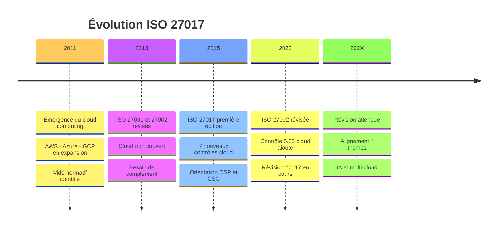
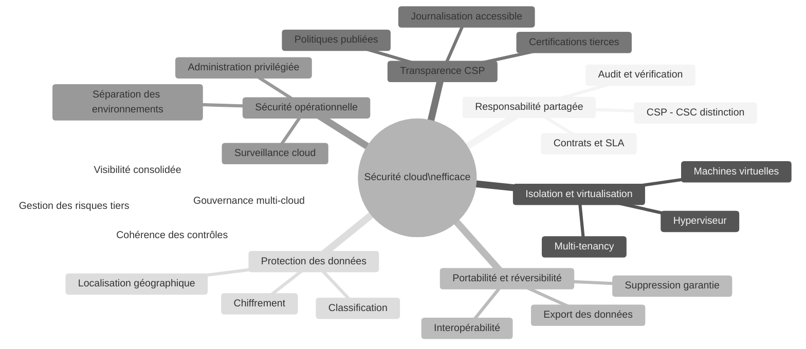
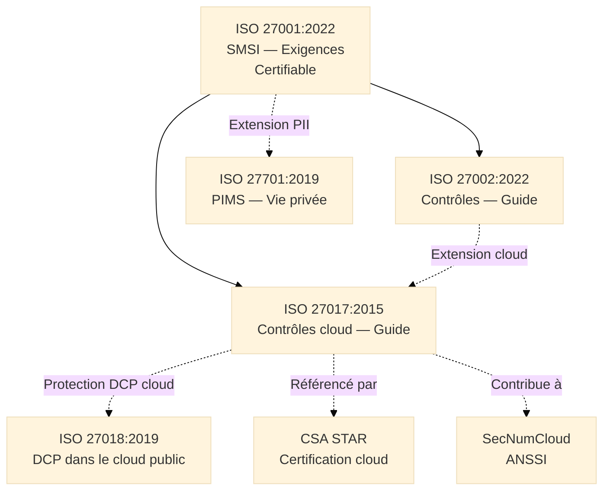
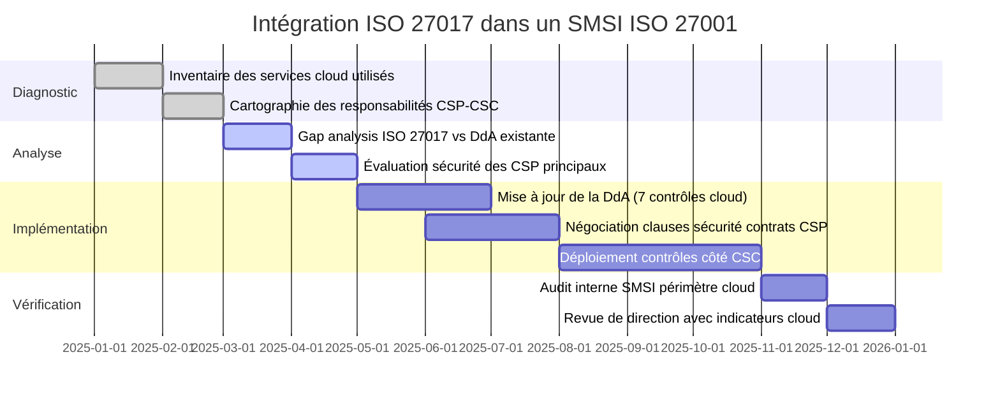

# ISO/IEC 27017:2015 — Sécurité de l'Information pour les Services Cloud

## Introduction à la Sécurité Cloud

!!! quote "Analogie pédagogique"
    _Imaginez un **grand entrepôt logistique mutualisé** qui stocke les marchandises de 5 000 entreprises clientes. Le gestionnaire de l'entrepôt (le fournisseur cloud) est responsable de la sécurité du bâtiment — caméras, gardiens, systèmes anti-incendie, accès biométrique aux zones de stockage. Mais chaque entreprise cliente (le client cloud) reste responsable de la qualité des emballages de ses propres marchandises, de leur inventaire, de la liste des personnes autorisées à y accéder, et de la façon dont elle récupère ses biens à la fin du contrat. Si une caisse mal emballée tombe et endommage les marchandises voisines, c'est la responsabilité du client — pas celle du gestionnaire de l'entrepôt. **ISO 27017 formalise précisément ce partage des responsabilités** : pour chaque contrôle de sécurité, il définit ce qui incombe au fournisseur cloud, ce qui incombe au client cloud, et ce qui doit faire l'objet d'une coordination explicite entre les deux parties._

**ISO/IEC 27017:2015** est le **guide international de mise en œuvre des contrôles de sécurité de l'information pour les services cloud**. Il étend ISO 27002 en fournissant, pour chaque contrôle pertinent, des orientations supplémentaires adaptées aux spécificités des environnements cloud, et ajoute **7 contrôles entièrement nouveaux** qui n'ont pas d'équivalent dans ISO 27002 — car ils couvrent des situations propres aux architectures cloud sans précédent dans les environnements sur site.

ISO 27017 est applicable à la fois aux **fournisseurs de services cloud** (CSP[^1]) et aux **clients de services cloud** (CSC[^2]), en distinguant systématiquement les responsabilités de chaque partie pour chaque contrôle.

!!! info "Pourquoi ISO 27017 est essentiel ?"
    L'adoption massive du cloud a créé une zone grise de responsabilité que ni ISO 27001 ni ISO 27002 ne couvrent suffisamment : qui est responsable de quoi quand les données d'un client transitent dans l'infrastructure d'un fournisseur ? ISO 27017 répond à cette question contrôle par contrôle, rendant les audits de sécurité cloud défendables et les contrats de service vérifiables.

 

---

## Pour repartir des bases

### 1. Un guide non certifiable, mais structurant

ISO 27017 est un **guide de bonnes pratiques** — il utilise des formulations conseillantes ("devrait") et non des exigences normatives ("doit"). Il n'est pas certifiable de manière autonome.

Son usage principal est double :

- **Pour les CSP** : alimenter la Déclaration d'Applicabilité (DdA) du SMSI avec des orientations d'implémentation spécifiques au cloud, et démontrer aux clients la maturité de leurs contrôles de sécurité
- **Pour les CSC** : évaluer les fournisseurs cloud, structurer les audits de sécurité des services SaaS/PaaS/IaaS achetés, et compléter leur propre DdA avec les contrôles côté client

> Plusieurs programmes de certification cloud (ISO 27001 avec extension cloud, CSA STAR[^3]) référencent explicitement ISO 27017 comme guide d'implémentation attendu. Le posséder dans son référentiel est un différenciateur lors des audits clients et des appels d'offres.

### 2. Le modèle de responsabilité partagée

Le concept fondateur d'ISO 27017 est la **distinction systématique des responsabilités** entre CSP et CSC. Pour chaque contrôle de sécurité applicable au cloud, la norme précise :

| Partie | Responsabilités typiques |
|--------|--------------------------|
| **CSP** | Infrastructure physique, hyperviseur, réseau sous-jacent, résilience de la plateforme, sécurité du personnel d'exploitation |
| **CSC** | Configuration des services cloud achetés, gestion des identités et accès, classification et protection des données, sécurité des applications déployées |
| **Partagées** | Journalisation et surveillance, gestion des incidents, continuité d'activité, gestion des changements |

> Ce partage varie selon le modèle de service. En **IaaS**[^4], le CSC assume plus de responsabilités (jusqu'au système d'exploitation). En **SaaS**[^5], le CSP en assume davantage. En **PaaS**[^6], le partage est intermédiaire. ISO 27017 s'applique aux trois modèles en adaptant les orientations au niveau de contrôle accessible au CSC.

### 3. Les 7 nouveaux contrôles cloud

ISO 27017 ajoute 7 contrôles qui n'existent pas dans ISO 27002 car ils sont propres aux environnements cloud :

| Contrôle | Titre | Partie concernée |
|----------|-------|------------------|
| **CLD 6.3.1** | Relations dans l'environnement cloud | CSP et CSC |
| **CLD 8.1.5** | Suppression des actifs dans le cloud | CSP et CSC |
| **CLD 9.5.1** | Isolation de l'environnement informatique virtuel | CSP |
| **CLD 9.5.2** | Machines virtuelles renforcées | CSP |
| **CLD 12.1.5** | Sécurité opérationnelle de l'administrateur | CSP |
| **CLD 12.4.5** | Surveillance des services cloud | CSP et CSC |
| **CLD 13.1.4** | Alignement de la sécurité réseau virtuel | CSP |

 

---

## Historique et évolutions

### Pourquoi ISO 27017 a été créée ?

Avant 2015, le cloud s'était imposé comme infrastructure dominante sans cadre de sécurité international adapté :

- ISO 27001 et ISO 27002 avaient été conçus pour des environnements sur site et ne traitaient pas les spécificités cloud
- Les fournisseurs cloud produisaient leurs propres frameworks propriétaires (AWS Shared Responsibility Model, Azure Security Benchmark) sans référentiel commun
- Les clients cloud ne disposaient d'aucun référentiel standardisé pour auditer leurs fournisseurs
- La question du multi-tenancy[^7], de l'isolation des environnements virtuels et de la portabilité des données restait sans réponse normative

!!! note "Besoin identifié"
    Créer un **guide international** couvrant les spécificités de sécurité des services cloud, applicable simultanément aux fournisseurs et aux clients, et aligné sur ISO 27002 pour faciliter son intégration dans les SMSI existants.

### Les versions de la norme

=== "ISO/IEC 27017:2015 — Première édition"

    **Contexte :**  
    _Publiée en décembre 2015, simultanément à la refonte d'ISO 27001:2013 et ISO 27002:2013._

    **Innovations majeures :**

    - [x] Premier guide international de sécurité spécifiquement dédié au cloud
    - [x] **7 nouveaux contrôles** cloud sans équivalent dans ISO 27002
    - [x] Orientation double : CSP **et** CSC traités dans le même document
    - [x] Structure miroir d'ISO 27002:2013 (14 domaines, 114 contrôles) pour faciliter l'intégration
    - [x] Adoption par le programme **CSA STAR**[^3] comme référentiel de référence

    > La norme est en cours de révision pour s'aligner sur ISO 27002:2022 (4 thèmes, 93 contrôles). La version 2015 reste la référence officielle à ce jour.

### Timeline ISO 27017

_La révision d'ISO 27002:2022 a intégré un premier contrôle cloud natif (5.23) — ce qui anticipe la prochaine révision d'ISO 27017 qui devra s'aligner sur la nouvelle structure en 4 thèmes._

 

---

## Les 7 concepts fondateurs

ISO 27017:2015 repose sur **7 concepts fondateurs** qui structurent son approche de la sécurité cloud.

!!! note "Des concepts propres au cloud"
    Ces concepts reflètent les spécificités des environnements cloud qui n'avaient pas d'équivalent dans les normes antérieures : la responsabilité partagée, la virtualisation, le multi-tenancy et la portabilité des données.

### Vue d'ensemble

### Les 7 concepts expliqués

!!! note "Ci-dessous les 4 premiers concepts"

=== "1️⃣ Responsabilité partagée"

    **La sécurité dans le cloud est une responsabilité distribuée entre le CSP et le CSC — jamais entièrement d'un seul côté.**

    ISO 27017 formalise cette distribution pour chaque contrôle applicable :

    - **Responsabilités du CSP** :  
      _Sécurité physique des datacenters, hyperviseur, réseau sous-jacent, disponibilité de l'infrastructure, sécurité du personnel d'exploitation._

    - **Responsabilités du CSC** :  
      _Configuration des services achetés, gestion des identités, classification des données, sécurité des applications déployées, conformité réglementaire de l'usage._

    - **Responsabilités partagées** :  
      _Journalisation, gestion des incidents, continuité, gestion des vulnérabilités dans la zone de recouvrement._

    !!! warning "Le risque de la zone grise"
        Les incidents de sécurité cloud surviennent fréquemment dans les **zones de responsabilité floues** — là où le CSC croit que le CSP est responsable, et vice versa. ISO 27017 élimine cette ambiguïté en documentant explicitement chaque frontière.

=== "2️⃣ Isolation et multi-tenancy"

    **Dans un environnement partagé, l'isolation entre clients doit être garantie à tous les niveaux de la pile technologique.**

    Le multi-tenancy[^7] est la caractéristique fondamentale qui distingue le cloud de l'hébergement traditionnel. ISO 27017 couvre l'isolation à chaque couche :

    - **Isolation réseau** :  
      _VLAN, SDN[^8], groupes de sécurité — garantir qu'aucun trafic d'un tenant ne peut atteindre un autre tenant._

    - **Isolation compute** :  
      _Hyperviseur durci, machines virtuelles renforcées, pas de partage de mémoire entre tenants._

    - **Isolation données** :  
      _Chiffrement des données au repos avec des clés différentes par tenant, pas de mélange de données dans les systèmes de stockage._

    - **Isolation administrative** :  
      _Les administrateurs CSP accédant à l'infrastructure ne peuvent pas accéder aux données d'un tenant spécifique sans autorisation._

=== "3️⃣ Portabilité et réversibilité"

    **Le client cloud doit pouvoir récupérer ses données et migrer vers un autre fournisseur sans dépendance irréversible.**

    La portabilité et la réversibilité couvrent trois dimensions :

    - **Export des données** :  
      _Le CSC peut exporter ses données dans des formats standards et interopérables, sans transformation propriétaire._

    - **Suppression garantie** :  
        _À la fin du contrat, toutes les copies des données du CSC — y compris les sauvegardes et les répliques — sont supprimées de manière irréversible et attestée._

    - **Continuité de service** :  
      _Des procédures documentées permettent au CSC de migrer ses services vers un autre fournisseur ou de les rapatrier en interne (on-premise) dans un délai raisonnable._

    > Le RGPD renforce cette exigence : le droit à l'effacement et à la portabilité des données personnelles s'appliquent directement aux données hébergées chez un CSP, qui doit être en mesure de les mettre en œuvre.

=== "4️⃣ Transparence du fournisseur cloud"

    **Le CSC doit pouvoir vérifier les mesures de sécurité du CSP sans accès direct à son infrastructure.**

    La transparence du CSP prend plusieurs formes :

    - **Certifications et audits tiers** :  
      _ISO 27001, SOC 2, CSA STAR, SecNumCloud — preuves indépendantes de la maturité sécurité._

    - **Documentation publiée** :  
      _Politiques de sécurité, livre blanc de sécurité, matrice de responsabilités partagées._

    - **Journaux accessibles** :  
      _Le CSC accède aux journaux de ses propres activités cloud pour surveiller, détecter et investiguer._

    - **Notification d'incidents** :  
      _Le CSP notifie le CSC en cas d'incident affectant ses données, dans des délais compatibles avec les obligations réglementaires (72h RGPD)._

!!! note "Ci-dessous les 3 derniers concepts"

=== "5️⃣ Sécurité opérationnelle cloud"

    **Les opérations d'administration de l'infrastructure cloud doivent être soumises aux mêmes contrôles que les environnements critiques.**

    Les contrôles opérationnels spécifiques au cloud couvrent :

    - **Accès administrateur CSP** :  
      _Les administrateurs de la plateforme cloud qui peuvent accéder à l'infrastructure sous-jacente doivent être soumis à des contrôles stricts : authentification forte, journalisation exhaustive, revues d'accès, habilitations._

    - **Séparation des environnements** :  
      _Développement, test et production doivent être isolés — dans le cloud comme on-premise._

    - **Surveillance opérationnelle** :  
      _Monitoring continu des services cloud pour détecter les anomalies, les dégradations de performance et les comportements suspects._

=== "6️⃣ Protection des données dans le cloud"

    **Les données hébergées dans le cloud doivent bénéficier d'une protection équivalente ou supérieure à celle des données on-premise.**

    - **Classification et étiquetage** :  
      _La classification de l'information s'applique aux données dans le cloud — les données confidentielles exigent des contrôles de chiffrement et d'accès renforcés._

    - **Chiffrement** :  
      _Chiffrement en transit (TLS 1.2+) et au repos (AES-256). Gestion des clés : KMS[^9] du CSP ou HSM[^10] du CSC selon le niveau de sensibilité._

    - **Localisation géographique** :  
      _Certaines réglementations (RGPD, HDS, données de défense) imposent une localisation des données dans des zones géographiques spécifiques. Le CSP doit être en mesure de la garantir contractuellement._

=== "7️⃣ Gouvernance multi-cloud"

    **Une organisation utilisant plusieurs fournisseurs cloud doit maintenir une cohérence des contrôles de sécurité à travers tous ses environnements.**

    - **Visibilité consolidée** :  
      _Centraliser la surveillance de sécurité de tous les environnements cloud dans un SIEM[^11] unique — pas un tableau de bord par fournisseur._

    - **Cohérence des politiques** :  
      _Les politiques de contrôle d'accès, de chiffrement et de gestion des vulnérabilités s'appliquent de manière identique sur AWS, Azure, GCP et les clouds privés._

    - **Gestion des risques tiers** :  
      _Chaque CSP est un fournisseur tiers au sens d'ISO 27001 (clause 8.4). Sa sécurité doit être évaluée, contractualisée et surveillée comme n'importe quel prestataire critique._

 

---

## Les contrôles cloud en détail

### Les 7 contrôles exclusifs à ISO 27017

Ces contrôles n'ont aucun équivalent dans ISO 27002 — ils couvrent des situations propres au cloud.

??? abstract "CLD 6.3.1 — Relations dans l'environnement cloud"

    **Clarifier et documenter les rôles et responsabilités entre CSP et CSC pour tous les contrôles de sécurité applicables.**

    Ce contrôle exige que la relation de service soit formalisée au-delà du simple contrat commercial :

    - Matrice de responsabilités partagées documentée et reconnue par les deux parties
    - Conditions de service incluant les engagements de sécurité (SLA sécurité, délais de notification d'incidents, droits d'audit)
    - Processus de gestion des changements affectant la sécurité des deux parties

??? abstract "CLD 8.1.5 — Suppression des actifs dans le cloud"

    **Garantir que les actifs du CSC sont intégralement supprimés à la fin de la relation de service.**

    - Procédures de suppression documentées par le CSP : données, sauvegardes, répliques, snapshots, logs
    - Attestation de suppression fournie au CSC sur demande
    - Délais de suppression définis contractuellement
    - Processus de suppression sécurisée (pas de simple marquage "disponible" — suppression cryptographique ou effacement physique)

??? abstract "CLD 9.5.1 — Isolation de l'environnement informatique virtuel"

    **Le CSP doit garantir l'isolation entre les environnements virtuels de différents clients.**

    - Isolation réseau : interdiction de tout trafic inter-tenant non explicitement autorisé
    - Isolation compute : mémoire, CPU et stockage ne sont pas partagés entre tenants
    - Tests d'isolation réguliers pour vérifier l'absence de fuites entre environnements

??? abstract "CLD 9.5.2 — Machines virtuelles renforcées"

    **Les images de machines virtuelles déployées dans le cloud doivent être durcies et maintenues à jour.**

    - Images de base durcies (CIS Benchmarks[^12] ou équivalent)
    - Processus de mise à jour des images (patch management VM)
    - Contrôle d'intégrité des images avant déploiement
    - Désactivation des services et ports non nécessaires

??? abstract "CLD 12.1.5 — Sécurité opérationnelle de l'administrateur"

    **Les activités des administrateurs CSP accédant à l'infrastructure sont journalisées, surveillées et contrôlées.**

    - Authentification forte obligatoire pour les accès administrateurs
    - Journalisation exhaustive et inviolable de toutes les actions administratives
    - Séparation des rôles : aucun administrateur ne dispose de droits illimités
    - Revues régulières des habilitations et des journaux d'activité

??? abstract "CLD 12.4.5 — Surveillance des services cloud"

    **CSP et CSC maintiennent chacun une capacité de surveillance adaptée à leur périmètre de responsabilité.**

    - **CSP** : surveillance de l'infrastructure, détection des anomalies de plateforme, monitoring de disponibilité
    - **CSC** : surveillance des configurations cloud, détection des accès anormaux, monitoring des API cloud
    - Journaux accessibles au CSC pour ses propres services
    - Alertes configurables sur les événements de sécurité pertinents

??? abstract "CLD 13.1.4 — Alignement de la sécurité réseau virtuel"

    **Les contrôles de sécurité réseau du CSC doivent être cohérents entre l'environnement cloud et l'environnement on-premise.**

    - Segmentation réseau équivalente dans le cloud (VPC[^13], groupes de sécurité) et on-premise (VLAN, firewalls)
    - Politiques de pare-feu cohérentes
    - Inspection du trafic est-ouest (entre services dans le cloud) et nord-sud (entre cloud et Internet/on-premise)

### Contrôles ISO 27002 avec guidance cloud complémentaire

En plus des 7 contrôles exclusifs, ISO 27017 fournit des orientations supplémentaires pour **37 contrôles d'ISO 27002** dans leur application cloud. Exemples représentatifs :

| Contrôle ISO 27002 | Orientation ISO 27017 ajoutée |
|--------------------|-------------------------------|
| **A.8.1.1** Inventaire des actifs | Inclure les actifs cloud : instances VM, buckets S3, bases managées, fonctions serverless |
| **A.9.2** Gestion des accès | Intégration avec l'IAM[^14] du CSP, fédération d'identités (SSO[^15] / SAML / OIDC) |
| **A.10.1** Cryptographie | Utilisation des KMS[^9] cloud, gestion des clés côté client (BYOK[^16]) |
| **A.12.4** Journalisation | Accès aux CloudTrail/Activity Log/Audit Log du CSP pour le CSC |
| **A.13.2** Transfert de l'information | Chiffrement TLS des API cloud, sécurisation des webhooks et flux de données |
| **A.15.1** Sécurité fournisseurs | Évaluation sécurité du CSP via certifications tierces (ISO 27001, SOC 2) |

 

---

## Articulation avec d'autres normes et référentiels

### Positionnement d'ISO 27017

_ISO 27017 s'insère entre ISO 27002 (guide généraliste) et ISO 27018 (guide DCP cloud) comme la **couche cloud intermédiaire** : il couvre la sécurité technique et organisationnelle, ISO 27018 couvre la protection des données personnelles dans ce même contexte cloud._

### Comparaison avec les référentiels cloud majeurs

| Référentiel | Portée | Relation avec ISO 27017 | Certifiable |
|-------------|--------|------------------------|-------------|
| **ISO 27002:2022** | Contrôles SI généralistes | ISO 27017 l'étend pour le cloud | Non |
| **ISO 27018:2019** | DCP dans le cloud public | Complémentaire — couvre la protection des données | Non |
| **CSA CCM v4** | Cloud Controls Matrix | Aligné ISO 27017, plus granulaire | Via CSA STAR |
| **CSA STAR** | Certification cloud | Référence ISO 27017 comme baseline | Oui (niveau 2) |
| **SecNumCloud** | Cloud souverain (ANSSI) | ISO 27001 requis, ISO 27017 complémentaire | Oui |
| **SOC 2** | Contrôles de sécurité cloud (USA) | Compatible, granularité différente | Oui (rapport) |
| **NIST SP 800-144** | Cloud computing security (USA) | Compatible, approche fédérale américaine | Non |

 

---

## Bénéfices de l'approche ISO 27017

### Pour les fournisseurs cloud (CSP)

-   :lucide-award:{ .lg .middle } **Différenciation commerciale**

    ---
    Aligner son offre sur ISO 27017 et le référencer dans les réponses aux appels d'offres démontre une maturité sécurité reconnue internationalement — un argument de vente concret face aux clients soumis à ISO 27001.

-   :lucide-file-check:{ .lg .middle } **Base pour les certifications cloud**

    ---
    ISO 27017 est le référentiel de base du programme CSA STAR niveau 2. Une implémentation documentée accélère significativement l'obtention de cette certification.

### Pour les clients cloud (CSC)

-   :lucide-search:{ .lg .middle } **Grille d'évaluation des fournisseurs**

    ---
    ISO 27017 fournit une liste structurée de questions à poser aux CSP lors des évaluations sécurité : isolation des environnements, portabilité des données, journaux accessibles, notification d'incidents.

-   :lucide-shield-check:{ .lg .middle } **Complétion du SMSI**

    ---
    L'adoption d'ISO 27017 permet de compléter la DdA ISO 27001 avec des contrôles cloud justifiés — plutôt que d'appliquer des contrôles on-premise inadaptés aux spécificités cloud.

-   :lucide-handshake:{ .lg .middle } **Base contractuelle solide**

    ---
    Les 7 contrôles exclusifs d'ISO 27017 (notamment CLD 8.1.5 sur la suppression et CLD 6.3.1 sur les responsabilités) fournissent des bases concrètes pour les clauses de sécurité des contrats cloud.

 

---

## Mise en œuvre pratique

### Étapes clés d'intégration dans un SMSI existant

### Écueils à éviter

!!! warning "Pièges courants"

    **Croire que le CSP est responsable de tout :**  
    _La confusion la plus fréquente. Un bucket S3 mal configuré avec des permissions publiques est la responsabilité du CSC — pas d'AWS. ISO 27017 élimine cette ambiguïté mais encore faut-il avoir lu la matrice de responsabilités._

    **Ne pas inclure les services cloud dans l'inventaire des actifs :**  
    _Les instances cloud, les bases de données managées, les fonctions serverless et les buckets de stockage sont des actifs informationnels au sens d'ISO 27001. Leur exclusion de l'inventaire crée des angles morts critiques._

    **Négliger la suppression des données à la fin du contrat :**  
    _Le contrôle CLD 8.1.5 est systématiquement oublié lors des migrations. Des données oubliées sur un ancien fournisseur cloud constituent une fuite potentielle et une non-conformité RGPD._

    **Confier la surveillance entièrement au CSP :**  
    _Le CSP surveille son infrastructure — pas l'usage que le CSC en fait. La surveillance des accès anormaux, des configurations dérivées et des exfiltrations de données est toujours la responsabilité du CSC._

 

---

## Conclusion

!!! quote "Dans le cloud, la sécurité ne s'externalise pas — elle se partage."
    ISO 27017:2015 formule une vérité que de nombreuses organisations ont apprise à leurs dépens : migrer vers le cloud ne transfère pas la responsabilité de la sécurité au fournisseur. Elle la redistribue selon un modèle précis que chaque organisation doit comprendre, documenter et auditer.

    Les 7 contrôles exclusifs d'ISO 27017 comblent des lacunes réelles d'ISO 27002 : l'isolation des environnements virtuels, la suppression garantie des données, la sécurité opérationnelle des administrateurs cloud, et la surveillance accessible au client sont des enjeux que les environnements on-premise ne posaient pas de la même façon. Les ignorer revient à opérer dans le cloud avec un référentiel conçu pour un autre environnement.

    Dans un contexte européen où SecNumCloud conditionne l'hébergement des données sensibles de l'État, où le RGPD impose des garanties sur le traitement des données personnelles par les sous-traitants cloud, et où NIS2 étend les obligations de sécurité aux chaînes d'approvisionnement numériques (les CSP en font partie), ISO 27017 est devenu un outil de gouvernance cloud indispensable — pas uniquement une bonne pratique optionnelle.

    > La prochaine étape naturelle est d'approfondir **ISO 27018** — le guide complémentaire qui couvre spécifiquement la protection des données personnelles dans les clouds publics, en lien direct avec les obligations RGPD applicables aux CSP agissant comme sous-traitants.

 

---

## Ressources complémentaires

### Documents officiels ISO

- **ISO/IEC 27017:2015** — Code de pratique pour les contrôles de sécurité de l'information pour les services cloud
- **ISO/IEC 27002:2022** — Mesures de sécurité de l'information (référentiel de base)
- **ISO/IEC 27018:2019** — Protection des données personnelles dans le cloud public

### Référentiels cloud associés

- **CSA CCM v4** : Cloud Controls Matrix — cisecurity.org/cloud
- **CSA STAR** : Programme de certification cloud — cloudsecurityalliance.org
- **NIST SP 800-144** : Cloud computing security guidance

### Réglementations pertinentes

- **RGPD** : Règlement (UE) 2016/679 — sous-traitance cloud et transferts internationaux
- **SecNumCloud** : Référentiel ANSSI pour les prestataires cloud qualifiés
- **NIS2** : Directive (UE) 2022/2555 — chaîne d'approvisionnement numérique

### Organismes de référence

- **ANSSI** : cyber.gouv.fr — SecNumCloud et recommandations cloud
- **ENISA** : enisa.europa.eu — rapports cloud security
- **CSA France** : cloudsecurityalliance.org/fr

[^1]: Un **CSP** (*Cloud Service Provider*, ou Fournisseur de Services Cloud) est l'organisation qui fournit des services d'infrastructure, de plateforme ou d'applications via Internet. Exemples : Amazon Web Services, Microsoft Azure, Google Cloud Platform, OVHcloud, Scaleway.
[^2]: Un **CSC** (*Cloud Service Customer*, ou Client de Services Cloud) est l'organisation qui achète et utilise des services cloud auprès d'un CSP. Dans ISO 27017, le CSC est responsable de la sécurité de sa propre utilisation des services — configuration, gestion des accès, protection des données qu'il y dépose.
[^3]: **CSA STAR** (*Security, Trust, Assurance, and Risk*) est le programme de certification cloud de la Cloud Security Alliance. Le niveau 2 (STAR Certification) est basé sur ISO 27001 et le Cloud Controls Matrix (CCM), qui intègre les contrôles ISO 27017 comme référentiel de sécurité.
[^4]: L'**IaaS** (*Infrastructure as a Service*) est le modèle cloud où le CSP fournit l'infrastructure virtualisée (compute, storage, réseau) et le CSC gère tout ce qui est au-dessus : système d'exploitation, middleware, applications, données. Exemples : AWS EC2, Azure Virtual Machines, OVHcloud Public Cloud.
[^5]: Le **SaaS** (*Software as a Service*) est le modèle cloud où le CSP fournit une application complète prête à l'emploi. Le CSC n'a accès qu'à la configuration de l'application et à ses données. Le CSP gère tout le reste. Exemples : Microsoft 365, Salesforce, Google Workspace.
[^6]: Le **PaaS** (*Platform as a Service*) est le modèle cloud intermédiaire où le CSP fournit une plateforme de développement et d'exécution. Le CSC déploie ses applications sans gérer l'infrastructure sous-jacente. Exemples : AWS Elastic Beanstalk, Azure App Service, Google App Engine.
[^7]: Le **multi-tenancy** (ou multi-location) est le principe architectural du cloud où la même infrastructure physique et logique est partagée entre plusieurs clients (tenants) tout en les isolant logiquement les uns des autres. C'est la caractéristique fondamentale qui permet aux CSP de mutualiser leurs ressources et de réduire les coûts, mais qui crée aussi les risques d'isolation insuffisante.
[^8]: Le **SDN** (*Software-Defined Networking*, ou réseau défini par logiciel) est une approche réseau qui sépare le plan de contrôle (décisions de routage) du plan de données (acheminement des paquets), permettant une gestion centralisée et programmable du réseau. Dans le cloud, le SDN permet de créer des réseaux virtuels isolés par tenant (VPC, VNet).
[^9]: Un **KMS** (*Key Management Service*, ou service de gestion des clés) est un service cloud géré qui crée, stocke, tourne et contrôle l'accès aux clés de chiffrement utilisées pour protéger les données. Exemples : AWS KMS, Azure Key Vault, Google Cloud KMS.
[^10]: Un **HSM** (*Hardware Security Module*, ou module de sécurité matériel) est un dispositif physique dédié à la gestion sécurisée des clés cryptographiques et à l'exécution d'opérations cryptographiques. Il offre un niveau de protection supérieur au KMS logiciel car les clés ne quittent jamais le module physique.
[^11]: Un **SIEM** (*Security Information and Event Management*) est un outil qui collecte, agrège et analyse en temps réel les journaux d'événements de l'ensemble des systèmes pour détecter les incidents de sécurité. Dans un contexte multi-cloud, un SIEM centralisé collecte les logs de tous les fournisseurs cloud dans une vue unifiée.
[^12]: Les **CIS Benchmarks** sont des référentiels de configuration sécurisée publiés par le Center for Internet Security. Ils fournissent des recommandations précises de durcissement pour les systèmes d'exploitation, les services cloud, les équipements réseau et les applications — reconnus comme standard de référence pour le hardening.
[^13]: Un **VPC** (*Virtual Private Cloud*) est un réseau virtuel isolé déployé dans l'infrastructure d'un CSP. Il permet au CSC de définir son propre espace d'adressage, ses sous-réseaux, ses tables de routage et ses contrôles d'accès réseau — comme un datacenter virtuel privé dans le cloud.
[^14]: L'**IAM** (*Identity and Access Management*, ou gestion des identités et des accès) désigne l'ensemble des politiques, processus et technologies qui contrôlent qui peut accéder à quelles ressources cloud. Dans le cloud, l'IAM du CSP (AWS IAM, Azure AD, Google IAM) est le premier périmètre de sécurité que le CSC doit configurer correctement.
[^15]: Le **SSO** (*Single Sign-On*, ou authentification unique) est un mécanisme d'authentification qui permet à un utilisateur d'accéder à plusieurs services avec une seule authentification. Dans le contexte cloud, il est généralement implémenté via des protocoles de fédération d'identités (SAML 2.0, OpenID Connect) entre le fournisseur d'identité de l'organisation et les CSP.
[^16]: Le **BYOK** (*Bring Your Own Key*, ou apportez votre propre clé) est un modèle de chiffrement cloud où le CSC gère ses propres clés de chiffrement — généralement dans un HSM qu'il contrôle — et les fournit au CSP uniquement pour les opérations de chiffrement/déchiffrement. Il garantit que le CSP ne peut jamais accéder aux données en clair sans la participation active du CSC.