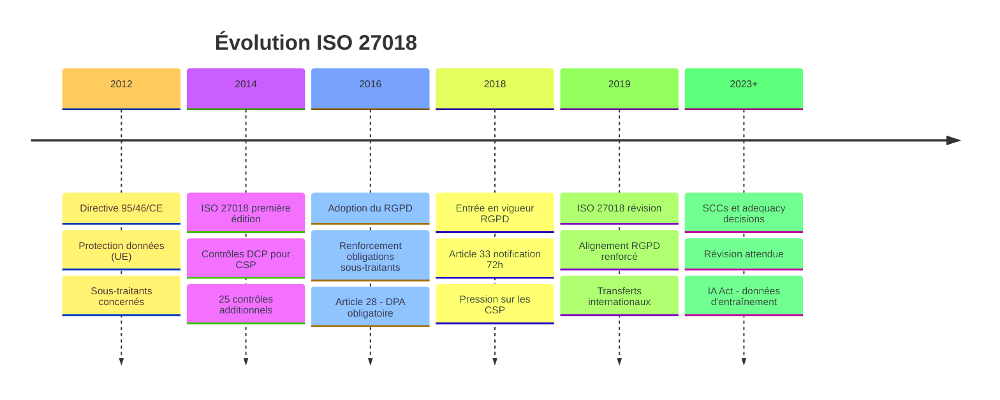
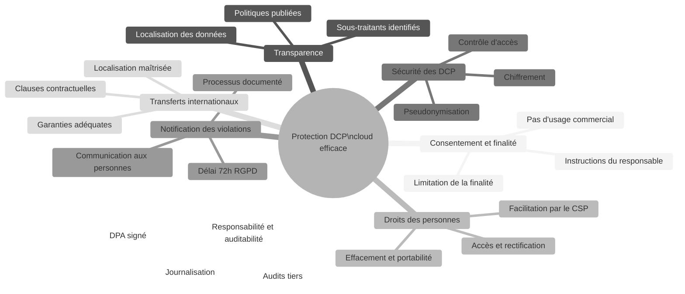
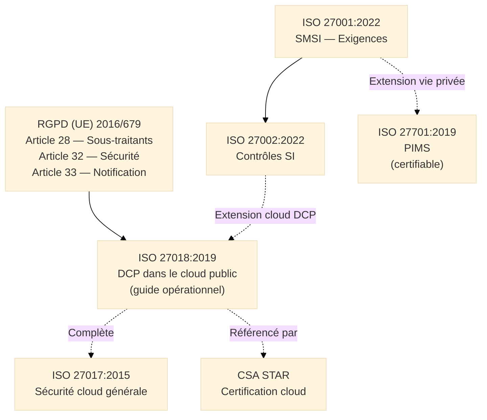
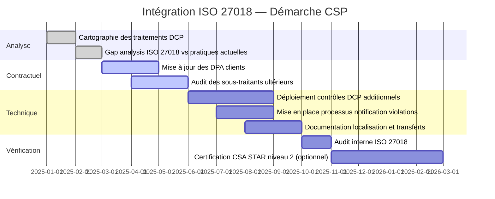

# ISO/IEC 27018:2019 — Protection des Données Personnelles dans le Cloud Public

## Introduction à la Protection des DCP dans le Cloud

!!! quote "Analogie pédagogique"
    _Imaginez un **cabinet d'avocats** qui confie la gestion de ses archives physiques à une société de stockage spécialisée. Les archives contiennent des dossiers clients extrêmement sensibles — des données protégées par le secret professionnel. La société de stockage a accès aux locaux, aux étagères, aux boîtes — mais elle ne peut pas ouvrir les dossiers, en faire des copies, en communiquer le contenu à des tiers, ni les utiliser pour ses propres besoins commerciaux. Si le cabinet demande la destruction de certains dossiers, la société s'exécute et le prouve. Si un dossier est égaré ou consulté sans autorisation, elle le signale immédiatement. **ISO 27018 formalise exactement ces règles** pour les fournisseurs cloud qui stockent et traitent des données personnelles pour le compte de leurs clients : transparence totale, usage strictement limité à la prestation de service, aucune commercialisation des données, notification immédiate en cas d'incident, et capacité à prouver tout cela de manière auditée._

**ISO/IEC 27018:2019** est le **guide international de protection des données à caractère personnel (DCP[^1]) dans les clouds publics**. Il est spécifiquement conçu pour les **fournisseurs de services cloud publics agissant comme sous-traitants**[^2] de données personnelles pour le compte de leurs clients.

ISO 27018 étend ISO 27002 en ajoutant des contrôles et des orientations centrés sur la protection des DCP, fortement alignés avec les principes du RGPD[^3] européen — bien qu'il soit antérieur à son entrée en vigueur. Il constitue une déclinaison sectorielle des principes de protection des données personnelles applicés à l'infrastructure cloud.

!!! info "Pourquoi ISO 27018 est essentiel ?"
    Le cloud public a profondément transformé la relation entre les organisations et leurs sous-traitants de traitement. Un CSP qui héberge des données personnelles pour le compte d'un client est un **sous-traitant au sens du RGPD** — avec les obligations légales qui s'y attachent. ISO 27018 fournit le cadre opérationnel qui traduit ces obligations juridiques en contrôles de sécurité concrets, vérifiables et auditables.

 

---

## Pour repartir des bases

### 1. Un guide non certifiable mais contractuellement structurant

ISO 27018 est un **code de bonnes pratiques** — ses formulations sont conseillantes ("devrait") et non normatives ("doit"). Il n'est pas certifiable de manière autonome.

Son rôle opérationnel est néanmoins central à plusieurs titres :

- **Pour les CSP** : démontrer aux clients que leur infrastructure répond aux exigences de sous-traitance RGPD, structurer leur offre DPA[^4] et justifier leur position dans les registres de traitement des clients
- **Pour les CSC** : évaluer les fournisseurs cloud au regard des obligations RGPD de l'article 28, vérifier que le CSP offre les garanties suffisantes

> La certification **CSA STAR** niveau 2 et plusieurs programmes nationaux (dont certaines déclinaisons de SecNumCloud) référencent ISO 27018 comme attendu complémentaire à ISO 27001 pour les CSP traitant des données personnelles.

### 2. La distinction responsable de traitement / sous-traitant

ISO 27018 s'adresse spécifiquement aux CSP agissant comme **sous-traitants** au sens du RGPD — pas comme responsables de traitement[^5] :

| Rôle | Qui ? | Responsabilité principale |
|------|-------|--------------------------|
| **Responsable de traitement** | Le client cloud (CSC) | Définit la finalité et les moyens du traitement — responsable vis-à-vis des personnes concernées |
| **Sous-traitant** | Le fournisseur cloud (CSP) | Traite les données pour le compte du responsable, selon ses instructions — responsable de la sécurité technique |

> ISO 27018 couvre exclusivement le périmètre du **sous-traitant** (CSP). Il ne couvre pas les obligations du responsable de traitement (CSC) — qui relèvent d'ISO 27701 et du RGPD directement.

### 3. Alignement avec les principes RGPD

ISO 27018 anticipe et formalise les principaux principes du RGPD appliqués aux sous-traitants cloud :

| Principe RGPD | Contrôle ISO 27018 correspondant |
|---------------|----------------------------------|
| Licéité et finalité | Le CSP ne traite les DCP que selon les instructions du responsable |
| Minimisation | Le CSP n'utilise pas les DCP à des fins commerciales propres |
| Transparence | Le CSP publie ses politiques de traitement et les pays où les données transitent |
| Sécurité | Contrôles de sécurité étendus d'ISO 27002 appliqués aux DCP |
| Droits des personnes | Le CSP facilite l'exercice des droits (accès, effacement, portabilité) |
| Responsabilité | Journalisation, DPA, notification des violations dans les délais |

 

---

## Historique et évolutions

### Pourquoi ISO 27018 a été créée ?

Avant 2014 (première édition), les organisations qui confiaient des données personnelles à des CSP ne disposaient d'aucun référentiel standardisé pour évaluer si ces CSP respectaient les principes de protection des données :

- La directive européenne 95/46/CE (précurseur du RGPD) imposait des obligations aux sous-traitants sans fournir de guide opérationnel pour les CSP
- Chaque CSP produisait ses propres engagements contractuels (DPA) sans référentiel commun, rendant les comparaisons impossibles
- Les régulateurs data protection (CNIL, ICO, etc.) manquaient de référentiels techniques pour évaluer les garanties cloud

### Les deux versions majeures

=== "ISO/IEC 27018:2014 — Fondation"

    **Contexte :**  
    _Publiée en août 2014 — avant l'adoption du RGPD (2016) et son entrée en vigueur (2018). Premier guide international dédié à la protection des données personnelles dans le cloud public._

    **Innovations majeures :**

    - [x] Premier référentiel international de protection des DCP pour les CSP
    - [x] Contrôles spécifiques au traitement des DCP par des sous-traitants cloud
    - [x] Alignement sur les principes de la directive 95/46/CE (futur RGPD)
    - [x] 25 contrôles additionnels au-delà d'ISO 27002
    - [x] Référencé par le programme **CSA STAR** comme extension DCP

=== "ISO/IEC 27018:2019 — Mise à jour"

    **Contexte :**  
    _Révision publiée en janvier 2019 — après l'entrée en vigueur du RGPD (mai 2018). Mise à jour pour renforcer l'alignement avec le RGPD._

    **Évolutions clés :**

    - [x] Renforcement de l'alignement avec le **RGPD** (articles 28, 32, 33, 34)
    - [x] Clarifications sur les **transferts internationaux** de DCP
    - [x] Renforcement des exigences de **notification des violations** (cohérence avec l'article 33 RGPD)
    - [x] Clarifications sur les **droits des personnes concernées** dans le contexte cloud
    - [x] Mise à jour des références normatives

### Timeline ISO 27018

_La version 2019 a été publiée un an après l'entrée en vigueur du RGPD pour intégrer les nouvelles obligations sur la notification des violations et les transferts internationaux._

 

---

## Les 7 concepts fondateurs

ISO 27018:2019 repose sur **7 concepts fondateurs** qui structurent la philosophie de protection des données personnelles dans les clouds publics.

!!! note "Des concepts centrés sur les droits des personnes"
    Ces concepts reflètent la philosophie des lois de protection des données personnelles (RGPD en tête) appliquée au contexte technique des infrastructures cloud. Ils sont plus proches du droit que de la technique pure — ce qui distingue ISO 27018 de tous les autres guides de la famille 27000.

### Vue d'ensemble

### Les 7 concepts expliqués

!!! note "Ci-dessous les 4 premiers concepts"

=== "1️⃣ Consentement et limitation de la finalité"

    **Le CSP ne traite les DCP que selon les instructions documentées du responsable de traitement — jamais pour ses propres fins.**

    C'est la règle cardinale d'ISO 27018 et de l'article 28 du RGPD. Elle se décline en plusieurs interdictions explicites :

    - **Pas d'usage commercial des DCP** :  
      _Le CSP ne peut pas utiliser les données personnelles hébergées pour cibler des publicités, améliorer ses propres services ou les vendre à des tiers — même sous forme agrégée et anonymisée._

    - **Traitement limité aux instructions du responsable** :  
      _Le CSP ne peut traiter les DCP que pour les finalités définies dans le contrat de service (DPA[^4]). Toute demande de traitement hors instructions doit être refusée ou soumise à accord explicite._

    - **Consentement explicite requis pour tout usage secondaire** :  
      _Si le CSP souhaite utiliser des DCP à une fin autre que la prestation de service (ex : amélioration de ses modèles d'IA), il doit obtenir le consentement préalable et explicite du responsable de traitement._

    !!! warning "Point de vigilance contractuel"
        Les CGU de nombreux CSP contiennent des clauses d'utilisation des données à des fins d'amélioration des services. Ces clauses peuvent constituer un traitement à des fins propres incompatible avec l'article 28 RGPD et les exigences d'ISO 27018. Vérifier systématiquement le DPA, pas uniquement les CGU.

=== "2️⃣ Transparence"

    **Le CSP publie et maintient à jour les informations permettant au responsable de traitement de comprendre comment et où ses données sont traitées.**

    - **Politiques de traitement publiées** :  
      _Politique de protection des données, conditions de traitement des DCP, durées de conservation, processus de suppression._

    - **Localisation géographique des données** :  
      _Le CSP informe le responsable des pays où les données peuvent être stockées, traitées ou sauvegardées — y compris les sous-traitants du CSP._

    - **Identification des sous-traitants ultérieurs**[^6] :  
      _Tout sous-traitant du CSP qui accède aux DCP du responsable doit être identifié et notifié. Le responsable dispose d'un droit d'opposition aux changements de sous-traitants._

    - **Modification des politiques** :  
      _Le CSP notifie le responsable de toute modification substantielle de ses politiques de traitement avec un délai suffisant pour permettre d'exercer un droit d'opposition._

=== "3️⃣ Droits des personnes concernées"

    **Le CSP met en place les mécanismes techniques permettant au responsable de traitement d'honorer les droits des personnes concernées.**

    ISO 27018 reconnaît que le CSP ne peut généralement pas exercer directement les droits des personnes — c'est la responsabilité du responsable de traitement (le client cloud). Mais il doit fournir les moyens techniques pour y répondre :

    - **Droit d'accès** :  
      _Capacité d'exporter les données d'une personne spécifique dans un format lisible et structuré._

    - **Droit à l'effacement** :  
      _Capacité de supprimer irréversiblement toutes les données d'une personne, y compris les sauvegardes et répliques — et de le prouver._

    - **Droit à la portabilité** :  
      _Export des données dans un format interopérable permettant leur transfert vers un autre responsable ou un autre CSP._

    - **Droit de rectification** :  
      _Capacité de modifier des données inexactes dans les systèmes du CSP selon les instructions du responsable._

=== "4️⃣ Sécurité des données personnelles"

    **Les DCP bénéficient de contrôles de sécurité spécifiques, allant au-delà des contrôles génériques d'ISO 27002.**

    - **Chiffrement au repos et en transit** :  
      _Les DCP sont chiffrées en transit (TLS 1.2+) et au repos (AES-256 minimum). La gestion des clés est documentée et le CSC peut opter pour le BYOK[^7] pour les données les plus sensibles._

    - **Pseudonymisation**[^8] :  
      _Pour les traitements ne nécessitant pas l'identification directe, les DCP sont pseudonymisées afin de limiter les risques en cas d'accès non autorisé._

    - **Contrôle d'accès granulaire** :  
      _Principe du moindre privilège appliqué aux équipes du CSP ayant accès aux systèmes hébergeant des DCP. Aucun accès aux données en clair sans autorisation documentée._

    - **Séparation des environnements** :  
      _Les données de production contenant des DCP réelles ne sont jamais utilisées dans les environnements de développement ou de test._

!!! note "Ci-dessous les 3 derniers concepts"

=== "5️⃣ Notification des violations de données"

    **Le CSP dispose d'un processus documenté pour détecter et notifier les violations de données personnelles dans les délais requis par le RGPD.**

    L'article 33 du RGPD impose au sous-traitant de notifier le responsable de traitement **sans délai indu** dès la prise de connaissance d'une violation — permettant au responsable de respecter son propre délai de 72h vis-à-vis de l'autorité de contrôle.

    **Processus ISO 27018 attendu :**

    - **Détection** :  
      _Mécanismes de surveillance permettant de détecter les accès non autorisés, exfiltrations ou destructions de DCP._

    - **Qualification** :  
      _Processus d'évaluation de la gravité de l'incident et de sa qualification en violation de données personnelles au sens du RGPD._

    - **Notification au responsable** :  
      _Canal de notification dédié, délai contractualisé, informations minimales à fournir (nature, catégories de données, personnes concernées, mesures prises)._

    - **Assistance** :  
      _Le CSP assiste le responsable dans la gestion de la violation : informations complémentaires, logs, mesures correctives._

    !!! warning "Délai critique"
        Le délai de 72h court à partir du moment où le **responsable de traitement** (le client cloud) a connaissance de la violation. Si le CSP détecte une violation et tarde à notifier son client, le client risque de dépasser le délai réglementaire sans en avoir été informé. Les délais de notification CSP → CSC doivent être contractualisés dans le DPA.

=== "6️⃣ Transferts internationaux de données"

    **Le CSP garantit que tout transfert de DCP vers des pays hors EEE[^9] repose sur des garanties adéquates.**

    L'article 46 du RGPD impose que les transferts de données personnelles hors EEE s'appuient sur des mécanismes de transfert appropriés :

    - **Clauses contractuelles types (SCCs)**[^10] :  
      _Mécanisme de transfert le plus utilisé. Le CSP s'engage à respecter les SCCs publiées par la Commission européenne pour les transferts vers ses sous-traitants hors EEE._

    - **Décisions d'adéquation** :  
      _Pour les pays reconnus adéquats par la Commission (États-Unis via le Data Privacy Framework, Japon, Corée du Sud...), les transferts sont autorisés sans mécanisme complémentaire._

    - **Localisation des données** :  
      _Pour les données soumises à des restrictions géographiques réglementaires (données de santé, données de défense, données judiciaires), le CSP garantit contractuellement que les données ne quittent pas la zone géographique définie._

    - **Registre des sous-traitants ultérieurs** :  
      _Le CSP maintient et communique la liste de ses sous-traitants hors EEE accédant aux DCP, avec les garanties de transfert applicables._

=== "7️⃣ Responsabilité et auditabilité"

    **Le CSP peut démontrer la conformité de ses pratiques de traitement des DCP à toute autorité de contrôle ou client qui en fait la demande.**

    - **DPA signé** :  
      _Tout traitement de DCP est encadré par un Data Processing Agreement conforme à l'article 28 RGPD, signé entre le CSP et chaque client._

    - **Journalisation des accès aux DCP** :  
      _Toute opération sur les DCP (accès, modification, suppression) par le personnel du CSP est journalisée, avec horodatage et identité de l'intervenant._

    - **Audits et certifications tiers** :  
      _Le CSP se soumet à des audits de conformité réguliers (ISO 27001, SOC 2 Type II, CSA STAR) et met les rapports à disposition des clients dans les conditions du DPA._

    - **Registre des traitements** :  
      _Le CSP maintient son propre registre des activités de traitement réalisées pour le compte de ses clients, conformément à l'article 30 RGPD._

 

---

## Les contrôles spécifiques d'ISO 27018

### Les contrôles DCP additionnels

ISO 27018 ajoute **25 contrôles** au-delà d'ISO 27002, organisés en catégories thématiques. Les plus structurants :

??? abstract "Consentement et instructions (A.1)"

    | Contrôle | Description |
    |----------|-------------|
    | **A.1.1** | Le CSP ne traite les DCP que sur instruction documentée du responsable de traitement |
    | **A.1.2** | Le CSP informe le responsable si une instruction lui semble contraire à la réglementation |

??? abstract "Usage commercial des DCP (A.2)"

    | Contrôle | Description |
    |----------|-------------|
    | **A.2.1** | Les DCP ne sont pas utilisées à des fins de marketing ou de publicité sans consentement explicite |
    | **A.2.2** | Les DCP ne sont pas vendues ou communiquées à des tiers à des fins commerciales |

??? abstract "Transparence et information (A.3)"

    | Contrôle | Description |
    |----------|-------------|
    | **A.3.1** | Le CSP publie ses politiques de traitement et de suppression des DCP |
    | **A.3.2** | Le CSP communique la liste des pays où les DCP peuvent être stockées ou traitées |
    | **A.3.3** | Le CSP informe le responsable des changements de sous-traitants ultérieurs |

??? abstract "Droits des personnes (A.4)"

    | Contrôle | Description |
    |----------|-------------|
    | **A.4.1** | Le CSP met à disposition les mécanismes pour traiter les demandes de droits (accès, rectification, effacement) |
    | **A.4.2** | Le CSP ne divulgue pas les DCP à des tiers (autorités incluses) sans instruction du responsable, sauf obligation légale |

??? abstract "Notification des violations (A.9)"

    | Contrôle | Description |
    |----------|-------------|
    | **A.9.1** | Le CSP dispose d'un processus de détection et de notification des violations de données personnelles |
    | **A.9.2** | Le CSP notifie le responsable sans délai indu et fournit les informations nécessaires |

 

---

## Articulation avec d'autres normes et réglementations

### Positionnement d'ISO 27018

_ISO 27018 est positionné à l'intersection du droit (RGPD) et de la technique (ISO 27002). Il traduit les obligations légales du sous-traitant en contrôles opérationnels vérifiables. ISO 27701 va plus loin en proposant un système de management certifiable pour la protection de la vie privée._

### Comparaison avec les normes de protection des données

| Norme / Réglementation | Portée | Relation avec ISO 27018 | Certifiable |
|------------------------|--------|------------------------|-------------|
| **RGPD** | Protection données (UE) | ISO 27018 traduit l'art. 28 en contrôles opérationnels | Réglementaire |
| **ISO 27701:2019** | PIMS — Management vie privée | Extension certifiable d'ISO 27001 plus complète | Oui |
| **ISO 27017:2015** | Sécurité cloud (technique) | Complémentaire — couvre la sécurité, ISO 27018 couvre les DCP | Non |
| **CSA CCM v4** | Cloud Controls Matrix | Intègre des contrôles DCP alignés ISO 27018 | Via CSA STAR |
| **SOC 2 (Type II)** | Contrôles cloud (USA) | Compatible, critères "Privacy" alignés | Oui (rapport) |
| **HIPAA** | Données santé (USA) | Complémentaire — spécifique au secteur santé américain | Réglementaire |

### ISO 27018 vs ISO 27701 : choisir le bon référentiel

| Critère | ISO 27018 | ISO 27701 |
|---------|-----------|-----------|
| **Portée** | CSP cloud public — sous-traitants | Toute organisation — RT et ST |
| **Certifiable** | Non | Oui (extension ISO 27001) |
| **Périmètre** | DCP dans le cloud public uniquement | Tout traitement de données personnelles |
| **Profondeur** | Guide opérationnel ciblé | Système de management complet |
| **Usage recommandé** | Audit fournisseur cloud, DPA, CSA STAR | Certification de conformité RGPD |

> ISO 27018 et ISO 27701 sont **complémentaires, pas concurrents**. Un CSP peut implémenter ISO 27018 (guide opérationnel cloud) et ISO 27701 (système de management certifiable) simultanément — les deux se renforcent mutuellement.

 

---

## Bénéfices de l'approche ISO 27018

### Pour les fournisseurs cloud (CSP)

-   :lucide-award:{ .lg .middle } **Démonstration de conformité RGPD sous-traitant**

    ---
    ISO 27018 fournit la preuve documentée que le CSP offre les "garanties suffisantes" exigées par l'article 28 RGPD pour tout responsable de traitement souhaitant le sélectionner comme sous-traitant.

-   :lucide-handshake:{ .lg .middle } **Structuration des DPA**

    ---
    Les contrôles ISO 27018 alimentent directement les clauses des Data Processing Agreements, rendant les négociations contractuelles plus rapides et les engagements plus précis.

### Pour les clients cloud (CSC)

-   :lucide-search:{ .lg .middle } **Grille d'évaluation des CSP**

    ---
    ISO 27018 fournit une liste structurée de contrôles à vérifier lors des audits de sous-traitants cloud au titre de l'article 28 RGPD — pas uniquement les CSP mais tout prestataire hébergeant des DCP.

-   :lucide-shield-check:{ .lg .middle } **Réduction du risque de non-conformité RGPD**

    ---
    Un CSP aligné sur ISO 27018 réduit significativement le risque d'amende RGPD pour le responsable de traitement lié à une défaillance du sous-traitant sur la sécurité des données personnelles.

-   :lucide-file-check:{ .lg .middle } **Simplification du registre des traitements**

    ---
    Les informations fournies par un CSP conforme ISO 27018 (localisation, sous-traitants, mesures de sécurité) alimentent directement les entrées du registre des traitements du responsable.

 

---

## Mise en œuvre pratique

### Étapes clés d'intégration dans un dispositif RGPD/SMSI

### Écueils à éviter

!!! warning "Pièges courants"

    **Confondre ISO 27018 et ISO 27701 :**  
    _ISO 27018 est un guide ciblé sur les CSP cloud public sous-traitants. ISO 27701 est un système de management certifiable applicable à toute organisation. Un responsable de traitement ne s'appuie pas sur ISO 27018 pour ses propres obligations — il utilise ISO 27701._

    **Croire que la conformité ISO 27018 garantit la conformité RGPD :**  
    _ISO 27018 contribue à la conformité RGPD article 28 mais ne la garantit pas entièrement. Il doit être complété par un DPA conforme, une analyse des transferts internationaux et une évaluation des droits des personnes._

    **Négliger les sous-traitants ultérieurs du CSP :**  
    _Un CSP conforme ISO 27018 qui sous-traite le stockage à un tiers hors EEE sans garantie adéquate crée une violation de données en chaîne. La gestion des sous-traitants ultérieurs est un point d'audit systématique._

    **Ne pas contractualiser les délais de notification :**  
    _ISO 27018 exige une notification "sans délai indu". Sans délai contractualisé dans le DPA (ex : 24h pour notifier le responsable), le CSP peut interpréter cette formulation largement et priver le responsable de temps pour sa propre notification à l'autorité (72h RGPD)._

 

---

## Conclusion

!!! quote "Les données personnelles ne s'hébergent pas — elles se confient."
    ISO 27018:2019 incarne une évolution fondamentale dans la perception des services cloud : un CSP qui héberge des données personnelles n'est pas un simple prestataire technique — il est un acteur de la chaîne de conformité RGPD, avec des obligations légales propres et des responsabilités opposables vis-à-vis des personnes concernées et des autorités de contrôle.

    Les 25 contrôles additionnels d'ISO 27018 ne sont pas des contraintes bureaucratiques : ils formalisent ce que toute personne raisonnable attendrait d'un sous-traitant digne de confiance — ne pas utiliser vos données à ses propres fins, vous informer si vos données transitent dans un pays tiers, vous prévenir immédiatement en cas d'incident, et supprimer irréversiblement vos données quand vous mettez fin au contrat. Ces engagements, rendus vérifiables et auditables par ISO 27018, transforment des promesses commerciales en obligations contractuelles défendables.

    Dans un contexte européen où les transferts de données vers les États-Unis continuent d'être scrutés par les autorités de contrôle (Schrems II et ses suites), où l'AI Act impose de nouvelles obligations sur les données d'entraînement des modèles, et où NIS2 étend les obligations de sécurité aux prestataires cloud des secteurs essentiels, ISO 27018 est devenu un référentiel incontournable pour tout CSP opérant sur le marché européen.

    > La prochaine étape logique est d'explorer **ISO 27701** — l'extension certifiable d'ISO 27001 qui permet de construire un Système de Management de la Protection de la Vie Privée (PIMS) couvrant à la fois les responsables de traitement et les sous-traitants, avec une portée plus large qu'ISO 27018.

 

---

## Ressources complémentaires

### Documents officiels ISO

- **ISO/IEC 27018:2019** — Code de bonnes pratiques pour la protection des DCP dans le cloud public
- **ISO/IEC 27017:2015** — Contrôles de sécurité pour les services cloud
- **ISO/IEC 27701:2019** — Système de management de la vie privée (PIMS)
- **ISO/IEC 27001:2022** — Exigences du SMSI

### Réglementations clés

- **RGPD** : Règlement (UE) 2016/679 — articles 28, 30, 32, 33, 44-49
- **Décision d'adéquation UE-États-Unis** : Data Privacy Framework (2023)
- **Clauses contractuelles types** : Décision 2021/914/UE

### Référentiels complémentaires

- **CSA CCM v4** : Cloud Controls Matrix (cloudsecurityalliance.org)
- **EDPB Guidelines** : Lignes directrices du Comité Européen de la Protection des Données

### Organismes de référence

- **CNIL** : cnil.fr — recommandations cloud et sous-traitance
- **EDPB** : edpb.europa.eu — guidelines RGPD applicables aux CSP
- **ANSSI** : cyber.gouv.fr — SecNumCloud et données sensibles
- **CSA France** : cloudsecurityalliance.org/fr

[^1]: Les **DCP** (*Données à Caractère Personnel*, ou *PII — Personally Identifiable Information* en anglais) désignent toute information permettant d'identifier directement ou indirectement une personne physique : nom, adresse IP, e-mail, identifiant de cookie, données biométriques, données de santé, etc. Le RGPD encadre strictement leur traitement.
[^2]: Un **sous-traitant** au sens du RGPD (article 4) est la personne physique ou morale qui traite des données personnelles pour le compte et sur instruction du responsable de traitement. Le CSP qui héberge des données personnelles de clients d'une entreprise est sous-traitant de cette entreprise (qui est le responsable de traitement).
[^3]: Le **RGPD** (*Règlement Général sur la Protection des Données*, Règlement UE 2016/679) est le cadre juridique européen de protection des données personnelles applicable depuis le 25 mai 2018. Il impose des obligations aux responsables de traitement et à leurs sous-traitants, avec des sanctions pouvant atteindre 4% du chiffre d'affaires mondial ou 20 millions d'euros.
[^4]: Un **DPA** (*Data Processing Agreement*, ou Accord de Traitement des Données) est le contrat obligatoire entre un responsable de traitement et son sous-traitant, exigé par l'article 28 du RGPD. Il définit l'objet, la durée, la nature et la finalité du traitement, les catégories de données et les obligations du sous-traitant.
[^5]: Un **responsable de traitement** au sens du RGPD (article 4) est la personne physique ou morale qui détermine les finalités et les moyens du traitement des données personnelles. Dans le contexte cloud, c'est le client du CSP (CSC) qui détermine pourquoi les données sont collectées et comment elles sont utilisées — il est donc responsable vis-à-vis des personnes concernées et des autorités de contrôle.
[^6]: Un **sous-traitant ultérieur** est un prestataire auquel le sous-traitant principal (le CSP) fait appel pour exécuter tout ou partie de la prestation impliquant des données personnelles. Exemples : le CSP AWS qui sous-traite une partie de son infrastructure à des fournisseurs de centres de données, ou un CSP SaaS qui utilise AWS comme infrastructure.
[^7]: Le **BYOK** (*Bring Your Own Key*, ou apportez votre propre clé) est un modèle de chiffrement cloud où le client cloud (CSC) gère ses propres clés de chiffrement — dans un HSM qu'il contrôle — et les fournit au CSP uniquement pour les opérations de chiffrement. Ce modèle garantit que le CSP ne peut jamais accéder aux données en clair sans la coopération active du CSC, même sur ordre d'une autorité gouvernementale.
[^8]: La **pseudonymisation** est une technique de protection des données qui consiste à remplacer les identifiants directs (nom, numéro de sécurité sociale) par un pseudonyme — un identifiant artificiel qui ne permet pas d'identifier la personne sans une clé de correspondance maintenue séparément. Elle réduit les risques en cas d'accès non autorisé mais ne constitue pas une anonymisation complète (la ré-identification reste possible avec la clé).
[^9]: L'**EEE** (*Espace Économique Européen*) comprend les 27 États membres de l'Union Européenne plus la Norvège, l'Islande et le Liechtenstein. Le RGPD s'applique à l'ensemble de l'EEE. Tout transfert de données personnelles vers un pays hors EEE nécessite un mécanisme de transfert approprié (décision d'adéquation, SCCs, BCRs) sauf exceptions limitées.
[^10]: Les **SCCs** (*Standard Contractual Clauses*, ou Clauses Contractuelles Types) sont des clauses contractuelles standardisées adoptées par la Commission européenne permettant des transferts de données personnelles hors EEE. Les clauses actuellement en vigueur (Décision 2021/914/UE) couvrent plusieurs scenarios : responsable → responsable, responsable → sous-traitant, sous-traitant → sous-traitant, etc.